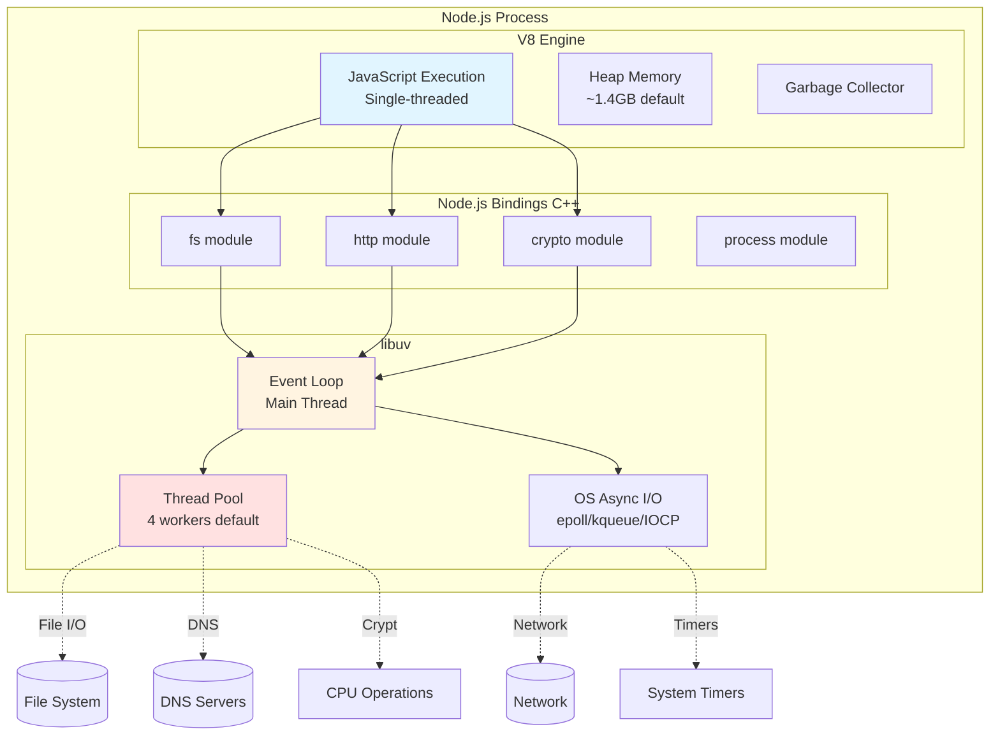
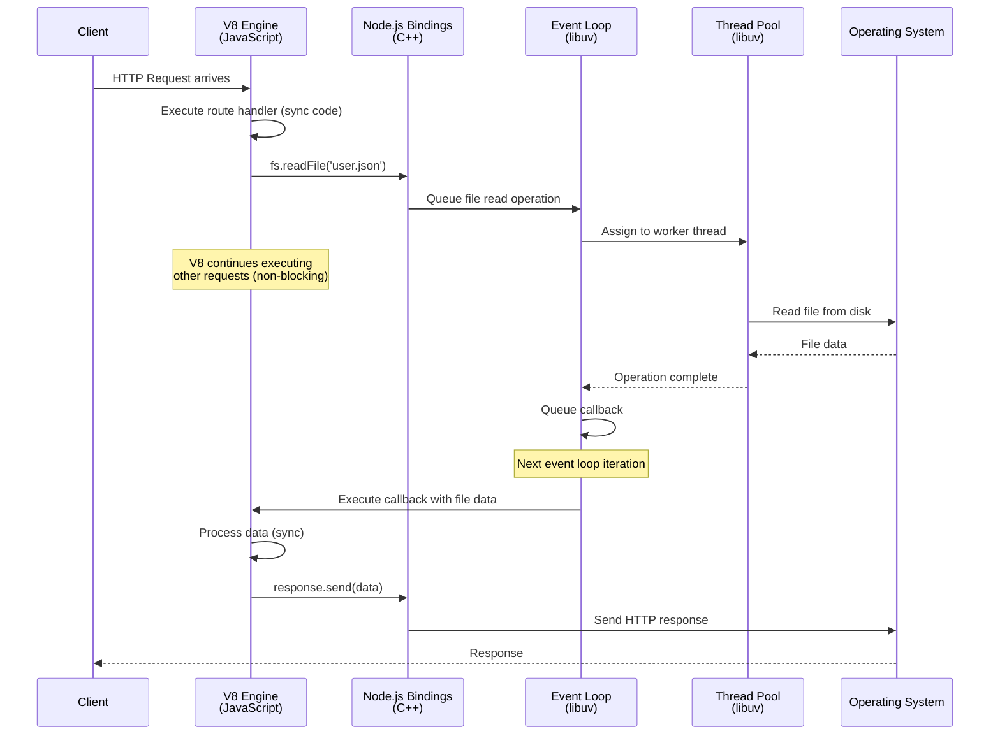
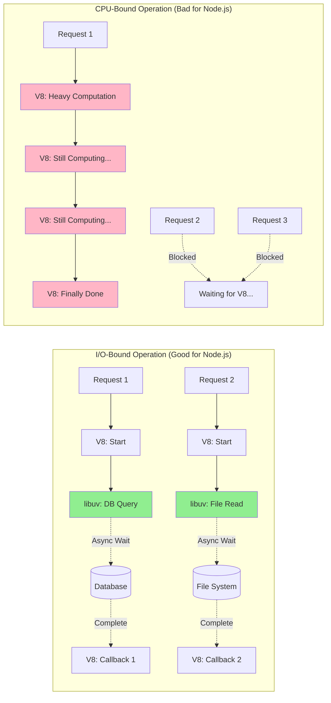
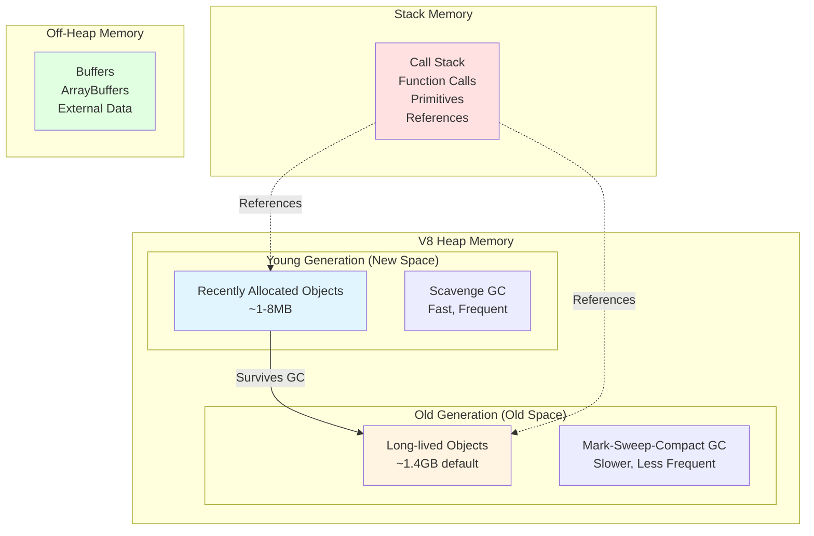

# Node.js Architecture (C++ + V8 + libuv)

## 1. Why this exists (Real-world problem first)

Imagine you're debugging a production incident at 2 AM. Your Node.js API is handling 10,000 requests per second just fine, but suddenly, response times spike from 50ms to 5 seconds. CPU usage is at 100%, but you're not doing any heavy computation. What's happening?

Without understanding Node.js architecture, you're flying blind. You might blame "Node.js being single-threaded" or "JavaScript being slow," but the real issue is often a fundamental misunderstanding of how Node.js actually works under the hood.

**Real production failures that stem from architectural ignorance:**

1. **The Blocking Code Disaster**: A developer adds `fs.readFileSync()` to read a 5MB config file on every request. The entire server freezes for 200ms per request. At 100 concurrent requests, your API is effectively dead.

2. **The CPU-Bound Catastrophe**: A payment processing service runs bcrypt password hashing (CPU-intensive) on the main thread. Each hash takes 100ms. With 50 concurrent login attempts, the event loop is blocked for 5 seconds, causing timeouts across the entire application.

3. **The Memory Leak Mystery**: An e-commerce platform's Node.js service crashes every 6 hours. The team doesn't understand V8's heap limits or garbage collection, so they keep restarting the service instead of fixing the root cause.

**What breaks without this knowledge:**
- You can't distinguish between I/O-bound and CPU-bound bottlenecks
- You can't explain why your "single-threaded" Node.js handles thousands of concurrent connections
- You can't debug performance issues or memory leaks effectively
- You can't make informed architectural decisions about when to use Node.js vs other runtimes

## 2. Mental model (build imagination)

Think of Node.js as a **restaurant with a very specific operating model**:

### The Restaurant Analogy

**V8 (JavaScript Engine) = The Kitchen**
- This is where all your JavaScript code actually executes
- It has a single chef (single-threaded execution)
- The chef is incredibly fast at preparing dishes (optimized JIT compilation)
- The kitchen has limited counter space (heap memory limits)
- There's a garbage collector who cleans up used plates and ingredients

**libuv (I/O Layer) = The Waitstaff & External Services**
- Waiters take orders and deliver them to external services (file system, network, databases)
- They don't wait around blocking the kitchen while food cooks elsewhere
- They use a thread pool for certain heavy tasks (like kneading dough = file I/O)
- They notify the kitchen when external orders are ready

**Event Loop = The Expediter/Coordinator**
- Stands between the kitchen and waitstaff
- Constantly checks: "What's ready to be cooked next?"
- Prioritizes urgent orders (microtasks) over regular orders (macrotasks)
- Never lets the chef stand idle if there's work to do

**The Flow:**
1. Customer order comes in (HTTP request)
2. Chef quickly prepares what can be done immediately (synchronous code)
3. If something needs external work (database query), the waiter handles it
4. Chef moves to the next order immediately (non-blocking)
5. When the waiter returns with results, the expediter queues it for the chef
6. Chef finishes the dish and sends response

**Why this works:**
- The chef never waits around doing nothing
- External I/O happens in parallel (multiple waiters)
- The kitchen handles one thing at a time, but switches tasks incredibly fast
- Thousands of orders can be "in progress" even though only one is being actively cooked

**Why this breaks:**
- If the chef starts doing waiter work (synchronous I/O), the entire kitchen stops
- If the chef gets stuck on a complex task (CPU-intensive work), all other orders wait
- If the kitchen counter overflows (memory leak), the restaurant shuts down

## 3. How Node.js implements this internally

Node.js is built on three foundational layers that work together:

### Layer 1: V8 JavaScript Engine (The Execution Core)

**What it is:**
- Google's open-source JavaScript engine (same one in Chrome)
- Written in C++
- Compiles JavaScript to native machine code using JIT (Just-In-Time) compilation

**What it does:**
- Executes your JavaScript code
- Manages memory (heap and stack)
- Performs garbage collection
- Provides the JavaScript runtime environment

**Key characteristics:**
- **Single-threaded execution**: Only one call stack, one heap
- **Heap size limits**: Default ~1.4GB on 64-bit systems (configurable with `--max-old-space-size`)
- **Generational GC**: Young generation (short-lived objects) and old generation (long-lived objects)

**Common misconception:**
"Node.js is single-threaded" is technically wrong. V8's JavaScript execution is single-threaded, but Node.js as a whole uses multiple threads via libuv.

### Layer 2: libuv (The I/O Abstraction Layer)

**What it is:**
- Cross-platform C library for asynchronous I/O
- Provides the event loop
- Abstracts OS-specific I/O operations

**What it does:**
- Manages the event loop (the heart of Node.js)
- Handles asynchronous I/O operations
- Provides a thread pool for operations that can't be done asynchronously at the OS level
- Manages timers, signals, and child processes

**Key components:**

1. **Event Loop**: The coordination mechanism that orchestrates everything
2. **Thread Pool**: Default 4 threads (configurable via `UV_THREADPOOL_SIZE`)
   - Used for: file I/O, DNS lookups, some crypto operations, compression
   - NOT used for: network I/O (uses OS-level async APIs)

3. **Platform-specific I/O APIs**:
   - Linux: epoll
   - macOS: kqueue
   - Windows: IOCP (I/O Completion Ports)

**Common misconception:**
"All I/O in Node.js uses the thread pool" is wrong. Network I/O uses OS-level async APIs and doesn't touch the thread pool. Only certain operations (file I/O, DNS, crypto) use the thread pool.

### Layer 3: Node.js Bindings (The Glue)

**What it is:**
- C++ code that connects V8 and libuv
- Provides Node.js-specific APIs (fs, http, crypto, etc.)
- Exposes native functionality to JavaScript

**What it does:**
- Wraps libuv functionality in JavaScript-accessible APIs
- Manages the handoff between JavaScript and C++
- Implements Node.js core modules

**Example flow for `fs.readFile()`:**

```
JavaScript: fs.readFile('data.txt', callback)
    ↓
Node.js Bindings: Convert JS arguments to C++ types
    ↓
libuv: Queue file read operation on thread pool
    ↓
Thread Pool Worker: Perform actual file system read
    ↓
libuv: Operation complete, queue callback on event loop
    ↓
Event Loop: Execute callback on next iteration
    ↓
V8: Execute JavaScript callback function
```

### How They Work Together

```
┌─────────────────────────────────────────┐
│         Your JavaScript Code            │
│   (Business Logic, API Handlers)        │
└──────────────┬──────────────────────────┘
               │
               ▼
┌─────────────────────────────────────────┐
│              V8 Engine                  │
│  ┌─────────────────────────────────┐   │
│  │      Call Stack                 │   │
│  │  (Executing JavaScript)         │   │
│  └─────────────────────────────────┘   │
│  ┌─────────────────────────────────┐   │
│  │      Heap Memory                │   │
│  │  (Objects, Closures, Data)      │   │
│  └─────────────────────────────────┘   │
└──────────────┬──────────────────────────┘
               │
               ▼
┌─────────────────────────────────────────┐
│        Node.js Bindings (C++)           │
│  (fs, http, crypto, process, etc.)      │
└──────────────┬──────────────────────────┘
               │
               ▼
┌─────────────────────────────────────────┐
│             libuv                       │
│  ┌─────────────────────────────────┐   │
│  │       Event Loop                │   │
│  │  (Orchestrates everything)      │   │
│  └─────────────────────────────────┘   │
│  ┌─────────────────────────────────┐   │
│  │      Thread Pool (4 threads)    │   │
│  │  (File I/O, DNS, Crypto)        │   │
│  └─────────────────────────────────┘   │
│  ┌─────────────────────────────────┐   │
│  │    OS Async I/O APIs            │   │
│  │  (Network, Timers, Signals)     │   │
│  └─────────────────────────────────┘   │
└─────────────────────────────────────────┘
```

### Where Developers Misunderstand

**Mistake 1: "Node.js is single-threaded, so it can't handle concurrency"**
- **Reality**: V8 execution is single-threaded, but libuv uses multiple threads and OS-level async I/O
- **Impact**: Developers avoid Node.js for I/O-heavy workloads when it's actually perfect for them

**Mistake 2: "Everything in Node.js is non-blocking"**
- **Reality**: Only I/O operations are non-blocking. CPU-bound work blocks the event loop
- **Impact**: Developers put heavy computation on the main thread, killing throughput

**Mistake 3: "The thread pool handles all async operations"**
- **Reality**: Only file I/O, DNS, and some crypto use the thread pool. Network I/O doesn't.
- **Impact**: Developers increase thread pool size thinking it will help network performance (it won't)

**Mistake 4: "Memory leaks don't matter because of garbage collection"**
- **Reality**: GC only cleans up unreferenced objects. Retained references cause leaks.
- **Impact**: Production services crash with "JavaScript heap out of memory"

## 4. Multiple diagrams (MANDATORY)

### Diagram 1: High-Level Architecture



### Diagram 2: Request Flow Through Architecture



### Diagram 3: CPU-Bound vs I/O-Bound Operations



### Diagram 4: Memory Layout



## 5. Where this is used in real projects

Understanding Node.js architecture is critical across all layers of a backend system:

### API Layer (Express/Fastify/Koa)

**Scenario**: E-commerce product API serving 5,000 requests/second

**Architectural decisions based on understanding:**
- **Why Node.js works**: Most operations are I/O-bound (database queries, cache lookups, external API calls)
- **What to avoid**: Image processing, video encoding, complex calculations on request path
- **How to optimize**: 
  - Keep request handlers thin and async
  - Offload CPU work to worker threads or separate services
  - Use streaming for large responses to avoid heap pressure

**Real implementation**:
```javascript
// BAD: Blocks event loop
app.get('/products/:id', (req, res) => {
  const data = fs.readFileSync(`./products/${req.params.id}.json`); // BLOCKS!
  const processed = heavyComputation(data); // BLOCKS!
  res.json(processed);
});

// GOOD: Non-blocking, leverages architecture
app.get('/products/:id', async (req, res) => {
  const data = await fs.promises.readFile(`./products/${req.params.id}.json`);
  // If computation is heavy, use worker thread
  const processed = await processInWorker(data);
  res.json(processed);
});
```

### Background Job Processing (Bull/BullMQ)

**Scenario**: Payment processing system handling 10,000 transactions/hour

**Architectural decisions:**
- **Why Node.js works**: Job orchestration is I/O-bound (Redis, database, external APIs)
- **What to watch**: CPU-intensive jobs (encryption, PDF generation) need worker threads
- **How to scale**: Multiple Node.js processes, not just threads

**Real implementation**:
```javascript
// Payment verification job
queue.process('verify-payment', async (job) => {
  // I/O-bound: Perfect for Node.js
  const payment = await db.payments.findById(job.data.paymentId);
  const verification = await stripe.verifyPayment(payment.stripeId);
  
  // CPU-bound: Move to worker thread
  if (verification.requiresComplexValidation) {
    const result = await workerPool.exec('validatePayment', [payment]);
    return result;
  }
  
  return verification;
});
```

### Real-time Systems (Socket.io/WebSockets)

**Scenario**: Chat application with 50,000 concurrent connections

**Architectural decisions:**
- **Why Node.js excels**: Holding thousands of idle connections is pure I/O
- **What makes it work**: Event loop efficiently manages connection state
- **Memory consideration**: Each connection consumes heap memory for state

**Real implementation**:
```javascript
// Node.js can handle this because connections are mostly idle
io.on('connection', (socket) => {
  // Connection state stored in V8 heap
  const userState = {
    userId: socket.handshake.auth.userId,
    rooms: new Set(),
    lastActivity: Date.now()
  };
  
  // I/O-bound: waiting for messages
  socket.on('message', async (msg) => {
    await redis.publish(`room:${msg.roomId}`, msg);
    // Non-blocking: V8 handles other connections while waiting
  });
});
```

### Microservices Communication

**Scenario**: Order service coordinating with inventory, payment, and shipping services

**Architectural decisions:**
- **Why Node.js works**: Service-to-service calls are network I/O
- **What to monitor**: Heap usage from connection pooling
- **How to optimize**: Connection reuse, proper timeout handling

**Real implementation**:
```javascript
// Concurrent service calls leverage architecture
async function processOrder(orderId) {
  // All three calls happen in parallel (non-blocking I/O)
  const [inventory, payment, shipping] = await Promise.all([
    inventoryService.reserve(orderId),
    paymentService.charge(orderId),
    shippingService.calculate(orderId)
  ]);
  
  // V8 was free to handle other requests while waiting
  return { inventory, payment, shipping };
}
```

### Data Streaming Pipelines

**Scenario**: Log aggregation service processing 1GB/hour of logs

**Architectural decisions:**
- **Why Node.js works**: Streaming leverages backpressure and memory efficiency
- **What to understand**: Buffers live off-heap, streams use libuv
- **How to implement**: Proper stream pipeline management

**Real implementation**:
```javascript
// Efficient: Streams don't load entire file into V8 heap
const pipeline = promisify(stream.pipeline);

await pipeline(
  fs.createReadStream('huge-log.txt'),      // libuv file I/O
  zlib.createGzip(),                        // Thread pool compression
  transformStream,                          // V8 processing (keep it light)
  fs.createWriteStream('compressed.gz')     // libuv file I/O
);
// Memory usage stays constant regardless of file size
```

## 6. Where this should NOT be used

Understanding the architecture reveals Node.js's limitations:

### CPU-Intensive Applications

**Bad use case**: Video encoding service

**Why it fails**:
- Video encoding is pure CPU work
- Blocks the event loop for seconds/minutes
- V8's single-threaded execution becomes a bottleneck
- No amount of async I/O helps

**Real failure scenario**:
```javascript
// DISASTER: Blocks event loop for 30+ seconds
app.post('/encode-video', (req, res) => {
  const encoded = ffmpeg.encodeSync(req.file); // CPU-bound, synchronous
  // All other requests are frozen for 30 seconds
  res.send(encoded);
});
```

**Better alternatives**:
- Go, Rust, C++ for CPU-bound work
- Python with multiprocessing
- Offload to dedicated encoding service

### High-Precision Numerical Computing

**Bad use case**: Scientific computing, machine learning training

**Why it fails**:
- JavaScript's number type (IEEE 754 double) has precision limits
- No native support for SIMD or GPU acceleration
- V8 not optimized for numerical workloads
- Large matrix operations exhaust heap quickly

**Better alternatives**:
- Python (NumPy, TensorFlow)
- Julia, MATLAB
- C++/Fortran for HPC

### Hard Real-Time Systems

**Bad use case**: Industrial control systems, medical devices

**Why it fails**:
- Garbage collection pauses are unpredictable
- Event loop timing is non-deterministic
- No guaranteed response time
- V8 GC can pause for 100ms+

**Real failure scenario**:
```javascript
// DANGEROUS: GC pause could delay critical operation
setInterval(() => {
  controlRobotArm(getCurrentPosition()); // What if GC pauses here?
}, 10); // Expects 10ms precision, but GC might pause for 100ms
```

**Better alternatives**:
- C/C++ with RTOS
- Rust for memory safety + real-time
- Ada for safety-critical systems

### Memory-Constrained Environments

**Bad use case**: Embedded systems with <100MB RAM

**Why it fails**:
- V8 heap alone needs ~1.4GB for optimal performance
- Node.js runtime overhead is significant
- Minimum practical memory: ~512MB

**Better alternatives**:
- C/C++ for embedded
- MicroPython for scripting
- Lua for lightweight scripting

### Scenarios Where Architecture Becomes a Liability

**1. Long-running synchronous operations**
```javascript
// BAD: Blocks event loop
function processLargeDataset(data) {
  for (let i = 0; i < 10_000_000; i++) {
    // Complex computation
  }
  return result;
}
```

**2. Shared mutable state across requests**
```javascript
// DANGEROUS: Single-threaded means shared state
let requestCount = 0; // Shared across all requests
app.get('/count', (req, res) => {
  requestCount++; // Race condition? No. But still problematic.
  res.json({ count: requestCount });
});
// Problem: Memory leak if not careful, hard to scale horizontally
```

**3. Blocking third-party libraries**
```javascript
// BAD: Some npm packages use synchronous C++ bindings
const result = someLibrary.processSync(data); // Blocks event loop
```

## 7. Failure modes & edge cases

### Failure Mode 1: Event Loop Starvation

**What happens**:
- CPU-intensive code blocks the event loop
- All I/O callbacks are delayed
- Timers fire late or not at all
- Health checks fail, causing cascading failures

**Production scenario**:
```javascript
// Payment service with complex fraud detection
app.post('/process-payment', async (req, res) => {
  const payment = req.body;
  
  // This takes 500ms of CPU time
  const fraudScore = calculateFraudScore(payment); // BLOCKS!
  
  // Meanwhile:
  // - Health check endpoint times out
  // - Load balancer marks instance unhealthy
  // - All traffic shifts to other instances
  // - They get overloaded and fail too
  // - Cascading failure across entire cluster
});
```

**Symptoms**:
- Response times spike across all endpoints
- Prometheus metrics show event loop lag > 100ms
- Health checks fail intermittently
- CPU at 100% but throughput drops

**How to detect**:
```javascript
const { performance } = require('perf_hooks');

let lastCheck = performance.now();
setInterval(() => {
  const now = performance.now();
  const lag = now - lastCheck - 1000; // Expected 1000ms
  if (lag > 100) {
    console.error(`Event loop lag: ${lag}ms`);
  }
  lastCheck = now;
}, 1000);
```

### Failure Mode 2: Heap Exhaustion

**What happens**:
- Memory usage grows beyond V8 heap limit
- Process crashes with "JavaScript heap out of memory"
- No graceful degradation

**Production scenario**:
```javascript
// Analytics service processing user events
const events = []; // Global array

app.post('/track', (req, res) => {
  events.push(req.body); // Memory leak!
  res.sendStatus(200);
});

// After 6 hours at 1000 req/s:
// - 21.6 million events in memory
// - ~2GB heap usage
// - Exceeds default heap limit
// - Process crashes
```

**Symptoms**:
- Memory usage grows linearly over time
- GC pauses become longer and more frequent
- Eventually: FATAL ERROR: CALL_AND_RETRY_LAST Allocation failed
- Process exits with code 137 (OOM killed)

**How to detect**:
```javascript
setInterval(() => {
  const usage = process.memoryUsage();
  const heapUsedPercent = (usage.heapUsed / usage.heapTotal) * 100;
  
  if (heapUsedPercent > 90) {
    console.error('Heap usage critical:', heapUsedPercent);
  }
}, 10000);
```

### Failure Mode 3: Thread Pool Saturation

**What happens**:
- All thread pool workers are busy
- New file I/O operations queue up
- Latency spikes for file operations
- Doesn't affect network I/O

**Production scenario**:
```javascript
// File upload service
app.post('/upload', async (req, res) => {
  // Default thread pool size: 4
  // If 10 concurrent uploads, 6 are queued
  await fs.promises.writeFile(`./uploads/${req.file.name}`, req.file.data);
  
  // First 4 complete quickly
  // Next 6 wait for thread pool workers
  // P99 latency spikes from 50ms to 500ms
});
```

**Symptoms**:
- File I/O latency increases under load
- Network I/O remains fast
- CPU usage is low
- Thread pool queue depth increases

**How to fix**:
```bash
# Increase thread pool size
UV_THREADPOOL_SIZE=16 node server.js
```

### Failure Mode 4: GC Pauses Under Load

**What happens**:
- High allocation rate triggers frequent GC
- Major GC can pause for 100ms+
- During pause, event loop is frozen
- Requests timeout

**Production scenario**:
```javascript
// JSON API creating many temporary objects
app.get('/users', async (req, res) => {
  const users = await db.users.find();
  
  // Creates millions of temporary objects
  const formatted = users.map(u => ({
    ...u,
    fullName: `${u.firstName} ${u.lastName}`,
    // Many more transformations
  }));
  
  res.json(formatted);
  // After response, all these objects become garbage
  // Triggers GC, which might pause for 50-100ms
});
```

**Symptoms**:
- Periodic latency spikes (every few seconds)
- Spikes correlate with GC events
- CPU usage spikes during GC
- Heap usage sawtooth pattern

**How to detect**:
```javascript
const v8 = require('v8');

v8.setFlagsFromString('--trace-gc');
// Logs GC events to stderr
// Example: [12345:0x123] 45 ms: Scavenge 2.3 (3.1) -> 1.8 (3.1) MB
```

### Edge Case 1: Synchronous DNS Lookups

**The trap**:
```javascript
// DANGEROUS: dns.lookup uses thread pool
const dns = require('dns');

app.get('/proxy/:domain', (req, res) => {
  dns.lookup(req.params.domain, (err, address) => {
    // With default thread pool size of 4,
    // 5th concurrent request waits
  });
});
```

**Better approach**:
```javascript
// Use dns.resolve which uses OS async APIs
dns.resolve4(domain, (err, addresses) => {
  // Doesn't use thread pool
});
```

### Edge Case 2: Large Buffer Allocations

**The trap**:
```javascript
// Buffers are off-heap, but allocation can fail
app.post('/upload', (req, res) => {
  const buffer = Buffer.alloc(1024 * 1024 * 1024); // 1GB
  // Might succeed, but causes memory pressure
  // GC can't reclaim this until buffer is unreferenced
});
```

### Edge Case 3: Unhandled Promise Rejections

**The trap**:
```javascript
// Before Node.js 15, unhandled rejections were silent
async function processOrder(orderId) {
  const order = await db.orders.findById(orderId);
  // If this throws, and no catch, process continues
  await externalAPI.process(order);
}

processOrder(123); // Fire and forget - DANGEROUS
```

**What happens**:
- Error is swallowed
- Process continues running
- Data inconsistency
- Hard to debug

**Fix**:
```javascript
process.on('unhandledRejection', (reason, promise) => {
  console.error('Unhandled Rejection:', reason);
  // In production, might want to crash and restart
  process.exit(1);
});
```

## 8. Trade-offs & alternatives

### What You Gain with Node.js Architecture

**1. Exceptional I/O throughput**
- Single process handles 10,000+ concurrent connections
- Non-blocking I/O means no thread-per-connection overhead
- Minimal context switching compared to thread-based models

**2. Low memory footprint per connection**
- ~1-2KB per connection vs ~1MB per thread in traditional models
- Can handle 100,000 WebSocket connections on a single server

**3. Simple concurrency model**
- No locks, mutexes, or race conditions in JavaScript land
- Easier to reason about than multi-threaded code
- Callback/Promise/async-await is simpler than thread synchronization

**4. Fast development iteration**
- JavaScript everywhere (frontend + backend)
- Huge npm ecosystem
- Quick prototyping and deployment

**5. Efficient for microservices**
- Small memory footprint per service
- Fast startup time
- Good for containerized deployments

### What You Sacrifice

**1. CPU-bound performance**
- Single-threaded execution limits computational throughput
- Can't utilize multiple CPU cores without clustering
- Not suitable for heavy computation

**2. Predictable latency**
- GC pauses are non-deterministic
- Event loop can be blocked by bad code
- No hard real-time guarantees

**3. Memory limits**
- V8 heap limit (~1.4GB default) can be restrictive
- Large in-memory datasets are problematic
- Can't compete with JVM or Go for memory-intensive apps

**4. Debugging complexity**
- Async stack traces are harder to follow
- Memory leaks are subtle (closures, event listeners)
- Performance profiling requires understanding V8 internals

**5. Dependency management**
- npm ecosystem quality varies widely
- Native dependencies can be problematic
- Security vulnerabilities in transitive dependencies

### Alternatives and When to Choose Them

#### Go (Golang)

**Choose Go when:**
- You need better CPU-bound performance
- You want simpler deployment (single binary)
- You need built-in concurrency primitives (goroutines)
- You want predictable GC pauses (<1ms)

**Trade-off:**
- Less mature ecosystem than Node.js
- More verbose code
- Smaller talent pool

**Architecture difference:**
- M:N threading model (goroutines on OS threads)
- Concurrent GC (doesn't stop the world)
- Static compilation

#### Java/JVM (Spring Boot, etc.)

**Choose JVM when:**
- You need mature enterprise ecosystem
- You want strong typing and compile-time checks
- You need better multi-core utilization
- You have large heap requirements (>4GB)

**Trade-off:**
- Higher memory footprint per instance
- Slower startup time
- More complex deployment

**Architecture difference:**
- True multi-threading
- Generational GC with tunable parameters
- JIT compilation with more optimization time

#### Python (FastAPI, Django)

**Choose Python when:**
- You need data science/ML integration
- You want simpler syntax for beginners
- You need scientific computing libraries
- You're doing CPU-bound data processing

**Trade-off:**
- Slower than Node.js for I/O
- GIL limits multi-core usage
- Async support is less mature

**Architecture difference:**
- GIL (Global Interpreter Lock)
- Reference counting + GC
- Slower interpreter

#### Rust

**Choose Rust when:**
- You need maximum performance
- You want memory safety without GC
- You need predictable latency
- You're building system-level software

**Trade-off:**
- Steep learning curve
- Slower development
- Smaller ecosystem

**Architecture difference:**
- No GC (ownership model)
- Zero-cost abstractions
- Compile-time memory safety

### Hybrid Approaches

**Node.js + Worker Threads**
```javascript
// Use Node.js for I/O, workers for CPU
const { Worker } = require('worker_threads');

app.post('/process', async (req, res) => {
  const result = await runInWorker('./cpu-intensive.js', req.body);
  res.json(result);
});
```

**Node.js + Microservices**
```
┌─────────────┐
│  Node.js    │  ← API Gateway, WebSockets
│  (I/O bound)│
└──────┬──────┘
       │
       ├──→ Go Service (CPU-intensive analytics)
       ├──→ Python Service (ML inference)
       └──→ Rust Service (low-latency trading)
```

**Node.js + Message Queue**
```javascript
// Node.js handles HTTP, offloads heavy work
app.post('/encode-video', async (req, res) => {
  await queue.add('encode', { videoId: req.body.id });
  res.json({ status: 'queued' });
});

// Separate Go/Rust worker processes the queue
```

## 9. Interview-level articulation

### How to Explain Node.js Architecture Confidently

**Opening statement** (30 seconds):
"Node.js is built on three layers: V8 for JavaScript execution, libuv for async I/O and the event loop, and C++ bindings that connect them. The key insight is that while JavaScript execution is single-threaded, I/O operations are handled asynchronously by libuv using OS-level APIs and a thread pool for certain operations. This architecture makes Node.js exceptional for I/O-bound workloads but unsuitable for CPU-intensive tasks."

### Typical Follow-up Questions

**Q: "You said Node.js is single-threaded. How does it handle thousands of concurrent connections?"**

**A**: "The single-threaded part refers to V8's JavaScript execution. When a connection arrives, Node.js registers it with the OS's async I/O mechanism—epoll on Linux, kqueue on macOS, IOCP on Windows. The OS notifies Node.js when data is available, and the event loop queues the callback. The key is that waiting for I/O doesn't block the thread; the OS handles it. So one thread can manage thousands of connections that are mostly idle, waiting for I/O."

**Q: "What's the difference between the thread pool and the event loop?"**

**A**: "The event loop is the coordination mechanism running on the main thread. It orchestrates when callbacks execute. The thread pool, managed by libuv, has 4 worker threads by default and handles operations that can't be done asynchronously at the OS level—specifically file I/O, DNS lookups via getaddrinfo, and some crypto operations. Network I/O doesn't use the thread pool; it uses OS-level async APIs directly."

**Q: "When would you NOT use Node.js?"**

**A**: "I'd avoid Node.js for CPU-intensive workloads like video encoding, image processing, or complex numerical computations. Since JavaScript execution is single-threaded, heavy CPU work blocks the event loop, freezing all other requests. I'd also avoid it for hard real-time systems because V8's garbage collection pauses are unpredictable. For these cases, I'd use Go, Rust, or C++ depending on requirements."

**Q: "How do you handle CPU-intensive work in Node.js?"**

**A**: "Three approaches: First, use worker threads to move CPU work off the main thread. Second, offload to a separate microservice written in a language better suited for CPU work, like Go or Rust. Third, use a message queue to process work asynchronously in dedicated worker processes. The choice depends on latency requirements and system complexity."

**Q: "Explain how a database query works in Node.js."**

**A**: "When you call `await db.query()`, the JavaScript code in V8 calls into the database driver's C++ bindings. The driver initiates a network connection to the database, which libuv handles using OS async I/O. The event loop continues processing other requests. When the database responds, the OS notifies libuv, which queues the callback. On the next event loop iteration, V8 executes the callback with the query results. The key is that the main thread never waits; it's free to handle other work."

**Q: "What causes memory leaks in Node.js?"**

**A**: "The most common causes are: retaining references to objects that should be garbage collected, like storing request data in a global array; not removing event listeners, causing the listener and its closure to stay in memory; and circular references in closures. V8's GC only collects unreferenced objects, so if you keep a reference—even accidentally through a closure—the memory won't be freed."

**Q: "How would you debug a production performance issue?"**

**A**: "First, I'd check metrics: event loop lag, heap usage, GC frequency, and CPU. If event loop lag is high, it's likely CPU-bound code blocking the loop. If heap usage is growing, it's a memory leak. If GC is frequent, we're allocating too many objects. I'd use tools like `clinic.js` for profiling, `--inspect` for heap snapshots, and `--trace-gc` to see GC behavior. For production, I'd use APM tools like New Relic or Datadog to correlate metrics with code paths."

### Red Flags in Interviews

**Bad answer**: "Node.js is fast because it's asynchronous."
- **Why it's bad**: Doesn't explain the architecture or why async matters

**Good answer**: "Node.js achieves high throughput for I/O-bound workloads because libuv's event loop allows one thread to manage thousands of concurrent I/O operations without blocking. The OS handles the waiting, and callbacks execute only when data is ready."

**Bad answer**: "Node.js uses multiple threads for everything."
- **Why it's bad**: Misunderstands the architecture

**Good answer**: "JavaScript execution is single-threaded in V8, but libuv uses a thread pool for specific operations like file I/O and DNS. Network I/O uses OS-level async APIs and doesn't touch the thread pool."

## 10. Key takeaways (engineer mindset)

### What to Remember

1. **Three-layer architecture**: V8 (execution) + libuv (I/O) + Node.js bindings (glue)

2. **Single-threaded execution, multi-threaded I/O**: JavaScript runs on one thread, but I/O happens asynchronously via OS and thread pool

3. **Event loop is the heart**: It coordinates everything, but it can be blocked by CPU-intensive code

4. **Not all I/O uses thread pool**: Network I/O uses OS async APIs; only file I/O, DNS, and some crypto use the thread pool

5. **Memory limits matter**: V8 heap is limited (~1.4GB default); understand GC to avoid leaks and pauses

### What Decisions This Enables

**Architectural decisions**:
- Choose Node.js for I/O-heavy APIs, WebSockets, microservices
- Avoid Node.js for CPU-intensive, real-time, or memory-intensive workloads
- Use worker threads or separate services for CPU-bound work

**Performance decisions**:
- Keep request handlers async and non-blocking
- Monitor event loop lag and heap usage
- Tune thread pool size for file-heavy workloads
- Use streaming for large data to avoid heap pressure

**Scaling decisions**:
- Horizontal scaling (multiple processes) over vertical (bigger machines)
- Use clustering to utilize all CPU cores
- Separate I/O-bound and CPU-bound services

**Debugging decisions**:
- Profile V8 heap for memory leaks
- Measure event loop lag for blocking code
- Use `--trace-gc` to understand GC behavior
- Monitor thread pool queue depth for I/O bottlenecks

### How It Connects to Other Node.js Concepts

**Event Loop** (Topic 2):
- The event loop is part of libuv, the I/O layer
- Understanding architecture explains why the event loop exists

**Microtasks vs Macrotasks** (Topic 3):
- V8 manages microtasks, libuv manages macrotasks
- Architecture determines queue priorities

**Memory Management** (Topic 8):
- V8's heap structure and GC are core to the architecture
- Understanding V8 explains memory limits and leaks

**Worker Threads** (Topic 14):
- Worker threads are the solution to single-threaded execution limits
- Each worker has its own V8 instance and event loop

**Streams** (Topic 7):
- Streams leverage libuv's I/O efficiently
- Backpressure is managed between V8 and libuv

### The Mental Model to Carry Forward

Think of Node.js as a **highly efficient I/O coordinator** rather than a general-purpose execution engine. It excels when:
- Most time is spent waiting for I/O
- Connections are numerous but mostly idle
- Responses are fast and don't require heavy computation

It struggles when:
- CPU is the bottleneck
- Predictable latency is critical
- Memory requirements exceed V8 limits

**The golden rule**: Keep the event loop free. If your code blocks the event loop, you've broken Node.js's core strength.
