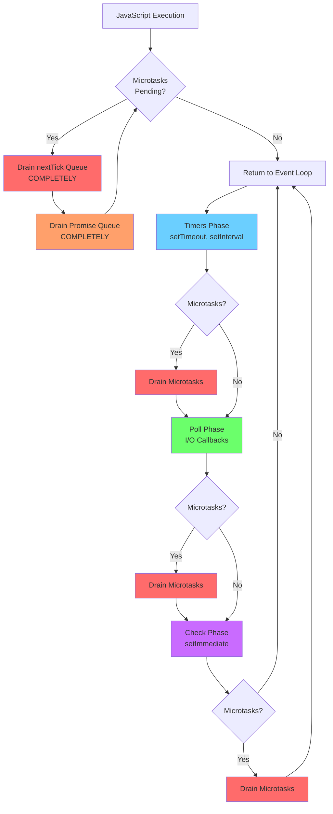
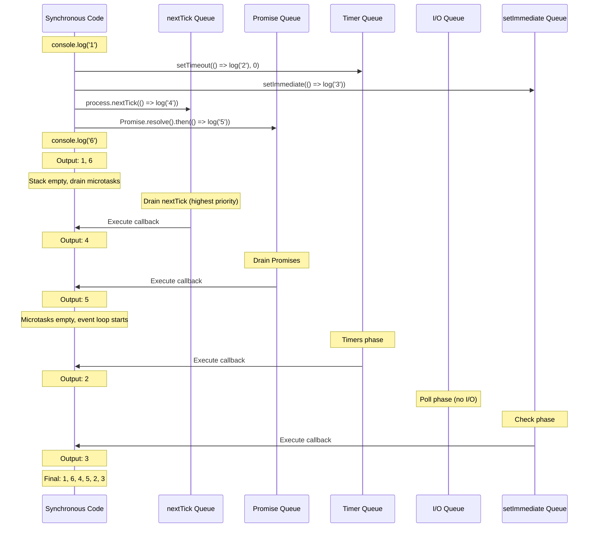
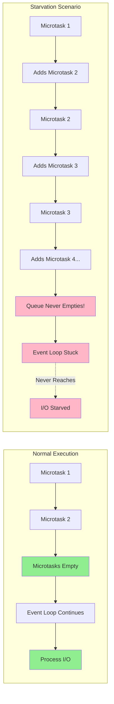

# Microtasks vs Macrotasks

## 1. Why this exists (Real-world problem first)

Your e-commerce checkout flow randomly fails 1% of the time. Payment succeeds, but inventory isn't reserved. Order confirmation emails don't send. The bug is impossible to reproduce locally. After days of debugging, you discover: a Promise chain processing cart items is starving the event loop, preventing the database connection pool from processing the inventory update callback.

**Real production failures from microtask/macrotask confusion:**

1. **The Phantom Race Condition**: A financial trading platform processes trades out of order. Developer assumed `Promise.resolve().then()` would run "after" the current function, but it actually runs before the next I/O callback, causing trades to execute in the wrong sequence.

2. **The Infinite Loop That Wasn't**: A logging service appears frozen but CPU is at 100%. The culprit: a recursive Promise chain that keeps adding microtasks faster than they can drain, preventing the event loop from ever reaching the Poll phase to accept new log entries.

3. **The Health Check Timeout**: Kubernetes kills pods because `/health` endpoint times out. The application is "running" but a `process.nextTick` loop is monopolizing the microtask queue, preventing HTTP server from processing new requests.

**What breaks without this knowledge:**
- You can't predict execution order (critical for data consistency)
- You write code that accidentally starves I/O
- You fail to understand why some async code runs "immediately" while other runs "later"
- You can't debug subtle race conditions in production

## 2. Mental model (build imagination)

Think of task execution as a **Hospital Emergency Room with Priority Lanes**.

### The Emergency Room Analogy

The hospital has different waiting areas with strict priority rules:

**Ultra-Priority (Microtasks - `process.nextTick`)**
- Cardiac arrest patients
- MUST be treated immediately
- Doctors drop everything to handle them
- If more cardiac patients keep arriving, other patients wait indefinitely

**High-Priority (Microtasks - Promises)**
- Severe injuries requiring immediate attention
- Treated right after cardiac patients
- Still higher priority than regular patients

**Regular Priority (Macrotasks - Timers, I/O, setImmediate)**
- Scheduled appointments (Timers)
- Walk-in patients (I/O callbacks)
- "Please wait" patients (setImmediate)

**The Critical Rule:**
The ER MUST clear all ultra-priority and high-priority patients before seeing ANY regular patients. If cardiac patients keep arriving, scheduled appointments never happen.

**The Flow:**
1. Doctor finishes with a regular patient (I/O callback completes)
2. Checks ultra-priority: "Any cardiac arrests?" → Treats them ALL
3. Checks high-priority: "Any severe injuries?" → Treats them ALL
4. Only then moves to next regular patient

**Why this matters:**
- Microtasks can starve macrotasks
- Understanding priority explains execution order
- Knowing when to use each prevents performance issues

## 3. How Node.js implements this internally

Node.js has two separate queue systems managed by different components:

### Microtask Queues (V8 - JavaScript Engine)

**1. `process.nextTick` Queue**
- Implemented in Node.js C++ layer
- Highest priority
- Drained COMPLETELY before any other queue

**2. Promise Microtask Queue**
- Implemented in V8
- Second highest priority
- Drained after `nextTick` queue

**Implementation detail:**
```cpp
// Simplified Node.js internal logic
void DrainMicrotasks() {
  // First, drain ALL nextTick callbacks
  while (nextTickQueue.length > 0) {
    callback = nextTickQueue.shift();
    callback();
    // Note: callback might add more to queue!
  }
  
  // Then, drain ALL Promise microtasks
  while (promiseMicrotaskQueue.length > 0) {
    callback = promiseMicrotaskQueue.shift();
    callback();
  }
}
```

**When microtasks drain:**
- After every callback execution
- Before returning to event loop
- Between event loop phases
- After C++ to JavaScript boundary crossings

### Macrotask Queues (libuv - Event Loop)

**1. Timers Queue**
- `setTimeout`, `setInterval`
- Managed as min-heap sorted by expiration time
- Processed in Timers phase

**2. I/O Callbacks Queue**
- Network I/O, file I/O callbacks
- Processed in Poll phase

**3. Check Queue**
- `setImmediate` callbacks
- Processed in Check phase

**4. Close Callbacks Queue**
- `socket.on('close')` etc.
- Processed in Close phase

### The Priority Hierarchy

```
Highest Priority
    ↓
process.nextTick
    ↓
Promise microtasks
    ↓
Timers (setTimeout, setInterval)
    ↓
I/O callbacks
    ↓
setImmediate
    ↓
Close callbacks
Lowest Priority
```

### Common Misunderstandings

**Mistake 1**: "Promises are async, so they run later"
- **Reality**: Promise `.then()` is a microtask that runs before ANY macrotask
- **Impact**: Developers expect I/O to process before Promise chains

**Mistake 2**: "`process.nextTick` runs on the next tick"
- **Reality**: It runs on the CURRENT tick, before the loop advances
- **Impact**: Confusing name leads to incorrect usage

**Mistake 3**: "All async operations have the same priority"
- **Reality**: Microtasks always preempt macrotasks
- **Impact**: Unexpected execution order, race conditions

## 4. Multiple diagrams (MANDATORY)

### Diagram 1: Priority Hierarchy



### Diagram 2: Execution Order Example



### Diagram 3: Starvation Scenario



### Diagram 4: Real-World Execution Timeline

```mermaid
gantt
    title Task Execution Timeline
    dateFormat X
    axisFormat %L ms
    
    section Sync Code
    Main Script           :0, 10
    
    section Microtasks
    nextTick Callback     :10, 11
    Promise 1             :11, 12
    Promise 2             :12, 13
    
    section Event Loop
    Timers Phase          :13, 15
    Poll Phase (I/O)      :15, 25
    Check Phase           :25, 27
    
    section Microtasks Again
    Promise from I/O      :27, 28
    
    section Event Loop
    Next Iteration        :28, 30
```



## 5. Where this is used in real projects

### API Request Handling

**Scenario**: Express middleware chain processing authentication

**Decision**: Use microtasks for synchronous-looking async operations

```javascript
// Authentication middleware
app.use(async (req, res, next) => {
  // This creates Promise microtasks
  const user = await db.users.findById(req.userId);
  const permissions = await db.permissions.findByUser(user.id);
  
  req.user = user;
  req.permissions = permissions;
  
  // Microtasks drain before next middleware
  next(); // This is synchronous, but next middleware is a macrotask
});
```

**Why it works**: Promise microtasks drain completely before the event loop moves to the next I/O callback (next middleware).

### Event Emission in Constructors

**Scenario**: Database connection pool emitting 'ready' event

**Decision**: Use `process.nextTick` to allow listeners to be attached

```javascript
class ConnectionPool extends EventEmitter {
  constructor(config) {
    super();
    
    this.connections = [];
    this.initialize(config);
    
    // Emit 'ready' asynchronously so caller can attach listener
    process.nextTick(() => {
      this.emit('ready');
    });
  }
}

// Usage
const pool = new ConnectionPool(config);
pool.on('ready', () => {
  // This listener is attached before 'ready' fires
  console.log('Pool ready');
});
```

**Why `nextTick`**: Runs before any I/O, but after constructor returns, allowing synchronous listener attachment.

### Batch Processing with Yielding

**Scenario**: Processing 10,000 database records

**Decision**: Use `setImmediate` (macrotask) to yield between batches

```javascript
async function processRecords(records) {
  const batchSize = 100;
  
  for (let i = 0; i < records.length; i += batchSize) {
    const batch = records.slice(i, i + batchSize);
    
    // Process batch (creates Promise microtasks)
    await Promise.all(batch.map(processRecord));
    
    // Yield to event loop every batch
    await new Promise(resolve => setImmediate(resolve));
    // ^^ setImmediate is macrotask, allows I/O to process
  }
}
```

**Why `setImmediate`**: Allows health checks and other I/O to process between batches.

### Priority Task Scheduling

**Scenario**: Real-time analytics engine with priority levels

**Decision**: Use microtasks for high-priority, macrotasks for normal

```javascript
class TaskScheduler {
  scheduleHighPriority(task) {
    // Microtask - runs before any I/O
    queueMicrotask(() => {
      this.executeTask(task);
    });
  }
  
  scheduleNormal(task) {
    // Macrotask - runs after current I/O
    setImmediate(() => {
      this.executeTask(task);
    });
  }
  
  scheduleLowPriority(task) {
    // Macrotask with delay - runs in next loop iteration
    setTimeout(() => {
      this.executeTask(task);
    }, 0);
  }
}
```

### Error Handling in Async Constructors

**Scenario**: Async initialization that might fail

**Decision**: Use `process.nextTick` for error emission

```javascript
class AsyncResource extends EventEmitter {
  constructor(url) {
    super();
    
    this.load(url).catch(err => {
      // Emit error asynchronously
      process.nextTick(() => {
        this.emit('error', err);
      });
    });
  }
  
  async load(url) {
    this.data = await fetch(url);
  }
}

// Usage
const resource = new AsyncResource('https://api.example.com/data');
resource.on('error', (err) => {
  // This listener is attached before error is emitted
  console.error('Failed to load:', err);
});
```

## 6. Where this should NOT be used

### Recursive Microtasks

**Misuse**: Infinite loop with `process.nextTick`

```javascript
// DANGER: Starves event loop!
function recursiveNextTick() {
  process.nextTick(() => {
    console.log('tick');
    recursiveNextTick(); // Adds to queue faster than it drains
  });
}

recursiveNextTick();
// Event loop NEVER progresses
// No I/O processed
// Health checks fail
// Application appears frozen
```

**Why it's wrong**: Microtask queue never empties, event loop can't continue.

**Right approach**: Use `setImmediate` for recursion:
```javascript
function recursiveImmediate() {
  setImmediate(() => {
    console.log('tick');
    recursiveImmediate(); // Allows event loop to breathe
  });
}
```

### Heavy Computation in Microtasks

**Misuse**: CPU-intensive work in Promise chain

```javascript
// BAD: Blocks event loop
async function processLargeDataset(data) {
  return data.map(item => {
    // Heavy computation
    return expensiveTransform(item);
  });
}

// Even though it's async, the map() is synchronous!
const result = await processLargeDataset(millionItems);
```

**Why it's wrong**: The `map()` runs synchronously, blocking the event loop. The `await` doesn't help.

**Right approach**: Break into chunks with macrotasks:
```javascript
async function processLargeDataset(data) {
  const results = [];
  const chunkSize = 1000;
  
  for (let i = 0; i < data.length; i += chunkSize) {
    const chunk = data.slice(i, i + chunkSize);
    results.push(...chunk.map(expensiveTransform));
    
    // Yield to event loop
    await new Promise(resolve => setImmediate(resolve));
  }
  
  return results;
}
```

### Assuming Microtask Timing

**Misuse**: Relying on microtasks for precise timing

```javascript
// WRONG: Microtasks don't guarantee timing
queueMicrotask(() => {
  sendCriticalPacket(); // Might be delayed if other microtasks run first
});
```

**Why it's wrong**: Microtasks run in queue order, but timing depends on what else is in the queue.

### Using `nextTick` for General Async

**Misuse**: Using `nextTick` as a general "defer" mechanism

```javascript
// WRONG: nextTick is too high priority for this
process.nextTick(() => {
  logToDatabase(event); // This should be lower priority
});
```

**Why it's wrong**: `nextTick` preempts I/O. If logging fails, it could block critical operations.

**Right approach**: Use `setImmediate` for non-critical deferred work:
```javascript
setImmediate(() => {
  logToDatabase(event); // Lower priority, won't block I/O
});
```

## 7. Failure modes & edge cases

### Failure Mode 1: Promise Chain Starvation

**Scenario**: Processing user uploads in a Promise chain

```javascript
app.post('/upload', async (req, res) => {
  const files = req.files; // 1000 files
  
  // BAD: Creates 1000 Promise microtasks
  await Promise.all(files.map(async (file) => {
    await processFile(file);
    await saveToDatabase(file);
    await updateIndex(file);
  }));
  
  res.send('Done');
});
```

**Problem**: 
- Each `await` creates microtasks
- 1000 files × 3 awaits = 3000 microtasks
- Microtasks drain before I/O
- Health checks timeout
- Load balancer marks instance unhealthy

**Solution**: Batch with macrotask yielding:
```javascript
app.post('/upload', async (req, res) => {
  const files = req.files;
  const batchSize = 10;
  
  for (let i = 0; i < files.length; i += batchSize) {
    const batch = files.slice(i, i + batchSize);
    await Promise.all(batch.map(processFile));
    
    // Yield every batch
    await new Promise(resolve => setImmediate(resolve));
  }
  
  res.send('Done');
});
```

### Failure Mode 2: `nextTick` Recursion

**Scenario**: Event emitter with recursive `nextTick`

```javascript
class DataStream extends EventEmitter {
  start() {
    this.emitData();
  }
  
  emitData() {
    process.nextTick(() => {
      this.emit('data', this.read());
      
      if (this.hasMore()) {
        this.emitData(); // DANGER!
      }
    });
  }
}
```

**Problem**:
- Each `emitData` adds to `nextTick` queue
- Queue never empties if data keeps coming
- Event loop starved
- No I/O processed

**Detection**:
```
(node:12345) Warning: Possible EventEmitter memory leak detected.
11 data listeners added.
```

**Solution**: Use `setImmediate`:
```javascript
emitData() {
  setImmediate(() => {
    this.emit('data', this.read());
    
    if (this.hasMore()) {
      this.emitData(); // Safe with setImmediate
    }
  });
}
```

### Failure Mode 3: Mixed Priority Race Condition

**Scenario**: Payment processing with inventory check

```javascript
async function processPayment(orderId) {
  // Step 1: Charge payment (creates Promise microtask)
  const payment = await stripe.charge(orderId);
  
  // Step 2: Reserve inventory (I/O callback - macrotask)
  reserveInventory(orderId, (err, reserved) => {
    if (!reserved) {
      // Try to refund
      stripe.refund(payment.id);
    }
  });
  
  // Step 3: Send confirmation (microtask)
  await sendEmail(orderId);
  
  return payment;
}
```

**Problem**:
- Email sends (microtask) before inventory check (macrotask)
- User gets confirmation email
- Inventory check fails
- Refund happens
- User is confused

**Solution**: Await all operations:
```javascript
async function processPayment(orderId) {
  const payment = await stripe.charge(orderId);
  
  // Convert callback to Promise
  const reserved = await new Promise((resolve, reject) => {
    reserveInventory(orderId, (err, result) => {
      if (err) reject(err);
      else resolve(result);
    });
  });
  
  if (!reserved) {
    await stripe.refund(payment.id);
    throw new Error('Inventory not available');
  }
  
  await sendEmail(orderId);
  return payment;
}
```

### Edge Case: Microtasks in Microtasks

**Scenario**: Promise chain that adds more Promises

```javascript
Promise.resolve()
  .then(() => {
    console.log('1');
    return Promise.resolve();
  })
  .then(() => console.log('2'));

Promise.resolve()
  .then(() => console.log('3'));
```

**Output**: `1, 3, 2`

**Why**: 
- First Promise resolves, adds "1" to microtask queue
- Second Promise resolves, adds "3" to microtask queue
- "1" executes, returns Promise (adds "2" to END of queue)
- "3" executes (was already in queue before "2")
- "2" executes

### Edge Case: `nextTick` vs Promise Priority

**Scenario**: Both scheduled in same callback

```javascript
Promise.resolve().then(() => {
  console.log('promise');
  process.nextTick(() => console.log('nextTick'));
});

process.nextTick(() => {
  console.log('nextTick 2');
});
```

**Output**: `nextTick 2, promise, nextTick`

**Why**:
- `nextTick` queue drains first
- "nextTick 2" executes
- Promise queue drains
- "promise" executes, adds to `nextTick` queue
- `nextTick` queue drains again
- "nextTick" executes

## 8. Trade-offs & alternatives

### `process.nextTick`

**Gain**:
- Highest priority - runs before everything
- Useful for event emission in constructors
- Guarantees execution before I/O

**Sacrifice**:
- Can starve event loop
- Confusing name ("next tick" actually means "current tick")
- Easy to misuse

**When to use**:
- Emitting events after constructor returns
- Error handling that must happen before I/O
- Breaking up synchronous recursion (carefully!)

### Promise Microtasks

**Gain**:
- Natural async/await syntax
- Standard JavaScript (works in browsers)
- Automatic error propagation

**Sacrifice**:
- Can starve event loop if chained heavily
- Higher priority than I/O (might not be desired)
- Memory overhead for Promise objects

**When to use**:
- Standard async operations
- Database queries, API calls
- Any async/await code

### `queueMicrotask()`

**Gain**:
- Standard web API
- Clearer intent than `nextTick`
- Same priority as Promises

**Sacrifice**:
- Lower priority than `nextTick`
- Less familiar to Node.js developers
- Relatively new API

**When to use**:
- Modern code preferring web standards
- When you want microtask behavior without Promises

### `setImmediate`

**Gain**:
- Allows event loop to breathe
- Safe for recursive scheduling
- Runs after I/O

**Sacrifice**:
- Lower priority than microtasks
- Not available in browsers
- Slightly higher latency

**When to use**:
- Breaking up CPU work
- Recursive operations
- Deferred non-critical work

### `setTimeout(fn, 0)`

**Gain**:
- Works in browsers
- Familiar API

**Sacrifice**:
- Overhead of timer management
- Slowest of all options
- Imprecise timing

**When to use**:
- Cross-platform code
- Actual delays needed
- Lowest priority work

## 9. Interview-level articulation

### How to Explain Microtasks vs Macrotasks

**Opening statement** (30 seconds):
"In Node.js, async operations are divided into microtasks and macrotasks based on priority. Microtasks include `process.nextTick` and Promise callbacks—they have the highest priority and drain completely before the event loop continues. Macrotasks include timers, I/O callbacks, and `setImmediate`—they're processed in specific event loop phases. The key insight is that microtasks can starve macrotasks if not used carefully, because the event loop won't progress until all microtasks are drained."

### Typical Follow-up Questions

**Q: "What's the execution order of these?"**

```javascript
setTimeout(() => console.log('1'), 0);
Promise.resolve().then(() => console.log('2'));
process.nextTick(() => console.log('3'));
console.log('4');
```

**A**: "Output is 4, 3, 2, 1. Here's why: First, '4' prints because it's synchronous. Then the stack empties, triggering microtask draining. `nextTick` has highest priority, so '3' prints. Then Promise microtasks drain, printing '2'. Finally, the event loop starts and reaches the Timers phase, printing '1'."

**Q: "When would you use `process.nextTick` vs `setImmediate`?"**

**A**: "I use `process.nextTick` when I need something to run before any I/O, typically for emitting events in constructors so listeners can be attached synchronously. I use `setImmediate` for deferring work that should happen after I/O, like breaking up CPU-intensive tasks or recursive operations. `setImmediate` is safer because it allows the event loop to process I/O between executions, preventing starvation."

**Q: "How can microtasks starve the event loop?"**

**A**: "If you recursively schedule microtasks—like calling `process.nextTick` inside its own callback—the microtask queue never empties. Since microtasks must drain completely before the event loop can progress to the next phase, the loop gets stuck. No timers fire, no I/O is processed, health checks timeout. The application appears frozen even though CPU is at 100%."

**Q: "Why are Promises microtasks and not macrotasks?"**

**A**: "It's a design decision from the JavaScript spec. Promises need to resolve 'as soon as possible' to maintain the illusion of synchronous-looking async code with async/await. Making them microtasks ensures `.then()` callbacks run before any I/O, giving predictable execution order. However, this means heavy Promise chains can delay I/O processing."

## 10. Key takeaways (engineer mindset)

### What to Remember

1. **Two priority levels**: Microtasks (high) and Macrotasks (low)
2. **Microtask order**: `nextTick` → Promises → queueMicrotask
3. **Macrotask order**: Timers → I/O → setImmediate → Close
4. **Microtasks drain completely** before event loop continues
5. **Recursive microtasks starve** the event loop

### What Decisions This Enables

**Correctness decisions**:
- Use `nextTick` for event emission in constructors
- Use Promises for standard async operations
- Use `setImmediate` for recursive operations

**Performance decisions**:
- Avoid heavy Promise chains without yielding
- Never use recursive `nextTick`
- Batch operations with `setImmediate` breaks

**Debugging decisions**:
- Event loop lag → check for microtask starvation
- Out-of-order execution → check microtask/macrotask mix
- Frozen app → look for recursive `nextTick`

### How It Connects to Other Node.js Concepts

**Event Loop** (Topic 2):
- Microtasks drain between event loop phases
- Understanding phases explains macrotask order

**Worker Threads** (Topic 14):
- Each worker has its own microtask/macrotask queues
- Message passing between workers uses macrotasks

**Streams** (Topic 7):
- Stream events use microtasks for immediate notification
- Backpressure handling uses macrotasks

**Memory Management** (Topic 8):
- Excessive microtasks can cause memory pressure
- Promise objects consume heap memory

### The Golden Rule

**Use the lowest priority that meets your needs**. If `setImmediate` works, don't use Promises. If Promises work, don't use `nextTick`. Higher priority means higher risk of starving the event loop.
