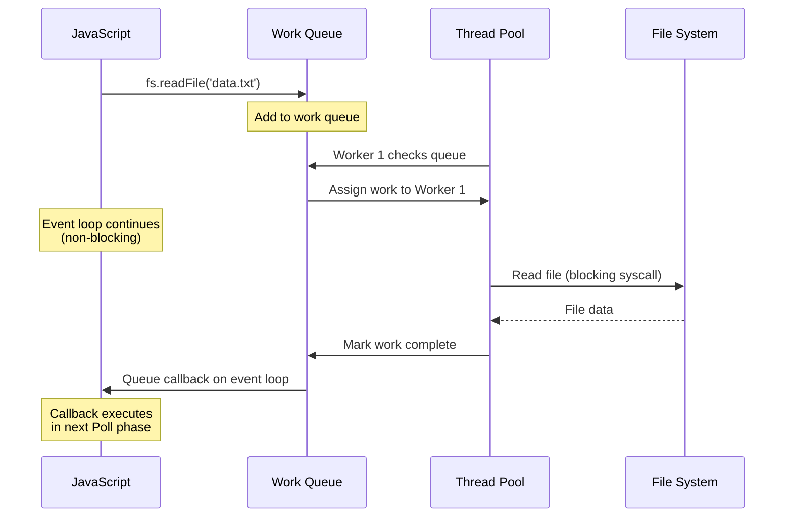
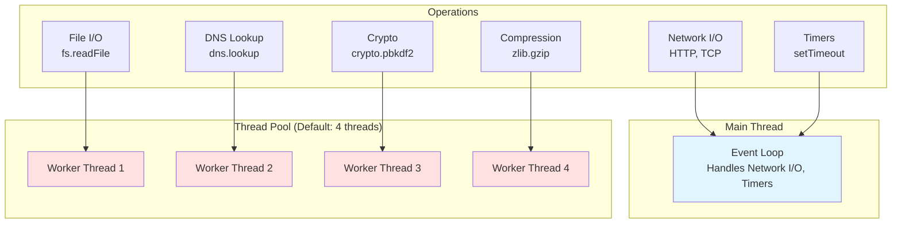
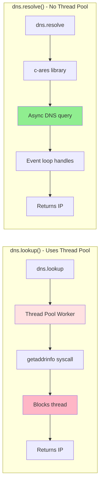

# libuv Thread Pool

## 1. Why this exists (Real-world problem first)

Your file upload service handles 100 concurrent uploads smoothly in development. In production with 1000 concurrent uploads, response times spike from 100ms to 10 seconds. CPU is at 30%. Network is fine. The bottleneck? The default libuv thread pool has only 4 threads, and all file I/O operations are queued waiting for a free thread.

**Real production failures from thread pool ignorance:**

1. **The File Upload Bottleneck**: A document management system processes PDF uploads. With default 4 threads, the 5th concurrent upload waits. At 100 concurrent uploads, P99 latency is 25 seconds. Users think the service is broken.

2. **The DNS Lookup Cascade**: A microservice makes DNS lookups for every outgoing request. Under load, DNS lookups (which use the thread pool) queue up. Timeouts cascade. The service appears to hang, but it's just waiting for thread pool workers.

3. **The Crypto Slowdown**: An authentication service uses `crypto.pbkdf2()` for password hashing. Each hash takes 100ms. With 4 threads, only 4 concurrent logins are possible. The 5th user waits 100ms, the 10th waits 250ms. Login times become unpredictable.

**What breaks without this knowledge:**
- You can't diagnose file I/O bottlenecks
- You don't know when to increase thread pool size
- You confuse thread pool operations with network I/O
- You can't optimize high-concurrency file operations

## 2. Mental model (build imagination)

Think of the libuv thread pool as a **Small Team of Specialists** handling specific types of work.

### The Specialist Team Analogy

Imagine a restaurant kitchen with:
- **1 Main Chef** (Event loop - handles everything else)
- **4 Prep Cooks** (Thread pool - default size)

**What the Prep Cooks handle:**
- Chopping vegetables (File I/O - reading/writing files)
- Making phone calls to suppliers (DNS lookups via `getaddrinfo`)
- Grinding spices (CPU-intensive crypto operations)
- Squeezing juice (Compression - zlib)

**What the Main Chef handles:**
- Taking orders (Network I/O - HTTP requests)
- Plating dishes (Timers, setImmediate)
- Coordinating everything (Event loop orchestration)

**The Problem:**
If 10 customers all order fresh-squeezed juice at once:
- 4 prep cooks start squeezing
- 6 orders wait in queue
- Main chef can't help (different skillset)
- Wait time increases linearly

**The Solution:**
Hire more prep cooks (increase thread pool size):
```bash
UV_THREADPOOL_SIZE=16 node server.js
```

**Why this matters:**
- Thread pool is for specific operations only
- Network I/O doesn't use thread pool (common misconception)
- Pool size directly affects file I/O concurrency
- Understanding what uses the pool prevents bottlenecks

## 3. How Node.js implements this internally

The thread pool is part of **libuv**, implemented in C. It's a fixed-size pool of worker threads that execute blocking operations asynchronously.

### Thread Pool Architecture

```c
// Simplified libuv thread pool structure
typedef struct {
  uv_thread_t threads[THREAD_POOL_SIZE]; // Worker threads
  uv_mutex_t mutex;                       // Queue lock
  uv_cond_t cond;                         // Condition variable
  QUEUE wq;                               // Work queue
  unsigned int idle_threads;              // Available workers
} uv__threadpool;
```

**Default Configuration:**
- **Size**: 4 threads (configurable via `UV_THREADPOOL_SIZE`)
- **Max**: 1024 threads (libuv limit)
- **Min**: 1 thread
- **Lifecycle**: Created at startup, persist for process lifetime

### What Uses the Thread Pool

**1. File System Operations (fs module)**
- `fs.readFile()`, `fs.writeFile()`
- `fs.readdir()`, `fs.stat()`
- `fs.open()`, `fs.close()`
- **NOT** `fs.watch()` (uses OS-level APIs)

**2. DNS Lookups**
- `dns.lookup()` (uses `getaddrinfo` - thread pool)
- **NOT** `dns.resolve()` (uses c-ares - no thread pool)

**3. Crypto Operations**
- `crypto.pbkdf2()`, `crypto.scrypt()`
- `crypto.randomBytes()` (sometimes)
- **NOT** `crypto.createHash()` (synchronous, main thread)

**4. Compression (zlib)**
- `zlib.gzip()`, `zlib.deflate()`
- All async zlib operations

### What Does NOT Use the Thread Pool

**Network I/O** (common misconception):
- HTTP requests/responses
- TCP/UDP sockets
- WebSockets
- **Uses**: OS-level async APIs (epoll/kqueue/IOCP)

**Timers**:
- `setTimeout`, `setInterval`, `setImmediate`
- **Uses**: Event loop phases

**Child Processes**:
- `child_process.spawn()`, `child_process.exec()`
- **Uses**: OS process management

### How It Works



### Common Misunderstandings

**Mistake 1**: "All async operations use the thread pool"
- **Reality**: Only file I/O, DNS (lookup), crypto, and zlib
- **Impact**: Increasing pool size doesn't help network I/O

**Mistake 2**: "More threads = better performance"
- **Reality**: Diminishing returns, context switching overhead
- **Impact**: Setting pool size to 128 might hurt performance

**Mistake 3**: "Thread pool size affects event loop"
- **Reality**: They're separate; pool handles specific operations
- **Impact**: Confusion about where bottlenecks occur

## 4. Multiple diagrams (MANDATORY)

### Diagram 1: Thread Pool vs Event Loop



### Diagram 2: Thread Pool Saturation

```mermaid
gantt
    title Thread Pool Saturation (4 threads, 10 concurrent file reads)
    dateFormat X
    axisFormat %L ms
    
    section Worker 1
    File 1 :0, 100
    File 5 :100, 200
    File 9 :200, 300
    
    section Worker 2
    File 2 :0, 100
    File 6 :100, 200
    File 10 :200, 300
    
    section Worker 3
    File 3 :0, 100
    File 7 :100, 200
    
    section Worker 4
    File 4 :0, 100
    File 8 :100, 200
    
    section Waiting
    Files 5-10 queued :0, 100
```



### Diagram 3: DNS lookup vs resolve



## 5. Where this is used in real projects

### File Upload Service

**Scenario**: Document management system with concurrent uploads

**Decision**: Increase thread pool size based on expected concurrency

```javascript
// Set thread pool size before requiring any modules
process.env.UV_THREADPOOL_SIZE = 16;

const express = require('express');
const multer = require('multer');
const fs = require('fs').promises;

const upload = multer({ dest: 'uploads/' });

app.post('/upload', upload.single('file'), async (req, res) => {
  // File I/O uses thread pool
  await fs.rename(req.file.path, `./storage/${req.file.originalname}`);
  await fs.writeFile(`./metadata/${req.file.originalname}.json`, 
    JSON.stringify(req.file));
  
  res.json({ success: true });
});

// With UV_THREADPOOL_SIZE=16, can handle 16 concurrent uploads
// Without it, only 4 concurrent (default)
```

**Calculation**:
- Expected concurrent uploads: 20
- Each upload: 2 file operations (rename + writeFile)
- Thread pool size needed: 20 × 2 = 40 (set to 32 for safety margin)

### Microservice with DNS Lookups

**Scenario**: Service making requests to many external APIs

**Decision**: Use `dns.resolve()` instead of `dns.lookup()` to avoid thread pool

```javascript
const dns = require('dns').promises;
const http = require('http');

// BAD: Uses thread pool
async function makeRequestBad(hostname) {
  const ip = await dns.lookup(hostname); // Thread pool!
  // Make HTTP request to IP
}

// GOOD: Uses c-ares, no thread pool
async function makeRequestGood(hostname) {
  const addresses = await dns.resolve4(hostname); // No thread pool
  const ip = addresses[0];
  // Make HTTP request to IP
}

// Or just use hostname directly (HTTP module handles DNS)
http.get(`http://${hostname}/api`, (res) => {
  // HTTP module uses async DNS internally
});
```

### Password Hashing Service

**Scenario**: Authentication service with bcrypt/pbkdf2

**Decision**: Increase thread pool for crypto operations

```javascript
process.env.UV_THREADPOOL_SIZE = 8;

const crypto = require('crypto');

async function hashPassword(password) {
  return new Promise((resolve, reject) => {
    // Uses thread pool
    crypto.pbkdf2(password, 'salt', 100000, 64, 'sha512', (err, key) => {
      if (err) reject(err);
      else resolve(key.toString('hex'));
    });
  });
}

// With 8 threads, can handle 8 concurrent hashing operations
// Each takes ~100ms, so throughput is 80 hashes/second
```

### Log Compression Service

**Scenario**: Service compressing log files periodically

**Decision**: Dedicated thread pool size for compression workload

```javascript
process.env.UV_THREADPOOL_SIZE = 12;

const zlib = require('zlib');
const fs = require('fs');
const { pipeline } = require('stream').promises;

async function compressLogs(logFiles) {
  // Process in batches to avoid saturating thread pool
  const batchSize = 10;
  
  for (let i = 0; i < logFiles.length; i += batchSize) {
    const batch = logFiles.slice(i, i + batchSize);
    
    await Promise.all(batch.map(async (file) => {
      await pipeline(
        fs.createReadStream(file),
        zlib.createGzip(), // Uses thread pool
        fs.createWriteStream(`${file}.gz`)
      );
    }));
  }
}
```

## 6. Where this should NOT be used

### Increasing Pool Size for Network I/O

**Misuse**: Thinking more threads help HTTP performance

```bash
# WRONG: Network I/O doesn't use thread pool!
UV_THREADPOOL_SIZE=128 node api-server.js
```

**Why it's wrong**: HTTP, TCP, WebSockets use OS-level async APIs, not thread pool.

**Right approach**: Optimize network code, use connection pooling, load balancing.

### Setting Extremely Large Pool Size

**Misuse**: "More is better" mentality

```bash
# WRONG: Excessive threads cause overhead
UV_THREADPOOL_SIZE=512 node server.js
```

**Why it's wrong**:
- Context switching overhead
- Memory usage (each thread has stack)
- Diminishing returns beyond CPU core count × 2

**Right approach**: Set based on actual concurrency needs:
```bash
# Good: Based on expected file I/O concurrency
UV_THREADPOOL_SIZE=16 node server.js
```

### Using Sync APIs to "Avoid" Thread Pool

**Misuse**: Using sync APIs thinking they're faster

```javascript
// WRONG: Blocks event loop!
const data = fs.readFileSync('large-file.txt');
```

**Why it's wrong**: Sync APIs block the entire event loop, worse than thread pool queuing.

**Right approach**: Use async APIs, increase pool size if needed:
```javascript
const data = await fs.promises.readFile('large-file.txt');
```

## 7. Failure modes & edge cases

### Failure Mode 1: Thread Pool Starvation

**Scenario**: File server with default 4 threads, 100 concurrent requests

```javascript
app.get('/file/:name', async (req, res) => {
  const data = await fs.promises.readFile(`./files/${req.params.name}`);
  res.send(data);
});

// Request 1-4: Immediate (threads available)
// Request 5-100: Queued, wait for threads
// P99 latency: 25× slower than P50
```

**Detection**:
```javascript
const activeHandles = process._getActiveHandles();
const fileHandles = activeHandles.filter(h => h.constructor.name === 'FSReqCallback');
console.log(`Pending file operations: ${fileHandles.length}`);
// If this number grows, thread pool is saturated
```

**Solution**: Increase pool size:
```bash
UV_THREADPOOL_SIZE=32 node server.js
```

### Failure Mode 2: DNS Lookup Bottleneck

**Scenario**: Microservice making many external API calls

```javascript
async function callExternalAPI(service) {
  // dns.lookup uses thread pool
  const response = await fetch(`https://${service}.api.com/data`);
  return response.json();
}

// 10 concurrent calls
await Promise.all(services.map(callExternalAPI));
// If services > 4, DNS lookups queue
```

**Solution**: Use `dns.resolve()` or let HTTP handle DNS:
```javascript
// HTTP module handles DNS asynchronously without thread pool
const response = await fetch(`https://${service}.api.com/data`);
```

### Failure Mode 3: Mixed Workload Contention

**Scenario**: Service doing both file I/O and crypto

```javascript
// Thread pool handles both
await Promise.all([
  fs.promises.readFile('data.txt'),      // File I/O
  crypto.pbkdf2Promise(password, salt),  // Crypto
  fs.promises.writeFile('log.txt', data), // File I/O
  zlib.gzipPromise(buffer)               // Compression
]);

// All compete for same 4 threads
// Crypto (100ms) blocks file I/O (10ms)
```

**Solution**: Separate workloads or increase pool size:
```bash
UV_THREADPOOL_SIZE=16 node server.js
```

### Edge Case: Pool Size Must Be Set Early

**Scenario**: Setting pool size after modules loaded

```javascript
const fs = require('fs'); // libuv already initialized!

process.env.UV_THREADPOOL_SIZE = 16; // TOO LATE!

// Pool size is still 4
```

**Solution**: Set before any requires:
```javascript
process.env.UV_THREADPOOL_SIZE = 16; // FIRST!

const fs = require('fs'); // Now uses 16 threads
```

## 8. Trade-offs & alternatives

### Increasing Thread Pool Size

**Gain**:
- Higher file I/O concurrency
- Better throughput for crypto/compression
- Reduced queuing latency

**Sacrifice**:
- More memory (each thread has stack)
- Context switching overhead
- Diminishing returns beyond certain point

**When to use**: File-heavy workloads, crypto operations, known high concurrency

### Using Async APIs

**Gain**:
- Non-blocking event loop
- Leverages thread pool efficiently

**Sacrifice**:
- Callback/Promise complexity
- Potential thread pool saturation

**When to use**: Always prefer async over sync

### Streaming Instead of Reading Entire Files

**Gain**:
- Constant memory usage
- Can start processing immediately
- Less thread pool pressure

**Sacrifice**:
- More complex code
- Can't random access

**When to use**: Large files, unknown file sizes

## 9. Interview-level articulation

### How to Explain libuv Thread Pool

**Opening statement** (30 seconds):
"The libuv thread pool is a fixed-size pool of worker threads, defaulting to 4, that handles specific blocking operations: file I/O, DNS lookups via `getaddrinfo`, crypto operations, and compression. Network I/O doesn't use the thread pool—it uses OS-level async APIs. The pool size can be configured with `UV_THREADPOOL_SIZE`, and should be set based on expected concurrency for these specific operations."

### Typical Follow-up Questions

**Q: "Why does Node.js need a thread pool if it's single-threaded?"**

**A**: "Node.js JavaScript execution is single-threaded, but some operations can't be done asynchronously at the OS level—like file I/O on most systems. The thread pool allows these blocking operations to run on separate threads without blocking the main event loop. When the operation completes, a callback is queued on the event loop."

**Q: "How do you know if you need to increase the thread pool size?"**

**A**: "Monitor your application under load. If you see file I/O latency increasing with concurrency, or if you're doing many crypto operations concurrently, you might need more threads. A good rule of thumb is to set it to your expected concurrency for thread pool operations. But be careful—setting it too high causes overhead. I'd start with 2× CPU cores and adjust based on metrics."

**Q: "Does increasing thread pool size help HTTP performance?"**

**A**: "No. HTTP and all network I/O use OS-level async APIs (epoll on Linux, kqueue on macOS, IOCP on Windows), not the thread pool. Increasing thread pool size only helps file I/O, DNS lookups via `dns.lookup`, crypto, and compression operations."

## 10. Key takeaways (engineer mindset)

### What to Remember

1. **Default 4 threads**, configurable via `UV_THREADPOOL_SIZE`
2. **Only for**: File I/O, `dns.lookup()`, crypto, zlib
3. **NOT for**: Network I/O, timers, most async operations
4. **Set early**: Before requiring any modules
5. **Right-size**: Based on expected concurrency, not arbitrary large numbers

### What Decisions This Enables

**Performance decisions**:
- Increase pool size for file-heavy workloads
- Use `dns.resolve()` instead of `dns.lookup()` to avoid pool
- Stream large files to reduce pool pressure

**Correctness decisions**:
- Don't rely on thread pool for network performance
- Set pool size at startup, not runtime
- Monitor pool saturation in production

**Debugging decisions**:
- File I/O slow → check thread pool saturation
- DNS slow → check if using `dns.lookup()` vs `dns.resolve()`
- Network slow → NOT a thread pool issue

### How It Connects to Other Node.js Concepts

**Event Loop** (Topic 2):
- Thread pool operations queue callbacks on event loop
- Pool saturation delays callback execution

**Blocking vs Non-Blocking I/O** (Topic 6):
- Thread pool makes blocking operations non-blocking
- Understanding pool explains async file I/O

**Worker Threads** (Topic 14):
- Alternative to thread pool for CPU work
- Each worker has its own thread pool

### The Golden Rule

**Right-size the thread pool for your workload**. Monitor file I/O concurrency in production. Don't set it arbitrarily high. Remember: network I/O doesn't use it.
