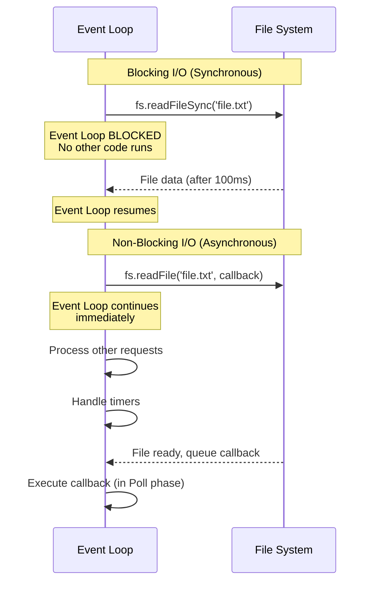
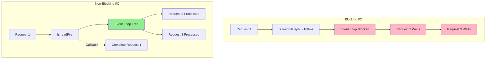

# Blocking vs Non-Blocking I/O

## 1. Why this exists (Real-world problem first)

Your API handles 1000 requests/second in load testing. You deploy to production. Under real load, throughput drops to 50 requests/second. The culprit? A developer used `fs.readFileSync()` to read a 5MB config file on every request. That single synchronous call blocks the entire event loop for 200ms, turning your high-throughput async server into a sequential bottleneck.

**Real production failures from blocking I/O:**

1. **The Config File Killer**: A payment gateway reads fraud rules from a JSON file using `fs.readFileSync()` in middleware. Each request blocks for 150ms. At 10 concurrent requests, the server is frozen for 1.5 seconds. Payments timeout. Revenue lost.

2. **The Crypto Catastrophe**: An authentication service uses `crypto.pbkdf2Sync()` for password hashing. Each hash takes 100ms of CPU time. The event loop is blocked. Health checks timeout. Kubernetes kills the pod. Users can't log in.

3. **The DNS Disaster**: A microservice uses `dns.lookupSync()` (doesn't exist, but imagine sync DNS). Every outgoing request blocks for 50ms waiting for DNS. Under load, the service appears completely frozen.

**What breaks without this knowledge:**
- You accidentally block the event loop with sync APIs
- You can't diagnose why your "async" server has terrible throughput
- You don't understand the performance difference between sync and async
- You fail to leverage Node.js's core strength: non-blocking I/O

## 2. Mental model (build imagination)

Think of blocking vs non-blocking I/O as **Two Different Restaurant Service Models**.

### The Restaurant Analogy

**Blocking I/O = Traditional Sit-Down Restaurant (One Waiter)**
- Waiter takes order from Table 1
- Waiter walks to kitchen, WAITS for food to cook (stands there doing nothing)
- Waiter brings food to Table 1
- Only then does waiter take order from Table 2
- **Result**: One customer served at a time. Others wait even though kitchen can cook multiple orders.

**Non-Blocking I/O = Modern Fast-Casual (Smart Waiter)**
- Waiter takes order from Table 1
- Waiter gives order to kitchen, immediately moves to Table 2 (doesn't wait)
- Takes order from Table 2, gives to kitchen
- Takes order from Table 3
- Kitchen notifies when Table 1's food is ready
- Waiter delivers to Table 1
- **Result**: One waiter serves many tables. Kitchen works in parallel.

**The Key Insight:**
- **Blocking**: Waiter (event loop) is idle while kitchen (I/O) works
- **Non-Blocking**: Waiter (event loop) stays busy while kitchen (I/O) works in parallel

**Why this matters:**
- Blocking I/O wastes the event loop's time
- Non-blocking I/O allows one thread to handle thousands of concurrent operations
- Understanding this explains Node.js's entire value proposition

## 3. How Node.js implements this internally

Node.js provides both blocking (sync) and non-blocking (async) APIs for I/O operations.

### Blocking I/O (Synchronous APIs)

**Implementation:**
```javascript
// Synchronous file read
const data = fs.readFileSync('/path/to/file');
// Event loop is BLOCKED here until file is read
console.log('This waits');
```

**What happens internally:**
1. JavaScript calls `fs.readFileSync()`
2. V8 calls into Node.js C++ bindings
3. C++ makes blocking syscall (`read()` on Unix)
4. **Event loop is frozen** - no callbacks execute
5. Syscall returns with data
6. Control returns to JavaScript
7. Event loop continues

**Characteristics:**
- **Blocks event loop**: No other code runs
- **Simpler code**: No callbacks/promises
- **Predictable order**: Sequential execution
- **Terrible for servers**: Kills throughput

### Non-Blocking I/O (Asynchronous APIs)

**Implementation:**
```javascript
// Asynchronous file read
fs.readFile('/path/to/file', (err, data) => {
  console.log('File read complete');
});
console.log('This runs immediately');
```

**What happens internally:**
1. JavaScript calls `fs.readFile()`
2. Node.js queues work on thread pool (for file I/O)
3. **Event loop continues immediately**
4. Thread pool worker reads file
5. When complete, callback is queued on event loop
6. Event loop executes callback in Poll phase

**Characteristics:**
- **Non-blocking**: Event loop continues
- **Concurrent**: Multiple I/O operations in parallel
- **Callback/Promise based**: More complex code
- **High throughput**: Ideal for servers

### The Performance Difference

```javascript
// Blocking: Sequential
const start = Date.now();
const file1 = fs.readFileSync('file1.txt'); // 100ms
const file2 = fs.readFileSync('file2.txt'); // 100ms
const file3 = fs.readFileSync('file3.txt'); // 100ms
console.log(`Total: ${Date.now() - start}ms`); // ~300ms

// Non-blocking: Parallel
const start = Date.now();
Promise.all([
  fs.promises.readFile('file1.txt'), // 100ms
  fs.promises.readFile('file2.txt'), // 100ms
  fs.promises.readFile('file3.txt')  // 100ms
]).then(() => {
  console.log(`Total: ${Date.now() - start}ms`); // ~100ms (parallel!)
});
```

### Common Misunderstandings

**Mistake 1**: "Async means it runs in the background"
- **Reality**: I/O runs in background, callback runs on main thread
- **Impact**: Heavy callback still blocks event loop

**Mistake 2**: "Sync APIs are faster"
- **Reality**: For single operation, yes. For concurrent operations, no.
- **Impact**: Using sync APIs kills throughput

**Mistake 3**: "All Node.js APIs are non-blocking"
- **Reality**: Many have both sync and async versions
- **Impact**: Accidentally using sync APIs in production

## 4. Multiple diagrams (MANDATORY)

### Diagram 1: Blocking vs Non-Blocking Execution



### Diagram 2: Throughput Comparison

```mermaid
gantt
    title Blocking vs Non-Blocking (3 concurrent requests)
    dateFormat X
    axisFormat %L ms
    
    section Blocking (Sequential)
    Request 1 :0, 100
    Request 2 :100, 200
    Request 3 :200, 300
    
    section Non-Blocking (Parallel)
    Request 1 :0, 100
    Request 2 :0, 100
    Request 3 :0, 100
```



### Diagram 3: Event Loop Impact



## 5. Where this is used in real projects

### API Servers (Always Non-Blocking)

**Scenario**: Express API reading configuration

```javascript
// WRONG: Blocks on every request
app.use((req, res, next) => {
  const config = JSON.parse(fs.readFileSync('./config.json'));
  req.config = config;
  next();
});

// RIGHT: Load once at startup
const config = JSON.parse(fs.readFileSync('./config.json')); // OK at startup
app.use((req, res, next) => {
  req.config = config;
  next();
});

// BETTER: Async at startup
let config;
fs.readFile('./config.json', (err, data) => {
  config = JSON.parse(data);
  app.listen(3000); // Start server after config loaded
});
```

### File Processing (Use Async)

**Scenario**: Batch processing uploaded files

```javascript
// WRONG: Sequential blocking
for (const file of files) {
  const data = fs.readFileSync(file); // Blocks!
  processData(data);
}

// RIGHT: Parallel non-blocking
await Promise.all(files.map(async (file) => {
  const data = await fs.promises.readFile(file);
  processData(data);
}));
```

### CLI Tools (Sync is OK)

**Scenario**: Command-line utility

```javascript
// OK for CLI: Blocking is acceptable
const data = fs.readFileSync(process.argv[2]);
console.log(data.toString());
process.exit(0);

// No need for async in single-use CLI tools
```

### Build Scripts (Sync is Common)

**Scenario**: Build tool reading package.json

```javascript
// OK for build scripts
const pkg = JSON.parse(fs.readFileSync('./package.json'));
console.log(`Building ${pkg.name} v${pkg.version}`);
```

## 6. Where this should NOT be used

### Blocking I/O in Request Handlers

**Misuse**: Using sync APIs in web servers

```javascript
// DISASTER: Blocks event loop on every request
app.get('/user/:id', (req, res) => {
  const user = JSON.parse(fs.readFileSync(`./users/${req.params.id}.json`));
  res.json(user);
});

// At 10 concurrent requests, server is frozen
```

**Why it's wrong**: Each request blocks all other requests.

**Right approach**:
```javascript
app.get('/user/:id', async (req, res) => {
  const user = JSON.parse(
    await fs.promises.readFile(`./users/${req.params.id}.json`)
  );
  res.json(user);
});
```

### Sync Crypto in Production

**Misuse**: Using synchronous crypto operations

```javascript
// WRONG: Blocks event loop for 100ms
app.post('/login', (req, res) => {
  const hash = crypto.pbkdf2Sync(req.body.password, salt, 100000, 64, 'sha512');
  // Event loop blocked!
});
```

**Right approach**:
```javascript
app.post('/login', async (req, res) => {
  const hash = await new Promise((resolve, reject) => {
    crypto.pbkdf2(req.body.password, salt, 100000, 64, 'sha512', (err, key) => {
      if (err) reject(err);
      else resolve(key);
    });
  });
});
```

### Blocking in Event Handlers

**Misuse**: Sync I/O in WebSocket handlers

```javascript
io.on('connection', (socket) => {
  socket.on('message', (msg) => {
    fs.writeFileSync('./logs/chat.log', msg); // BLOCKS!
  });
});
```

**Right approach**:
```javascript
io.on('connection', (socket) => {
  socket.on('message', async (msg) => {
    await fs.promises.appendFile('./logs/chat.log', msg);
  });
});
```

## 7. Failure modes & edge cases

### Failure Mode 1: Accidental Blocking in Middleware

**Scenario**: Config reload middleware

```javascript
app.use((req, res, next) => {
  if (shouldReloadConfig()) {
    // DISASTER: Blocks all requests
    config = JSON.parse(fs.readFileSync('./config.json'));
  }
  next();
});

// Under load, config reloads frequently
// Each reload blocks for 50ms
// Throughput drops from 1000 req/s to 20 req/s
```

**Solution**: Async reload in background:
```javascript
let config = loadConfigSync(); // Once at startup

setInterval(async () => {
  config = JSON.parse(await fs.promises.readFile('./config.json'));
}, 60000); // Reload every minute, async
```

### Failure Mode 2: Sync in Async Function

**Scenario**: Async function with sync I/O

```javascript
async function processUser(userId) {
  const user = await db.users.findById(userId); // Async
  
  // WRONG: Still blocks event loop!
  fs.writeFileSync('./audit.log', `Processed ${userId}`);
  
  return user;
}
```

**Why it's wrong**: `async` doesn't make sync operations non-blocking.

**Solution**:
```javascript
async function processUser(userId) {
  const user = await db.users.findById(userId);
  await fs.promises.appendFile('./audit.log', `Processed ${userId}`);
  return user;
}
```

### Edge Case: Sync at Startup is OK

**Scenario**: Loading configuration at startup

```javascript
// OK: Blocking at startup before server starts
const config = JSON.parse(fs.readFileSync('./config.json'));
const db = connectToDatabaseSync(config.db);

// Server not accepting requests yet, so blocking is fine
app.listen(3000, () => {
  console.log('Server ready');
});
```

### Edge Case: Sync in Worker Threads

**Scenario**: Using sync APIs in worker threads

```javascript
// In worker thread: Sync is OK
const { parentPort } = require('worker_threads');

parentPort.on('message', (filename) => {
  // OK: This worker's event loop is separate
  const data = fs.readFileSync(filename);
  parentPort.postMessage(data);
});
```

**Why it's OK**: Each worker has its own event loop. Blocking one worker doesn't affect main thread or other workers.

## 8. Trade-offs & alternatives

### Synchronous APIs

**Gain**:
- Simpler code (no callbacks/promises)
- Easier error handling (try/catch)
- Predictable execution order

**Sacrifice**:
- Blocks event loop
- Kills throughput
- Can't handle concurrent operations

**When to use**:
- CLI tools
- Build scripts
- Startup initialization
- Worker threads (carefully)

### Asynchronous APIs

**Gain**:
- Non-blocking event loop
- High concurrency
- Parallel I/O operations

**Sacrifice**:
- More complex code
- Callback hell / Promise chains
- Harder to debug

**When to use**:
- Web servers
- APIs
- Real-time applications
- Any production server code

### Streaming

**Gain**:
- Constant memory usage
- Can start processing immediately
- Best of both worlds

**Sacrifice**:
- Most complex code
- Can't random access

**When to use**:
- Large files
- Unknown data size
- Memory-constrained environments

## 9. Interview-level articulation

### How to Explain Blocking vs Non-Blocking I/O

**Opening statement** (30 seconds):
"Blocking I/O means the event loop waits for an operation to complete before continuing. Non-blocking I/O means the event loop initiates the operation and continues immediately, executing a callback when the operation completes. Node.js provides both sync and async APIs. Sync APIs block the event loop, making them unsuitable for servers. Async APIs leverage Node.js's core strength: handling thousands of concurrent I/O operations on a single thread."

### Typical Follow-up Questions

**Q: "When would you use synchronous I/O?"**

**A**: "I'd use synchronous I/O in three scenarios: CLI tools where blocking is acceptable, build scripts that run once, and startup initialization before the server accepts requests. For example, reading config files at startup with `fs.readFileSync()` is fine because no requests are being handled yet. But I'd never use sync I/O in request handlers or event callbacks."

**Q: "How does async I/O achieve better performance?"**

**A**: "Async I/O allows parallel execution. When you make three async file reads, all three can happen simultaneously—the OS or thread pool handles them in parallel. With sync I/O, they'd be sequential: read file 1 (100ms), then file 2 (100ms), then file 3 (100ms) = 300ms total. With async, all three happen in parallel, completing in ~100ms. The event loop stays free to handle other work while I/O is in progress."

**Q: "What's the performance impact of using sync APIs in production?"**

**A**: "It's catastrophic. If a sync operation takes 100ms and you have 10 concurrent requests, the 10th request waits 1 second. At 100 concurrent requests, the last one waits 10 seconds. Throughput drops from potentially thousands of requests per second to just 10 requests per second. The event loop becomes a sequential bottleneck instead of a concurrent coordinator."

## 10. Key takeaways (engineer mindset)

### What to Remember

1. **Blocking = event loop waits**, Non-blocking = event loop continues
2. **Sync APIs end in `Sync`**: `readFileSync`, `writeFileSync`, etc.
3. **Never use sync I/O in servers**: Kills throughput
4. **Sync is OK at startup**: Before accepting requests
5. **Async enables concurrency**: Multiple I/O operations in parallel

### What Decisions This Enables

**Correctness decisions**:
- Use async APIs in all request handlers
- Use sync APIs only at startup or in CLI tools
- Never block the event loop in production code

**Performance decisions**:
- Leverage parallel I/O with Promise.all
- Stream large files instead of reading entirely
- Monitor event loop lag to detect blocking code

**Debugging decisions**:
- Low throughput → check for sync APIs
- Event loop lag → look for blocking operations
- Sequential performance → convert to async

### How It Connects to Other Node.js Concepts

**Event Loop** (Topic 2):
- Blocking I/O freezes the event loop
- Understanding loop explains why blocking is bad

**libuv Thread Pool** (Topic 5):
- Async file I/O uses thread pool
- Sync file I/O blocks main thread

**Streams** (Topic 7):
- Streams are inherently non-blocking
- Best way to handle large I/O

### The Golden Rule

**Never block the event loop in production**. If you see a `Sync` API in request handling code, it's almost certainly wrong. Use async APIs. Always.
