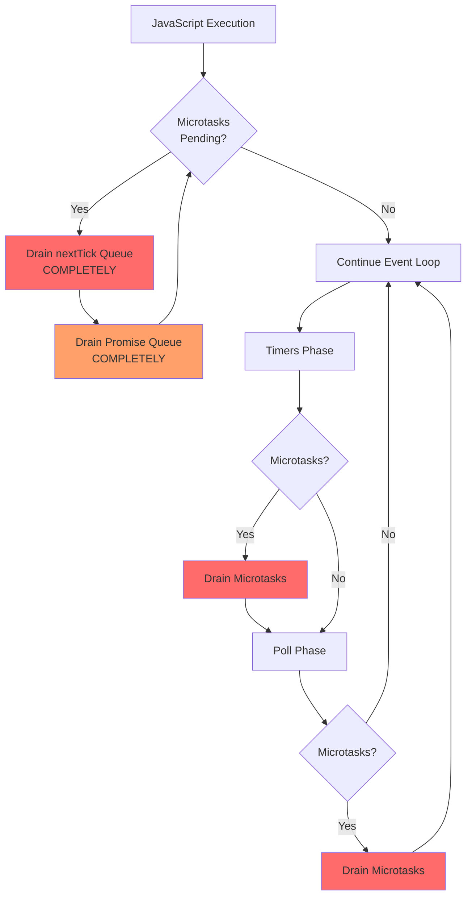
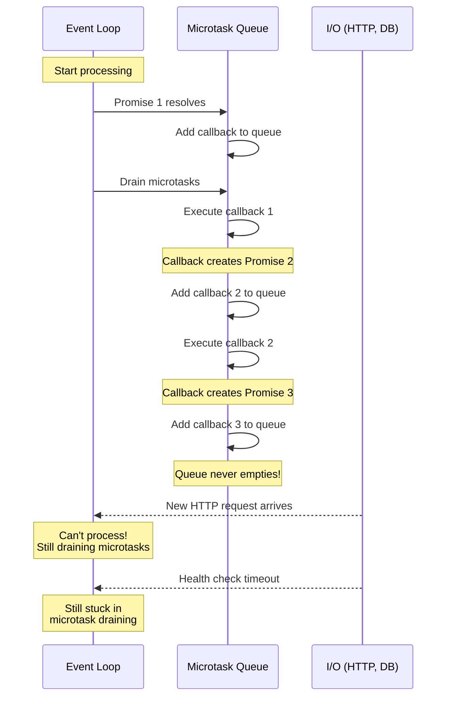
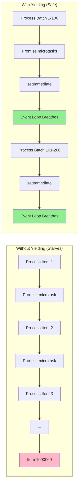

# Promise queues & starvation

## 1. Why this exists (Real-world problem first)

Your API server's health check endpoint times out during deployment. CPU is at 100%, but no requests are being processed. The culprit? A recursive Promise chain processing 100,000 items is monopolizing the microtask queue, preventing the event loop from ever reaching the Poll phase to accept new HTTP connections.

**Real production failures from Promise queue starvation:**

1. **The Infinite Loop**: A data migration script uses recursive Promises to process records. Each Promise resolution schedules another Promise. The microtask queue never empties. Health checks timeout. Kubernetes kills the pod before migration completes.

2. **The Batch Processor**: A background job processes 50,000 user notifications using `Promise.all()`. Each notification creates multiple Promises. The microtask queue grows to millions of entries. Event loop lag spikes to 10 seconds. All requests timeout.

3. **The Recursive Validator**: A JSON schema validator uses Promises for async validation rules. For deeply nested objects (1000+ levels), it creates a Promise chain that starves I/O. The server appears frozen but CPU is maxed out.

**What breaks without this knowledge:**
- You can't debug "frozen" servers with high CPU
- You don't understand event loop lag spikes
- You write code that accidentally starves I/O
- You fail to optimize Promise-heavy workloads

## 2. Mental model (build imagination)

Think of the microtask queue as a **VIP Fast Lane** at an airport security checkpoint.

### The Airport Security Analogy

**Main Security Line (Event Loop Phases)**:
- Regular passengers (I/O callbacks, timers)
- Wait in line for their turn
- Processed in order: Timers → Poll → Check

**VIP Fast Lane (Microtask Queue)**:
- Premium passengers (Promises, process.nextTick)
- Skip the main line entirely
- MUST be completely empty before regular passengers proceed

**The Problem**:
If VIP passengers keep arriving faster than they're processed:
- VIP lane never empties
- Regular passengers wait indefinitely
- Airport appears "stuck" even though security is working

**The Flow:**
1. Regular passenger (HTTP request) arrives at Poll phase
2. VIP passenger (Promise) arrives
3. Security STOPS processing regular line
4. Processes ALL VIPs until lane is empty
5. Only then returns to regular passengers
6. If more VIPs arrive during processing, repeat step 3

**Why this matters:**
- Microtasks have absolute priority
- Recursive Promises can starve the event loop
- Understanding this prevents production freezes

## 3. How Node.js implements this internally

The microtask queue is managed by V8, not libuv. It's checked after every JavaScript operation.

### Microtask Queue Structure

```javascript
// Simplified V8 microtask queue
class MicrotaskQueue {
  constructor() {
    this.nextTickQueue = [];      // Highest priority
    this.promiseQueue = [];        // Second priority
  }
  
  enqueue(type, callback) {
    if (type === 'nextTick') {
      this.nextTickQueue.push(callback);
    } else {
      this.promiseQueue.push(callback);
    }
  }
  
  drain() {
    // Drain nextTick queue completely
    while (this.nextTickQueue.length > 0) {
      const callback = this.nextTickQueue.shift();
      callback();
      // Note: callback might add more to queue!
    }
    
    // Then drain Promise queue completely
    while (this.promiseQueue.length > 0) {
      const callback = this.promiseQueue.shift();
      callback();
      // Note: callback might add more to queue!
    }
  }
}
```

### When Microtasks Are Drained

**After every operation:**
```javascript
// Pseudocode for event loop
while (true) {
  runTimers();
  drainMicrotasks(); // ← Drain here
  
  runPendingCallbacks();
  drainMicrotasks(); // ← And here
  
  runPoll();
  drainMicrotasks(); // ← And here
  
  runCheck();
  drainMicrotasks(); // ← And here
  
  runClose();
  drainMicrotasks(); // ← And here
}
```

### Starvation Mechanism

**How starvation occurs:**
```javascript
async function processItems(items) {
  for (const item of items) {
    await processItem(item); // Creates Promise microtask
    // If items.length is large and processing is fast,
    // microtasks are added faster than event loop can progress
  }
}

processItems(millionItems); // Starves event loop!
```

**What happens:**
1. First `await` creates Promise microtask
2. Microtask queue drains, executes Promise callback
3. Callback schedules next `await` (another microtask)
4. Repeat steps 2-3 for all million items
5. Event loop never progresses past microtask draining
6. No I/O processed, no timers fire

### Common Misunderstandings

**Mistake 1**: "Promises are async so they won't block"
- **Reality**: Promise resolution is synchronous in microtask queue
- **Impact**: Heavy Promise chains can block event loop

**Mistake 2**: "await automatically yields to event loop"
- **Reality**: await only yields if the Promise isn't already resolved
- **Impact**: Synchronous Promises don't yield

**Mistake 3**: "Promise.all prevents starvation"
- **Reality**: Promise.all creates many microtasks at once
- **Impact**: Can actually worsen starvation

## 4. Multiple diagrams (MANDATORY)

### Diagram 1: Microtask Queue Priority



### Diagram 2: Starvation Scenario



### Diagram 3: Mitigation Strategy



## 5. Where this is used in real projects

### Batch Processing with Yielding

**Scenario**: Processing large datasets

```javascript
// BAD: Starves event loop
async function processAllUsers(users) {
  for (const user of users) {
    await processUser(user); // Creates microtask per user
  }
}

processAllUsers(millionUsers); // Event loop starved!

// GOOD: Yield periodically
async function processAllUsers(users) {
  const batchSize = 100;
  
  for (let i = 0; i < users.length; i += batchSize) {
    const batch = users.slice(i, i + batchSize);
    
    // Process batch (creates microtasks)
    await Promise.all(batch.map(processUser));
    
    // Yield to event loop
    await new Promise(resolve => setImmediate(resolve));
  }
}
```

### Recursive Operations

**Scenario**: Tree traversal

```javascript
// BAD: Recursive Promises starve loop
async function traverseTree(node) {
  await processNode(node);
  
  if (node.children) {
    for (const child of node.children) {
      await traverseTree(child); // Recursive Promise
    }
  }
}

// GOOD: Yield at depth intervals
async function traverseTree(node, depth = 0) {
  await processNode(node);
  
  // Yield every 10 levels
  if (depth % 10 === 0) {
    await new Promise(resolve => setImmediate(resolve));
  }
  
  if (node.children) {
    for (const child of node.children) {
      await traverseTree(child, depth + 1);
    }
  }
}
```

### Stream Processing

**Scenario**: Processing stream chunks

```javascript
// GOOD: Natural yielding with streams
const { Transform } = require('stream');

class ProcessorStream extends Transform {
  async _transform(chunk, encoding, callback) {
    try {
      const processed = await processChunk(chunk);
      this.push(processed);
      callback(); // Yields to event loop
    } catch (err) {
      callback(err);
    }
  }
}

// Stream automatically yields between chunks
```

### Monitoring Microtask Queue

**Scenario**: Detecting starvation in production

```javascript
const { performance } = require('perf_hooks');

let lastCheck = performance.now();
let maxLag = 0;

setInterval(() => {
  const now = performance.now();
  const lag = now - lastCheck - 1000; // Expected 1000ms
  
  if (lag > maxLag) {
    maxLag = lag;
  }
  
  if (lag > 100) {
    console.warn(`Event loop lag: ${lag}ms (max: ${maxLag}ms)`);
    // Alert if consistently high
  }
  
  lastCheck = now;
}, 1000);
```

## 6. Where this should NOT be used

### Synchronous Promise Resolution

**Misuse**: Creating already-resolved Promises in loops

```javascript
// WRONG: Creates microtasks unnecessarily
async function processSync(items) {
  for (const item of items) {
    await Promise.resolve(item); // Microtask for no reason
    console.log(item);
  }
}

// RIGHT: No need for Promises
function processSync(items) {
  for (const item of items) {
    console.log(item);
  }
}
```

### Over-Parallelization

**Misuse**: Promise.all with too many items

```javascript
// WRONG: Creates millions of microtasks
async function processAll(items) {
  await Promise.all(items.map(processItem)); // If items.length = 1M
}

// RIGHT: Batch processing
async function processAll(items) {
  const batchSize = 1000;
  
  for (let i = 0; i < items.length; i += batchSize) {
    const batch = items.slice(i, i + batchSize);
    await Promise.all(batch.map(processItem));
    
    // Yield between batches
    await new Promise(resolve => setImmediate(resolve));
  }
}
```

## 7. Failure modes & edge cases

### Failure Mode 1: Promise Chain Explosion

**Scenario**: Nested Promise.all

```javascript
// DISASTER: Exponential microtask growth
async function processNested(data) {
  await Promise.all(data.map(async (item) => {
    await Promise.all(item.children.map(async (child) => {
      await Promise.all(child.items.map(processItem));
    }));
  }));
}

// If data has 100 items, each with 100 children, each with 100 items:
// 100 * 100 * 100 = 1,000,000 microtasks created instantly
```

**Solution**: Flatten and batch:
```javascript
async function processNested(data) {
  const allItems = data.flatMap(item => 
    item.children.flatMap(child => child.items)
  );
  
  // Process in batches
  const batchSize = 1000;
  for (let i = 0; i < allItems.length; i += batchSize) {
    const batch = allItems.slice(i, i + batchSize);
    await Promise.all(batch.map(processItem));
    await new Promise(resolve => setImmediate(resolve));
  }
}
```

### Failure Mode 2: Unintentional Synchronous Promises

**Scenario**: Cached Promise results

```javascript
const cache = new Map();

async function fetchUser(id) {
  if (cache.has(id)) {
    return cache.get(id); // Returns synchronously!
  }
  
  const user = await db.users.findById(id);
  cache.set(id, user);
  return user;
}

// In a loop, this doesn't yield if cached
for (const id of millionIds) {
  await fetchUser(id); // Synchronous if cached, no yield!
}
```

**Solution**: Force async:
```javascript
async function fetchUser(id) {
  if (cache.has(id)) {
    return Promise.resolve(cache.get(id)); // Forces microtask
  }
  
  const user = await db.users.findById(id);
  cache.set(id, user);
  return user;
}
```

### Edge Case: Promise.race with Many Promises

**Scenario**: Racing thousands of Promises

```javascript
// Creates many microtasks
const fastest = await Promise.race(thousandPromises);

// All losing Promises still resolve and create microtasks
// Can cause microtask queue buildup
```

## 8. Trade-offs & alternatives

### Batching with setImmediate

**Gain**: Prevents starvation, allows I/O
**Sacrifice**: Slower overall processing
**When to use**: Large datasets, background jobs

### Promise.all vs Sequential

**Gain (Promise.all)**: Parallel execution, faster
**Sacrifice**: More microtasks, potential starvation
**When to use**: Small batches (<1000 items)

### Streams vs Promises

**Gain (Streams)**: Natural backpressure, auto-yielding
**Sacrifice**: More complex API
**When to use**: Large data processing, unknown size

## 9. Interview-level articulation

**Q: "What is Promise queue starvation?"**

**A**: "Promise queue starvation occurs when Promise resolutions create new Promises faster than the microtask queue can drain. Since microtasks must be completely drained before the event loop continues, recursive or large Promise chains can prevent I/O from being processed. The event loop appears frozen even though CPU is at 100%. The solution is to yield periodically using `setImmediate` to allow the event loop to process I/O between batches."

**Q: "How do you prevent Promise starvation in batch processing?"**

**A**: "Break large datasets into batches and yield between batches using `setImmediate`. For example, process 100 items with `Promise.all`, then `await new Promise(resolve => setImmediate(resolve))` to yield to the event loop. This allows health checks, metrics, and other I/O to be processed. Monitor event loop lag to detect starvation in production."

## 10. Key takeaways (engineer mindset)

1. **Microtasks have absolute priority** over I/O
2. **Recursive Promises can starve** the event loop
3. **Yield with setImmediate** in long Promise chains
4. **Batch large datasets** (e.g., 100-1000 items per batch)
5. **Monitor event loop lag** to detect starvation

### The Golden Rule

**Yield to the event loop every 100-1000 Promise resolutions** using `setImmediate`. Never process millions of items in a single Promise chain without yielding.
