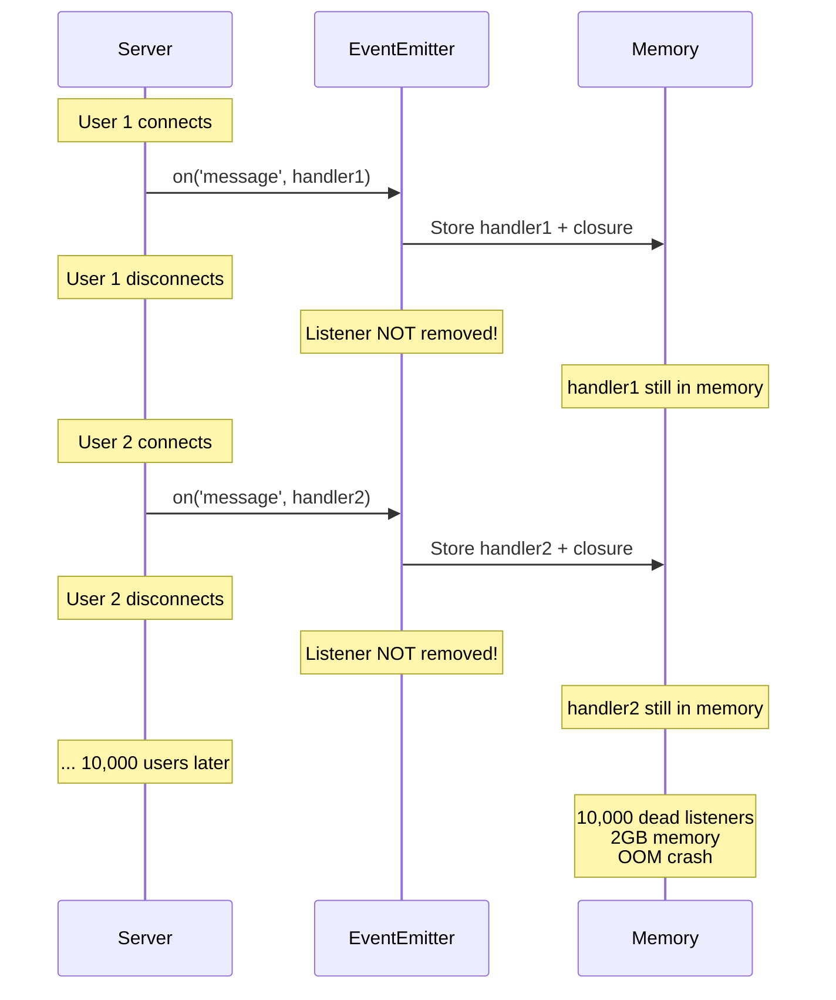
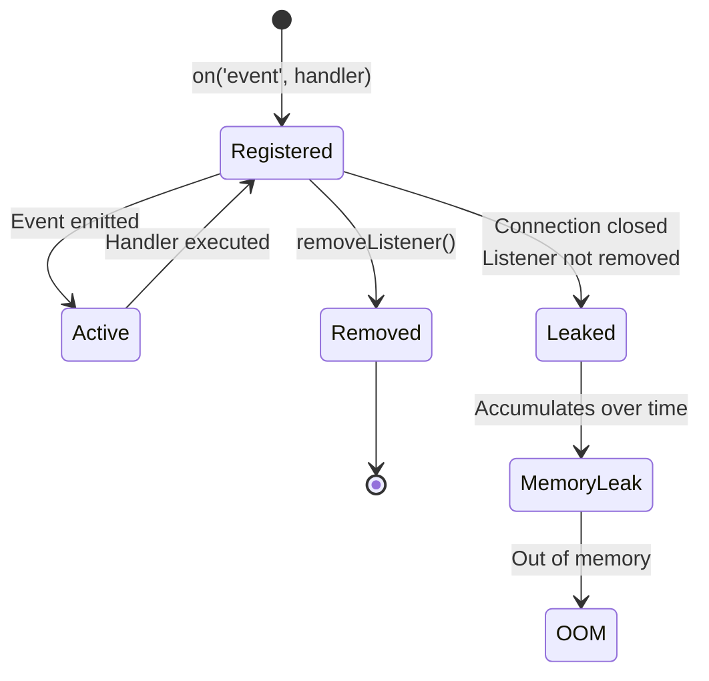
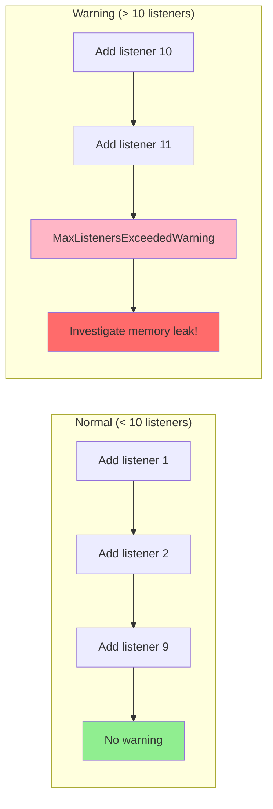

# Event Emitters pitfalls

## 1. Why this exists (Real-world problem first)

Your WebSocket server's memory grows from 200MB to 2GB over 24 hours, then crashes. The culprit? Event listeners never removed. Each connection adds listeners, but disconnection doesn't remove them. After 10,000 connections, millions of dead listeners remain in memory.

**Real production failures from EventEmitter ignorance:**

1. **The Memory Leak Catastrophe**: Chat server adds `message` listener for each user connection. Users disconnect but listeners remain attached to the socket object. After 24 hours of operation: 50,000 dead listeners consuming 2GB memory. Heap snapshot shows millions of closures. OOM crash at peak traffic. Service down for 3 hours. Team doesn't understand "why does memory keep growing?"

2. **The Silent Error Swallower**: Database connection pool emits `error` event when connection fails. No listener attached. Error silently ignored per EventEmitter spec. Connection breaks. All queries hang indefinitely waiting for connection. API returns 504 timeouts. Monitoring shows "database healthy" because error never logged. Takes 4 hours to discover root cause.

3. **The Infinite Loop Crash**: Event handler processes data and emits same event with transformed data. Creates infinite loop. Stack overflow in milliseconds. Process crashes. Happens intermittently when specific data triggers the loop. Impossible to debug without understanding event flow.

4. **The MaxListeners Warning Spam**: Team sees "(node:12345) MaxListenersExceededWarning" in logs. Ignores it as "just a warning." After 2 weeks, server has 10,000 listeners on single emitter. Every event emission iterates 10,000 functions. Performance degrades to 1 req/sec. Production outage.

**What breaks without this knowledge:**
- Memory leaks from unreleased listeners
- Silent errors from missing error handlers
- Infinite loops from recursive events
- Can't debug event-driven code
- Don't understand MaxListeners warning
- Fail to clean up resources properly

## 2. Mental model (build imagination)

Think of EventEmitter as a **Bulletin Board** in an office.

### The Bulletin Board Analogy

**Event Emitter (Bulletin Board)**:
- People post notices (emit events)
- Others subscribe to notices (add listeners)
- When notice posted, all subscribers notified
- Subscribers must unsubscribe when they leave

**The Problems:**

1. **Memory Leak (Forgotten Subscriptions)**:
   - Employee subscribes to "meeting" notices
   - Employee leaves company
   - Never unsubscribes
   - Bulletin board keeps their contact info forever
   - After 1000 employees, 1000 dead subscriptions

2. **Silent Errors (No Error Subscribers)**:
   - Critical "fire alarm" notice posted
   - Nobody subscribed to fire alarms
   - Building burns down
   - Everyone wonders why no alarm sounded

3. **Infinite Loop (Recursive Notices)**:
   - Notice says "when you see this, post another notice"
   - Creates infinite chain of notices
   - Bulletin board overflows
   - Office paralyzed

**Why this matters:**
- Proper cleanup prevents memory leaks
- Error handlers prevent silent failures
- Understanding event flow prevents infinite loops
- EventEmitter is core to Node.js (streams, servers, etc.)

## 3. How Node.js implements this internally

```javascript
// Simplified EventEmitter implementation
class EventEmitter {
  constructor() {
    this.events = {}; // { eventName: [listener1, listener2, ...] }
    this.maxListeners = 10;
  }
  
  on(event, listener) {
    if (!this.events[event]) {
      this.events[event] = [];
    }
    this.events[event].push(listener);
    
    // Memory leak warning
    if (this.events[event].length > this.maxListeners) {
      console.warn(
        `Possible EventEmitter memory leak detected. ` +
        `${this.events[event].length} ${event} listeners added. ` +
        `Use emitter.setMaxListeners() to increase limit`
      );
    }
    
    return this;
  }
  
  emit(event, ...args) {
    if (!this.events[event]) {
      // Special case: 'error' event with no listeners
      if (event === 'error') {
        const err = args[0];
        throw err; // Crashes process!
      }
      return false;
    }
    
    // Call all listeners
    this.events[event].forEach(listener => {
      try {
        listener(...args);
      } catch (err) {
        // Listener errors don't stop other listeners
        console.error('Error in event listener:', err);
      }
    });
    
    return true;
  }
  
  removeListener(event, listener) {
    if (!this.events[event]) return this;
    
    // Remove specific listener
    this.events[event] = this.events[event].filter(l => l !== listener);
    
    return this;
  }
  
  removeAllListeners(event) {
    if (event) {
      delete this.events[event];
    } else {
      this.events = {};
    }
    return this;
  }
  
  once(event, listener) {
    const onceWrapper = (...args) => {
      listener(...args);
      this.removeListener(event, onceWrapper);
    };
    
    this.on(event, onceWrapper);
    return this;
  }
}
```

### Common Misunderstandings

**Mistake 1**: "Listeners are automatically removed"
- **Reality**: Must manually call `removeListener()`
- **Impact**: Memory leaks from accumulated listeners

**Mistake 2**: "Error events are like other events"
- **Reality**: Unhandled error events crash the process
- **Impact**: Production crashes from missing error handlers

**Mistake 3**: "MaxListeners warning is harmless"
- **Reality**: Indicates memory leak or design problem
- **Impact**: Performance degradation, eventual OOM

## 4. Multiple diagrams (MANDATORY)

### Diagram 1: Memory Leak from Unreleased Listeners



### Diagram 2: Error Event Handling

```mermaid
graph TB
    Emit[emit('error', err)] --> Check{Error listener<br/>exists?}
    
    Check -->|Yes| Handle[Call error handler]
    Handle --> Safe[Error handled safely<br/>Process continues]
    
    Check -->|No| Throw[Throw uncaught exception]
    Throw --> Crash[Process crashes<br/>Exit code 1]
    
    style Safe fill:#90EE90
    style Crash fill:#FFB6C6
```

### Diagram 3: Listener Lifecycle



### Diagram 4: MaxListeners Warning



## 5. Where this is used in real projects

### Proper Listener Cleanup (Production Pattern)

```javascript
class ConnectionManager {
  constructor() {
    this.connections = new Map();
  }
  
  addConnection(socket) {
    // Create handlers with proper binding
    const handlers = {
      message: (data) => this.handleMessage(socket, data),
      error: (err) => this.handleError(socket, err),
      close: () => this.handleClose(socket)
    };
    
    // Store handlers for cleanup
    this.connections.set(socket.id, {
      socket,
      handlers,
      createdAt: Date.now()
    });
    
    // Add listeners
    socket.on('message', handlers.message);
    socket.on('error', handlers.error);
    socket.on('close', handlers.close);
    
    console.log(`Connection ${socket.id} added, total: ${this.connections.size}`);
  }
  
  removeConnection(socketId) {
    const conn = this.connections.get(socketId);
    if (!conn) return;
    
    // CRITICAL: Remove all listeners
    conn.socket.removeListener('message', conn.handlers.message);
    conn.socket.removeListener('error', conn.handlers.error);
    conn.socket.removeListener('close', conn.handlers.close);
    
    this.connections.delete(socketId);
    
    console.log(`Connection ${socketId} removed, total: ${this.connections.size}`);
  }
  
  handleMessage(socket, data) {
    console.log(`Message from ${socket.id}:`, data);
    // Process message
  }
  
  handleError(socket, err) {
    console.error(`Socket ${socket.id} error:`, err);
    this.removeConnection(socket.id);
  }
  
  handleClose(socket) {
    console.log(`Socket ${socket.id} closed`);
    this.removeConnection(socket.id);
  }
  
  // Monitor for leaks
  checkForLeaks() {
    const now = Date.now();
    for (const [id, conn] of this.connections) {
      const age = now - conn.createdAt;
      if (age > 24 * 60 * 60 * 1000) { // 24 hours
        console.warn(`Connection ${id} is ${age}ms old, possible leak`);
      }
    }
  }
}

// Usage
const manager = new ConnectionManager();

wss.on('connection', (socket) => {
  manager.addConnection(socket);
});

// Periodic leak check
setInterval(() => manager.checkForLeaks(), 60000);
```

### Always Handle Error Events

```javascript
const db = require('./database');

// WRONG: No error handler
db.on('query', (sql) => {
  console.log(sql);
});
// If db emits 'error', process crashes!

// RIGHT: Always handle errors
db.on('query', (sql) => {
  console.log(sql);
});

db.on('error', (err) => {
  console.error('Database error:', err);
  
  // Attempt reconnection
  setTimeout(() => {
    db.reconnect();
  }, 5000);
  
  // Alert monitoring
  monitoring.alert('database_error', { error: err.message });
});

// Even better: Use once() for one-time events
db.once('connected', () => {
  console.log('Database connected');
  // Listener automatically removed after first emission
});
```

### Avoiding Infinite Loops

```javascript
// WRONG: Recursive event emission
emitter.on('data', (data) => {
  const processed = processData(data);
  emitter.emit('data', processed); // Infinite loop!
});

// RIGHT: Use different event names
emitter.on('rawData', (data) => {
  const processed = processData(data);
  emitter.emit('processedData', processed);
});

emitter.on('processedData', (data) => {
  saveToDatabase(data);
});
```

### Using once() for One-Time Events

```javascript
// Server startup
server.once('listening', () => {
  console.log('Server started');
  // Listener automatically removed
});

// File stream
const stream = fs.createReadStream('large-file.txt');

stream.once('open', () => {
  console.log('File opened');
});

stream.once('end', () => {
  console.log('File read complete');
});

stream.on('error', (err) => {
  console.error('Stream error:', err);
});
```

### Monitoring Listener Count

```javascript
class MonitoredEmitter extends EventEmitter {
  on(event, listener) {
    super.on(event, listener);
    
    const count = this.listenerCount(event);
    if (count > 50) {
      console.error(`High listener count for ${event}: ${count}`);
      console.trace(); // Log stack trace to find source
    }
    
    return this;
  }
  
  getStats() {
    const stats = {};
    for (const event of this.eventNames()) {
      stats[event] = this.listenerCount(event);
    }
    return stats;
  }
}

// Usage
const emitter = new MonitoredEmitter();

// Periodic monitoring
setInterval(() => {
  const stats = emitter.getStats();
  console.log('Listener stats:', stats);
  
  for (const [event, count] of Object.entries(stats)) {
    if (count > 100) {
      console.error(`Possible leak: ${event} has ${count} listeners`);
    }
  }
}, 60000);
```

## 6. Where this should NOT be used

### Using EventEmitter for Request/Response

```javascript
// WRONG: EventEmitter for async operations
function fetchUser(id) {
  const emitter = new EventEmitter();
  
  db.users.findById(id).then(user => {
    emitter.emit('user', user);
  }).catch(err => {
    emitter.emit('error', err);
  });
  
  return emitter;
}

// Usage is awkward
const emitter = fetchUser(123);
emitter.on('user', (user) => {
  console.log(user);
});
emitter.on('error', (err) => {
  console.error(err);
});

// RIGHT: Use Promises/async-await
async function fetchUser(id) {
  return await db.users.findById(id);
}

// Usage is clean
try {
  const user = await fetchUser(123);
  console.log(user);
} catch (err) {
  console.error(err);
}
```

### EventEmitter for Simple Callbacks

```javascript
// WRONG: EventEmitter for single callback
function processData(data) {
  const emitter = new EventEmitter();
  
  setTimeout(() => {
    emitter.emit('done', data.toUpperCase());
  }, 1000);
  
  return emitter;
}

// RIGHT: Use Promise
function processData(data) {
  return new Promise((resolve) => {
    setTimeout(() => {
      resolve(data.toUpperCase());
    }, 1000);
  });
}
```

## 7. Failure modes & edge cases

### Failure Mode 1: Memory Leak Detection

```javascript
// Detect memory leaks
const EventEmitter = require('events');

// Set global default
EventEmitter.defaultMaxListeners = 10;

// Or per-emitter
const emitter = new EventEmitter();
emitter.setMaxListeners(20);

// Monitor warnings
process.on('warning', (warning) => {
  if (warning.name === 'MaxListenersExceededWarning') {
    console.error('Memory leak detected:', warning.message);
    console.trace(); // Log stack trace
  }
});
```

### Failure Mode 2: Unhandled Error Event

```javascript
// DISASTER: No error handler
const stream = fs.createReadStream('nonexistent.txt');
// stream emits 'error', no handler, process crashes

// SAFE: Error handler
const stream = fs.createReadStream('nonexistent.txt');
stream.on('error', (err) => {
  console.error('Stream error:', err);
  // Handle gracefully
});

// SAFEST: Use pipeline with error handling
const { pipeline } = require('stream');

pipeline(
  fs.createReadStream('input.txt'),
  transformStream,
  fs.createWriteStream('output.txt'),
  (err) => {
    if (err) {
      console.error('Pipeline error:', err);
    } else {
      console.log('Pipeline complete');
    }
  }
);
```

### Failure Mode 3: Listener Execution Order

```javascript
// Listeners execute in order added
emitter.on('event', () => console.log('First'));
emitter.on('event', () => console.log('Second'));
emitter.on('event', () => console.log('Third'));

emitter.emit('event');
// Output:
// First
// Second
// Third

// Use prependListener for priority
emitter.prependListener('event', () => console.log('Priority'));
emitter.emit('event');
// Output:
// Priority
// First
// Second
// Third
```

## 8. Trade-offs & alternatives

### EventEmitter

**Gain**: Decoupled components, pub/sub pattern, multiple subscribers
**Sacrifice**: Memory leaks if not careful, harder to debug, no return values
**When**: Streams, servers, long-lived objects with multiple events

### Promises

**Gain**: Single-use, auto-cleanup, easier to reason about, return values
**Sacrifice**: Can't emit multiple values, single subscriber
**When**: One-time async operations, request/response patterns

### Async Iterators (Alternative)

**Gain**: Multiple values over time, backpressure support
**Sacrifice**: More complex, newer API
**When**: Streaming data, async sequences

## 9. Interview-level articulation

**Q: "How do you prevent memory leaks with EventEmitters?"**

**A**: "I always remove listeners when they're no longer needed. For example, in a WebSocket server, when a socket disconnects, I call `removeListener()` for all handlers I added. I store references to handler functions in a Map so I can remove them later—you can't remove anonymous functions. I also set `maxListeners` to detect leaks early in development—if I see MaxListenersExceededWarning, I investigate immediately. For streams, I use `once()` instead of `on()` when I only need one event, as `once()` automatically removes the listener after first emission."

**Q: "What happens if you emit an error event with no listeners?"**

**A**: "If you emit an 'error' event and there are no listeners, Node.js throws the error as an uncaught exception, which crashes the process. This is a special case—other events just return false if there are no listeners. That's why I always add error handlers to streams, database connections, and any EventEmitter that might fail. It's a common source of production crashes when developers forget to handle errors on streams or network connections."

**Q: "When would you use EventEmitter vs Promises?"**

**A**: "I use EventEmitter for long-lived objects that emit multiple events over time, like streams, servers, or WebSocket connections. For example, a stream emits 'data', 'end', 'error', and 'close' events. I use Promises for one-time async operations like HTTP requests or database queries. Promises are simpler—they resolve once and clean up automatically. EventEmitters require manual cleanup but support multiple subscribers and multiple events. If I need to convert between them, I can wrap an EventEmitter in a Promise using `once()` or use async iterators for streams."

## 10. Key takeaways (engineer mindset)

### What to Remember

1. **Always remove listeners** when done (`removeListener()`)
2. **Always handle 'error' events** (or process crashes)
3. **Avoid recursive event emission** (use different event names)
4. **Use `once()` for one-time events** (auto-cleanup)
5. **Set `maxListeners`** to detect leaks early
6. **Store handler references** for cleanup
7. **Monitor listener counts** in production

### What Decisions This Enables

**Memory decisions**:
- Clean up listeners on disconnect
- Use `once()` for one-time events
- Monitor listener counts

**Reliability decisions**:
- Always handle error events
- Prevent process crashes
- Graceful error recovery

**Architecture decisions**:
- EventEmitter for multi-event objects
- Promises for one-time operations
- Async iterators for streams

### How It Connects to Other Node.js Concepts

**Streams** (Topic 7):
- Streams are EventEmitters
- Must handle error events
- Backpressure via events

**Process Lifecycle** (Topic 9):
- Process is an EventEmitter
- Lifecycle events (exit, SIGTERM)

**Async Context** (Topic 18):
- Event listeners lose context
- Need AsyncLocalStorage

### The Golden Rule

**Every `on()` needs a corresponding `removeListener()`**. Always handle 'error' events. Prefer Promises for one-time operations. Use `once()` when you only need one event. Monitor listener counts in production to detect leaks early.
