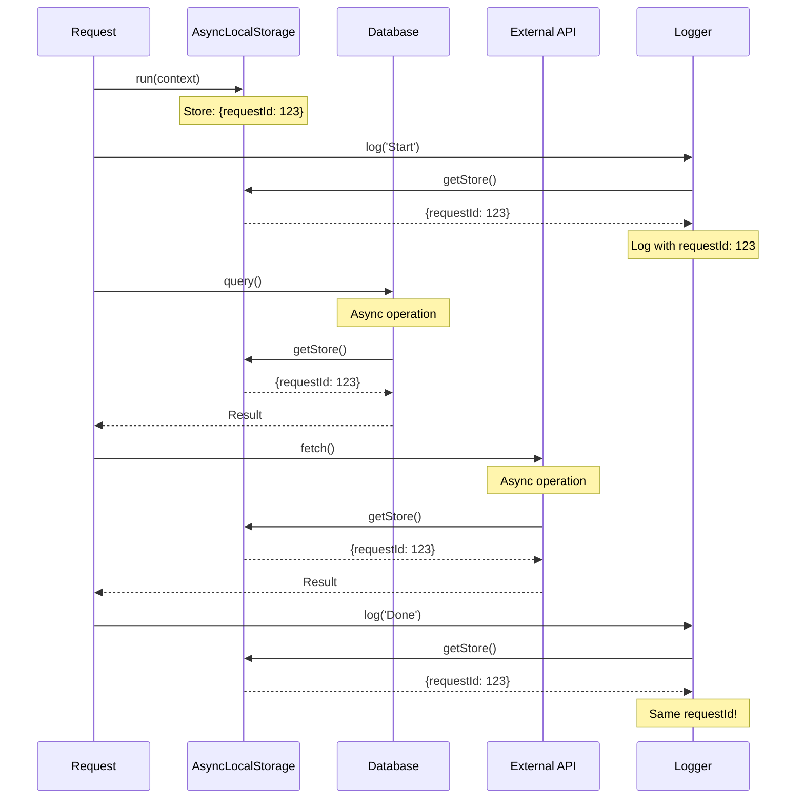
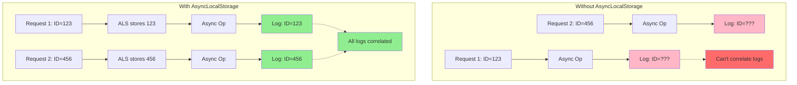
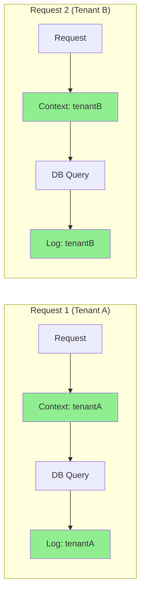
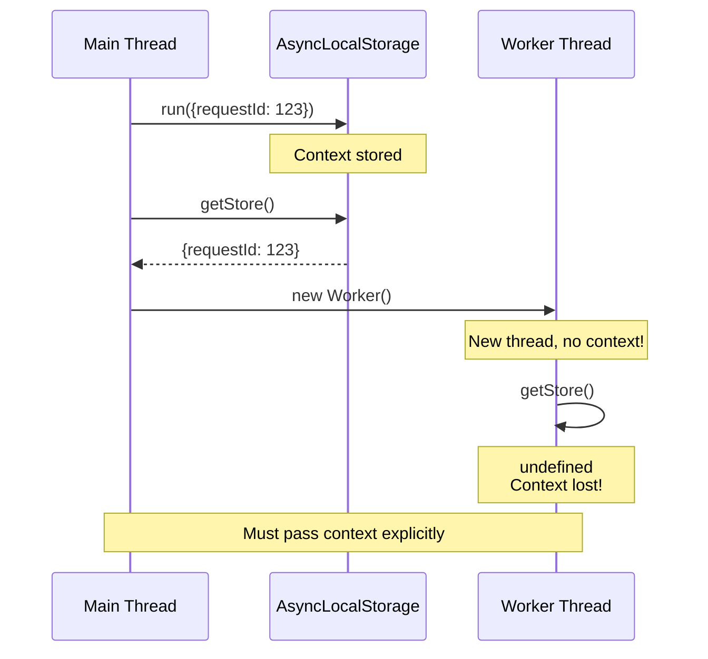

# Async context tracking

## 1. Why this exists (Real-world problem first)

Your distributed tracing shows requests with the same trace ID appearing as different requests. Logs from a single request are scattered across multiple trace IDs. The problem? Request context is lost across async boundaries. Each `await` loses the original request ID.

**Real production failures from context loss:**

1. **The Lost Trace Nightmare**: Microservice logs requests with trace IDs for debugging. Async operations (database queries, HTTP calls) lose context. Single request appears as 50 different requests in logs with 50 different trace IDs. Team spends 8 hours trying to trace a bug, can't correlate logs. Debugging impossible. Customer escalation.

2. **The Wrong User Data Leak**: Multi-tenant SaaS uses global variable for current user context. Request A starts processing for User A. Request B starts for User B. Request A's async callback executes with User B's context. User A sees User B's data. GDPR violation. $50K fine. Security audit required.

3. **The Missing Metrics Disaster**: APM tool tracks request duration using request start time. Async callbacks lose request context. All metrics show 0ms duration. Team can't identify slow endpoints. Performance issues go undetected for weeks. Customer churn increases.

4. **The Rate Limit Bypass**: API implements per-user rate limiting. Stores current user in global variable. Async operations interleave. User A's request checks rate limit with User B's context. Rate limiting broken. API overwhelmed. Service degradation.

**What breaks without this knowledge:**
- Can't trace requests across async operations
- Lose context in logs and metrics
- Can't implement request-scoped data
- Fail to debug distributed systems
- Don't understand async context propagation
- Can't implement proper multi-tenancy

## 2. Mental model (build imagination)

Think of async context as a **Colored Wristband** at a theme park.

### The Wristband Analogy

**Without Context Tracking**:
- Visitor enters park (request starts)
- Gets ticket with group ID
- Goes on ride (async operation)
- Ticket stays at entrance
- Visitor exits ride - park doesn't know which group they're with
- Lost in crowd, can't find group

**With Context Tracking (AsyncLocalStorage)**:
- Visitor enters park (request starts)
- Gets wristband with group ID
- Wristband stays on through all rides
- Goes on ride 1 (database query) - still has wristband
- Goes on ride 2 (HTTP call) - still has wristband
- Goes on ride 3 (cache lookup) - still has wristband
- Park always knows which group visitor belongs to
- Can reunite group at end of day

**The Flow:**
1. Request arrives → Create context with request ID
2. Database query → Context automatically propagates
3. HTTP call to service → Context still available
4. Cache lookup → Context still available
5. Response sent → Context available for logging

**Why this matters:**
- Context persists across async boundaries
- Enables distributed tracing
- Allows request-scoped logging
- Supports multi-tenant data isolation

## 3. How Node.js implements this internally

AsyncLocalStorage uses V8's async hooks to track context across async operations.

### AsyncLocalStorage Implementation

```javascript
const { AsyncLocalStorage } = require('async_hooks');

const requestContext = new AsyncLocalStorage();

// Middleware to set context
app.use((req, res, next) => {
  const context = {
    requestId: req.headers['x-request-id'] || crypto.randomUUID(),
    userId: req.user?.id,
    tenantId: req.headers['x-tenant-id'],
    startTime: Date.now(),
    path: req.path,
    method: req.method
  };
  
  // Run next() within this context
  requestContext.run(context, () => {
    next();
  });
});

// Access context anywhere in request chain
function logMessage(level, message, meta = {}) {
  const context = requestContext.getStore();
  
  console.log(JSON.stringify({
    level,
    message,
    requestId: context?.requestId,
    userId: context?.userId,
    tenantId: context?.tenantId,
    path: context?.path,
    ...meta,
    timestamp: new Date().toISOString()
  }));
}

// Usage in route handler
app.get('/api/users/:id', async (req, res) => {
  logMessage('info', 'Fetching user'); // Has request context!
  
  const user = await db.users.findById(req.params.id);
  logMessage('info', 'User fetched', { userId: user.id }); // Still has context!
  
  const orders = await db.orders.findByUser(user.id);
  logMessage('info', 'Orders fetched', { orderCount: orders.length }); // Still has context!
  
  res.json({ user, orders });
});

// All logs have same requestId!
```

### How It Works Internally

```javascript
// Simplified async hooks implementation
const async_hooks = require('async_hooks');

class AsyncLocalStorage {
  constructor() {
    this.store = new Map();
    this.currentId = null;
    
    // Track async operations
    this.hook = async_hooks.createHook({
      init: (asyncId, type, triggerAsyncId) => {
        // Propagate context to new async operation
        if (this.store.has(triggerAsyncId)) {
          this.store.set(asyncId, this.store.get(triggerAsyncId));
        }
      },
      destroy: (asyncId) => {
        // Cleanup when async operation completes
        this.store.delete(asyncId);
      }
    });
    
    this.hook.enable();
  }
  
  run(store, callback) {
    const asyncId = async_hooks.executionAsyncId();
    this.store.set(asyncId, store);
    
    try {
      return callback();
    } finally {
      // Context automatically propagates to child async operations
    }
  }
  
  getStore() {
    const asyncId = async_hooks.executionAsyncId();
    return this.store.get(asyncId);
  }
}
```

### Common Misunderstandings

**Mistake 1**: "Context is passed as function parameter"
- **Reality**: Context propagates automatically via async hooks
- **Impact**: No need to pass context through every function

**Mistake 2**: "Context works across worker threads"
- **Reality**: Context is per-thread, doesn't cross boundaries
- **Impact**: Must pass context explicitly to workers

**Mistake 3**: "AsyncLocalStorage has no performance cost"
- **Reality**: ~5% overhead from async hooks
- **Impact**: Acceptable for most applications

## 4. Multiple diagrams (MANDATORY)

### Diagram 1: Context Propagation



### Diagram 2: Without vs With Context



### Diagram 3: Multi-Tenant Context Isolation



### Diagram 4: Context Lost in Worker Thread



## 5. Where this is used in real projects

### Production Request Tracing

```javascript
const { AsyncLocalStorage } = require('async_hooks');
const crypto = require('crypto');

const requestContext = new AsyncLocalStorage();

// Middleware
app.use((req, res, next) => {
  const context = {
    requestId: req.headers['x-request-id'] || crypto.randomUUID(),
    userId: req.user?.id,
    path: req.path,
    method: req.method,
    startTime: Date.now(),
    ip: req.ip
  };
  
  requestContext.run(context, () => {
    // Add request ID to response headers
    res.setHeader('X-Request-ID', context.requestId);
    next();
  });
});

// Structured logger
class Logger {
  log(level, message, meta = {}) {
    const context = requestContext.getStore() || {};
    
    const logEntry = {
      level,
      message,
      requestId: context.requestId,
      userId: context.userId,
      path: context.path,
      method: context.method,
      ...meta,
      timestamp: new Date().toISOString()
    };
    
    console.log(JSON.stringify(logEntry));
  }
  
  info(message, meta) { this.log('info', message, meta); }
  warn(message, meta) { this.log('warn', message, meta); }
  error(message, meta) { this.log('error', message, meta); }
}

const logger = new Logger();

// Usage anywhere in request chain
app.get('/api/users/:id', async (req, res) => {
  logger.info('Fetching user', { userId: req.params.id });
  
  const user = await db.users.findById(req.params.id);
  logger.info('User fetched', { userId: user.id, email: user.email });
  
  const orders = await db.orders.findByUser(user.id);
  logger.info('Orders fetched', { orderCount: orders.length });
  
  res.json({ user, orders });
});

// All logs have same requestId for correlation!
```

### Multi-Tenant Context

```javascript
const tenantContext = new AsyncLocalStorage();

// Middleware
app.use((req, res, next) => {
  const tenantId = req.headers['x-tenant-id'] || req.user?.tenantId;
  
  if (!tenantId) {
    return res.status(400).json({ error: 'Missing tenant ID' });
  }
  
  tenantContext.run({ tenantId }, next);
});

// Database wrapper with automatic tenant scoping
class TenantDB {
  async find(collection, query = {}) {
    const { tenantId } = tenantContext.getStore();
    
    return db[collection].find({
      ...query,
      tenantId // Automatically add tenant filter
    });
  }
  
  async findById(collection, id) {
    const { tenantId } = tenantContext.getStore();
    
    const doc = await db[collection].findById(id);
    
    if (doc.tenantId !== tenantId) {
      throw new Error('Access denied: wrong tenant');
    }
    
    return doc;
  }
  
  async create(collection, data) {
    const { tenantId } = tenantContext.getStore();
    
    return db[collection].create({
      ...data,
      tenantId // Automatically add tenant ID
    });
  }
}

const tenantDB = new TenantDB();

// Usage - tenant scoping is automatic!
app.get('/api/users', async (req, res) => {
  const users = await tenantDB.find('users');
  res.json(users);
});

app.post('/api/users', async (req, res) => {
  const user = await tenantDB.create('users', req.body);
  res.json(user);
});
```

### APM Integration

```javascript
const apmContext = new AsyncLocalStorage();

// Middleware
app.use((req, res, next) => {
  const span = {
    traceId: generateTraceId(),
    spanId: generateSpanId(),
    parentSpanId: req.headers['x-parent-span-id'],
    startTime: Date.now(),
    operation: `${req.method} ${req.path}`
  };
  
  apmContext.run(span, () => {
    res.on('finish', () => {
      const duration = Date.now() - span.startTime;
      
      sendToAPM({
        ...span,
        duration,
        statusCode: res.statusCode,
        success: res.statusCode < 400
      });
    });
    
    next();
  });
});

// Instrument database calls
async function instrumentedQuery(sql, params) {
  const parentSpan = apmContext.getStore();
  
  const span = {
    traceId: parentSpan.traceId,
    spanId: generateSpanId(),
    parentSpanId: parentSpan.spanId,
    startTime: Date.now(),
    operation: 'db.query',
    sql
  };
  
  try {
    const result = await db.query(sql, params);
    
    sendToAPM({
      ...span,
      duration: Date.now() - span.startTime,
      success: true
    });
    
    return result;
  } catch (err) {
    sendToAPM({
      ...span,
      duration: Date.now() - span.startTime,
      success: false,
      error: err.message
    });
    
    throw err;
  }
}
```

### Request Duration Tracking

```javascript
const requestMetrics = new AsyncLocalStorage();

app.use((req, res, next) => {
  const metrics = {
    startTime: Date.now(),
    dbQueries: 0,
    cacheHits: 0,
    cacheMisses: 0,
    externalCalls: 0
  };
  
  requestMetrics.run(metrics, () => {
    res.on('finish', () => {
      const duration = Date.now() - metrics.startTime;
      
      console.log({
        path: req.path,
        duration,
        dbQueries: metrics.dbQueries,
        cacheHitRate: metrics.cacheHits / (metrics.cacheHits + metrics.cacheMisses),
        externalCalls: metrics.externalCalls
      });
    });
    
    next();
  });
});

// Track metrics anywhere
async function queryDatabase(sql) {
  const metrics = requestMetrics.getStore();
  if (metrics) metrics.dbQueries++;
  
  return await db.query(sql);
}

async function getFromCache(key) {
  const metrics = requestMetrics.getStore();
  const value = await cache.get(key);
  
  if (metrics) {
    if (value) metrics.cacheHits++;
    else metrics.cacheMisses++;
  }
  
  return value;
}
```

## 6. Where this should NOT be used

### Storing Large Objects

```javascript
// WRONG: Storing large data in context
app.use((req, res, next) => {
  requestContext.run({
    requestId: req.id,
    entireRequest: req, // Large object!
    entireBody: req.body, // Might be huge!
    entireUser: req.user // Unnecessary
  }, next);
});

// RIGHT: Store only IDs and metadata
app.use((req, res, next) => {
  requestContext.run({
    requestId: req.id,
    userId: req.user?.id,
    tenantId: req.user?.tenantId,
    path: req.path
  }, next);
});
```

### Using for Business Logic

```javascript
// WRONG: Using context for business logic
async function processOrder() {
  const { userId } = requestContext.getStore();
  // Business logic shouldn't depend on context
}

// RIGHT: Pass data explicitly
async function processOrder(userId, orderData) {
  // Clear dependencies
}
```

## 7. Failure modes & edge cases

### Failure Mode 1: Context Lost in Worker Threads

**Scenario**: Context doesn't cross worker boundary

```javascript
// WRONG: Context lost in worker
const context = requestContext.getStore();
const worker = new Worker('./worker.js');
// Worker doesn't have context!

// RIGHT: Pass context explicitly
const context = requestContext.getStore();
const worker = new Worker('./worker.js', {
  workerData: { context }
});

// In worker.js
const { workerData } = require('worker_threads');
const { context } = workerData;
// Use context explicitly
```

### Failure Mode 2: Context Lost in setTimeout

**Scenario**: Context propagates but can be confusing

```javascript
// Context DOES propagate to setTimeout
app.get('/test', (req, res) => {
  const context = requestContext.getStore();
  console.log('Immediate:', context.requestId); // 123
  
  setTimeout(() => {
    const context = requestContext.getStore();
    console.log('Timeout:', context.requestId); // Still 123!
  }, 1000);
  
  res.send('OK');
});

// But be careful with long delays
setTimeout(() => {
  // Context might be from a different request
  // if original request already completed
}, 60000);
```

### Failure Mode 3: Performance Overhead

**Scenario**: Async hooks have ~5% overhead

```javascript
// Monitor performance impact
const { performance } = require('perf_hooks');

app.use((req, res, next) => {
  const start = performance.now();
  
  requestContext.run({ requestId: req.id }, () => {
    next();
  });
  
  res.on('finish', () => {
    const duration = performance.now() - start;
    if (duration > 100) {
      console.warn(`Slow request: ${duration}ms`);
    }
  });
});
```

## 8. Trade-offs & alternatives

### AsyncLocalStorage

**Gain**: Automatic context propagation, clean code, no parameter passing
**Sacrifice**: Small performance overhead (~5%), doesn't cross worker boundaries
**When**: Request tracing, multi-tenancy, APM, logging

### Manual Context Passing (Alternative)

**Gain**: No performance overhead, explicit dependencies
**Sacrifice**: Must pass context through every function, verbose
**When**: Performance-critical code, simple applications

## 9. Interview-level articulation

**Q: "How do you track request context across async operations?"**

**A**: "I use AsyncLocalStorage from Node.js's async_hooks module. In middleware, I call `requestContext.run()` with the request ID and other metadata like user ID and tenant ID. This context automatically propagates through all async operations—database queries, HTTP calls, cache lookups—without needing to pass it as a parameter. Anywhere in the request chain, I can call `requestContext.getStore()` to access the original context. This enables distributed tracing where all logs for a single request have the same request ID, making debugging much easier. It also enables multi-tenant data isolation where database queries are automatically scoped to the current tenant."

**Q: "What's the performance impact of AsyncLocalStorage?"**

**A**: "AsyncLocalStorage uses async_hooks which adds about 5% overhead. This is because it tracks every async operation to propagate context. For most applications, this is acceptable given the benefits of automatic context propagation. If performance is critical, I'd measure the impact in my specific use case. Alternatives include manual context passing through function parameters, which has no overhead but is more verbose, or using a library like cls-hooked which has similar overhead. The key is that the overhead is constant per async operation, not per request, so it scales well."

**Q: "Does AsyncLocalStorage work across worker threads?"**

**A**: "No, AsyncLocalStorage is per-thread and doesn't cross worker thread boundaries. Each worker thread has its own AsyncLocalStorage instance. If I need context in a worker thread, I must pass it explicitly via workerData when creating the worker. This is actually a good design because worker threads are meant to be isolated. For cluster workers, each worker process has its own AsyncLocalStorage, which works fine since each worker handles complete requests independently."

## 10. Key takeaways (engineer mindset)

### What to Remember

1. **AsyncLocalStorage** for automatic context propagation
2. **Set context in middleware** early in request lifecycle
3. **Access with `getStore()`** anywhere in async chain
4. **Store only metadata**, not large objects
5. **Context doesn't cross worker boundaries**
6. **~5% performance overhead** from async hooks
7. **Perfect for logging, tracing, multi-tenancy**

### What Decisions This Enables

**Observability decisions**:
- Distributed tracing with request IDs
- Structured logging with context
- APM integration with spans

**Architecture decisions**:
- Multi-tenant data isolation
- Request-scoped caching
- Automatic tenant filtering

**Debugging decisions**:
- Correlate logs across services
- Track request flow
- Identify slow operations

### How It Connects to Other Node.js Concepts

**Event Loop** (Topic 2):
- Context propagates through event loop
- Async hooks track async operations

**Promises** (Topic 11):
- Context propagates through Promise chains
- Works with async/await

**Cluster Module** (Topic 15):
- Each worker has separate context
- Context doesn't cross process boundaries

### The Golden Rule

**Use AsyncLocalStorage for request-scoped data**. Set context early in middleware. Access it anywhere in the async chain. Keep stored data small (IDs and metadata only). Remember context doesn't cross worker thread boundaries—pass it explicitly when needed.
