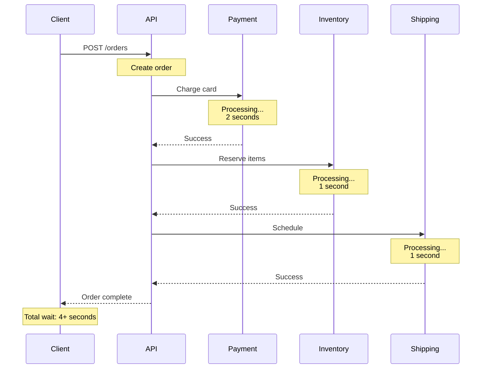
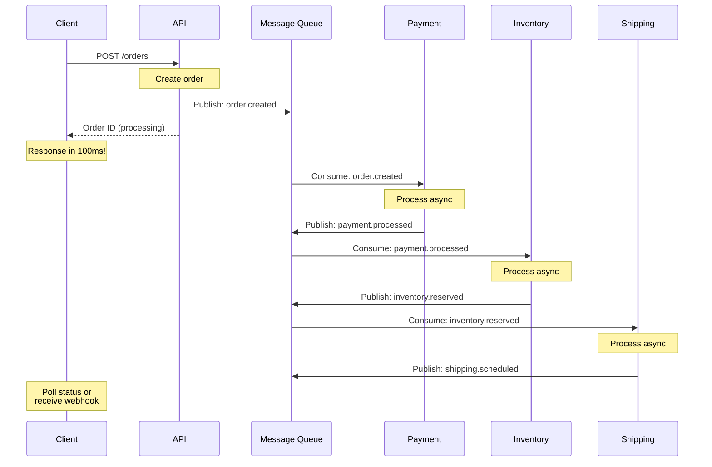
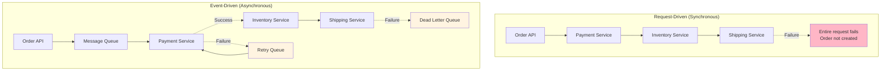
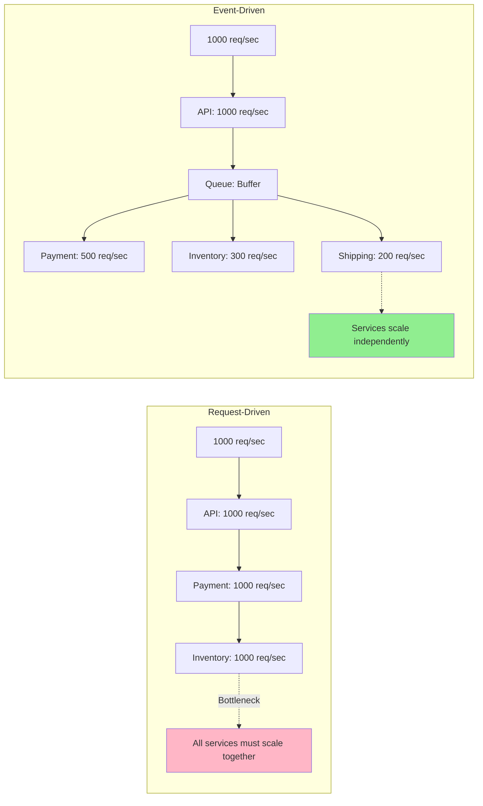

# Event-Driven vs Request-Driven systems

## 1. Why this exists (Real-world problem first)

Your e-commerce platform processes 10,000 orders per minute during Black Friday. Order service creates order, then calls payment service, then calls inventory service, then calls shipping service. Each call waits for response. One service slows down, entire chain blocks. Timeouts cascade. Orders fail. The problem? Request-driven architecture can't handle high-volume, loosely-coupled workflows.

**Real production failures from request-driven architecture:**

1. **The Black Friday Cascade**: E-commerce platform uses synchronous request-driven architecture. Order → Payment → Inventory → Shipping. Payment service slows to 2 seconds per request due to bank API issues. Order service times out after 5 seconds. But 3 requests are queued behind each slow payment. Order service exhausts connection pool. All new orders fail with "Service Unavailable." $2M in lost sales in 30 minutes. Team can't fix payment service (external dependency). Can only restart order service repeatedly.

2. **The Notification Explosion**: SaaS platform sends email notifications synchronously in request handler. User updates profile → API calls email service → waits for SMTP response. Email service is slow (3 seconds per email). During product launch, 50,000 users update profiles. API response time goes from 100ms to 3+ seconds. Users see loading spinners. Retry requests. API overwhelmed. Crashes. Team doesn't understand "why does profile update need to be so slow?"

3. **The Audit Log Bottleneck**: Banking app writes audit logs synchronously. Every API call writes to audit database before responding. Audit DB has slow query (missing index). All API calls slow to 500ms. Users complain app is "frozen." Team adds more API servers. Doesn't help—audit DB is bottleneck. Can't scale horizontally. Can't disable audit logging (compliance requirement).

4. **The Microservice Timeout Chain**: Order service calls 5 microservices synchronously: User → Product → Inventory → Payment → Shipping. Each has 2-second timeout. Total worst case: 10 seconds. One service (Shipping) has intermittent issues, times out 10% of requests. Order service retries 3 times. Now 30% of orders take 6+ seconds. Users abandon carts. Conversion rate drops 40%.

**What breaks without event-driven architecture:**
- Can't handle high-volume asynchronous workflows
- Can't decouple services (tight coupling)
- Can't scale independently
- Can't handle partial failures gracefully
- Can't process non-critical tasks asynchronously
- Don't understand when to use events vs requests

## 2. Mental model (build imagination)

Think of event-driven vs request-driven as **Restaurant Service Models**.

### The Restaurant Analogy

**Request-Driven (Table Service)**:
- Customer orders food (request)
- Waiter takes order to kitchen (synchronous call)
- Waiter WAITS at kitchen window (blocking)
- Chef cooks food
- Waiter brings food back to customer (response)
- Waiter can't serve other customers while waiting
- If kitchen is slow, all customers wait

**Event-Driven (Fast Food Counter)**:
- Customer orders food (event emitted)
- Cashier gives customer a number (acknowledgment)
- Customer sits down (request completes)
- Kitchen sees order on screen (event consumed)
- Chef cooks food (async processing)
- Kitchen calls number when ready (event emitted)
- Customer picks up food (event consumed)
- Cashier can serve other customers immediately

**The Flow:**

**Request-Driven:**
1. Client calls API: "Create order"
2. API calls Payment: "Charge card" (waits)
3. Payment calls Bank: "Process" (waits)
4. Bank responds to Payment
5. Payment responds to API
6. API responds to Client
7. Total time: Sum of all calls

**Event-Driven:**
1. Client calls API: "Create order"
2. API emits event: "OrderCreated"
3. API responds to Client immediately
4. Payment service consumes "OrderCreated" (async)
5. Payment emits "PaymentProcessed" (async)
6. Inventory consumes "PaymentProcessed" (async)
7. Total client wait time: Just API call

**Why this matters:**
- Request-driven: Simple, synchronous, tightly coupled
- Event-driven: Complex, asynchronous, loosely coupled
- Request-driven: Good for immediate responses
- Event-driven: Good for workflows, high volume, resilience

## 3. How Node.js implements this internally

### Request-Driven Implementation

```javascript
// Traditional request-driven
app.post('/orders', async (req, res) => {
  try {
    // Synchronous chain of calls
    const order = await orderService.create(req.body);
    const payment = await paymentService.charge(order); // Waits
    const inventory = await inventoryService.reserve(order); // Waits
    const shipping = await shippingService.schedule(order); // Waits
    
    res.json({ success: true, order });
  } catch (err) {
    // If any step fails, entire request fails
    res.status(500).json({ error: err.message });
  }
});

// Total response time = sum of all service calls
// If payment is slow, user waits
// If inventory fails, order is not created
```

### Event-Driven Implementation

```javascript
const EventEmitter = require('events');
const eventBus = new EventEmitter();

// API responds immediately
app.post('/orders', async (req, res) => {
  const order = await orderService.create(req.body);
  
  // Emit event and return immediately
  eventBus.emit('order.created', order);
  
  res.json({ success: true, orderId: order.id, status: 'processing' });
  // User gets response in <100ms
});

// Async event handlers
eventBus.on('order.created', async (order) => {
  try {
    const payment = await paymentService.charge(order);
    eventBus.emit('payment.processed', { order, payment });
  } catch (err) {
    eventBus.emit('payment.failed', { order, error: err });
  }
});

eventBus.on('payment.processed', async ({ order, payment }) => {
  try {
    await inventoryService.reserve(order);
    eventBus.emit('inventory.reserved', { order });
  } catch (err) {
    eventBus.emit('inventory.failed', { order, error: err });
  }
});

eventBus.on('payment.failed', async ({ order, error }) => {
  await orderService.updateStatus(order.id, 'payment_failed');
  await notificationService.sendEmail(order.userId, 'Payment failed');
});
```

### Message Queue Implementation (Production)

```javascript
const amqp = require('amqplib');

// Publisher
async function createOrder(orderData) {
  const order = await orderService.create(orderData);
  
  // Publish to message queue
  await publishEvent('order.created', order);
  
  return order;
}

async function publishEvent(eventType, data) {
  const connection = await amqp.connect('amqp://localhost');
  const channel = await connection.createChannel();
  
  await channel.assertExchange('orders', 'topic', { durable: true });
  
  channel.publish(
    'orders',
    eventType,
    Buffer.from(JSON.stringify(data)),
    { persistent: true }
  );
  
  await channel.close();
  await connection.close();
}

// Consumer (separate process/service)
async function startPaymentConsumer() {
  const connection = await amqp.connect('amqp://localhost');
  const channel = await connection.createChannel();
  
  await channel.assertExchange('orders', 'topic', { durable: true });
  await channel.assertQueue('payment-queue', { durable: true });
  await channel.bindQueue('payment-queue', 'orders', 'order.created');
  
  channel.consume('payment-queue', async (msg) => {
    const order = JSON.parse(msg.content.toString());
    
    try {
      const payment = await paymentService.charge(order);
      await publishEvent('payment.processed', { order, payment });
      channel.ack(msg);
    } catch (err) {
      await publishEvent('payment.failed', { order, error: err.message });
      channel.nack(msg, false, true); // Requeue
    }
  });
}
```

### Common Misunderstandings

**Mistake 1**: "Event-driven is always better"
- **Reality**: Request-driven is simpler for immediate responses
- **Impact**: Over-engineering simple CRUD APIs

**Mistake 2**: "Events are just async function calls"
- **Reality**: Events decouple producers from consumers
- **Impact**: Missing the point of loose coupling

**Mistake 3**: "Event-driven means no waiting"
- **Reality**: Client still waits for final result (via polling/webhooks)
- **Impact**: Poor UX if not designed properly

## 4. Multiple diagrams (MANDATORY)

### Diagram 1: Request-Driven Flow



### Diagram 2: Event-Driven Flow



### Diagram 3: Failure Handling Comparison



### Diagram 4: Scalability Comparison



## 5. Where this is used in real projects

### Request-Driven Use Cases

**1. CRUD APIs** (Read/Write immediate data):
```javascript
// User profile - immediate response needed
app.get('/users/:id', async (req, res) => {
  const user = await db.users.findById(req.params.id);
  res.json(user);
});

app.put('/users/:id', async (req, res) => {
  const user = await db.users.update(req.params.id, req.body);
  res.json(user);
});
```

**2. Authentication** (Immediate validation):
```javascript
app.post('/login', async (req, res) => {
  const user = await authService.validate(req.body);
  const token = await authService.generateToken(user);
  res.json({ token });
});
```

**3. Search/Query** (Immediate results):
```javascript
app.get('/products/search', async (req, res) => {
  const results = await searchService.query(req.query.q);
  res.json(results);
});
```

### Event-Driven Use Cases

**1. Order Processing** (Multi-step workflow):
```javascript
// Order creation
app.post('/orders', async (req, res) => {
  const order = await orderService.create(req.body);
  await eventBus.publish('order.created', order);
  res.json({ orderId: order.id, status: 'processing' });
});

// Separate consumers
eventBus.subscribe('order.created', processPayment);
eventBus.subscribe('payment.processed', reserveInventory);
eventBus.subscribe('inventory.reserved', scheduleShipping);
```

**2. Notifications** (Non-blocking):
```javascript
// User registration
app.post('/register', async (req, res) => {
  const user = await userService.create(req.body);
  
  // Emit events for async processing
  await eventBus.publish('user.registered', user);
  
  res.json({ userId: user.id });
});

// Async consumers
eventBus.subscribe('user.registered', sendWelcomeEmail);
eventBus.subscribe('user.registered', createDefaultSettings);
eventBus.subscribe('user.registered', trackAnalytics);
```

**3. Data Sync** (Eventually consistent):
```javascript
// Update user in primary DB
app.put('/users/:id', async (req, res) => {
  const user = await db.users.update(req.params.id, req.body);
  
  // Sync to other systems asynchronously
  await eventBus.publish('user.updated', user);
  
  res.json(user);
});

// Consumers sync to various systems
eventBus.subscribe('user.updated', syncToElasticsearch);
eventBus.subscribe('user.updated', syncToDataWarehouse);
eventBus.subscribe('user.updated', invalidateCache);
```

## 6. Where this should NOT be used

### Event-Driven Misuse

**1. Simple CRUD** (Over-engineering):
```javascript
// WRONG: Event-driven for simple read
app.get('/users/:id', async (req, res) => {
  await eventBus.publish('user.fetch.requested', { id: req.params.id });
  // How does client get the user? Polling? WebSocket?
  res.json({ status: 'processing' });
});

// RIGHT: Request-driven for immediate data
app.get('/users/:id', async (req, res) => {
  const user = await db.users.findById(req.params.id);
  res.json(user);
});
```

**2. Immediate Validation** (Wrong pattern):
```javascript
// WRONG: Event-driven for validation
app.post('/login', async (req, res) => {
  await eventBus.publish('login.attempted', req.body);
  res.json({ status: 'processing' });
  // User can't log in without token!
});

// RIGHT: Request-driven for immediate response
app.post('/login', async (req, res) => {
  const token = await authService.login(req.body);
  res.json({ token });
});
```

### Request-Driven Misuse

**1. Long-Running Tasks** (Blocking):
```javascript
// WRONG: Synchronous video processing
app.post('/videos/transcode', async (req, res) => {
  const video = await transcodeVideo(req.file); // Takes 5 minutes!
  res.json(video);
});

// RIGHT: Event-driven for long tasks
app.post('/videos/transcode', async (req, res) => {
  const job = await jobQueue.add('transcode', req.file);
  res.json({ jobId: job.id, status: 'queued' });
});
```

**2. High-Volume Workflows** (Tight coupling):
```javascript
// WRONG: Synchronous notification sending
app.post('/announcements', async (req, res) => {
  const users = await db.users.findAll(); // 1M users
  for (const user of users) {
    await emailService.send(user.email, req.body); // 1M API calls!
  }
  res.json({ sent: users.length });
});

// RIGHT: Event-driven for bulk operations
app.post('/announcements', async (req, res) => {
  await eventBus.publish('announcement.created', req.body);
  res.json({ status: 'queued' });
});
```

## 7. Failure modes & edge cases

### Request-Driven Failures

**1. Cascade Failures**:
```
Order API (healthy) → Payment API (slow: 5s) → Inventory API (timeout)
Result: All orders fail, even though only Payment is slow
```

**2. Timeout Chains**:
```
Service A (2s timeout) → Service B (2s timeout) → Service C (2s timeout)
Worst case: 6 seconds total
User abandons request
```

### Event-Driven Failures

**1. Message Loss**:
```
Event published → Queue crashes before persistence
Event lost forever
Order created but never processed
```

**Solution**: Durable queues, acknowledgments

**2. Duplicate Processing**:
```
Event consumed → Processing → Crash before ACK
Event redelivered → Processed again
User charged twice
```

**Solution**: Idempotency (covered in Topic 23)

**3. Event Ordering**:
```
Event 1: "Order Created" (delayed)
Event 2: "Order Cancelled" (processed first)
Result: Cancel fails (order doesn't exist yet)
```

**Solution**: Event versioning, timestamps, ordering guarantees

## 8. Trade-offs & alternatives

### Request-Driven

**Gain**: Simple, immediate response, easy debugging, strong consistency
**Sacrifice**: Tight coupling, poor scalability, cascade failures
**When**: CRUD, auth, search, immediate validation

### Event-Driven

**Gain**: Loose coupling, scalability, resilience, async processing
**Sacrifice**: Complexity, eventual consistency, harder debugging
**When**: Workflows, high volume, long-running tasks, notifications

### Hybrid Approach (Best Practice)

```javascript
// Request-driven for immediate operations
app.post('/orders', async (req, res) => {
  // Synchronous: Create order, validate payment method
  const order = await orderService.create(req.body);
  await paymentService.validateCard(order.paymentMethod);
  
  // Event-driven: Async processing
  await eventBus.publish('order.created', order);
  
  res.json({ orderId: order.id, status: 'processing' });
});
```

## 9. Interview-level articulation

**Q: "When would you use event-driven vs request-driven architecture?"**

**A**: "I use request-driven for operations that need immediate responses—CRUD APIs, authentication, search queries. The client needs the data now, and the operation is fast. I use event-driven for workflows that don't need immediate completion—order processing, notifications, data synchronization. For example, when a user creates an order, I create the order record synchronously and return the order ID immediately. Then I emit an 'order.created' event that triggers async processing—payment, inventory, shipping. This gives the user a fast response while handling complex workflows asynchronously. The key decision factor is: does the client need to wait for the entire workflow, or just acknowledgment that it started?"

**Q: "What are the challenges of event-driven architecture?"**

**A**: "The main challenges are complexity, eventual consistency, and debugging. With request-driven, you have a clear call stack—if something fails, you know exactly where. With event-driven, events flow through queues and multiple consumers, making it harder to trace failures. You also have to handle duplicate events (idempotency), message ordering, and partial failures. For example, if payment succeeds but inventory reservation fails, you need compensating transactions. The trade-off is worth it for scalability and resilience, but you need proper monitoring, distributed tracing, and dead letter queues to handle failures gracefully."

## 10. Key takeaways (engineer mindset)

### What to Remember

1. **Request-driven**: Synchronous, immediate response, tight coupling
2. **Event-driven**: Asynchronous, eventual consistency, loose coupling
3. **Use request-driven** for CRUD, auth, search, immediate data
4. **Use event-driven** for workflows, notifications, long tasks
5. **Hybrid approach** is often best (sync + async)
6. **Event-driven requires** idempotency, retry logic, monitoring
7. **Request-driven fails** with cascade failures, tight coupling

### What Decisions This Enables

**Architecture decisions**:
- When to use synchronous vs asynchronous processing
- How to decouple microservices
- How to handle long-running workflows

**Scalability decisions**:
- Independent service scaling
- Queue-based load leveling
- Handling traffic spikes

**Reliability decisions**:
- Graceful degradation
- Retry strategies
- Failure isolation

### How It Connects to Other Node.js Concepts

**Event Loop** (Topic 2):
- Event-driven leverages Node.js's async nature
- Non-blocking I/O enables event processing

**Async/Await** (Topic 11):
- Request-driven uses async/await for sequential calls
- Event-driven uses async/await in event handlers

**Message Brokers** (Topic 21):
- Event-driven requires message queues
- RabbitMQ, Kafka, Redis for event distribution

### The Golden Rule

**Use request-driven for immediate responses**. Use event-driven for workflows and async processing. Most production systems use a hybrid approach—synchronous for critical path, asynchronous for everything else. Choose based on whether the client needs to wait for completion or just acknowledgment.
