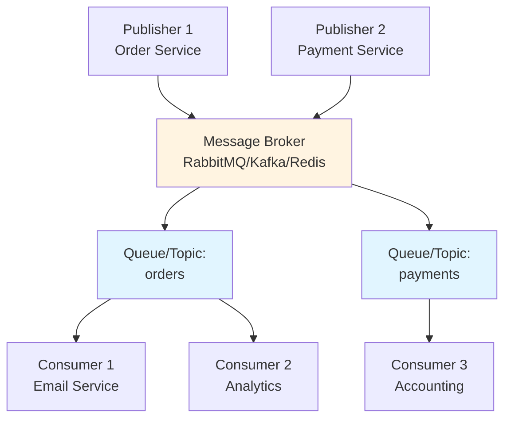
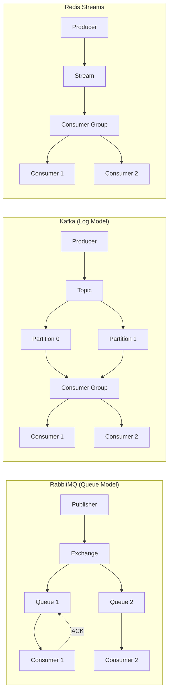
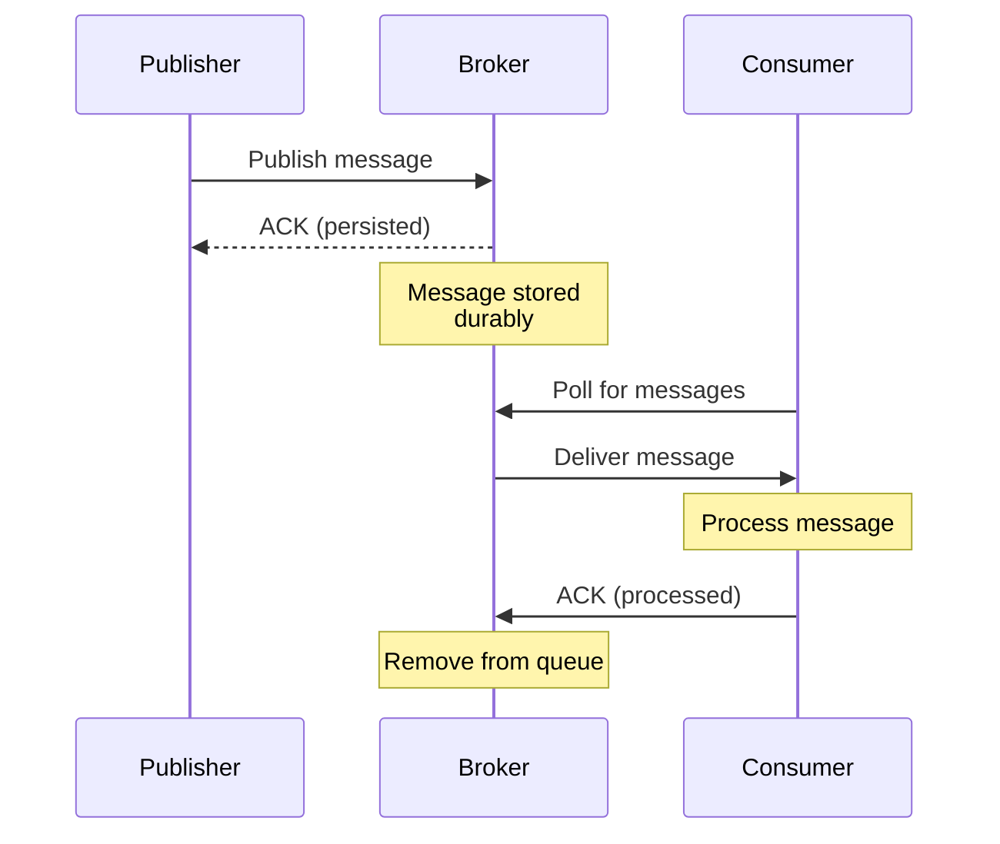
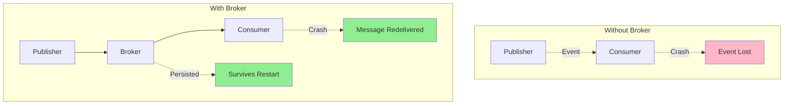

# Message Brokers (Kafka / RabbitMQ / Redis Streams)

## 1. Why this exists (Real-world problem first)

Your event-driven system uses in-memory EventEmitter for pub/sub. Works great in development. Deploy to production with 3 servers. Events published on Server 1 don't reach subscribers on Server 2 and 3. Orders created on one server never trigger emails sent by another server. The problem? In-memory pub/sub doesn't work across processes. You need a distributed message broker.

**Real production failures from missing message brokers:**

1. **The Lost Events Disaster**: E-commerce platform uses in-memory EventEmitter for order events. Runs on 5 servers behind load balancer. Order created on Server 1 emits "order.created" event. Email service runs on Server 2. Never receives event. Customer never gets confirmation email. 30% of customers don't receive emails. Support overwhelmed with "where's my confirmation?" tickets. Team doesn't understand "events work in development!"

2. **The Process Crash Data Loss**: Payment service processes payments and emits events to notify other services. Uses in-memory queue. Process crashes mid-processing. 500 events in memory lost forever. Orders marked as "paid" but inventory never reserved, shipping never scheduled. Manual reconciliation required. 8 hours of engineering time. $50K in operational costs.

3. **The Scaling Bottleneck**: Analytics service consumes events to build dashboards. Initially processes 1000 events/sec. Traffic grows to 10,000 events/sec. Analytics can't keep up. Team tries to scale horizontally—add more analytics servers. But in-memory EventEmitter can't distribute events across multiple consumers. All events go to one server. Can't scale. Dashboard data 2 hours behind real-time.

4. **The Replay Impossibility**: Bug in inventory service causes incorrect stock calculations. Team fixes bug. But can't replay past events to recalculate correct stock levels. Events were processed and discarded. No event history. Manual stock audit required across 100,000 products. 2 weeks of work.

**What breaks without message brokers:**
- Can't distribute events across multiple processes/servers
- Can't persist events for durability
- Can't replay events for recovery
- Can't scale consumers independently
- Can't guarantee delivery
- Don't understand broker selection criteria

## 2. Mental model (build imagination)

Think of message brokers as **Post Office Systems**.

### The Post Office Analogy

**In-Memory EventEmitter (Office Memo Board)**:
- Memo board in one office
- Only people in that office see memos
- Memo removed after reading
- If office burns down, memos lost
- Can't send to other offices

**Message Broker (Post Office)**:
- Central post office serves multiple offices
- Anyone can send mail (publish)
- Anyone can receive mail (subscribe)
- Mail stored until delivered
- If recipient is away, mail waits
- Can send to multiple recipients
- Mail history kept (tracking)

**The Flow:**

**Publisher (Sender)**:
1. Writes letter (creates event)
2. Sends to post office (publishes to broker)
3. Gets receipt (acknowledgment)
4. Continues work (non-blocking)

**Message Broker (Post Office)**:
1. Receives letter (event)
2. Sorts by destination (routing)
3. Stores in mailbox (persistence)
4. Delivers when recipient ready (queuing)
5. Keeps tracking info (audit log)

**Subscriber (Recipient)**:
1. Checks mailbox (polls/consumes)
2. Receives letter (event)
3. Processes letter (business logic)
4. Confirms receipt (acknowledgment)

**Why this matters:**
- Broker decouples publishers from subscribers
- Events persist until consumed
- Multiple consumers can receive same event
- Can replay events from history
- Survives process crashes

## 3. How Node.js implements this internally

### RabbitMQ (AMQP Protocol)

```javascript
const amqp = require('amqplib');

// Publisher
class RabbitMQPublisher {
  async connect() {
    this.connection = await amqp.connect('amqp://localhost');
    this.channel = await this.connection.createChannel();
  }
  
  async publish(exchange, routingKey, message) {
    await this.channel.assertExchange(exchange, 'topic', { durable: true });
    
    this.channel.publish(
      exchange,
      routingKey,
      Buffer.from(JSON.stringify(message)),
      { persistent: true } // Survives broker restart
    );
  }
}

// Consumer
class RabbitMQConsumer {
  async connect() {
    this.connection = await amqp.connect('amqp://localhost');
    this.channel = await this.connection.createChannel();
  }
  
  async consume(queue, exchange, routingKeys, handler) {
    await this.channel.assertExchange(exchange, 'topic', { durable: true });
    await this.channel.assertQueue(queue, { durable: true });
    
    for (const key of routingKeys) {
      await this.channel.bindQueue(queue, exchange, key);
    }
    
    this.channel.consume(queue, async (msg) => {
      try {
        const data = JSON.parse(msg.content.toString());
        await handler(msg.fields.routingKey, data);
        this.channel.ack(msg); // Acknowledge success
      } catch (err) {
        console.error('Processing error:', err);
        this.channel.nack(msg, false, true); // Requeue on failure
      }
    }, { noAck: false }); // Manual acknowledgment
  }
}
```

### Kafka (Distributed Log)

```javascript
const { Kafka } = require('kafkajs');

// Producer
class KafkaProducer {
  async connect() {
    this.kafka = new Kafka({
      clientId: 'my-app',
      brokers: ['localhost:9092']
    });
    
    this.producer = this.kafka.producer();
    await this.producer.connect();
  }
  
  async publish(topic, message) {
    await this.producer.send({
      topic,
      messages: [
        {
          key: message.id,
          value: JSON.stringify(message),
          timestamp: Date.now()
        }
      ]
    });
  }
}

// Consumer
class KafkaConsumer {
  async connect(groupId) {
    this.kafka = new Kafka({
      clientId: 'my-app',
      brokers: ['localhost:9092']
    });
    
    this.consumer = this.kafka.consumer({ groupId });
    await this.consumer.connect();
  }
  
  async consume(topics, handler) {
    await this.consumer.subscribe({ topics, fromBeginning: false });
    
    await this.consumer.run({
      eachMessage: async ({ topic, partition, message }) => {
        const data = JSON.parse(message.value.toString());
        await handler(topic, data);
      }
    });
  }
}
```

### Redis Streams (Lightweight)

```javascript
const Redis = require('ioredis');

// Producer
class RedisStreamProducer {
  constructor() {
    this.redis = new Redis();
  }
  
  async publish(stream, message) {
    await this.redis.xadd(
      stream,
      '*', // Auto-generate ID
      'data', JSON.stringify(message)
    );
  }
}

// Consumer
class RedisStreamConsumer {
  constructor(group, consumer) {
    this.redis = new Redis();
    this.group = group;
    this.consumer = consumer;
  }
  
  async consume(stream, handler) {
    // Create consumer group
    try {
      await this.redis.xgroup('CREATE', stream, this.group, '0', 'MKSTREAM');
    } catch (err) {
      // Group already exists
    }
    
    while (true) {
      const messages = await this.redis.xreadgroup(
        'GROUP', this.group, this.consumer,
        'COUNT', 10,
        'BLOCK', 5000,
        'STREAMS', stream, '>'
      );
      
      if (messages) {
        for (const [stream, entries] of messages) {
          for (const [id, fields] of entries) {
            const data = JSON.parse(fields[1]);
            await handler(data);
            await this.redis.xack(stream, this.group, id);
          }
        }
      }
    }
  }
}
```

### Common Misunderstandings

**Mistake 1**: "All message brokers are the same"
- **Reality**: RabbitMQ (queues), Kafka (logs), Redis (streams) have different models
- **Impact**: Wrong broker choice for use case

**Mistake 2**: "Brokers guarantee no message loss"
- **Reality**: Need proper configuration (persistence, replication, acknowledgments)
- **Impact**: Data loss in production

**Mistake 3**: "Brokers are just databases"
- **Reality**: Optimized for streaming, not storage
- **Impact**: Using broker as long-term storage

## 4. Multiple diagrams (MANDATORY)

### Diagram 1: Message Broker Architecture



### Diagram 2: RabbitMQ vs Kafka vs Redis



### Diagram 3: Message Flow with Acknowledgment



### Diagram 4: Failure Scenarios



## 5. Where this is used in real projects

### Order Processing with RabbitMQ

```javascript
const amqp = require('amqplib');

// Order Service (Publisher)
class OrderService {
  async createOrder(orderData) {
    const order = await db.orders.create(orderData);
    
    // Publish to RabbitMQ
    const connection = await amqp.connect('amqp://localhost');
    const channel = await connection.createChannel();
    
    await channel.assertExchange('orders', 'topic', { durable: true });
    
    channel.publish(
      'orders',
      'order.created',
      Buffer.from(JSON.stringify(order)),
      { persistent: true }
    );
    
    await channel.close();
    await connection.close();
    
    return order;
  }
}

// Email Service (Consumer)
class EmailService {
  async start() {
    const connection = await amqp.connect('amqp://localhost');
    const channel = await connection.createChannel();
    
    await channel.assertExchange('orders', 'topic', { durable: true });
    await channel.assertQueue('email-queue', { durable: true });
    await channel.bindQueue('email-queue', 'orders', 'order.created');
    
    channel.consume('email-queue', async (msg) => {
      const order = JSON.parse(msg.content.toString());
      
      try {
        await this.sendOrderConfirmation(order);
        channel.ack(msg);
      } catch (err) {
        console.error('Email failed:', err);
        channel.nack(msg, false, true); // Requeue
      }
    }, { noAck: false });
  }
  
  async sendOrderConfirmation(order) {
    // Send email
  }
}
```

### Event Streaming with Kafka

```javascript
const { Kafka } = require('kafkajs');

// Analytics Service (Producer)
class AnalyticsProducer {
  async trackEvent(eventType, data) {
    const kafka = new Kafka({
      clientId: 'analytics',
      brokers: ['localhost:9092']
    });
    
    const producer = kafka.producer();
    await producer.connect();
    
    await producer.send({
      topic: 'user-events',
      messages: [
        {
          key: data.userId,
          value: JSON.stringify({ eventType, data, timestamp: Date.now() })
        }
      ]
    });
    
    await producer.disconnect();
  }
}

// Data Warehouse Consumer (Consumer Group)
class DataWarehouseConsumer {
  async start() {
    const kafka = new Kafka({
      clientId: 'data-warehouse',
      brokers: ['localhost:9092']
    });
    
    const consumer = kafka.consumer({ groupId: 'data-warehouse-group' });
    await consumer.connect();
    await consumer.subscribe({ topic: 'user-events', fromBeginning: false });
    
    await consumer.run({
      eachMessage: async ({ topic, partition, message }) => {
        const event = JSON.parse(message.value.toString());
        await this.storeInWarehouse(event);
      }
    });
  }
  
  async storeInWarehouse(event) {
    // Store in data warehouse
  }
}
```

### Real-Time Updates with Redis Streams

```javascript
const Redis = require('ioredis');

// Notification Service (Producer)
class NotificationProducer {
  constructor() {
    this.redis = new Redis();
  }
  
  async sendNotification(userId, message) {
    await this.redis.xadd(
      `notifications:${userId}`,
      '*',
      'type', message.type,
      'data', JSON.stringify(message.data)
    );
  }
}

// WebSocket Service (Consumer)
class WebSocketConsumer {
  constructor(userId) {
    this.redis = new Redis();
    this.userId = userId;
  }
  
  async consume() {
    let lastId = '0';
    
    while (true) {
      const messages = await this.redis.xread(
        'BLOCK', 5000,
        'STREAMS', `notifications:${this.userId}`, lastId
      );
      
      if (messages) {
        for (const [stream, entries] of messages) {
          for (const [id, fields] of entries) {
            const notification = {
              type: fields[1],
              data: JSON.parse(fields[3])
            };
            
            // Send via WebSocket
            this.sendToClient(notification);
            
            lastId = id;
          }
        }
      }
    }
  }
}
```

## 6. Where this should NOT be used

### Simple Request/Response

```javascript
// WRONG: Message broker for immediate response
app.get('/user/:id', async (req, res) => {
  await broker.publish('user.fetch', { id: req.params.id });
  // How does client get the user? Can't wait for async response!
  res.json({ status: 'processing' });
});

// RIGHT: Direct database query
app.get('/user/:id', async (req, res) => {
  const user = await db.users.findById(req.params.id);
  res.json(user);
});
```

### Low-Volume Events

```javascript
// WRONG: Kafka for 10 events/day
await kafka.send({ topic: 'admin-login', messages: [event] });
// Overhead of running Kafka cluster not worth it

// RIGHT: Simple logging or database
await db.auditLog.create(event);
```

### Guaranteed Ordering Across Topics

```javascript
// WRONG: Expecting order across different topics
await broker.publish('topic1', event1);
await broker.publish('topic2', event2);
// event2 might be processed before event1

// RIGHT: Single topic with ordering key
await broker.publish('events', event1, { key: 'user123' });
await broker.publish('events', event2, { key: 'user123' });
```

## 7. Failure modes & edge cases

### Failure Mode 1: Broker Unavailable

**Scenario**: Broker crashes, publishers can't send

```javascript
// WRONG: No error handling
await broker.publish('orders', order);
// Throws error, request fails

// RIGHT: Fallback strategy
try {
  await broker.publish('orders', order);
} catch (err) {
  // Fallback: Store in database for later retry
  await db.pendingEvents.create({ topic: 'orders', data: order });
  // Background job retries later
}
```

### Failure Mode 2: Consumer Lag

**Scenario**: Consumer can't keep up with producer

```
Producer: 10,000 events/sec
Consumer: 1,000 events/sec
Result: Queue grows by 9,000 events/sec
After 1 hour: 32M events in queue
```

**Solution**: Scale consumers, optimize processing, backpressure

### Failure Mode 3: Poison Messages

**Scenario**: Message causes consumer to crash repeatedly

```javascript
// WRONG: Infinite retry loop
channel.consume('queue', async (msg) => {
  await processMessage(msg); // Always throws
  channel.nack(msg, false, true); // Requeue forever!
});

// RIGHT: Dead letter queue after retries
channel.consume('queue', async (msg) => {
  try {
    await processMessage(msg);
    channel.ack(msg);
  } catch (err) {
    const retries = msg.properties.headers['x-retry-count'] || 0;
    
    if (retries < 3) {
      channel.nack(msg, false, true); // Requeue
    } else {
      // Send to dead letter queue
      channel.publish('dlq', '', msg.content);
      channel.ack(msg);
    }
  }
});
```

## 8. Trade-offs & alternatives

### RabbitMQ

**Gain**: Rich routing, easy setup, good for task queues
**Sacrifice**: Lower throughput than Kafka, complex clustering
**When**: Task queues, RPC, moderate volume (<100k msg/sec)

### Kafka

**Gain**: High throughput, event replay, distributed log
**Sacrifice**: Complex setup, higher latency, resource intensive
**When**: Event streaming, analytics, high volume (>100k msg/sec)

### Redis Streams

**Gain**: Simple, fast, built into Redis
**Sacrifice**: Limited persistence, not for critical data
**When**: Real-time updates, caching layer, moderate volume

### Direct Database

**Gain**: Simple, transactional, no extra infrastructure
**Sacrifice**: Not designed for messaging, poor performance
**When**: Low volume, simple use cases

## 9. Interview-level articulation

**Q: "When would you use a message broker?"**

**A**: "I use message brokers when I need distributed, durable pub/sub across multiple processes or servers. For example, in an order processing system, when an order is created, I publish 'order.created' to RabbitMQ. Email service, inventory service, and analytics all consume from their own queues. This decouples services—if email service is down, the message waits in its queue. The broker persists messages, so if a consumer crashes, it can resume processing after restart. I choose RabbitMQ for task queues and moderate volume, Kafka for high-throughput event streaming, and Redis Streams for real-time updates where some data loss is acceptable."

**Q: "What's the difference between RabbitMQ and Kafka?"**

**A**: "RabbitMQ is a message queue—messages are removed after consumption. It's great for task distribution where each task should be processed once. Kafka is a distributed log—messages are retained for a configurable time and can be replayed. Multiple consumer groups can read the same messages. Kafka is better for event streaming and analytics where you want to replay events or have multiple independent consumers. RabbitMQ is simpler to set up and better for RPC patterns. Kafka has higher throughput but higher latency and complexity. I choose based on whether I need message replay and how much volume I'm handling."

## 10. Key takeaways (engineer mindset)

### What to Remember

1. **Message brokers** enable distributed pub/sub
2. **RabbitMQ**: Task queues, moderate volume, rich routing
3. **Kafka**: Event streaming, high volume, replay capability
4. **Redis Streams**: Real-time, simple, lightweight
5. **Persistence** requires proper configuration
6. **Acknowledgments** prevent message loss
7. **Dead letter queues** handle poison messages

### What Decisions This Enables

**Architecture decisions**:
- When to use broker vs in-memory pub/sub
- Which broker to choose (RabbitMQ vs Kafka vs Redis)
- How to handle failures and retries

**Scalability decisions**:
- Independent consumer scaling
- Load leveling with queues
- Handling traffic spikes

**Reliability decisions**:
- Message durability and persistence
- Delivery guarantees (at-least-once, exactly-once)
- Disaster recovery with event replay

### How It Connects to Other Node.js Concepts

**Pub/Sub Patterns** (Topic 20):
- Brokers implement distributed pub/sub
- Enable cross-process communication

**At-Least-Once vs Exactly-Once** (Topic 22):
- Brokers provide delivery guarantees
- Require idempotent consumers

**Event Replay** (Topic 26):
- Kafka enables event replay
- Critical for recovery and debugging

### The Golden Rule

**Use message brokers for distributed, durable pub/sub**. Choose RabbitMQ for task queues and moderate volume. Choose Kafka for event streaming and high volume. Choose Redis Streams for real-time updates. Always configure persistence, use acknowledgments, and implement dead letter queues for poison messages.
