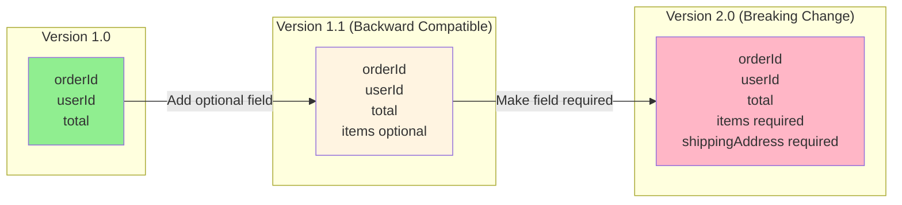
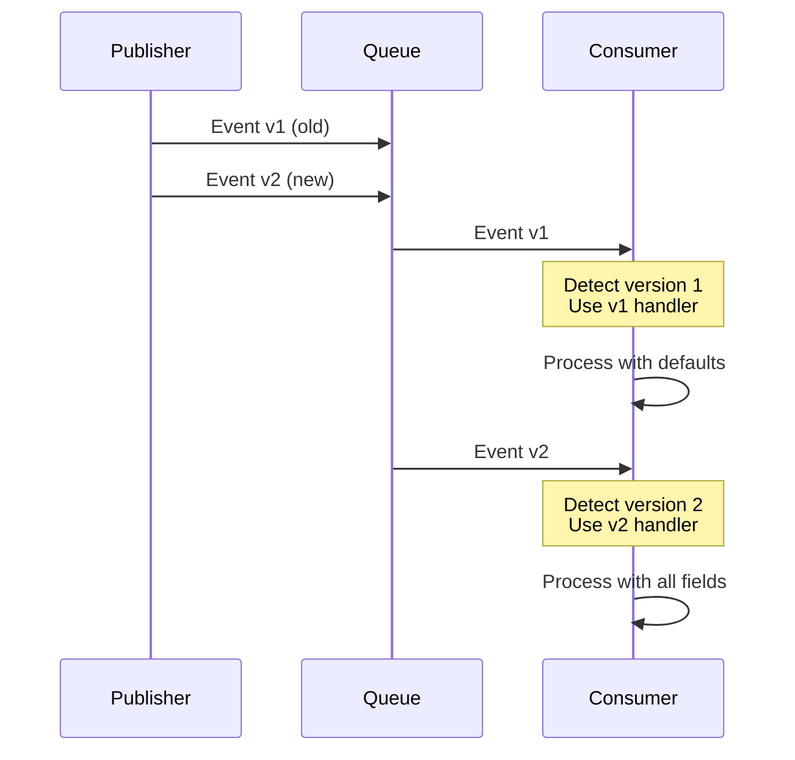
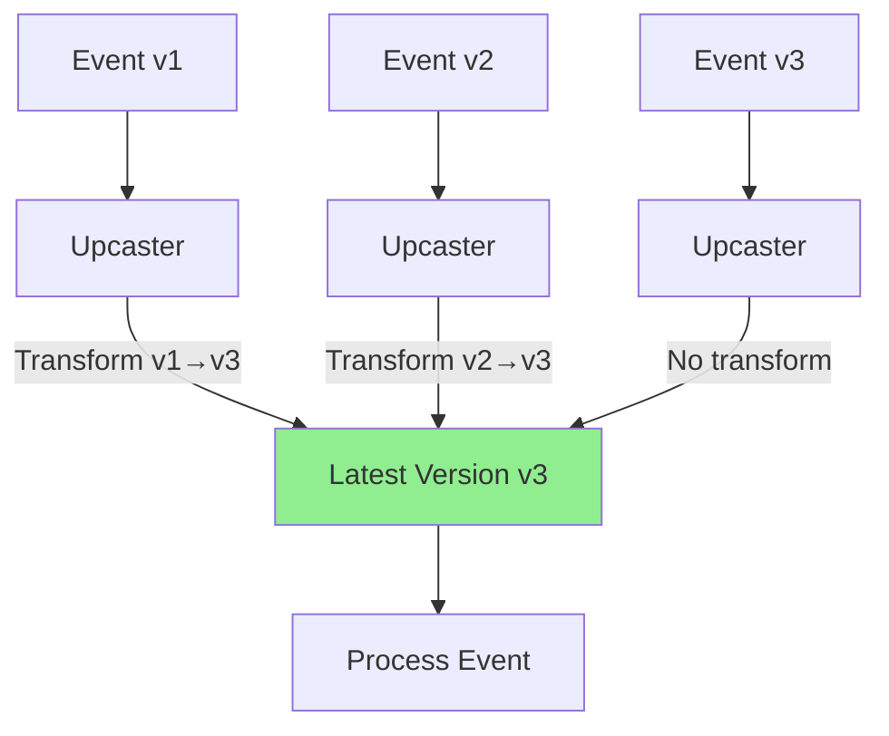
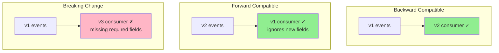

# Event Versioning

## 1. Why this exists (Real-world problem first)

Your order service publishes "order.created" events. Initially, event has 3 fields: `{id, userId, total}`. Six months later, you add `items` array. Old consumers expect 3 fields, crash when they see 4. New consumers expect 4 fields, crash when replaying old events with 3. The problem? No event versioning strategy causes breaking changes and consumer failures.

**Real production failures from missing event versioning:**

1. **The Breaking Change Disaster**: E-commerce platform publishes "order.created" events consumed by 5 services: email, analytics, inventory, shipping, accounting. Team adds `shippingAddress` field to event. Deploys new publisher. Old consumers (email, analytics) don't expect new field, ignore it (fine). But inventory service has strict schema validation, crashes on unknown field. All inventory updates stop. Orders created but inventory never decremented. Oversell by 500 units. Manual reconciliation required. $50K in operational costs.

2. **The Replay Catastrophe**: Payment service stores events in Kafka for audit. Event schema: `{orderId, amount, currency}`. Team adds `paymentMethod` field. Six months later, bug in payment processing. Need to replay events from 3 months ago to recalculate. Old events don't have `paymentMethod`. New consumer code expects it, crashes on `undefined`. Can't replay old events. Can't fix bug. Manual data correction required for 100,000 transactions.

3. **The Field Rename Nightmare**: User service publishes "user.updated" with field `email`. Team renames to `emailAddress` for consistency. Deploys new publisher. Old consumers still look for `email`, find `undefined`. Email notifications stop working. Users don't receive password reset emails. Support overwhelmed. Takes 4 hours to identify root cause. Rollback required.

4. **The Type Change Failure**: Order event has `total` as number (cents): `total: 29999` (=$299.99). Team changes to object for multi-currency: `total: {amount: 29999, currency: 'USD'}`. Old consumers expect number, crash on object. All order processing stops. Emergency rollback. Feature delayed 2 months while team implements proper versioning.

**What breaks without event versioning:**
- Breaking changes crash consumers
- Can't replay old events
- Can't evolve schema safely
- Don't understand forward/backward compatibility
- Fail to coordinate deployments
- Can't support multiple versions simultaneously

## 2. Mental model (build imagination)

Think of event versioning as **Document Formats** (Word, PDF versions).

### The Document Format Analogy

**Without Versioning (Breaking Changes)**:
- Word 2010 creates .docx file
- Word 2020 adds new features, changes format
- Word 2010 can't open Word 2020 files
- Breaking change, users stuck

**With Versioning (Compatibility)**:
- Word 2010 creates .docx (version 1)
- Word 2020 creates .docx (version 2)
- Word 2020 can read version 1 (backward compatible)
- Word 2010 ignores version 2 features (forward compatible)
- Both versions coexist

**The Flow:**

**Without Versioning:**
1. Publisher adds new field
2. Old consumer crashes (doesn't expect it)
3. Breaking change
4. Coordinated deployment required

**With Versioning:**
1. Publisher emits event with version: `{version: 2, ...}`
2. Old consumer sees version 2, uses compatibility layer
3. New consumer sees version 2, uses new fields
4. Both work simultaneously

**Why this matters:**
- Enables independent service deployment
- Allows schema evolution
- Supports event replay
- Prevents breaking changes
- Enables gradual migration

## 3. How Node.js implements this internally

### Version in Event Payload

```javascript
// Publisher: Always include version
class OrderPublisher {
  async publishOrderCreated(order) {
    const event = {
      version: 2, // Explicit version
      eventType: 'order.created',
      timestamp: new Date().toISOString(),
      data: {
        orderId: order.id,
        userId: order.userId,
        total: order.total,
        items: order.items, // New field in v2
        shippingAddress: order.shippingAddress // New field in v2
      }
    };
    
    await messageQueue.publish('orders', event);
  }
}

// Consumer: Handle multiple versions
class OrderConsumer {
  async handleOrderCreated(event) {
    const version = event.version || 1; // Default to v1 if missing
    
    switch (version) {
      case 1:
        return this.handleV1(event);
      case 2:
        return this.handleV2(event);
      default:
        console.warn(`Unknown version ${version}, using latest`);
        return this.handleV2(event);
    }
  }
  
  async handleV1(event) {
    // V1: {orderId, userId, total}
    const { orderId, userId, total } = event.data;
    
    await this.processOrder({
      orderId,
      userId,
      total,
      items: [], // Default for missing field
      shippingAddress: null // Default for missing field
    });
  }
  
  async handleV2(event) {
    // V2: {orderId, userId, total, items, shippingAddress}
    const { orderId, userId, total, items, shippingAddress } = event.data;
    
    await this.processOrder({
      orderId,
      userId,
      total,
      items,
      shippingAddress
    });
  }
}
```

### Semantic Versioning for Events

```javascript
// Event schema with semantic versioning
class EventSchema {
  constructor() {
    this.schemas = {
      'order.created': {
        '1.0.0': {
          required: ['orderId', 'userId', 'total'],
          optional: []
        },
        '1.1.0': {
          required: ['orderId', 'userId', 'total'],
          optional: ['items'] // Backward compatible: optional field
        },
        '2.0.0': {
          required: ['orderId', 'userId', 'total', 'items', 'shippingAddress'],
          optional: [] // Breaking change: new required fields
        }
      }
    };
  }
  
  validate(eventType, version, data) {
    const schema = this.schemas[eventType][version];
    
    if (!schema) {
      throw new Error(`Unknown schema: ${eventType} v${version}`);
    }
    
    // Check required fields
    for (const field of schema.required) {
      if (!(field in data)) {
        throw new Error(`Missing required field: ${field}`);
      }
    }
    
    return true;
  }
  
  isCompatible(eventType, fromVersion, toVersion) {
    // Check if toVersion can read fromVersion
    const from = this.schemas[eventType][fromVersion];
    const to = this.schemas[eventType][toVersion];
    
    // Backward compatible if all required fields in 'from' exist in 'to'
    return from.required.every(field => 
      to.required.includes(field) || to.optional.includes(field)
    );
  }
}
```

### Upcasting Pattern (Transform Old to New)

```javascript
class EventUpcaster {
  constructor() {
    this.upcasters = {
      'order.created': {
        '1': (event) => this.upcastOrderV1ToV2(event),
        '2': (event) => event // Already latest
      }
    };
  }
  
  upcast(event) {
    const version = event.version || 1;
    const eventType = event.eventType;
    
    const upcaster = this.upcasters[eventType][version];
    
    if (!upcaster) {
      throw new Error(`No upcaster for ${eventType} v${version}`);
    }
    
    return upcaster(event);
  }
  
  upcastOrderV1ToV2(event) {
    // Transform V1 to V2 format
    return {
      version: 2,
      eventType: event.eventType,
      timestamp: event.timestamp,
      data: {
        orderId: event.data.orderId,
        userId: event.data.userId,
        total: event.data.total,
        items: [], // Default value for new field
        shippingAddress: null // Default value for new field
      }
    };
  }
}

// Consumer with upcasting
class SmartConsumer {
  constructor() {
    this.upcaster = new EventUpcaster();
  }
  
  async handleEvent(event) {
    // Always upcast to latest version
    const latestEvent = this.upcaster.upcast(event);
    
    // Process using latest schema
    await this.processV2(latestEvent);
  }
  
  async processV2(event) {
    // Only need to handle latest version
    const { orderId, userId, total, items, shippingAddress } = event.data;
    // Process...
  }
}
```

### Common Misunderstandings

**Mistake 1**: "Version in event type name"
- **Reality**: Version in payload is more flexible
- **Impact**: Can't evolve without changing topic names

**Mistake 2**: "Always use latest version"
- **Reality**: Need to support old versions for replay
- **Impact**: Can't replay historical events

**Mistake 3**: "Breaking changes are fine with versioning"
- **Reality**: Still need migration strategy
- **Impact**: Coordinated deployment still required

## 4. Multiple diagrams (MANDATORY)

### Diagram 1: Event Version Evolution



### Diagram 2: Multi-Version Consumer



### Diagram 3: Upcasting Pattern



### Diagram 4: Compatibility Matrix



## 5. Where this is used in real projects

### Order Events with Versioning

```javascript
// Event publisher with versioning
class OrderEventPublisher {
  async publishOrderCreated(order) {
    const event = {
      version: '2.0.0',
      eventType: 'order.created',
      eventId: crypto.randomUUID(),
      timestamp: new Date().toISOString(),
      data: {
        orderId: order.id,
        userId: order.userId,
        total: order.total,
        currency: order.currency || 'USD', // v1.1.0
        items: order.items, // v2.0.0
        shippingAddress: order.shippingAddress, // v2.0.0
        metadata: order.metadata || {} // v2.0.0
      }
    };
    
    await kafka.send({
      topic: 'orders',
      messages: [{
        key: order.id,
        value: JSON.stringify(event),
        headers: {
          'event-version': '2.0.0',
          'event-type': 'order.created'
        }
      }]
    });
  }
}

// Consumer with version handling
class EmailServiceConsumer {
  async handleOrderCreated(event) {
    const version = event.version || '1.0.0';
    
    // Upcast to latest version
    const normalized = this.normalizeEvent(event, version);
    
    // Process using latest schema
    await this.sendOrderConfirmation(normalized);
  }
  
  normalizeEvent(event, version) {
    const [major] = version.split('.');
    
    switch (major) {
      case '1':
        return {
          orderId: event.data.orderId,
          userId: event.data.userId,
          total: event.data.total,
          currency: event.data.currency || 'USD',
          items: [], // Default
          shippingAddress: null, // Default
          metadata: {}
        };
      
      case '2':
        return {
          orderId: event.data.orderId,
          userId: event.data.userId,
          total: event.data.total,
          currency: event.data.currency,
          items: event.data.items,
          shippingAddress: event.data.shippingAddress,
          metadata: event.data.metadata
        };
      
      default:
        throw new Error(`Unsupported version: ${version}`);
    }
  }
}
```

### Schema Registry Pattern

```javascript
const Ajv = require('ajv');
const ajv = new Ajv();

class EventSchemaRegistry {
  constructor() {
    this.schemas = new Map();
    this.registerSchemas();
  }
  
  registerSchemas() {
    // Order Created v1.0.0
    this.schemas.set('order.created:1.0.0', {
      type: 'object',
      required: ['orderId', 'userId', 'total'],
      properties: {
        orderId: { type: 'string' },
        userId: { type: 'string' },
        total: { type: 'number' }
      }
    });
    
    // Order Created v2.0.0
    this.schemas.set('order.created:2.0.0', {
      type: 'object',
      required: ['orderId', 'userId', 'total', 'items', 'shippingAddress'],
      properties: {
        orderId: { type: 'string' },
        userId: { type: 'string' },
        total: { type: 'number' },
        currency: { type: 'string' },
        items: {
          type: 'array',
          items: {
            type: 'object',
            required: ['productId', 'quantity', 'price'],
            properties: {
              productId: { type: 'string' },
              quantity: { type: 'number' },
              price: { type: 'number' }
            }
          }
        },
        shippingAddress: {
          type: 'object',
          required: ['street', 'city', 'country'],
          properties: {
            street: { type: 'string' },
            city: { type: 'string' },
            country: { type: 'string' },
            postalCode: { type: 'string' }
          }
        }
      }
    });
  }
  
  validate(eventType, version, data) {
    const schemaKey = `${eventType}:${version}`;
    const schema = this.schemas.get(schemaKey);
    
    if (!schema) {
      throw new Error(`Schema not found: ${schemaKey}`);
    }
    
    const validate = ajv.compile(schema);
    const valid = validate(data);
    
    if (!valid) {
      throw new Error(`Validation failed: ${JSON.stringify(validate.errors)}`);
    }
    
    return true;
  }
  
  getLatestVersion(eventType) {
    const versions = Array.from(this.schemas.keys())
      .filter(key => key.startsWith(eventType))
      .map(key => key.split(':')[1])
      .sort((a, b) => this.compareVersions(b, a)); // Descending
    
    return versions[0];
  }
  
  compareVersions(v1, v2) {
    const parts1 = v1.split('.').map(Number);
    const parts2 = v2.split('.').map(Number);
    
    for (let i = 0; i < 3; i++) {
      if (parts1[i] > parts2[i]) return 1;
      if (parts1[i] < parts2[i]) return -1;
    }
    
    return 0;
  }
}

// Usage
const registry = new EventSchemaRegistry();

// Publisher validates before publishing
const event = {
  version: '2.0.0',
  eventType: 'order.created',
  data: { /* ... */ }
};

registry.validate(event.eventType, event.version, event.data);
await publisher.publish(event);
```

### Gradual Migration Strategy

```javascript
class GradualMigrationPublisher {
  constructor() {
    this.newVersionPercentage = 0; // Start at 0%
  }
  
  async publishOrderCreated(order) {
    // Gradually roll out new version
    const useNewVersion = Math.random() * 100 < this.newVersionPercentage;
    
    if (useNewVersion) {
      await this.publishV2(order);
    } else {
      await this.publishV1(order);
    }
  }
  
  async publishV1(order) {
    const event = {
      version: '1.0.0',
      eventType: 'order.created',
      data: {
        orderId: order.id,
        userId: order.userId,
        total: order.total
      }
    };
    
    await kafka.send({ topic: 'orders', messages: [{ value: JSON.stringify(event) }] });
  }
  
  async publishV2(order) {
    const event = {
      version: '2.0.0',
      eventType: 'order.created',
      data: {
        orderId: order.id,
        userId: order.userId,
        total: order.total,
        items: order.items,
        shippingAddress: order.shippingAddress
      }
    };
    
    await kafka.send({ topic: 'orders', messages: [{ value: JSON.stringify(event) }] });
  }
  
  // Gradually increase new version percentage
  increaseNewVersionPercentage(percentage) {
    this.newVersionPercentage = Math.min(100, percentage);
    console.log(`New version percentage: ${this.newVersionPercentage}%`);
  }
}

// Migration plan:
// Day 1: Deploy consumers that handle both v1 and v2
// Day 2: Start publishing 10% v2 events
// Day 3: Increase to 50% v2 events
// Day 4: Increase to 100% v2 events
// Day 5: Remove v1 handling code from consumers
```

## 6. Where this should NOT be used

### Over-Versioning Simple Events

```javascript
// WRONG: Version for every tiny change
const event = {
  version: '1.2.3.4.5', // Too granular
  data: { userId: '123' }
};

// RIGHT: Version only for significant changes
const event = {
  version: '2', // Simple major version
  data: { userId: '123' }
};
```

### Versioning Internal Events

```javascript
// WRONG: Version for internal-only events
// Event only consumed by same service
const event = {
  version: '1.0.0',
  eventType: 'cache.invalidated',
  data: { key: 'user:123' }
};

// RIGHT: No versioning for internal events
const event = {
  eventType: 'cache.invalidated',
  data: { key: 'user:123' }
};
```

## 7. Failure modes & edge cases

### Failure Mode 1: Missing Version Field

**Scenario**: Old events don't have version field

```javascript
// DISASTER: Assume version 1 if missing
const version = event.version; // undefined for old events
if (version === 2) {
  // Never executes for old events!
}

// SOLUTION: Default to version 1
const version = event.version || 1;
```

### Failure Mode 2: Incompatible Schema Change

**Scenario**: Field type changes (breaking)

```javascript
// V1: total is number (cents)
{ total: 29999 }

// V2: total is object (breaking change!)
{ total: { amount: 29999, currency: 'USD' } }

// Consumer expects number, gets object → crash

// SOLUTION: Use upcaster
function upcastV1ToV2(event) {
  if (typeof event.data.total === 'number') {
    event.data.total = {
      amount: event.data.total,
      currency: 'USD'
    };
  }
  return event;
}
```

### Failure Mode 3: Version Skew

**Scenario**: Consumer deployed before publisher

```
Publisher: Emits v3 events
Consumer: Only knows v1 and v2
Result: Consumer crashes on v3 events
```

**Solution**: Deploy consumers first, publishers second

## 8. Trade-offs & alternatives

### Explicit Versioning

**Gain**: Clear compatibility, easy to reason about
**Sacrifice**: More code, version management overhead
**When**: Public APIs, multiple consumers, long-term storage

### Implicit Compatibility (Optional Fields)

**Gain**: Simpler, no version management
**Sacrifice**: Harder to track changes, no guarantees
**When**: Internal events, single consumer, short-term

### Separate Topics Per Version

**Gain**: Complete isolation, no compatibility issues
**Sacrifice**: Topic proliferation, harder to manage
**When**: Completely incompatible versions

## 9. Interview-level articulation

**Q: "How do you handle event schema evolution?"**

**A**: "I use explicit versioning in the event payload. Each event includes a version field like `version: 2`. Consumers check the version and handle multiple versions using either a switch statement or an upcasting pattern. For backward-compatible changes like adding optional fields, I increment the minor version. For breaking changes like making a field required or changing its type, I increment the major version. I deploy consumers that handle both old and new versions before deploying publishers that emit new versions. This allows gradual migration without downtime. For event replay, consumers can process old events by upcasting them to the latest version using transformation functions."

**Q: "What's the difference between backward and forward compatibility?"**

**A**: "Backward compatibility means new consumers can read old events. For example, if I add an optional field in v2, a v2 consumer can still process v1 events by using a default value for the missing field. Forward compatibility means old consumers can read new events. For example, if a v1 consumer receives a v2 event with extra fields, it ignores the unknown fields and processes what it knows. I achieve backward compatibility by making new fields optional and providing defaults. I achieve forward compatibility by having consumers ignore unknown fields. Breaking changes like removing fields or changing types break both backward and forward compatibility and require coordinated deployment."

## 10. Key takeaways (engineer mindset)

### What to Remember

1. **Version in payload**: Include version field in every event
2. **Semantic versioning**: Major.Minor.Patch for clarity
3. **Backward compatible**: New consumers read old events
4. **Forward compatible**: Old consumers ignore new fields
5. **Upcasting**: Transform old events to latest version
6. **Deploy consumers first**: Then deploy publishers
7. **Schema registry**: Centralize schema definitions

### What Decisions This Enables

**Schema evolution decisions**:
- When to increment major vs minor version
- How to handle breaking changes
- Migration strategy for new versions

**Deployment decisions**:
- Consumer-first deployment order
- Gradual rollout of new versions
- Rollback strategies

**Architecture decisions**:
- Event replay capability
- Multi-version support duration
- Schema validation approach

### How It Connects to Other Node.js Concepts

**Schema Evolution** (Topic 25):
- Versioning enables schema evolution
- Defines compatibility rules

**Event Replay** (Topic 26):
- Versioning enables replaying old events
- Upcasting transforms historical data

**Message Brokers** (Topic 21):
- Events stored in brokers need versioning
- Long-term storage requires compatibility

### The Golden Rule

**Always version your events**. Include version in payload. Use semantic versioning. Make new fields optional for backward compatibility. Deploy consumers before publishers. Use upcasting to transform old events to latest version. Maintain schema registry for validation. Plan migration strategy for breaking changes.
