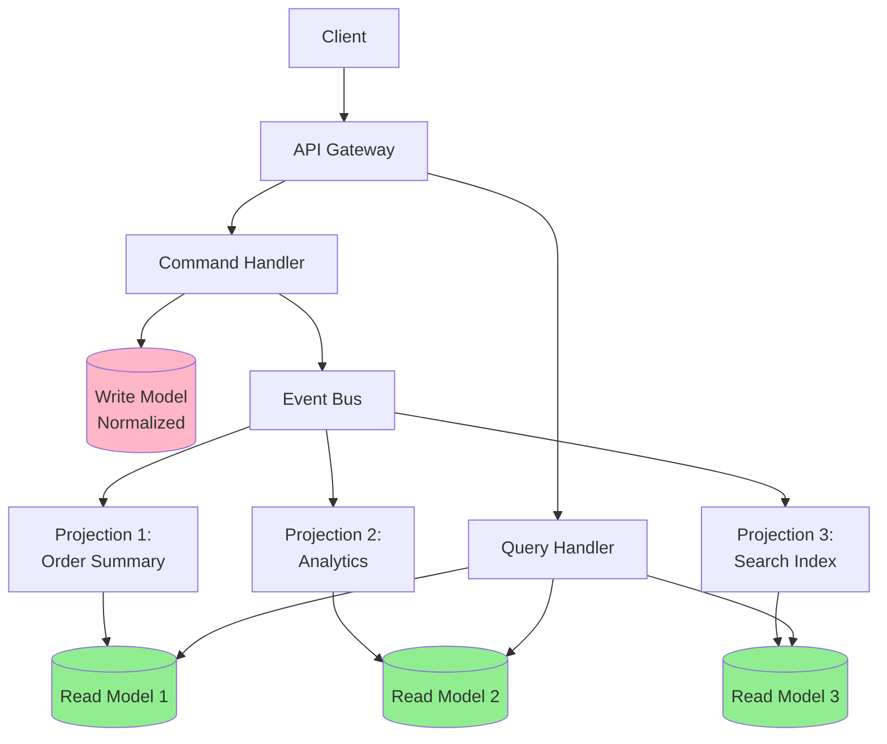
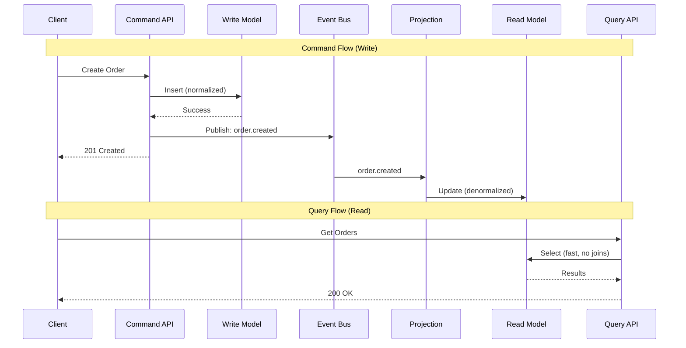
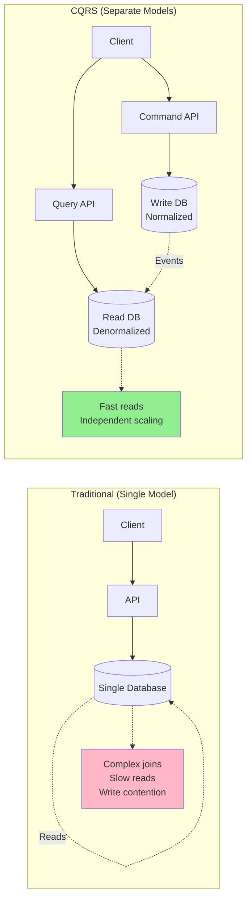
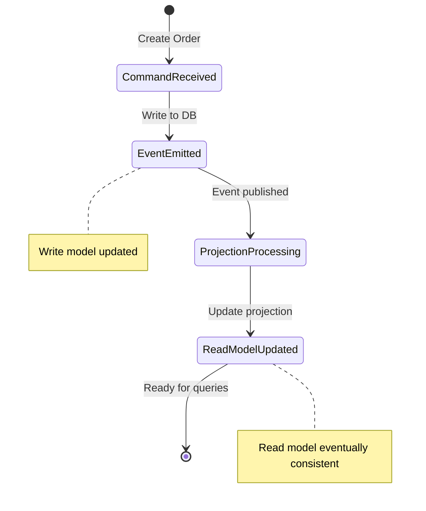

# CQRS

## 1. Why this exists (Real-world problem first)

Your e-commerce product listing page needs to show: product details, inventory count, average rating, review count, related products, price history. Single database query joins 6 tables, takes 2 seconds. Page load time unacceptable. The problem? Using the same data model for writes (create order) and reads (display products) creates performance bottlenecks and complexity.

**Real production failures from missing CQRS:**

1. **The Dashboard Timeout Disaster**: Analytics dashboard shows real-time sales metrics: total revenue, orders per hour, top products, customer segments. Queries join 8 tables, aggregate 10M records. Each dashboard load takes 30 seconds. Database CPU at 100%. Write operations (new orders) slow down. Order creation goes from 100ms to 5 seconds. Customers see timeouts. Sales drop 40% during peak hours.

2. **The Search Performance Nightmare**: E-commerce search queries product table with complex filters: category, price range, rating, availability, brand. Query scans 1M products, takes 3 seconds. Team adds indexes. Now have 20 indexes on product table. Write performance degrades—creating product takes 2 seconds (updating 20 indexes). Inventory updates slow. Stock levels inaccurate.

3. **The Report Generation Failure**: Monthly sales report aggregates orders, calculates revenue by region, product category, customer segment. Report query runs for 10 minutes, locks tables. During report generation, order creation fails. Production down for 10 minutes. $50K in lost sales. Team can't generate reports during business hours.

4. **The Denormalization Mess**: Team denormalizes data to improve read performance. Stores product details in order table. Product price changes. Now need to update product table AND all historical orders. Update takes 2 hours for 1M orders. During update, order queries return inconsistent data. Customer support overwhelmed with "wrong price" complaints.

**What breaks without CQRS:**
- Read queries slow down writes
- Complex joins kill performance
- Can't optimize for both reads and writes
- Don't understand eventual consistency trade-offs
- Fail to separate concerns
- Can't scale reads independently

## 2. Mental model (build imagination)

Think of CQRS as **Library Organization**.

### The Library Analogy

**Without CQRS (Single Model)**:
- Books stored in one system
- Borrowing a book requires searching entire catalog
- Returning a book updates catalog
- Popular searches slow down returns
- Can't optimize for both operations

**With CQRS (Separate Models)**:
- **Write Model (Librarian's System)**: Optimized for adding/removing books
- **Read Model (Public Catalog)**: Optimized for searching, browsing, recommendations
- Librarian updates main system (write)
- Public catalog updated asynchronously (read)
- Searches don't affect book returns
- Each optimized for its purpose

**The Flow:**

**Traditional (Single Model)**:
1. User creates order → Write to orders table
2. User views order history → Read from orders table (complex join)
3. Writes and reads compete for same resources

**CQRS (Separate Models)**:
1. User creates order → Write to command model (normalized)
2. Event emitted: "order.created"
3. Read model updated asynchronously (denormalized)
4. User views order history → Read from read model (fast, no joins)
5. Writes and reads independent

**Why this matters:**
- Optimize write model for consistency
- Optimize read model for performance
- Scale reads and writes independently
- Eventual consistency acceptable for reads
- Complexity isolated to read model updates

## 3. How Node.js implements this internally

### Basic CQRS Implementation

```javascript
// Command Model (Write Side)
class OrderCommandModel {
  async createOrder(orderData) {
    // Normalized write model
    const order = await db.transaction(async (trx) => {
      const [orderId] = await trx('orders').insert({
        userId: orderData.userId,
        status: 'pending',
        createdAt: new Date()
      });
      
      for (const item of orderData.items) {
        await trx('order_items').insert({
          orderId,
          productId: item.productId,
          quantity: item.quantity,
          price: item.price
        });
      }
      
      return orderId;
    });
    
    // Emit event for read model update
    await eventBus.publish('order.created', {
      orderId: order,
      userId: orderData.userId,
      items: orderData.items,
      total: orderData.total
    });
    
    return order;
  }
}

// Query Model (Read Side)
class OrderQueryModel {
  constructor() {
    // Subscribe to events
    eventBus.subscribe('order.created', this.handleOrderCreated.bind(this));
    eventBus.subscribe('order.updated', this.handleOrderUpdated.bind(this));
  }
  
  async handleOrderCreated(event) {
    // Denormalized read model
    await db.orderSummary.insert({
      orderId: event.orderId,
      userId: event.userId,
      itemCount: event.items.length,
      total: event.total,
      status: 'pending',
      createdAt: new Date()
    });
  }
  
  async handleOrderUpdated(event) {
    await db.orderSummary.update(
      { orderId: event.orderId },
      { status: event.status, updatedAt: new Date() }
    );
  }
  
  // Fast reads from denormalized model
  async getUserOrders(userId) {
    return await db.orderSummary.find({
      userId,
      _sort: { createdAt: -1 }
    });
  }
  
  async getOrderDetails(orderId) {
    return await db.orderSummary.findOne({ orderId });
  }
}
```

### CQRS with Event Sourcing

```javascript
// Command Side: Event Store
class OrderCommandHandler {
  async createOrder(command) {
    const events = [];
    
    // Validate command
    this.validateOrder(command);
    
    // Generate events
    events.push({
      type: 'order.created',
      aggregateId: command.orderId,
      data: {
        userId: command.userId,
        items: command.items,
        total: command.total
      },
      timestamp: new Date()
    });
    
    // Append to event store
    await eventStore.append('orders', events);
    
    return { orderId: command.orderId };
  }
  
  validateOrder(command) {
    if (!command.items || command.items.length === 0) {
      throw new Error('Order must have items');
    }
    // More validation...
  }
}

// Query Side: Projection
class OrderProjection {
  constructor() {
    this.db = require('./database');
    this.subscribeToEvents();
  }
  
  subscribeToEvents() {
    eventStore.subscribe('orders', async (event) => {
      await this.handleEvent(event);
    });
  }
  
  async handleEvent(event) {
    switch (event.type) {
      case 'order.created':
        await this.projectOrderCreated(event);
        break;
      case 'order.paid':
        await this.projectOrderPaid(event);
        break;
      case 'order.shipped':
        await this.projectOrderShipped(event);
        break;
    }
  }
  
  async projectOrderCreated(event) {
    // Denormalized view optimized for queries
    await this.db.orderViews.insert({
      orderId: event.aggregateId,
      userId: event.data.userId,
      itemCount: event.data.items.length,
      total: event.data.total,
      status: 'created',
      createdAt: event.timestamp,
      // Denormalized user info
      userName: await this.getUserName(event.data.userId),
      userEmail: await this.getUserEmail(event.data.userId)
    });
  }
  
  async projectOrderPaid(event) {
    await this.db.orderViews.update(
      { orderId: event.aggregateId },
      { status: 'paid', paidAt: event.timestamp }
    );
  }
  
  // Query methods
  async getOrdersByUser(userId) {
    return await this.db.orderViews.find({ userId });
  }
  
  async getRecentOrders(limit = 10) {
    return await this.db.orderViews.find()
      .sort({ createdAt: -1 })
      .limit(limit);
  }
}
```

### Multiple Read Models

```javascript
// Different read models for different use cases
class OrderReadModels {
  constructor() {
    this.summaryModel = new OrderSummaryModel();
    this.analyticsModel = new OrderAnalyticsModel();
    this.searchModel = new OrderSearchModel();
  }
  
  async handleOrderCreated(event) {
    // Update all read models
    await Promise.all([
      this.summaryModel.update(event),
      this.analyticsModel.update(event),
      this.searchModel.update(event)
    ]);
  }
}

// Read Model 1: Order Summary (for user dashboard)
class OrderSummaryModel {
  async update(event) {
    await db.orderSummary.insert({
      orderId: event.orderId,
      userId: event.userId,
      total: event.total,
      status: event.status,
      createdAt: event.timestamp
    });
  }
  
  async getUserOrders(userId) {
    return await db.orderSummary.find({ userId });
  }
}

// Read Model 2: Analytics (for dashboards)
class OrderAnalyticsModel {
  async update(event) {
    const date = event.timestamp.toISOString().split('T')[0];
    
    await db.analytics.updateOne(
      { date, metric: 'orders' },
      { $inc: { count: 1, revenue: event.total } },
      { upsert: true }
    );
  }
  
  async getRevenue(startDate, endDate) {
    return await db.analytics.aggregate([
      { $match: { date: { $gte: startDate, $lte: endDate } } },
      { $group: { _id: null, total: { $sum: '$revenue' } } }
    ]);
  }
}

// Read Model 3: Search (for Elasticsearch)
class OrderSearchModel {
  async update(event) {
    await elasticsearch.index({
      index: 'orders',
      id: event.orderId,
      body: {
        orderId: event.orderId,
        userId: event.userId,
        items: event.items.map(i => i.productName),
        total: event.total,
        createdAt: event.timestamp
      }
    });
  }
  
  async search(query) {
    return await elasticsearch.search({
      index: 'orders',
      body: { query: { match: { items: query } } }
    });
  }
}
```

### Common Misunderstandings

**Mistake 1**: "CQRS means event sourcing"
- **Reality**: CQRS can be used without event sourcing
- **Impact**: Over-complicating simple use cases

**Mistake 2**: "Read model is always eventually consistent"
- **Reality**: Can have synchronous read model updates
- **Impact**: Wrong consistency assumptions

**Mistake 3**: "Need CQRS for every entity"
- **Reality**: Apply selectively to complex aggregates
- **Impact**: Unnecessary complexity

## 4. Multiple diagrams (MANDATORY)

### Diagram 1: CQRS Architecture



### Diagram 2: Command vs Query Flow



### Diagram 3: Traditional vs CQRS



### Diagram 4: Read Model Synchronization



## 5. Where this is used in real projects

### E-Commerce Product Catalog

```javascript
// Command Side: Product Management
class ProductCommandHandler {
  async createProduct(command) {
    // Normalized write model
    const product = await db.transaction(async (trx) => {
      const [productId] = await trx('products').insert({
        name: command.name,
        description: command.description,
        price: command.price,
        categoryId: command.categoryId
      });
      
      // Store variants
      for (const variant of command.variants) {
        await trx('product_variants').insert({
          productId,
          sku: variant.sku,
          size: variant.size,
          color: variant.color
        });
      }
      
      return productId;
    });
    
    // Emit event
    await eventBus.publish('product.created', {
      productId: product,
      ...command
    });
    
    return product;
  }
}

// Query Side: Product Catalog
class ProductCatalogProjection {
  constructor() {
    eventBus.subscribe('product.created', this.handleProductCreated.bind(this));
    eventBus.subscribe('product.updated', this.handleProductUpdated.bind(this));
    eventBus.subscribe('review.added', this.handleReviewAdded.bind(this));
  }
  
  async handleProductCreated(event) {
    // Denormalized for fast reads
    await db.productCatalog.insert({
      productId: event.productId,
      name: event.name,
      description: event.description,
      price: event.price,
      categoryName: await this.getCategoryName(event.categoryId),
      variantCount: event.variants.length,
      averageRating: 0,
      reviewCount: 0,
      inStock: true
    });
  }
  
  async handleReviewAdded(event) {
    // Update denormalized rating
    const product = await db.productCatalog.findOne({
      productId: event.productId
    });
    
    const newReviewCount = product.reviewCount + 1;
    const newAverageRating = 
      (product.averageRating * product.reviewCount + event.rating) / newReviewCount;
    
    await db.productCatalog.update(
      { productId: event.productId },
      {
        averageRating: newAverageRating,
        reviewCount: newReviewCount
      }
    });
  }
  
  // Fast queries
  async searchProducts(query) {
    return await db.productCatalog.find({
      $or: [
        { name: { $regex: query, $options: 'i' } },
        { description: { $regex: query, $options: 'i' } }
      ]
    });
  }
  
  async getProductsByCategory(categoryName) {
    return await db.productCatalog.find({ categoryName });
  }
}
```

### Analytics Dashboard

```javascript
// Command Side: Order Processing
class OrderCommandHandler {
  async createOrder(command) {
    const order = await db.orders.create(command);
    
    await eventBus.publish('order.created', {
      orderId: order.id,
      userId: command.userId,
      total: command.total,
      items: command.items,
      timestamp: new Date()
    });
    
    return order;
  }
}

// Query Side: Analytics Projection
class AnalyticsProjection {
  constructor() {
    eventBus.subscribe('order.created', this.updateAnalytics.bind(this));
  }
  
  async updateAnalytics(event) {
    const date = event.timestamp.toISOString().split('T')[0];
    const hour = event.timestamp.getHours();
    
    // Daily metrics
    await db.analytics.updateOne(
      { date, type: 'daily' },
      {
        $inc: {
          orderCount: 1,
          revenue: event.total,
          itemCount: event.items.length
        }
      },
      { upsert: true }
    );
    
    // Hourly metrics
    await db.analytics.updateOne(
      { date, hour, type: 'hourly' },
      {
        $inc: {
          orderCount: 1,
          revenue: event.total
        }
      },
      { upsert: true }
    );
    
    // Product metrics
    for (const item of event.items) {
      await db.productMetrics.updateOne(
        { productId: item.productId, date },
        {
          $inc: {
            unitsSold: item.quantity,
            revenue: item.price * item.quantity
          }
        },
        { upsert: true }
      );
    }
  }
  
  // Fast dashboard queries
  async getDailyRevenue(startDate, endDate) {
    return await db.analytics.aggregate([
      {
        $match: {
          type: 'daily',
          date: { $gte: startDate, $lte: endDate }
        }
      },
      {
        $group: {
          _id: '$date',
          revenue: { $sum: '$revenue' },
          orders: { $sum: '$orderCount' }
        }
      }
    ]);
  }
  
  async getTopProducts(limit = 10) {
    return await db.productMetrics.find()
      .sort({ unitsSold: -1 })
      .limit(limit);
  }
}
```

## 6. Where this should NOT be used

### Simple CRUD Applications

```javascript
// WRONG: CQRS for simple user management
class UserCommandHandler {
  async createUser(command) {
    const user = await db.users.create(command);
    await eventBus.publish('user.created', user);
    return user;
  }
}

class UserQueryHandler {
  async getUser(userId) {
    return await db.userViews.findOne({ userId });
  }
}

// RIGHT: Simple CRUD
class UserService {
  async createUser(userData) {
    return await db.users.create(userData);
  }
  
  async getUser(userId) {
    return await db.users.findById(userId);
  }
}
```

### Immediate Consistency Required

```javascript
// WRONG: CQRS for bank balance
// Write: Deduct $100
// Read: Balance might still show old value (eventual consistency)

// RIGHT: Traditional transaction
await db.transaction(async (trx) => {
  await trx('accounts').where({ id }).decrement('balance', 100);
  const balance = await trx('accounts').where({ id }).select('balance');
  return balance;
});
```

## 7. Failure modes & edge cases

### Failure Mode 1: Read Model Lag

**Scenario**: User creates order, immediately queries, order not found

```javascript
// User creates order
await commandAPI.createOrder(orderData);

// Immediately query (read model not updated yet)
const orders = await queryAPI.getUserOrders(userId);
// Order not in results!

// SOLUTION: Return order ID from command, poll or use WebSocket
const { orderId } = await commandAPI.createOrder(orderData);
res.json({ orderId, status: 'processing' });
```

### Failure Mode 2: Projection Failure

**Scenario**: Event published, projection crashes, read model inconsistent

```javascript
// DISASTER: Projection fails, no retry
eventBus.subscribe('order.created', async (event) => {
  await updateProjection(event); // Crashes
  // Event lost, read model never updated
});

// SOLUTION: Dead letter queue + retry
eventBus.subscribe('order.created', async (event) => {
  try {
    await updateProjection(event);
  } catch (err) {
    await deadLetterQueue.add(event);
    // Retry later
  }
});
```

### Failure Mode 3: Multiple Projections Out of Sync

**Scenario**: One projection updates, another fails

```
Event: order.created
Projection 1 (Summary): ✓ Updated
Projection 2 (Analytics): ✗ Failed
Projection 3 (Search): ✓ Updated

Result: Inconsistent read models
```

**Solution**: Idempotent projections, rebuild capability

## 8. Trade-offs & alternatives

### CQRS

**Gain**: Independent scaling, optimized reads, multiple views
**Sacrifice**: Eventual consistency, complexity, duplicate data
**When**: Complex queries, high read/write ratio, multiple views needed

### Traditional CRUD

**Gain**: Simple, immediate consistency, single source of truth
**Sacrifice**: Read/write contention, hard to scale, complex joins
**When**: Simple domains, low traffic, immediate consistency required

### Materialized Views

**Gain**: Simpler than CQRS, database-managed
**Sacrifice**: Less flexible, database-specific
**When**: Read optimization needed, single database

## 9. Interview-level articulation

**Q: "What is CQRS and when would you use it?"**

**A**: "CQRS stands for Command Query Responsibility Segregation. It separates write operations (commands) from read operations (queries) using different data models. Commands update a normalized write model and emit events. Projections consume events and update denormalized read models optimized for queries. I use CQRS when I have complex read requirements that don't match the write model. For example, in an e-commerce system, the write model stores orders in normalized tables, but the read model denormalizes order data with user info, product details, and ratings for fast dashboard queries. This allows me to optimize each model independently and scale reads separately from writes. I wouldn't use CQRS for simple CRUD apps where reads and writes have similar complexity."

**Q: "How do you handle eventual consistency in CQRS?"**

**A**: "I handle eventual consistency by setting proper expectations with users and implementing patterns like optimistic UI updates. When a user creates an order, I return the order ID immediately from the command side and show 'Processing...' status. The read model updates asynchronously, usually within milliseconds. For critical operations, I provide a polling endpoint or WebSocket to notify when the read model is updated. I also implement idempotent projections so events can be replayed if projection updates fail. For analytics dashboards, I display a timestamp showing when data was last updated, making the eventual consistency explicit to users."

## 10. Key takeaways (engineer mindset)

### What to Remember

1. **CQRS separates** write and read models
2. **Commands** update normalized write model
3. **Queries** read from denormalized read model
4. **Events** synchronize read models
5. **Eventual consistency** for read models
6. **Multiple read models** for different use cases
7. **Idempotent projections** handle failures

### What Decisions This Enables

**Architecture decisions**:
- When to use CQRS vs traditional CRUD
- How many read models to create
- Synchronous vs asynchronous projection updates

**Scalability decisions**:
- Independent scaling of reads and writes
- Read model optimization strategies
- Caching strategies per read model

**Consistency decisions**:
- Eventual vs immediate consistency trade-offs
- How to communicate lag to users
- Projection rebuild strategies

### How It Connects to Other Node.js Concepts

**Event Sourcing** (Topic 26):
- CQRS often used with event sourcing
- Events rebuild read models

**Event Versioning** (Topic 24):
- Projections handle multiple event versions
- Schema evolution affects read models

**Saga Pattern** (Topic 27):
- Sagas coordinate across CQRS boundaries
- Commands trigger saga steps

### The Golden Rule

**Use CQRS when read and write models differ significantly**. Separate commands from queries. Optimize write model for consistency, read models for performance. Accept eventual consistency for reads. Implement idempotent projections. Create multiple read models for different use cases. Don't use CQRS for simple CRUD or when immediate consistency is required.
