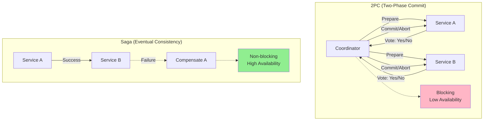
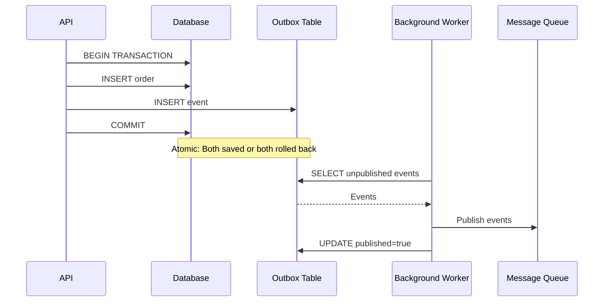
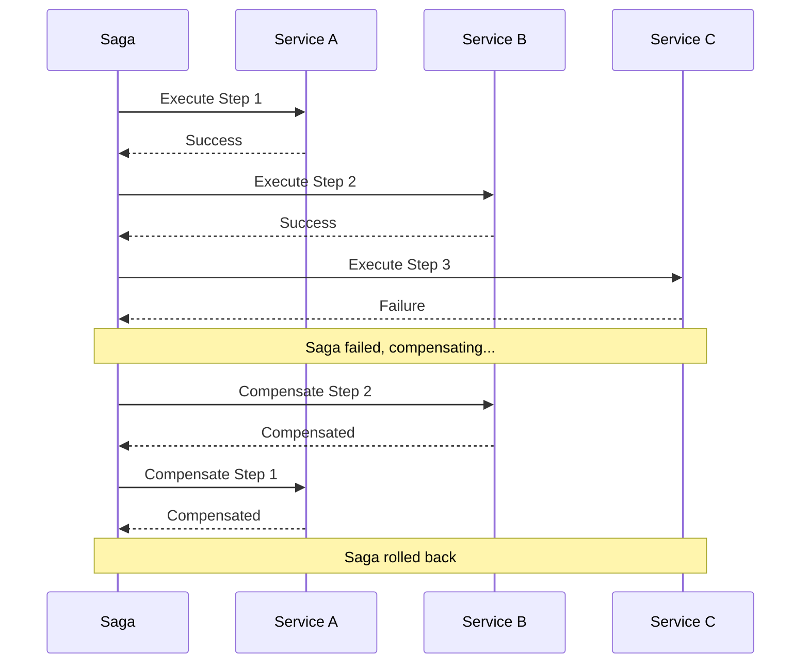
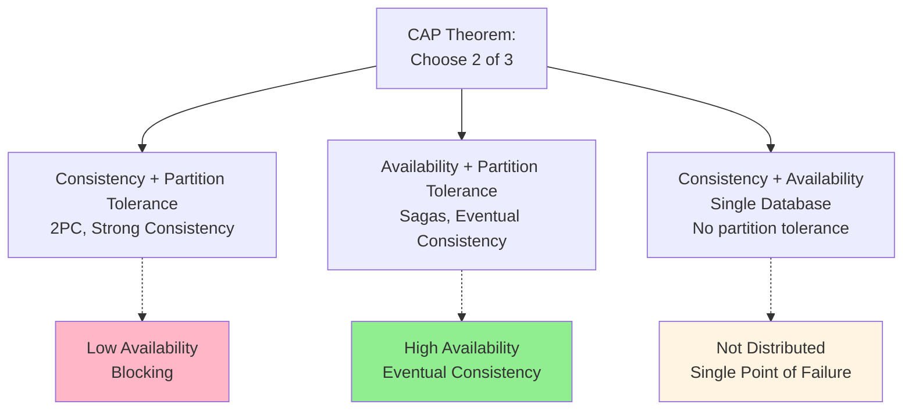

# Distributed transactions (without 2PC)

## 1. Why this exists (Real-world problem first)

Your payment system transfers money between accounts across two databases. Deduct $100 from Account A in Database 1. Add $100 to Account B in Database 2. Database 1 succeeds, Database 2 fails. $100 disappears. The problem? Without distributed transaction coordination, partial failures across multiple systems leave data inconsistent.

**Real production failures from missing distributed transaction handling:**

1. **The Money Disappearance**: Banking app transfers $10,000 between accounts in different databases. Deducts from source account (succeeds). Network timeout before crediting destination account (fails). $10,000 vanishes from system. Customer sees $10,000 missing. Support escalates to engineering. Manual investigation takes 4 hours. Manual correction required. Customer trust damaged. Regulatory compliance violation.

2. **The Double Booking Disaster**: Hotel booking system reserves room in booking database, charges payment in payment database. Payment succeeds ($500 charged). Booking database crashes before reservation saved. Customer charged but no booking exists. Happens to 50 customers during peak season. $25K in charges without bookings. Manual refunds take 2 weeks. Negative reviews flood in.

3. **The Inventory Inconsistency**: E-commerce order processing decrements inventory in inventory service, creates order in order service. Inventory decremented (product shows out of stock). Order service crashes before creating order. Product unavailable but no order exists. Happens to 100 products. Sales lost due to false "out of stock" status. Manual inventory reconciliation required.

4. **The Partial Refund Failure**: Refund process credits customer account, updates order status to "refunded", sends confirmation email. Account credited ($200). Order status update fails (database timeout). Email not sent. Customer sees $200 credit but order still shows "completed." Support confused. Manual status correction for 500 orders.

**What breaks without distributed transactions:**
- Partial failures leave inconsistent state
- Can't guarantee atomicity across services
- Don't understand CAP theorem trade-offs
- Fail to implement compensation logic
- Can't handle network partitions
- Don't know alternatives to 2PC

## 2. Mental model (build imagination)

Think of distributed transactions as **Multi-Bank Wire Transfer**.

### The Wire Transfer Analogy

**Traditional Transaction (Single Bank)**:
- Transfer within same bank
- Atomic: Both debit and credit happen or neither
- Bank guarantees consistency
- Simple, reliable

**Distributed Transaction (Multiple Banks)**:
- Transfer between different banks
- Can't use single transaction
- Need coordination protocol
- More complex, more failure modes

**The Flow:**

**2PC (Two-Phase Commit) - Coordinated**:
1. Coordinator asks all participants: "Can you commit?"
2. All participants vote: "Yes" or "No"
3. If all "Yes", coordinator says: "Commit"
4. If any "No", coordinator says: "Abort"
5. **Problem**: Blocking, coordinator failure, low availability

**Saga (Without 2PC) - Eventual Consistency**:
1. Execute local transaction in Service A
2. Execute local transaction in Service B
3. If B fails, compensate A (undo)
4. **Benefit**: No blocking, high availability
5. **Trade-off**: Eventual consistency

**Why this matters:**
- 2PC trades availability for consistency
- Sagas trade consistency for availability
- Most systems choose sagas (CAP theorem)
- Understanding trade-offs is critical

## 3. How Node.js implements this internally

### Saga Pattern (Distributed Transaction Alternative)

```javascript
// Distributed transaction using Saga pattern
class MoneyTransferSaga {
  async transfer(fromAccount, toAccount, amount) {
    const sagaId = crypto.randomUUID();
    const compensations = [];
    
    try {
      // Step 1: Debit source account
      await this.debitAccount(fromAccount, amount);
      compensations.push(() => this.creditAccount(fromAccount, amount));
      
      // Step 2: Credit destination account
      await this.creditAccount(toAccount, amount);
      
      // Step 3: Record transaction
      await this.recordTransaction(sagaId, fromAccount, toAccount, amount);
      
      return { success: true, sagaId };
    } catch (err) {
      console.error('Transfer failed, compensating:', err);
      
      // Execute compensations in reverse order
      for (const compensate of compensations.reverse()) {
        try {
          await compensate();
        } catch (compErr) {
          console.error('Compensation failed:', compErr);
          // Log for manual intervention
          await this.logFailedCompensation(sagaId, compErr);
        }
      }
      
      return { success: false, error: err.message };
    }
  }
  
  async debitAccount(accountId, amount) {
    // Call Account Service A
    const response = await axios.post(`${accountServiceA}/debit`, {
      accountId,
      amount
    });
    
    if (!response.data.success) {
      throw new Error('Debit failed');
    }
  }
  
  async creditAccount(accountId, amount) {
    // Call Account Service B
    const response = await axios.post(`${accountServiceB}/credit`, {
      accountId,
      amount
    });
    
    if (!response.data.success) {
      throw new Error('Credit failed');
    }
  }
  
  async recordTransaction(sagaId, from, to, amount) {
    await db.transactions.insert({
      sagaId,
      fromAccount: from,
      toAccount: to,
      amount,
      status: 'completed',
      timestamp: new Date()
    });
  }
}
```

### Outbox Pattern (Reliable Event Publishing)

```javascript
// Ensures atomicity between database write and event publishing
class OrderService {
  async createOrder(orderData) {
    // Single local transaction
    await db.transaction(async (trx) => {
      // 1. Create order
      const [orderId] = await trx('orders').insert({
        userId: orderData.userId,
        total: orderData.total,
        status: 'pending'
      });
      
      // 2. Write event to outbox (same transaction!)
      await trx('outbox').insert({
        aggregateId: orderId,
        eventType: 'order.created',
        payload: JSON.stringify({
          orderId,
          userId: orderData.userId,
          total: orderData.total
        }),
        createdAt: new Date()
      });
      
      return orderId;
    });
    
    // Transaction committed atomically
    // Order and outbox event both saved or both rolled back
  }
}

// Background worker publishes events from outbox
class OutboxPublisher {
  async start() {
    setInterval(async () => {
      await this.publishPendingEvents();
    }, 1000);
  }
  
  async publishPendingEvents() {
    const events = await db.outbox.find({
      published: false
    }).limit(100);
    
    for (const event of events) {
      try {
        // Publish to message broker
        await messageQueue.publish(event.eventType, JSON.parse(event.payload));
        
        // Mark as published
        await db.outbox.update(
          { id: event.id },
          { published: true, publishedAt: new Date() }
        );
      } catch (err) {
        console.error('Failed to publish event:', err);
        // Will retry on next iteration
      }
    }
  }
}
```

### Idempotent Operations (Handle Retries)

```javascript
// Ensure operations can be safely retried
class PaymentService {
  async processPayment(paymentId, amount) {
    // Check if already processed (idempotency)
    const existing = await db.payments.findOne({ paymentId });
    
    if (existing) {
      console.log(`Payment ${paymentId} already processed`);
      return existing;
    }
    
    // Process payment atomically
    const payment = await db.transaction(async (trx) => {
      // Charge via Stripe (Stripe has built-in idempotency)
      const charge = await stripe.charges.create({
        amount,
        idempotency_key: paymentId
      });
      
      // Store payment record
      const [record] = await trx('payments').insert({
        paymentId,
        chargeId: charge.id,
        amount,
        status: 'completed',
        processedAt: new Date()
      }).returning('*');
      
      return record;
    });
    
    return payment;
  }
}
```

### Common Misunderstandings

**Mistake 1**: "Distributed transactions are impossible without 2PC"
- **Reality**: Sagas, outbox pattern, idempotency enable distributed transactions
- **Impact**: Over-reliance on 2PC, low availability

**Mistake 2**: "Eventual consistency is always acceptable"
- **Reality**: Some operations need strong consistency
- **Impact**: Wrong pattern choice for critical operations

**Mistake 3**: "Compensations always succeed"
- **Reality**: Compensations can fail, need manual intervention
- **Impact**: Incomplete rollback, data inconsistency

## 4. Multiple diagrams (MANDATORY)

### Diagram 1: 2PC vs Saga



### Diagram 2: Outbox Pattern



### Diagram 3: Saga Compensation Flow



### Diagram 4: CAP Theorem Trade-offs



## 5. Where this is used in real projects

### Money Transfer with Saga

```javascript
class BankTransferSaga {
  async transfer(fromAccountId, toAccountId, amount) {
    const sagaId = crypto.randomUUID();
    const steps = [];
    
    try {
      // Step 1: Validate accounts
      const fromAccount = await this.getAccount(fromAccountId);
      const toAccount = await this.getAccount(toAccountId);
      
      if (fromAccount.balance < amount) {
        throw new Error('Insufficient funds');
      }
      
      // Step 2: Debit source account
      await this.debitAccount(fromAccountId, amount);
      steps.push({
        action: 'debit',
        accountId: fromAccountId,
        amount,
        compensate: () => this.creditAccount(fromAccountId, amount)
      });
      
      // Step 3: Credit destination account
      await this.creditAccount(toAccountId, amount);
      steps.push({
        action: 'credit',
        accountId: toAccountId,
        amount,
        compensate: () => this.debitAccount(toAccountId, amount)
      });
      
      // Step 4: Record transaction
      await this.recordTransaction({
        sagaId,
        fromAccountId,
        toAccountId,
        amount,
        status: 'completed'
      });
      
      return { success: true, sagaId };
    } catch (err) {
      console.error('Transfer failed:', err);
      
      // Compensate in reverse order
      for (const step of steps.reverse()) {
        try {
          await step.compensate();
          console.log(`Compensated ${step.action} for ${step.accountId}`);
        } catch (compErr) {
          console.error('Compensation failed:', compErr);
          await this.logFailedCompensation(sagaId, step, compErr);
        }
      }
      
      return { success: false, error: err.message };
    }
  }
  
  async debitAccount(accountId, amount) {
    await db.accounts.update(
      { id: accountId },
      { $inc: { balance: -amount } }
    );
  }
  
  async creditAccount(accountId, amount) {
    await db.accounts.update(
      { id: accountId },
      { $inc: { balance: amount } }
    );
  }
}
```

### Order Processing with Outbox

```javascript
class OrderProcessor {
  async processOrder(orderData) {
    // Atomic: Order + Events
    await db.transaction(async (trx) => {
      // Create order
      const [orderId] = await trx('orders').insert({
        userId: orderData.userId,
        total: orderData.total,
        status: 'pending'
      });
      
      // Write events to outbox
      const events = [
        {
          eventType: 'order.created',
          aggregateId: orderId,
          payload: JSON.stringify({
            orderId,
            userId: orderData.userId,
            total: orderData.total
          })
        },
        {
          eventType: 'inventory.reserve',
          aggregateId: orderId,
          payload: JSON.stringify({
            orderId,
            items: orderData.items
          })
        },
        {
          eventType: 'payment.process',
          aggregateId: orderId,
          payload: JSON.stringify({
            orderId,
            amount: orderData.total
          })
        }
      ];
      
      for (const event of events) {
        await trx('outbox').insert({
          ...event,
          published: false,
          createdAt: new Date()
        });
      }
    });
    
    // Events will be published by background worker
  }
}
```

## 6. Where this should NOT be used

### Strong Consistency Required

```javascript
// WRONG: Saga for bank balance check
// Balance might be inconsistent during saga

// RIGHT: Single database transaction
await db.transaction(async (trx) => {
  const account = await trx('accounts').where({ id }).first();
  if (account.balance < amount) {
    throw new Error('Insufficient funds');
  }
  await trx('accounts').where({ id }).decrement('balance', amount);
});
```

### Simple Single-Service Operations

```javascript
// WRONG: Distributed transaction for single service
const saga = new Saga();
await saga.execute([
  () => db.users.create(userData)
]);

// RIGHT: Simple transaction
await db.users.create(userData);
```

## 7. Failure modes & edge cases

### Failure Mode 1: Partial Compensation

**Scenario**: Some compensations succeed, others fail

```
Step 1: Debit Account A ✓
Step 2: Credit Account B ✗ (failure)

Compensation:
- Credit Account A ✗ (compensation failed!)

Result: Money deducted but not credited, compensation failed
```

**Solution**: Retry with exponential backoff, manual intervention queue

### Failure Mode 2: Duplicate Events

**Scenario**: Outbox publisher crashes after publishing but before marking as published

```
1. Publish event to queue ✓
2. Mark as published ✗ (crash)
3. Restart, publish again (duplicate!)
```

**Solution**: Idempotent event handlers

### Failure Mode 3: Saga Timeout

**Scenario**: Long-running saga times out

```javascript
// DISASTER: No timeout
await saga.execute(); // Hangs forever

// SOLUTION: Timeout with cleanup
const timeout = 30000;
const result = await Promise.race([
  saga.execute(),
  new Promise((_, reject) => 
    setTimeout(() => reject(new Error('Saga timeout')), timeout)
  )
]);
```

## 8. Trade-offs & alternatives

### Saga Pattern

**Gain**: High availability, no blocking, scalable
**Sacrifice**: Eventual consistency, complex compensation, harder debugging
**When**: Microservices, high availability needed, eventual consistency acceptable

### Two-Phase Commit (2PC)

**Gain**: Strong consistency, ACID guarantees
**Sacrifice**: Low availability, blocking, coordinator dependency
**When**: Financial transactions, strong consistency required, low scale

### Single Database Transaction

**Gain**: Simple, ACID, immediate consistency
**Sacrifice**: Not distributed, single point of failure
**When**: Single service, low scale, monolithic architecture

## 9. Interview-level articulation

**Q: "How do you handle distributed transactions without 2PC?"**

**A**: "I use the saga pattern to coordinate distributed transactions through a sequence of local transactions with compensating actions. Instead of a distributed lock, each service executes its local transaction and publishes an event. If any step fails, I execute compensations in reverse order to undo completed steps. For example, in a money transfer, I debit the source account, then credit the destination account. If crediting fails, I compensate by crediting back the source account. I also use the outbox pattern to ensure atomicity between database writes and event publishing—I write both the business data and the event to an outbox table in a single transaction, then a background worker publishes events from the outbox. This provides eventual consistency with high availability, which is better than 2PC's strong consistency with low availability for most use cases."

**Q: "What are the challenges of distributed transactions?"**

**A**: "The main challenges are handling partial failures, ensuring idempotency, and dealing with eventual consistency. Compensations can fail, so I implement retry logic with exponential backoff and a manual intervention queue for failures that can't be automatically resolved. I make all operations idempotent so they can be safely retried—for example, using unique transaction IDs to detect duplicates. For eventual consistency, I set proper expectations with users by showing 'processing' status and providing polling or webhooks to notify when the transaction completes. The CAP theorem forces us to choose between consistency and availability during network partitions—I usually choose availability (sagas) over consistency (2PC) because most business operations can tolerate eventual consistency."

## 10. Key takeaways (engineer mindset)

### What to Remember

1. **2PC trades availability for consistency** (usually not worth it)
2. **Sagas provide eventual consistency** with high availability
3. **Outbox pattern** ensures atomic event publishing
4. **Idempotent operations** handle retries safely
5. **Compensations can fail** - need retry + manual intervention
6. **CAP theorem**: Choose 2 of 3 (Consistency, Availability, Partition tolerance)
7. **Most systems choose AP** (Availability + Partition tolerance)

### What Decisions This Enables

**Architecture decisions**:
- When to use sagas vs 2PC vs single database
- How to handle distributed state
- Event-driven vs synchronous coordination

**Consistency decisions**:
- Eventual vs strong consistency trade-offs
- When to accept inconsistency windows
- How to communicate status to users

**Reliability decisions**:
- Compensation strategies
- Retry and timeout policies
- Manual intervention processes

### How It Connects to Other Node.js Concepts

**Saga Pattern** (Topic 27):
- Sagas implement distributed transactions
- Compensations handle failures

**Idempotency** (Topic 23):
- Required for safe retries
- Handles duplicate events

**Event Sourcing** (Topic 26):
- Events provide audit trail
- Enable replay for recovery

### The Golden Rule

**Avoid 2PC in distributed systems**. Use sagas for distributed transactions with eventual consistency. Implement outbox pattern for atomic event publishing. Make all operations idempotent. Design compensating actions for each step. Accept eventual consistency for high availability. Use single database transactions when strong consistency is required. Monitor saga execution and implement manual intervention for failed compensations.
