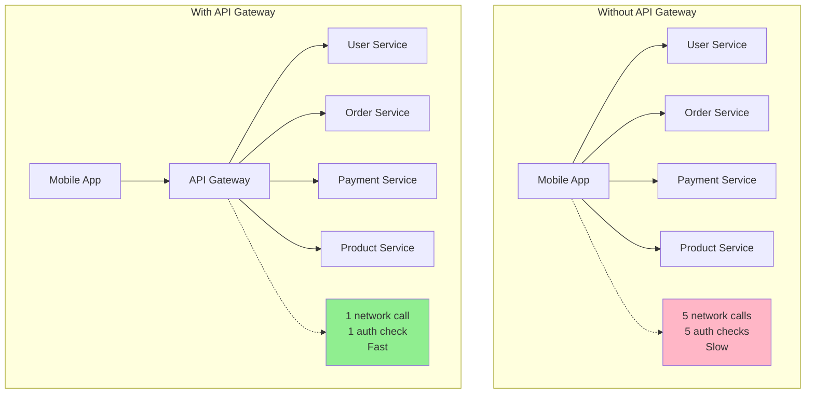
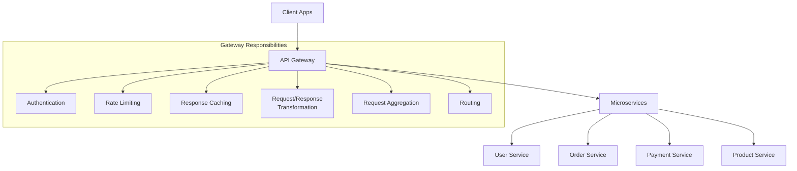
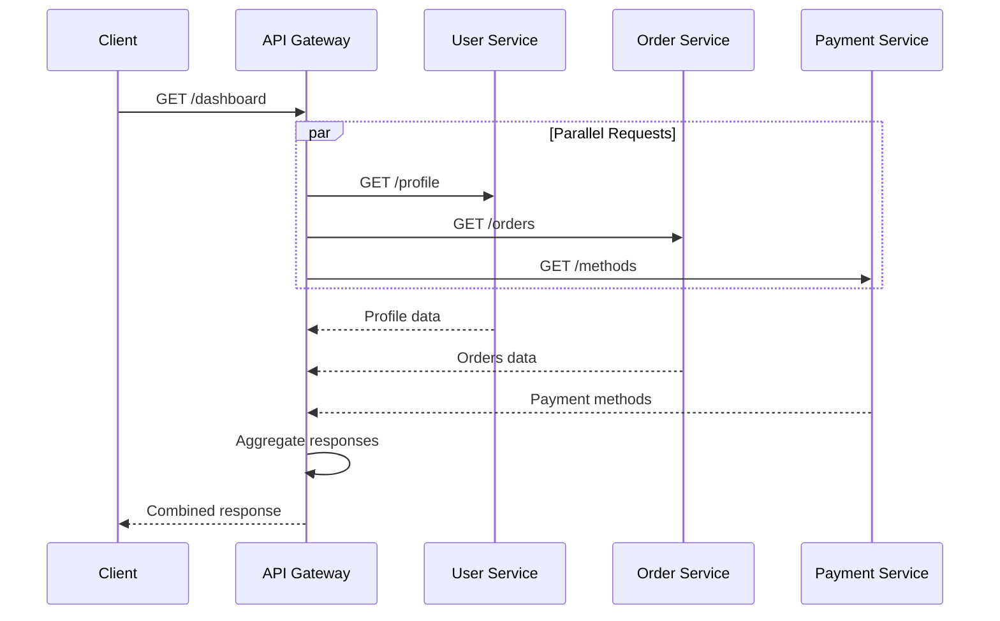
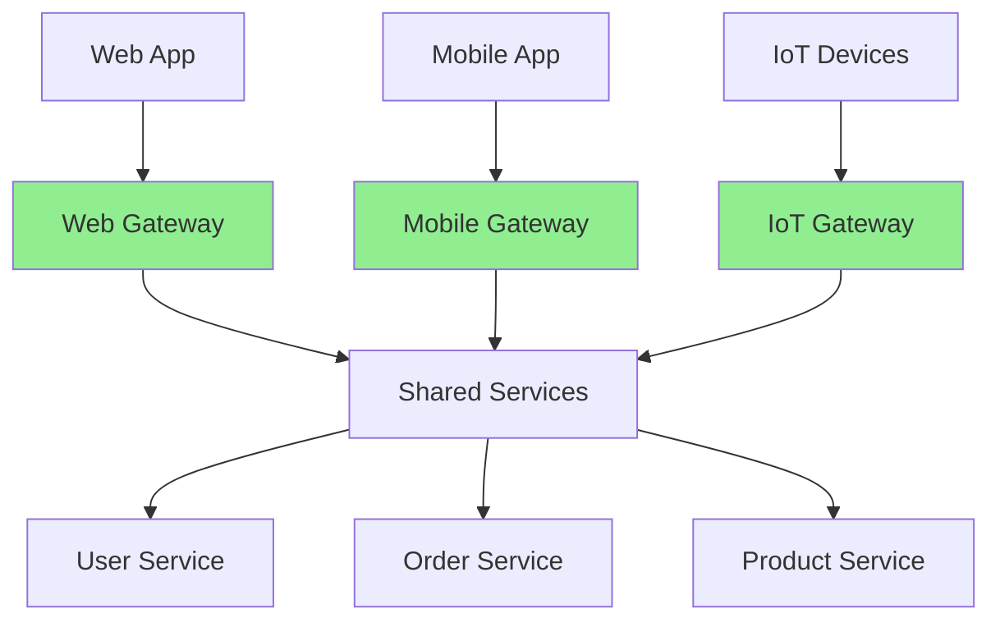

# API Gateway design

## 1. Why this exists (Real-world problem first)

Your microservices architecture has 20 services: user, order, payment, inventory, shipping, notification, analytics, etc. Mobile app needs to display order details. Makes 7 API calls: user service, order service, payment service, inventory service, product service, shipping service, review service. Each call takes 200ms. Total: 1.4 seconds. Mobile app slow. Battery drains. The problem? Direct client-to-service communication creates chatty interfaces, exposes internal architecture, and lacks centralized cross-cutting concerns.

**Real production failures from missing API gateway:**

1. **The Mobile App Performance Disaster**: E-commerce mobile app displays product page. Needs data from 5 services: product details, inventory, pricing, reviews, recommendations. Makes 5 sequential API calls. Each takes 300ms. Total: 1.5 seconds per page load. Users complain about slow app. App store rating drops from 4.5 to 2.8 stars. Team doesn't understand "why is it so slow?" No API gateway to aggregate calls.

2. **The Authentication Chaos**: 15 microservices, each implements its own authentication. User service uses JWT. Order service uses session cookies. Payment service uses OAuth. Inconsistent auth across services. Security vulnerabilities. Audit nightmare. Team spends 3 months standardizing auth across all services. Could have been centralized in API gateway.

3. **The Rate Limiting Nightmare**: Payment service gets DDoS attack. 100,000 requests/second. No rate limiting. Service crashes. All payment processing stops. $500K in lost sales. Team implements rate limiting in payment service. Then user service gets attacked. Then order service. Playing whack-a-mole. No centralized rate limiting.

4. **The API Versioning Hell**: Mobile app v1.0 calls `/api/users`. Backend changes to `/api/v2/users`. Mobile app breaks for 1M users. Can't force app updates. Need to support both versions. Each service implements version routing. Duplicated logic across 20 services. Maintenance nightmare.

**What breaks without API gateway:**
- Chatty client-service communication
- Exposed internal service architecture
- Duplicated cross-cutting concerns (auth, rate limiting, logging)
- Can't aggregate multiple service calls
- No centralized API versioning
- Direct service exposure to internet

## 2. Mental model (build imagination)

Think of API gateway as **Hotel Reception Desk**.

### The Hotel Reception Analogy

**Without API Gateway (Direct Access)**:
- Guests call housekeeping directly
- Guests call room service directly
- Guests call maintenance directly
- Guests need to know all internal phone numbers
- No central security check
- No coordination between departments

**With API Gateway (Reception Desk)**:
- Guests call reception for everything
- Reception routes to appropriate department
- Reception handles security/check-in
- Reception aggregates requests (wake-up call + breakfast)
- Guests don't know internal structure
- Central point for policies (quiet hours, etc.)

**The Flow:**

**Without Gateway:**
```
Mobile App → User Service (auth)
Mobile App → Order Service (get orders)
Mobile App → Payment Service (get payment methods)
Mobile App → Product Service (get product details)
Mobile App → Shipping Service (get tracking)
= 5 network calls, 5 auth checks, 1.5 seconds
```

**With Gateway:**
```
Mobile App → API Gateway (single call)
  Gateway → User Service
  Gateway → Order Service  
  Gateway → Payment Service
  Gateway → Product Service
  Gateway → Shipping Service
  Gateway → Aggregates responses
Mobile App ← Gateway (single response)
= 1 network call, 1 auth check, 400ms
```

**Why this matters:**
- Reduces client-server round trips
- Centralizes cross-cutting concerns
- Hides internal architecture
- Enables API composition
- Simplifies client logic

## 3. How Node.js implements this internally

### Basic API Gateway with Express

```javascript
const express = require('express');
const axios = require('axios');
const app = express();

// Centralized authentication middleware
const authenticate = async (req, res, next) => {
  const token = req.headers.authorization?.split(' ')[1];
  
  if (!token) {
    return res.status(401).json({ error: 'No token provided' });
  }
  
  try {
    // Verify JWT
    const user = await verifyToken(token);
    req.user = user;
    next();
  } catch (err) {
    res.status(401).json({ error: 'Invalid token' });
  }
};

// Centralized rate limiting
const rateLimit = require('express-rate-limit');
const limiter = rateLimit({
  windowMs: 15 * 60 * 1000, // 15 minutes
  max: 100 // limit each IP to 100 requests per windowMs
});

app.use(limiter);

// Request aggregation endpoint
app.get('/api/order-details/:orderId', authenticate, async (req, res) => {
  const { orderId } = req.params;
  
  try {
    // Parallel requests to multiple services
    const [order, payment, shipping, products] = await Promise.all([
      axios.get(`${ORDER_SERVICE}/orders/${orderId}`),
      axios.get(`${PAYMENT_SERVICE}/payments/order/${orderId}`),
      axios.get(`${SHIPPING_SERVICE}/shipments/order/${orderId}`),
      axios.get(`${PRODUCT_SERVICE}/products/order/${orderId}`)
    ]);
    
    // Aggregate response
    res.json({
      order: order.data,
      payment: payment.data,
      shipping: shipping.data,
      products: products.data
    });
  } catch (err) {
    console.error('Failed to fetch order details:', err);
    res.status(500).json({ error: 'Failed to fetch order details' });
  }
});

// Simple routing to services
app.use('/api/users', authenticate, async (req, res) => {
  const response = await axios({
    method: req.method,
    url: `${USER_SERVICE}${req.path}`,
    data: req.body,
    headers: { 'x-user-id': req.user.id }
  });
  res.json(response.data);
});

app.listen(3000);
```

### Advanced Gateway with Request Transformation

```javascript
class APIGateway {
  constructor() {
    this.app = express();
    this.setupMiddleware();
    this.setupRoutes();
  }
  
  setupMiddleware() {
    // Logging
    this.app.use((req, res, next) => {
      console.log(`${req.method} ${req.path}`);
      next();
    });
    
    // CORS
    this.app.use(cors({
      origin: process.env.ALLOWED_ORIGINS?.split(','),
      credentials: true
    }));
    
    // Body parsing
    this.app.use(express.json());
    
    // Request ID
    this.app.use((req, res, next) => {
      req.id = crypto.randomUUID();
      res.setHeader('X-Request-ID', req.id);
      next();
    });
  }
  
  setupRoutes() {
    // API versioning
    this.app.use('/api/v1', this.v1Routes());
    this.app.use('/api/v2', this.v2Routes());
    
    // Health check
    this.app.get('/health', (req, res) => {
      res.json({ status: 'healthy' });
    });
  }
  
  v1Routes() {
    const router = express.Router();
    
    // Aggregate endpoint for mobile app
    router.get('/dashboard', authenticate, async (req, res) => {
      try {
        const userId = req.user.id;
        
        // Fetch data from multiple services in parallel
        const [profile, orders, notifications, recommendations] = await Promise.all([
          this.fetchUserProfile(userId),
          this.fetchRecentOrders(userId),
          this.fetchNotifications(userId),
          this.fetchRecommendations(userId)
        ]);
        
        res.json({
          profile,
          recentOrders: orders,
          notifications,
          recommendations
        });
      } catch (err) {
        console.error('Dashboard fetch failed:', err);
        res.status(500).json({ error: 'Failed to load dashboard' });
      }
    });
    
    return router;
  }
  
  async fetchUserProfile(userId) {
    const response = await axios.get(`${USER_SERVICE}/users/${userId}`, {
      timeout: 2000
    });
    return response.data;
  }
  
  async fetchRecentOrders(userId) {
    const response = await axios.get(`${ORDER_SERVICE}/orders`, {
      params: { userId, limit: 5 },
      timeout: 2000
    });
    return response.data;
  }
}
```

### Gateway with Circuit Breaker

```javascript
const CircuitBreaker = require('opossum');

class ResilientGateway {
  constructor() {
    this.breakers = new Map();
  }
  
  getCircuitBreaker(serviceName, serviceUrl) {
    if (!this.breakers.has(serviceName)) {
      const breaker = new CircuitBreaker(
        async (path, options) => {
          return await axios({
            url: `${serviceUrl}${path}`,
            ...options,
            timeout: 3000
          });
        },
        {
          timeout: 3000,
          errorThresholdPercentage: 50,
          resetTimeout: 30000
        }
      );
      
      breaker.on('open', () => {
        console.log(`Circuit breaker opened for ${serviceName}`);
      });
      
      breaker.on('halfOpen', () => {
        console.log(`Circuit breaker half-open for ${serviceName}`);
      });
      
      this.breakers.set(serviceName, breaker);
    }
    
    return this.breakers.get(serviceName);
  }
  
  async callService(serviceName, serviceUrl, path, options = {}) {
    const breaker = this.getCircuitBreaker(serviceName, serviceUrl);
    
    try {
      const response = await breaker.fire(path, options);
      return response.data;
    } catch (err) {
      console.error(`Service ${serviceName} failed:`, err.message);
      throw err;
    }
  }
}

// Usage
const gateway = new ResilientGateway();

app.get('/api/products/:id', async (req, res) => {
  try {
    const product = await gateway.callService(
      'product-service',
      PRODUCT_SERVICE,
      `/products/${req.params.id}`
    );
    res.json(product);
  } catch (err) {
    res.status(503).json({ error: 'Service temporarily unavailable' });
  }
});
```

### Common Misunderstandings

**Mistake 1**: "API gateway is just a reverse proxy"
- **Reality**: Gateway adds aggregation, transformation, orchestration
- **Impact**: Underutilizing gateway capabilities

**Mistake 2**: "Put all business logic in gateway"
- **Reality**: Gateway should be thin, delegate to services
- **Impact**: Gateway becomes monolithic bottleneck

**Mistake 3**: "One gateway for everything"
- **Reality**: Can have multiple gateways (BFF pattern)
- **Impact**: Single point of failure, scaling issues

## 4. Multiple diagrams (MANDATORY)

### Diagram 1: Without vs With API Gateway



### Diagram 2: API Gateway Architecture



### Diagram 3: Request Aggregation Flow



### Diagram 4: Backend for Frontend (BFF) Pattern



## 5. Where this is used in real projects

### E-Commerce Mobile App Gateway

```javascript
const express = require('express');
const axios = require('axios');
const Redis = require('ioredis');

class ECommerceGateway {
  constructor() {
    this.app = express();
    this.redis = new Redis();
    this.setupMiddleware();
    this.setupRoutes();
  }
  
  setupMiddleware() {
    this.app.use(express.json());
    this.app.use(this.authenticate.bind(this));
    this.app.use(this.rateLimit.bind(this));
  }
  
  async authenticate(req, res, next) {
    // Skip auth for public endpoints
    if (req.path.startsWith('/api/public')) {
      return next();
    }
    
    const token = req.headers.authorization?.split(' ')[1];
    if (!token) {
      return res.status(401).json({ error: 'Unauthorized' });
    }
    
    try {
      const user = await this.verifyToken(token);
      req.user = user;
      next();
    } catch (err) {
      res.status(401).json({ error: 'Invalid token' });
    }
  }
  
  async rateLimit(req, res, next) {
    const key = `ratelimit:${req.ip}`;
    const requests = await this.redis.incr(key);
    
    if (requests === 1) {
      await this.redis.expire(key, 60); // 1 minute window
    }
    
    if (requests > 100) {
      return res.status(429).json({ error: 'Too many requests' });
    }
    
    next();
  }
  
  setupRoutes() {
    // Product listing with caching
    this.app.get('/api/products', async (req, res) => {
      const cacheKey = `products:${JSON.stringify(req.query)}`;
      
      // Check cache
      const cached = await this.redis.get(cacheKey);
      if (cached) {
        return res.json(JSON.parse(cached));
      }
      
      // Fetch from service
      const response = await axios.get(`${PRODUCT_SERVICE}/products`, {
        params: req.query
      });
      
      // Cache for 5 minutes
      await this.redis.setex(cacheKey, 300, JSON.stringify(response.data));
      
      res.json(response.data);
    });
    
    // Order details aggregation
    this.app.get('/api/orders/:orderId', async (req, res) => {
      const { orderId } = req.params;
      
      try {
        const [order, items, shipping, payment] = await Promise.all([
          this.fetchOrder(orderId),
          this.fetchOrderItems(orderId),
          this.fetchShipping(orderId),
          this.fetchPayment(orderId)
        ]);
        
        res.json({
          ...order,
          items,
          shipping,
          payment
        });
      } catch (err) {
        console.error('Order fetch failed:', err);
        res.status(500).json({ error: 'Failed to fetch order' });
      }
    });
    
    // Checkout orchestration
    this.app.post('/api/checkout', async (req, res) => {
      const { cartId, paymentMethod, shippingAddress } = req.body;
      
      try {
        // Step 1: Validate cart
        const cart = await this.validateCart(cartId);
        
        // Step 2: Reserve inventory
        await this.reserveInventory(cart.items);
        
        // Step 3: Process payment
        const payment = await this.processPayment(paymentMethod, cart.total);
        
        // Step 4: Create order
        const order = await this.createOrder({
          userId: req.user.id,
          items: cart.items,
          paymentId: payment.id,
          shippingAddress
        });
        
        // Step 5: Schedule shipping
        await this.scheduleShipping(order.id, shippingAddress);
        
        res.json({ orderId: order.id, status: 'success' });
      } catch (err) {
        console.error('Checkout failed:', err);
        res.status(500).json({ error: err.message });
      }
    });
  }
  
  async fetchOrder(orderId) {
    const response = await axios.get(`${ORDER_SERVICE}/orders/${orderId}`);
    return response.data;
  }
  
  async fetchOrderItems(orderId) {
    const response = await axios.get(`${ORDER_SERVICE}/orders/${orderId}/items`);
    return response.data;
  }
}

const gateway = new ECommerceGateway();
gateway.app.listen(3000);
```

### Backend for Frontend (BFF) - Mobile Gateway

```javascript
class MobileGateway {
  // Mobile-optimized endpoints
  async getDashboard(req, res) {
    const userId = req.user.id;
    
    // Fetch only what mobile needs
    const [profile, recentOrders, notifications] = await Promise.all([
      this.fetchUserProfile(userId),
      this.fetchRecentOrders(userId, 3), // Only 3 recent orders
      this.fetchNotifications(userId, 5) // Only 5 notifications
    ]);
    
    // Transform for mobile (smaller payload)
    res.json({
      user: {
        name: profile.name,
        avatar: profile.avatarUrl
      },
      orders: recentOrders.map(o => ({
        id: o.id,
        total: o.total,
        status: o.status
      })),
      notifications: notifications.map(n => ({
        id: n.id,
        message: n.message,
        unread: n.unread
      }))
    });
  }
}
```

## 6. Where this should NOT be used

### Simple Monolithic Applications

```javascript
// WRONG: API gateway for monolith
// Monolith already has single entry point

// RIGHT: Direct routing in monolith
app.get('/api/users', userController.getUsers);
app.get('/api/orders', orderController.getOrders);
```

### Internal Service-to-Service Communication

```javascript
// WRONG: Route internal calls through gateway
// Order Service → Gateway → Payment Service

// RIGHT: Direct service-to-service
// Order Service → Payment Service (internal network)
```

## 7. Failure modes & edge cases

### Failure Mode 1: Gateway Becomes Bottleneck

**Scenario**: All traffic through single gateway instance

```
10,000 req/sec → Single Gateway → Crashes
All services unreachable
```

**Solution**: Horizontal scaling, load balancing

### Failure Mode 2: Cascading Failures

**Scenario**: One slow service blocks gateway

```
Product Service slow (5s response)
Gateway threads blocked waiting
All requests slow
Gateway crashes
```

**Solution**: Circuit breakers, timeouts

### Failure Mode 3: Cache Stampede

**Scenario**: Cache expires, all requests hit service

```
Cache expires
1000 concurrent requests
All hit database
Database crashes
```

**Solution**: Cache warming, request coalescing

## 8. Trade-offs & alternatives

### API Gateway

**Gain**: Centralized concerns, request aggregation, simplified clients
**Sacrifice**: Single point of failure, added latency, complexity
**When**: Microservices, mobile apps, multiple client types

### Service Mesh

**Gain**: Decentralized, service-to-service features
**Sacrifice**: More complex, higher resource usage
**When**: Large microservices, service-to-service needs

### Direct Client-Service

**Gain**: Simple, no extra hop
**Sacrifice**: Chatty, duplicated logic, exposed architecture
**When**: Monoliths, simple architectures

## 9. Interview-level articulation

**Q: "What is an API gateway and why would you use it?"**

**A**: "An API gateway is a single entry point for client requests that sits between clients and backend services. It handles cross-cutting concerns like authentication, rate limiting, request aggregation, and routing. I use it to reduce client-server round trips by aggregating multiple service calls into one, centralize authentication and rate limiting instead of duplicating across services, and hide internal service architecture from clients. For example, in a mobile app, instead of making 5 separate calls to user, order, payment, product, and shipping services, the app makes one call to the gateway which fetches data from all services in parallel and returns an aggregated response. This reduces latency from 1.5 seconds to 400ms and simplifies client logic."

**Q: "What are the challenges of using an API gateway?"**

**A**: "The main challenges are avoiding it becoming a single point of failure and preventing it from becoming a bottleneck. I address single point of failure by running multiple gateway instances behind a load balancer. For bottlenecks, I keep the gateway thin—it should only handle routing, aggregation, and cross-cutting concerns, not business logic. I also implement circuit breakers to prevent slow services from blocking the gateway, set aggressive timeouts, and use caching for frequently accessed data. Another challenge is the Backend for Frontend pattern—different clients (web, mobile, IoT) need different data shapes, so I sometimes use separate gateways per client type rather than one gateway trying to serve all clients."

## 10. Key takeaways (engineer mindset)

### What to Remember

1. **API gateway** = single entry point for clients
2. **Aggregates** multiple service calls into one
3. **Centralizes** auth, rate limiting, logging, caching
4. **Hides** internal service architecture
5. **Reduces** client-server round trips
6. **Transforms** requests/responses for clients
7. **BFF pattern** = separate gateways per client type

### What Decisions This Enables

**Architecture decisions**:
- When to use gateway vs direct service access
- Single gateway vs multiple (BFF)
- What concerns to centralize

**Performance decisions**:
- Request aggregation strategies
- Caching policies
- Timeout and retry configuration

**Scalability decisions**:
- Gateway scaling strategy
- Load balancing approach
- Circuit breaker thresholds

### How It Connects to Other Node.js Concepts

**Rate Limiting** (Topic 36):
- Gateway implements centralized rate limiting
- Protects backend services

**Circuit Breaker** (Topic 37):
- Gateway uses circuit breakers
- Prevents cascading failures

**Caching** (Topic 39):
- Gateway caches responses
- Reduces backend load

### The Golden Rule

**Use API gateway for microservices with multiple client types**. Aggregate requests to reduce round trips. Centralize cross-cutting concerns (auth, rate limiting, logging). Keep gateway thin—delegate business logic to services. Use BFF pattern for different client needs. Implement circuit breakers and timeouts. Scale horizontally behind load balancer. Don't use for monoliths or internal service-to-service communication.
