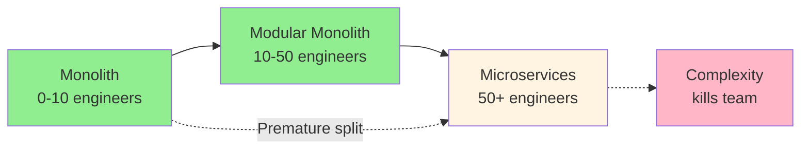
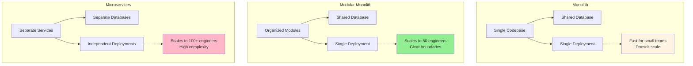
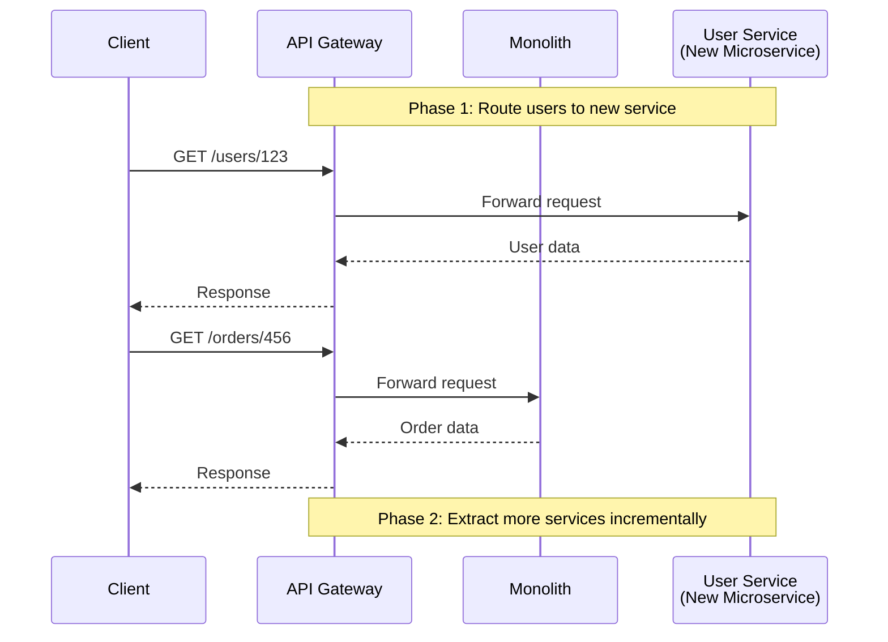
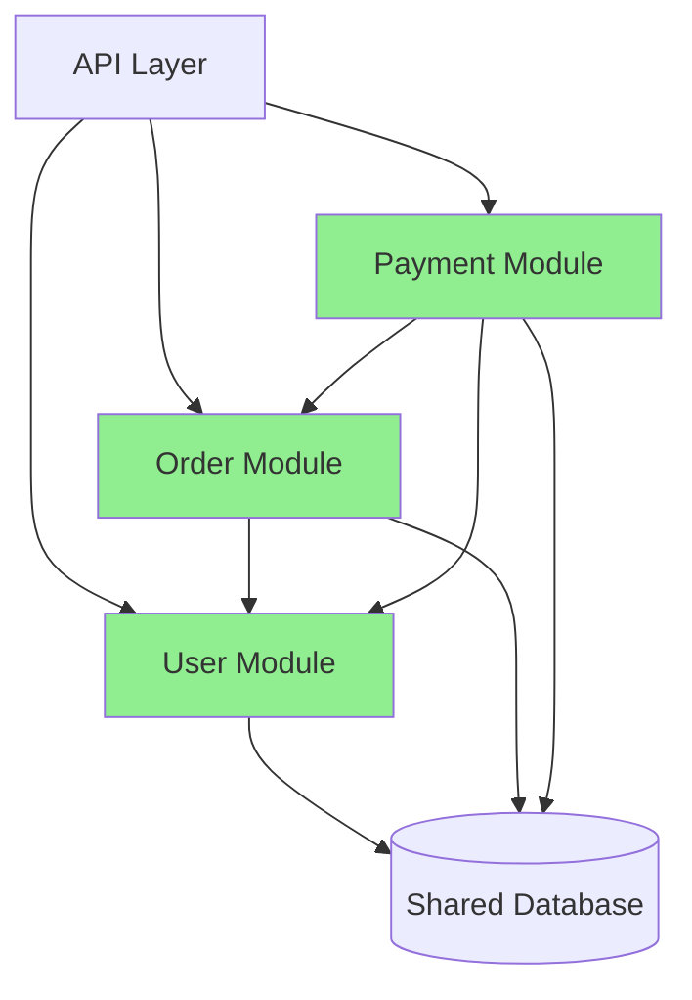

# Monolith → Modular Monolith → Microservices

## 1. Why this exists (Real-world problem first)

Your e-commerce monolith has 500K lines of code. User service, order service, payment service, inventory service all in one codebase. Deploy takes 30 minutes. One bug in product search breaks checkout. Team of 50 engineers stepping on each other's toes. Can't scale user service independently from order service. The problem? Monolithic architecture can't scale with team size and business complexity, but jumping straight to microservices creates distributed system complexity you're not ready for.

**Real production failures from wrong architecture choice:**

1. **The Premature Microservices Disaster**: Startup with 5 engineers, 1000 users splits monolith into 15 microservices. Now managing service discovery, distributed tracing, inter-service communication, eventual consistency, distributed transactions. Engineering velocity drops 70%. Bugs increase 3x. Team spends more time on infrastructure than features. Runs out of funding. Should have stayed monolith.

2. **The Monolith Scaling Nightmare**: E-commerce platform, 100 engineers, 1M users, still monolith. User service needs 10 instances. Order service needs 2 instances. But can't scale independently—must scale entire monolith. Running 10 instances of everything. $50K/month in wasted infrastructure. Deploy takes 45 minutes. One team's bug breaks entire platform. Can't release independently.

3. **The Modular Monolith Success**: SaaS platform starts as monolith. Organizes code into modules with clear boundaries. User module, billing module, analytics module. Shared database but isolated code. Grows to 50 engineers, 100K users. Still monolith but modular. Fast deploys, clear ownership, no distributed system complexity. Later extracts billing module to microservice when needed. Smooth transition.

4. **The Big Bang Rewrite Failure**: Company decides to rewrite monolith as microservices. Stops feature development for 18 months. Competitors gain market share. Rewrite fails—too complex, too many unknowns. Forced to rollback. $5M wasted. Should have done incremental extraction.

**What breaks without proper architecture evolution:**
- Premature microservices kill small teams
- Monoliths can't scale with large teams
- Big bang rewrites fail
- Don't understand when to evolve
- Can't scale services independently
- Deploy coupling blocks releases

## 2. Mental model (build imagination)

Think of architecture evolution as **Building Construction**.

### The Building Construction Analogy

**Monolith (Single Building)**:
- All departments in one building
- Easy communication (walk to desk)
- Shared resources (cafeteria, meeting rooms)
- Can't expand one department without affecting others
- Renovation affects entire building

**Modular Monolith (Building with Wings)**:
- Same building, separate wings per department
- Clear boundaries between wings
- Shared infrastructure (lobby, parking)
- Can renovate one wing independently
- Still benefits from proximity

**Microservices (Campus)**:
- Separate buildings per department
- Independent renovation/expansion
- Own infrastructure per building
- Communication requires walking between buildings
- More complex coordination

**The Evolution:**

**Stage 1: Monolith (0-10 engineers)**
- Single codebase, single deployment
- Fast development, simple infrastructure
- Works well for small teams

**Stage 2: Modular Monolith (10-50 engineers)**
- Organized modules with boundaries
- Shared database, single deployment
- Scales with medium teams

**Stage 3: Microservices (50+ engineers)**
- Independent services, independent deployments
- Distributed system complexity
- Scales with large teams

**Why this matters:**
- Architecture should match team size
- Evolve incrementally, not big bang
- Modular monolith is often the sweet spot
- Microservices add complexity—need justification

## 3. How Node.js implements this internally

### Monolith Structure

```javascript
// Single Express app, all features together
const express = require('express');
const app = express();

// All routes in one file
app.post('/users', userController.create);
app.get('/users/:id', userController.get);
app.post('/orders', orderController.create);
app.get('/orders/:id', orderController.get);
app.post('/payments', paymentController.process);

// Shared database connection
const db = require('./database');

// Single deployment
app.listen(3000);
```

### Modular Monolith Structure

```javascript
// Organized into modules with clear boundaries

// src/modules/user/user.module.js
class UserModule {
  constructor(db) {
    this.db = db;
    this.router = express.Router();
    this.setupRoutes();
  }
  
  setupRoutes() {
    this.router.post('/', this.create.bind(this));
    this.router.get('/:id', this.get.bind(this));
  }
  
  async create(req, res) {
    const user = await this.db.users.create(req.body);
    res.json(user);
  }
  
  async get(req, res) {
    const user = await this.db.users.findById(req.params.id);
    res.json(user);
  }
}

// src/modules/order/order.module.js
class OrderModule {
  constructor(db, userModule) {
    this.db = db;
    this.userModule = userModule; // Dependency injection
    this.router = express.Router();
    this.setupRoutes();
  }
  
  setupRoutes() {
    this.router.post('/', this.create.bind(this));
  }
  
  async create(req, res) {
    // Can call user module internally
    const user = await this.userModule.getUser(req.body.userId);
    
    const order = await this.db.orders.create({
      userId: user.id,
      items: req.body.items
    });
    
    res.json(order);
  }
}

// src/app.js - Wire modules together
const db = require('./database');
const userModule = new UserModule(db);
const orderModule = new OrderModule(db, userModule);

app.use('/api/users', userModule.router);
app.use('/api/orders', orderModule.router);

// Still single deployment
app.listen(3000);
```

### Microservices Structure

```javascript
// Separate services, separate deployments

// user-service/index.js
const express = require('express');
const app = express();
const db = require('./database'); // Own database

app.post('/users', async (req, res) => {
  const user = await db.users.create(req.body);
  
  // Publish event
  await eventBus.publish('user.created', user);
  
  res.json(user);
});

app.listen(3001);

// order-service/index.js
const express = require('express');
const app = express();
const db = require('./database'); // Own database

app.post('/orders', async (req, res) => {
  // Call user service via HTTP
  const user = await axios.get(`${USER_SERVICE}/users/${req.body.userId}`);
  
  const order = await db.orders.create({
    userId: user.id,
    items: req.body.items
  });
  
  res.json(order);
});

app.listen(3002);
```

### Strangler Fig Pattern (Incremental Migration)

```javascript
// API Gateway routes some requests to monolith, some to microservices

const express = require('express');
const proxy = require('express-http-proxy');
const app = express();

// New user service (microservice)
app.use('/api/users', proxy('http://user-service:3001'));

// Old order service (still in monolith)
app.use('/api/orders', proxy('http://monolith:3000'));

// Gradually migrate endpoints
app.listen(8080);
```

### Common Misunderstandings

**Mistake 1**: "Microservices are always better"
- **Reality**: Microservices add complexity, only worth it at scale
- **Impact**: Premature microservices kill productivity

**Mistake 2**: "Must do big bang rewrite"
- **Reality**: Incremental extraction via strangler fig pattern
- **Impact**: Big bang rewrites usually fail

**Mistake 3**: "Modular monolith is just bad architecture"
- **Reality**: Modular monolith is often the right choice
- **Impact**: Jumping to microservices too early

## 4. Multiple diagrams (MANDATORY)

### Diagram 1: Architecture Evolution



### Diagram 2: Monolith vs Modular Monolith vs Microservices



### Diagram 3: Strangler Fig Pattern



### Diagram 4: Module Dependencies



## 5. Where this is used in real projects

### Modular Monolith Example

```javascript
// Clear module boundaries in monolith

// src/modules/user/user.service.js
class UserService {
  constructor(db) {
    this.db = db;
  }
  
  async createUser(userData) {
    const user = await this.db.users.create(userData);
    
    // Emit domain event (in-process)
    eventBus.emit('user.created', user);
    
    return user;
  }
  
  async getUser(userId) {
    return await this.db.users.findById(userId);
  }
}

// src/modules/order/order.service.js
class OrderService {
  constructor(db, userService) {
    this.db = db;
    this.userService = userService;
    
    // Subscribe to events
    eventBus.on('user.created', this.handleUserCreated.bind(this));
  }
  
  async createOrder(orderData) {
    // Call user service (in-process)
    const user = await this.userService.getUser(orderData.userId);
    
    const order = await this.db.orders.create({
      userId: user.id,
      items: orderData.items,
      total: this.calculateTotal(orderData.items)
    });
    
    return order;
  }
  
  async handleUserCreated(user) {
    // Create welcome order or discount
    console.log(`User ${user.id} created, send welcome email`);
  }
}

// src/app.js
const db = require('./database');
const userService = new UserService(db);
const orderService = new OrderService(db, userService);

// Expose via API
app.post('/api/users', async (req, res) => {
  const user = await userService.createUser(req.body);
  res.json(user);
});

app.post('/api/orders', async (req, res) => {
  const order = await orderService.createOrder(req.body);
  res.json(order);
});
```

### Incremental Microservice Extraction

```javascript
// Step 1: Extract user service

// user-service/index.js (new microservice)
const express = require('express');
const app = express();
const db = require('./user-database'); // Own database

app.post('/users', async (req, res) => {
  const user = await db.users.create(req.body);
  
  // Publish to message queue
  await messageQueue.publish('user.created', user);
  
  res.json(user);
});

app.listen(3001);

// monolith/src/modules/order/order.service.js (still in monolith)
class OrderService {
  async createOrder(orderData) {
    // Call user service via HTTP now
    const user = await axios.get(`${USER_SERVICE}/users/${orderData.userId}`);
    
    const order = await this.db.orders.create({
      userId: user.id,
      items: orderData.items
    });
    
    return order;
  }
}

// Step 2: Later extract order service
// Step 3: Later extract payment service
// Incremental, not big bang
```

## 6. Where this should NOT be used

### Don't Use Microservices for Small Teams

```javascript
// WRONG: 5 engineers, 15 microservices
// Overhead kills productivity

// RIGHT: 5 engineers, modular monolith
// Fast development, simple deployment
```

### Don't Skip Modular Monolith

```javascript
// WRONG: Monolith → Microservices (skip modular)
// No clear boundaries, messy extraction

// RIGHT: Monolith → Modular Monolith → Microservices
// Clear boundaries make extraction easier
```

## 7. Failure modes & edge cases

### Failure Mode 1: Distributed Monolith

**Scenario**: Microservices but tightly coupled

```
User Service → Order Service → Payment Service
All synchronous calls, can't deploy independently
Worst of both worlds: distributed + coupled
```

**Solution**: Async communication, event-driven

### Failure Mode 2: Shared Database

**Scenario**: Microservices sharing database

```
User Service → Shared DB ← Order Service
Services coupled via database schema
Can't evolve independently
```

**Solution**: Database per service

### Failure Mode 3: Big Bang Migration

**Scenario**: Stop features, rewrite everything

```
Month 1-6: Rewrite
Month 7: Realize too complex
Month 8: Rollback
$5M wasted
```

**Solution**: Strangler fig, incremental extraction

## 8. Trade-offs & alternatives

### Monolith

**Gain**: Simple, fast development, easy debugging
**Sacrifice**: Doesn't scale with large teams, deploy coupling
**When**: 0-10 engineers, MVP, startups

### Modular Monolith

**Gain**: Clear boundaries, scales to 50 engineers, simple deployment
**Sacrifice**: Can't scale services independently, shared database
**When**: 10-50 engineers, most companies

### Microservices

**Gain**: Independent scaling, independent deployment, team autonomy
**Sacrifice**: Distributed system complexity, operational overhead
**When**: 50+ engineers, need independent scaling

## 9. Interview-level articulation

**Q: "When would you choose microservices over a monolith?"**

**A**: "I choose microservices when I have a large team (50+ engineers) that needs to work independently, when different services have different scaling requirements, or when I need independent deployment cycles. For example, if my user service needs 10 instances but my order service only needs 2, microservices let me scale them independently. However, I don't jump straight to microservices. I start with a modular monolith—organize code into clear modules with boundaries, but keep it as a single deployment. This gives me the benefits of clear ownership and boundaries without the complexity of distributed systems. When a module truly needs independent scaling or deployment, I extract it as a microservice using the strangler fig pattern—incrementally routing traffic to the new service while keeping the rest in the monolith."

**Q: "How do you migrate from monolith to microservices?"**

**A**: "I use the strangler fig pattern for incremental migration. First, I ensure the monolith is modular with clear boundaries. Then I identify a good candidate for extraction—usually a module that's well-bounded, has high scaling needs, or is changing frequently. I build the new microservice, deploy it, and use an API gateway to route requests to either the monolith or the new service. The new service has its own database, and I migrate data incrementally. I don't do a big bang rewrite—I extract one service at a time, validate it works, then move to the next. This reduces risk and allows rollback at any point."

## 10. Key takeaways (engineer mindset)

### What to Remember

1. **Start with monolith** for small teams (0-10 engineers)
2. **Evolve to modular monolith** for medium teams (10-50 engineers)
3. **Extract to microservices** only when needed (50+ engineers)
4. **Strangler fig pattern** for incremental migration
5. **Modular monolith** is often the right answer
6. **Microservices add complexity**—need justification
7. **Big bang rewrites fail**—always incremental

### What Decisions This Enables

**Architecture decisions**:
- When to stay monolith vs evolve
- How to organize modules
- Which services to extract first

**Team decisions**:
- Team structure and ownership
- Deployment independence
- Communication patterns

**Migration decisions**:
- Incremental vs big bang
- Extraction order
- Data migration strategy

### How It Connects to Other Node.js Concepts

**API Gateway** (Topic 30):
- Gateway enables strangler fig pattern
- Routes to monolith or microservices

**Service Communication** (Topic 32):
- Microservices need communication strategy
- Sync vs async patterns

**Distributed Transactions** (Topic 29):
- Microservices need saga pattern
- Can't use database transactions

### The Golden Rule

**Start with modular monolith**. Organize code into clear modules with boundaries. Keep single deployment and shared database. Evolve to microservices only when team size (50+ engineers) or scaling needs justify the complexity. Use strangler fig pattern for incremental extraction. Never do big bang rewrites. Most companies should stay modular monolith.
