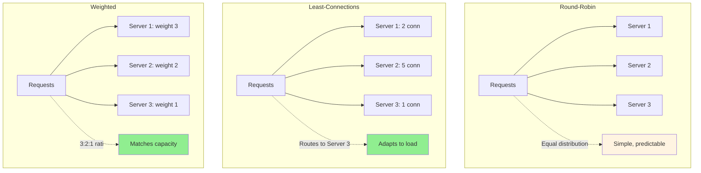
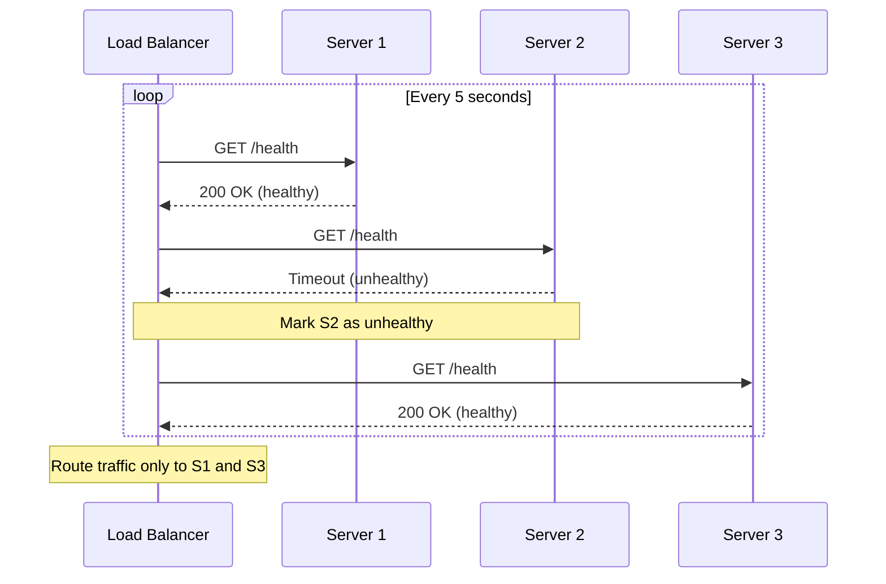
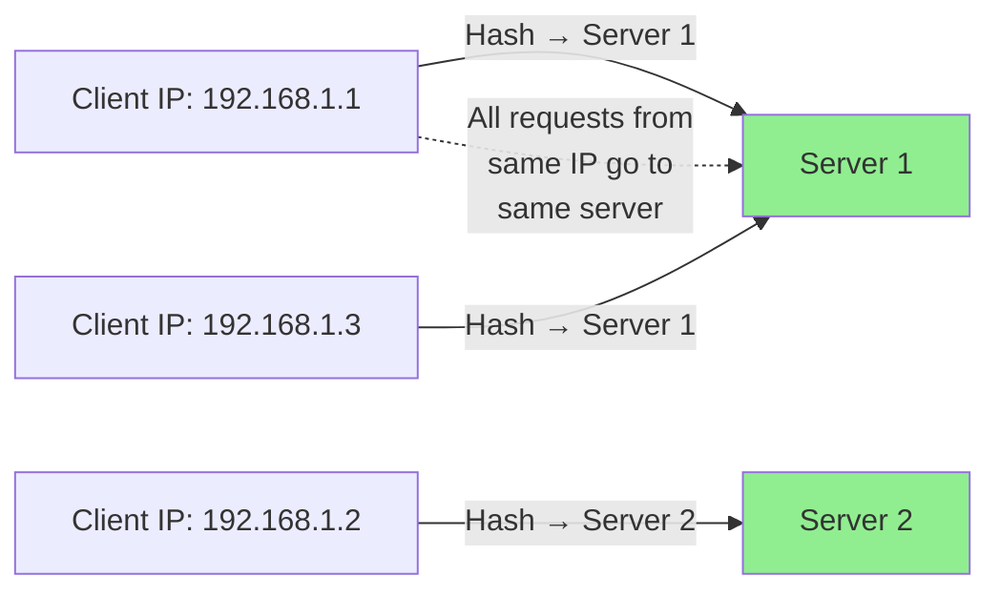
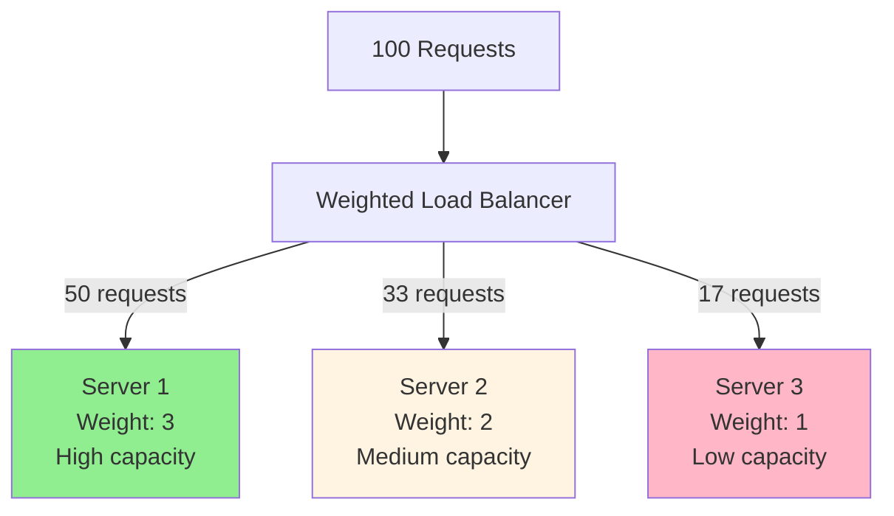

# Load balancing strategies

## 1. Why this exists (Real-world problem first)

Your API has 3 servers. Round-robin load balancer sends requests: Server 1, Server 2, Server 3, Server 1, Server 2, Server 3. Server 2 has slow disk, takes 5 seconds per request. Server 1 and 3 take 100ms. Users routed to Server 2 experience 5-second delays. Round-robin doesn't account for server performance differences. The problem? Wrong load balancing strategy causes uneven load distribution, slow responses, and poor resource utilization.

**Real production failures from wrong load balancing:**

1. **The Round-Robin Disaster**: E-commerce platform, 10 servers behind round-robin load balancer. Server 5 has failing disk, 10x slower than others. Round-robin sends 10% of traffic to slow server. 10% of users experience 10-second page loads. Complaints flood in. Team doesn't understand "why are some users slow?" Takes 4 hours to identify slow server. Should have used least-connections or health checks.

2. **The Sticky Session Nightmare**: Video streaming platform uses IP hash for sticky sessions. Large office (1000 users) behind single IP. All 1000 users routed to same server. Server crashes under load. Other 9 servers idle. Users can't stream videos. $100K in lost revenue. Should have used cookie-based sticky sessions or avoided stickiness.

3. **The Least-Connections Trap**: API servers handle both fast requests (100ms) and slow requests (10s). Least-connections sends all fast requests to Server 1 (low connection count). Server 1 overwhelmed with 1000 fast requests. Server 2 handles 10 slow requests, low connection count but actually busy. Least-connections doesn't account for request duration.

4. **The Health Check Failure**: Load balancer health checks every 30 seconds. Server crashes. Load balancer takes 30 seconds to detect. 30 seconds of failed requests sent to dead server. Users see errors. Should have used faster health checks (5 seconds) and circuit breakers.

**What breaks without proper load balancing:**
- Uneven load distribution
- Slow servers get same traffic as fast servers
- Can't handle server failures gracefully
- Don't understand different strategies
- Poor resource utilization
- Can't maintain session affinity when needed

## 2. Mental model (build imagination)

Think of load balancing as **Supermarket Checkout Lanes**.

### The Supermarket Analogy

**Round-Robin (Fixed Rotation)**:
- Customer 1 → Lane 1
- Customer 2 → Lane 2
- Customer 3 → Lane 3
- Customer 4 → Lane 1 (repeat)
- Problem: Lane 2 cashier slow, customers wait longer

**Least-Connections (Shortest Queue)**:
- Customer joins lane with fewest people
- Adapts to lane speed
- Problem: Doesn't account for cart size

**Weighted (Experienced Cashiers)**:
- Experienced cashier gets 2x customers
- New cashier gets 1x customers
- Distributes based on capability

**IP Hash (Same Lane Every Time)**:
- Customer always goes to same lane
- Builds relationship with cashier
- Problem: Uneven distribution if some customers shop more

**The Flow:**

**Round-Robin:**
```
Request 1 → Server 1
Request 2 → Server 2
Request 3 → Server 3
Request 4 → Server 1 (repeat)
Simple, but doesn't adapt to load
```

**Least-Connections:**
```
Request 1 → Server 1 (0 connections)
Request 2 → Server 2 (0 connections)
Request 3 → Server 3 (0 connections)
Request 4 → Server 1 (1 connection, lowest)
Adapts to current load
```

**Why this matters:**
- Different strategies for different use cases
- Round-robin for stateless, uniform requests
- Least-connections for varying request durations
- IP hash for session affinity
- Weighted for heterogeneous servers

## 3. How Node.js implements this internally

### Round-Robin Load Balancing

```javascript
class RoundRobinLoadBalancer {
  constructor(servers) {
    this.servers = servers;
    this.currentIndex = 0;
  }
  
  getNextServer() {
    const server = this.servers[this.currentIndex];
    this.currentIndex = (this.currentIndex + 1) % this.servers.length;
    return server;
  }
  
  async handleRequest(req, res) {
    const server = this.getNextServer();
    
    try {
      const response = await axios({
        method: req.method,
        url: `${server.url}${req.path}`,
        data: req.body,
        timeout: 5000
      });
      
      res.json(response.data);
    } catch (err) {
      res.status(500).json({ error: 'Server error' });
    }
  }
}

// Usage
const lb = new RoundRobinLoadBalancer([
  { url: 'http://server1:3000' },
  { url: 'http://server2:3000' },
  { url: 'http://server3:3000' }
]);

app.use((req, res) => lb.handleRequest(req, res));
```

### Least-Connections Load Balancing

```javascript
class LeastConnectionsLoadBalancer {
  constructor(servers) {
    this.servers = servers.map(s => ({
      ...s,
      activeConnections: 0
    }));
  }
  
  getNextServer() {
    // Find server with least active connections
    return this.servers.reduce((min, server) => 
      server.activeConnections < min.activeConnections ? server : min
    );
  }
  
  async handleRequest(req, res) {
    const server = this.getNextServer();
    server.activeConnections++;
    
    try {
      const response = await axios({
        method: req.method,
        url: `${server.url}${req.path}`,
        data: req.body,
        timeout: 5000
      });
      
      res.json(response.data);
    } catch (err) {
      res.status(500).json({ error: 'Server error' });
    } finally {
      server.activeConnections--;
    }
  }
}
```

### Weighted Round-Robin

```javascript
class WeightedRoundRobinLoadBalancer {
  constructor(servers) {
    // servers: [{ url, weight }, ...]
    this.servers = servers;
    this.currentIndex = 0;
    this.currentWeight = 0;
    this.maxWeight = Math.max(...servers.map(s => s.weight));
    this.gcd = this.calculateGCD(servers.map(s => s.weight));
  }
  
  calculateGCD(weights) {
    return weights.reduce((a, b) => {
      while (b) [a, b] = [b, a % b];
      return a;
    });
  }
  
  getNextServer() {
    while (true) {
      this.currentIndex = (this.currentIndex + 1) % this.servers.length;
      
      if (this.currentIndex === 0) {
        this.currentWeight = this.currentWeight - this.gcd;
        if (this.currentWeight <= 0) {
          this.currentWeight = this.maxWeight;
        }
      }
      
      if (this.servers[this.currentIndex].weight >= this.currentWeight) {
        return this.servers[this.currentIndex];
      }
    }
  }
}

// Usage
const lb = new WeightedRoundRobinLoadBalancer([
  { url: 'http://server1:3000', weight: 3 }, // 3x capacity
  { url: 'http://server2:3000', weight: 2 }, // 2x capacity
  { url: 'http://server3:3000', weight: 1 }  // 1x capacity
]);
```

### IP Hash (Consistent Hashing)

```javascript
const crypto = require('crypto');

class IPHashLoadBalancer {
  constructor(servers) {
    this.servers = servers;
  }
  
  hash(ip) {
    return crypto.createHash('md5').update(ip).digest('hex');
  }
  
  getServerForIP(ip) {
    const hash = this.hash(ip);
    const index = parseInt(hash.substring(0, 8), 16) % this.servers.length;
    return this.servers[index];
  }
  
  async handleRequest(req, res) {
    const clientIP = req.ip || req.connection.remoteAddress;
    const server = this.getServerForIP(clientIP);
    
    const response = await axios({
      method: req.method,
      url: `${server.url}${req.path}`,
      data: req.body
    });
    
    res.json(response.data);
  }
}
```

### Health-Aware Load Balancer

```javascript
class HealthAwareLoadBalancer {
  constructor(servers) {
    this.servers = servers.map(s => ({
      ...s,
      healthy: true,
      activeConnections: 0
    }));
    
    this.startHealthChecks();
  }
  
  startHealthChecks() {
    setInterval(async () => {
      for (const server of this.servers) {
        try {
          await axios.get(`${server.url}/health`, { timeout: 2000 });
          server.healthy = true;
        } catch (err) {
          console.log(`Server ${server.url} unhealthy`);
          server.healthy = false;
        }
      }
    }, 5000); // Check every 5 seconds
  }
  
  getNextServer() {
    // Get healthy servers only
    const healthyServers = this.servers.filter(s => s.healthy);
    
    if (healthyServers.length === 0) {
      throw new Error('No healthy servers available');
    }
    
    // Least connections among healthy servers
    return healthyServers.reduce((min, server) => 
      server.activeConnections < min.activeConnections ? server : min
    );
  }
  
  async handleRequest(req, res) {
    try {
      const server = this.getNextServer();
      server.activeConnections++;
      
      const response = await axios({
        method: req.method,
        url: `${server.url}${req.path}`,
        data: req.body,
        timeout: 5000
      });
      
      res.json(response.data);
    } catch (err) {
      res.status(503).json({ error: 'Service unavailable' });
    } finally {
      if (server) server.activeConnections--;
    }
  }
}
```

### Common Misunderstandings

**Mistake 1**: "Round-robin is always best"
- **Reality**: Round-robin doesn't account for server load or performance
- **Impact**: Uneven load distribution

**Mistake 2**: "Least-connections solves everything"
- **Reality**: Doesn't account for request complexity
- **Impact**: Fast requests overwhelm one server

**Mistake 3**: "IP hash provides perfect stickiness"
- **Reality**: NAT and proxies can change IPs
- **Impact**: Session loss

## 4. Multiple diagrams (MANDATORY)

### Diagram 1: Load Balancing Strategies Comparison



### Diagram 2: Health Check Flow



### Diagram 3: IP Hash Sticky Sessions



### Diagram 4: Weighted Distribution



## 5. Where this is used in real projects

### NGINX Load Balancer Configuration

```nginx
upstream backend {
    # Least connections
    least_conn;
    
    # Servers with weights
    server backend1.example.com weight=3;
    server backend2.example.com weight=2;
    server backend3.example.com weight=1;
    
    # Health checks
    server backend4.example.com max_fails=3 fail_timeout=30s;
}

server {
    listen 80;
    
    location / {
        proxy_pass http://backend;
        proxy_next_upstream error timeout http_500;
    }
}
```

### Node.js Cluster with Round-Robin

```javascript
const cluster = require('cluster');
const os = require('os');

if (cluster.isMaster) {
  const numCPUs = os.cpus().length;
  
  console.log(`Master ${process.pid} starting ${numCPUs} workers`);
  
  // Fork workers (round-robin by default)
  for (let i = 0; i < numCPUs; i++) {
    cluster.fork();
  }
  
  cluster.on('exit', (worker, code, signal) => {
    console.log(`Worker ${worker.process.pid} died, restarting...`);
    cluster.fork();
  });
} else {
  // Worker process
  const express = require('express');
  const app = express();
  
  app.get('/', (req, res) => {
    res.json({ worker: process.pid });
  });
  
  app.listen(3000);
  console.log(`Worker ${process.pid} started`);
}
```

### Application-Level Load Balancing

```javascript
class ServiceLoadBalancer {
  constructor() {
    this.services = {
      'user-service': [
        { url: 'http://user1:3001', weight: 3 },
        { url: 'http://user2:3001', weight: 2 }
      ],
      'order-service': [
        { url: 'http://order1:3002', weight: 1 },
        { url: 'http://order2:3002', weight: 1 }
      ]
    };
    
    this.loadBalancers = {};
    
    for (const [service, servers] of Object.entries(this.services)) {
      this.loadBalancers[service] = new WeightedRoundRobinLoadBalancer(servers);
    }
  }
  
  async callService(serviceName, path, options = {}) {
    const lb = this.loadBalancers[serviceName];
    const server = lb.getNextServer();
    
    return await axios({
      url: `${server.url}${path}`,
      ...options
    });
  }
}

// Usage
const lb = new ServiceLoadBalancer();

app.get('/users/:id', async (req, res) => {
  const response = await lb.callService('user-service', `/users/${req.params.id}`);
  res.json(response.data);
});
```

## 6. Where this should NOT be used

### Don't Use IP Hash for Mobile Apps

```javascript
// WRONG: IP hash for mobile (IP changes frequently)
// Mobile switches between WiFi and cellular
// Different IP each time, loses session

// RIGHT: Cookie-based or token-based sessions
```

### Don't Use Round-Robin for Heterogeneous Servers

```javascript
// WRONG: Round-robin with different server capacities
// Server 1: 32 CPU cores
// Server 2: 4 CPU cores
// Both get same traffic

// RIGHT: Weighted round-robin
// Server 1: weight 8
// Server 2: weight 1
```

## 7. Failure modes & edge cases

### Failure Mode 1: Thundering Herd on Recovery

**Scenario**: Server crashes, comes back online

```
Server 2 crashes
Health check marks as unhealthy
All traffic to Server 1 and 3
Server 2 recovers
Health check marks as healthy
Sudden traffic spike to Server 2
Server 2 crashes again
```

**Solution**: Gradual ramp-up, slow start

### Failure Mode 2: Sticky Session Server Failure

**Scenario**: Server with sticky sessions crashes

```
Users on Server 2 (via IP hash)
Server 2 crashes
Users lose sessions
Must re-login
```

**Solution**: Session replication, external session store

### Failure Mode 3: Health Check False Positives

**Scenario**: Health check passes but server actually slow

```
Health check: GET /health (fast, cached)
Actual requests: Complex queries (slow)
Health check shows healthy
But server actually overloaded
```

**Solution**: Deep health checks, monitor actual request latency

## 8. Trade-offs & alternatives

### Round-Robin

**Gain**: Simple, predictable, stateless
**Sacrifice**: Doesn't adapt to load, assumes uniform servers
**When**: Stateless apps, uniform servers, simple setup

### Least-Connections

**Gain**: Adapts to load, handles varying request durations
**Sacrifice**: More complex, requires connection tracking
**When**: Varying request durations, long-lived connections

### Weighted

**Gain**: Matches server capacity, flexible
**Sacrifice**: Manual weight configuration, doesn't auto-adapt
**When**: Heterogeneous servers, known capacity differences

### IP Hash

**Gain**: Session affinity, consistent routing
**Sacrifice**: Uneven distribution, doesn't adapt to failures
**When**: Stateful apps, session affinity needed

## 9. Interview-level articulation

**Q: "What load balancing strategy would you use and why?"**

**A**: "It depends on the use case. For stateless APIs with uniform servers, I use round-robin—it's simple and distributes load evenly. For applications with varying request durations, like video processing where some requests take 1 second and others take 10 seconds, I use least-connections so fast requests don't all pile up on one server. For heterogeneous servers where Server 1 has 32 cores and Server 2 has 4 cores, I use weighted round-robin with weights 8:1 to match capacity. For stateful applications that need session affinity, I use consistent hashing or cookie-based sticky sessions. I always implement health checks to remove unhealthy servers from rotation, typically checking every 5 seconds with a 2-second timeout."

**Q: "How do you handle server failures in load balancing?"**

**A**: "I implement active health checks that ping each server every 5 seconds. If a server fails 3 consecutive health checks, I mark it unhealthy and stop routing traffic to it. I also implement passive health checks—if a server returns 5xx errors for 3 consecutive requests, I temporarily remove it from rotation. When a failed server recovers, I don't immediately send full traffic—I use a slow start algorithm that gradually ramps up traffic over 30 seconds to avoid overwhelming the recovering server. For stateful applications with sticky sessions, I replicate sessions to multiple servers or use an external session store like Redis so users don't lose sessions when a server fails."

## 10. Key takeaways (engineer mindset)

### What to Remember

1. **Round-robin**: Simple, uniform distribution
2. **Least-connections**: Adapts to load, varying durations
3. **Weighted**: Matches server capacity
4. **IP hash**: Session affinity, consistent routing
5. **Health checks**: Remove unhealthy servers
6. **Slow start**: Gradual ramp-up after recovery
7. **Choose based on use case**: No one-size-fits-all

### What Decisions This Enables

**Load balancing decisions**:
- Which strategy for which use case
- Health check frequency and timeout
- Failover and recovery strategies

**Scalability decisions**:
- How to distribute load across servers
- When to add more servers
- Server capacity planning

**Reliability decisions**:
- How to handle server failures
- Session management approach
- Traffic routing during incidents

### How It Connects to Other Node.js Concepts

**Horizontal Scaling** (Topic 34):
- Load balancing enables horizontal scaling
- Distributes traffic across instances

**Stateless Services** (Topic 35):
- Stateless services work with any LB strategy
- Stateful services need sticky sessions

**Circuit Breaker** (Topic 37):
- Circuit breaker complements load balancing
- Prevents routing to failing services

### The Golden Rule

**Choose load balancing strategy based on use case**. Round-robin for stateless, uniform servers. Least-connections for varying request durations. Weighted for heterogeneous servers. IP hash or cookies for session affinity. Always implement health checks (5-second interval). Use slow start for recovering servers. Monitor actual request latency, not just health checks.
