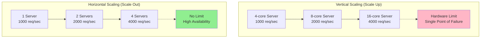
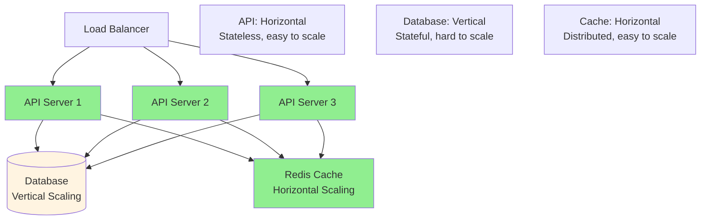
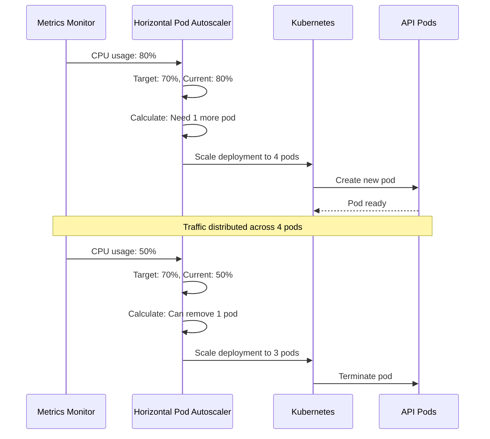
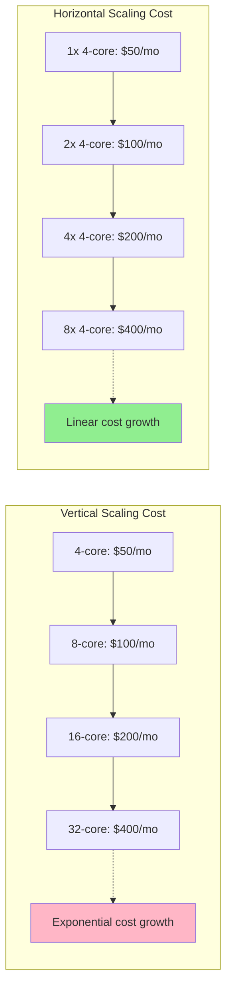

# Horizontal vs Vertical scaling

## 1. Why this exists (Real-world problem first)

Your API server has 4 CPU cores, handling 1000 requests/second. Traffic grows to 5000 req/sec. Server maxed out at 100% CPU. You upgrade to 16-core server (vertical scaling). Costs $500/month. Traffic grows to 20,000 req/sec. Upgrade to 64-core server? $2000/month. Single point of failure. The problem? Vertical scaling hits hardware limits and creates single points of failure, while horizontal scaling distributes load but adds complexity.

**Real production failures from wrong scaling choice:**

1. **The Vertical Scaling Ceiling**: SaaS platform starts with 8-core server. Traffic grows, upgrade to 16-core ($800/month). Traffic grows, upgrade to 32-core ($1600/month). Traffic grows, upgrade to 64-core ($3200/month). Traffic grows to 100K req/sec. No bigger server available. Hit hardware ceiling. Can't scale further. System crashes under load. $500K in lost revenue. Should have scaled horizontally from the start.

2. **The Horizontal Scaling Nightmare**: Startup with stateful sessions in memory. Scales horizontally to 10 servers. User logs in on Server 1. Next request goes to Server 2. Session not found. User logged out. Implements sticky sessions. Server 1 crashes. 1000 users lose sessions. Should have made services stateless or used shared session store before scaling horizontally.

3. **The Database Bottleneck**: E-commerce scales API servers horizontally to 50 instances. All connect to single MySQL database. Database becomes bottleneck. 50 servers, 1 database. Database CPU at 100%. API servers idle. Scaling API servers doesn't help. Should have scaled database (read replicas, sharding) or used vertical scaling for database.

4. **The Cost Explosion**: Company scales horizontally without optimization. 100 small servers ($10/month each = $1000/month). Each server 20% utilized. Could have used 20 larger servers ($50/month each = $1000/month) at 100% utilization. Same cost, better performance (less network overhead). Should have optimized before scaling.

**What breaks without proper scaling strategy:**
- Hit hardware limits with vertical scaling
- Single point of failure with vertical scaling
- Stateful apps break with horizontal scaling
- Don't understand when to use each approach
- Scale wrong component (API vs database)
- Cost explosion from inefficient scaling

## 2. Mental model (build imagination)

Think of scaling as **Restaurant Capacity**.

### The Restaurant Analogy

**Vertical Scaling (Bigger Kitchen)**:
- Small kitchen → Medium kitchen → Large kitchen
- Same chef, bigger equipment
- Faster cooking, more dishes
- Limit: Kitchen can only get so big
- Single point of failure: If kitchen breaks, restaurant closes

**Horizontal Scaling (More Restaurants)**:
- 1 restaurant → 2 restaurants → 10 restaurants
- Same kitchen size, more locations
- Distribute customers across locations
- No limit: Can always add more restaurants
- Resilient: If one restaurant closes, others continue

**The Flow:**

**Vertical Scaling:**
```
1000 req/sec → 4-core server (maxed out)
Upgrade to 8-core server
2000 req/sec → 8-core server (maxed out)
Upgrade to 16-core server
Eventually hit hardware limit
```

**Horizontal Scaling:**
```
1000 req/sec → 1 server (4-core)
2000 req/sec → 2 servers (4-core each)
4000 req/sec → 4 servers (4-core each)
No limit, can always add more servers
```

**Why this matters:**
- Vertical scaling is simple but limited
- Horizontal scaling is complex but unlimited
- Most systems need both approaches
- Different components scale differently

## 3. How Node.js implements this internally

### Vertical Scaling (Single Process, More Resources)

```javascript
// Single Node.js process using more CPU cores via worker threads
const { Worker } = require('worker_threads');
const os = require('os');

class VerticalScaling {
  constructor() {
    this.workers = [];
    const numCPUs = os.cpus().length;
    
    // Create worker threads to utilize all CPU cores
    for (let i = 0; i < numCPUs; i++) {
      const worker = new Worker('./worker.js');
      this.workers.push(worker);
    }
  }
  
  async processTask(task) {
    // Distribute tasks across worker threads
    const worker = this.workers[task.id % this.workers.length];
    
    return new Promise((resolve, reject) => {
      worker.once('message', resolve);
      worker.once('error', reject);
      worker.postMessage(task);
    });
  }
}

// worker.js
const { parentPort } = require('worker_threads');

parentPort.on('message', (task) => {
  // CPU-intensive work
  const result = processTask(task);
  parentPort.postMessage(result);
});
```

### Horizontal Scaling (Multiple Processes/Servers)

```javascript
// Node.js Cluster (multiple processes on same machine)
const cluster = require('cluster');
const os = require('os');
const express = require('express');

if (cluster.isMaster) {
  const numCPUs = os.cpus().length;
  
  console.log(`Master ${process.pid} starting ${numCPUs} workers`);
  
  // Fork workers (horizontal scaling on single machine)
  for (let i = 0; i < numCPUs; i++) {
    cluster.fork();
  }
  
  cluster.on('exit', (worker) => {
    console.log(`Worker ${worker.process.pid} died, restarting...`);
    cluster.fork();
  });
} else {
  // Worker process
  const app = express();
  
  app.get('/', (req, res) => {
    res.json({ worker: process.pid });
  });
  
  app.listen(3000);
}
```

### Horizontal Scaling (Multiple Servers)

```javascript
// Multiple servers behind load balancer
// Each server is independent, stateless

// server.js (runs on multiple machines)
const express = require('express');
const Redis = require('ioredis');
const app = express();

// Shared state via Redis (not in-memory)
const redis = new Redis({
  host: 'redis.example.com',
  port: 6379
});

// Stateless endpoint
app.get('/api/users/:id', async (req, res) => {
  // Check cache
  const cached = await redis.get(`user:${req.params.id}`);
  if (cached) {
    return res.json(JSON.parse(cached));
  }
  
  // Fetch from database
  const user = await db.users.findById(req.params.id);
  
  // Cache for 5 minutes
  await redis.setex(`user:${req.params.id}`, 300, JSON.stringify(user));
  
  res.json(user);
});

app.listen(3000);

// Deploy this same code to multiple servers
// Load balancer distributes traffic
```

### Hybrid Scaling (Vertical + Horizontal)

```javascript
// Vertical: Use all CPU cores on each server
// Horizontal: Run multiple servers

// Each server runs cluster
if (cluster.isMaster) {
  const numCPUs = os.cpus().length;
  for (let i = 0; i < numCPUs; i++) {
    cluster.fork();
  }
} else {
  const app = express();
  
  // Stateless, can scale horizontally
  app.get('/api/orders', async (req, res) => {
    const orders = await db.orders.find({ userId: req.user.id });
    res.json(orders);
  });
  
  app.listen(3000);
}

// Deploy to multiple servers (horizontal)
// Each server uses all cores (vertical)
```

### Auto-Scaling Configuration

```javascript
// Kubernetes Horizontal Pod Autoscaler
// Automatically adds/removes pods based on CPU

// deployment.yaml
apiVersion: apps/v1
kind: Deployment
metadata:
  name: api-server
spec:
  replicas: 3  # Start with 3 pods
  template:
    spec:
      containers:
      - name: api
        image: api-server:latest
        resources:
          requests:
            cpu: "500m"
            memory: "512Mi"
          limits:
            cpu: "1000m"
            memory: "1Gi"

---
apiVersion: autoscaling/v2
kind: HorizontalPodAutoscaler
metadata:
  name: api-server-hpa
spec:
  scaleTargetRef:
    apiVersion: apps/v1
    kind: Deployment
    name: api-server
  minReplicas: 3
  maxReplicas: 50
  metrics:
  - type: Resource
    resource:
      name: cpu
      target:
        type: Utilization
        averageUtilization: 70  # Scale when CPU > 70%
```

### Common Misunderstandings

**Mistake 1**: "Always scale horizontally"
- **Reality**: Some components (databases) scale better vertically
- **Impact**: Inefficient scaling, wasted resources

**Mistake 2**: "Vertical scaling is outdated"
- **Reality**: Vertical scaling is simpler, often better for databases
- **Impact**: Over-complicated architecture

**Mistake 3**: "Horizontal scaling solves all problems"
- **Reality**: Requires stateless design, adds complexity
- **Impact**: Stateful apps break when scaled horizontally

## 4. Multiple diagrams (MANDATORY)

### Diagram 1: Vertical vs Horizontal Scaling



### Diagram 2: Scaling Different Components



### Diagram 3: Auto-Scaling Flow



### Diagram 4: Cost Comparison



## 5. Where this is used in real projects

### API Server (Horizontal Scaling)

```javascript
// Stateless API server, easy to scale horizontally

const express = require('express');
const Redis = require('ioredis');
const app = express();

// Shared session store (not in-memory)
const redis = new Redis(process.env.REDIS_URL);

// Stateless authentication
app.use(async (req, res, next) => {
  const token = req.headers.authorization?.split(' ')[1];
  if (!token) return res.status(401).json({ error: 'Unauthorized' });
  
  // Verify JWT (stateless)
  const user = await verifyJWT(token);
  req.user = user;
  next();
});

// Stateless endpoint
app.get('/api/orders', async (req, res) => {
  const orders = await db.orders.find({ userId: req.user.id });
  res.json(orders);
});

app.listen(3000);

// Can run 100 instances of this server
// Load balancer distributes traffic
// No shared state between instances
```

### Database (Vertical Scaling + Read Replicas)

```javascript
// Primary database: Vertical scaling
// Read replicas: Horizontal scaling for reads

class DatabaseScaling {
  constructor() {
    // Primary (write): Vertical scaling
    this.primary = new Pool({
      host: 'primary-db.example.com',
      // Large instance: 32 cores, 128GB RAM
      max: 100 // Connection pool
    });
    
    // Read replicas: Horizontal scaling
    this.replicas = [
      new Pool({ host: 'replica1.example.com', max: 50 }),
      new Pool({ host: 'replica2.example.com', max: 50 }),
      new Pool({ host: 'replica3.example.com', max: 50 })
    ];
    
    this.replicaIndex = 0;
  }
  
  async write(query, params) {
    // All writes go to primary
    return await this.primary.query(query, params);
  }
  
  async read(query, params) {
    // Reads distributed across replicas (horizontal scaling)
    const replica = this.replicas[this.replicaIndex];
    this.replicaIndex = (this.replicaIndex + 1) % this.replicas.length;
    
    return await replica.query(query, params);
  }
}

// Usage
const db = new DatabaseScaling();

// Write to primary
await db.write('INSERT INTO orders ...', params);

// Read from replica
const orders = await db.read('SELECT * FROM orders WHERE ...', params);
```

### Worker Processes (Horizontal Scaling)

```javascript
// Background job workers: Easy to scale horizontally

const Queue = require('bull');
const emailQueue = new Queue('email', process.env.REDIS_URL);

// Worker process (can run many instances)
emailQueue.process(async (job) => {
  const { to, subject, body } = job.data;
  
  await sendEmail(to, subject, body);
  
  return { sent: true };
});

// Can run 50 worker instances
// Each processes jobs from shared queue
// Automatically distributes load
```

## 6. Where this should NOT be used

### Don't Scale Horizontally Without Stateless Design

```javascript
// WRONG: In-memory sessions with horizontal scaling
const sessions = new Map(); // In-memory

app.post('/login', (req, res) => {
  const sessionId = crypto.randomUUID();
  sessions.set(sessionId, { userId: req.body.userId });
  res.json({ sessionId });
});

// User logs in on Server 1
// Next request goes to Server 2
// Session not found!

// RIGHT: Shared session store
const redis = new Redis();

app.post('/login', async (req, res) => {
  const sessionId = crypto.randomUUID();
  await redis.set(`session:${sessionId}`, JSON.stringify({ userId: req.body.userId }));
  res.json({ sessionId });
});
```

### Don't Scale Vertically Beyond Cost-Effectiveness

```javascript
// WRONG: 128-core server for $5000/month
// Could use 10x 16-core servers for $2000/month

// RIGHT: Horizontal scaling for cost-effectiveness
```

## 7. Failure modes & edge cases

### Failure Mode 1: Database Bottleneck

**Scenario**: Scale API horizontally, database becomes bottleneck

```
1 API server → 1 Database (fine)
10 API servers → 1 Database (database maxed out)
100 API servers → 1 Database (database crashes)
```

**Solution**: Scale database (read replicas, sharding) or use caching

### Failure Mode 2: Session Loss on Scale-Down

**Scenario**: Auto-scaler removes pod with active sessions

```
3 pods running
CPU drops, auto-scaler removes 1 pod
Users on that pod lose sessions
```

**Solution**: Graceful shutdown, drain connections, external session store

### Failure Mode 3: Uneven Load Distribution

**Scenario**: Horizontal scaling but load not distributed evenly

```
3 servers
Server 1: 1000 req/sec
Server 2: 100 req/sec
Server 3: 100 req/sec
```

**Solution**: Better load balancing algorithm, health checks

## 8. Trade-offs & alternatives

### Vertical Scaling

**Gain**: Simple, no distributed system complexity, low latency
**Sacrifice**: Hardware limits, single point of failure, expensive at scale
**When**: Databases, stateful services, small to medium scale

### Horizontal Scaling

**Gain**: No limits, high availability, cost-effective at scale
**Sacrifice**: Requires stateless design, distributed system complexity
**When**: Stateless APIs, workers, large scale

### Hybrid (Vertical + Horizontal)

**Gain**: Best of both worlds, optimize each component
**Sacrifice**: More complex architecture
**When**: Most production systems

## 9. Interview-level articulation

**Q: "When would you use vertical vs horizontal scaling?"**

**A**: "I use vertical scaling for stateful components like databases where horizontal scaling is complex. For example, I'd scale a PostgreSQL primary database vertically to a larger instance with more CPU and RAM, because splitting a database across multiple servers (sharding) adds significant complexity. For stateless components like API servers, I use horizontal scaling—I can run 100 identical API server instances behind a load balancer with no shared state. For most systems, I use a hybrid approach: vertically scale the database and horizontally scale the API layer. I also consider cost—vertical scaling becomes exponentially expensive at large sizes, while horizontal scaling has linear cost growth."

**Q: "How do you make a service ready for horizontal scaling?"**

**A**: "I make services stateless by moving all state to external stores. Sessions go to Redis instead of in-memory. File uploads go to S3 instead of local disk. I use JWT for authentication so any server can verify tokens without shared state. I ensure all servers can connect to the same database and cache. I implement health checks so the load balancer knows which instances are healthy. I use environment variables for configuration so the same Docker image can run on any server. For background jobs, I use a shared queue like RabbitMQ or Redis so any worker can process any job. The key principle is: any server should be able to handle any request, and servers should be completely interchangeable."

## 10. Key takeaways (engineer mindset)

### What to Remember

1. **Vertical scaling**: Bigger server, simple, limited
2. **Horizontal scaling**: More servers, complex, unlimited
3. **Stateless required** for horizontal scaling
4. **Databases**: Usually vertical scaling
5. **APIs**: Usually horizontal scaling
6. **Hybrid approach** for most systems
7. **Auto-scaling**: Automatic horizontal scaling

### What Decisions This Enables

**Scaling decisions**:
- Which components to scale vertically vs horizontally
- When to invest in stateless design
- Database scaling strategy

**Cost decisions**:
- Vertical vs horizontal cost trade-offs
- When to optimize vs scale
- Resource utilization targets

**Architecture decisions**:
- Stateful vs stateless design
- Session management approach
- Deployment strategy

### How It Connects to Other Node.js Concepts

**Load Balancing** (Topic 33):
- Horizontal scaling requires load balancing
- Distributes traffic across instances

**Stateless Services** (Topic 35):
- Required for horizontal scaling
- External state stores

**Session Management** (Topic 40):
- Affects scaling strategy
- Shared session stores for horizontal scaling

### The Golden Rule

**Use vertical scaling for stateful components (databases), horizontal scaling for stateless components (APIs)**. Make services stateless by externalizing state (Redis for sessions, S3 for files, JWT for auth). Use hybrid approach: vertically scale database, horizontally scale API layer. Implement auto-scaling for automatic horizontal scaling based on CPU/memory. Optimize before scaling—don't scale inefficient code.
