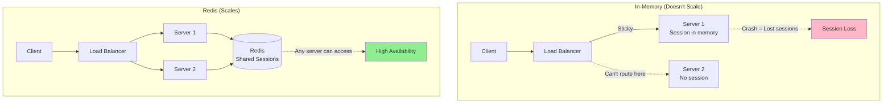
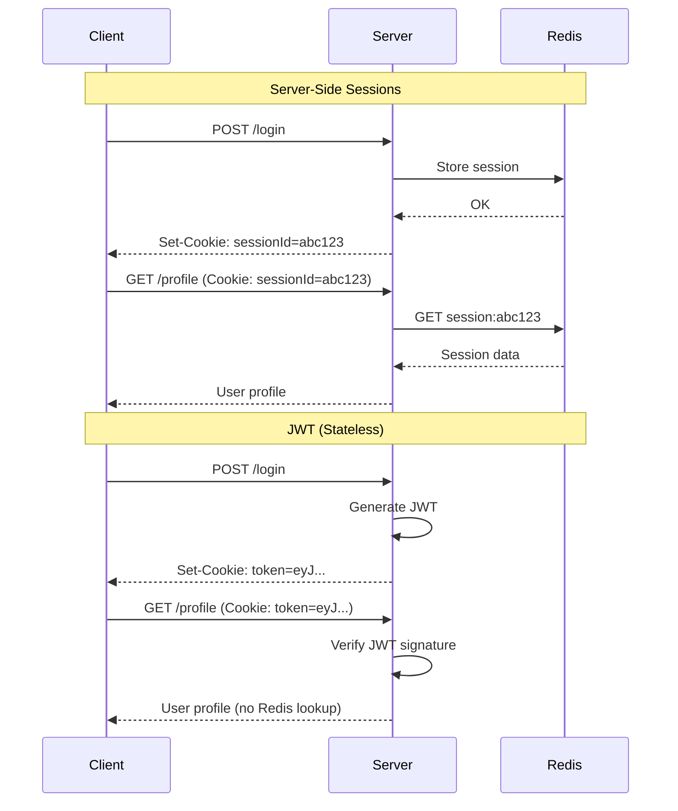
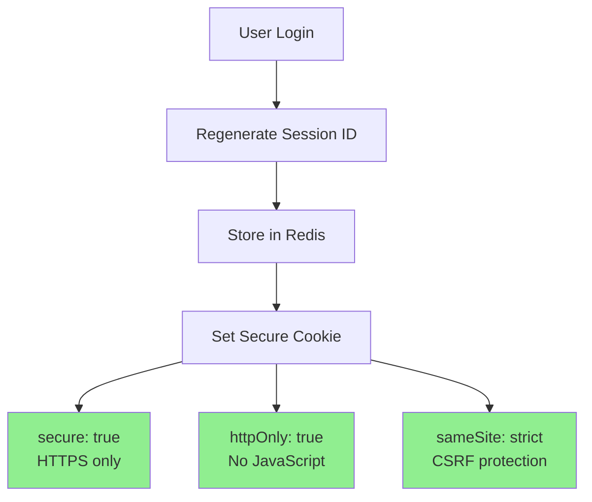
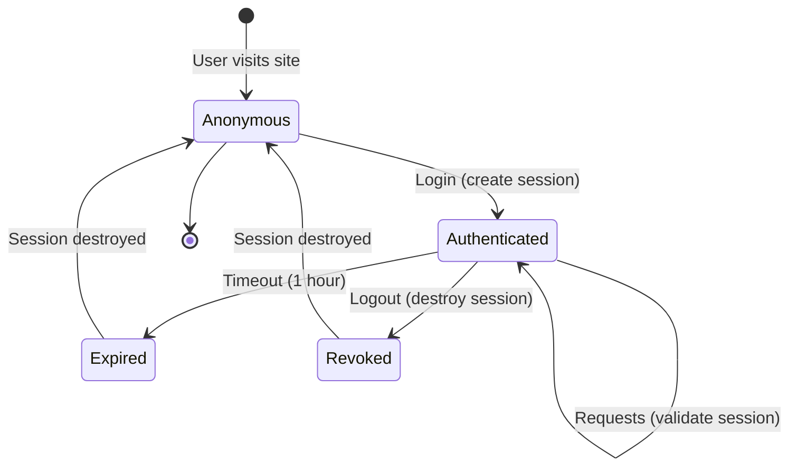

# Session management at scale

## 1. Why this exists (Real-world problem first)

Your web app stores sessions in memory. User logs in on Server 1. Load balancer routes next request to Server 2. Server 2 doesn't have session. User appears logged out. You implement sticky sessions. Server 1 crashes. 10,000 users lose sessions, must re-login. The problem? In-memory sessions don't scale horizontally, create single points of failure, and complicate deployments.

**Real production failures from poor session management:**

1. **The Deployment Session Loss**: SaaS platform stores sessions in memory. Rolling deployment restarts servers. Each restart loses all sessions. 50,000 users logged out during deployment. Support tickets flood in. Users abandon platform. $500K in lost revenue. Should have used external session store (Redis).

2. **The Sticky Session Disaster**: E-commerce uses sticky sessions (IP hash). Large office (5000 employees) behind single NAT IP. All 5000 users routed to Server 3. Server 3 crashes under load. Other 9 servers idle. 5000 users can't access site. Should have used shared session store, no sticky sessions needed.

3. **The Session Fixation Attack**: Banking app uses predictable session IDs. Attacker guesses session ID. Gains access to user account. Steals $100K. Should have used cryptographically secure random session IDs and regenerated on login.

4. **The Session Hijacking**: Session cookie sent over HTTP (not HTTPS). Attacker intercepts cookie on public WiFi. Hijacks user session. Accesses sensitive data. Should have used HTTPS-only, secure, httpOnly cookies.

**What breaks without proper session management:**
- Can't scale horizontally
- Deployments cause session loss
- Security vulnerabilities (fixation, hijacking)
- Don't understand session storage options
- Don't know how to secure sessions
- Can't handle server failures

## 2. Mental model (build imagination)

Think of session management as **Hotel Key Cards**.

### The Hotel Key Card Analogy

**In-Memory Sessions (Keys in Reception Desk)**:
- Guest checks in at Desk A
- Key stored at Desk A
- Guest returns, goes to Desk B
- Desk B doesn't have key
- Guest can't access room

**Shared Session Store (Central Key System)**:
- Guest checks in at any desk
- Key stored in central system
- Guest returns to any desk
- Any desk can access central system
- Guest gets room access

**JWT (Guest Carries Key)**:
- Guest checks in
- Given physical key (JWT)
- Guest carries key
- No need to check with desk
- Guest can access room directly

**The Flow:**

**In-Memory Sessions (Stateful):**
```
User logs in → Server 1 stores session in memory
Next request → Server 2 (no session) → User logged out
Problem: Can't scale horizontally
```

**Redis Sessions (Stateless):**
```
User logs in → Server 1 stores session in Redis
Next request → Server 2 reads session from Redis → User logged in
Solution: Any server can access session
```

**JWT (Stateless):**
```
User logs in → Server generates JWT → Sends to client
Next request → Client sends JWT → Any server verifies JWT → User logged in
Solution: No server-side storage needed
```

**Why this matters:**
- Enables horizontal scaling
- Survives server restarts
- No sticky sessions needed
- Simplifies deployments
- Improves security

## 3. How Node.js implements this internally

### In-Memory Sessions (Wrong for Scale)

```javascript
const express = require('express');
const session = require('express-session');
const app = express();

// In-memory session store (doesn't scale!)
app.use(session({
  secret: 'keyboard cat',
  resave: false,
  saveUninitialized: false,
  cookie: { secure: true, httpOnly: true, maxAge: 3600000 }
}));

app.post('/login', (req, res) => {
  req.session.userId = req.body.userId;
  res.json({ success: true });
});

app.get('/profile', (req, res) => {
  if (!req.session.userId) {
    return res.status(401).json({ error: 'Not logged in' });
  }
  res.json({ userId: req.session.userId });
});

// Problem: Sessions lost on restart
// Problem: Can't scale horizontally
```

### Redis Sessions (Right for Scale)

```javascript
const express = require('express');
const session = require('express-session');
const RedisStore = require('connect-redis')(session);
const Redis = require('ioredis');
const app = express();

const redis = new Redis({
  host: process.env.REDIS_HOST,
  port: 6379
});

// Redis session store (scales horizontally!)
app.use(session({
  store: new RedisStore({ client: redis }),
  secret: process.env.SESSION_SECRET,
  resave: false,
  saveUninitialized: false,
  cookie: {
    secure: true, // HTTPS only
    httpOnly: true, // No JavaScript access
    maxAge: 3600000, // 1 hour
    sameSite: 'strict' // CSRF protection
  }
}));

app.post('/login', async (req, res) => {
  const user = await authenticateUser(req.body);
  
  if (!user) {
    return res.status(401).json({ error: 'Invalid credentials' });
  }
  
  // Regenerate session ID (prevent fixation)
  req.session.regenerate((err) => {
    if (err) return res.status(500).json({ error: 'Session error' });
    
    req.session.userId = user.id;
    req.session.role = user.role;
    
    res.json({ success: true });
  });
});

app.get('/profile', (req, res) => {
  if (!req.session.userId) {
    return res.status(401).json({ error: 'Not logged in' });
  }
  
  res.json({
    userId: req.session.userId,
    role: req.session.role
  });
});

app.post('/logout', (req, res) => {
  req.session.destroy((err) => {
    if (err) return res.status(500).json({ error: 'Logout failed' });
    res.json({ success: true });
  });
});

// Benefits: Sessions survive restarts
// Benefits: Can scale horizontally
// Benefits: Any server can access sessions
```

### JWT-Based Sessions (Stateless)

```javascript
const jwt = require('jsonwebtoken');
const express = require('express');
const app = express();

const JWT_SECRET = process.env.JWT_SECRET;
const JWT_EXPIRY = '1h';

app.post('/login', async (req, res) => {
  const user = await authenticateUser(req.body);
  
  if (!user) {
    return res.status(401).json({ error: 'Invalid credentials' });
  }
  
  // Generate JWT
  const token = jwt.sign(
    {
      userId: user.id,
      role: user.role,
      email: user.email
    },
    JWT_SECRET,
    { expiresIn: JWT_EXPIRY }
  );
  
  // Send as httpOnly cookie
  res.cookie('token', token, {
    httpOnly: true,
    secure: true,
    sameSite: 'strict',
    maxAge: 3600000 // 1 hour
  });
  
  res.json({ success: true });
});

// Authentication middleware
const authenticate = (req, res, next) => {
  const token = req.cookies.token;
  
  if (!token) {
    return res.status(401).json({ error: 'Not logged in' });
  }
  
  try {
    const decoded = jwt.verify(token, JWT_SECRET);
    req.user = decoded;
    next();
  } catch (err) {
    res.status(401).json({ error: 'Invalid token' });
  }
};

app.get('/profile', authenticate, (req, res) => {
  res.json({
    userId: req.user.userId,
    role: req.user.role,
    email: req.user.email
  });
});

app.post('/logout', (req, res) => {
  res.clearCookie('token');
  res.json({ success: true });
});

// Benefits: No server-side storage
// Benefits: Truly stateless
// Drawback: Can't revoke before expiry
```

### Hybrid Approach (JWT + Redis Blacklist)

```javascript
class SessionManager {
  constructor(redis) {
    this.redis = redis;
  }
  
  async generateToken(user) {
    const token = jwt.sign(
      { userId: user.id, role: user.role },
      JWT_SECRET,
      { expiresIn: '1h' }
    );
    
    return token;
  }
  
  async verifyToken(token) {
    try {
      const decoded = jwt.verify(token, JWT_SECRET);
      
      // Check if token is blacklisted
      const blacklisted = await this.redis.get(`blacklist:${token}`);
      if (blacklisted) {
        throw new Error('Token revoked');
      }
      
      return decoded;
    } catch (err) {
      throw new Error('Invalid token');
    }
  }
  
  async revokeToken(token) {
    // Add to blacklist with expiry matching token expiry
    const decoded = jwt.decode(token);
    const ttl = decoded.exp - Math.floor(Date.now() / 1000);
    
    await this.redis.setex(`blacklist:${token}`, ttl, '1');
  }
}

// Usage
const sessionManager = new SessionManager(redis);

app.post('/login', async (req, res) => {
  const user = await authenticateUser(req.body);
  const token = await sessionManager.generateToken(user);
  
  res.cookie('token', token, {
    httpOnly: true,
    secure: true,
    sameSite: 'strict'
  });
  
  res.json({ success: true });
});

app.post('/logout', async (req, res) => {
  const token = req.cookies.token;
  
  // Revoke token
  await sessionManager.revokeToken(token);
  
  res.clearCookie('token');
  res.json({ success: true });
});
```

### Session Security Best Practices

```javascript
const session = require('express-session');
const RedisStore = require('connect-redis')(session);
const helmet = require('helmet');
const rateLimit = require('express-rate-limit');

app.use(helmet()); // Security headers

// Rate limit login attempts
const loginLimiter = rateLimit({
  windowMs: 15 * 60 * 1000, // 15 minutes
  max: 5, // 5 attempts
  message: 'Too many login attempts'
});

app.use(session({
  store: new RedisStore({ client: redis }),
  secret: process.env.SESSION_SECRET, // Strong secret
  resave: false,
  saveUninitialized: false,
  name: 'sessionId', // Don't use default 'connect.sid'
  cookie: {
    secure: true, // HTTPS only
    httpOnly: true, // No JavaScript access
    maxAge: 3600000, // 1 hour
    sameSite: 'strict', // CSRF protection
    domain: '.example.com' // Restrict domain
  }
}));

app.post('/login', loginLimiter, async (req, res) => {
  const user = await authenticateUser(req.body);
  
  if (!user) {
    return res.status(401).json({ error: 'Invalid credentials' });
  }
  
  // Regenerate session ID (prevent fixation)
  req.session.regenerate((err) => {
    if (err) return res.status(500).json({ error: 'Session error' });
    
    req.session.userId = user.id;
    req.session.role = user.role;
    req.session.loginTime = Date.now();
    
    res.json({ success: true });
  });
});

// Session timeout check
app.use((req, res, next) => {
  if (req.session.userId) {
    const sessionAge = Date.now() - req.session.loginTime;
    const maxAge = 3600000; // 1 hour
    
    if (sessionAge > maxAge) {
      req.session.destroy();
      return res.status(401).json({ error: 'Session expired' });
    }
  }
  next();
});
```

### Common Misunderstandings

**Mistake 1**: "JWT is always better than sessions"
- **Reality**: JWT can't be revoked, sessions can
- **Impact**: Can't logout users or revoke access

**Mistake 2**: "Storing JWT in localStorage is fine"
- **Reality**: localStorage accessible by JavaScript, vulnerable to XSS
- **Impact**: Session hijacking

**Mistake 3**: "Session cookies don't need HTTPS"
- **Reality**: Cookies sent over HTTP can be intercepted
- **Impact**: Session hijacking

## 4. Multiple diagrams (MANDATORY)

### Diagram 1: In-Memory vs Redis Sessions



### Diagram 2: Session vs JWT Flow



### Diagram 3: Session Security



### Diagram 4: Session Lifecycle



## 5. Where this is used in real projects

### E-Commerce Session Management

```javascript
const express = require('express');
const session = require('express-session');
const RedisStore = require('connect-redis')(session);
const Redis = require('ioredis');
const app = express();

const redis = new Redis(process.env.REDIS_URL);

app.use(session({
  store: new RedisStore({
    client: redis,
    prefix: 'sess:'
  }),
  secret: process.env.SESSION_SECRET,
  resave: false,
  saveUninitialized: false,
  cookie: {
    secure: process.env.NODE_ENV === 'production',
    httpOnly: true,
    maxAge: 24 * 60 * 60 * 1000, // 24 hours
    sameSite: 'lax' // Allow navigation from external sites
  }
}));

// Login
app.post('/api/login', async (req, res) => {
  const user = await db.users.findOne({ email: req.body.email });
  
  if (!user || !await bcrypt.compare(req.body.password, user.password)) {
    return res.status(401).json({ error: 'Invalid credentials' });
  }
  
  // Regenerate session
  req.session.regenerate((err) => {
    if (err) return res.status(500).json({ error: 'Session error' });
    
    req.session.userId = user.id;
    req.session.email = user.email;
    req.session.cart = []; // Initialize cart
    
    res.json({ success: true, user: { id: user.id, email: user.email } });
  });
});

// Add to cart (session-based)
app.post('/api/cart/add', (req, res) => {
  if (!req.session.userId) {
    return res.status(401).json({ error: 'Not logged in' });
  }
  
  req.session.cart = req.session.cart || [];
  req.session.cart.push(req.body.productId);
  
  res.json({ cart: req.session.cart });
});

// Checkout
app.post('/api/checkout', async (req, res) => {
  if (!req.session.userId) {
    return res.status(401).json({ error: 'Not logged in' });
  }
  
  const order = await db.orders.create({
    userId: req.session.userId,
    items: req.session.cart,
    total: req.body.total
  });
  
  // Clear cart after checkout
  req.session.cart = [];
  
  res.json({ orderId: order.id });
});

// Logout
app.post('/api/logout', (req, res) => {
  req.session.destroy((err) => {
    if (err) return res.status(500).json({ error: 'Logout failed' });
    res.clearCookie('connect.sid');
    res.json({ success: true });
  });
});
```

### API with JWT Authentication

```javascript
const jwt = require('jsonwebtoken');
const express = require('express');
const app = express();

const JWT_SECRET = process.env.JWT_SECRET;
const REFRESH_SECRET = process.env.REFRESH_SECRET;

// Generate access token (short-lived)
function generateAccessToken(user) {
  return jwt.sign(
    { userId: user.id, role: user.role },
    JWT_SECRET,
    { expiresIn: '15m' } // 15 minutes
  );
}

// Generate refresh token (long-lived)
function generateRefreshToken(user) {
  return jwt.sign(
    { userId: user.id },
    REFRESH_SECRET,
    { expiresIn: '7d' } // 7 days
  );
}

// Login
app.post('/api/login', async (req, res) => {
  const user = await authenticateUser(req.body);
  
  if (!user) {
    return res.status(401).json({ error: 'Invalid credentials' });
  }
  
  const accessToken = generateAccessToken(user);
  const refreshToken = generateRefreshToken(user);
  
  // Store refresh token in database
  await db.refreshTokens.create({
    userId: user.id,
    token: refreshToken,
    expiresAt: new Date(Date.now() + 7 * 24 * 60 * 60 * 1000)
  });
  
  res.json({
    accessToken,
    refreshToken
  });
});

// Refresh access token
app.post('/api/refresh', async (req, res) => {
  const { refreshToken } = req.body;
  
  try {
    const decoded = jwt.verify(refreshToken, REFRESH_SECRET);
    
    // Check if refresh token exists in database
    const storedToken = await db.refreshTokens.findOne({
      userId: decoded.userId,
      token: refreshToken
    });
    
    if (!storedToken) {
      return res.status(401).json({ error: 'Invalid refresh token' });
    }
    
    const user = await db.users.findById(decoded.userId);
    const accessToken = generateAccessToken(user);
    
    res.json({ accessToken });
  } catch (err) {
    res.status(401).json({ error: 'Invalid refresh token' });
  }
});

// Logout (revoke refresh token)
app.post('/api/logout', async (req, res) => {
  const { refreshToken } = req.body;
  
  await db.refreshTokens.deleteOne({ token: refreshToken });
  
  res.json({ success: true });
});
```

## 6. Where this should NOT be used

### Don't Use Sessions for APIs

```javascript
// WRONG: Server-side sessions for mobile API
// Mobile apps can't handle cookies well

// RIGHT: JWT for mobile APIs
```

### Don't Store Sensitive Data in JWT

```javascript
// WRONG: Store password in JWT
const token = jwt.sign({ password: user.password }, secret);

// RIGHT: Store only non-sensitive identifiers
const token = jwt.sign({ userId: user.id, role: user.role }, secret);
```

## 7. Failure modes & edge cases

### Failure Mode 1: Redis Failure

**Scenario**: Redis crashes, all sessions lost

```
Redis crashes
All users logged out
Must re-login
```

**Solution**: Redis cluster, session replication

### Failure Mode 2: Session Fixation

**Scenario**: Attacker sets session ID before login

```
Attacker sends victim link with sessionId=malicious
Victim logs in with that sessionId
Attacker uses same sessionId to access account
```

**Solution**: Regenerate session ID on login

### Failure Mode 3: JWT Revocation

**Scenario**: Need to logout user, but JWT can't be revoked

```
User logs out
JWT still valid for 1 hour
Attacker with stolen JWT has access
```

**Solution**: Short expiry + refresh tokens, or JWT blacklist

## 8. Trade-offs & alternatives

### Server-Side Sessions (Redis)

**Gain**: Can revoke, secure, server-controlled
**Sacrifice**: Redis dependency, network latency
**When**: Web apps, need revocation, sensitive data

### JWT

**Gain**: Stateless, no server storage, scalable
**Sacrifice**: Can't revoke, larger payload, XSS risk if in localStorage
**When**: APIs, microservices, mobile apps

### Hybrid (JWT + Blacklist)

**Gain**: Stateless + revocation capability
**Sacrifice**: Complexity, still need Redis for blacklist
**When**: Need both stateless and revocation

## 9. Interview-level articulation

**Q: "How would you implement session management for a scalable web application?"**

**A**: "I'd use Redis-based server-side sessions for horizontal scalability. When a user logs in, I regenerate the session ID to prevent fixation attacks, store the session in Redis with a 1-hour TTL, and send a secure, httpOnly, sameSite=strict cookie to the client. On subsequent requests, I read the session ID from the cookie, fetch the session from Redis, and validate it. For logout, I destroy the session in Redis. This approach allows any server to access the session, survives server restarts, and provides security through httpOnly cookies. For APIs or mobile apps, I'd use JWT with short-lived access tokens (15 minutes) and long-lived refresh tokens (7 days) stored in the database, allowing revocation while maintaining statelessness."

**Q: "What are the security considerations for session management?"**

**A**: "The main security concerns are session fixation, hijacking, and XSS. For fixation, I regenerate the session ID on login so attackers can't pre-set it. For hijacking, I use secure, httpOnly, sameSite=strict cookies—secure ensures HTTPS-only transmission, httpOnly prevents JavaScript access, and sameSite prevents CSRF. I also implement session timeouts (1 hour) and rate limiting on login (5 attempts per 15 minutes). For JWT, I never store tokens in localStorage due to XSS risk—I use httpOnly cookies instead. I also use strong, random secrets for signing, implement token expiry, and for sensitive operations, I require re-authentication even with valid sessions."

## 10. Key takeaways (engineer mindset)

### What to Remember

1. **Server-side sessions**: Redis for scalability
2. **JWT**: Stateless, can't revoke easily
3. **Secure cookies**: httpOnly, secure, sameSite
4. **Regenerate session ID**: On login (prevent fixation)
5. **Session timeout**: 1 hour for security
6. **Refresh tokens**: Long-lived, can revoke
7. **Rate limiting**: Prevent brute force

### What Decisions This Enables

**Session decisions**:
- Server-side vs JWT
- Session storage (Redis vs database)
- Session timeout duration

**Security decisions**:
- Cookie security attributes
- Token signing algorithm
- Revocation strategy

**Scalability decisions**:
- Horizontal scaling approach
- Session replication strategy
- Stateless vs stateful architecture

### How It Connects to Other Node.js Concepts

**Stateless Services** (Topic 35):
- External session store enables stateless services
- JWT provides true statelessness

**Horizontal Scaling** (Topic 34):
- Redis sessions enable horizontal scaling
- No sticky sessions needed

**Caching** (Topic 39):
- Session data can be cached
- Redis serves as both cache and session store

### The Golden Rule

**Use Redis-based sessions for web apps, JWT for APIs**. Store sessions in Redis with 1-hour TTL. Use secure, httpOnly, sameSite=strict cookies. Regenerate session ID on login. Implement session timeout. For APIs, use short-lived JWT access tokens (15 minutes) with long-lived refresh tokens (7 days). Never store JWT in localStorage. Rate limit login attempts. For sensitive operations, require re-authentication.
