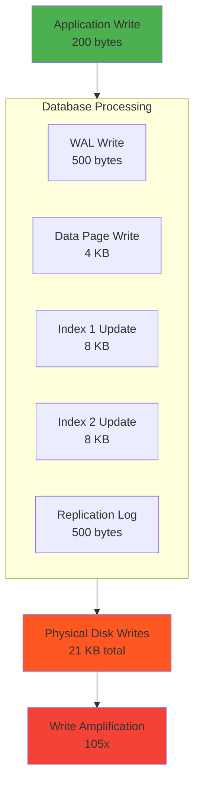
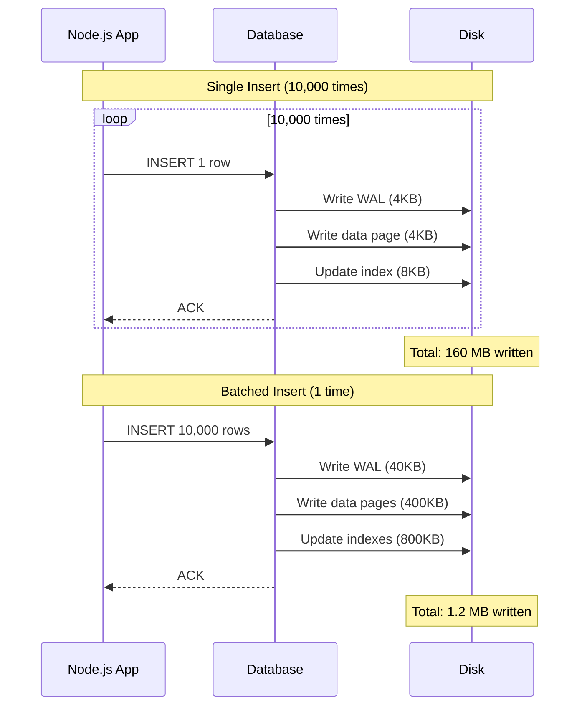
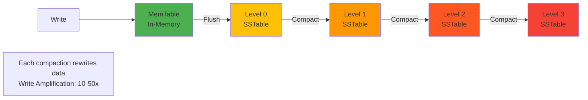
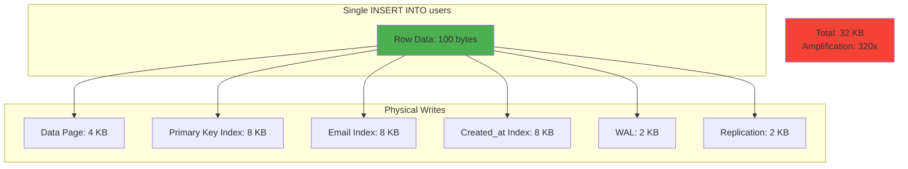

# Write amplification

## 1. Why this exists (Real-world problem first)

You're running a high-frequency trading platform. Every trade generates a single 200-byte record: `{tradeId, userId, symbol, price, quantity, timestamp}`. You're processing 100,000 trades per second.

What breaks:
- **Disk writes explode**: Each 200-byte insert triggers 4KB page writes (minimum disk block size), 16KB WAL writes, index updates (another 8KB per index), and replication logs. Your 20MB/s of logical writes become 400MB/s of physical writes.
- **SSD lifespan tanks**: SSDs have limited write cycles. Write amplification means you're burning through them 10x faster than expected.
- **Replication lag spikes**: Replicas can't keep up with the write volume because they're processing 20x more data than the application is generating.
- **Backup windows explode**: Daily backups that should take 1 hour now take 10 hours because the database is writing far more data than your application logic suggests.

Real pain: A logging service writes 1GB of application logs per day. But the database writes 50GB to disk due to indexes, WAL, and compaction. The disk fills up, the database crashes, and the team realizes they've been paying for 50x more storage than they thought they needed.

## 2. Mental model (build imagination)

Think of a notebook where you track daily expenses.

**Without amplification**: You write "Coffee: $5" (10 bytes). Done.

**With amplification**: 
1. You write "Coffee: $5" in the main log (10 bytes)
2. You update the "Total spent today" summary page (50 bytes)
3. You update the "Coffee expenses this month" index (30 bytes)
4. You write a backup copy to a separate notebook (10 bytes)
5. You write a change log: "At 2pm, added coffee expense" (40 bytes)

Your 10-byte write became 140 bytes of actual writing. **Write amplification factor: 14x**.

In databases:
- **Logical write**: What your application writes (`INSERT INTO logs VALUES (...)`)
- **Physical write**: What actually hits the disk (data pages, indexes, WAL, compaction)

The ratio is write amplification.

## 3. How Node.js implements this internally

Node.js doesn't cause write amplification—the database and storage layer do. But your Node.js code can **trigger** it.

### Example: Bulk insert without batching

```javascript
// BAD: 10,000 individual inserts
for (let i = 0; i < 10000; i++) {
  await pool.query('INSERT INTO logs (message) VALUES ($1)', [`Log ${i}`]);
}
// Each insert: 1 WAL write, 1 data page write, 1 index update
// Total: 30,000 disk writes
```

**What happens**:
1. Each `INSERT` is a separate transaction
2. PostgreSQL writes to WAL (Write-Ahead Log) for durability
3. Updates the data page (4KB minimum, even for 50-byte row)
4. Updates indexes (B-tree node splits, rebalancing)
5. Flushes to disk (fsync) for each transaction

**Event loop impact**: Each `await` is a round trip to the database. 10,000 inserts = 10,000 async operations, blocking the event loop from processing other requests.

### Better: Batched insert

```javascript
// GOOD: Single batch insert
const values = Array.from({ length: 10000 }, (_, i) => `Log ${i}`);
await pool.query(
  'INSERT INTO logs (message) VALUES ' + values.map((_, i) => `($${i + 1})`).join(','),
  values
);
// Single transaction: 1 WAL write, fewer page writes, fewer index updates
// Total: ~100 disk writes (100x reduction)
```

**Why it's better**:
- Single transaction = one WAL flush
- Database can batch page writes
- Indexes updated in bulk (fewer B-tree splits)

### Node.js-specific consideration: Streaming writes

```javascript
const { pipeline } = require('stream');
const { from } = require('pg-copy-streams');

// Stream 1 million rows without loading into memory
const stream = pool.query(from('COPY logs (message) FROM STDIN'));
pipeline(
  createReadStream('logs.csv'),
  stream,
  (err) => {
    if (err) console.error('Copy failed', err);
    else console.log('Copy complete');
  }
);
```

**Why this matters**: `COPY` bypasses WAL for bulk loads, reducing write amplification by 10x.

## 4. Multiple diagrams (MANDATORY)

### Write amplification layers



### Single vs batched insert



### LSM-tree compaction (write amplification in NoSQL)



### Index overhead visualization



## 5. Where this is used in real projects

### High-frequency logging
```javascript
// BAD: Write every log immediately
app.use((req, res, next) => {
  pool.query('INSERT INTO access_logs (url, method, ip) VALUES ($1, $2, $3)', 
    [req.url, req.method, req.ip]);
  next();
});
// 1000 req/s = 1000 inserts/s = massive write amplification

// GOOD: Batch logs every second
const logBuffer = [];
app.use((req, res, next) => {
  logBuffer.push({ url: req.url, method: req.method, ip: req.ip });
  next();
});

setInterval(async () => {
  if (logBuffer.length === 0) return;
  const batch = logBuffer.splice(0, logBuffer.length);
  const values = batch.flatMap(log => [log.url, log.method, log.ip]);
  await pool.query(
    `INSERT INTO access_logs (url, method, ip) VALUES ${batch.map((_, i) => `($${i*3+1}, $${i*3+2}, $${i*3+3})`).join(',')}`,
    values
  );
}, 1000);
// 1000 req/s = 1 insert/s with 1000 rows = 1000x less write amplification
```

### Time-series data (metrics, events)
```javascript
// Use TimescaleDB or InfluxDB (optimized for time-series, low write amplification)
// Or batch inserts and use partitioning
await pool.query(`
  INSERT INTO metrics (timestamp, metric_name, value)
  SELECT * FROM unnest($1::timestamp[], $2::text[], $3::float[])
`, [timestamps, names, values]);
```

### Audit logs (append-only)
```javascript
// Disable indexes on append-only tables
await pool.query(`
  CREATE TABLE audit_logs (
    id SERIAL PRIMARY KEY,
    user_id INT,
    action TEXT,
    created_at TIMESTAMP DEFAULT NOW()
  );
  -- No secondary indexes = no index write amplification
`);
```

### Decision criteria
- **Batch writes whenever possible**: Reduces WAL flushes and index updates
- **Minimize indexes**: Each index multiplies write amplification
- **Use append-only tables**: No updates = no old version cleanup
- **Partition large tables**: Smaller indexes = less amplification per write

## 6. Where this should NOT be used

### Batching critical writes
```javascript
// BAD: Batching payment transactions
const paymentBuffer = [];
app.post('/payment', (req, res) => {
  paymentBuffer.push(req.body);
  res.json({ status: 'queued' }); // User thinks payment succeeded
});

setInterval(async () => {
  await pool.query('INSERT INTO payments ...', paymentBuffer);
  paymentBuffer.length = 0;
}, 5000);
// If server crashes before flush, payments are lost
```

**Solution**: Batch non-critical writes (logs, analytics), but write critical data immediately.

### Over-indexing
```javascript
// BAD: Index everything "just in case"
CREATE INDEX idx_users_email ON users(email);
CREATE INDEX idx_users_name ON users(name);
CREATE INDEX idx_users_created_at ON users(created_at);
CREATE INDEX idx_users_updated_at ON users(updated_at);
CREATE INDEX idx_users_last_login ON users(last_login);
// Every INSERT updates 6 indexes = 6x write amplification
```

**Solution**: Index only what you query. Use `EXPLAIN ANALYZE` to verify index usage.

### Using databases for high-frequency writes
```javascript
// BAD: Writing sensor data (1000 writes/sec) to PostgreSQL
setInterval(() => {
  pool.query('INSERT INTO sensor_data (temp, humidity) VALUES ($1, $2)', [temp, humidity]);
}, 1);
```

**Solution**: Use time-series databases (InfluxDB, TimescaleDB) or message queues (Kafka) designed for high write throughput.

## 7. Failure modes & edge cases

### Index bloat
**Scenario**: You have a `users` table with 10 million rows and 5 indexes. Every update rewrites the row and updates all indexes.

**Impact**: Indexes grow to 10x the size of the table. Queries slow down, disk fills up.

**Detection**: 
```sql
SELECT schemaname, tablename, pg_size_pretty(pg_total_relation_size(schemaname||'.'||tablename)) AS size
FROM pg_tables
ORDER BY pg_total_relation_size(schemaname||'.'||tablename) DESC;
```

**Mitigation**: `REINDEX` periodically, or use `pg_repack` to rebuild without downtime.

### WAL explosion
**Scenario**: Bulk update of 100 million rows. WAL grows from 1GB to 500GB.

**Impact**: Disk fills up, database crashes, replication lag spikes.

**Solution**: 
- Increase `max_wal_size`
- Batch updates into smaller transactions
- Use `COPY` for bulk loads

### Compaction storms (LSM-tree databases)
**Scenario**: You write 1TB of data to Cassandra. Background compaction kicks in, rewriting 10TB of data.

**Impact**: Disk I/O saturates, read latency spikes, writes are throttled.

**Solution**: Tune compaction strategy (`LeveledCompactionStrategy` vs `SizeTieredCompactionStrategy`), or use time-windowed compaction for time-series data.

### Replication lag from write amplification
**Scenario**: Primary writes 100MB/s logically, but 2GB/s physically. Replica can't keep up.

**Impact**: Replica falls hours behind, read queries return stale data.

**Solution**: Reduce write amplification (fewer indexes, batching), or scale replicas vertically.

## 8. Trade-offs & alternatives

### What you gain by reducing write amplification
- **Lower disk I/O**: Faster writes, longer SSD lifespan
- **Reduced replication lag**: Replicas can keep up
- **Lower costs**: Less disk space, fewer IOPS

### What you sacrifice
- **Query performance**: Fewer indexes = slower reads
- **Durability**: Batching writes risks data loss on crash (unless using WAL)
- **Complexity**: Batching logic, buffer management, error handling

### Alternatives

**Use append-only storage (S3, object storage)**
- **Use case**: Logs, events, immutable data
- **Benefit**: No write amplification (no indexes, no updates)
- **Trade-off**: Can't query efficiently, need ETL to load into a database

**Use LSM-tree databases (Cassandra, RocksDB)**
- **Use case**: High write throughput, can tolerate eventual consistency
- **Benefit**: Optimized for writes (sequential writes, batched compaction)
- **Trade-off**: Higher read latency, compaction overhead

**Use in-memory databases (Redis)**
- **Use case**: Temporary data, caches, session storage
- **Benefit**: No disk writes = no amplification
- **Trade-off**: Data lost on crash (unless using AOF/RDB persistence, which has its own amplification)

**Use time-series databases (InfluxDB, TimescaleDB)**
- **Use case**: Metrics, logs, events
- **Benefit**: Optimized for time-series writes (compression, downsampling)
- **Trade-off**: Limited query flexibility

## 9. Interview-level articulation

**Question**: "What is write amplification and why does it matter?"

**Weak answer**: "It's when the database writes more data than you tell it to."

**Strong answer**: "Write amplification is the ratio of physical writes to logical writes. If I insert a 100-byte row, but the database writes 10KB to disk (data pages, WAL, indexes, replication logs), the amplification factor is 100x. It matters because it directly impacts disk I/O, SSD lifespan, replication lag, and costs. In production, I've seen write amplification cause disk exhaustion, replica lag spikes, and even database crashes. The key is to minimize it through batching, reducing indexes, using append-only tables, and choosing the right storage engine for your workload."

**Follow-up**: "How do you reduce write amplification?"

**Answer**: "First, batch writes. Instead of 1000 individual inserts, do one insert with 1000 rows. This reduces WAL flushes and index updates. Second, minimize indexes—each index multiplies write amplification. Use `EXPLAIN ANALYZE` to verify you're actually using them. Third, use append-only tables for logs and events—no updates means no old version cleanup. Fourth, choose the right database: LSM-tree databases like Cassandra are optimized for writes, while B-tree databases like PostgreSQL are better for reads. Finally, use `COPY` for bulk loads—it bypasses WAL and is 10x faster than inserts."

**Follow-up**: "What's the trade-off of batching writes?"

**Answer**: "Batching improves throughput but increases latency and risk. If I batch 1000 writes every second, the average write waits 500ms before being flushed. For logs or analytics, that's fine. For payments or critical data, it's unacceptable—if the server crashes before the flush, you lose data. The solution is to batch non-critical writes and write critical data immediately, or use a durable queue like Kafka to buffer writes safely."

## 10. Key takeaways (engineer mindset)

**What to remember**:
- **Write amplification is invisible but expensive**. Your 1GB of logical writes might be 50GB of physical writes.
- **Indexes are the biggest culprit**. Each index multiplies write amplification.
- **Batching is the easiest win**. Batch writes whenever durability allows.
- **Choose the right database**. LSM-tree for writes, B-tree for reads.

**What decisions this enables**:
- Choosing between PostgreSQL (B-tree) and Cassandra (LSM-tree)
- Deciding how many indexes to create (read performance vs write cost)
- Designing batching strategies for high-throughput writes
- Estimating disk I/O and storage costs based on write patterns

**How it connects to other Node.js concepts**:
- **Backpressure**: If writes are too fast, buffer them and apply backpressure to upstream
- **Event loop**: Batching reduces async operations, freeing the event loop
- **Observability**: Monitor disk I/O, WAL size, and index bloat to detect amplification
- **Graceful shutdown**: Flush buffered writes before process exit to avoid data loss
