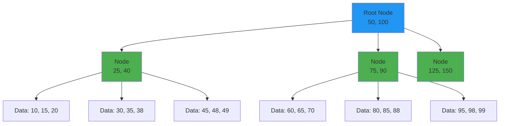
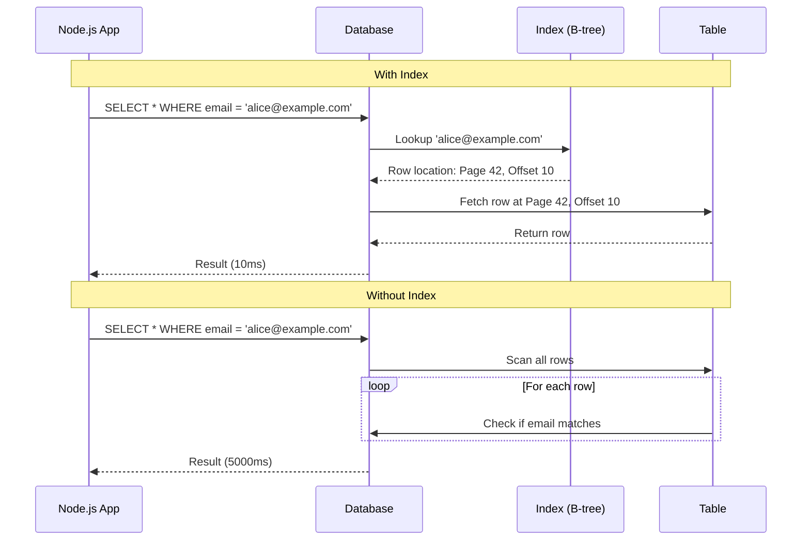
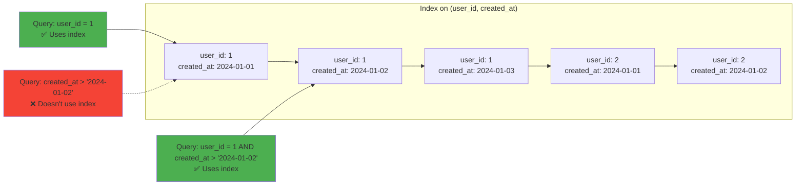
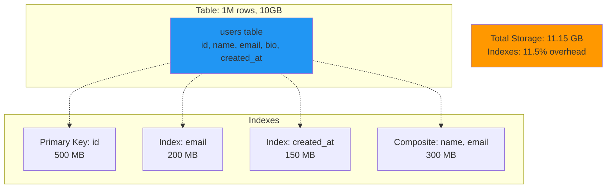

# Indexing strategy

## 1. Why this exists (Real-world problem first)

You're running an e-commerce platform with 10 million products. A user searches for "wireless headphones under $100". Without indexes, the database scans all 10 million rows, filtering by name and price. The query takes 45 seconds. Users abandon the search.

What breaks:
- **Full table scans kill performance**: Every query reads every row, even if only 10 match
- **Slow writes from over-indexing**: You add 10 indexes to speed up reads, but now every product insert updates 10 indexes, taking 500ms instead of 50ms
- **Index bloat**: Indexes grow larger than the table itself, consuming disk space and slowing queries
- **Wrong index chosen**: You have indexes on `(name)` and `(price)`, but the query needs `(name, price)`. The database picks one, scans half the table anyway.

Real pain: A SaaS analytics platform has a `events` table with 1 billion rows. Queries like `SELECT * FROM events WHERE user_id = 123 AND created_at > '2024-01-01'` take 30 seconds. The team adds an index on `user_id`, but it doesn't help—the database still scans millions of rows per user. They needed a composite index on `(user_id, created_at)`.

## 2. Mental model (build imagination)

Think of a library with 1 million books.

**No index**: To find "Harry Potter", you check every shelf, every book. Takes days.

**Index on title**: The library has a card catalog sorted by title. You look up "Harry Potter", find the shelf number, go directly there. Takes minutes.

**Composite index on (author, title)**: The catalog is sorted first by author, then by title. To find "J.K. Rowling's Harry Potter", you jump to the Rowling section, then scan titles. Even faster.

**Wrong index**: The catalog is sorted by publication year. To find "Harry Potter", you still have to scan thousands of books from the same year. Useless.

In databases:
- **Index**: A sorted data structure (B-tree, hash table) that maps column values to row locations
- **Composite index**: An index on multiple columns, sorted by the first column, then the second, etc.
- **Covering index**: An index that includes all columns needed by the query, so the database never touches the table

## 3. How Node.js implements this internally

Node.js doesn't implement indexes—the database does. But your Node.js code determines **which indexes are used**.

### Query execution flow

```javascript
// Query: Find users by email
const result = await pool.query('SELECT * FROM users WHERE email = $1', ['alice@example.com']);
```

**What happens**:
1. **Query planner**: Database analyzes the query, checks available indexes
2. **Index scan**: If an index on `email` exists, the database uses it to find the row location (O(log n))
3. **Table lookup**: Database fetches the row from the table using the location
4. **Return result**: Rows are sent back to Node.js

**Without index**:
1. **Sequential scan**: Database reads every row in the table (O(n))
2. **Filter**: Checks if `email = 'alice@example.com'` for each row
3. **Return result**: Much slower

**Node.js impact**: Slow queries block connections in the pool. If your pool size is 10 and a query takes 10 seconds, only 1 query/second throughput.

### Common mistake: N+1 queries

```javascript
// BAD: N+1 queries without proper indexes
const users = await pool.query('SELECT * FROM users');
for (const user of users.rows) {
  const orders = await pool.query('SELECT * FROM orders WHERE user_id = $1', [user.id]);
  // If no index on orders(user_id), each query scans the entire orders table
}
```

**Solution**: Add index on `orders(user_id)`, or use a JOIN to fetch everything in one query.

## 4. Multiple diagrams (MANDATORY)

### B-tree index structure



### Query execution with and without index



### Composite index column order



### Index vs table size



## 5. Where this is used in real projects

### API endpoints with filters
```javascript
// Query: Search products by category and price range
app.get('/products', async (req, res) => {
  const { category, minPrice, maxPrice } = req.query;
  const result = await pool.query(`
    SELECT * FROM products
    WHERE category = $1 AND price BETWEEN $2 AND $3
    ORDER BY price ASC
  `, [category, minPrice, maxPrice]);
  res.json(result.rows);
});

// Required index: (category, price)
// CREATE INDEX idx_products_category_price ON products(category, price);
```

### User authentication
```javascript
// Query: Find user by email
app.post('/login', async (req, res) => {
  const user = await pool.query('SELECT * FROM users WHERE email = $1', [req.body.email]);
  // ...
});

// Required index: (email) - UNIQUE
// CREATE UNIQUE INDEX idx_users_email ON users(email);
```

### Time-series queries
```javascript
// Query: Get events in the last 24 hours for a user
app.get('/events/:userId', async (req, res) => {
  const events = await pool.query(`
    SELECT * FROM events
    WHERE user_id = $1 AND created_at > NOW() - INTERVAL '24 hours'
    ORDER BY created_at DESC
  `, [req.params.userId]);
  res.json(events.rows);
});

// Required index: (user_id, created_at)
// CREATE INDEX idx_events_user_time ON events(user_id, created_at DESC);
```

### Decision criteria
- **Index columns used in WHERE, JOIN, ORDER BY**
- **Composite index order**: Most selective column first (or match query filter order)
- **Covering indexes**: Include SELECT columns to avoid table lookups
- **Partial indexes**: Index only a subset of rows (e.g., `WHERE status = 'active'`)

## 6. Where this should NOT be used

### Over-indexing small tables
```sql
-- BAD: Indexing a table with 100 rows
CREATE INDEX idx_config_key ON config(key);
-- Sequential scan of 100 rows is faster than index lookup
```

**Rule of thumb**: Don't index tables with < 1000 rows unless you have a specific performance issue.

### Indexing low-cardinality columns
```sql
-- BAD: Index on boolean column
CREATE INDEX idx_users_active ON users(is_active);
-- Only 2 distinct values (true/false), index is useless
```

**Exception**: Partial index if you only query one value frequently.
```sql
-- GOOD: Partial index for active users
CREATE INDEX idx_users_active ON users(is_active) WHERE is_active = true;
```

### Indexing columns that are never queried
```sql
-- BAD: "Just in case" indexes
CREATE INDEX idx_users_bio ON users(bio); -- Never used in WHERE clauses
```

**Solution**: Use `EXPLAIN ANALYZE` to verify index usage. Drop unused indexes.

### Indexing write-heavy tables
```javascript
// BAD: 10 indexes on a table with 1000 writes/sec
// Every write updates 10 indexes = 10x write amplification
```

**Solution**: Balance read performance vs write cost. For write-heavy tables, minimize indexes.

## 7. Failure modes & edge cases

### Index not used (wrong column order)
**Scenario**: Composite index on `(user_id, created_at)`, but query filters only by `created_at`.

```sql
-- Index NOT used
SELECT * FROM events WHERE created_at > '2024-01-01';
```

**Why**: Composite indexes are sorted by the first column, then the second. Querying only the second column can't use the index.

**Solution**: Create a separate index on `created_at`, or reorder the composite index (if `user_id` queries are rare).

### Index bloat
**Scenario**: Table has 1 million rows, but index has 10 million entries due to updates and deletes.

**Impact**: Queries slow down, disk space wasted.

**Detection**:
```sql
SELECT schemaname, tablename, indexname, pg_size_pretty(pg_relation_size(indexrelid))
FROM pg_stat_user_indexes
ORDER BY pg_relation_size(indexrelid) DESC;
```

**Solution**: `REINDEX` or `VACUUM FULL`.

### Planner chooses wrong index
**Scenario**: You have indexes on `(user_id)` and `(created_at)`. Query filters both, but planner picks `(user_id)` and scans 1 million rows.

**Why**: Outdated statistics, or planner thinks `(user_id)` is more selective.

**Solution**: Run `ANALYZE` to update statistics, or use `SET enable_seqscan = off;` to force index usage (testing only).

### Covering index not covering
**Scenario**: You create a covering index `(user_id, created_at, status)`, but query selects `email` too.

```sql
SELECT email FROM events WHERE user_id = 1 AND created_at > '2024-01-01';
-- Index can't cover 'email', so database still hits the table
```

**Solution**: Add `email` to the index, or accept the table lookup.

## 8. Trade-offs & alternatives

### What you gain
- **Massive query speedup**: O(log n) instead of O(n)
- **Reduced disk I/O**: Index fits in memory, table doesn't
- **Enforced uniqueness**: `UNIQUE` indexes prevent duplicates

### What you sacrifice
- **Write performance**: Every insert/update/delete updates all indexes
- **Disk space**: Indexes can be 10-50% of table size
- **Maintenance overhead**: Indexes need vacuuming, reindexing, monitoring

### Alternatives

**Materialized views**
- **Use case**: Complex aggregations (e.g., daily sales totals)
- **Benefit**: Pre-computed results, no query-time computation
- **Trade-off**: Staleness, refresh overhead

**Denormalization**
- **Use case**: Avoid joins by duplicating data
- **Benefit**: Faster reads, no join overhead
- **Trade-off**: Data duplication, update complexity

**Caching (Redis)**
- **Use case**: Frequently accessed data
- **Benefit**: Sub-millisecond latency
- **Trade-off**: Cache invalidation, memory cost

**Full-text search (Elasticsearch)**
- **Use case**: Text search, fuzzy matching
- **Benefit**: Optimized for search, supports ranking
- **Trade-off**: Eventual consistency, operational complexity

## 9. Interview-level articulation

**Question**: "How do you decide which columns to index?"

**Weak answer**: "Index columns used in WHERE clauses."

**Strong answer**: "I start by identifying the most common queries using slow query logs or APM tools. Then I look for columns used in WHERE, JOIN, and ORDER BY clauses. For each, I check cardinality—high cardinality columns (e.g., email, user_id) benefit from indexes, low cardinality columns (e.g., boolean flags) don't. I also consider composite indexes for multi-column filters, ensuring the column order matches the query pattern. Finally, I balance read performance against write cost—if a table has heavy writes, I minimize indexes to avoid write amplification. I verify with `EXPLAIN ANALYZE` and monitor index usage with `pg_stat_user_indexes` to drop unused indexes."

**Follow-up**: "What's the difference between a composite index on (A, B) and two separate indexes on A and B?"

**Answer**: "A composite index on (A, B) is sorted first by A, then by B. It's efficient for queries filtering both A and B, or just A alone. But it can't help queries filtering only B. Two separate indexes on A and B allow the database to use either independently, but combining them (index merge) is slower than a single composite index. The rule is: if you frequently query both columns together, use a composite index. If you query them independently, use separate indexes. Column order matters—put the most selective column first, or match the query filter order."

**Follow-up**: "How do you handle index bloat?"

**Answer**: "Index bloat happens when updates and deletes leave dead entries in the index. I detect it by comparing index size to table size using `pg_relation_size`. If an index is 2x the size of the table, it's bloated. To fix it, I run `REINDEX` to rebuild the index, or `VACUUM FULL` to reclaim space (requires a table lock, so I do it during maintenance windows). For zero-downtime, I use `pg_repack`. To prevent bloat, I tune autovacuum settings and avoid excessive updates on indexed columns."

## 10. Key takeaways (engineer mindset)

**What to remember**:
- **Index columns you query, not columns you store**
- **Composite index order matters**: (A, B) ≠ (B, A)
- **Indexes speed up reads but slow down writes**—balance is key
- **Verify with `EXPLAIN ANALYZE`**, don't guess

**What decisions this enables**:
- Choosing between single-column and composite indexes
- Deciding when to denormalize vs index
- Balancing read performance vs write cost
- Identifying and fixing slow queries

**How it connects to other Node.js concepts**:
- **Connection pooling**: Slow queries hold connections longer, exhausting the pool
- **Backpressure**: If queries are slow, requests queue up—indexes reduce query time
- **Observability**: Monitor slow queries, index usage, and bloat
- **Graceful degradation**: If indexes are missing, queries slow down but don't fail—add indexes incrementally
