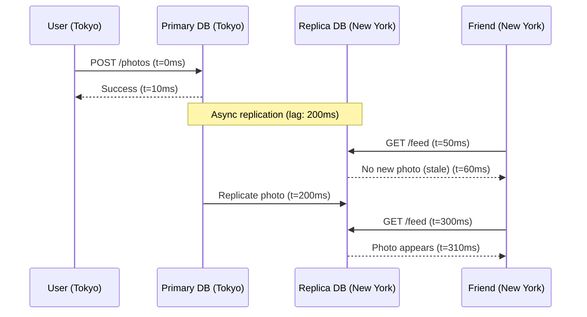
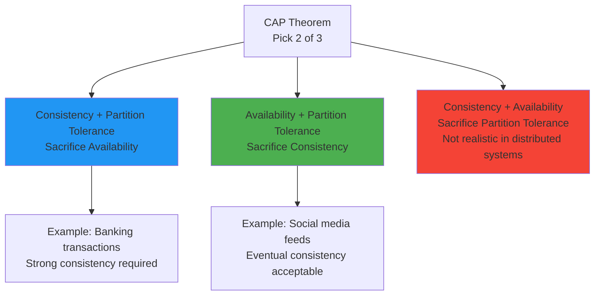
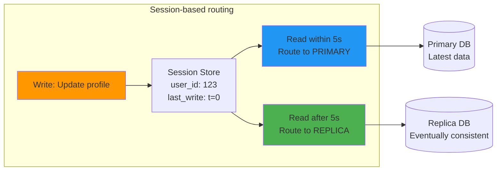
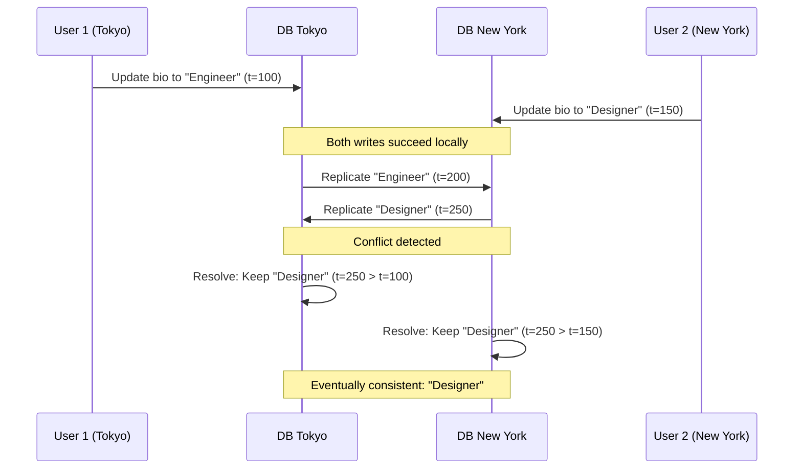

# Eventual consistency

## 1. Why this exists (Real-world problem first)

You're running a global social media platform. A user in Tokyo posts a photo. Their friend in New York refreshes the feed 100ms later and doesn't see it. They refresh again 2 seconds later—now it appears.

What breaks without eventual consistency:
- **Global synchronous replication is impossible**: To guarantee immediate consistency across Tokyo, New York, and London datacenters, every write must wait for all replicas to acknowledge. At the speed of light, Tokyo↔New York is 70ms minimum. Add network overhead, and you're looking at 200ms+ per write.
- **Availability suffers**: If the New York datacenter goes down, Tokyo users can't post (because writes must replicate to all regions). The system is unavailable.
- **Throughput collapses**: Synchronous replication means writes are serialized across the globe. You can't scale write throughput horizontally.

Real pain: A fintech company tried to maintain strong consistency across US and EU databases for compliance. Every transaction waited for cross-Atlantic replication (150ms). During peak hours, transaction throughput dropped from 10,000/sec to 500/sec. They switched to eventual consistency for non-critical data and kept strong consistency only for account balances.

## 2. Mental model (build imagination)

Think of a company with offices in New York, London, and Tokyo. Each office has a local copy of the employee directory.

**Strong consistency**: Every time someone updates their phone number, all three offices must update their directories simultaneously. If London's internet is down, no one can update their phone number anywhere. Updates are slow (wait for all offices), but everyone always sees the same data.

**Eventual consistency**: When someone updates their phone number in New York, the update is saved locally immediately. New York then sends the update to London and Tokyo asynchronously. For a few seconds, the directories are out of sync. Eventually (within seconds or minutes), all offices have the same data.

**Key insight**: You trade immediate consistency for availability and performance. Most of the time, the data is consistent. During the brief inconsistency window, users might see stale data.

## 3. How Node.js implements this internally

Node.js doesn't enforce consistency models—the database and application logic do. But your Node.js code must **handle** eventual consistency.

### Example: Read-after-write with replicas

```javascript
const primaryPool = new Pool({ host: 'primary.db.com' });
const replicaPool = new Pool({ host: 'replica.db.com' });

// Write to primary
async function updateUserProfile(userId, newBio) {
  await primaryPool.query('UPDATE users SET bio = $1 WHERE id = $2', [newBio, userId]);
}

// Read from replica
async function getUserProfile(userId) {
  return replicaPool.query('SELECT * FROM users WHERE id = $1', [userId]);
}

// PROBLEM: Read-after-write inconsistency
await updateUserProfile(123, 'New bio');
const user = await getUserProfile(123);
console.log(user.rows[0].bio); // Might still be old bio if replication lag is high
```

**What happens**:
1. Write goes to primary, succeeds immediately
2. Primary replicates to replica asynchronously (50-500ms lag)
3. Read from replica happens before replication completes
4. User sees stale data

**Event loop impact**: The write and read are both async, so the event loop isn't blocked. But the user experience is broken.

### Solution 1: Read-your-writes consistency

```javascript
const sessionStore = new Map(); // In production, use Redis

async function updateUserProfile(userId, newBio) {
  await primaryPool.query('UPDATE users SET bio = $1 WHERE id = $2', [newBio, userId]);
  sessionStore.set(userId, Date.now()); // Mark user as "recently updated"
}

async function getUserProfile(userId) {
  const lastUpdate = sessionStore.get(userId);
  const shouldReadFromPrimary = lastUpdate && (Date.now() - lastUpdate < 5000); // 5-second window
  
  const pool = shouldReadFromPrimary ? primaryPool : replicaPool;
  return pool.query('SELECT * FROM users WHERE id = $1', [userId]);
}
```

**How it works**: After a write, route reads to the primary for a short window (5 seconds). After that, assume replication has caught up, route to replica.

### Solution 2: Version vectors / timestamps

```javascript
async function updateUserProfile(userId, newBio) {
  const result = await primaryPool.query(
    'UPDATE users SET bio = $1, version = version + 1 WHERE id = $2 RETURNING version',
    [newBio, userId]
  );
  return result.rows[0].version; // Return version to client
}

async function getUserProfile(userId, expectedVersion) {
  const user = await replicaPool.query('SELECT * FROM users WHERE id = $1', [userId]);
  if (user.rows[0].version < expectedVersion) {
    // Replica is behind, retry from primary
    return primaryPool.query('SELECT * FROM users WHERE id = $1', [userId]);
  }
  return user;
}
```

## 4. Multiple diagrams (MANDATORY)

### Eventual consistency timeline



### CAP theorem visualization



### Read-your-writes consistency



### Conflict resolution (last-write-wins)



## 5. Where this is used in real projects

### Social media feeds
```javascript
// User posts a status update
app.post('/posts', async (req, res) => {
  const post = await primaryPool.query(
    'INSERT INTO posts (user_id, content) VALUES ($1, $2) RETURNING *',
    [req.user.id, req.body.content]
  );
  
  // Invalidate cache, but don't wait for replication
  await cache.del(`feed:${req.user.id}`);
  
  res.json(post.rows[0]); // Return immediately
});

// Friend fetches feed (reads from replica)
app.get('/feed', async (req, res) => {
  const posts = await replicaPool.query(
    'SELECT * FROM posts WHERE user_id IN (SELECT following_id FROM follows WHERE follower_id = $1) ORDER BY created_at DESC LIMIT 20',
    [req.user.id]
  );
  res.json(posts.rows); // Might not include the latest post for a few seconds
});
```

### E-commerce inventory (soft consistency)
```javascript
// Decrement inventory (eventual consistency acceptable)
app.post('/checkout', async (req, res) => {
  // Optimistic: assume inventory is available
  const order = await primaryPool.query(
    'INSERT INTO orders (user_id, product_id, quantity) VALUES ($1, $2, $3) RETURNING *',
    [req.user.id, req.body.productId, req.body.quantity]
  );
  
  // Async: decrement inventory (eventual consistency)
  queue.add('decrement-inventory', { productId: req.body.productId, quantity: req.body.quantity });
  
  res.json(order.rows[0]);
});

// Background job reconciles inventory
queue.process('decrement-inventory', async (job) => {
  await primaryPool.query(
    'UPDATE products SET stock = stock - $1 WHERE id = $2',
    [job.data.quantity, job.data.productId]
  );
});
```

### Analytics dashboards
```javascript
// Write events to primary
app.post('/events', async (req, res) => {
  await primaryPool.query('INSERT INTO events (user_id, event_type) VALUES ($1, $2)', [req.user.id, req.body.eventType]);
  res.sendStatus(201);
});

// Read aggregated stats from replica (eventual consistency acceptable)
app.get('/dashboard/stats', async (req, res) => {
  const stats = await replicaPool.query(`
    SELECT event_type, COUNT(*) FROM events
    WHERE created_at > NOW() - INTERVAL '24 hours'
    GROUP BY event_type
  `);
  res.json(stats.rows); // Stats might be a few seconds behind
});
```

### Decision criteria
- **Use eventual consistency when**: Availability and performance > immediate consistency (social media, analytics, caching)
- **Use strong consistency when**: Correctness is critical (payments, account balances, inventory reservations)

## 6. Where this should NOT be used

### Financial transactions
```javascript
// BAD: Eventual consistency for account balances
await primaryPool.query('UPDATE accounts SET balance = balance - 100 WHERE id = $1', [fromAccountId]);
await primaryPool.query('UPDATE accounts SET balance = balance + 100 WHERE id = $2', [toAccountId]);
// If replication fails, accounts are inconsistent
```

**Solution**: Use strong consistency (ACID transactions).

### Inventory reservations
```javascript
// BAD: Eventual consistency for limited stock
const stock = await replicaPool.query('SELECT stock FROM products WHERE id = $1', [productId]);
if (stock.rows[0].stock > 0) {
  await primaryPool.query('UPDATE products SET stock = stock - 1 WHERE id = $1', [productId]);
  // Race condition: multiple users might see stock > 0 and all decrement
}
```

**Solution**: Use pessimistic locking or atomic operations on the primary.

### Authentication
```javascript
// BAD: Reading user credentials from replica
const user = await replicaPool.query('SELECT password_hash FROM users WHERE email = $1', [email]);
// If user just changed their password, replica might have old hash
```

**Solution**: Always read credentials from primary.

## 7. Failure modes & edge cases

### Replication lag spike
**Scenario**: Primary handles a bulk insert (1 million rows). Replication lag jumps from 50ms to 30 seconds.

**Impact**: Users see data that's 30 seconds stale. A user updates their profile, refreshes, and sees the old data.

**Mitigation**: Monitor replication lag, route critical reads to primary when lag exceeds threshold.

### Split-brain (network partition)
**Scenario**: Network partition splits the cluster. Tokyo datacenter can't reach New York. Both accept writes.

**Impact**: Conflicting writes. User A updates their bio in Tokyo, User B updates the same user's bio in New York. When the partition heals, which write wins?

**Resolution strategies**:
- **Last-write-wins (LWW)**: Keep the write with the latest timestamp (loses data)
- **Application-level merge**: Combine both writes (complex)
- **Conflict-free replicated data types (CRDTs)**: Automatically merge (limited use cases)

### Dirty reads
**Scenario**: User A writes to primary, User B reads from replica before replication completes.

**Impact**: User B sees stale data, makes a decision based on it, and causes an error.

**Example**: User A cancels an order. User B (customer support) reads from replica, sees the order as active, and ships the product.

**Solution**: Read-your-writes consistency, or route critical reads to primary.

### Causal consistency violation
**Scenario**: User posts a comment, then edits it. Replica 1 sees the edit before the original comment.

**Impact**: Replica 1 shows the edit without context (the original comment).

**Solution**: Use version vectors or causal consistency protocols (e.g., Lamport timestamps).

## 8. Trade-offs & alternatives

### What you gain
- **High availability**: Writes succeed even if replicas are down
- **Low latency**: Reads from local replicas, no cross-region synchronization
- **Horizontal scalability**: Add replicas to scale read throughput

### What you sacrifice
- **Immediate consistency**: Users might see stale data
- **Complexity**: Application must handle inconsistency (read-your-writes, conflict resolution)
- **Debugging difficulty**: Race conditions and conflicts are hard to reproduce

### Alternatives

**Strong consistency (ACID transactions)**
- **Use case**: Financial transactions, inventory reservations
- **Benefit**: Guaranteed correctness
- **Trade-off**: Lower availability, higher latency

**Causal consistency**
- **Use case**: Social media (comments, replies)
- **Benefit**: Preserves causality (edits appear after originals)
- **Trade-off**: More complex than eventual consistency

**Session consistency (read-your-writes)**
- **Use case**: User profiles, settings
- **Benefit**: Users always see their own writes
- **Trade-off**: Requires session tracking

**Conflict-free replicated data types (CRDTs)**
- **Use case**: Collaborative editing, distributed counters
- **Benefit**: Automatic conflict resolution
- **Trade-off**: Limited data types, memory overhead

## 9. Interview-level articulation

**Question**: "What is eventual consistency and when would you use it?"

**Weak answer**: "It's when data is eventually consistent across replicas."

**Strong answer**: "Eventual consistency is a consistency model where writes to one replica are asynchronously propagated to others. For a brief period (milliseconds to seconds), replicas may have different data, but they eventually converge. I'd use it when availability and performance are more important than immediate consistency—for example, social media feeds, analytics dashboards, or caching. The trade-off is that users might see stale data. To mitigate this, I'd implement read-your-writes consistency for critical user-facing data, routing reads to the primary for a short window after writes. For non-critical data like analytics, eventual consistency is fine."

**Follow-up**: "How do you handle conflicts in eventual consistency?"

**Answer**: "Conflicts arise when two replicas accept writes to the same data before replication completes. The most common resolution is last-write-wins (LWW), where the write with the latest timestamp wins. This is simple but loses data. For critical data, I'd use application-level conflict resolution—for example, merging both writes or prompting the user to resolve the conflict. For specific use cases like counters or sets, I'd use CRDTs (conflict-free replicated data types), which automatically merge conflicts. The key is to design the schema and application logic to minimize conflicts—for example, using append-only logs instead of updates."

**Follow-up**: "What's the CAP theorem and how does it relate to eventual consistency?"

**Answer**: "The CAP theorem states that in a distributed system, you can only guarantee two of three properties: Consistency, Availability, and Partition tolerance. In practice, network partitions are inevitable, so you must choose between consistency and availability. Eventual consistency is an AP (Available + Partition-tolerant) choice—you prioritize availability and accept temporary inconsistency. Strong consistency is a CP choice—you prioritize consistency and accept unavailability during partitions. For example, a banking system might choose CP (reject writes during partitions to avoid inconsistent balances), while a social media platform might choose AP (accept writes during partitions, resolve conflicts later)."

## 10. Key takeaways (engineer mindset)

**What to remember**:
- **Eventual consistency = availability + performance, not correctness**
- **Replication lag is normal**—design for it, don't fight it
- **Read-your-writes consistency** is the minimum for user-facing data
- **Conflicts are inevitable**—have a resolution strategy

**What decisions this enables**:
- Choosing between strong and eventual consistency per use case
- Designing read-your-writes consistency for critical user data
- Implementing conflict resolution strategies
- Balancing availability vs consistency (CAP theorem)

**How it connects to other Node.js concepts**:
- **Connection pooling**: Separate pools for primary and replicas
- **Caching**: Cache invalidation must account for replication lag
- **Observability**: Monitor replication lag, conflict rate, stale read rate
- **Graceful degradation**: If replicas lag, fall back to primary (accept slower reads over stale data)
