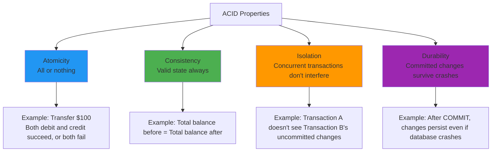
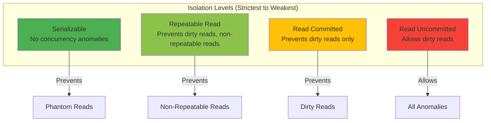
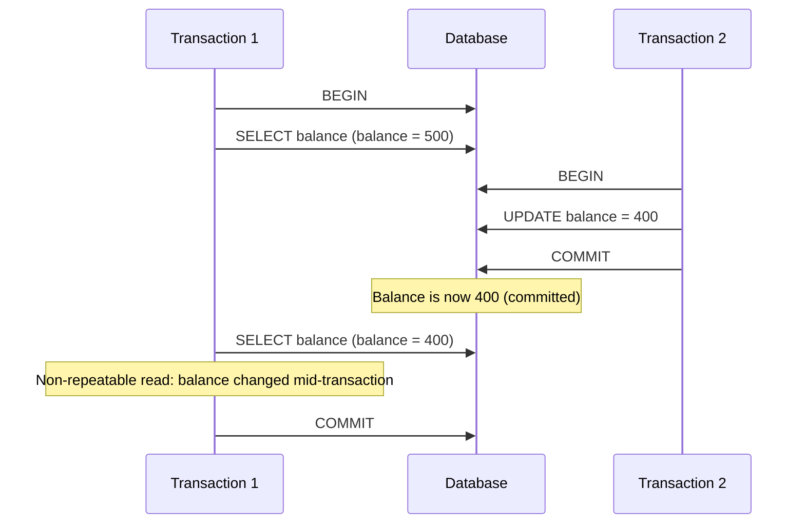
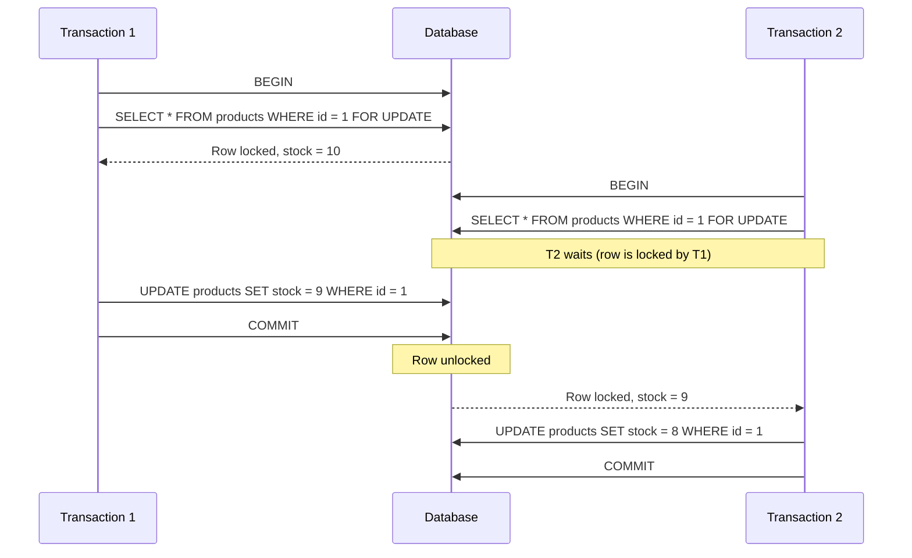

# Transactions and isolation levels

## 1. Why this exists (Real-world problem first)

You're running a banking application. User A transfers $100 from their checking account to savings. This requires two operations: debit checking, credit savings. Between these operations, the database crashes.

What breaks without transactions:
- **Partial failures create inconsistency**: Checking account is debited, but savings isn't credited. $100 vanishes.
- **Concurrent updates cause race conditions**: Two users withdraw from the same account simultaneously. Both see balance = $500, both withdraw $400. Balance becomes -$300 (should be $100).
- **Dirty reads expose uncommitted data**: User A transfers $1000, but the transaction fails and rolls back. User B reads the balance mid-transaction and sees $1000 that doesn't exist.
- **Lost updates**: User A and User B both update the same row. User B's update overwrites User A's, losing their changes.

Real pain: An e-commerce platform had a race condition in inventory management. Two users bought the last item simultaneously. Both transactions read `stock = 1`, both decremented it, both succeeded. The system sold 2 items when only 1 existed. The fix: use transactions with `SELECT FOR UPDATE` to lock the row.

## 2. Mental model (build imagination)

Think of a bank vault with multiple tellers.

**Without transactions**: Teller A opens the vault, takes $100 from Box 1, writes it down. Before they can put it in Box 2, Teller B opens the vault, sees Box 1 is missing $100, and panics. Meanwhile, Teller A's note gets lost. The $100 is gone.

**With transactions (ACID)**:
- **Atomicity**: Teller A locks the vault, takes $100 from Box 1, puts it in Box 2, unlocks the vault. Either both actions happen, or neither. No partial state.
- **Consistency**: The total money in the vault is always the same before and after.
- **Isolation**: While Teller A is working, Teller B can't see the intermediate state (Box 1 debited, Box 2 not yet credited).
- **Durability**: Once Teller A unlocks the vault, the change is permanent, even if the building burns down (written to disk).

**Isolation levels** control how much Teller B can see while Teller A is working:
- **Read Uncommitted**: Teller B sees everything, even Teller A's unfinished work (dirty reads).
- **Read Committed**: Teller B only sees completed work (no dirty reads).
- **Repeatable Read**: Teller B sees a snapshot of the vault from when they started. Even if Teller A finishes, Teller B doesn't see the change until they reopen the vault.
- **Serializable**: Only one teller can work at a time. No concurrency.

## 3. How Node.js implements this internally

Node.js doesn't implement transactions—the database does. But your Node.js code must **use** them correctly.

### Basic transaction

```javascript
const client = await pool.connect();
try {
  await client.query('BEGIN');
  await client.query('UPDATE accounts SET balance = balance - 100 WHERE id = $1', [fromAccountId]);
  await client.query('UPDATE accounts SET balance = balance + 100 WHERE id = $2', [toAccountId]);
  await client.query('COMMIT');
} catch (err) {
  await client.query('ROLLBACK');
  throw err;
} finally {
  client.release();
}
```

**What happens**:
1. `BEGIN`: Database starts a transaction, creates a snapshot of data
2. `UPDATE`: Changes are written to a temporary transaction log (WAL), not visible to other transactions
3. `COMMIT`: Changes are made permanent, visible to other transactions
4. `ROLLBACK` (on error): Changes are discarded, database returns to pre-transaction state

**Event loop impact**: Each `await` is async, but the transaction holds a database connection. If the transaction takes 10 seconds, that connection is unavailable to other requests.

### Isolation levels in Node.js

```javascript
// Read Committed (default in PostgreSQL)
await client.query('BEGIN');
const result1 = await client.query('SELECT balance FROM accounts WHERE id = $1', [accountId]);
// Another transaction updates the balance here
const result2 = await client.query('SELECT balance FROM accounts WHERE id = $1', [accountId]);
// result2 might be different from result1 (non-repeatable read)
await client.query('COMMIT');

// Repeatable Read
await client.query('BEGIN ISOLATION LEVEL REPEATABLE READ');
const result1 = await client.query('SELECT balance FROM accounts WHERE id = $1', [accountId]);
// Another transaction updates the balance here
const result2 = await client.query('SELECT balance FROM accounts WHERE id = $1', [accountId]);
// result2 is guaranteed to be the same as result1 (repeatable read)
await client.query('COMMIT');
```

### Pessimistic locking (SELECT FOR UPDATE)

```javascript
// Prevent race conditions by locking rows
await client.query('BEGIN');
const result = await client.query('SELECT * FROM products WHERE id = $1 FOR UPDATE', [productId]);
// Row is locked, other transactions must wait
if (result.rows[0].stock > 0) {
  await client.query('UPDATE products SET stock = stock - 1 WHERE id = $1', [productId]);
  await client.query('COMMIT');
} else {
  await client.query('ROLLBACK');
  throw new Error('Out of stock');
}
```

## 4. Multiple diagrams (MANDATORY)

### ACID properties



### Isolation levels



### Transaction timeline (Read Committed)



### Pessimistic locking (SELECT FOR UPDATE)



## 5. Where this is used in real projects

### Money transfers
```javascript
app.post('/transfer', async (req, res) => {
  const client = await pool.connect();
  try {
    await client.query('BEGIN');
    
    const from = await client.query('SELECT balance FROM accounts WHERE id = $1 FOR UPDATE', [req.body.fromAccountId]);
    if (from.rows[0].balance < req.body.amount) {
      throw new Error('Insufficient funds');
    }
    
    await client.query('UPDATE accounts SET balance = balance - $1 WHERE id = $2', [req.body.amount, req.body.fromAccountId]);
    await client.query('UPDATE accounts SET balance = balance + $1 WHERE id = $2', [req.body.amount, req.body.toAccountId]);
    
    await client.query('COMMIT');
    res.json({ success: true });
  } catch (err) {
    await client.query('ROLLBACK');
    res.status(400).json({ error: err.message });
  } finally {
    client.release();
  }
});
```

### Inventory management
```javascript
app.post('/checkout', async (req, res) => {
  const client = await pool.connect();
  try {
    await client.query('BEGIN');
    
    const product = await client.query('SELECT stock FROM products WHERE id = $1 FOR UPDATE', [req.body.productId]);
    if (product.rows[0].stock < req.body.quantity) {
      throw new Error('Out of stock');
    }
    
    await client.query('UPDATE products SET stock = stock - $1 WHERE id = $2', [req.body.quantity, req.body.productId]);
    await client.query('INSERT INTO orders (user_id, product_id, quantity) VALUES ($1, $2, $3)', 
      [req.user.id, req.body.productId, req.body.quantity]);
    
    await client.query('COMMIT');
    res.json({ success: true });
  } catch (err) {
    await client.query('ROLLBACK');
    res.status(400).json({ error: err.message });
  } finally {
    client.release();
  }
});
```

### Multi-step workflows
```javascript
// Create user, send welcome email, log event (all or nothing)
app.post('/signup', async (req, res) => {
  const client = await pool.connect();
  try {
    await client.query('BEGIN');
    
    const user = await client.query('INSERT INTO users (email, password_hash) VALUES ($1, $2) RETURNING *', 
      [req.body.email, hashedPassword]);
    
    await client.query('INSERT INTO email_queue (user_id, template) VALUES ($1, $2)', 
      [user.rows[0].id, 'welcome']);
    
    await client.query('INSERT INTO audit_log (user_id, action) VALUES ($1, $2)', 
      [user.rows[0].id, 'signup']);
    
    await client.query('COMMIT');
    res.json(user.rows[0]);
  } catch (err) {
    await client.query('ROLLBACK');
    res.status(400).json({ error: err.message });
  } finally {
    client.release();
  }
});
```

### Decision criteria
- **Use transactions when**: Multiple operations must succeed or fail together
- **Use `FOR UPDATE` when**: Preventing race conditions on shared resources (inventory, balances)
- **Use higher isolation levels when**: Consistency is critical (financial data, reservations)

## 6. Where this should NOT be used

### Long-running transactions
```javascript
// BAD: Transaction holds connection for 30 seconds
await client.query('BEGIN');
await client.query('INSERT INTO logs ...');
await sendEmail(); // 30 seconds
await client.query('COMMIT');
// Connection is locked for 30 seconds, blocking other requests
```

**Solution**: Keep transactions short. Do external I/O (emails, API calls) outside transactions.

### Read-only queries
```javascript
// BAD: Wrapping read-only queries in transactions
await client.query('BEGIN');
const users = await client.query('SELECT * FROM users');
await client.query('COMMIT');
// Unnecessary overhead
```

**Solution**: Only use transactions for writes or when you need isolation guarantees.

### High-concurrency writes
```javascript
// BAD: Serializable isolation on high-traffic table
await client.query('BEGIN ISOLATION LEVEL SERIALIZABLE');
await client.query('UPDATE page_views SET count = count + 1 WHERE page = $1', [pageId]);
await client.query('COMMIT');
// Serializable causes frequent transaction aborts under high concurrency
```

**Solution**: Use lower isolation levels (Read Committed) or optimistic locking.

## 7. Failure modes & edge cases

### Deadlocks
**Scenario**: Transaction 1 locks Row A, waits for Row B. Transaction 2 locks Row B, waits for Row A. Both wait forever.

**Impact**: Database detects deadlock, aborts one transaction with error: `deadlock detected`.

**Solution**: Always lock rows in the same order, or use timeouts.

```javascript
// BAD: Inconsistent lock order
// Transaction 1: Lock account 1, then account 2
// Transaction 2: Lock account 2, then account 1

// GOOD: Consistent lock order
const [fromId, toId] = [req.body.fromAccountId, req.body.toAccountId].sort();
await client.query('SELECT * FROM accounts WHERE id IN ($1, $2) FOR UPDATE', [fromId, toId]);
```

### Transaction timeout
**Scenario**: Transaction starts, application crashes before COMMIT. Transaction holds locks indefinitely.

**Impact**: Other transactions wait forever, database becomes unresponsive.

**Solution**: Set `statement_timeout` or `idle_in_transaction_session_timeout`.

```javascript
await client.query('SET statement_timeout = 5000'); // 5 seconds
await client.query('BEGIN');
// ...
```

### Serialization failures
**Scenario**: Two transactions with `REPEATABLE READ` or `SERIALIZABLE` modify the same rows.

**Impact**: One transaction aborts with error: `could not serialize access due to concurrent update`.

**Solution**: Retry the transaction.

```javascript
async function transferWithRetry(fromAccountId, toAccountId, amount, maxRetries = 3) {
  for (let i = 0; i < maxRetries; i++) {
    try {
      await transfer(fromAccountId, toAccountId, amount);
      return;
    } catch (err) {
      if (err.code === '40001' && i < maxRetries - 1) { // Serialization failure
        continue; // Retry
      }
      throw err;
    }
  }
}
```

### Lost updates (without FOR UPDATE)
**Scenario**: Two transactions read the same row, both update it based on the old value.

```javascript
// Transaction 1: balance = 500, update to 400
// Transaction 2: balance = 500, update to 300
// Final balance: 300 (Transaction 1's update is lost)
```

**Solution**: Use `FOR UPDATE` or optimistic locking (version column).

## 8. Trade-offs & alternatives

### What you gain
- **Data integrity**: No partial failures, no race conditions
- **Consistency**: Database is always in a valid state
- **Isolation**: Concurrent transactions don't interfere

### What you sacrifice
- **Performance**: Locks reduce concurrency
- **Complexity**: Must handle rollbacks, retries, deadlocks
- **Connection usage**: Transactions hold connections longer

### Alternatives

**Optimistic locking (version column)**
- **Use case**: Low contention, high concurrency
- **How it works**: Add a `version` column, increment on update, fail if version changed
- **Benefit**: No locks, higher concurrency
- **Trade-off**: Must handle conflicts in application code

```javascript
await client.query('UPDATE accounts SET balance = $1, version = version + 1 WHERE id = $2 AND version = $3', 
  [newBalance, accountId, currentVersion]);
// If rowCount = 0, version changed (conflict), retry
```

**Saga pattern (distributed transactions)**
- **Use case**: Transactions across multiple services/databases
- **How it works**: Break transaction into steps, each with a compensating action
- **Benefit**: Works across distributed systems
- **Trade-off**: Complex, eventual consistency

**Idempotent operations**
- **Use case**: Avoid transactions for simple operations
- **How it works**: Design operations to be safely retried (e.g., `INSERT ... ON CONFLICT DO NOTHING`)
- **Benefit**: No transaction overhead
- **Trade-off**: Limited use cases

## 9. Interview-level articulation

**Question**: "What are ACID properties and why do they matter?"

**Weak answer**: "ACID stands for Atomicity, Consistency, Isolation, Durability."

**Strong answer**: "ACID guarantees data integrity in databases. Atomicity means all operations in a transaction succeed or fail together—no partial states. Consistency means the database is always in a valid state, respecting constraints. Isolation means concurrent transactions don't interfere—one transaction doesn't see another's uncommitted changes. Durability means committed changes survive crashes. These matter because without them, you get race conditions, lost updates, and data corruption. For example, in a money transfer, atomicity ensures both debit and credit happen, or neither. Isolation prevents two users from withdrawing the same money simultaneously."

**Follow-up**: "What's the difference between Read Committed and Repeatable Read?"

**Answer**: "Both prevent dirty reads (reading uncommitted data), but they differ in how they handle concurrent updates. Read Committed allows non-repeatable reads—if I read a row twice in the same transaction, I might get different values if another transaction commits in between. Repeatable Read prevents this by giving me a snapshot of the database from when my transaction started. I'll always see the same data, even if other transactions commit. The trade-off is that Repeatable Read can cause serialization failures under high concurrency, requiring retries. I'd use Read Committed for most cases and Repeatable Read only when I need consistent snapshots, like generating reports."

**Follow-up**: "How do you prevent race conditions in inventory management?"

**Answer**: "I'd use pessimistic locking with `SELECT FOR UPDATE`. When a user tries to buy a product, I start a transaction, lock the product row with `SELECT * FROM products WHERE id = $1 FOR UPDATE`, check if stock is available, decrement stock, and commit. The lock ensures no other transaction can read or modify that row until I'm done. If two users try to buy the last item simultaneously, one gets the lock, decrements stock to 0, and commits. The other waits for the lock, then sees stock = 0 and fails. This prevents overselling. The trade-off is reduced concurrency—if many users are buying different products, locks don't interfere, but if they're all buying the same product, they serialize."

## 10. Key takeaways (engineer mindset)

**What to remember**:
- **Transactions = atomicity + isolation**. Use them for multi-step operations.
- **`FOR UPDATE` prevents race conditions** on shared resources.
- **Higher isolation levels = more consistency, less concurrency**.
- **Deadlocks are inevitable**—design for retries.

**What decisions this enables**:
- Choosing isolation levels based on consistency vs performance trade-offs
- Deciding between pessimistic locking (`FOR UPDATE`) and optimistic locking (version columns)
- Designing retry logic for serialization failures and deadlocks
- Balancing transaction duration vs connection pool usage

**How it connects to other Node.js concepts**:
- **Connection pooling**: Transactions hold connections longer, reducing pool availability
- **Event loop**: Long transactions block connections, reducing throughput
- **Error handling**: Must handle rollbacks, retries, and deadlocks gracefully
- **Observability**: Monitor transaction duration, deadlock rate, serialization failure rate
