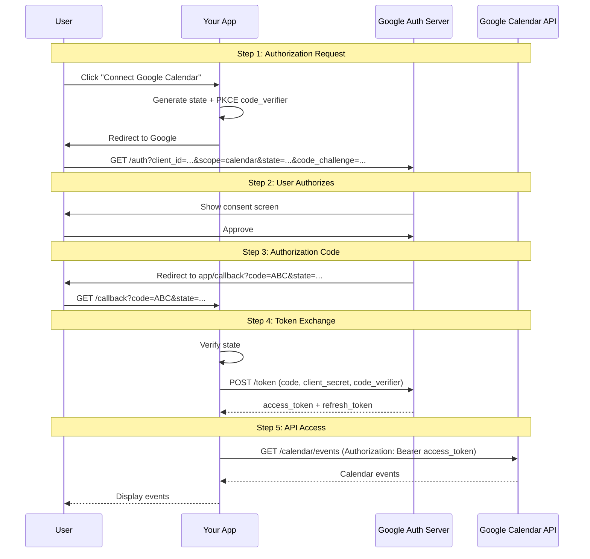
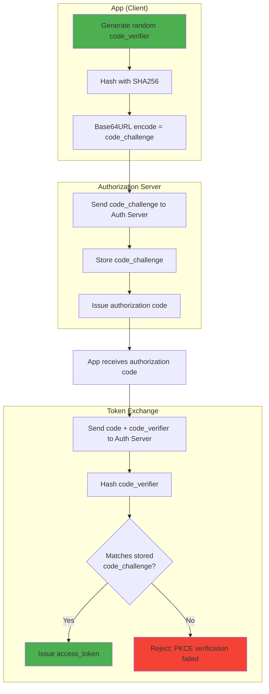
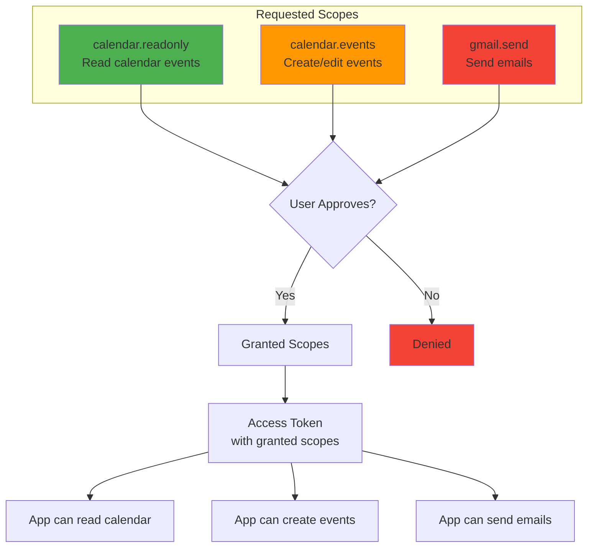

# OAuth flows

## 1. Why this exists (Real-world problem first)

You're building a SaaS platform that needs to integrate with Google Calendar, GitHub, and Slack. Without OAuth, you'd need to:
- **Store user passwords**: Users give you their Google password. Massive security risk—if your database is breached, attackers get Google passwords.
- **Full account access**: You get complete access to user's Google account, not just Calendar. User can't limit permissions.
- **No revocation**: User can't revoke your access without changing their password (which breaks other apps).
- **Password changes break integration**: User changes Google password, your integration stops working.

What breaks without understanding OAuth:
- **Authorization code interception**: Attacker intercepts authorization code in redirect, exchanges it for access token, gains full access to user's account.
- **CSRF attacks**: Attacker tricks user into authorizing attacker's account, linking it to user's identity.
- **Token leakage**: Access token exposed in URL or logs, attacker uses it to access user's data.
- **Scope creep**: App requests excessive permissions (read:all, write:all, delete:all) when it only needs read:calendar.

Real pain: A mobile app used OAuth but stored the access token in URL parameters. An attacker intercepted the URL from device logs and gained access to 10,000 user accounts. The fix: use PKCE (Proof Key for Code Exchange) and store tokens securely.

## 2. Mental model (build imagination)

Think of OAuth as a **valet key** for your car.

**Without OAuth (password sharing)**:
- You give the valet your car key
- Valet has full access: can drive anywhere, open trunk, access glove box
- You can't revoke access without changing the lock (expensive)

**With OAuth (valet key)**:
- You give the valet a special key that only starts the car and locks/unlocks doors
- Valet can't open trunk or glove box (limited permissions/scopes)
- You can revoke the valet key anytime without affecting your main key
- Valet key expires after 2 hours (access token expiration)

**The OAuth flow**:
1. **User** (resource owner): Owns the car
2. **App** (client): Valet who needs to park the car
3. **Authorization server** (Google, GitHub): Key maker who issues valet keys
4. **Resource server** (Google Calendar API): The car that valet keys can access

## 3. How Node.js implements this internally

OAuth 2.0 has multiple flows. The most common for web apps is **Authorization Code Flow with PKCE**.

### Authorization Code Flow (step-by-step)

```javascript
const express = require('express');
const crypto = require('crypto');
const axios = require('axios');

const app = express();

// OAuth configuration
const CLIENT_ID = process.env.GOOGLE_CLIENT_ID;
const CLIENT_SECRET = process.env.GOOGLE_CLIENT_SECRET;
const REDIRECT_URI = 'http://localhost:3000/callback';
const AUTHORIZATION_URL = 'https://accounts.google.com/o/oauth2/v2/auth';
const TOKEN_URL = 'https://oauth2.googleapis.com/token';

// Step 1: Redirect user to authorization server
app.get('/login', (req, res) => {
  // Generate state (CSRF protection)
  const state = crypto.randomBytes(32).toString('hex');
  req.session.oauthState = state;
  
  // Generate PKCE code verifier and challenge
  const codeVerifier = crypto.randomBytes(32).toString('base64url');
  req.session.codeVerifier = codeVerifier;
  
  const codeChallenge = crypto
    .createHash('sha256')
    .update(codeVerifier)
    .digest('base64url');
  
  // Build authorization URL
  const authUrl = new URL(AUTHORIZATION_URL);
  authUrl.searchParams.set('client_id', CLIENT_ID);
  authUrl.searchParams.set('redirect_uri', REDIRECT_URI);
  authUrl.searchParams.set('response_type', 'code');
  authUrl.searchParams.set('scope', 'https://www.googleapis.com/auth/calendar.readonly');
  authUrl.searchParams.set('state', state);
  authUrl.searchParams.set('code_challenge', codeChallenge);
  authUrl.searchParams.set('code_challenge_method', 'S256');
  authUrl.searchParams.set('access_type', 'offline'); // Get refresh token
  authUrl.searchParams.set('prompt', 'consent');
  
  res.redirect(authUrl.toString());
});

// Step 2: Handle callback with authorization code
app.get('/callback', async (req, res) => {
  const { code, state } = req.query;
  
  // Verify state (CSRF protection)
  if (state !== req.session.oauthState) {
    return res.status(400).json({ error: 'Invalid state parameter' });
  }
  
  if (!code) {
    return res.status(400).json({ error: 'No authorization code received' });
  }
  
  try {
    // Step 3: Exchange authorization code for access token
    const tokenResponse = await axios.post(TOKEN_URL, {
      code,
      client_id: CLIENT_ID,
      client_secret: CLIENT_SECRET,
      redirect_uri: REDIRECT_URI,
      grant_type: 'authorization_code',
      code_verifier: req.session.codeVerifier, // PKCE
    });
    
    const { access_token, refresh_token, expires_in, scope } = tokenResponse.data;
    
    // Store tokens securely
    await db.query(`
      INSERT INTO oauth_tokens (user_id, provider, access_token, refresh_token, expires_at, scope)
      VALUES ($1, $2, $3, $4, NOW() + INTERVAL '${expires_in} seconds', $5)
    `, [req.user.id, 'google', access_token, refresh_token, scope]);
    
    res.redirect('/dashboard');
  } catch (err) {
    console.error('Token exchange error:', err.response?.data || err.message);
    res.status(500).json({ error: 'Failed to exchange authorization code' });
  }
});

// Step 4: Use access token to call API
app.get('/calendar/events', async (req, res) => {
  try {
    // Get access token from database
    const tokenRecord = await db.query(`
      SELECT access_token, refresh_token, expires_at
      FROM oauth_tokens
      WHERE user_id = $1 AND provider = 'google'
    `, [req.user.id]);
    
    if (!tokenRecord.rows[0]) {
      return res.status(401).json({ error: 'Not connected to Google Calendar' });
    }
    
    let { access_token, refresh_token, expires_at } = tokenRecord.rows[0];
    
    // Check if token expired
    if (new Date(expires_at) < new Date()) {
      // Refresh access token
      const refreshResponse = await axios.post(TOKEN_URL, {
        refresh_token,
        client_id: CLIENT_ID,
        client_secret: CLIENT_SECRET,
        grant_type: 'refresh_token',
      });
      
      access_token = refreshResponse.data.access_token;
      const expires_in = refreshResponse.data.expires_in;
      
      // Update database
      await db.query(`
        UPDATE oauth_tokens
        SET access_token = $1, expires_at = NOW() + INTERVAL '${expires_in} seconds'
        WHERE user_id = $2 AND provider = 'google'
      `, [access_token, req.user.id]);
    }
    
    // Call Google Calendar API
    const eventsResponse = await axios.get('https://www.googleapis.com/calendar/v3/calendars/primary/events', {
      headers: { Authorization: `Bearer ${access_token}` },
    });
    
    res.json(eventsResponse.data);
  } catch (err) {
    console.error('Calendar API error:', err.response?.data || err.message);
    res.status(500).json({ error: 'Failed to fetch calendar events' });
  }
});
```

**What happens**:
1. User clicks "Connect Google Calendar"
2. App redirects to Google with `client_id`, `redirect_uri`, `scope`, `state`, `code_challenge`
3. User authorizes app on Google
4. Google redirects back to app with `code` and `state`
5. App verifies `state`, exchanges `code` for `access_token` and `refresh_token`
6. App stores tokens in database
7. App uses `access_token` to call Google Calendar API
8. When `access_token` expires, app uses `refresh_token` to get new `access_token`

**Event loop impact**: All HTTP requests (redirect, token exchange, API calls) are async I/O. No blocking.

## 4. Multiple diagrams (MANDATORY)

### OAuth Authorization Code Flow



### PKCE (Proof Key for Code Exchange)



### OAuth Scopes



### OAuth Flow Comparison

```mermaid
graph TB
    subgraph "Authorization Code Flow (Web Apps)"
        AC1[User redirected to auth server] --> AC2[User approves]
        AC2 --> AC3[Auth code sent to app]
        AC3 --> AC4[App exchanges code for token<br/>using client_secret]
        AC4 --> AC5[✅ Secure: client_secret never exposed]
    end
    
    subgraph "Implicit Flow (DEPRECATED)"
        IM1[User redirected to auth server] --> IM2[User approves]
        IM2 --> IM3[Access token sent in URL fragment]
        IM3 --> IM4[❌ Insecure: token exposed in URL]
    end
    
    subgraph "Client Credentials Flow (M2M)"
        CC1[App sends client_id + client_secret] --> CC2[Auth server issues token]
        CC2 --> CC3[✅ No user involved]
    end
    
    style AC5 fill:#4CAF50
    style IM4 fill:#F44336
    style CC3 fill:#2196F3
```



## 5. Where this is used in real projects

### Complete OAuth implementation with Passport.js

```javascript
const express = require('express');
const passport = require('passport');
const GoogleStrategy = require('passport-google-oauth20').Strategy;
const session = require('express-session');

const app = express();

app.use(session({
  secret: process.env.SESSION_SECRET,
  resave: false,
  saveUninitialized: false,
}));

app.use(passport.initialize());
app.use(passport.session());

// Configure Google OAuth strategy
passport.use(new GoogleStrategy({
    clientID: process.env.GOOGLE_CLIENT_ID,
    clientSecret: process.env.GOOGLE_CLIENT_SECRET,
    callbackURL: '/auth/google/callback',
    scope: ['profile', 'email', 'https://www.googleapis.com/auth/calendar.readonly'],
  },
  async (accessToken, refreshToken, profile, done) => {
    try {
      // Find or create user
      let user = await db.query('SELECT * FROM users WHERE google_id = $1', [profile.id]);
      
      if (!user.rows[0]) {
        user = await db.query(`
          INSERT INTO users (google_id, email, name, avatar)
          VALUES ($1, $2, $3, $4)
          RETURNING *
        `, [profile.id, profile.emails[0].value, profile.displayName, profile.photos[0].value]);
      }
      
      // Store OAuth tokens
      await db.query(`
        INSERT INTO oauth_tokens (user_id, provider, access_token, refresh_token, expires_at)
        VALUES ($1, 'google', $2, $3, NOW() + INTERVAL '1 hour')
        ON CONFLICT (user_id, provider)
        DO UPDATE SET access_token = $2, refresh_token = $3, expires_at = NOW() + INTERVAL '1 hour'
      `, [user.rows[0].id, accessToken, refreshToken]);
      
      done(null, user.rows[0]);
    } catch (err) {
      done(err);
    }
  }
));

passport.serializeUser((user, done) => {
  done(null, user.id);
});

passport.deserializeUser(async (id, done) => {
  const user = await db.query('SELECT * FROM users WHERE id = $1', [id]);
  done(null, user.rows[0]);
});

// Routes
app.get('/auth/google', passport.authenticate('google'));

app.get('/auth/google/callback',
  passport.authenticate('google', { failureRedirect: '/login' }),
  (req, res) => {
    res.redirect('/dashboard');
  }
);

app.get('/logout', (req, res) => {
  req.logout(() => {
    res.redirect('/');
  });
});
```

### Token refresh with automatic retry

```javascript
const axios = require('axios');

async function callGoogleAPI(userId, apiUrl) {
  // Get tokens
  const tokenRecord = await db.query(`
    SELECT access_token, refresh_token, expires_at
    FROM oauth_tokens
    WHERE user_id = $1 AND provider = 'google'
  `, [userId]);
  
  if (!tokenRecord.rows[0]) {
    throw new Error('User not connected to Google');
  }
  
  let { access_token, refresh_token, expires_at } = tokenRecord.rows[0];
  
  // Refresh if expired
  if (new Date(expires_at) < new Date()) {
    const refreshResponse = await axios.post('https://oauth2.googleapis.com/token', {
      refresh_token,
      client_id: process.env.GOOGLE_CLIENT_ID,
      client_secret: process.env.GOOGLE_CLIENT_SECRET,
      grant_type: 'refresh_token',
    });
    
    access_token = refreshResponse.data.access_token;
    
    await db.query(`
      UPDATE oauth_tokens
      SET access_token = $1, expires_at = NOW() + INTERVAL '${refreshResponse.data.expires_in} seconds'
      WHERE user_id = $2 AND provider = 'google'
    `, [access_token, userId]);
  }
  
  // Call API
  try {
    const response = await axios.get(apiUrl, {
      headers: { Authorization: `Bearer ${access_token}` },
    });
    return response.data;
  } catch (err) {
    if (err.response?.status === 401) {
      // Token invalid, try refreshing once more
      const refreshResponse = await axios.post('https://oauth2.googleapis.com/token', {
        refresh_token,
        client_id: process.env.GOOGLE_CLIENT_ID,
        client_secret: process.env.GOOGLE_CLIENT_SECRET,
        grant_type: 'refresh_token',
      });
      
      access_token = refreshResponse.data.access_token;
      
      await db.query(`
        UPDATE oauth_tokens
        SET access_token = $1, expires_at = NOW() + INTERVAL '${refreshResponse.data.expires_in} seconds'
        WHERE user_id = $2 AND provider = 'google'
      `, [access_token, userId]);
      
      // Retry API call
      const retryResponse = await axios.get(apiUrl, {
        headers: { Authorization: `Bearer ${access_token}` },
      });
      return retryResponse.data;
    }
    throw err;
  }
}
```

### Multi-provider OAuth (Google, GitHub, Slack)

```javascript
const providers = {
  google: {
    authUrl: 'https://accounts.google.com/o/oauth2/v2/auth',
    tokenUrl: 'https://oauth2.googleapis.com/token',
    scope: 'profile email https://www.googleapis.com/auth/calendar.readonly',
  },
  github: {
    authUrl: 'https://github.com/login/oauth/authorize',
    tokenUrl: 'https://github.com/login/oauth/access_token',
    scope: 'read:user repo',
  },
  slack: {
    authUrl: 'https://slack.com/oauth/v2/authorize',
    tokenUrl: 'https://slack.com/api/oauth.v2.access',
    scope: 'channels:read chat:write',
  },
};

app.get('/auth/:provider', (req, res) => {
  const provider = providers[req.params.provider];
  
  if (!provider) {
    return res.status(400).json({ error: 'Invalid provider' });
  }
  
  const state = crypto.randomBytes(32).toString('hex');
  req.session.oauthState = state;
  req.session.oauthProvider = req.params.provider;
  
  const authUrl = new URL(provider.authUrl);
  authUrl.searchParams.set('client_id', process.env[`${req.params.provider.toUpperCase()}_CLIENT_ID`]);
  authUrl.searchParams.set('redirect_uri', `http://localhost:3000/auth/${req.params.provider}/callback`);
  authUrl.searchParams.set('scope', provider.scope);
  authUrl.searchParams.set('state', state);
  authUrl.searchParams.set('response_type', 'code');
  
  res.redirect(authUrl.toString());
});

app.get('/auth/:provider/callback', async (req, res) => {
  const { code, state } = req.query;
  const providerName = req.params.provider;
  const provider = providers[providerName];
  
  if (state !== req.session.oauthState) {
    return res.status(400).json({ error: 'Invalid state' });
  }
  
  try {
    const tokenResponse = await axios.post(provider.tokenUrl, {
      code,
      client_id: process.env[`${providerName.toUpperCase()}_CLIENT_ID`],
      client_secret: process.env[`${providerName.toUpperCase()}_CLIENT_SECRET`],
      redirect_uri: `http://localhost:3000/auth/${providerName}/callback`,
      grant_type: 'authorization_code',
    }, {
      headers: { Accept: 'application/json' },
    });
    
    const { access_token, refresh_token } = tokenResponse.data;
    
    await db.query(`
      INSERT INTO oauth_tokens (user_id, provider, access_token, refresh_token, expires_at)
      VALUES ($1, $2, $3, $4, NOW() + INTERVAL '1 hour')
      ON CONFLICT (user_id, provider)
      DO UPDATE SET access_token = $3, refresh_token = $4, expires_at = NOW() + INTERVAL '1 hour'
    `, [req.user.id, providerName, access_token, refresh_token]);
    
    res.redirect('/dashboard');
  } catch (err) {
    console.error('OAuth error:', err.response?.data || err.message);
    res.status(500).json({ error: 'OAuth failed' });
  }
});
```

## 6. Where this should NOT be used

### Storing client secret in frontend

```javascript
// BAD: Client secret in frontend JavaScript
const CLIENT_SECRET = 'your-secret-here'; // Exposed to anyone!

// GOOD: Client secret only on backend
// Frontend only has client_id (public)
```

### Using Implicit Flow

```javascript
// BAD: Implicit Flow (deprecated, insecure)
// Access token returned in URL fragment
// https://yourapp.com/callback#access_token=ABC123

// GOOD: Authorization Code Flow with PKCE
// Authorization code returned in query parameter
// https://yourapp.com/callback?code=ABC123
```

### Requesting excessive scopes

```javascript
// BAD: Requesting all permissions
scope: 'https://www.googleapis.com/auth/calendar https://www.googleapis.com/auth/gmail.modify https://www.googleapis.com/auth/drive'

// GOOD: Request only what you need
scope: 'https://www.googleapis.com/auth/calendar.readonly'
```

### Not validating state parameter

```javascript
// BAD: No CSRF protection
app.get('/callback', async (req, res) => {
  const { code } = req.query;
  // Exchange code for token without verifying state
});

// GOOD: Always verify state
app.get('/callback', async (req, res) => {
  const { code, state } = req.query;
  
  if (state !== req.session.oauthState) {
    return res.status(400).json({ error: 'CSRF detected' });
  }
  
  // Exchange code for token
});
```

## 7. Failure modes & edge cases

### Authorization code interception

**Scenario**: Attacker intercepts authorization code from redirect URL (e.g., via malicious proxy).

**Impact**: Attacker exchanges code for access token, gains access to user's account.

**Solution**: Use PKCE. Even if attacker intercepts code, they can't exchange it without `code_verifier`.

### State parameter missing (CSRF)

**Scenario**: Attacker tricks user into authorizing attacker's account, linking it to user's identity.

**Impact**: User's actions are attributed to attacker's account.

**Solution**: Always generate and verify `state` parameter.

### Refresh token stolen

**Scenario**: Attacker steals refresh token from database breach.

**Impact**: Attacker can get new access tokens indefinitely.

**Solution**: Encrypt refresh tokens at rest, rotate on use, implement token binding (tie to IP/device).

### Scope creep

**Scenario**: App initially requests `calendar.readonly`, later adds `gmail.modify` without user re-consent.

**Impact**: User doesn't know app has email access.

**Solution**: Request incremental scopes—ask for new permissions only when needed.

### Token expiration during long-running operation

**Scenario**: User uploads large file. Access token expires mid-upload.

**Impact**: Upload fails after 30 minutes.

**Solution**: Refresh token before long operations, or use chunked uploads with token refresh between chunks.

## 8. Trade-offs & alternatives

### What you gain
- **No password storage**: User never shares password with your app
- **Limited permissions**: User grants only specific scopes
- **Revocable**: User can revoke access anytime
- **Delegated auth**: Offload authentication to trusted providers

### What you sacrifice
- **Complexity**: Must implement OAuth flow, token refresh, error handling
- **Dependency**: Relies on external auth server (Google, GitHub)
- **User friction**: Extra step (redirect to auth server, consent screen)

### Alternatives

**SAML (Security Assertion Markup Language)**
- **Use case**: Enterprise SSO
- **Benefit**: Widely adopted in enterprises
- **Trade-off**: More complex than OAuth, XML-based

**OpenID Connect (OIDC)**
- **Use case**: Authentication (not just authorization)
- **Benefit**: Built on OAuth 2.0, adds identity layer
- **Trade-off**: More complex than plain OAuth

**API keys**
- **Use case**: Machine-to-machine, simple integrations
- **Benefit**: Simple, no user interaction
- **Trade-off**: No user-specific permissions, hard to rotate

## 9. Interview-level articulation

**Question**: "Explain OAuth 2.0 and how it works."

**Weak answer**: "OAuth lets users log in with Google or Facebook."

**Strong answer**: "OAuth 2.0 is a delegated authorization framework that allows apps to access user resources without storing passwords. The flow: user clicks 'Connect Google Calendar', app redirects to Google with client_id, redirect_uri, and requested scopes. User authorizes, Google redirects back with an authorization code. App exchanges the code for an access token using client_secret (backend only). App uses the access token to call Google Calendar API. When the token expires, app uses a refresh token to get a new access token. Key security: PKCE prevents code interception, state parameter prevents CSRF, scopes limit permissions."

**Follow-up**: "What's PKCE and why is it important?"

**Answer**: "PKCE (Proof Key for Code Exchange) prevents authorization code interception attacks. Without PKCE, if an attacker intercepts the authorization code (e.g., via malicious proxy), they can exchange it for an access token. With PKCE, the app generates a random code_verifier, hashes it to create code_challenge, and sends code_challenge to the auth server. When exchanging the code for a token, the app sends code_verifier. The auth server hashes it and verifies it matches the stored code_challenge. If an attacker intercepts the code, they don't have the code_verifier, so they can't exchange it. PKCE is mandatory for mobile and SPA apps, recommended for all OAuth flows."

**Follow-up**: "How do you handle token expiration?"

**Answer**: "Access tokens are short-lived (1 hour). I store the expiration time in the database. Before calling an API, I check if the token is expired. If so, I use the refresh token to get a new access token from the auth server. I update the database with the new token and expiration. If the API call returns 401, I retry once after refreshing the token. If the refresh token is invalid (user revoked access), I prompt the user to re-authorize. I also implement automatic token refresh in the background (e.g., cron job) to keep tokens fresh for scheduled tasks."

## 10. Key takeaways (engineer mindset)

**What to remember**:
- **OAuth is for authorization, not authentication** (use OpenID Connect for auth)
- **Always use PKCE** to prevent code interception
- **Always verify state parameter** to prevent CSRF
- **Request minimal scopes** (principle of least privilege)
- **Refresh tokens are sensitive**—encrypt at rest, rotate on use

**What decisions this enables**:
- Choosing OAuth flow (Authorization Code, Client Credentials)
- Designing token storage and refresh strategies
- Implementing multi-provider OAuth (Google, GitHub, Slack)
- Handling token expiration and revocation

**How it connects to other Node.js concepts**:
- **HTTP redirects**: OAuth flow involves multiple redirects
- **Session management**: Store OAuth state in session
- **Database**: Store access/refresh tokens securely
- **Error handling**: Handle token expiration, revocation, API errors
- **Observability**: Log OAuth events (authorization, token refresh, API calls)
