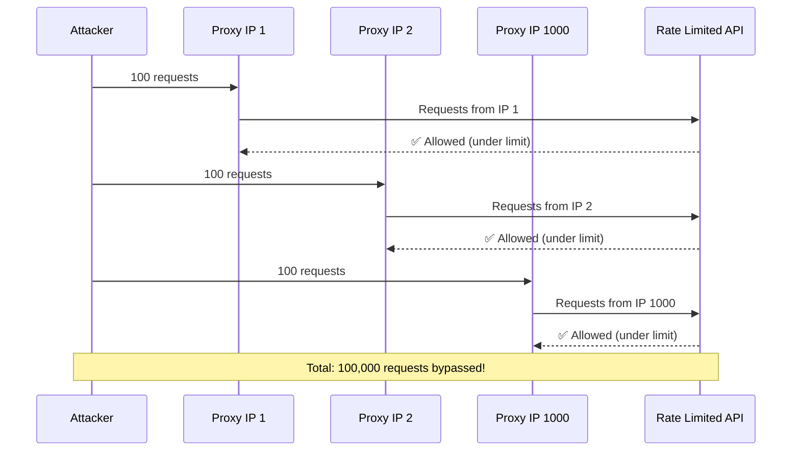
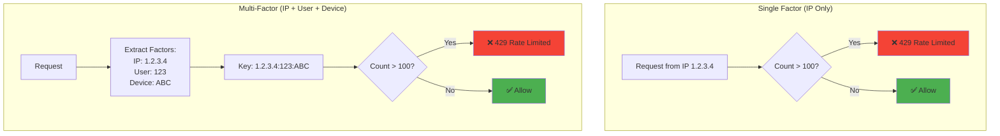
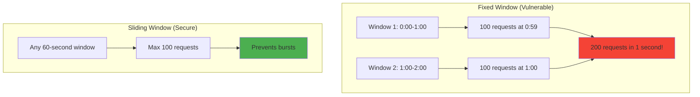
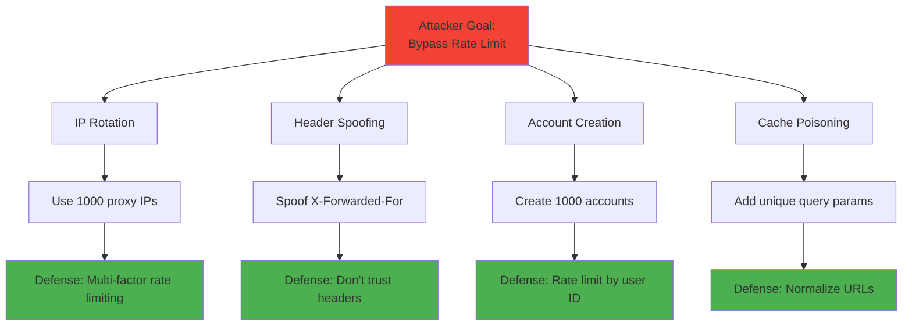

# Rate limit bypass attacks

## 1. Why this exists (Real-world problem first)

You implement rate limiting: 100 requests per minute per IP. An attacker wants to brute-force login credentials or scrape your API. What breaks:

- **IP rotation**: Attacker uses 1000 proxy IPs, bypassing IP-based rate limits. Each IP gets 100 requests/min = 100,000 requests/min total.
- **Distributed attacks**: Attacker uses botnet with 10,000 IPs. Your rate limiter sees 10,000 different IPs, each under the limit.
- **Header manipulation**: Attacker spoofs `X-Forwarded-For` header. Your rate limiter trusts it, attacker bypasses limits.
- **User enumeration**: Attacker creates 1000 accounts, each gets 100 requests/min. Total: 100,000 requests/min.
- **Cache poisoning**: Attacker sends requests with unique query parameters (`?v=1`, `?v=2`). Each is cached separately, bypassing rate limits.

Real pain: A fintech API had IP-based rate limiting (100 req/min). Attackers used AWS Lambda with rotating IPs to make 1 million requests/min, scraping all transaction data. The fix: rate limit by user ID + IP + device fingerprint, with CAPTCHA after 3 failed logins.

**Another scenario**: An e-commerce site rate-limited by IP. During Black Friday, 1000 legitimate users behind a corporate NAT shared one IP. All were blocked after the first user hit the limit. The fix: use sliding window with user sessions, not just IP.

## 2. Mental model (build imagination)

Think of a nightclub with a bouncer limiting entry.

**Simple rate limit (IP-based)**:
- Bouncer counts people from each address
- 123 Main St can send 10 people/hour
- **Attack**: Attacker uses 100 different addresses, sends 1000 people/hour

**Advanced rate limit (multi-factor)**:
- Bouncer checks address + ID + invitation code
- Each unique combination gets 10 entries/hour
- **Harder to bypass**: Attacker needs 100 addresses × 100 IDs × 100 codes = 1 million combinations

**Adaptive rate limit**:
- Bouncer notices suspicious patterns (same person with different IDs)
- Tightens limits for suspicious entries
- Requires CAPTCHA or phone verification

**Key insight**: Single-factor rate limiting (IP only) is easily bypassed. Multi-factor (IP + user + device + behavior) is more robust.

## 3. How Node.js implements this internally

### Basic IP-based rate limiting (vulnerable)

```javascript
const rateLimit = require('express-rate-limit');

// BAD: IP-only rate limiting
const limiter = rateLimit({
  windowMs: 60 * 1000, // 1 minute
  max: 100, // 100 requests per minute
  keyGenerator: (req) => req.ip, // Only IP
});

app.use('/api/', limiter);
```

**What happens**:
1. Request arrives
2. Middleware extracts `req.ip`
3. Increments counter for that IP in memory/Redis
4. If counter > 100, return 429 Too Many Requests
5. Counter resets after 1 minute

**Vulnerability**: Attacker rotates IPs, each gets 100 requests.

### Multi-factor rate limiting (better)

```javascript
const Redis = require('ioredis');
const redis = new Redis();

async function advancedRateLimiter(req, res, next) {
  // Combine multiple factors
  const factors = [
    req.ip,
    req.user?.id || 'anonymous',
    req.headers['user-agent'],
    req.fingerprint, // Device fingerprint (from client)
  ];
  
  const key = `ratelimit:${factors.join(':')}`;
  
  const count = await redis.incr(key);
  
  if (count === 1) {
    await redis.expire(key, 60); // 1-minute window
  }
  
  if (count > 100) {
    return res.status(429).json({ 
      error: 'Rate limit exceeded',
      retryAfter: await redis.ttl(key),
    });
  }
  
  res.setHeader('X-RateLimit-Limit', 100);
  res.setHeader('X-RateLimit-Remaining', 100 - count);
  
  next();
}

app.use('/api/', advancedRateLimiter);
```

**What happens**:
1. Combines IP + user ID + user agent + device fingerprint
2. Attacker must rotate all factors to bypass
3. Much harder to bypass than IP-only

### Sliding window rate limiting

```javascript
async function slidingWindowRateLimiter(req, res, next) {
  const key = `ratelimit:${req.ip}:${req.user?.id}`;
  const now = Date.now();
  const windowMs = 60 * 1000; // 1 minute
  const limit = 100;
  
  // Add current request timestamp
  await redis.zadd(key, now, `${now}:${Math.random()}`);
  
  // Remove timestamps older than window
  await redis.zremrangebyscore(key, 0, now - windowMs);
  
  // Count requests in window
  const count = await redis.zcard(key);
  
  // Set expiration
  await redis.expire(key, Math.ceil(windowMs / 1000));
  
  if (count > limit) {
    return res.status(429).json({ error: 'Rate limit exceeded' });
  }
  
  next();
}
```

**Why sliding window**: Fixed window has burst problem. User can make 100 requests at 0:59, then 100 more at 1:00 = 200 requests in 1 second. Sliding window prevents this.

## 4. Multiple diagrams (MANDATORY)

### IP rotation attack



### Multi-factor rate limiting



### Fixed vs Sliding window



### Rate limit bypass techniques



## 5. Where this is used in real projects

### Production-grade rate limiting with Redis

```javascript
const Redis = require('ioredis');
const redis = new Redis();
const crypto = require('crypto');

// Generate device fingerprint
function getDeviceFingerprint(req) {
  const factors = [
    req.headers['user-agent'],
    req.headers['accept-language'],
    req.headers['accept-encoding'],
  ].join('|');
  
  return crypto.createHash('sha256').update(factors).digest('hex').substring(0, 16);
}

// Multi-factor rate limiter
async function rateLimiter(req, res, next) {
  const factors = {
    ip: req.ip,
    userId: req.user?.id || 'anonymous',
    fingerprint: getDeviceFingerprint(req),
  };
  
  // Different limits for different endpoints
  const limits = {
    '/api/login': { windowMs: 60000, max: 5 }, // 5 login attempts per minute
    '/api/data': { windowMs: 60000, max: 100 }, // 100 data requests per minute
  };
  
  const endpoint = req.path;
  const config = limits[endpoint] || { windowMs: 60000, max: 100 };
  
  const key = `ratelimit:${endpoint}:${factors.ip}:${factors.userId}:${factors.fingerprint}`;
  const now = Date.now();
  
  // Sliding window with Redis sorted set
  await redis.zadd(key, now, `${now}:${Math.random()}`);
  await redis.zremrangebyscore(key, 0, now - config.windowMs);
  
  const count = await redis.zcard(key);
  await redis.expire(key, Math.ceil(config.windowMs / 1000));
  
  // Set rate limit headers
  res.setHeader('X-RateLimit-Limit', config.max);
  res.setHeader('X-RateLimit-Remaining', Math.max(0, config.max - count));
  res.setHeader('X-RateLimit-Reset', new Date(now + config.windowMs).toISOString());
  
  if (count > config.max) {
    // Log rate limit violation
    await logSecurityEvent('RATE_LIMIT_EXCEEDED', {
      ip: factors.ip,
      userId: factors.userId,
      endpoint,
      count,
      limit: config.max,
    });
    
    return res.status(429).json({
      error: 'Rate limit exceeded',
      retryAfter: Math.ceil((await redis.ttl(key)) / 1000),
    });
  }
  
  next();
}

app.use(rateLimiter);
```

### Adaptive rate limiting (tighten on suspicious behavior)

```javascript
async function adaptiveRateLimiter(req, res, next) {
  const key = `ratelimit:${req.ip}:${req.user?.id}`;
  const suspicionKey = `suspicion:${req.ip}`;
  
  // Check suspicion score
  const suspicionScore = parseInt(await redis.get(suspicionKey)) || 0;
  
  // Adjust limit based on suspicion
  let limit = 100; // Normal limit
  if (suspicionScore > 10) limit = 10; // Suspicious: 10 req/min
  if (suspicionScore > 50) limit = 1;  // Very suspicious: 1 req/min
  
  const count = await redis.incr(key);
  if (count === 1) await redis.expire(key, 60);
  
  if (count > limit) {
    // Increase suspicion on rate limit hit
    await redis.incr(suspicionKey);
    await redis.expire(suspicionKey, 3600); // 1-hour suspicion window
    
    return res.status(429).json({ error: 'Rate limit exceeded' });
  }
  
  next();
}

// Increase suspicion on failed logins
app.post('/login', async (req, res) => {
  const user = await authenticateUser(req.body.email, req.body.password);
  
  if (!user) {
    // Failed login: increase suspicion
    await redis.incr(`suspicion:${req.ip}`);
    await redis.expire(`suspicion:${req.ip}`, 3600);
    
    return res.status(401).json({ error: 'Invalid credentials' });
  }
  
  // Successful login: reset suspicion
  await redis.del(`suspicion:${req.ip}`);
  
  res.json({ token: generateToken(user) });
});
```

### CAPTCHA after rate limit

```javascript
const { RecaptchaV3 } = require('express-recaptcha');
const recaptcha = new RecaptchaV3('SITE_KEY', 'SECRET_KEY');

async function rateLimiterWithCaptcha(req, res, next) {
  const key = `ratelimit:${req.ip}:${req.user?.id}`;
  const count = await redis.incr(key);
  
  if (count === 1) await redis.expire(key, 60);
  
  // After 50 requests, require CAPTCHA
  if (count > 50 && count <= 100) {
    if (!req.body.captchaToken) {
      return res.status(429).json({ 
        error: 'CAPTCHA required',
        requireCaptcha: true,
      });
    }
    
    // Verify CAPTCHA
    const captchaValid = await verifyCaptcha(req.body.captchaToken);
    if (!captchaValid) {
      return res.status(429).json({ error: 'Invalid CAPTCHA' });
    }
  }
  
  // After 100 requests, block completely
  if (count > 100) {
    return res.status(429).json({ error: 'Rate limit exceeded' });
  }
  
  next();
}
```

### Distributed rate limiting (multiple servers)

```javascript
// Use Redis for distributed rate limiting across multiple Node.js instances
const Redis = require('ioredis');
const redis = new Redis.Cluster([
  { host: 'redis1', port: 6379 },
  { host: 'redis2', port: 6379 },
  { host: 'redis3', port: 6379 },
]);

async function distributedRateLimiter(req, res, next) {
  const key = `ratelimit:${req.ip}`;
  
  // Lua script for atomic increment and expiration
  const script = `
    local current = redis.call('incr', KEYS[1])
    if current == 1 then
      redis.call('expire', KEYS[1], ARGV[1])
    end
    return current
  `;
  
  const count = await redis.eval(script, 1, key, 60);
  
  if (count > 100) {
    return res.status(429).json({ error: 'Rate limit exceeded' });
  }
  
  next();
}
```

## 6. Where this should NOT be used

### Trusting client-provided headers

```javascript
// BAD: Trusting X-Forwarded-For header
const limiter = rateLimit({
  keyGenerator: (req) => req.headers['x-forwarded-for'] || req.ip,
});

// Attacker spoofs header: X-Forwarded-For: 1.2.3.4
// Each request appears from different IP
```

### Rate limiting static assets

```javascript
// BAD: Rate limiting CSS/JS files
app.use('/static/', rateLimiter); // Users can't load your site!

// GOOD: Only rate limit API endpoints
app.use('/api/', rateLimiter);
```

### Fixed window without burst protection

```javascript
// BAD: Fixed window allows bursts
const limiter = rateLimit({
  windowMs: 60000,
  max: 100,
});

// User makes 100 requests at 0:59, 100 more at 1:00 = 200 in 1 second

// GOOD: Use sliding window
```

### Rate limiting by IP in corporate networks

```javascript
// BAD: 1000 employees share one corporate NAT IP
// First employee hits limit, all 1000 are blocked

// GOOD: Rate limit by user ID + IP
const key = `${req.user.id}:${req.ip}`;
```

## 7. Failure modes & edge cases

### IP rotation bypass

**Scenario**: Attacker uses 1000 proxy IPs, each makes 100 requests.

**Impact**: 100,000 requests bypass rate limit.

**Solution**: Multi-factor rate limiting (IP + user + device fingerprint).

### Header spoofing

**Scenario**: Attacker spoofs `X-Forwarded-For: 1.2.3.4`, `X-Forwarded-For: 5.6.7.8`, etc.

**Impact**: Each request appears from different IP.

**Solution**: Don't trust client headers. Use `req.connection.remoteAddress` or validate headers against known proxies.

### Account creation spam

**Scenario**: Attacker creates 1000 accounts, each gets 100 requests/min.

**Impact**: 100,000 requests/min.

**Solution**: Rate limit account creation (email verification, CAPTCHA, phone verification).

### Cache poisoning

**Scenario**: Attacker adds unique query params (`?v=1`, `?v=2`), each cached separately.

**Impact**: Bypasses cache-based rate limiting.

**Solution**: Normalize URLs before rate limiting (remove unnecessary query params).

### Redis failure

**Scenario**: Redis goes down. Rate limiter can't track requests.

**Impact**: All requests allowed (no rate limiting) or all requests blocked (fail-closed).

**Solution**: Implement fallback (in-memory rate limiting per instance, or fail-open with logging).

```javascript
async function rateLimiterWithFallback(req, res, next) {
  try {
    const count = await redis.incr(`ratelimit:${req.ip}`);
    if (count > 100) {
      return res.status(429).json({ error: 'Rate limit exceeded' });
    }
  } catch (err) {
    // Redis down: log and allow (fail-open)
    console.error('Redis error, rate limiting disabled:', err);
    await logSecurityEvent('RATE_LIMITER_FAILURE', { ip: req.ip });
  }
  
  next();
}
```

## 8. Trade-offs & alternatives

### What you gain
- **Attack prevention**: Stops brute force, scraping, DDoS
- **Resource protection**: Prevents server overload
- **Fair usage**: Ensures all users get equal access

### What you sacrifice
- **Legitimate user impact**: Users behind corporate NAT may be blocked
- **Complexity**: Multi-factor rate limiting is complex
- **Performance**: Redis lookups add latency (1-5ms)

### Alternatives

**CAPTCHA**
- **Use case**: After rate limit hit, require CAPTCHA
- **Benefit**: Distinguishes humans from bots
- **Trade-off**: Poor user experience

**Web Application Firewall (WAF)**
- **Use case**: Cloudflare, AWS WAF
- **Benefit**: Handles rate limiting at edge, before reaching your server
- **Trade-off**: Cost, vendor lock-in

**Token bucket algorithm**
- **Use case**: Allow bursts but limit sustained rate
- **Benefit**: More flexible than fixed window
- **Trade-off**: More complex to implement

**Proof of work**
- **Use case**: Require client to solve computational puzzle
- **Benefit**: Makes attacks expensive
- **Trade-off**: Impacts legitimate users (battery drain on mobile)

## 9. Interview-level articulation

**Question**: "How do attackers bypass rate limiting?"

**Weak answer**: "They use multiple IPs."

**Strong answer**: "Attackers bypass rate limiting through IP rotation (using proxies or botnets), header spoofing (forging X-Forwarded-For), account creation spam (creating many accounts, each with its own limit), and cache poisoning (adding unique query params to bypass cache-based limits). To defend, I use multi-factor rate limiting—combining IP, user ID, and device fingerprint. I also implement adaptive rate limiting that tightens limits on suspicious behavior, require CAPTCHA after repeated failures, and use sliding windows to prevent burst attacks. I never trust client-provided headers like X-Forwarded-For without validation."

**Follow-up**: "What's the difference between fixed window and sliding window rate limiting?"

**Answer**: "Fixed window divides time into discrete buckets—for example, 0:00-1:00, 1:00-2:00. The problem is burst attacks: a user can make 100 requests at 0:59, then 100 more at 1:00, totaling 200 requests in 1 second. Sliding window tracks requests in a rolling time window—for example, the last 60 seconds. If a user makes 100 requests at 0:59, they can't make more until some of those requests fall outside the 60-second window. I implement sliding window with Redis sorted sets, storing timestamps and removing old ones. It's more accurate but slightly more expensive (requires ZREMRANGEBYSCORE on each request)."

**Follow-up**: "How do you handle rate limiting in a distributed system?"

**Answer**: "In a distributed system with multiple Node.js instances, I use Redis as a centralized rate limit store. Each instance increments the same Redis key, so limits are enforced globally. I use Lua scripts for atomic increment-and-expire operations to avoid race conditions. If Redis fails, I implement a fallback: either fail-open (allow requests but log the failure) or use in-memory rate limiting per instance (less accurate but better than nothing). I also use Redis Cluster for high availability and monitor Redis health to detect failures quickly."

## 10. Key takeaways (engineer mindset)

**What to remember**:
- **IP-only rate limiting is easily bypassed**—use multi-factor
- **Sliding window prevents bursts**—better than fixed window
- **Never trust client headers** (X-Forwarded-For can be spoofed)
- **Adaptive rate limiting** tightens limits on suspicious behavior
- **CAPTCHA as fallback** after rate limit hit

**What decisions this enables**:
- Choosing rate limiting strategy (fixed vs sliding window)
- Designing multi-factor rate limiting (IP + user + device)
- Implementing adaptive limits based on behavior
- Handling distributed rate limiting with Redis

**How it connects to other Node.js concepts**:
- **Redis**: Centralized rate limit storage for distributed systems
- **Middleware**: Rate limiting implemented as Express middleware
- **Error handling**: Return 429 with Retry-After header
- **Observability**: Log rate limit violations, track attack patterns
- **Security**: Rate limiting is first line of defense against brute force and DDoS
