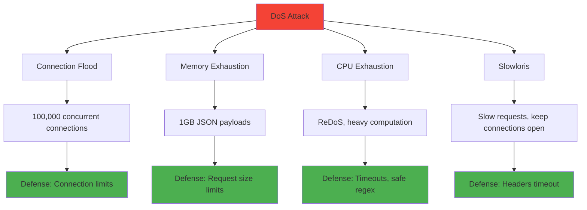
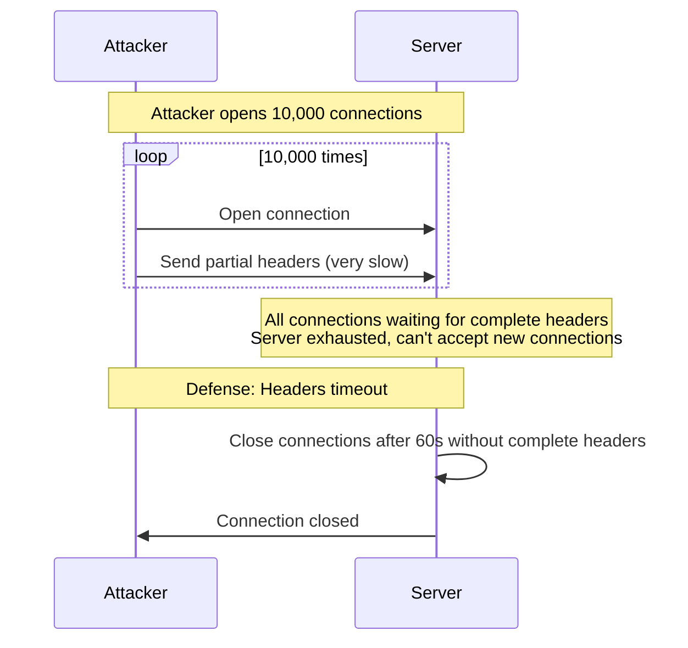
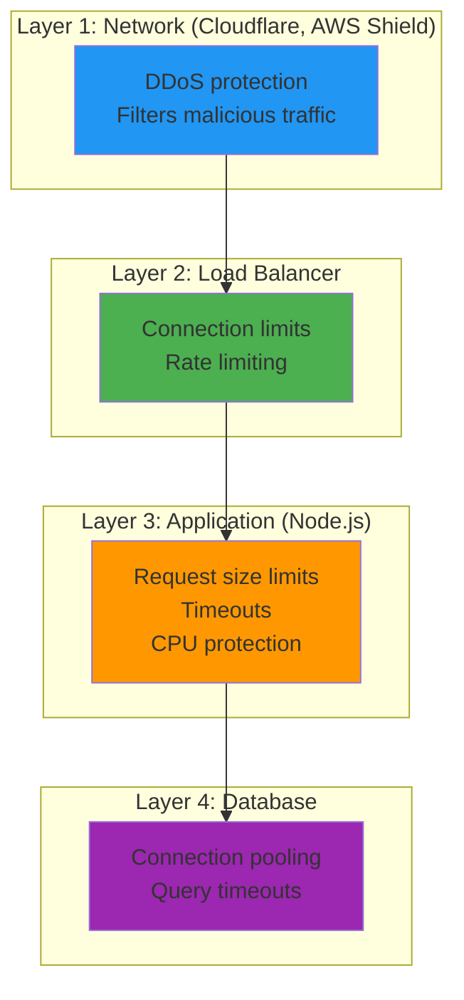

# DoS protection

## 1. Why this exists (Real-world problem first)

You're running an e-commerce API during Black Friday. An attacker (or even legitimate traffic) overwhelms your servers. What breaks:

- **Connection exhaustion**: 100,000 concurrent connections. Node.js event loop can't handle it, server crashes.
- **Memory exhaustion**: Attacker sends 1GB JSON payloads. Server tries to parse, runs out of memory, crashes.
- **CPU exhaustion**: Attacker sends regex that takes 10 seconds to evaluate (ReDoS). All CPU cores at 100%, server unresponsive.
- **Database connection pool exhaustion**: Every request queries database. Pool of 20 connections exhausted, requests queue up, timeout.
- **Slowloris attack**: Attacker opens 10,000 connections, sends data very slowly. Connections stay open for hours, exhausting server resources.

Real pain: A news website was hit by a DDoS attack during a major event. 1 million requests/second from a botnet. Their Node.js servers crashed within 30 seconds. The fix: Cloudflare DDoS protection + rate limiting + connection limits + request size limits.

**Another scenario**: A SaaS API had no request size limit. Attacker sent 10GB JSON payload. Node.js tried to parse it, consumed all memory, crashed. The fix: `express.json({ limit: '1mb' })`.

## 2. Mental model (build imagination)

Think of a restaurant during rush hour.

**Without DoS protection**:
- 1000 customers arrive simultaneously
- Kitchen is overwhelmed, can't cook fast enough
- Waiters are overwhelmed, can't serve
- Restaurant shuts down

**With DoS protection**:
- **Queue management**: Only 100 customers allowed inside, rest wait outside
- **Order limits**: Each customer can order max 5 items (prevent one customer from ordering 1000 items)
- **Time limits**: If customer takes > 30 minutes to order, they're asked to leave
- **Resource limits**: Kitchen has max capacity, stops accepting orders when full

**Key insight**: DoS protection is about **limiting resource consumption** per request and per client.

## 3. How Node.js implements this internally

### Request size limits

```javascript
const express = require('express');
const app = express();

// Limit JSON payload size
app.use(express.json({ limit: '1mb' }));

// Limit URL-encoded payload size
app.use(express.urlencoded({ limit: '1mb', extended: true }));

// Custom middleware for raw body size
app.use((req, res, next) => {
  let size = 0;
  req.on('data', (chunk) => {
    size += chunk.length;
    if (size > 1024 * 1024) { // 1MB
      req.connection.destroy();
      return res.status(413).json({ error: 'Payload too large' });
    }
  });
  next();
});
```

**What happens**:
1. Request arrives with large payload
2. Express starts parsing
3. If size > limit, parsing stops, 413 Payload Too Large returned
4. Memory is freed

### Connection limits

```javascript
const http = require('http');

const server = http.createServer(app);

// Limit max concurrent connections
server.maxConnections = 1000;

// Timeout idle connections
server.timeout = 30000; // 30 seconds

// Timeout headers (Slowloris protection)
server.headersTimeout = 60000; // 60 seconds
server.requestTimeout = 60000; // 60 seconds

server.listen(3000);
```

**What happens**:
1. Connection arrives
2. If `activeConnections >= maxConnections`, connection is rejected
3. If connection is idle for > timeout, it's closed
4. Prevents connection exhaustion

### CPU protection (timeout middleware)

```javascript
const timeout = require('connect-timeout');

// Timeout requests after 30 seconds
app.use(timeout('30s'));

app.use((req, res, next) => {
  if (!req.timedout) next();
});

app.get('/slow', async (req, res) => {
  // Simulate slow operation
  await new Promise(resolve => setTimeout(resolve, 60000)); // 60 seconds
  
  if (req.timedout) {
    return; // Don't send response if timed out
  }
  
  res.json({ data: 'result' });
});
```

**What happens**:
1. Request starts processing
2. After 30 seconds, `req.timedout` is set to true
3. Middleware stops processing, returns 503 Service Unavailable
4. Frees up resources

### ReDoS protection

```javascript
const safeRegex = require('safe-regex');

function validateInput(input) {
  const regex = /^(a+)+$/; // Vulnerable to ReDoS
  
  // Check if regex is safe
  if (!safeRegex(regex)) {
    throw new Error('Unsafe regex detected');
  }
  
  return regex.test(input);
}

// Alternative: Use timeout for regex
function safeRegexTest(regex, input, timeout = 1000) {
  return new Promise((resolve, reject) => {
    const timer = setTimeout(() => {
      reject(new Error('Regex timeout'));
    }, timeout);
    
    try {
      const result = regex.test(input);
      clearTimeout(timer);
      resolve(result);
    } catch (err) {
      clearTimeout(timer);
      reject(err);
    }
  });
}
```

## 4. Multiple diagrams (MANDATORY)

### DoS attack types



### Slowloris attack



### Memory exhaustion timeline


### DoS protection layers



## 5. Where this is used in real projects

### Production DoS protection

```javascript
const express = require('express');
const helmet = require('helmet');
const rateLimit = require('express-rate-limit');
const slowDown = require('express-slow-down');
const timeout = require('connect-timeout');

const app = express();

// 1. Security headers
app.use(helmet());

// 2. Request size limits
app.use(express.json({ limit: '1mb' }));
app.use(express.urlencoded({ limit: '1mb', extended: true }));

// 3. Rate limiting
const limiter = rateLimit({
  windowMs: 60 * 1000, // 1 minute
  max: 100, // 100 requests per minute
  message: 'Too many requests, please try again later',
});
app.use('/api/', limiter);

// 4. Slow down (progressive delay)
const speedLimiter = slowDown({
  windowMs: 60 * 1000,
  delayAfter: 50, // Allow 50 requests per minute at full speed
  delayMs: 500, // Add 500ms delay per request after 50
});
app.use('/api/', speedLimiter);

// 5. Request timeout
app.use(timeout('30s'));
app.use((req, res, next) => {
  if (!req.timedout) next();
});

// 6. Connection limits
const server = app.listen(3000);
server.maxConnections = 1000;
server.timeout = 30000;
server.headersTimeout = 60000;
server.requestTimeout = 60000;

// 7. Graceful shutdown
process.on('SIGTERM', () => {
  server.close(() => {
    console.log('Server closed');
    process.exit(0);
  });
});
```

### Memory monitoring and circuit breaker

```javascript
const CircuitBreaker = require('opossum');

// Monitor memory usage
function checkMemory() {
  const used = process.memoryUsage();
  const heapUsedMB = used.heapUsed / 1024 / 1024;
  const heapTotalMB = used.heapTotal / 1024 / 1024;
  
  if (heapUsedMB > heapTotalMB * 0.9) {
    console.error('Memory usage critical:', heapUsedMB, 'MB');
    return false;
  }
  
  return true;
}

// Circuit breaker for database queries
const breaker = new CircuitBreaker(async (query, params) => {
  return await db.query(query, params);
}, {
  timeout: 3000,
  errorThresholdPercentage: 50,
  resetTimeout: 30000,
});

breaker.fallback(() => ({ rows: [] }));

app.get('/api/data', async (req, res) => {
  // Check memory before processing
  if (!checkMemory()) {
    return res.status(503).json({ error: 'Service temporarily unavailable' });
  }
  
  try {
    const data = await breaker.fire('SELECT * FROM data LIMIT 100');
    res.json(data.rows);
  } catch (err) {
    res.status(503).json({ error: 'Service temporarily unavailable' });
  }
});
```

### Worker threads for CPU-intensive tasks

```javascript
const { Worker } = require('worker_threads');

app.post('/api/process', async (req, res) => {
  // Offload CPU-intensive work to worker thread
  const worker = new Worker('./worker.js', {
    workerData: req.body,
  });
  
  const timeout = setTimeout(() => {
    worker.terminate();
    res.status(408).json({ error: 'Request timeout' });
  }, 30000); // 30-second timeout
  
  worker.on('message', (result) => {
    clearTimeout(timeout);
    res.json(result);
  });
  
  worker.on('error', (err) => {
    clearTimeout(timeout);
    res.status(500).json({ error: 'Processing error' });
  });
});

// worker.js
const { parentPort, workerData } = require('worker_threads');

// CPU-intensive work
function processData(data) {
  // Heavy computation
  let result = 0;
  for (let i = 0; i < 1000000000; i++) {
    result += i;
  }
  return result;
}

parentPort.postMessage(processData(workerData));
```

### Backpressure handling

```javascript
const { Transform } = require('stream');

app.get('/api/large-dataset', (req, res) => {
  const query = db.query('SELECT * FROM large_table');
  
  // Transform stream with backpressure
  const transform = new Transform({
    objectMode: true,
    transform(chunk, encoding, callback) {
      // Process chunk
      const processed = JSON.stringify(chunk) + '\n';
      
      // Respect backpressure
      if (!this.push(processed)) {
        // Downstream is slow, pause upstream
        query.pause();
      }
      
      callback();
    },
  });
  
  transform.on('drain', () => {
    query.resume();
  });
  
  query.pipe(transform).pipe(res);
});
```

## 6. Where this should NOT be used

### Blocking event loop with sync operations

```javascript
// BAD: Synchronous crypto blocks event loop
app.post('/hash', (req, res) => {
  const hash = crypto.pbkdf2Sync(req.body.password, 'salt', 100000, 64, 'sha512');
  res.json({ hash: hash.toString('hex') });
});

// GOOD: Async crypto
app.post('/hash', async (req, res) => {
  const hash = await new Promise((resolve, reject) => {
    crypto.pbkdf2(req.body.password, 'salt', 100000, 64, 'sha512', (err, derivedKey) => {
      if (err) reject(err);
      else resolve(derivedKey);
    });
  });
  res.json({ hash: hash.toString('hex') });
});
```

### No timeout on external API calls

```javascript
// BAD: No timeout, external API can hang forever
app.get('/proxy', async (req, res) => {
  const response = await axios.get('https://slow-api.com/data');
  res.json(response.data);
});

// GOOD: Timeout on external calls
app.get('/proxy', async (req, res) => {
  try {
    const response = await axios.get('https://slow-api.com/data', {
      timeout: 5000, // 5-second timeout
    });
    res.json(response.data);
  } catch (err) {
    if (err.code === 'ECONNABORTED') {
      return res.status(504).json({ error: 'Gateway timeout' });
    }
    res.status(500).json({ error: 'Internal server error' });
  }
});
```

### Unbounded loops

```javascript
// BAD: Unbounded loop based on user input
app.post('/process', (req, res) => {
  const results = [];
  for (let i = 0; i < req.body.count; i++) { // User can set count = 1 billion!
    results.push(i * 2);
  }
  res.json(results);
});

// GOOD: Limit iterations
app.post('/process', (req, res) => {
  const count = Math.min(req.body.count, 10000); // Max 10,000
  const results = [];
  for (let i = 0; i < count; i++) {
    results.push(i * 2);
  }
  res.json(results);
});
```

## 7. Failure modes & edge cases

### Legitimate traffic spike

**Scenario**: Black Friday sale, 100,000 legitimate users hit your site simultaneously.

**Impact**: Rate limiting blocks legitimate users.

**Solution**: Auto-scaling, queue management, CAPTCHA to distinguish humans from bots.

### Slow database query

**Scenario**: Database query takes 60 seconds (missing index). Request times out, but query still runs.

**Impact**: Database is overwhelmed with slow queries.

**Solution**: Query timeout at database level, kill long-running queries.

```javascript
// Set statement timeout
await db.query('SET statement_timeout = 5000'); // 5 seconds
```

### Memory leak

**Scenario**: Application has memory leak. Memory usage grows over time.

**Impact**: Eventually runs out of memory, crashes.

**Solution**: Monitor memory, restart process when usage exceeds threshold, fix leak.

```javascript
setInterval(() => {
  const used = process.memoryUsage();
  const heapUsedMB = used.heapUsed / 1024 / 1024;
  
  if (heapUsedMB > 1024) { // 1GB
    console.error('Memory leak detected, restarting...');
    process.exit(1); // PM2 or Kubernetes will restart
  }
}, 60000); // Check every minute
```

### Amplification attack

**Scenario**: Attacker sends small request, triggers large response (e.g., 1KB request → 10MB response).

**Impact**: Bandwidth exhaustion.

**Solution**: Limit response size, pagination.

## 8. Trade-offs & alternatives

### What you gain
- **Availability**: Server stays up during attacks
- **Resource protection**: Prevents exhaustion
- **Cost control**: Limits resource usage

### What you sacrifice
- **Legitimate user impact**: Rate limits may block real users
- **Complexity**: Must tune limits, monitor metrics
- **Performance**: Timeout checks add overhead

### Alternatives

**CDN (Cloudflare, AWS CloudFront)**
- **Use case**: DDoS protection at edge
- **Benefit**: Filters attacks before reaching your server
- **Trade-off**: Cost, vendor lock-in

**Load balancer (NGINX, HAProxy)**
- **Use case**: Connection limits, rate limiting
- **Benefit**: Offloads work from Node.js
- **Trade-off**: Additional infrastructure

**WAF (Web Application Firewall)**
- **Use case**: Layer 7 DDoS protection
- **Benefit**: Detects and blocks malicious patterns
- **Trade-off**: Cost, false positives

**Auto-scaling**
- **Use case**: Handle traffic spikes
- **Benefit**: Scales resources automatically
- **Trade-off**: Cost, cold start latency

## 9. Interview-level articulation

**Question**: "How do you protect a Node.js API from DoS attacks?"

**Weak answer**: "Use rate limiting."

**Strong answer**: "I use multiple layers of DoS protection. At the network layer, I use Cloudflare or AWS Shield to filter DDoS traffic. At the application layer, I implement rate limiting (100 req/min per IP), request size limits (1MB max), connection limits (1000 max concurrent), and request timeouts (30 seconds). I protect against Slowloris attacks with headers timeout. For CPU-intensive tasks, I use worker threads to avoid blocking the event loop. I also implement circuit breakers for database queries to prevent cascading failures. For memory protection, I monitor heap usage and restart the process if it exceeds 90%. I use auto-scaling to handle legitimate traffic spikes."

**Follow-up**: "What's a Slowloris attack and how do you prevent it?"

**Answer**: "Slowloris is a DoS attack where the attacker opens thousands of connections and sends HTTP headers very slowly, one byte at a time. The server keeps these connections open waiting for complete headers, exhausting its connection pool. Legitimate users can't connect. I prevent it by setting `server.headersTimeout` to 60 seconds—if headers aren't complete within 60 seconds, the connection is closed. I also set `server.maxConnections` to limit total concurrent connections and use a reverse proxy like NGINX that's more resilient to Slowloris."

**Follow-up**: "How do you handle a legitimate traffic spike?"

**Answer**: "For legitimate spikes, I use auto-scaling to add more server instances. I implement queue management—if all servers are busy, requests wait in a queue with a timeout. I use a CDN to cache static assets and reduce load on the origin. I also implement graceful degradation—non-critical features are disabled during high load to preserve core functionality. For example, during Black Friday, I might disable recommendation engine to ensure checkout works. I monitor metrics (CPU, memory, request latency) and alert when thresholds are exceeded."

## 10. Key takeaways (engineer mindset)

**What to remember**:
- **DoS protection is multi-layered**: Network, load balancer, application, database
- **Limit everything**: Request size, connections, timeouts, iterations
- **Protect the event loop**: Use async operations, worker threads for CPU work
- **Monitor and alert**: Track memory, CPU, connection count
- **Graceful degradation**: Disable non-critical features under load

**What decisions this enables**:
- Choosing DoS protection strategy (CDN, WAF, rate limiting)
- Setting appropriate limits (request size, timeout, connections)
- Implementing circuit breakers and fallbacks
- Designing auto-scaling policies

**How it connects to other Node.js concepts**:
- **Event loop**: Blocking operations cause DoS
- **Worker threads**: Offload CPU-intensive work
- **Streams**: Handle backpressure for large datasets
- **Error handling**: Timeout errors, circuit breaker errors
- **Observability**: Monitor memory, CPU, request latency for DoS detection
