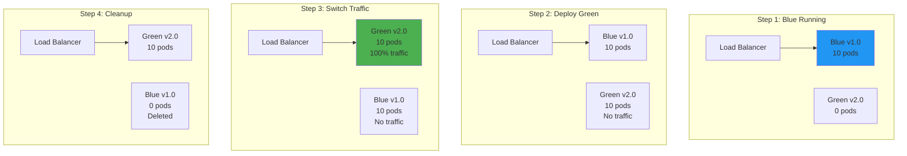
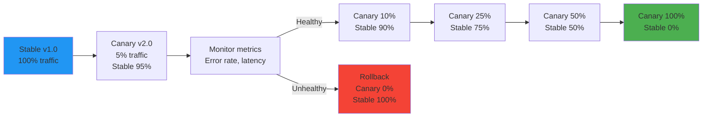
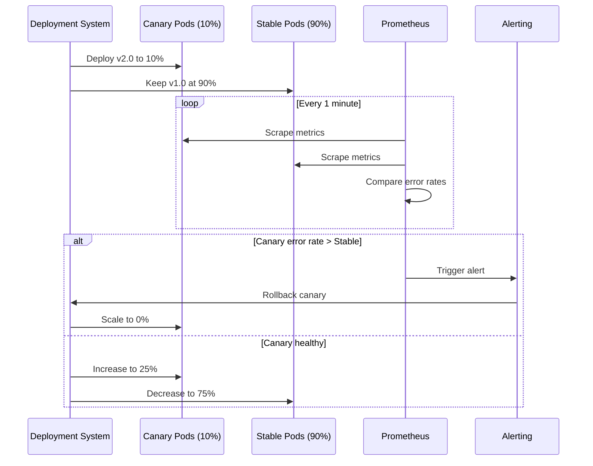

# Blue-green and canary deployments

## 1. Why this exists (Real-world problem first)

You're deploying a new version of your API to production. What breaks with traditional deployments:

- **All-or-nothing risk**: Deploy to all 100 servers simultaneously. New version has bug. All users affected. Site down.
- **No rollback**: Bug discovered after deployment. Takes 30 minutes to rollback. Lost $100K in sales.
- **No gradual validation**: Can't test new version with real traffic before full rollout.
- **Downtime during deployment**: Must stop old version before starting new version. 5 minutes of downtime.
- **Can't A/B test**: Want to compare old vs new version performance. No way to run both simultaneously.

Real pain: A payment service deployed new version to all servers. New version had memory leak. Within 10 minutes, all servers crashed. Payment processing down for 2 hours. Lost $5M in transactions. The fix: canary deployment—deploy to 5% of servers first, monitor, then gradually roll out.

**Another scenario**: An e-commerce site deployed new checkout flow. Conversion rate dropped 20%. Took 1 hour to notice and rollback. Lost $200K. With blue-green deployment, they could have instantly switched back to old version.

## 2. Mental model (build imagination)

Think of deployments as **changing lanes on a highway**.

**Traditional deployment (risky)**:
- All cars switch lanes simultaneously
- If new lane has obstacle, all cars crash
- Can't go back to old lane

**Blue-green deployment (safe)**:
- Build new lane (green) while old lane (blue) still running
- Test new lane with no traffic
- Switch all traffic to new lane instantly
- If problem, switch back to old lane instantly

**Canary deployment (gradual)**:
- Send 5% of cars to new lane
- Monitor: Are they crashing? Slowing down?
- If safe, send 10%, then 25%, then 50%, then 100%
- If problem at any stage, send all cars back to old lane

**Key insight**: Blue-green is **instant switch**, canary is **gradual rollout**.

## 3. How Node.js implements this internally

### Blue-green deployment with Kubernetes

```javascript
// No code changes needed in Node.js app
// Deployment is handled by Kubernetes

// Old version (blue) running
// Deploy new version (green) to separate pods
// Switch traffic from blue to green via service selector
```

**Kubernetes blue-green deployment**:
```yaml
# Blue deployment (current production)
apiVersion: apps/v1
kind: Deployment
metadata:
  name: app-blue
spec:
  replicas: 10
  selector:
    matchLabels:
      app: myapp
      version: blue
  template:
    metadata:
      labels:
        app: myapp
        version: blue
    spec:
      containers:
      - name: app
        image: myapp:1.0.0

---
# Green deployment (new version)
apiVersion: apps/v1
kind: Deployment
metadata:
  name: app-green
spec:
  replicas: 10
  selector:
    matchLabels:
      app: myapp
      version: green
  template:
    metadata:
      labels:
        app: myapp
        version: green
    spec:
      containers:
      - name: app
        image: myapp:2.0.0

---
# Service (controls which version receives traffic)
apiVersion: v1
kind: Service
metadata:
  name: app-service
spec:
  selector:
    app: myapp
    version: blue  # Switch to 'green' to deploy
  ports:
  - port: 80
    targetPort: 3000
```

**What happens**:
1. Blue deployment running, serving 100% traffic
2. Deploy green deployment (new version)
3. Green pods start, run health checks
4. Update service selector from `version: blue` to `version: green`
5. All traffic instantly switches to green
6. If problem, switch back to blue instantly

### Canary deployment with gradual rollout

```javascript
// Node.js app with version header
const express = require('express');
const app = express();

app.use((req, res, next) => {
  res.setHeader('X-App-Version', process.env.APP_VERSION);
  next();
});

app.listen(3000);
```

**Kubernetes canary deployment**:
```yaml
# Stable deployment (90% of traffic)
apiVersion: apps/v1
kind: Deployment
metadata:
  name: app-stable
spec:
  replicas: 9  # 90% of total
  template:
    metadata:
      labels:
        app: myapp
        track: stable
    spec:
      containers:
      - name: app
        image: myapp:1.0.0

---
# Canary deployment (10% of traffic)
apiVersion: apps/v1
kind: Deployment
metadata:
  name: app-canary
spec:
  replicas: 1  # 10% of total
  template:
    metadata:
      labels:
        app: myapp
        track: canary
    spec:
      containers:
      - name: app
        image: myapp:2.0.0

---
# Service (load balances across both)
apiVersion: v1
kind: Service
metadata:
  name: app-service
spec:
  selector:
    app: myapp  # Matches both stable and canary
  ports:
  - port: 80
    targetPort: 3000
```

**What happens**:
1. Stable deployment with 9 replicas (90% traffic)
2. Canary deployment with 1 replica (10% traffic)
3. Monitor canary metrics (error rate, latency)
4. If healthy, increase canary replicas to 3 (30%), decrease stable to 7
5. Continue until canary is 100%, stable is 0
6. If problem, scale canary to 0, stable to 10

## 4. Multiple diagrams (MANDATORY)

### Blue-green deployment flow



### Canary deployment progression



### Deployment strategies comparison

```mermaid
graph TB
    subgraph "Rolling Update"
        R1[Update 1 pod at a time] --> R2[Wait for health check]
        R2 --> R3[Update next pod]
        R3 --> R4[Gradual, no downtime<br/>⚠️ Both versions running]
    end
    
    subgraph "Blue-Green"
        BG1[Deploy all new pods] --> BG2[Switch traffic instantly]
        BG2 --> BG3[Instant rollback<br/>✅ Clean switch]
    end
    
    subgraph "Canary"
        C1[Deploy 5% new version] --> C2[Monitor metrics]
        C2 --> C3[Gradually increase %]
        C3 --> C4[Validate with real traffic<br/>✅ Low risk]
    end
    
    style R4 fill:#FF9800
    style BG3 fill:#4CAF50
    style C4 fill:#4CAF50
```



### Canary metrics monitoring



## 5. Where this is used in real projects

### Blue-green deployment script

```javascript
// deploy-blue-green.js
const k8s = require('@kubernetes/client-node');

async function blueGreenDeploy(newVersion) {
  const kc = new k8s.KubeConfig();
  kc.loadFromDefault();
  const k8sApi = kc.makeApiClient(k8s.AppsV1Api);
  const coreApi = kc.makeApiClient(k8s.CoreV1Api);
  
  console.log('Starting blue-green deployment...');
  
  // Step 1: Deploy green (new version)
  console.log('Deploying green version:', newVersion);
  await k8sApi.createNamespacedDeployment('default', {
    metadata: { name: 'app-green' },
    spec: {
      replicas: 10,
      selector: { matchLabels: { app: 'myapp', version: 'green' } },
      template: {
        metadata: { labels: { app: 'myapp', version: 'green' } },
        spec: {
          containers: [{
            name: 'app',
            image: `myapp:${newVersion}`,
          }],
        },
      },
    },
  });
  
  // Step 2: Wait for green to be ready
  console.log('Waiting for green pods to be ready...');
  await waitForDeployment('app-green');
  
  // Step 3: Run smoke tests on green
  console.log('Running smoke tests on green...');
  const smokeTestsPassed = await runSmokeTests('app-green');
  
  if (!smokeTestsPassed) {
    console.error('Smoke tests failed, rolling back...');
    await k8sApi.deleteNamespacedDeployment('app-green', 'default');
    process.exit(1);
  }
  
  // Step 4: Switch traffic to green
  console.log('Switching traffic to green...');
  await coreApi.patchNamespacedService('app-service', 'default', {
    spec: {
      selector: { app: 'myapp', version: 'green' },
    },
  });
  
  console.log('Traffic switched to green');
  
  // Step 5: Monitor for 5 minutes
  console.log('Monitoring green for 5 minutes...');
  await sleep(300000);
  
  const metrics = await getMetrics('app-green');
  if (metrics.errorRate > 1) {
    console.error('High error rate detected, rolling back...');
    await rollbackToBlue();
    process.exit(1);
  }
  
  // Step 6: Delete blue (old version)
  console.log('Deleting blue deployment...');
  await k8sApi.deleteNamespacedDeployment('app-blue', 'default');
  
  // Step 7: Rename green to blue for next deployment
  await k8sApi.patchNamespacedDeployment('app-green', 'default', {
    metadata: { name: 'app-blue' },
    spec: {
      selector: { matchLabels: { version: 'blue' } },
      template: { metadata: { labels: { version: 'blue' } } },
    },
  });
  
  console.log('Blue-green deployment complete!');
}

async function rollbackToBlue() {
  const coreApi = kc.makeApiClient(k8s.CoreV1Api);
  await coreApi.patchNamespacedService('app-service', 'default', {
    spec: {
      selector: { app: 'myapp', version: 'blue' },
    },
  });
  console.log('Rolled back to blue');
}
```

### Canary deployment with Flagger

```yaml
# Flagger automates canary deployments
apiVersion: flagger.app/v1beta1
kind: Canary
metadata:
  name: myapp
spec:
  targetRef:
    apiVersion: apps/v1
    kind: Deployment
    name: myapp
  service:
    port: 80
  analysis:
    interval: 1m
    threshold: 5  # Number of checks before promoting
    maxWeight: 50  # Max canary weight
    stepWeight: 10  # Increase by 10% each step
    metrics:
    - name: request-success-rate
      thresholdRange:
        min: 99  # 99% success rate required
      interval: 1m
    - name: request-duration
      thresholdRange:
        max: 500  # p99 latency < 500ms
      interval: 1m
  webhooks:
  - name: load-test
    url: http://flagger-loadtester/
    timeout: 5s
    metadata:
      cmd: "hey -z 1m -q 10 -c 2 http://myapp-canary/"
```

**What happens**:
1. Deploy new version
2. Flagger creates canary deployment with 0% traffic
3. Gradually increases traffic: 10%, 20%, 30%, 40%, 50%
4. At each step, checks metrics (success rate, latency)
5. If metrics pass, continues to next step
6. If metrics fail, rolls back to 0%
7. If all steps pass, promotes canary to 100%

### Feature flag-based canary

```javascript
const express = require('express');
const app = express();

// Feature flag service
const featureFlags = {
  useNewCheckout: false,  // Start with 0% rollout
};

app.post('/checkout', async (req, res) => {
  // Determine if user gets new version
  const userId = req.user.id;
  const rolloutPercentage = await getFeatureFlagRollout('useNewCheckout');
  const useNewVersion = (userId % 100) < rolloutPercentage;
  
  if (useNewVersion) {
    // New checkout flow (canary)
    return await newCheckoutFlow(req, res);
  } else {
    // Old checkout flow (stable)
    return await oldCheckoutFlow(req, res);
  }
});

// Gradually increase rollout
async function increaseRollout() {
  const currentRollout = await getFeatureFlagRollout('useNewCheckout');
  const metrics = await getMetrics('newCheckoutFlow');
  
  if (metrics.errorRate < 1 && metrics.p95Latency < 200) {
    // Metrics good, increase rollout by 10%
    await setFeatureFlagRollout('useNewCheckout', currentRollout + 10);
    console.log(`Increased rollout to ${currentRollout + 10}%`);
  } else {
    // Metrics bad, rollback
    await setFeatureFlagRollout('useNewCheckout', 0);
    console.log('Rolled back to 0%');
  }
}
```

## 6. Where this should NOT be used

### Database schema changes

```javascript
// BAD: Blue-green with incompatible schema
// Blue expects users.email, Green expects users.email_address
// Can't run both simultaneously

// GOOD: Backward-compatible migrations
// 1. Add users.email_address column
// 2. Deploy code that writes to both columns
// 3. Backfill data
// 4. Deploy code that reads from email_address
// 5. Drop users.email column
```

### Stateful applications

```javascript
// BAD: Blue-green with in-memory sessions
// User logs in on blue, session stored in memory
// Traffic switches to green, session lost, user logged out

// GOOD: External session store (Redis)
// Sessions stored in Redis, shared by blue and green
```

## 7. Failure modes & edge cases

### Rollback during active requests

**Scenario**: Switch from green to blue. 1000 requests in-flight on green.

**Impact**: Requests fail mid-processing.

**Solution**: Graceful shutdown—wait for in-flight requests to complete.

### Database migration incompatibility

**Scenario**: Green version requires new database column. Blue version doesn't know about it.

**Impact**: Can't rollback to blue after migration.

**Solution**: Backward-compatible migrations.

### Canary metrics misleading

**Scenario**: Canary gets 10% traffic, but all premium users. Higher error rate due to user type, not code.

**Impact**: False alarm, rollback unnecessarily.

**Solution**: Stratified sampling—ensure canary gets representative traffic.

## 8. Trade-offs & alternatives

### What you gain
- **Zero-downtime deployments**: Blue-green switches instantly
- **Easy rollback**: Switch back to old version in seconds
- **Gradual validation**: Canary tests with real traffic before full rollout

### What you sacrifice
- **Resource cost**: Blue-green requires 2x resources during deployment
- **Complexity**: Must manage two versions simultaneously
- **Database challenges**: Schema changes must be backward-compatible

### Alternatives

**Rolling update**
- **Use case**: Simple deployments
- **Benefit**: No extra resources needed
- **Trade-off**: Both versions running simultaneously

**Recreate**
- **Use case**: Non-critical apps
- **Benefit**: Simple
- **Trade-off**: Downtime during deployment

## 9. Interview-level articulation

**Question**: "What's the difference between blue-green and canary deployments?"

**Weak answer**: "Blue-green switches all traffic, canary is gradual."

**Strong answer**: "Blue-green deployment runs two identical environments—blue (current) and green (new). You deploy to green, test it, then switch all traffic from blue to green instantly. If there's a problem, you switch back to blue instantly. It's all-or-nothing. Canary deployment gradually rolls out the new version to a small percentage of traffic (e.g., 5%), monitors metrics like error rate and latency, and if healthy, gradually increases to 10%, 25%, 50%, 100%. If metrics degrade at any point, it rolls back. Blue-green is faster but riskier. Canary is slower but safer. I use blue-green for low-risk changes and canary for high-risk changes like new payment flows."

**Follow-up**: "How do you handle database migrations with blue-green deployments?"

**Answer**: "Database migrations must be backward-compatible so both blue and green can run simultaneously. I use a multi-step process: First, add new columns without removing old ones. Second, deploy code that writes to both old and new columns. Third, backfill data. Fourth, deploy code that reads from new columns. Fifth, remove old columns. This ensures I can rollback at any point without breaking the database. For breaking changes, I use feature flags to control which code path is active, allowing me to test the new schema with a small percentage of traffic before full rollout."

## 10. Key takeaways (engineer mindset)

**What to remember**:
- **Blue-green = instant switch**, canary = gradual rollout
- **Blue-green requires 2x resources** during deployment
- **Canary validates with real traffic** before full rollout
- **Database migrations must be backward-compatible**
- **Monitor metrics during canary** (error rate, latency)

**What decisions this enables**:
- Choosing deployment strategy (blue-green vs canary vs rolling)
- Designing backward-compatible database migrations
- Setting canary rollout percentages and thresholds
- Implementing automated rollback

**How it connects to other Node.js concepts**:
- **Health checks**: Used to determine if new version is ready
- **Graceful shutdown**: Ensures in-flight requests complete during rollback
- **Metrics**: Monitor canary performance
- **Feature flags**: Alternative to infrastructure-based canary
