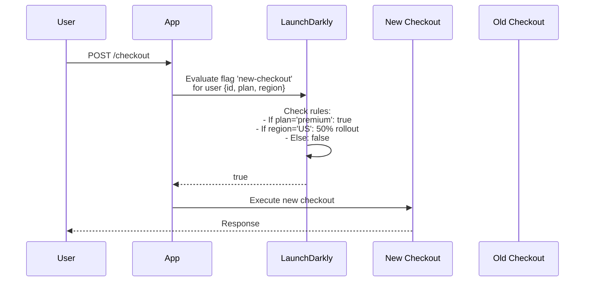
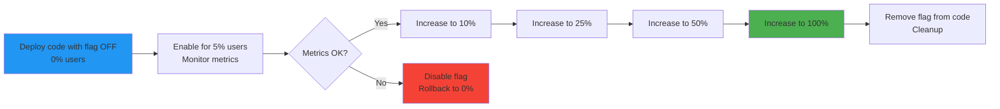
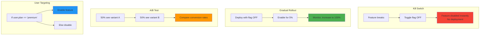
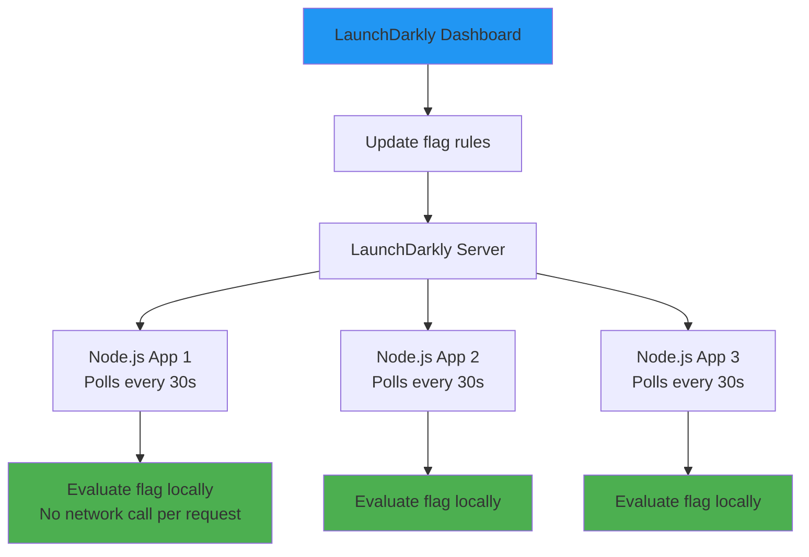

# Feature flags

## 1. Why this exists (Real-world problem first)

You're deploying a new checkout flow to production. What breaks without feature flags:

- **Can't test in production**: New code deployed to all users. Bug discovered. Must rollback entire deployment.
- **No gradual rollout**: Can't test with 5% of users first. All-or-nothing deployment.
- **Can't A/B test**: Want to compare old vs new checkout conversion rate. Must deploy to separate environments.
- **Emergency rollback requires deployment**: Critical bug found. Must redeploy old code. Takes 30 minutes.
- **Can't separate deployment from release**: Deploy code Friday, want to release Monday. Code sits inactive for 3 days.

Real pain: An e-commerce site deployed new recommendation algorithm. Conversion rate dropped 15%. Took 2 hours to rollback via deployment. Lost $300K. The fix: feature flag—toggle off new algorithm instantly, no deployment needed.

**Another scenario**: A payment service wanted to test new fraud detection. Deployed to production, false positive rate was 20%. Blocked legitimate transactions. With feature flag, they could have enabled for 1% of transactions, caught the issue early.

## 2. Mental model (build imagination)

Think of feature flags as **light switches** for your code.

**Without feature flags**:
- Code is hardwired—always on or always off
- To change behavior, must rewire (redeploy)
- Takes time, risky

**With feature flags**:
- Code has switch—can turn on/off instantly
- No rewiring (deployment) needed
- Can control who sees what (5% of users, premium users only, specific regions)

**Types of switches**:
- **Kill switch**: Turn off broken feature instantly
- **Gradual rollout**: 5% → 10% → 25% → 50% → 100%
- **A/B test**: 50% see A, 50% see B, compare metrics
- **Canary release**: New code deployed but inactive, enable for 5% to test

**Key insight**: Feature flags **decouple deployment from release**. Deploy code anytime, release when ready.

## 3. How Node.js implements this internally

### Basic feature flag implementation

```javascript
const express = require('express');
const app = express();

// Simple in-memory feature flags
const featureFlags = {
  newCheckout: false,
  newRecommendations: true,
  betaFeatures: false,
};

function isFeatureEnabled(flagName, userId) {
  const flag = featureFlags[flagName];
  
  if (typeof flag === 'boolean') {
    return flag;
  }
  
  // Percentage rollout
  if (flag.percentage) {
    return (userId % 100) < flag.percentage;
  }
  
  // User whitelist
  if (flag.users) {
    return flag.users.includes(userId);
  }
  
  return false;
}

app.post('/checkout', async (req, res) => {
  if (isFeatureEnabled('newCheckout', req.user.id)) {
    return await newCheckoutFlow(req, res);
  } else {
    return await oldCheckoutFlow(req, res);
  }
});
```

**What happens**:
1. Request arrives
2. Check if feature flag enabled for this user
3. Route to new or old code path
4. No deployment needed to change behavior

**Event loop impact**: Feature flag check is synchronous (fast, in-memory lookup).

### LaunchDarkly integration

```javascript
const LaunchDarkly = require('launchdarkly-node-server-sdk');

const ldClient = LaunchDarkly.init(process.env.LAUNCHDARKLY_SDK_KEY);

await ldClient.waitForInitialization();

app.post('/checkout', async (req, res) => {
  const user = {
    key: req.user.id.toString(),
    email: req.user.email,
    custom: {
      plan: req.user.plan, // 'free', 'premium'
      region: req.user.region,
    },
  };
  
  const useNewCheckout = await ldClient.variation('new-checkout', user, false);
  
  if (useNewCheckout) {
    return await newCheckoutFlow(req, res);
  } else {
    return await oldCheckoutFlow(req, res);
  }
});
```

**What happens**:
1. LaunchDarkly client fetches flag rules from server
2. Evaluates rules based on user attributes (plan, region, etc.)
3. Returns boolean (true/false)
4. Code routes accordingly

### Feature flag with metrics tracking

```javascript
const { Counter } = require('prom-client');

const featureFlagUsage = new Counter({
  name: 'feature_flag_usage_total',
  help: 'Feature flag usage count',
  labelNames: ['flag', 'variant'],
});

function trackFeatureFlag(flagName, variant) {
  featureFlagUsage.inc({ flag: flagName, variant });
}

app.post('/checkout', async (req, res) => {
  const useNewCheckout = await ldClient.variation('new-checkout', req.user, false);
  
  trackFeatureFlag('new-checkout', useNewCheckout ? 'new' : 'old');
  
  if (useNewCheckout) {
    return await newCheckoutFlow(req, res);
  } else {
    return await oldCheckoutFlow(req, res);
  }
});
```

## 4. Multiple diagrams (MANDATORY)

### Feature flag evaluation flow



### Gradual rollout with feature flags



### Feature flag types



### Feature flag architecture



## 5. Where this is used in real projects

### Production feature flag system

```javascript
const LaunchDarkly = require('launchdarkly-node-server-sdk');
const winston = require('winston');

const logger = winston.createLogger({
  format: winston.format.json(),
  transports: [new winston.transports.Console()],
});

class FeatureFlagService {
  constructor() {
    this.client = LaunchDarkly.init(process.env.LAUNCHDARKLY_SDK_KEY);
  }
  
  async initialize() {
    await this.client.waitForInitialization();
    logger.info('LaunchDarkly initialized');
  }
  
  async isEnabled(flagName, user, defaultValue = false) {
    try {
      const ldUser = {
        key: user.id.toString(),
        email: user.email,
        custom: {
          plan: user.plan,
          region: user.region,
          signupDate: user.signupDate,
        },
      };
      
      const value = await this.client.variation(flagName, ldUser, defaultValue);
      
      logger.info('Feature flag evaluated', {
        flag: flagName,
        userId: user.id,
        value,
      });
      
      return value;
    } catch (err) {
      logger.error('Feature flag evaluation failed', {
        flag: flagName,
        error: err.message,
      });
      return defaultValue;
    }
  }
  
  async close() {
    await this.client.close();
  }
}

const featureFlags = new FeatureFlagService();

// Initialize on startup
(async () => {
  await featureFlags.initialize();
})();

// Use in routes
app.post('/checkout', async (req, res) => {
  const useNewCheckout = await featureFlags.isEnabled('new-checkout', req.user);
  
  if (useNewCheckout) {
    return await newCheckoutFlow(req, res);
  } else {
    return await oldCheckoutFlow(req, res);
  }
});

// Graceful shutdown
process.on('SIGTERM', async () => {
  await featureFlags.close();
  process.exit(0);
});
```

### A/B testing with feature flags

```javascript
app.get('/recommendations', async (req, res) => {
  const variant = await featureFlags.client.variation('recommendation-algorithm', req.user, 'control');
  
  let recommendations;
  
  switch (variant) {
    case 'ml-based':
      recommendations = await getMLRecommendations(req.user);
      break;
    case 'collaborative-filtering':
      recommendations = await getCollaborativeRecommendations(req.user);
      break;
    case 'control':
    default:
      recommendations = await getDefaultRecommendations(req.user);
      break;
  }
  
  // Track which variant user saw
  await analytics.track({
    userId: req.user.id,
    event: 'recommendations_shown',
    properties: {
      variant,
      count: recommendations.length,
    },
  });
  
  res.json(recommendations);
});

// Later, compare conversion rates by variant
// SELECT variant, COUNT(*) as conversions
// FROM analytics
// WHERE event = 'purchase'
// GROUP BY variant
```

### Kill switch for emergency rollback

```javascript
app.post('/payment', async (req, res) => {
  // Check kill switch
  const paymentEnabled = await featureFlags.isEnabled('payment-processing', req.user, true);
  
  if (!paymentEnabled) {
    logger.warn('Payment processing disabled by kill switch', { userId: req.user.id });
    return res.status(503).json({ error: 'Payment processing temporarily unavailable' });
  }
  
  try {
    const payment = await processPayment(req.body);
    res.json({ paymentId: payment.id });
  } catch (err) {
    logger.error('Payment processing failed', { error: err.message });
    
    // If error rate spikes, automatically disable
    const errorRate = await getErrorRate('payment-processing');
    if (errorRate > 10) {
      await disableFeatureFlag('payment-processing');
      logger.error('Payment processing auto-disabled due to high error rate');
    }
    
    res.status(500).json({ error: 'Payment failed' });
  }
});
```

### Feature flag with user targeting

```javascript
// LaunchDarkly dashboard rules:
// - If user.plan == 'premium': true
// - If user.region == 'US': 50% rollout
// - If user.email ends with '@company.com': true (internal users)
// - Else: false

app.get('/beta-features', async (req, res) => {
  const hasBetaAccess = await featureFlags.isEnabled('beta-features', req.user);
  
  if (!hasBetaAccess) {
    return res.status(403).json({ error: 'Beta access not enabled for your account' });
  }
  
  const betaFeatures = await getBetaFeatures();
  res.json(betaFeatures);
});
```

## 6. Where this should NOT be used

### Long-lived feature flags

```javascript
// BAD: Feature flag in code for 2 years
if (await featureFlags.isEnabled('new-checkout', req.user)) {
  // This is the "new" checkout from 2 years ago
}

// GOOD: Remove flag after full rollout
// Just use the new code directly
await newCheckoutFlow(req, res);
```

### Too many flags

```javascript
// BAD: 50 feature flags in one function
async function processOrder(order) {
  if (await featureFlags.isEnabled('flag1')) { /* ... */ }
  if (await featureFlags.isEnabled('flag2')) { /* ... */ }
  // ... 48 more flags
  // Code is unreadable
}

// GOOD: Use flags sparingly, remove after rollout
```

### Feature flags for configuration

```javascript
// BAD: Using feature flags for config
const maxRetries = await featureFlags.isEnabled('max-retries', user, 3);

// GOOD: Use environment variables for config
const maxRetries = process.env.MAX_RETRIES || 3;
```

## 7. Failure modes & edge cases

### LaunchDarkly service down

**Scenario**: LaunchDarkly API is down. Can't fetch flag values.

**Impact**: All flags return default value. New features disabled.

**Solution**: Cache flag values locally, use cached values if API fails.

```javascript
const cache = new Map();

async function isEnabled(flagName, user, defaultValue) {
  try {
    const value = await ldClient.variation(flagName, user, defaultValue);
    cache.set(`${flagName}:${user.id}`, value);
    return value;
  } catch (err) {
    // Use cached value if available
    const cached = cache.get(`${flagName}:${user.id}`);
    if (cached !== undefined) {
      logger.warn('Using cached feature flag value', { flag: flagName });
      return cached;
    }
    return defaultValue;
  }
}
```

### Flag evaluation latency

**Scenario**: LaunchDarkly API call takes 500ms. Every request waits 500ms.

**Impact**: Slow response times.

**Solution**: LaunchDarkly client caches flags locally, evaluates in-memory (<1ms).

### Inconsistent flag state across instances

**Scenario**: Update flag in dashboard. Instance 1 polls immediately, Instance 2 polls in 30 seconds. Users see different behavior.

**Impact**: Inconsistent user experience.

**Solution**: Accept eventual consistency (30-second delay is acceptable for most use cases).

## 8. Trade-offs & alternatives

### What you gain
- **Instant rollback**: Toggle flag off, no deployment
- **Gradual rollout**: Test with 5% of users first
- **A/B testing**: Compare variants without separate deployments
- **Decouple deployment from release**: Deploy Friday, release Monday

### What you sacrifice
- **Code complexity**: If/else branches for every flag
- **Technical debt**: Old flags left in code for years
- **Dependency**: Relies on external service (LaunchDarkly)
- **Cost**: LaunchDarkly costs $8/seat/month

### Alternatives

**Environment variables**
- **Use case**: Simple on/off toggles
- **Benefit**: No external dependency
- **Trade-off**: Requires deployment to change

**Database flags**
- **Use case**: Self-hosted feature flags
- **Benefit**: No external dependency
- **Trade-off**: Must build UI, evaluation logic

**Split.io**
- **Use case**: Alternative to LaunchDarkly
- **Benefit**: Similar features
- **Trade-off**: Different pricing

## 9. Interview-level articulation

**Question**: "What are feature flags and why use them?"

**Weak answer**: "Feature flags let you turn features on and off."

**Strong answer**: "Feature flags decouple deployment from release. You deploy code with a flag set to 'off', then enable the flag for a percentage of users without redeploying. This enables gradual rollouts—deploy to 5% of users, monitor metrics, increase to 10%, 25%, 50%, 100%. If there's a problem, you toggle the flag off instantly without rolling back the deployment. Feature flags also enable A/B testing—show variant A to 50% of users, variant B to 50%, compare conversion rates. I use LaunchDarkly, which caches flag rules locally so evaluation is fast (<1ms). I track flag usage with Prometheus metrics and remove flags after full rollout to avoid technical debt."

**Follow-up**: "How do you prevent feature flag technical debt?"

**Answer**: "I set expiration dates on flags—every flag has a 'remove by' date. I use linters to detect flags older than 90 days and fail CI builds. After a flag reaches 100% rollout and is stable for 2 weeks, I remove it from code in a cleanup PR. I also limit the number of active flags—max 20 flags per service. If we hit the limit, we must remove old flags before adding new ones. I document each flag's purpose and owner in a central registry so we know which flags are safe to remove."

**Follow-up**: "How do you handle feature flag failures?"

**Answer**: "LaunchDarkly client caches flag rules locally, so if the LaunchDarkly API is down, we continue using cached values. I also implement a fallback—if flag evaluation fails and there's no cached value, I use the default value (usually 'off' for new features, 'on' for established features). I monitor LaunchDarkly client health with Prometheus metrics—track evaluation latency, cache hit rate, and API failures. If LaunchDarkly is down for >5 minutes, I get paged."

## 10. Key takeaways (engineer mindset)

**What to remember**:
- **Feature flags decouple deployment from release**
- **Use for gradual rollouts**: 5% → 10% → 25% → 50% → 100%
- **Remove flags after full rollout** to avoid technical debt
- **Cache flag values locally** for fast evaluation
- **Set expiration dates** on all flags

**What decisions this enables**:
- Choosing feature flag service (LaunchDarkly, Split.io, custom)
- Designing gradual rollout strategy
- Implementing A/B tests
- Planning flag cleanup and removal

**How it connects to other Node.js concepts**:
- **Deployment**: Decouple deployment from release
- **Metrics**: Track flag usage and variant performance
- **Error handling**: Handle flag evaluation failures gracefully
- **Observability**: Log which variant each user sees
