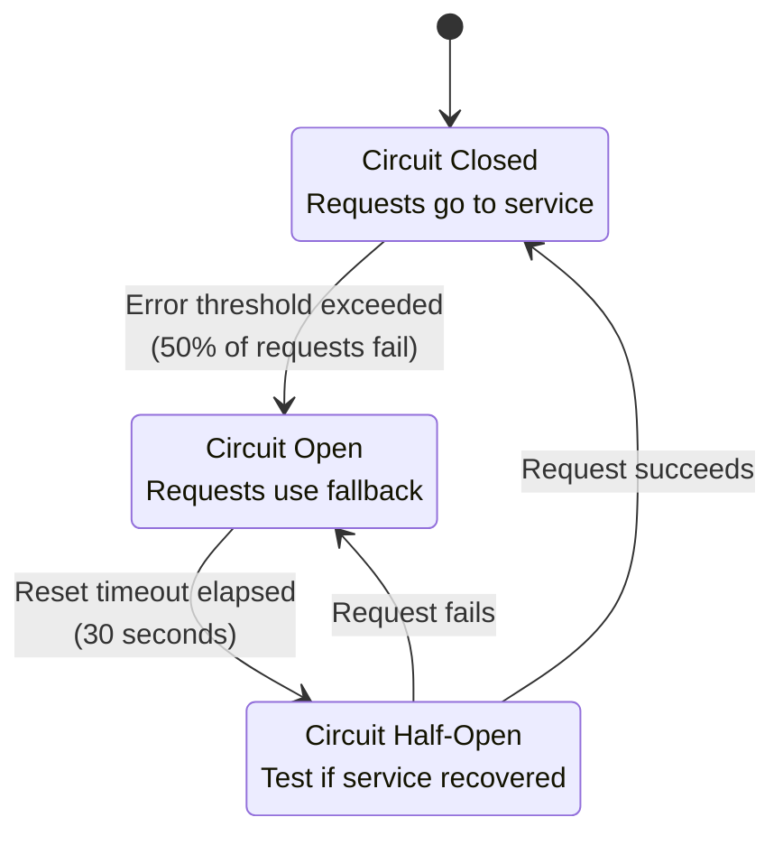
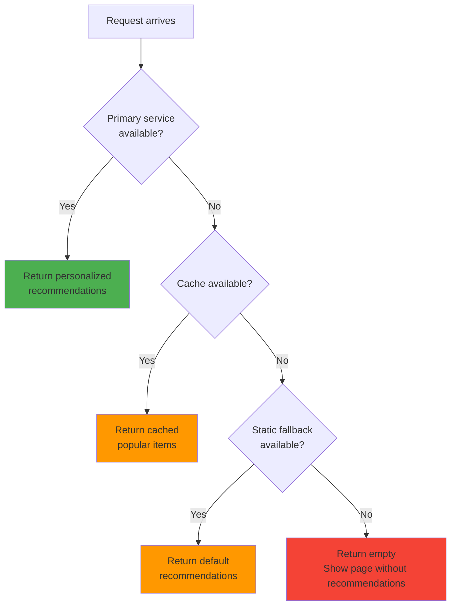
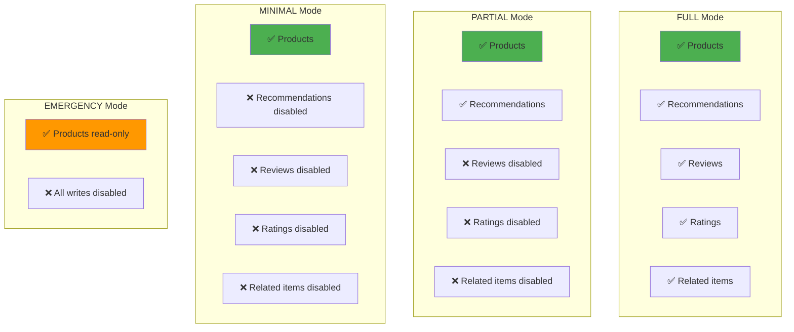
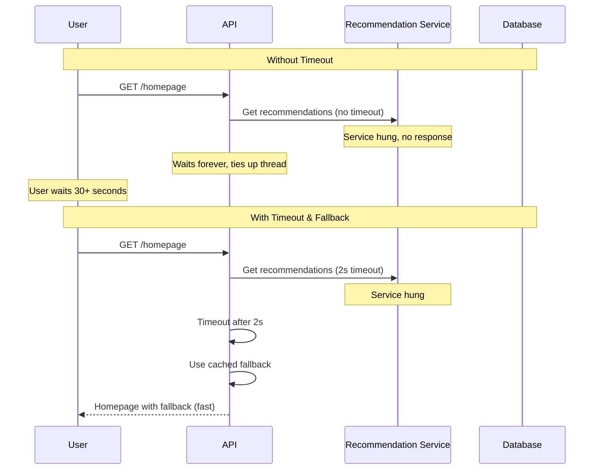

# Graceful degradation

## 1. Why this exists (Real-world problem first)

You're running an e-commerce platform. Your recommendation service goes down. What breaks without graceful degradation:

- **Entire site fails**: Homepage tries to load recommendations. Service is down. Homepage returns 500 error. Users can't browse or checkout.
- **Cascading failures**: Recommendation service timeout is 30 seconds. Every request waits 30 seconds. All servers become overloaded. Entire site crashes.
- **All-or-nothing**: Either recommendations work perfectly or site is completely broken. No middle ground.
- **Poor user experience**: User sees error page instead of products. Leaves site, goes to competitor.
- **Revenue loss**: Black Friday sale. Recommendation service down. Entire site down. Lost $5M in sales.

Real pain: A travel booking site's hotel recommendation service crashed during peak season. Without graceful degradation, the entire booking flow failed. Users couldn't book flights even though flight service was healthy. Lost $2M in bookings. The fix: graceful degradation—show flights without hotel recommendations.

**Another scenario**: A social media platform's image CDN went down. Without graceful degradation, entire feed failed to load. With graceful degradation, feed loaded with placeholder images, users could still read posts and comment.

## 2. Mental model (build imagination)

Think of graceful degradation as **backup plans** for your system.

**Without graceful degradation**:
- Car has GPS navigation
- GPS satellite connection lost
- Car becomes completely unusable (can't drive without GPS)

**With graceful degradation**:
- Car has GPS navigation
- GPS satellite connection lost
- Car falls back to: (1) cached map, (2) compass, (3) road signs
- Car still drivable, just less convenient

**In technical terms**:
- **Primary**: Personalized recommendations from ML service
- **Fallback 1**: Generic popular items from cache
- **Fallback 2**: Static default recommendations
- **Fallback 3**: No recommendations, show all products

**Key insight**: Graceful degradation means **reduced functionality**, not complete failure.

## 3. How Node.js implements this internally

### Circuit breaker pattern

```javascript
const CircuitBreaker = require('opossum');

// Wrap recommendation service call in circuit breaker
const breaker = new CircuitBreaker(async (userId) => {
  const response = await axios.get(`http://recommendation-service/users/${userId}/recommendations`, {
    timeout: 2000, // 2-second timeout
  });
  return response.data;
}, {
  timeout: 3000, // Circuit breaker timeout
  errorThresholdPercentage: 50, // Open circuit if 50% of requests fail
  resetTimeout: 30000, // Try again after 30 seconds
});

// Fallback function
breaker.fallback(async (userId) => {
  console.log('Recommendation service unavailable, using fallback');
  
  // Fallback 1: Get popular items from cache
  const cached = await redis.get('popular-items');
  if (cached) {
    return JSON.parse(cached);
  }
  
  // Fallback 2: Static default recommendations
  return [
    { id: 1, name: 'Product A' },
    { id: 2, name: 'Product B' },
    { id: 3, name: 'Product C' },
  ];
});

app.get('/homepage', async (req, res) => {
  try {
    const recommendations = await breaker.fire(req.user.id);
    res.render('homepage', { recommendations });
  } catch (err) {
    // Even fallback failed, show homepage without recommendations
    res.render('homepage', { recommendations: [] });
  }
});
```

**What happens**:
1. Request arrives
2. Circuit breaker calls recommendation service
3. If service fails or times out, circuit opens
4. Subsequent requests skip service, use fallback immediately
5. After 30 seconds, circuit tries service again (half-open)
6. If successful, circuit closes. If fails, stays open.

**Event loop impact**: Timeout is async (doesn't block). Circuit breaker state is in-memory (fast).

### Timeout and fallback

```javascript
async function getRecommendations(userId) {
  try {
    // Try primary service with timeout
    const response = await Promise.race([
      axios.get(`http://recommendation-service/users/${userId}/recommendations`),
      new Promise((_, reject) => setTimeout(() => reject(new Error('Timeout')), 2000)),
    ]);
    
    return response.data;
  } catch (err) {
    console.warn('Recommendation service failed, using fallback:', err.message);
    
    // Fallback: Get from cache
    const cached = await redis.get(`recommendations:${userId}`);
    if (cached) {
      return JSON.parse(cached);
    }
    
    // Final fallback: Popular items
    return await getPopularItems();
  }
}
```

### Feature degradation levels

```javascript
const DEGRADATION_LEVELS = {
  FULL: 'full',           // All features enabled
  PARTIAL: 'partial',     // Non-critical features disabled
  MINIMAL: 'minimal',     // Only core features enabled
  EMERGENCY: 'emergency', // Read-only mode
};

let currentLevel = DEGRADATION_LEVELS.FULL;

app.get('/homepage', async (req, res) => {
  const data = {
    products: await getProducts(), // Always available
  };
  
  if (currentLevel === DEGRADATION_LEVELS.FULL || currentLevel === DEGRADATION_LEVELS.PARTIAL) {
    try {
      data.recommendations = await getRecommendations(req.user.id);
    } catch (err) {
      console.warn('Recommendations unavailable');
    }
  }
  
  if (currentLevel === DEGRADATION_LEVELS.FULL) {
    try {
      data.reviews = await getReviews();
    } catch (err) {
      console.warn('Reviews unavailable');
    }
  }
  
  res.render('homepage', data);
});

// Monitor system health and adjust degradation level
setInterval(async () => {
  const health = await checkSystemHealth();
  
  if (health.cpu > 90 || health.errorRate > 10) {
    currentLevel = DEGRADATION_LEVELS.MINIMAL;
    console.log('Degraded to MINIMAL mode');
  } else if (health.cpu > 70 || health.errorRate > 5) {
    currentLevel = DEGRADATION_LEVELS.PARTIAL;
    console.log('Degraded to PARTIAL mode');
  } else {
    currentLevel = DEGRADATION_LEVELS.FULL;
  }
}, 60000); // Check every minute
```

## 4. Multiple diagrams (MANDATORY)

### Circuit breaker states



### Graceful degradation flow



### Degradation levels



### Timeout cascade prevention



## 5. Where this is used in real projects

### Production circuit breaker implementation

```javascript
const CircuitBreaker = require('opossum');
const Redis = require('ioredis');

const redis = new Redis();

// Circuit breaker for recommendation service
const recommendationBreaker = new CircuitBreaker(async (userId) => {
  const response = await axios.get(`http://recommendation-service/users/${userId}`, {
    timeout: 2000,
  });
  return response.data.recommendations;
}, {
  timeout: 3000,
  errorThresholdPercentage: 50,
  resetTimeout: 30000,
  volumeThreshold: 10, // Minimum requests before opening circuit
});

// Fallback with multiple layers
recommendationBreaker.fallback(async (userId) => {
  console.log('Using recommendation fallback for user:', userId);
  
  // Layer 1: User-specific cache
  const userCache = await redis.get(`rec:user:${userId}`);
  if (userCache) {
    return JSON.parse(userCache);
  }
  
  // Layer 2: Popular items cache
  const popularCache = await redis.get('rec:popular');
  if (popularCache) {
    return JSON.parse(popularCache);
  }
  
  // Layer 3: Static defaults
  return [
    { id: 1, name: 'Bestseller 1', price: 29.99 },
    { id: 2, name: 'Bestseller 2', price: 39.99 },
    { id: 3, name: 'Bestseller 3', price: 49.99 },
  ];
});

// Monitor circuit breaker events
recommendationBreaker.on('open', () => {
  console.error('Recommendation circuit opened');
  // Alert on-call engineer
});

recommendationBreaker.on('halfOpen', () => {
  console.log('Recommendation circuit half-open, testing service');
});

recommendationBreaker.on('close', () => {
  console.log('Recommendation circuit closed, service recovered');
});

app.get('/homepage', async (req, res) => {
  const [products, recommendations] = await Promise.all([
    getProducts(), // Critical, no fallback
    recommendationBreaker.fire(req.user.id).catch(() => []), // Non-critical, fallback to empty
  ]);
  
  res.render('homepage', { products, recommendations });
});
```

### Adaptive degradation based on load

```javascript
const os = require('os');

class DegradationManager {
  constructor() {
    this.level = 'FULL';
    this.startMonitoring();
  }
  
  startMonitoring() {
    setInterval(() => {
      const cpuUsage = os.loadavg()[0] / os.cpus().length * 100;
      const memoryUsage = (1 - os.freemem() / os.totalmem()) * 100;
      
      if (cpuUsage > 90 || memoryUsage > 90) {
        this.level = 'EMERGENCY';
        console.error('EMERGENCY mode: CPU or memory critical');
      } else if (cpuUsage > 70 || memoryUsage > 80) {
        this.level = 'MINIMAL';
        console.warn('MINIMAL mode: High resource usage');
      } else if (cpuUsage > 50 || memoryUsage > 70) {
        this.level = 'PARTIAL';
        console.log('PARTIAL mode: Moderate resource usage');
      } else {
        this.level = 'FULL';
      }
    }, 10000); // Check every 10 seconds
  }
  
  isFeatureEnabled(feature) {
    const features = {
      FULL: ['recommendations', 'reviews', 'ratings', 'related'],
      PARTIAL: ['recommendations', 'reviews'],
      MINIMAL: ['recommendations'],
      EMERGENCY: [],
    };
    
    return features[this.level].includes(feature);
  }
}

const degradation = new DegradationManager();

app.get('/product/:id', async (req, res) => {
  const product = await getProduct(req.params.id);
  
  const data = { product };
  
  if (degradation.isFeatureEnabled('reviews')) {
    data.reviews = await getReviews(req.params.id).catch(() => []);
  }
  
  if (degradation.isFeatureEnabled('recommendations')) {
    data.related = await getRelatedProducts(req.params.id).catch(() => []);
  }
  
  res.render('product', data);
});
```

### Retry with exponential backoff

```javascript
async function retryWithBackoff(fn, maxRetries = 3) {
  for (let i = 0; i < maxRetries; i++) {
    try {
      return await fn();
    } catch (err) {
      if (i === maxRetries - 1) {
        throw err; // Last retry failed
      }
      
      const delay = Math.min(1000 * Math.pow(2, i), 10000); // Max 10 seconds
      console.log(`Retry ${i + 1}/${maxRetries} after ${delay}ms`);
      await new Promise(resolve => setTimeout(resolve, delay));
    }
  }
}

app.get('/data', async (req, res) => {
  try {
    const data = await retryWithBackoff(async () => {
      return await axios.get('http://external-api/data', { timeout: 2000 });
    });
    
    res.json(data.data);
  } catch (err) {
    // All retries failed, use fallback
    const fallback = await getCachedData();
    res.json(fallback);
  }
});
```

## 6. Where this should NOT be used

### Critical operations

```javascript
// BAD: Graceful degradation for payments
app.post('/payment', async (req, res) => {
  try {
    await processPayment(req.body);
  } catch (err) {
    // Silently fail, pretend payment succeeded
    res.json({ success: true }); // NEVER!
  }
});

// GOOD: Fail loudly for critical operations
app.post('/payment', async (req, res) => {
  try {
    await processPayment(req.body);
    res.json({ success: true });
  } catch (err) {
    res.status(500).json({ error: 'Payment failed' });
  }
});
```

### Security checks

```javascript
// BAD: Degrade authentication
app.get('/admin', async (req, res) => {
  try {
    await verifyAdmin(req.user);
  } catch (err) {
    // Auth service down, allow anyway
    console.warn('Auth service down, allowing access'); // NEVER!
  }
  
  res.json({ adminData });
});

// GOOD: Fail closed for security
app.get('/admin', async (req, res) => {
  try {
    await verifyAdmin(req.user);
    res.json({ adminData });
  } catch (err) {
    res.status(403).json({ error: 'Unauthorized' });
  }
});
```

## 7. Failure modes & edge cases

### Fallback also fails

**Scenario**: Primary service fails, fallback cache also fails.

**Impact**: No data to show.

**Solution**: Multiple fallback layers, final fallback is static data.

### Circuit breaker stuck open

**Scenario**: Service recovers but circuit stays open.

**Impact**: Requests use fallback even though service is healthy.

**Solution**: Circuit breaker automatically tries service after reset timeout (half-open state).

### Inconsistent degradation across instances

**Scenario**: Instance 1 degrades to MINIMAL, Instance 2 stays at FULL.

**Impact**: Users see different features depending on which instance they hit.

**Solution**: Centralized degradation state (Redis) or accept eventual consistency.

## 8. Trade-offs & alternatives

### What you gain
- **Resilience**: System stays up even when dependencies fail
- **Better UX**: Reduced functionality better than complete failure
- **Prevents cascades**: Timeouts prevent one failure from bringing down entire system

### What you sacrifice
- **Complexity**: Must implement fallbacks for every dependency
- **Inconsistency**: Users may see different features at different times
- **Cache staleness**: Fallback data may be outdated

### Alternatives

**Retry logic**
- **Use case**: Transient failures
- **Benefit**: Simple
- **Trade-off**: Can make cascading failures worse

**Bulkhead pattern**
- **Use case**: Isolate failures
- **Benefit**: One service failure doesn't affect others
- **Trade-off**: More complex architecture

## 9. Interview-level articulation

**Question**: "What is graceful degradation and why is it important?"

**Weak answer**: "It's when your system still works when something fails."

**Strong answer**: "Graceful degradation means reducing functionality instead of complete failure when dependencies are unavailable. For example, if the recommendation service is down, instead of failing the entire homepage, I show the homepage without recommendations or with cached popular items. I implement this with circuit breakers using the opossum library. The circuit breaker wraps external service calls with a timeout (2 seconds). If the service fails or times out, the circuit opens and subsequent requests use a fallback immediately without calling the service. After 30 seconds, the circuit tries the service again (half-open state). If successful, it closes. I also implement multiple fallback layers: user-specific cache, popular items cache, static defaults. This prevents cascading failures and ensures users can still use core features even when non-critical services are down."

**Follow-up**: "How do you decide what to degrade?"

**Answer**: "I categorize features into critical and non-critical. Critical features like checkout, login, and payment must always work—if they fail, I return an error. Non-critical features like recommendations, reviews, and ratings can degrade gracefully. I also implement degradation levels: FULL (all features), PARTIAL (disable reviews and ratings), MINIMAL (only core features), EMERGENCY (read-only mode). I monitor CPU and memory usage—if CPU exceeds 90%, I automatically degrade to EMERGENCY mode. I also use feature flags to manually control degradation during incidents."

## 10. Key takeaways (engineer mindset)

**What to remember**:
- **Graceful degradation = reduced functionality, not complete failure**
- **Use circuit breakers** to prevent cascading failures
- **Implement multiple fallback layers**: cache, static defaults, empty
- **Categorize features**: critical (must work) vs non-critical (can degrade)
- **Set timeouts** on all external calls (2-5 seconds)

**What decisions this enables**:
- Choosing which features to degrade
- Implementing circuit breaker thresholds
- Designing fallback strategies
- Setting timeout values

**How it connects to other Node.js concepts**:
- **Error handling**: Graceful degradation is sophisticated error handling
- **Caching**: Fallbacks often use cached data
- **Timeouts**: Prevent event loop blocking
- **Observability**: Monitor circuit breaker state, degradation level
