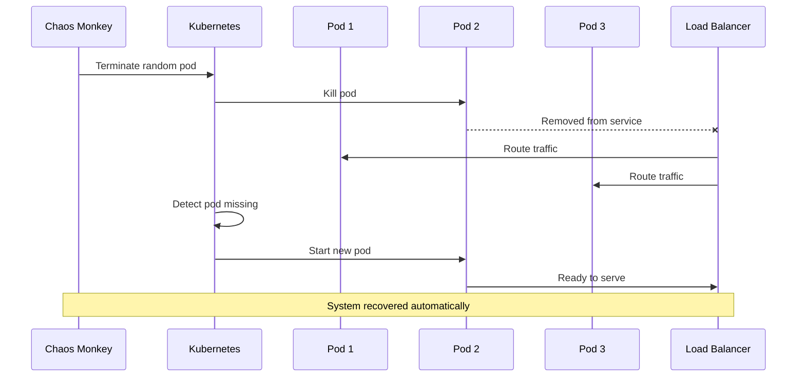
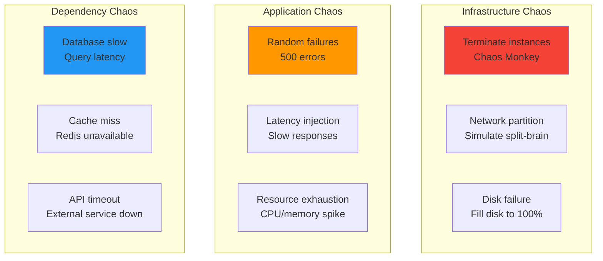
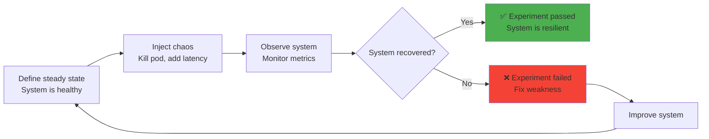
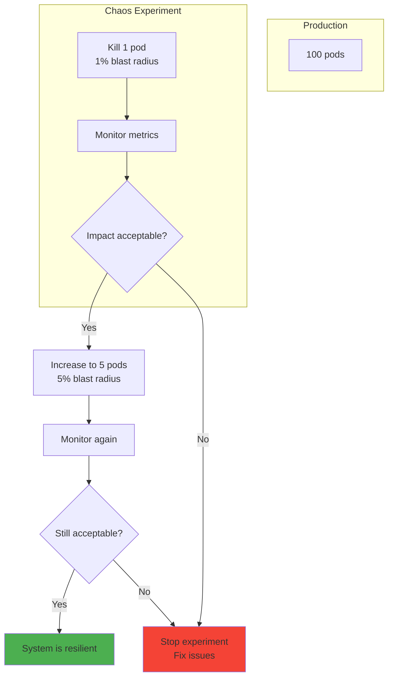

# Chaos testing basics

## 1. Why this exists (Real-world problem first)

You're running a production system. Everything works in staging. You deploy to production. What breaks:

- **Hidden single points of failure**: Database goes down. Entire system crashes. You didn't know database was single point of failure.
- **Untested failure scenarios**: Network partition between services. System behaves unpredictably. Never tested this scenario.
- **False confidence**: All tests pass. System works in staging. Fails in production under real load and real failures.
- **Cascading failures**: One service slow. Other services timeout waiting. Entire system becomes unavailable.
- **No disaster recovery practice**: Backup system exists but never tested. When primary fails, backup also fails.

Real pain: Netflix had a massive AWS outage in 2011. Entire service down for hours. They realized they never tested what happens when AWS fails. The fix: Chaos Monkey—randomly terminates production instances to ensure system can handle failures.

**Another scenario**: A payment service had redundant databases. Primary database failed. Automatic failover to replica didn't work—never tested in production. Lost $1M in transactions. With chaos testing, they would have caught this.

## 2. Mental model (build imagination)

Think of chaos testing as **fire drills** for your system.

**Without chaos testing**:
- Building has fire exits, sprinklers, alarms
- Never tested
- Real fire happens, people don't know where exits are, sprinklers don't work
- Disaster

**With chaos testing**:
- Regular fire drills
- Test exits, sprinklers, alarms
- When real fire happens, everyone knows what to do
- Safe evacuation

**In technical terms**:
- **Chaos Monkey**: Randomly terminates instances
- **Latency Monkey**: Adds random delays
- **Network Partition**: Simulates network failures
- **Resource Exhaustion**: Simulates CPU/memory spikes

**Key insight**: Chaos testing **proactively finds weaknesses** before they cause real outages.

## 3. How Node.js implements this internally

### Basic chaos testing with random failures

```javascript
const express = require('express');
const app = express();

// Chaos middleware: Randomly fail requests
const CHAOS_ENABLED = process.env.CHAOS_ENABLED === 'true';
const CHAOS_FAILURE_RATE = parseFloat(process.env.CHAOS_FAILURE_RATE || '0.01'); // 1%

app.use((req, res, next) => {
  if (CHAOS_ENABLED && Math.random() < CHAOS_FAILURE_RATE) {
    console.log('Chaos: Injecting random failure');
    return res.status(500).json({ error: 'Chaos-induced failure' });
  }
  next();
});

// Chaos middleware: Randomly add latency
const CHAOS_LATENCY_RATE = parseFloat(process.env.CHAOS_LATENCY_RATE || '0.05'); // 5%

app.use(async (req, res, next) => {
  if (CHAOS_ENABLED && Math.random() < CHAOS_LATENCY_RATE) {
    const delay = Math.random() * 5000; // 0-5 seconds
    console.log(`Chaos: Injecting ${delay}ms latency`);
    await new Promise(resolve => setTimeout(resolve, delay));
  }
  next();
});

app.listen(3000);
```

**What happens**:
1. Request arrives
2. Chaos middleware checks if should inject failure
3. 1% of requests fail randomly
4. 5% of requests have random latency
5. Tests system's resilience to failures

**Event loop impact**: Latency injection uses setTimeout (async, doesn't block other requests).

### Chaos testing with Chaos Toolkit

```yaml
# chaos-experiment.yaml
version: 1.0.0
title: Kill random pod and verify system recovers
description: Terminate a random pod and ensure traffic continues

steady-state-hypothesis:
  title: System is healthy
  probes:
  - name: all-pods-running
    type: probe
    provider:
      type: python
      module: chaosk8s.pod.probes
      func: pods_in_phase
      arguments:
        label_selector: app=myapp
        phase: Running
        ns: default
    tolerance: 3  # At least 3 pods running

method:
  - type: action
    name: terminate-random-pod
    provider:
      type: python
      module: chaosk8s.pod.actions
      func: terminate_pods
      arguments:
        label_selector: app=myapp
        ns: default
        qty: 1  # Kill 1 pod
        rand: true  # Random pod

rollbacks:
  - type: action
    name: scale-up
    provider:
      type: python
      module: chaosk8s.deployment.actions
      func: scale_deployment
      arguments:
        name: myapp
        ns: default
        replicas: 3
```

**Run experiment**:
```bash
chaos run chaos-experiment.yaml
```

### Network latency injection with Toxiproxy

```javascript
const Toxiproxy = require('toxiproxy-node-client');

const toxiproxy = new Toxiproxy('http://toxiproxy:8474');

// Create proxy for database
await toxiproxy.create({
  name: 'database',
  listen: '0.0.0.0:5433',  // Proxy port
  upstream: 'postgres:5432', // Real database
});

// Add latency toxic
await toxiproxy.get('database').addToxic({
  type: 'latency',
  attributes: {
    latency: 1000, // 1 second delay
    jitter: 500,   // ±500ms jitter
  },
});

// Now connect to proxy instead of real database
const db = new Pool({
  host: 'toxiproxy',
  port: 5433, // Proxy port
});

// Test how system handles slow database
```

## 4. Multiple diagrams (MANDATORY)

### Chaos Monkey flow



### Chaos testing types



### Chaos experiment lifecycle



### Blast radius control



## 5. Where this is used in real projects

### Production chaos testing with Chaos Monkey

```javascript
// chaos-monkey.js
const k8s = require('@kubernetes/client-node');

class ChaosMonkey {
  constructor(options = {}) {
    this.enabled = options.enabled || false;
    this.interval = options.interval || 3600000; // 1 hour
    this.targetLabel = options.targetLabel || 'chaos=enabled';
    
    const kc = new k8s.KubeConfig();
    kc.loadFromDefault();
    this.k8sApi = kc.makeApiClient(k8s.CoreV1Api);
  }
  
  async start() {
    if (!this.enabled) {
      console.log('Chaos Monkey disabled');
      return;
    }
    
    console.log('Chaos Monkey started');
    
    setInterval(async () => {
      await this.terminateRandomPod();
    }, this.interval);
  }
  
  async terminateRandomPod() {
    try {
      // Get all pods with chaos label
      const response = await this.k8sApi.listNamespacedPod(
        'default',
        undefined,
        undefined,
        undefined,
        undefined,
        this.targetLabel
      );
      
      const pods = response.body.items;
      
      if (pods.length === 0) {
        console.log('No pods with chaos label found');
        return;
      }
      
      // Select random pod
      const randomPod = pods[Math.floor(Math.random() * pods.length)];
      
      console.log(`Chaos Monkey terminating pod: ${randomPod.metadata.name}`);
      
      // Delete pod
      await this.k8sApi.deleteNamespacedPod(
        randomPod.metadata.name,
        'default'
      );
      
      console.log(`Pod ${randomPod.metadata.name} terminated`);
    } catch (err) {
      console.error('Chaos Monkey error:', err.message);
    }
  }
}

// Start Chaos Monkey
const chaosMonkey = new ChaosMonkey({
  enabled: process.env.CHAOS_MONKEY_ENABLED === 'true',
  interval: 3600000, // Kill 1 pod per hour
  targetLabel: 'chaos=enabled',
});

chaosMonkey.start();
```

### Latency injection middleware

```javascript
const express = require('express');
const app = express();

class LatencyInjector {
  constructor(options = {}) {
    this.enabled = options.enabled || false;
    this.rate = options.rate || 0.1; // 10%
    this.minLatency = options.minLatency || 1000; // 1s
    this.maxLatency = options.maxLatency || 5000; // 5s
  }
  
  middleware() {
    return async (req, res, next) => {
      if (this.enabled && Math.random() < this.rate) {
        const latency = Math.random() * (this.maxLatency - this.minLatency) + this.minLatency;
        console.log(`Injecting ${latency}ms latency for ${req.path}`);
        await new Promise(resolve => setTimeout(resolve, latency));
      }
      next();
    };
  }
}

const latencyInjector = new LatencyInjector({
  enabled: process.env.LATENCY_CHAOS_ENABLED === 'true',
  rate: 0.1,
  minLatency: 1000,
  maxLatency: 5000,
});

app.use(latencyInjector.middleware());
```

### Resource exhaustion simulation

```javascript
// Simulate CPU spike
function simulateCPUSpike(durationMs) {
  console.log(`Simulating CPU spike for ${durationMs}ms`);
  const start = Date.now();
  
  while (Date.now() - start < durationMs) {
    // Busy loop to consume CPU
    Math.sqrt(Math.random());
  }
  
  console.log('CPU spike ended');
}

// Simulate memory leak
function simulateMemoryLeak(sizeMB) {
  console.log(`Simulating memory leak: ${sizeMB}MB`);
  const leak = [];
  
  for (let i = 0; i < sizeMB; i++) {
    // Allocate 1MB
    leak.push(new Array(1024 * 1024).fill('x'));
  }
  
  // Keep reference to prevent GC
  global.memoryLeak = leak;
}

// Chaos endpoint to trigger experiments
app.post('/chaos/cpu-spike', (req, res) => {
  const duration = req.body.duration || 5000;
  simulateCPUSpike(duration);
  res.json({ message: `CPU spike for ${duration}ms` });
});

app.post('/chaos/memory-leak', (req, res) => {
  const size = req.body.sizeMB || 100;
  simulateMemoryLeak(size);
  res.json({ message: `Memory leak: ${size}MB` });
});
```

## 6. Where this should NOT be used

### Production without safeguards

```javascript
// BAD: Chaos testing in production without limits
const chaosMonkey = new ChaosMonkey({
  enabled: true,
  interval: 60000, // Kill pod every minute!
  // No blast radius control
});

// GOOD: Chaos testing with safeguards
const chaosMonkey = new ChaosMonkey({
  enabled: process.env.NODE_ENV === 'production' && process.env.CHAOS_ENABLED === 'true',
  interval: 3600000, // Kill 1 pod per hour
  maxPodsToKill: 1, // Max 1 pod at a time
  excludeLabels: ['critical=true'], // Don't kill critical pods
});
```

### Critical systems without approval

```javascript
// BAD: Chaos testing on payment service without approval
// Could cause real financial loss

// GOOD: Chaos testing on non-critical services first
// Or in staging environment
```

## 7. Failure modes & edge cases

### Chaos causes real outage

**Scenario**: Chaos Monkey kills too many pods. System goes down.

**Impact**: Real outage, users affected.

**Solution**: Blast radius control—limit number of pods killed, exclude critical services.

### Chaos testing in wrong environment

**Scenario**: Accidentally enable chaos in production instead of staging.

**Impact**: Unexpected failures in production.

**Solution**: Require explicit environment variable, add confirmation prompts.

## 8. Trade-offs & alternatives

### What you gain
- **Proactive weakness discovery**: Find issues before they cause real outages
- **Confidence in resilience**: Know system can handle failures
- **Disaster recovery practice**: Test failover, backups, recovery procedures

### What you sacrifice
- **Risk**: Chaos testing can cause real outages if not controlled
- **Complexity**: Must implement safeguards, monitoring
- **Team buy-in**: Requires cultural shift to embrace controlled failures

### Alternatives

**Game Days**
- **Use case**: Scheduled chaos testing
- **Benefit**: Controlled, team is prepared
- **Trade-off**: Not continuous

**Staging chaos**
- **Use case**: Chaos testing in non-production
- **Benefit**: No risk to production
- **Trade-off**: Staging may not match production

## 9. Interview-level articulation

**Question**: "What is chaos testing and why is it important?"

**Weak answer**: "It's when you randomly break things to test your system."

**Strong answer**: "Chaos testing is proactively injecting failures into a system to verify it can handle them gracefully. Netflix pioneered this with Chaos Monkey, which randomly terminates production instances to ensure the system is resilient. The key insight is that you can't be confident in your system's resilience until you've tested it under real failure conditions. I implement chaos testing by injecting random failures (500 errors), latency (1-5 second delays), and resource exhaustion (CPU spikes). I use blast radius control—limit chaos to 1-5% of instances at a time. I monitor metrics during experiments—if error rate exceeds 1% or latency exceeds SLO, I stop the experiment. I also use Chaos Toolkit to define experiments as code—define steady state, inject chaos, verify system recovers."

**Follow-up**: "How do you prevent chaos testing from causing real outages?"

**Answer**: "I implement multiple safeguards. First, blast radius control—limit chaos to a small percentage of instances (1-5%). Second, exclude critical services—don't run chaos on payment or authentication services. Third, time windows—only run chaos during business hours when engineers are available. Fourth, automatic rollback—if metrics degrade beyond thresholds, automatically stop the experiment. Fifth, gradual rollout—start with 1 pod, monitor, increase to 5 pods, monitor, etc. Sixth, require explicit opt-in—services must have a 'chaos=enabled' label to participate. I also run chaos in staging first to validate experiments before production."

## 10. Key takeaways (engineer mindset)

**What to remember**:
- **Chaos testing proactively finds weaknesses** before they cause real outages
- **Start small**: 1% blast radius, increase gradually
- **Implement safeguards**: Blast radius control, exclude critical services, automatic rollback
- **Monitor during experiments**: Stop if metrics degrade
- **Define experiments as code**: Repeatable, version-controlled

**What decisions this enables**:
- Choosing chaos testing tools (Chaos Monkey, Chaos Toolkit, Toxiproxy)
- Designing chaos experiments
- Setting blast radius limits
- Implementing safeguards

**How it connects to other Node.js concepts**:
- **Resilience**: Chaos testing validates circuit breakers, retries, fallbacks
- **Observability**: Monitor metrics during chaos experiments
- **Error handling**: Chaos testing reveals gaps in error handling
- **Graceful degradation**: Verify system degrades gracefully under chaos
