# Error budgets

## 1. Why this exists (Real-world problem first)

You're running a SaaS platform. Your SLO is 99.9% uptime. What breaks without error budgets:

- **No deployment velocity control**: Team deploys 10 times/day. Each deployment has 0.1% failure rate. Exceed SLO by month's end.
- **Blame culture**: Outage happens. Management blames engineering for breaking SLO. Engineering becomes risk-averse, stops innovating.
- **No prioritization**: Should you fix bugs or build features? No data-driven way to decide.
- **Unrealistic expectations**: Management wants 100% uptime AND rapid feature development. Can't have both.
- **No accountability**: SLO violated. No consequences. Team doesn't take it seriously.

Real pain: A fintech company promised 99.95% uptime (22 minutes downtime/month). They had 2 hours of downtime in January. Violated SLA, refunded $500K to customers. No error budget tracking—didn't realize they were at risk until too late. The fix: error budget tracking—know in real-time how much downtime budget remains.

**Another scenario**: A team deployed aggressively, causing frequent small outages. By mid-month, they'd consumed 80% of error budget. With error budget tracking, they slowed deployments, focused on stability, finished month within SLO.

## 2. Mental model (build imagination)

Think of error budgets as **spending money**.

**Without error budget**:
- You have $1000/month to spend
- No tracking, spend freely
- End of month: spent $2000, overdrawn
- Surprised, no idea how it happened

**With error budget**:
- You have $1000/month to spend
- Track every purchase
- Mid-month: spent $800, $200 remaining
- Slow down spending, finish month within budget

**In technical terms**:
- **SLO**: 99.9% uptime = 43.2 minutes downtime/month allowed
- **Error budget**: 43.2 minutes is your "budget"
- **Burn rate**: How fast you're consuming budget (e.g., 10 minutes/week)
- **Budget exhausted**: Used all 43.2 minutes, no more downtime allowed this month

**Key insight**: Error budget makes **reliability quantifiable**. It's not "be as reliable as possible", it's "stay within 43.2 minutes downtime/month".

## 3. How Node.js implements this internally

### Error budget calculation

```javascript
// Calculate error budget
function calculateErrorBudget(sloTarget, windowDays) {
  const totalMinutes = windowDays * 24 * 60;
  const allowedDowntime = totalMinutes * (1 - sloTarget / 100);
  return allowedDowntime;
}

// SLO: 99.9% over 30 days
const errorBudget = calculateErrorBudget(99.9, 30);
console.log(`Error budget: ${errorBudget} minutes`); // 43.2 minutes

// Track error budget consumption
async function trackErrorBudget() {
  // Query Prometheus for actual uptime
  const query = `
    sum(rate(http_requests_total{status_code=~"5.."}[30d])) /
    sum(rate(http_requests_total[30d])) * 100
  `;
  
  const errorRate = await prometheusQuery(query);
  const actualUptime = 100 - errorRate;
  
  // Calculate budget consumed
  const budgetConsumed = (100 - actualUptime) / (100 - 99.9) * 100;
  
  console.log(`Actual uptime: ${actualUptime}%`);
  console.log(`Error budget consumed: ${budgetConsumed}%`);
  
  if (budgetConsumed > 80) {
    console.warn('Error budget 80% consumed! Slow down deployments.');
    await sendAlert('Error Budget Alert', `${budgetConsumed}% consumed`);
  }
  
  return {
    errorBudget,
    consumed: (errorBudget * budgetConsumed / 100),
    remaining: errorBudget * (1 - budgetConsumed / 100),
  };
}
```

**What happens**:
1. Define SLO (99.9% uptime)
2. Calculate error budget (43.2 minutes/month)
3. Query Prometheus for actual error rate
4. Calculate budget consumed
5. Alert if >80% consumed

**Event loop impact**: Prometheus query is async HTTP request.

### Error budget policy

```javascript
class ErrorBudgetPolicy {
  constructor(sloTarget, windowDays) {
    this.sloTarget = sloTarget;
    this.windowDays = windowDays;
    this.errorBudget = this.calculateErrorBudget();
  }
  
  calculateErrorBudget() {
    const totalMinutes = this.windowDays * 24 * 60;
    return totalMinutes * (1 - this.sloTarget / 100);
  }
  
  async getStatus() {
    const consumed = await this.getConsumedBudget();
    const remaining = this.errorBudget - consumed;
    const percentConsumed = (consumed / this.errorBudget) * 100;
    
    return {
      total: this.errorBudget,
      consumed,
      remaining,
      percentConsumed,
      policy: this.getPolicy(percentConsumed),
    };
  }
  
  getPolicy(percentConsumed) {
    if (percentConsumed < 50) {
      return {
        level: 'GREEN',
        message: 'Normal operations. Deploy freely.',
        deploymentFreeze: false,
      };
    } else if (percentConsumed < 80) {
      return {
        level: 'YELLOW',
        message: 'Caution. Reduce deployment frequency.',
        deploymentFreeze: false,
      };
    } else if (percentConsumed < 100) {
      return {
        level: 'ORANGE',
        message: 'Critical. Only critical bug fixes allowed.',
        deploymentFreeze: true,
      };
    } else {
      return {
        level: 'RED',
        message: 'Budget exhausted. Deployment freeze until next period.',
        deploymentFreeze: true,
      };
    }
  }
  
  async getConsumedBudget() {
    // Query Prometheus for downtime
    const query = `
      sum(rate(http_requests_total{status_code=~"5.."}[${this.windowDays}d])) /
      sum(rate(http_requests_total[${this.windowDays}d]))
    `;
    
    const errorRate = await prometheusQuery(query);
    const downtimePercent = errorRate * 100;
    const downtimeMinutes = (this.windowDays * 24 * 60) * (downtimePercent / 100);
    
    return downtimeMinutes;
  }
}

const errorBudgetPolicy = new ErrorBudgetPolicy(99.9, 30);

// Check before deployment
app.post('/deploy', async (req, res) => {
  const status = await errorBudgetPolicy.getStatus();
  
  if (status.policy.deploymentFreeze) {
    return res.status(403).json({
      error: 'Deployment blocked by error budget policy',
      policy: status.policy,
      budget: status,
    });
  }
  
  // Proceed with deployment
  await deploy(req.body.version);
  res.json({ success: true });
});
```

## 4. Multiple diagrams (MANDATORY)

### Error budget lifecycle


### Error budget burn rate

```mermaid
graph TB
    subgraph "Healthy Burn Rate"
        H1[Budget: 43.2 min/month] --> H2[Burn rate: 1.44 min/day]
        H2 --> H3[✅ Will finish month<br/>within budget]
    end
    
    subgraph "High Burn Rate"
        B1[Budget: 43.2 min/month] --> B2[Burn rate: 5 min/day]
        B2 --> B3[❌ Will exhaust budget<br/>in 8.6 days]
        B3 --> B4[Alert: Slow down deployments]
    end
    
    style H3 fill:#4CAF50
    style B3 fill:#F44336
```



### Error budget policy levels

```mermaid
graph TB
    A[Error Budget Status] --> B{% Consumed}
    
    B --> |0-50%| C1[GREEN<br/>Deploy freely]
    B --> |50-80%| C2[YELLOW<br/>Reduce deployment frequency]
    B --> |80-100%| C3[ORANGE<br/>Only critical bug fixes]
    B --> |>100%| C4[RED<br/>Deployment freeze]
    
    C1 --> D1[✅ Normal operations]
    C2 --> D2[⚠️ Caution mode]
    C3 --> D3[🚨 Critical mode]
    C4 --> D4[🛑 Freeze mode]
    
    style C1 fill:#4CAF50
    style C2 fill:#FFEB3B
    style C3 fill:#FF9800
    style C4 fill:#F44336
```



### SLO vs Error Budget


## 5. Where this is used in real projects

### Production error budget tracking

```javascript
const client = require('prom-client');
const axios = require('axios');

class ErrorBudgetTracker {
  constructor(config) {
    this.sloTarget = config.sloTarget; // 99.9
    this.windowDays = config.windowDays; // 30
    this.prometheusUrl = config.prometheusUrl;
    
    // Prometheus metrics
    this.errorBudgetGauge = new client.Gauge({
      name: 'error_budget_remaining_minutes',
      help: 'Error budget remaining in minutes',
    });
    
    this.errorBudgetPercentGauge = new client.Gauge({
      name: 'error_budget_consumed_percent',
      help: 'Error budget consumed percentage',
    });
    
    this.startTracking();
  }
  
  startTracking() {
    // Update every 5 minutes
    setInterval(async () => {
      await this.updateMetrics();
    }, 300000);
    
    // Initial update
    this.updateMetrics();
  }
  
  async updateMetrics() {
    try {
      const status = await this.getStatus();
      
      this.errorBudgetGauge.set(status.remaining);
      this.errorBudgetPercentGauge.set(status.percentConsumed);
      
      console.log(`Error budget: ${status.percentConsumed.toFixed(2)}% consumed, ${status.remaining.toFixed(2)} minutes remaining`);
      
      // Alert if critical
      if (status.percentConsumed > 80 && status.percentConsumed < 85) {
        await this.sendAlert('WARNING', `Error budget 80% consumed`);
      } else if (status.percentConsumed > 95) {
        await this.sendAlert('CRITICAL', `Error budget 95% consumed`);
      }
    } catch (err) {
      console.error('Error budget tracking failed:', err.message);
    }
  }
  
  async getStatus() {
    const totalMinutes = this.windowDays * 24 * 60;
    const errorBudget = totalMinutes * (1 - this.sloTarget / 100);
    
    // Query Prometheus for error rate
    const query = `
      sum(rate(http_requests_total{status_code=~"5.."}[${this.windowDays}d])) /
      sum(rate(http_requests_total[${this.windowDays}d]))
    `;
    
    const response = await axios.get(`${this.prometheusUrl}/api/v1/query`, {
      params: { query },
    });
    
    const errorRate = parseFloat(response.data.data.result[0]?.value[1] || 0);
    const downtimeMinutes = totalMinutes * errorRate;
    const consumed = downtimeMinutes;
    const remaining = errorBudget - consumed;
    const percentConsumed = (consumed / errorBudget) * 100;
    
    return {
      total: errorBudget,
      consumed,
      remaining,
      percentConsumed,
      policy: this.getPolicy(percentConsumed),
    };
  }
  
  getPolicy(percentConsumed) {
    if (percentConsumed < 50) {
      return { level: 'GREEN', deploymentFreeze: false };
    } else if (percentConsumed < 80) {
      return { level: 'YELLOW', deploymentFreeze: false };
    } else if (percentConsumed < 100) {
      return { level: 'ORANGE', deploymentFreeze: true };
    } else {
      return { level: 'RED', deploymentFreeze: true };
    }
  }
  
  async sendAlert(severity, message) {
    console.log(`ALERT [${severity}]: ${message}`);
    // Send to PagerDuty, Slack, etc.
  }
}

const tracker = new ErrorBudgetTracker({
  sloTarget: 99.9,
  windowDays: 30,
  prometheusUrl: process.env.PROMETHEUS_URL,
});

// Expose error budget status endpoint
app.get('/error-budget', async (req, res) => {
  const status = await tracker.getStatus();
  res.json(status);
});
```

### Deployment gate based on error budget

```javascript
app.post('/deploy', async (req, res) => {
  const errorBudgetStatus = await tracker.getStatus();
  
  // Block deployment if budget exhausted
  if (errorBudgetStatus.policy.deploymentFreeze) {
    return res.status(403).json({
      error: 'Deployment blocked by error budget policy',
      message: 'Error budget exhausted. Focus on stability.',
      budget: errorBudgetStatus,
    });
  }
  
  // Warn if budget low
  if (errorBudgetStatus.percentConsumed > 70) {
    console.warn(`Deploying with ${errorBudgetStatus.remaining.toFixed(2)} minutes error budget remaining`);
  }
  
  // Proceed with deployment
  const deployment = await deployNewVersion(req.body.version);
  
  res.json({
    success: true,
    deployment,
    errorBudget: errorBudgetStatus,
  });
});
```

## 6. Where this should NOT be used

### 100% uptime SLO

```javascript
// BAD: 100% uptime SLO
const errorBudget = calculateErrorBudget(100, 30);
console.log(errorBudget); // 0 minutes - no room for innovation!

// GOOD: Realistic SLO (99.9%, 99.95%)
const errorBudget = calculateErrorBudget(99.9, 30);
console.log(errorBudget); // 43.2 minutes - allows controlled risk-taking
```

### Ignoring error budget

```javascript
// BAD: Track error budget but ignore it
if (errorBudgetStatus.policy.deploymentFreeze) {
  console.log('Budget exhausted but deploying anyway'); // Defeats the purpose!
  await deploy();
}

// GOOD: Respect error budget policy
if (errorBudgetStatus.policy.deploymentFreeze) {
  return res.status(403).json({ error: 'Deployment blocked' });
}
```

## 7. Failure modes & edge cases

### Prometheus query fails

**Scenario**: Prometheus is down. Can't calculate error budget.

**Impact**: Don't know if safe to deploy.

**Solution**: Fail safe—assume budget exhausted, block deployments.

### SLO too strict

**Scenario**: SLO is 99.99% (4.3 minutes/month). Team can't deploy without violating SLO.

**Impact**: Innovation stops.

**Solution**: Relax SLO to realistic level (99.9% or 99.95%).

## 8. Trade-offs & alternatives

### What you gain
- **Quantifiable reliability**: Know exactly how much downtime is acceptable
- **Balanced innovation**: Deploy freely when budget available, focus on stability when exhausted
- **Data-driven decisions**: Decide whether to deploy based on error budget, not gut feeling

### What you sacrifice
- **Complexity**: Must track error budget, implement policies
- **Cultural shift**: Team must accept that some downtime is acceptable
- **Tooling**: Need Prometheus, alerting, dashboards

### Alternatives

**No error budget**
- **Use case**: Small teams, low-risk systems
- **Benefit**: Simpler
- **Trade-off**: No data-driven reliability management

**Manual tracking**
- **Use case**: Early stages
- **Benefit**: No tooling needed
- **Trade-off**: Error-prone, not real-time

## 9. Interview-level articulation

**Question**: "What is an error budget and why is it useful?"

**Weak answer**: "It's how much downtime you're allowed."

**Strong answer**: "An error budget is the inverse of an SLO. If your SLO is 99.9% uptime, your error budget is 0.1% downtime, which is 43.2 minutes per month. The error budget quantifies how much risk you can take. When you have budget remaining, you can deploy aggressively and innovate. When budget is exhausted, you focus on stability. I track error budget by querying Prometheus for error rate over the last 30 days, calculating downtime minutes, and comparing to the budget. I implement a policy: <50% consumed = deploy freely, 50-80% = reduce deployment frequency, >80% = deployment freeze. This balances innovation and reliability—you're not trying to be 100% reliable, you're trying to stay within your error budget."

**Follow-up**: "How do you handle error budget exhaustion?"

**Answer**: "When error budget is exhausted, I implement a deployment freeze—only critical bug fixes allowed, no new features. The team focuses on stability: fix bugs, improve monitoring, add retries and fallbacks, reduce deployment frequency. I also do a post-mortem to understand why budget was exhausted—was it one big outage or many small ones? Were deployments too risky? Is the SLO too strict? At the start of the next period (month), the budget resets and we can deploy again. This creates a natural rhythm—deploy aggressively early in the month, slow down if budget gets low."

## 10. Key takeaways (engineer mindset)

**What to remember**:
- **Error budget = inverse of SLO** (99.9% uptime = 43.2 min downtime/month)
- **Track budget in real-time** with Prometheus queries
- **Implement policy**: <50% = deploy freely, >80% = deployment freeze
- **Balance innovation and reliability**—not 100% uptime
- **Budget resets each period** (month)

**What decisions this enables**:
- Setting realistic SLOs
- Deciding when to deploy vs focus on stability
- Prioritizing features vs bug fixes
- Implementing deployment gates

**How it connects to other Node.js concepts**:
- **SLIs/SLOs**: Error budget is derived from SLO
- **Metrics**: Track error budget with Prometheus
- **Deployment**: Gate deployments based on error budget
- **Observability**: Monitor error budget consumption
