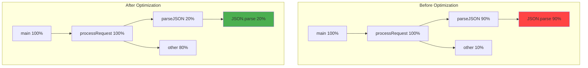

# CPU flame graphs

## 1. Why this exists (Real-world problem first)

You're running an API. CPU profiling shows `processRequest()` takes 80% of CPU time. But `processRequest()` calls 20 different functions. Which one is the bottleneck? You need to drill down, but the profiler output is a 10,000-line text file. Impossible to read.

**What breaks without flame graphs:**

- **Can't visualize call stacks**: Profiler shows function times, but not the call hierarchy. Can't see which parent function calls slow child functions.
- **Manual analysis is slow**: Reading profiler output takes hours. Searching for function names, calculating percentages manually.
- **Miss the hot path**: Can't quickly identify the critical path—the sequence of function calls consuming most CPU.
- **Can't compare before/after**: Optimized code, but can't visually confirm which functions improved.

**Real pain**: A video processing API had 10-second response times. CPU profiling showed 100+ functions. Engineers spent 2 days analyzing text output, couldn't find bottleneck. Generated flame graph. Instantly saw `ffmpeg.transcode()` → `videoCodec.encode()` → `h264.compress()` consuming 95% of CPU. The hot path was visible in 5 seconds. Optimized `h264.compress()` with hardware acceleration. Response time dropped to 2 seconds.

**Another scenario**: A search API was slow. Flame graph showed `elasticsearch.query()` was fast (10ms), but `formatResults()` was slow (500ms). The problem wasn't the database, it was JSON serialization of 10,000 results. Fixed by paginating results. Without flame graph, engineers would have optimized Elasticsearch (wrong target).

## 2. Mental model (build imagination)

Think of flame graphs as **X-ray vision for your code**.

**Without flame graphs (reading medical charts)**:
- Doctor reads text description of symptoms
- Must imagine what's happening inside
- Slow, error-prone diagnosis

**With flame graphs (X-ray image)**:
- Doctor sees bones, organs, fractures instantly
- Visual pattern recognition
- Fast, accurate diagnosis

**In technical terms**:
- **Flame graph**: Visual representation of profiler data
- **X-axis (width)**: Time spent in function (wider = slower)
- **Y-axis (height)**: Call stack depth (bottom = entry point, top = leaf functions)
- **Color**: Usually random (for visual distinction), sometimes indicates module or optimization status
- **Hot path**: The widest stack from bottom to top (where most time is spent)

**Key insight**: Flame graphs turn 10,000 lines of text into a single visual pattern. Your eyes can spot bottlenecks in seconds that would take hours to find in text.

## 3. How Node.js implements this internally

### From CPU profile to flame graph

Node.js doesn't generate flame graphs directly. The workflow is:

1. **Collect CPU profile**: V8 samples call stacks (`.cpuprofile` file)
2. **Convert to flame graph format**: Tools like `flamegraph` or `speedscope` parse the profile
3. **Render SVG**: Generate interactive SVG flame graph

**CPU profile structure**:
```json
{
  "nodes": [
    { "id": 1, "callFrame": { "functionName": "main" } },
    { "id": 2, "callFrame": { "functionName": "processRequest" } },
    { "id": 3, "callFrame": { "functionName": "parseJSON" } }
  ],
  "samples": [1, 2, 3, 3, 3, 2, 1],
  "timeDeltas": [1000, 1000, 1000, 1000, 1000, 1000, 1000]
}
```

**Flame graph generation**:
- Count how many samples each function appears in
- Calculate percentage of total time
- Draw rectangles proportional to time spent
- Stack rectangles to show call hierarchy

**Event loop impact**: Flame graph generation happens offline (after profiling). No runtime overhead.

### Common misunderstanding

**Myth**: "Flame graphs show every function call."

**Reality**: Flame graphs show **sampled** call stacks. If a function runs for 0.5ms, it might not appear. Flame graphs show functions consuming **significant time**.

**Myth**: "Wider box = more calls."

**Reality**: Wider box = **more time spent**, not more calls. A function called once but running for 1 second is wider than a function called 1000 times but running for 1ms total.

## 4. Multiple diagrams (MANDATORY)

### Flame graph anatomy


**Reading the graph**:
- **Bottom**: Entry point (main)
- **Top**: Leaf functions (where CPU time is actually spent)
- **Width**: Percentage of total CPU time
- **Red**: Hot path (bottleneck)

### CPU profile to flame graph conversion


### Flame graph vs call tree


### Before and after optimization



## 5. Where this is used in real projects

### Generating flame graphs from production profiles

```javascript
// scripts/generate-flamegraph.js
const { execSync } = require('child_process');
const fs = require('fs');
const path = require('path');

function generateFlameGraph(cpuProfilePath, outputPath) {
  // Convert .cpuprofile to flamegraph format
  const profile = JSON.parse(fs.readFileSync(cpuProfilePath, 'utf8'));
  
  // Use speedscope or flamegraph tool
  // Option 1: speedscope (web-based, interactive)
  console.log('Generating flame graph with speedscope...');
  execSync(`npx speedscope ${cpuProfilePath}`, { stdio: 'inherit' });
  
  // Option 2: flamegraph (SVG output)
  // Requires: npm install -g flamegraph
  // const stacksPath = cpuProfilePath.replace('.cpuprofile', '.stacks');
  // convertToStacks(profile, stacksPath);
  // execSync(`cat ${stacksPath} | flamegraph > ${outputPath}`);
  
  console.log(`Flame graph generated: ${outputPath}`);
}

function convertToStacks(profile, outputPath) {
  // Convert V8 profile to flamegraph stack format
  const stacks = [];
  
  profile.samples.forEach((nodeId, i) => {
    const stack = [];
    let currentNode = profile.nodes.find(n => n.id === nodeId);
    
    while (currentNode) {
      stack.unshift(currentNode.callFrame.functionName);
      currentNode = currentNode.parent ? profile.nodes.find(n => n.id === currentNode.parent) : null;
    }
    
    stacks.push(stack.join(';'));
  });
  
  fs.writeFileSync(outputPath, stacks.join('\n'));
}

// Usage
const profilePath = process.argv[2] || 'profile.cpuprofile';
const outputPath = profilePath.replace('.cpuprofile', '.svg');

generateFlameGraph(profilePath, outputPath);
```

### Automated flame graph generation in CI/CD

```javascript
// scripts/performance-regression-test.js
const { execSync } = require('child_process');
const fs = require('fs');

async function runPerformanceTest() {
  console.log('Running performance test...');
  
  // Start profiling
  execSync('node --prof index.js', { stdio: 'inherit' });
  
  // Convert to .cpuprofile
  const isolateLog = fs.readdirSync('.').find(f => f.startsWith('isolate-'));
  execSync(`node --prof-process --preprocess -j ${isolateLog} > profile.cpuprofile`);
  
  // Generate flame graph
  execSync('npx speedscope profile.cpuprofile');
  
  // Analyze profile for regressions
  const profile = JSON.parse(fs.readFileSync('profile.cpuprofile', 'utf8'));
  const hotFunctions = analyzeProfile(profile);
  
  console.log('Hot functions:');
  hotFunctions.forEach(({ name, percentage }) => {
    console.log(`  ${name}: ${percentage}%`);
    
    // Alert if any function exceeds threshold
    if (percentage > 50) {
      console.error(`⚠️  ${name} consumes ${percentage}% CPU (threshold: 50%)`);
      process.exit(1);
    }
  });
  
  console.log('✅ Performance test passed');
}

function analyzeProfile(profile) {
  const functionTimes = new Map();
  
  profile.samples.forEach((nodeId) => {
    const node = profile.nodes.find(n => n.id === nodeId);
    const funcName = node.callFrame.functionName;
    functionTimes.set(funcName, (functionTimes.get(funcName) || 0) + 1);
  });
  
  const total = profile.samples.length;
  const hotFunctions = Array.from(functionTimes.entries())
    .map(([name, count]) => ({
      name,
      percentage: Math.round((count / total) * 100),
    }))
    .filter(f => f.percentage > 5)
    .sort((a, b) => b.percentage - a.percentage);
  
  return hotFunctions;
}

runPerformanceTest();
```

### Interactive flame graph analysis

```javascript
// src/profiler-ui.js
const express = require('express');
const { Session } = require('inspector');
const fs = require('fs');
const path = require('path');

const app = express();

// Serve flame graph UI
app.get('/profiler', (req, res) => {
  res.send(`
    <!DOCTYPE html>
    <html>
    <head>
      <title>Profiler UI</title>
      <script src="https://www.speedscope.app/release/latest/speedscope.js"></script>
    </head>
    <body>
      <h1>Node.js Profiler</h1>
      <button onclick="startProfiling()">Start Profiling (30s)</button>
      <div id="status"></div>
      <div id="flamegraph"></div>
      
      <script>
        async function startProfiling() {
          document.getElementById('status').innerText = 'Profiling...';
          
          const response = await fetch('/profiler/start', { method: 'POST' });
          const { filename } = await response.json();
          
          document.getElementById('status').innerText = 'Profiling complete';
          
          // Load flame graph
          const profileResponse = await fetch(\`/profiler/download/\${filename}\`);
          const profileData = await profileResponse.json();
          
          // Render with speedscope
          const container = document.getElementById('flamegraph');
          speedscope.loadFromJSON(profileData, container);
        }
      </script>
    </body>
    </html>
  `);
});

// Start profiling endpoint
app.post('/profiler/start', async (req, res) => {
  const filename = `profile-${Date.now()}.cpuprofile`;
  const filepath = path.join('/tmp', filename);
  
  const session = new Session();
  session.connect();
  
  const chunks = [];
  
  session.post('Profiler.enable', () => {
    session.post('Profiler.start', () => {
      setTimeout(() => {
        session.post('Profiler.stop', (err, { profile }) => {
          fs.writeFileSync(filepath, JSON.stringify(profile));
          session.disconnect();
          
          res.json({ filename });
        });
      }, 30000);
    });
  });
});

// Download profile endpoint
app.get('/profiler/download/:filename', (req, res) => {
  const filepath = path.join('/tmp', req.params.filename);
  const profile = JSON.parse(fs.readFileSync(filepath, 'utf8'));
  res.json(profile);
});

app.listen(3000, () => {
  console.log('Profiler UI: http://localhost:3000/profiler');
});
```

### Comparing flame graphs before/after optimization

```bash
#!/bin/bash
# scripts/compare-performance.sh

echo "Running baseline performance test..."
node --cpu-prof --cpu-prof-dir=./profiles-before index.js

echo "Applying optimization..."
# Apply code changes

echo "Running optimized performance test..."
node --cpu-prof --cpu-prof-dir=./profiles-after index.js

echo "Generating flame graphs..."
npx speedscope profiles-before/*.cpuprofile &
npx speedscope profiles-after/*.cpuprofile &

echo "Compare flame graphs in browser"
```

## 6. Where this should NOT be used

### Micro-optimizations

**Bad**: Generate flame graph for every function, optimize everything.

**Why**: Optimizing functions that consume <5% CPU has minimal impact. Focus on hot path (>50% CPU).

**Good**: Optimize functions consuming >20% CPU.

### Real-time profiling

**Bad**: Generate flame graph on every request.

**Why**: Profiling adds overhead. Flame graph generation is slow. Kills performance.

**Good**: Profile on-demand or during load testing.

### Profiling async I/O

**Bad**: Use flame graphs to find slow database queries.

**Why**: Flame graphs show CPU time, not I/O wait time. Database query might take 100ms but consume 0ms CPU (waiting for network).

**Good**: Use flame graphs for CPU-bound operations (JSON parsing, encryption, compression). Use APM tools for I/O profiling.

## 7. Failure modes & edge cases

### Flame graph shows no clear bottleneck

**Scenario**: Flame graph shows 100 functions, each consuming 1% CPU. No single bottleneck.

**Impact**: Can't identify what to optimize.

**Solution**: The problem might be algorithmic (O(n²) instead of O(n log n)), not a single slow function. Or the bottleneck is I/O, not CPU.

### Flame graph is too wide to read

**Scenario**: Flame graph has 1000+ functions. SVG is 10,000 pixels wide. Can't see details.

**Impact**: Can't analyze the graph.

**Solution**: Use interactive tools like speedscope (zoom, search). Or filter profile to show only functions >5% CPU.

### Flame graph shows optimized code as slow

**Scenario**: Flame graph shows `JSON.parse()` consuming 60% CPU. But `JSON.parse()` is native code, can't optimize.

**Impact**: False bottleneck.

**Solution**: The problem is **calling** `JSON.parse()` too often or on large data. Optimize by reducing data size, caching results, or using streaming parsers.

### Profiling changes behavior

**Scenario**: Code runs fast normally, but slow when profiling. Profiling overhead changes timing, triggers race conditions.

**Impact**: Profile doesn't reflect real performance.

**Solution**: Use sampling profiler (lower overhead) instead of instrumentation profiler. Or profile in production with low sampling rate.

## 8. Trade-offs & alternatives

### What you gain

- **Visual bottleneck identification**: See hot path instantly
- **Call hierarchy**: Understand which parent functions call slow child functions
- **Before/after comparison**: Visually confirm optimizations worked
- **Interactive exploration**: Zoom, search, filter functions

### What you sacrifice

- **Requires profiling**: Must collect CPU profile first (adds overhead)
- **Learning curve**: Need to understand how to read flame graphs
- **CPU-only**: Doesn't show I/O wait time
- **Sampling inaccuracy**: Short-lived functions might not appear

### Alternatives

**Call tree (text output)**
- **Use case**: Quick analysis without tools
- **Benefit**: No additional tools needed
- **Trade-off**: Harder to read, slower analysis

**Chrome DevTools profiler**
- **Use case**: Profiling in browser or Node.js
- **Benefit**: Built-in, interactive
- **Trade-off**: Less visual than flame graphs

**APM tools (New Relic, Datadog)**
- **Use case**: Continuous profiling in production
- **Benefit**: Automatic flame graphs, no manual profiling
- **Trade-off**: Expensive, requires integration

## 9. Interview-level articulation

**Question**: "How do you use flame graphs to optimize Node.js applications?"

**Weak answer**: "I generate flame graphs from CPU profiles."

**Strong answer**: "I use flame graphs to visualize CPU profiling data and identify bottlenecks. First, I collect a CPU profile using Node's `--cpu-prof` flag or the inspector protocol. Then I convert the `.cpuprofile` to a flame graph using speedscope or flamegraph tools. The flame graph shows the call stack hierarchy, with width representing time spent in each function. I look for the widest stack from bottom to top—that's the hot path consuming most CPU. For example, I once found `JSON.parse()` consuming 60% of CPU in an API. The flame graph showed it was called from `formatResults()`, which was serializing 10,000 results. I fixed it by paginating results to 100 per page. The flame graph made the bottleneck obvious in 5 seconds, whereas analyzing text output would have taken hours."

**Follow-up**: "What's the difference between flame graphs and call trees?"

**Answer**: "Call trees show the same profiling data as flame graphs, but in text format. Call trees list functions with indentation showing call hierarchy and percentages showing time spent. Flame graphs visualize the same data as stacked rectangles, with width representing time and height representing call depth. Flame graphs are faster to analyze because your eyes can spot patterns instantly—the widest stack is the bottleneck. Call trees require reading line by line. I use flame graphs for complex profiles with 100+ functions, and call trees for quick checks with <10 functions."

**Follow-up**: "How do you profile I/O-bound operations?"

**Answer**: "Flame graphs show CPU time, not I/O wait time. For I/O-bound operations like database queries or HTTP requests, I use APM tools like Datadog or New Relic, which track I/O latency. I can also use async profiling with `--trace-events` to see event loop delays. For example, if a database query takes 100ms but consumes 0ms CPU (waiting for network), it won't appear in a CPU flame graph. I'd use APM tools to see the query latency, or add logging with timestamps to measure I/O time."

## 10. Key takeaways (engineer mindset)

**What to remember**:
- **Flame graphs visualize CPU profiling data**—width = time, height = call depth
- **Hot path is the widest stack from bottom to top**—that's the bottleneck
- **Flame graphs show CPU time, not I/O wait time**—use APM tools for I/O
- **Interactive tools like speedscope allow zoom and search**—essential for large profiles
- **Compare before/after flame graphs to validate optimizations**

**What decisions this enables**:
- Choosing what to optimize (focus on hot path, ignore <5% functions)
- Selecting profiling tools (speedscope, flamegraph, Chrome DevTools)
- Deciding when to profile (on-demand, load testing, CI/CD)
- Balancing profiling overhead vs insight

**How it connects to other Node.js concepts**:
- **CPU profiling**: Flame graphs visualize CPU profile data
- **Event loop**: Flame graphs show which event loop phase consumes CPU
- **V8 optimization**: Flame graphs reveal deoptimized functions (appear wider than expected)
- **Async operations**: Flame graphs don't show async wait time, only CPU time
- **Performance optimization**: Flame graphs guide data-driven optimization
