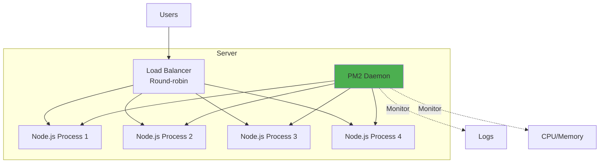
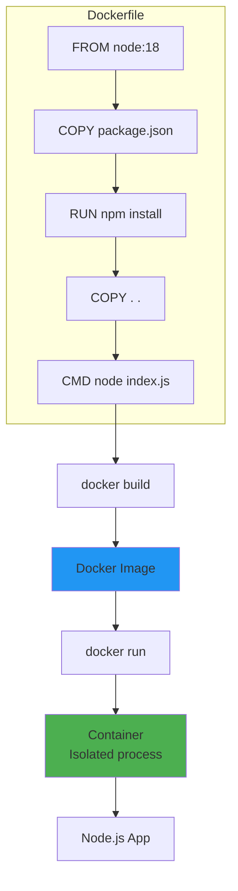
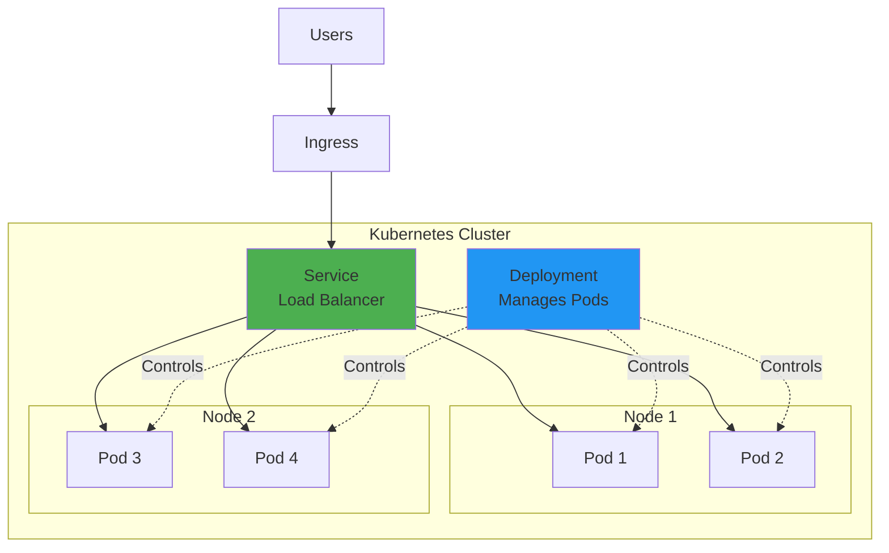
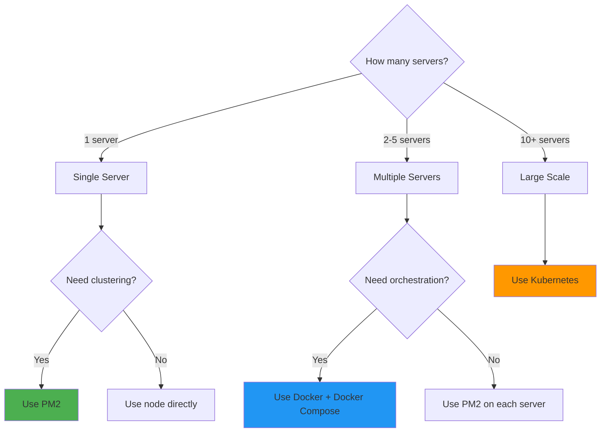

# PM2 vs Docker vs Kubernetes

## 1. Why this exists (Real-world problem first)

You deploy a Node.js API to production. It crashes at 2am. No one notices until users complain at 8am. 6 hours of downtime. You need automatic restart, monitoring, and zero-downtime deployments. But which tool?

**What breaks without process management:**

- **No automatic restart**: App crashes, stays down until manual restart. Downtime = revenue loss.
- **No load balancing**: Single process can't use all CPU cores. Server has 8 cores, app uses 1. Wasted resources.
- **No zero-downtime deployment**: Deploy new version, app goes down for 30 seconds. Users see errors.
- **No monitoring**: Can't see CPU, memory, logs in real-time. Blind to production issues.

**Real pain**: A SaaS platform ran Node.js with `node index.js`. App crashed due to unhandled promise rejection. Stayed down for 4 hours (overnight). Lost $50,000 in revenue. Switched to PM2. App now auto-restarts in 1 second. Crashes are invisible to users.

**Another scenario**: An e-commerce API ran on a single process. Server had 16 cores, but app used only 1 core (6% CPU utilization). Black Friday traffic overwhelmed the single process. Response times went from 100ms to 10 seconds. Switched to PM2 cluster mode (16 processes). Utilized all cores. Response times stayed at 100ms under load.

## 2. Mental model (build imagination)

Think of these tools as **different levels of restaurant management**.

**PM2 (Process Manager)**:
- **Analogy**: Restaurant manager
- **Scope**: Single restaurant
- **Responsibilities**: Hire/fire waiters, handle complaints, track performance
- **Limitation**: Can't manage multiple restaurants

**Docker (Container)**:
- **Analogy**: Franchise package
- **Scope**: Standardized restaurant setup
- **Responsibilities**: Define kitchen layout, equipment, recipes
- **Limitation**: Doesn't manage the franchise network

**Kubernetes (Orchestrator)**:
- **Analogy**: Franchise headquarters
- **Scope**: Network of restaurants across cities
- **Responsibilities**: Open/close locations, distribute customers, handle failures
- **Limitation**: Complex, overkill for single restaurant

**In technical terms**:
- **PM2**: Manages Node.js processes on a single server (restart, cluster, logs)
- **Docker**: Packages app + dependencies into portable container (consistent environment)
- **Kubernetes**: Orchestrates containers across multiple servers (scaling, load balancing, self-healing)

**Key insight**: These tools solve different problems. PM2 = process management. Docker = environment consistency. Kubernetes = multi-server orchestration. You can use them together: PM2 inside Docker inside Kubernetes.

## 3. How Node.js implements this internally

### PM2 architecture

PM2 runs as a daemon process that spawns and manages Node.js processes.

**How it works**:
1. **Daemon**: PM2 daemon runs in background (`pm2 start app.js`)
2. **Process spawning**: Daemon spawns Node.js processes using `child_process.fork()`
3. **Monitoring**: Daemon monitors child processes (CPU, memory, restarts)
4. **Cluster mode**: Daemon spawns multiple processes, load balances with round-robin

**Event loop impact**: PM2 daemon is a separate process. No impact on your app's event loop.

### Docker architecture

Docker packages app + dependencies into an isolated container.

**How it works**:
1. **Image**: Dockerfile defines environment (Node.js version, dependencies, code)
2. **Container**: Docker runs image as isolated process (own filesystem, network, PID namespace)
3. **Layering**: Docker caches layers (base image, npm install, code) for fast rebuilds

**Event loop impact**: Docker is just process isolation. No impact on event loop.

### Kubernetes architecture

Kubernetes orchestrates containers across multiple servers.

**How it works**:
1. **Pod**: Smallest unit (1+ containers)
2. **ReplicaSet**: Ensures N pods are running
3. **Service**: Load balances traffic across pods
4. **Deployment**: Manages rolling updates

**Event loop impact**: Kubernetes is external orchestration. No impact on event loop.

### Common misunderstanding

**Myth**: "PM2 is for development, Docker is for production."

**Reality**: PM2 is production-ready. Many companies run PM2 in production (single server). Docker is for environment consistency, not just production.

**Myth**: "Kubernetes is always better than PM2."

**Reality**: Kubernetes is overkill for small apps (1-2 servers). PM2 is simpler, faster to set up. Use Kubernetes when you need multi-server orchestration (10+ servers).

## 4. Multiple diagrams (MANDATORY)

### PM2 architecture



### Docker architecture



### Kubernetes architecture



### Decision tree: Which tool to use?



## 5. Where this is used in real projects

### PM2 in production

```javascript
// ecosystem.config.js
module.exports = {
  apps: [{
    name: 'api',
    script: './index.js',
    instances: 'max', // Use all CPU cores
    exec_mode: 'cluster',
    env: {
      NODE_ENV: 'production',
      PORT: 3000,
    },
    error_file: './logs/err.log',
    out_file: './logs/out.log',
    log_date_format: 'YYYY-MM-DD HH:mm:ss Z',
    merge_logs: true,
    autorestart: true,
    max_memory_restart: '1G',
    watch: false,
    max_restarts: 10,
    min_uptime: '10s',
  }],
};

// Start with PM2
// pm2 start ecosystem.config.js
// pm2 save
// pm2 startup
```

**Benefits**:
- Auto-restart on crash
- Cluster mode (use all CPU cores)
- Zero-downtime reload (`pm2 reload api`)
- Built-in monitoring (`pm2 monit`)
- Log management

### Docker in production

```dockerfile
# Dockerfile
FROM node:18-alpine

WORKDIR /app

# Copy package files
COPY package*.json ./

# Install dependencies
RUN npm ci --only=production

# Copy app code
COPY . .

# Expose port
EXPOSE 3000

# Health check
HEALTHCHECK --interval=30s --timeout=3s \
  CMD node healthcheck.js || exit 1

# Start app
CMD ["node", "index.js"]
```

```yaml
# docker-compose.yml
version: '3.8'

services:
  api:
    build: .
    ports:
      - "3000:3000"
    environment:
      NODE_ENV: production
      DATABASE_URL: postgres://db:5432/myapp
    depends_on:
      - db
    restart: unless-stopped
    deploy:
      replicas: 4
      resources:
        limits:
          cpus: '0.5'
          memory: 512M
  
  db:
    image: postgres:14
    environment:
      POSTGRES_DB: myapp
      POSTGRES_PASSWORD: secret
    volumes:
      - db-data:/var/lib/postgresql/data

volumes:
  db-data:
```

**Benefits**:
- Consistent environment (dev = prod)
- Easy deployment (ship container, not code)
- Isolation (app doesn't affect host)
- Resource limits (CPU, memory)

### Kubernetes in production

```yaml
# deployment.yaml
apiVersion: apps/v1
kind: Deployment
metadata:
  name: api
spec:
  replicas: 10
  selector:
    matchLabels:
      app: api
  template:
    metadata:
      labels:
        app: api
    spec:
      containers:
      - name: api
        image: myregistry/api:v1.2.3
        ports:
        - containerPort: 3000
        env:
        - name: NODE_ENV
          value: production
        resources:
          requests:
            cpu: 500m
            memory: 512Mi
          limits:
            cpu: 1000m
            memory: 1Gi
        livenessProbe:
          httpGet:
            path: /health
            port: 3000
          initialDelaySeconds: 30
          periodSeconds: 10
        readinessProbe:
          httpGet:
            path: /ready
            port: 3000
          initialDelaySeconds: 5
          periodSeconds: 5

---
apiVersion: v1
kind: Service
metadata:
  name: api
spec:
  selector:
    app: api
  ports:
  - port: 80
    targetPort: 3000
  type: LoadBalancer

---
apiVersion: autoscaling/v2
kind: HorizontalPodAutoscaler
metadata:
  name: api
spec:
  scaleTargetRef:
    apiVersion: apps/v1
    kind: Deployment
    name: api
  minReplicas: 10
  maxReplicas: 100
  metrics:
  - type: Resource
    resource:
      name: cpu
      target:
        type: Utilization
        averageUtilization: 70
```

**Benefits**:
- Auto-scaling (10-100 pods based on CPU)
- Self-healing (restart failed pods)
- Rolling updates (zero-downtime deployment)
- Load balancing across pods
- Multi-server orchestration

### Combining PM2 + Docker + Kubernetes

```dockerfile
# Dockerfile with PM2
FROM node:18-alpine

# Install PM2
RUN npm install -g pm2

WORKDIR /app

COPY package*.json ./
RUN npm ci --only=production

COPY . .

EXPOSE 3000

# Start with PM2 in cluster mode
CMD ["pm2-runtime", "start", "ecosystem.config.js"]
```

**Why combine?**:
- **PM2**: Cluster mode inside container (use all container CPUs)
- **Docker**: Environment consistency
- **Kubernetes**: Multi-server orchestration

## 6. Where this should NOT be used

### PM2 for multi-server orchestration

**Bad**: Use PM2 to manage apps across 50 servers.

**Why**: PM2 is designed for single-server management. No built-in multi-server orchestration, load balancing, or auto-scaling.

**Good**: Use Kubernetes for multi-server orchestration.

### Docker without orchestration at scale

**Bad**: Manually run `docker run` on 20 servers.

**Why**: No automatic failover, load balancing, or scaling. Manual management is error-prone.

**Good**: Use Docker Compose for 2-5 servers, Kubernetes for 10+ servers.

### Kubernetes for small apps

**Bad**: Use Kubernetes for a blog with 100 users/day.

**Why**: Kubernetes is complex, expensive (requires 3+ servers for high availability). Overkill for small apps.

**Good**: Use PM2 or Docker Compose for small apps.

## 7. Failure modes & edge cases

### PM2 daemon crashes

**Scenario**: PM2 daemon process crashes. All managed apps go down.

**Impact**: Total outage.

**Solution**: Use `pm2 startup` to auto-start PM2 daemon on server boot. Or use systemd to manage PM2 daemon.

### Docker container OOM

**Scenario**: Container exceeds memory limit. Docker kills container.

**Impact**: App crashes.

**Solution**: Set appropriate memory limits. Monitor memory usage. Implement graceful shutdown.

### Kubernetes pod eviction

**Scenario**: Node runs out of resources. Kubernetes evicts pods.

**Impact**: Temporary capacity reduction.

**Solution**: Set resource requests/limits correctly. Use pod disruption budgets. Over-provision nodes.

### Zero-downtime deployment fails

**Scenario**: PM2 reload fails because new code has syntax error. All processes crash.

**Impact**: Total outage.

**Solution**: Test new code before deployment. Use health checks. Implement rollback strategy.

## 8. Trade-offs & alternatives

### PM2

**What you gain**:
- Simple setup (5 minutes)
- Cluster mode (use all CPU cores)
- Auto-restart on crash
- Built-in monitoring

**What you sacrifice**:
- Single-server only
- No container isolation
- Manual multi-server management

**Use when**: Single server, need clustering, want simplicity

### Docker

**What you gain**:
- Environment consistency
- Easy deployment
- Process isolation
- Resource limits

**What you sacrifice**:
- Complexity (Dockerfile, images, registries)
- No built-in orchestration
- Overhead (container runtime)

**Use when**: Need consistent environments, deploying to multiple servers

### Kubernetes

**What you gain**:
- Multi-server orchestration
- Auto-scaling
- Self-healing
- Rolling updates

**What you sacrifice**:
- High complexity
- Expensive (requires 3+ servers)
- Steep learning curve

**Use when**: 10+ servers, need auto-scaling, have DevOps team

### Alternatives

**Systemd**
- **Use case**: Simple process management on Linux
- **Benefit**: Built-in, no dependencies
- **Trade-off**: No clustering, basic features

**Docker Swarm**
- **Use case**: Simpler alternative to Kubernetes
- **Benefit**: Easier to set up than Kubernetes
- **Trade-off**: Less features, smaller ecosystem

**AWS ECS/Fargate**
- **Use case**: Managed container orchestration
- **Benefit**: No server management
- **Trade-off**: Vendor lock-in, expensive

## 9. Interview-level articulation

**Question**: "How do you deploy Node.js applications to production?"

**Weak answer**: "I use PM2."

**Strong answer**: "It depends on scale. For a single server, I use PM2 in cluster mode to utilize all CPU cores and auto-restart on crashes. I configure it with `ecosystem.config.js` to set memory limits, log rotation, and environment variables. For 2-5 servers, I use Docker with Docker Compose for environment consistency and easy deployment. For 10+ servers, I use Kubernetes for auto-scaling, self-healing, and rolling updates. I've also combined them: PM2 inside Docker inside Kubernetes—PM2 provides clustering within each container, Docker provides environment consistency, and Kubernetes provides multi-server orchestration. The key is choosing the right tool for the scale and complexity of the system."

**Follow-up**: "What's the difference between PM2 cluster mode and Kubernetes scaling?"

**Answer**: "PM2 cluster mode spawns multiple Node.js processes on a single server to utilize all CPU cores. It uses round-robin load balancing between processes. Kubernetes scaling spawns multiple pods (containers) across multiple servers. It uses service load balancing between pods. PM2 is for vertical scaling (use all cores on one server), Kubernetes is for horizontal scaling (add more servers). You can combine them: run PM2 in cluster mode inside each Kubernetes pod to maximize resource utilization."

**Follow-up**: "How do you handle zero-downtime deployments?"

**Answer**: "With PM2, I use `pm2 reload` which gracefully restarts processes one by one—new process starts, waits for health check, then old process stops. With Kubernetes, I use rolling updates—new pods start, pass readiness probes, then old pods terminate. I set `maxUnavailable: 0` to ensure at least N pods are always running. I also implement health checks (`/health` for liveness, `/ready` for readiness) and graceful shutdown (listen for SIGTERM, close connections, then exit). This ensures zero dropped requests during deployment."

## 10. Key takeaways (engineer mindset)

**What to remember**:
- **PM2 = single-server process management** (clustering, auto-restart, monitoring)
- **Docker = environment consistency** (package app + dependencies)
- **Kubernetes = multi-server orchestration** (auto-scaling, self-healing, rolling updates)
- **Choose based on scale**: PM2 for 1 server, Docker Compose for 2-5 servers, Kubernetes for 10+ servers
- **You can combine them**: PM2 inside Docker inside Kubernetes

**What decisions this enables**:
- Choosing deployment strategy based on scale
- Deciding between clustering (PM2) vs horizontal scaling (Kubernetes)
- Implementing zero-downtime deployments
- Balancing complexity vs features

**How it connects to other Node.js concepts**:
- **Cluster module**: PM2 uses `cluster` module for clustering
- **Process management**: PM2 manages Node.js processes
- **Environment variables**: All tools use env vars for configuration
- **Health checks**: Required for zero-downtime deployments
- **Graceful shutdown**: Handle SIGTERM for clean restarts
