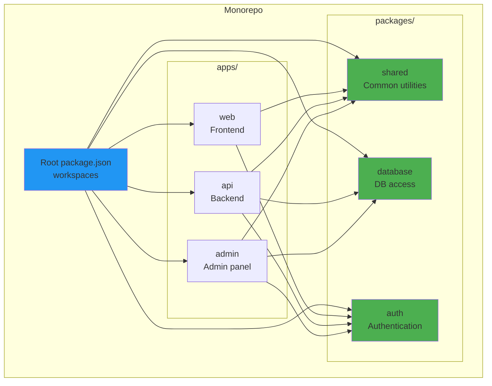
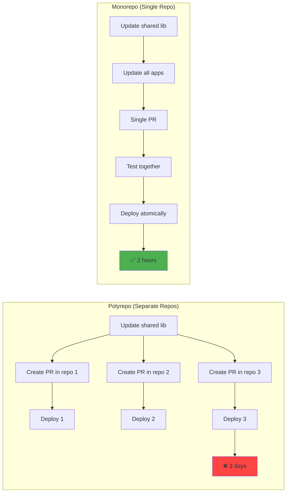
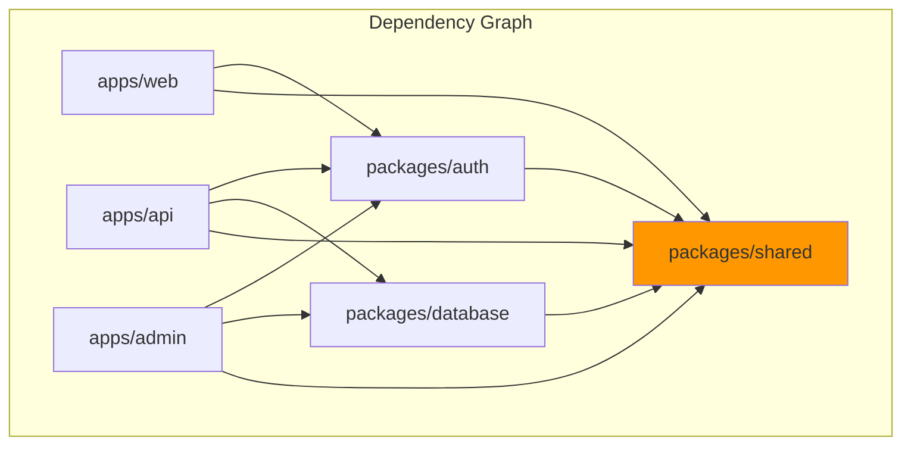
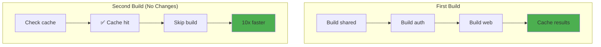

# Monorepo patterns

## 1. Why this exists (Real-world problem first)

You're building a platform with 3 apps: web frontend, mobile API, admin dashboard. Each in separate Git repos. You update a shared library (authentication). Must update 3 repos, create 3 PRs, deploy 3 times. Takes 2 hours. One repo uses old version. Production breaks.

**What breaks without monorepos:**

- **Version hell**: 10 repos, 10 different versions of shared library. Some use v1.2, some use v1.5. Breaking change in v1.5. Half the apps break.
- **Slow cross-repo changes**: Change shared library, must update 5 repos. Create 5 PRs, wait for 5 reviews, merge 5 times. Takes 1 week.
- **Duplicate code**: Authentication logic copied across 3 repos. Bug found. Must fix in 3 places. Miss one. Security vulnerability.
- **Difficult refactoring**: Rename function in shared library. Must update 10 repos. Some repos miss the update. Production breaks.

**Real pain**: A fintech company had 15 microservices in 15 repos. Shared library for database access. Found SQL injection vulnerability. Had to update 15 repos, create 15 PRs, deploy 15 times. Took 3 days. During that time, 5 services were vulnerable. Switched to monorepo. Same fix took 1 PR, 1 deployment, 2 hours.

**Another scenario**: An e-commerce platform had frontend and backend in separate repos. Backend changed API response format. Frontend broke in production because it wasn't updated. With monorepo, both changes would be in same PR, tested together, deployed atomically.

## 2. Mental model (build imagination)

Think of monorepo as **shopping mall vs separate stores**.

**Separate repos (separate stores)**:
- Each store has own building, parking, security
- Customer must drive between stores
- Stores can't share inventory
- Expensive to maintain

**Monorepo (shopping mall)**:
- All stores in one building
- Shared parking, security, utilities
- Stores can share inventory
- Cheaper to maintain

**In technical terms**:
- **Monorepo**: Single Git repo containing multiple projects (apps, libraries, services)
- **Polyrepo**: Multiple Git repos, one per project
- **Workspace**: Tool for managing multiple packages in monorepo (npm workspaces, Yarn workspaces, pnpm workspaces)
- **Shared dependencies**: Libraries used by multiple projects in monorepo

**Key insight**: Monorepo enables **atomic changes across projects**. Change shared library and all apps using it in single PR. Test together, deploy together. No version hell.

## 3. How Node.js implements this internally

### npm workspaces

npm workspaces allow multiple packages in single repo.

**How it works**:
1. **Root package.json**: Defines workspaces
2. **Symlinks**: npm creates symlinks between packages
3. **Shared node_modules**: Dependencies hoisted to root

```json
// package.json (root)
{
  "name": "my-monorepo",
  "workspaces": [
    "packages/*",
    "apps/*"
  ]
}
```

```bash
# Install dependencies for all workspaces
npm install

# Run script in specific workspace
npm run build --workspace=packages/shared

# Run script in all workspaces
npm run test --workspaces
```

**Event loop impact**: No impact. Workspaces are just file organization.

### Common misunderstanding

**Myth**: "Monorepo means monolith."

**Reality**: Monorepo is **code organization**, monolith is **architecture**. You can have microservices in a monorepo. Each service is separate package, deployed independently.

**Myth**: "Monorepo is slow (large Git repo)."

**Reality**: Modern tools (Turborepo, Nx) use **caching and incremental builds**. Only rebuild changed packages. Often faster than polyrepo.

## 4. Multiple diagrams (MANDATORY)

### Monorepo structure



### Polyrepo vs monorepo workflow



### Dependency graph



### Turborepo caching



## 5. Where this is used in real projects

### npm workspaces setup

```json
// package.json (root)
{
  "name": "my-platform",
  "private": true,
  "workspaces": [
    "packages/*",
    "apps/*"
  ],
  "scripts": {
    "build": "npm run build --workspaces",
    "test": "npm run test --workspaces",
    "lint": "npm run lint --workspaces"
  },
  "devDependencies": {
    "typescript": "^5.0.0",
    "eslint": "^8.0.0",
    "jest": "^29.0.0"
  }
}
```

```json
// packages/shared/package.json
{
  "name": "@myplatform/shared",
  "version": "1.0.0",
  "main": "dist/index.js",
  "scripts": {
    "build": "tsc",
    "test": "jest"
  },
  "dependencies": {
    "lodash": "^4.17.21"
  }
}
```

```json
// apps/api/package.json
{
  "name": "@myplatform/api",
  "version": "1.0.0",
  "scripts": {
    "build": "tsc",
    "start": "node dist/index.js",
    "dev": "nodemon src/index.ts"
  },
  "dependencies": {
    "@myplatform/shared": "*",  // Uses local workspace package
    "@myplatform/database": "*",
    "express": "^4.18.0"
  }
}
```

### Turborepo for caching

```json
// turbo.json
{
  "pipeline": {
    "build": {
      "dependsOn": ["^build"],  // Build dependencies first
      "outputs": ["dist/**"]
    },
    "test": {
      "dependsOn": ["build"],
      "outputs": []
    },
    "lint": {
      "outputs": []
    }
  }
}
```

```json
// package.json (root)
{
  "scripts": {
    "build": "turbo run build",
    "test": "turbo run test",
    "lint": "turbo run lint"
  },
  "devDependencies": {
    "turbo": "^1.10.0"
  }
}
```

**Benefits**:
- Caching: Skips builds for unchanged packages
- Parallelization: Builds packages in parallel
- Dependency awareness: Builds in correct order

### Shared TypeScript config

```json
// packages/tsconfig-base/tsconfig.json
{
  "compilerOptions": {
    "target": "ES2020",
    "module": "commonjs",
    "strict": true,
    "esModuleInterop": true,
    "skipLibCheck": true,
    "forceConsistentCasingInFileNames": true,
    "declaration": true,
    "outDir": "dist"
  }
}
```

```json
// apps/api/tsconfig.json
{
  "extends": "../../packages/tsconfig-base/tsconfig.json",
  "compilerOptions": {
    "rootDir": "src",
    "outDir": "dist"
  },
  "include": ["src/**/*"]
}
```

### CI/CD for monorepo

```yaml
# .github/workflows/ci.yml
name: CI

on: [push, pull_request]

jobs:
  build:
    runs-on: ubuntu-latest
    
    steps:
      - uses: actions/checkout@v3
      
      - name: Setup Node.js
        uses: actions/setup-node@v3
        with:
          node-version: 18
          cache: 'npm'
      
      - name: Install dependencies
        run: npm ci
      
      - name: Build all packages
        run: npm run build --workspaces
      
      - name: Test all packages
        run: npm run test --workspaces
      
      - name: Lint all packages
        run: npm run lint --workspaces
```

## 6. Where this should NOT be used

### Unrelated projects

**Bad**: Put personal blog and work project in same monorepo.

**Why**: No shared code, different deployment cycles. Monorepo adds complexity without benefits.

**Good**: Separate repos for unrelated projects.

### Very large codebases without tooling

**Bad**: 100 packages in monorepo, no caching or incremental builds.

**Why**: Slow builds (must rebuild everything). Git operations slow (large repo).

**Good**: Use Turborepo or Nx for caching, or split into multiple repos.

### Different tech stacks

**Bad**: Python backend and Node.js frontend in same monorepo.

**Why**: Different tooling, dependencies, build systems. Hard to manage.

**Good**: Separate repos for different tech stacks.

## 7. Failure modes & edge cases

### Circular dependencies

**Scenario**: Package A depends on B, B depends on A. npm install fails.

**Impact**: Can't install dependencies.

**Solution**: Refactor to remove circular dependency. Extract shared code to new package.

### Dependency version conflicts

**Scenario**: Package A needs lodash@4.17.0, Package B needs lodash@4.18.0. npm hoists lodash@4.18.0. Package A breaks.

**Impact**: Runtime errors.

**Solution**: Use exact versions, or accept that all packages use same version.

### Large Git repo

**Scenario**: Monorepo grows to 10GB. Git clone takes 10 minutes.

**Impact**: Slow CI/CD, slow developer onboarding.

**Solution**: Use Git LFS for large files, or shallow clones (`git clone --depth 1`).

### Publishing packages

**Scenario**: Publish package A to npm. It depends on package B (not published). Users can't install package A.

**Impact**: Broken npm package.

**Solution**: Publish all dependencies, or use tools like Lerna for versioning and publishing.

## 8. Trade-offs & alternatives

### What you gain

- **Atomic changes**: Change shared library and all apps in single PR
- **No version hell**: All packages use same version of dependencies
- **Easier refactoring**: Rename function, update all usages in single commit
- **Shared tooling**: Single ESLint, TypeScript, Jest config

### What you sacrifice

- **Larger Git repo**: More code in one repo
- **Complex CI/CD**: Must determine which packages changed
- **Access control**: Can't give different teams access to different repos
- **Slower builds**: Without caching, must rebuild everything

### Alternatives

**Polyrepo (separate repos)**
- **Use case**: Unrelated projects, different teams
- **Benefit**: Simple, independent deployment
- **Trade-off**: Version hell, slow cross-repo changes

**Hybrid (some monorepo, some polyrepo)**
- **Use case**: Related projects in monorepo, unrelated in separate repos
- **Benefit**: Best of both worlds
- **Trade-off**: More complex

## 9. Interview-level articulation

**Question**: "What are the benefits of monorepos?"

**Weak answer**: "All code in one repo."

**Strong answer**: "Monorepos enable atomic changes across multiple projects. For example, if I update a shared authentication library, I can update all apps using it in a single PR, test them together, and deploy atomically. This eliminates version hell—no more 'app A uses v1.2, app B uses v1.5' problems. It also makes refactoring easier—I can rename a function and update all usages in one commit, with the compiler catching any missed updates. I use tools like Turborepo for caching and incremental builds—it only rebuilds packages that changed, making builds 10x faster. For example, if I change the frontend, it doesn't rebuild the backend. I've used monorepos for platforms with 10+ packages, and it reduced cross-repo change time from 1 week to 2 hours."

**Follow-up**: "What are the downsides of monorepos?"

**Answer**: "Monorepos can become large, slowing down Git operations. I mitigate this with shallow clones (`git clone --depth 1`) in CI/CD. Without caching, builds can be slow because you must rebuild everything. I use Turborepo to cache build outputs and only rebuild changed packages. Access control is harder—you can't give different teams access to different repos. I work around this with CODEOWNERS files and branch protection rules. Finally, CI/CD is more complex—you must determine which packages changed and only deploy those. I use tools like Turborepo's `--filter` flag to run tasks only for changed packages."

**Follow-up**: "How do you handle versioning in monorepos?"

**Answer**: "I use two strategies: (1) For internal packages (not published to npm), I use `*` as the version in package.json dependencies, so they always use the local workspace version. (2) For published packages, I use tools like Changesets or Lerna to manage versioning. When I make a change, I create a changeset describing the change and whether it's a major, minor, or patch update. On release, the tool bumps versions, updates changelogs, and publishes to npm. This ensures all packages are versioned consistently and dependencies are updated automatically."

## 10. Key takeaways (engineer mindset)

**What to remember**:
- **Monorepo enables atomic changes across projects**—single PR, single deployment
- **Use npm workspaces for simple monorepos**, Turborepo/Nx for large ones
- **Caching is critical**—only rebuild changed packages
- **Monorepo ≠ monolith**—you can have microservices in a monorepo
- **Not for unrelated projects**—only use monorepo when projects share code

**What decisions this enables**:
- Choosing monorepo vs polyrepo based on project relationships
- Selecting monorepo tooling (npm workspaces, Turborepo, Nx)
- Designing package structure and dependencies
- Implementing CI/CD for monorepos

**How it connects to other Node.js concepts**:
- **npm workspaces**: Built-in monorepo support
- **Dependency management**: Shared dependencies hoisted to root
- **Build tools**: Turborepo, Nx for caching and incremental builds
- **CI/CD**: Determine changed packages, deploy only what changed
- **Microservices**: Monorepo can contain multiple independently deployed services
