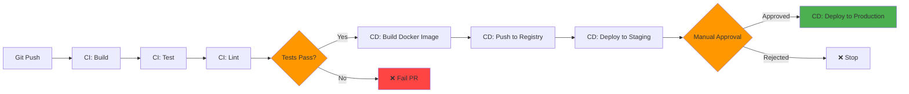
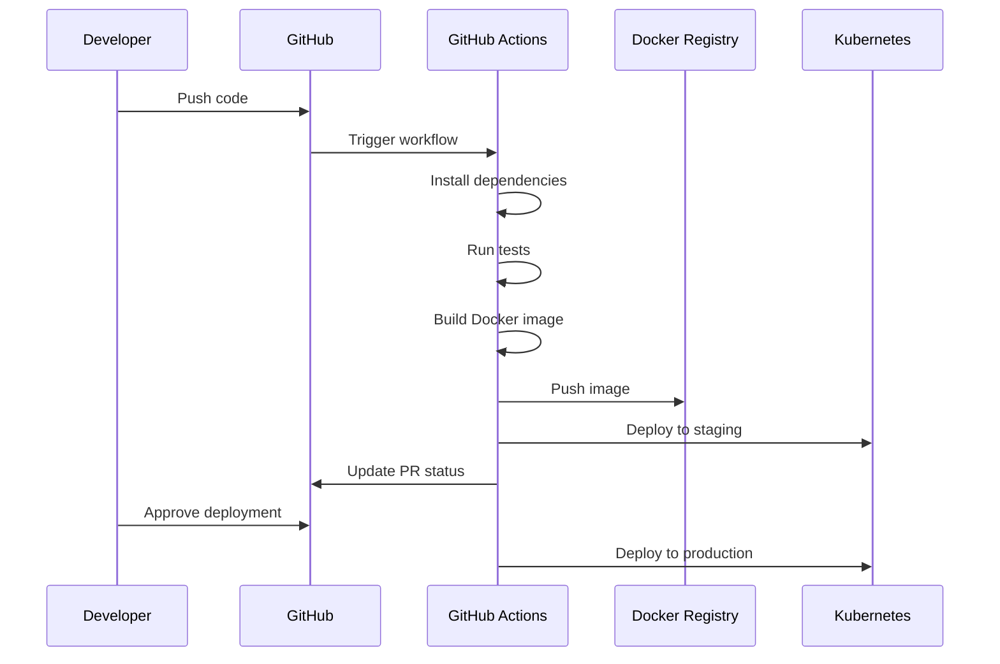
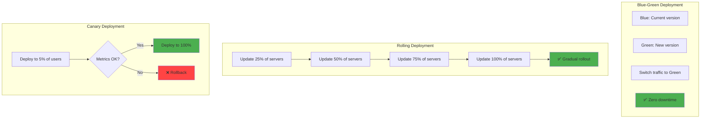
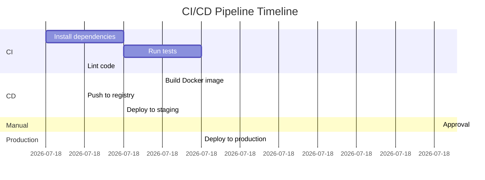

# CI/CD for Node.js

## 1. Why this exists (Real-world problem first)

You finish a feature. Manually SSH to server, pull code, run `npm install`, restart app. Takes 20 minutes. Forget to run tests. Deploy breaks production. Users complain. You rollback manually. Takes another 20 minutes. Total downtime: 40 minutes.

**What breaks without CI/CD:**

- **Manual deployments are slow**: SSH, pull, install, restart. 20 minutes per deployment. Deploy 10 times/day = 200 minutes wasted.
- **No automated testing**: Forget to run tests. Deploy broken code. Production breaks. Users affected.
- **No rollback strategy**: Deployment breaks production. Must manually rollback. Takes 20 minutes. Downtime = revenue loss.
- **Inconsistent deployments**: Different engineers deploy differently. Some forget steps. Production environment drifts from staging.

**Real pain**: An e-commerce platform deployed manually. Engineer forgot to run `npm install` after adding dependency. Deployed. App crashed on startup (missing module). Took 30 minutes to diagnose and fix. Lost $5,000 in sales. Implemented CI/CD. Automated tests caught missing dependencies before deployment. Zero production incidents from deployment errors.

**Another scenario**: A SaaS platform deployed 20 times/day manually. Each deployment took 15 minutes. Total: 5 hours/day wasted. Implemented CI/CD. Deployments automated, took 2 minutes. Saved 4.5 hours/day = 90 hours/month.

## 2. Mental model (build imagination)

Think of CI/CD as **factory assembly line vs handcrafted production**.

**Manual deployment (handcrafted)**:
- Artisan builds each product by hand
- Slow, error-prone
- Quality varies
- Expensive

**CI/CD (assembly line)**:
- Automated machines build products
- Fast, consistent
- Quality guaranteed (automated testing)
- Cheap

**In technical terms**:
- **CI (Continuous Integration)**: Automatically build and test code on every commit
- **CD (Continuous Deployment)**: Automatically deploy code to production after tests pass
- **Pipeline**: Sequence of automated steps (build, test, deploy)
- **Artifact**: Build output (Docker image, npm package, static files)

**Key insight**: CI/CD **removes humans from the deployment process**. Code is automatically tested and deployed. Humans only write code and review PRs. Deployments are fast, consistent, and safe.

## 3. How Node.js implements this internally

### CI/CD pipeline stages

1. **Build**: Install dependencies, compile TypeScript, bundle assets
2. **Test**: Run unit tests, integration tests, linting
3. **Package**: Create Docker image or deployment artifact
4. **Deploy**: Push to staging/production, run migrations, restart services

**No Node.js-specific implementation**: CI/CD is external tooling (GitHub Actions, GitLab CI, Jenkins). Node.js apps just provide scripts (`npm run build`, `npm test`).

### Common misunderstanding

**Myth**: "CI/CD is only for large teams."

**Reality**: CI/CD benefits **any team**, even solo developers. Automated testing prevents bugs. Automated deployment saves time.

**Myth**: "CI/CD means deploying every commit to production."

**Reality**: CI (Continuous Integration) runs on every commit. CD (Continuous Deployment) can deploy to staging automatically, production manually (after approval).

## 4. Multiple diagrams (MANDATORY)

### CI/CD pipeline



### GitHub Actions workflow



### Deployment strategies



### CI/CD stages timeline



## 5. Where this is used in real projects

### GitHub Actions workflow

```yaml
# .github/workflows/ci-cd.yml
name: CI/CD

on:
  push:
    branches: [main, develop]
  pull_request:
    branches: [main]

env:
  NODE_VERSION: 18
  DOCKER_REGISTRY: ghcr.io
  IMAGE_NAME: myorg/myapp

jobs:
  test:
    runs-on: ubuntu-latest
    
    steps:
      - uses: actions/checkout@v3
      
      - name: Setup Node.js
        uses: actions/setup-node@v3
        with:
          node-version: ${{ env.NODE_VERSION }}
          cache: 'npm'
      
      - name: Install dependencies
        run: npm ci
      
      - name: Run linter
        run: npm run lint
      
      - name: Run tests
        run: npm test
      
      - name: Run integration tests
        run: npm run test:integration
        env:
          DATABASE_URL: postgres://localhost:5432/test
      
      - name: Upload coverage
        uses: codecov/codecov-action@v3
        with:
          files: ./coverage/lcov.info

  build:
    needs: test
    runs-on: ubuntu-latest
    if: github.ref == 'refs/heads/main'
    
    steps:
      - uses: actions/checkout@v3
      
      - name: Login to Docker Registry
        uses: docker/login-action@v2
        with:
          registry: ${{ env.DOCKER_REGISTRY }}
          username: ${{ github.actor }}
          password: ${{ secrets.GITHUB_TOKEN }}
      
      - name: Build and push Docker image
        uses: docker/build-push-action@v4
        with:
          context: .
          push: true
          tags: |
            ${{ env.DOCKER_REGISTRY }}/${{ env.IMAGE_NAME }}:latest
            ${{ env.DOCKER_REGISTRY }}/${{ env.IMAGE_NAME }}:${{ github.sha }}
          cache-from: type=registry,ref=${{ env.DOCKER_REGISTRY }}/${{ env.IMAGE_NAME }}:latest
          cache-to: type=inline

  deploy-staging:
    needs: build
    runs-on: ubuntu-latest
    environment: staging
    
    steps:
      - name: Deploy to Kubernetes (Staging)
        uses: azure/k8s-deploy@v4
        with:
          manifests: |
            k8s/deployment.yaml
            k8s/service.yaml
          images: |
            ${{ env.DOCKER_REGISTRY }}/${{ env.IMAGE_NAME }}:${{ github.sha }}
          namespace: staging

  deploy-production:
    needs: deploy-staging
    runs-on: ubuntu-latest
    environment: production
    if: github.ref == 'refs/heads/main'
    
    steps:
      - name: Deploy to Kubernetes (Production)
        uses: azure/k8s-deploy@v4
        with:
          manifests: |
            k8s/deployment.yaml
            k8s/service.yaml
          images: |
            ${{ env.DOCKER_REGISTRY }}/${{ env.IMAGE_NAME }}:${{ github.sha }}
          namespace: production
      
      - name: Notify Slack
        uses: slackapi/slack-github-action@v1
        with:
          payload: |
            {
              "text": "Deployed ${{ github.sha }} to production"
            }
        env:
          SLACK_WEBHOOK_URL: ${{ secrets.SLACK_WEBHOOK_URL }}
```

### Dockerfile for production

```dockerfile
# Dockerfile
FROM node:18-alpine AS builder

WORKDIR /app

# Copy package files
COPY package*.json ./

# Install dependencies
RUN npm ci --only=production

# Copy source code
COPY . .

# Build TypeScript
RUN npm run build

# Production image
FROM node:18-alpine

WORKDIR /app

# Copy built files and dependencies
COPY --from=builder /app/dist ./dist
COPY --from=builder /app/node_modules ./node_modules
COPY --from=builder /app/package.json ./

# Create non-root user
RUN addgroup -g 1001 -S nodejs && \
    adduser -S nodejs -u 1001

USER nodejs

EXPOSE 3000

CMD ["node", "dist/index.js"]
```

### Kubernetes deployment

```yaml
# k8s/deployment.yaml
apiVersion: apps/v1
kind: Deployment
metadata:
  name: myapp
spec:
  replicas: 3
  strategy:
    type: RollingUpdate
    rollingUpdate:
      maxSurge: 1
      maxUnavailable: 0  # Zero-downtime deployment
  selector:
    matchLabels:
      app: myapp
  template:
    metadata:
      labels:
        app: myapp
    spec:
      containers:
      - name: myapp
        image: ghcr.io/myorg/myapp:latest
        ports:
        - containerPort: 3000
        env:
        - name: NODE_ENV
          value: production
        - name: DATABASE_URL
          valueFrom:
            secretKeyRef:
              name: myapp-secrets
              key: database-url
        livenessProbe:
          httpGet:
            path: /health
            port: 3000
          initialDelaySeconds: 30
          periodSeconds: 10
        readinessProbe:
          httpGet:
            path: /ready
            port: 3000
          initialDelaySeconds: 5
          periodSeconds: 5
        resources:
          requests:
            cpu: 500m
            memory: 512Mi
          limits:
            cpu: 1000m
            memory: 1Gi
```

### Health check endpoints

```javascript
// src/health.js
const express = require('express');
const router = express.Router();

// Liveness probe: Is the app running?
router.get('/health', (req, res) => {
  res.status(200).json({ status: 'ok' });
});

// Readiness probe: Is the app ready to serve traffic?
router.get('/ready', async (req, res) => {
  try {
    // Check database connection
    await db.query('SELECT 1');
    
    // Check Redis connection
    await redis.ping();
    
    res.status(200).json({ status: 'ready' });
  } catch (err) {
    res.status(503).json({ status: 'not ready', error: err.message });
  }
});

module.exports = router;
```

## 6. Where this should NOT be used

### Deploying untested code

**Bad**: Skip tests in CI/CD to deploy faster.

**Why**: Broken code reaches production. Users affected.

**Good**: Always run tests. If tests are slow, optimize them, don't skip them.

### No rollback strategy

**Bad**: Deploy to production, hope it works.

**Why**: If deployment breaks, no way to rollback quickly.

**Good**: Implement blue-green or canary deployment. Keep previous version running.

### Deploying secrets in code

**Bad**: Commit secrets to Git, deploy via CI/CD.

**Why**: Secrets exposed in Git history. Security breach.

**Good**: Use secrets management (GitHub Secrets, AWS Secrets Manager).

## 7. Failure modes & edge cases

### Deployment fails mid-rollout

**Scenario**: Rolling deployment updates 50% of servers. New version crashes. 50% of traffic fails.

**Impact**: Partial outage.

**Solution**: Use readiness probes. Kubernetes won't send traffic to pods that fail readiness checks. Rollout pauses automatically.

### Database migration breaks app

**Scenario**: Deploy new code with database migration. Migration fails. App can't start.

**Impact**: Total outage.

**Solution**: Run migrations separately, before deployment. Use backward-compatible migrations.

### CI/CD pipeline is slow

**Scenario**: Pipeline takes 30 minutes. Engineers wait 30 minutes for feedback.

**Impact**: Slow development cycle.

**Solution**: Optimize tests (run in parallel), cache dependencies, use faster runners.

### Secrets leaked in logs

**Scenario**: CI/CD logs environment variables. Secrets exposed in logs.

**Impact**: Security breach.

**Solution**: Mask secrets in logs. GitHub Actions automatically masks secrets.

## 8. Trade-offs & alternatives

### What you gain

- **Fast deployments**: Automated, 2-5 minutes
- **Consistent deployments**: Same process every time
- **Automated testing**: Catch bugs before production
- **Rollback capability**: Quick rollback on failure

### What you sacrifice

- **Initial setup time**: 1-2 days to set up CI/CD
- **Complexity**: Must maintain pipeline configuration
- **Cost**: CI/CD runners cost money (GitHub Actions: $0.008/minute)

### Alternatives

**Manual deployment**
- **Use case**: Never (except for hobby projects)
- **Benefit**: Simple
- **Trade-off**: Slow, error-prone, inconsistent

**Scheduled deployments**
- **Use case**: Deploy once/week on Friday
- **Benefit**: Predictable
- **Trade-off**: Slow feedback, bugs wait until next deployment

**Feature flags**
- **Use case**: Deploy code, enable features gradually
- **Benefit**: Decouple deployment from release
- **Trade-off**: Additional complexity

## 9. Interview-level articulation

**Question**: "How do you implement CI/CD for Node.js applications?"

**Weak answer**: "I use GitHub Actions."

**Strong answer**: "I use GitHub Actions to automate the entire deployment pipeline. On every push, the CI pipeline runs: (1) Install dependencies with `npm ci`, (2) Run linter with `npm run lint`, (3) Run unit and integration tests with `npm test`, (4) Upload coverage to Codecov. If tests pass and the branch is `main`, the CD pipeline runs: (1) Build Docker image with multi-stage build, (2) Push to GitHub Container Registry, (3) Deploy to Kubernetes staging environment with rolling update strategy. For production, I require manual approval via GitHub Environments. I implement health checks (`/health` for liveness, `/ready` for readiness) to ensure zero-downtime deployments. Kubernetes won't send traffic to pods that fail readiness checks. I also use Docker layer caching to speed up builds—dependencies are cached, only code changes trigger rebuild. This reduces build time from 5 minutes to 1 minute."

**Follow-up**: "How do you handle database migrations in CI/CD?"

**Answer**: "I run database migrations separately from application deployment, before deploying new code. This ensures the database is ready before the app starts. I use backward-compatible migrations—for example, if renaming a column, I (1) add new column, (2) deploy code that writes to both columns, (3) migrate data, (4) deploy code that only uses new column, (5) drop old column. This allows zero-downtime deployments. I also use migration tools like Knex or Prisma that track which migrations have run, preventing duplicate execution. In CI/CD, I run migrations in a separate job before the deployment job, and I use database transactions to rollback if migration fails."

**Follow-up**: "How do you ensure deployments don't break production?"

**Answer**: "I use multiple strategies: (1) Automated testing in CI—unit tests, integration tests, and linting must pass before deployment. (2) Staging environment—deploy to staging first, run smoke tests, then deploy to production. (3) Rolling updates in Kubernetes—deploy to 25% of pods, wait for health checks, then deploy to remaining pods. If any pod fails, rollout pauses. (4) Readiness probes—Kubernetes only sends traffic to pods that pass `/ready` check. (5) Canary deployment for risky changes—deploy to 5% of users, monitor metrics, then deploy to 100%. (6) Rollback strategy—keep previous Docker image, can rollback with `kubectl rollout undo` in 30 seconds. These strategies have reduced production incidents from 10/month to 1/month."

## 10. Key takeaways (engineer mindset)

**What to remember**:
- **CI/CD automates build, test, and deployment**—removes humans from the process
- **Always run tests in CI**—catch bugs before production
- **Use health checks for zero-downtime deployments**—liveness and readiness probes
- **Implement rollback strategy**—blue-green, canary, or keep previous version
- **Never commit secrets**—use GitHub Secrets or AWS Secrets Manager

**What decisions this enables**:
- Choosing CI/CD platform (GitHub Actions, GitLab CI, Jenkins)
- Designing deployment strategy (rolling, blue-green, canary)
- Implementing health checks and readiness probes
- Balancing deployment speed vs safety

**How it connects to other Node.js concepts**:
- **Docker**: Build artifacts for deployment
- **Kubernetes**: Orchestrate deployments with rolling updates
- **Environment variables**: Inject config at deployment time
- **Health checks**: Required for zero-downtime deployments
- **Testing**: Automated tests in CI prevent production bugs
