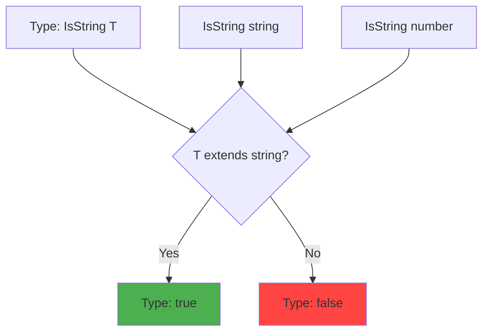
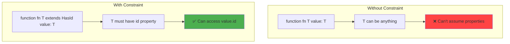
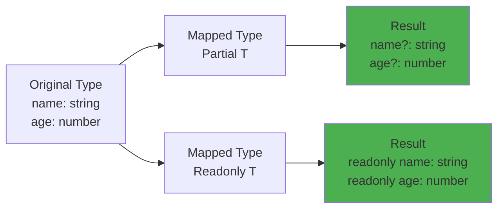

# Advanced generics

## 1. Why this exists (Real-world problem first)

You're building an API client library. Every endpoint returns different data. You write 50 functions, each with hardcoded types. Add new endpoint. Must copy-paste function, change types. Repeat 50 times. Code duplication everywhere.

**What breaks without advanced generics:**

- **Code duplication**: 50 functions that do the same thing, only types differ. Bug in one, must fix in all 50.
- **Type safety lost**: Use `any` to avoid duplication. Runtime errors in production.
- **Maintenance nightmare**: Change API response format. Must update 50 type definitions manually.
- **Can't reuse code**: Generic utilities (map, filter, reduce) can't be type-safe without generics.

**Real pain**: A SaaS platform had 100+ API endpoints. Each had custom fetch function with hardcoded types. Found bug in error handling. Had to fix in 100 places. Took 2 days. Missed 5 places. Production bugs. Refactored to use generic `apiClient<T>()`. One function, type-safe for all endpoints. Bug fix took 5 minutes.

**Another scenario**: An e-commerce app had custom `map`, `filter`, `reduce` functions for different types (products, users, orders). Each function was 50 lines. Total: 150 lines of duplicated code. Used TypeScript generics. Reduced to 50 lines total, type-safe for all types.

## 2. Mental model (build imagination)

Think of generics as **templates in a factory**.

**Without generics (custom mold for each product)**:
- Want to make red car: create red car mold
- Want to make blue car: create blue car mold
- Want to make green car: create green car mold
- 100 colors = 100 molds

**With generics (single adjustable mold)**:
- One mold with color parameter
- Set color to red: makes red car
- Set color to blue: makes blue car
- One mold, infinite colors

**In technical terms**:
- **Generic**: Type parameter that makes code reusable for different types
- **Type parameter**: Placeholder for actual type (like `T`, `K`, `V`)
- **Type constraint**: Limit what types can be used (like `T extends string`)
- **Conditional types**: Types that change based on conditions (like `T extends string ? number : boolean`)

**Key insight**: Generics enable **type-safe code reuse**. Write once, use with any type. Compiler ensures type safety.

## 3. How TypeScript implements this internally

### Generic type inference

TypeScript infers generic types from usage.

```typescript
function identity<T>(value: T): T {
  return value;
}

// TypeScript infers T = number
const num = identity(42);

// TypeScript infers T = string
const str = identity("hello");
```

**What happens**:
1. Compiler sees `identity(42)`
2. Matches argument type (`number`) to parameter type (`T`)
3. Infers `T = number`
4. Return type becomes `number`

**No runtime impact**: Generics are **erased** at runtime. JavaScript output has no generic information.

### Conditional types

TypeScript evaluates conditional types at compile time.

```typescript
type IsString<T> = T extends string ? true : false;

type A = IsString<string>;  // true
type B = IsString<number>;  // false
```

**What happens**:
1. Compiler checks if `T extends string`
2. If yes, type is `true`
3. If no, type is `false`

### Common misunderstanding

**Myth**: "Generics have runtime overhead."

**Reality**: Generics are **compile-time only**. Erased at runtime. No performance impact.

**Myth**: "Generics are just for arrays."

**Reality**: Generics work with **any type**—objects, functions, classes, promises, etc.

## 4. Multiple diagrams (MANDATORY)

### Generic type inference


### Conditional types flow



### Generic constraints



### Mapped types



## 5. Where this is used in real projects

### Generic API client

```typescript
// Generic API response type
interface ApiResponse<T> {
  data: T;
  status: number;
  message: string;
}

// Generic API client
class ApiClient {
  async get<T>(url: string): Promise<ApiResponse<T>> {
    const response = await fetch(url);
    const data = await response.json();
    
    return {
      data: data as T,
      status: response.status,
      message: response.statusText,
    };
  }
  
  async post<T, U>(url: string, body: U): Promise<ApiResponse<T>> {
    const response = await fetch(url, {
      method: 'POST',
      headers: { 'Content-Type': 'application/json' },
      body: JSON.stringify(body),
    });
    
    const data = await response.json();
    
    return {
      data: data as T,
      status: response.status,
      message: response.statusText,
    };
  }
}

// Usage with type safety
interface User {
  id: string;
  name: string;
  email: string;
}

interface CreateUserRequest {
  name: string;
  email: string;
}

const client = new ApiClient();

// TypeScript knows response.data is User
const response = await client.get<User>('/users/123');
console.log(response.data.name);  // Type-safe

// TypeScript knows request body is CreateUserRequest
const newUser = await client.post<User, CreateUserRequest>('/users', {
  name: 'John',
  email: 'john@example.com',
});
```

### Generic repository pattern

```typescript
// Generic repository interface
interface Repository<T> {
  findById(id: string): Promise<T | null>;
  findAll(): Promise<T[]>;
  create(data: Omit<T, 'id'>): Promise<T>;
  update(id: string, data: Partial<T>): Promise<T>;
  delete(id: string): Promise<void>;
}

// Generic base repository
class BaseRepository<T extends { id: string }> implements Repository<T> {
  constructor(private tableName: string) {}
  
  async findById(id: string): Promise<T | null> {
    const result = await db.query(
      `SELECT * FROM ${this.tableName} WHERE id = $1`,
      [id]
    );
    return result.rows[0] || null;
  }
  
  async findAll(): Promise<T[]> {
    const result = await db.query(`SELECT * FROM ${this.tableName}`);
    return result.rows;
  }
  
  async create(data: Omit<T, 'id'>): Promise<T> {
    const id = generateId();
    const result = await db.query(
      `INSERT INTO ${this.tableName} (id, ...) VALUES ($1, ...) RETURNING *`,
      [id, ...Object.values(data)]
    );
    return result.rows[0];
  }
  
  async update(id: string, data: Partial<T>): Promise<T> {
    const result = await db.query(
      `UPDATE ${this.tableName} SET ... WHERE id = $1 RETURNING *`,
      [id, ...Object.values(data)]
    );
    return result.rows[0];
  }
  
  async delete(id: string): Promise<void> {
    await db.query(`DELETE FROM ${this.tableName} WHERE id = $1`, [id]);
  }
}

// Usage
interface User {
  id: string;
  name: string;
  email: string;
}

const userRepo = new BaseRepository<User>('users');

// All methods are type-safe
const user = await userRepo.findById('123');  // user: User | null
const users = await userRepo.findAll();  // users: User[]
const newUser = await userRepo.create({ name: 'John', email: 'john@example.com' });
```

### Advanced generic utilities

```typescript
// Deep partial (makes all nested properties optional)
type DeepPartial<T> = {
  [K in keyof T]?: T[K] extends object ? DeepPartial<T[K]> : T[K];
};

// Deep readonly (makes all nested properties readonly)
type DeepReadonly<T> = {
  readonly [K in keyof T]: T[K] extends object ? DeepReadonly<T[K]> : T[K];
};

// Pick by value type
type PickByType<T, U> = {
  [K in keyof T as T[K] extends U ? K : never]: T[K];
};

// Omit by value type
type OmitByType<T, U> = {
  [K in keyof T as T[K] extends U ? never : K]: T[K];
};

// Usage
interface User {
  id: string;
  name: string;
  age: number;
  email: string;
  createdAt: Date;
}

// Only string properties
type StringProps = PickByType<User, string>;
// { id: string; name: string; email: string }

// Only number properties
type NumberProps = PickByType<User, number>;
// { age: number }

// Omit Date properties
type WithoutDates = OmitByType<User, Date>;
// { id: string; name: string; age: number; email: string }
```

### Generic event emitter

```typescript
// Type-safe event emitter
type EventMap = Record<string, any>;

class TypedEventEmitter<Events extends EventMap> {
  private listeners: {
    [K in keyof Events]?: Array<(data: Events[K]) => void>;
  } = {};
  
  on<K extends keyof Events>(event: K, listener: (data: Events[K]) => void): void {
    if (!this.listeners[event]) {
      this.listeners[event] = [];
    }
    this.listeners[event]!.push(listener);
  }
  
  emit<K extends keyof Events>(event: K, data: Events[K]): void {
    const eventListeners = this.listeners[event];
    if (eventListeners) {
      eventListeners.forEach(listener => listener(data));
    }
  }
}

// Usage
interface AppEvents {
  'user:created': { id: string; name: string };
  'user:deleted': { id: string };
  'order:placed': { orderId: string; total: number };
}

const emitter = new TypedEventEmitter<AppEvents>();

// Type-safe event listening
emitter.on('user:created', (data) => {
  console.log(data.name);  // TypeScript knows data has name
});

// Type-safe event emitting
emitter.emit('user:created', { id: '123', name: 'John' });  // ✅ Type-safe
emitter.emit('user:created', { id: '123' });  // ❌ Error: missing 'name'
```

## 6. Where this should NOT be used

### Over-engineering with complex generics

**Bad**:
```typescript
type ComplexGeneric<
  T extends Record<string, any>,
  K extends keyof T,
  V extends T[K],
  U extends V extends Array<infer R> ? R : never
> = ...  // 10 more lines of type gymnastics
```

**Why**: Unreadable, unmaintainable. Compiler errors are cryptic.

**Good**: Keep generics simple. If type is complex, break into smaller types.

### Using generics when concrete types suffice

**Bad**:
```typescript
function addNumbers<T extends number>(a: T, b: T): T {
  return (a + b) as T;
}
```

**Why**: Unnecessary. `number` type is sufficient.

**Good**:
```typescript
function addNumbers(a: number, b: number): number {
  return a + b;
}
```

### Generic constraints that are too loose

**Bad**:
```typescript
function process<T>(value: T): T {
  return value.toString();  // ❌ Error: T might not have toString
}
```

**Why**: `T` is unconstrained. Can't assume methods.

**Good**:
```typescript
function process<T extends { toString(): string }>(value: T): string {
  return value.toString();
}
```

## 7. Failure modes & edge cases

### Type inference fails

**Scenario**: Generic function, TypeScript infers wrong type.

```typescript
function wrap<T>(value: T) {
  return { value };
}

const result = wrap(null);  // T inferred as null, not intended
```

**Impact**: Unexpected types, runtime errors.

**Solution**: Explicitly specify type parameter.

```typescript
const result = wrap<string | null>(null);
```

### Circular generic constraints

**Scenario**: Generic type references itself.

```typescript
type Circular<T extends Circular<T>> = {  // ❌ Error
  value: T;
};
```

**Impact**: Compiler error.

**Solution**: Refactor to avoid circular reference.

### Generic type too broad

**Scenario**: Generic accepts any type, loses type safety.

```typescript
function process<T>(value: T): any {  // BAD: returns any
  return JSON.parse(JSON.stringify(value));
}
```

**Impact**: Type safety lost.

**Solution**: Return proper type.

```typescript
function process<T>(value: T): T {
  return JSON.parse(JSON.stringify(value)) as T;
}
```

## 8. Trade-offs & alternatives

### What you gain

- **Code reuse**: Write once, use with many types
- **Type safety**: Compiler ensures correctness
- **Refactoring confidence**: Change types, compiler catches all usages
- **Better IDE support**: Autocomplete, type hints

### What you sacrifice

- **Complexity**: Generics can be hard to understand
- **Longer compile times**: Complex generics slow down compiler
- **Verbose type errors**: Generic errors can be cryptic
- **Learning curve**: Team must understand generics

### Alternatives

**Function overloads**
- **Use case**: Few type variations
- **Benefit**: Simpler than generics
- **Trade-off**: Doesn't scale to many types

**Union types**
- **Use case**: Fixed set of types
- **Benefit**: Simple, explicit
- **Trade-off**: Not reusable

**`any` type**
- **Use case**: Never (except for migration)
- **Benefit**: No type errors
- **Trade-off**: No type safety

## 9. Interview-level articulation

**Question**: "What are TypeScript generics and when would you use them?"

**Weak answer**: "Generics let you use different types."

**Strong answer**: "Generics are type parameters that enable type-safe code reuse. For example, I built a generic API client `get<T>(url): Promise<ApiResponse<T>>` that works with any response type while maintaining type safety. Instead of writing 100 custom fetch functions, I have one generic function. TypeScript infers the type parameter from usage—`get<User>('/users/123')` returns `ApiResponse<User>`, and the compiler ensures I only access valid User properties. I also use generics for repository patterns—`BaseRepository<T>` provides CRUD operations for any entity type. This eliminates code duplication while preserving type safety. The key is balancing reusability with simplicity—I avoid over-engineering with complex nested generics."

**Follow-up**: "What's the difference between generics and `any`?"

**Answer**: "Generics preserve type information while `any` erases it. With `any`, TypeScript doesn't check types—you can call any method, access any property, and the compiler won't complain. This leads to runtime errors. With generics, TypeScript tracks the actual type. For example, `identity<T>(value: T): T` preserves the type—if I pass a `number`, TypeScript knows the return type is `number`. With `identity(value: any): any`, TypeScript doesn't know what type is returned. Generics give you type safety with flexibility, while `any` gives you flexibility without type safety."

**Follow-up**: "How do you handle complex generic constraints?"

**Answer**: "I use `extends` to constrain generic types. For example, `function getProperty<T, K extends keyof T>(obj: T, key: K): T[K]` ensures `key` is a valid property of `obj`. For more complex constraints, I use conditional types—`type IsArray<T> = T extends Array<any> ? true : false`. I also use mapped types for transformations—`type Partial<T> = { [K in keyof T]?: T[K] }` makes all properties optional. The key is keeping constraints readable—if a generic type becomes too complex, I break it into smaller, composable types."

## 10. Key takeaways (engineer mindset)

**What to remember**:
- **Generics enable type-safe code reuse**—write once, use with any type
- **TypeScript infers generic types from usage**—usually don't need to specify explicitly
- **Use `extends` to constrain generic types**—ensure type has required properties
- **Generics are compile-time only**—erased at runtime, no performance impact
- **Keep generics simple**—avoid over-engineering with complex nested generics

**What decisions this enables**:
- Choosing when to use generics vs concrete types
- Designing reusable, type-safe APIs
- Building generic utilities (repository, API client, event emitter)
- Balancing type safety vs simplicity

**How it connects to other Node.js concepts**:
- **API clients**: Generic fetch functions for type-safe HTTP requests
- **Repository pattern**: Generic CRUD operations for any entity
- **Event emitters**: Type-safe event handling
- **Utilities**: Generic map, filter, reduce with type preservation
- **Type safety**: Generics are foundation of TypeScript's type system
