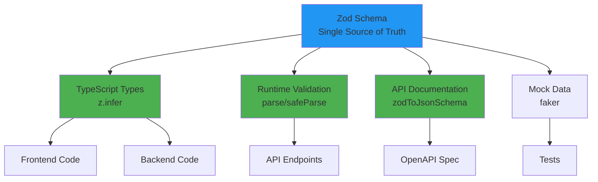
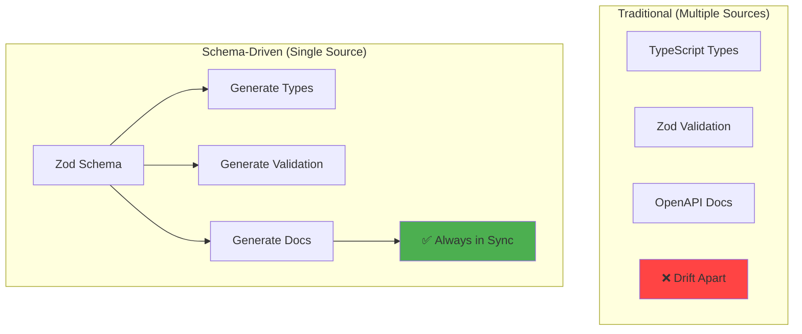
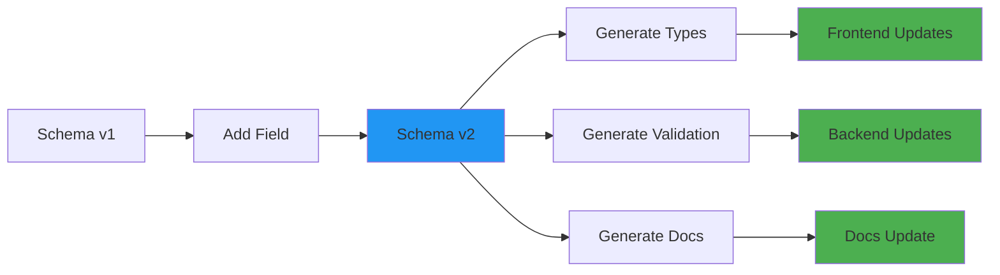
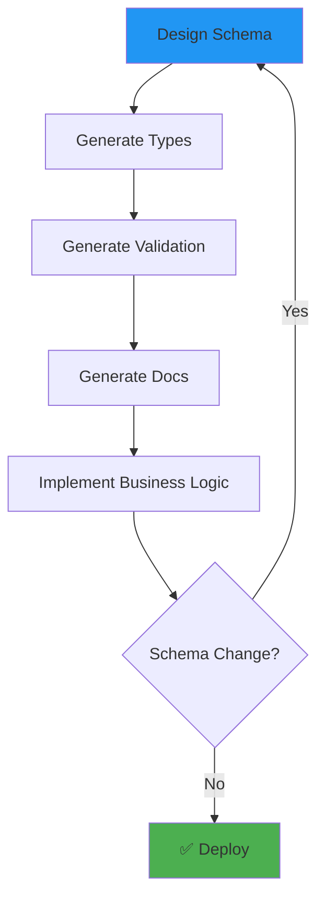

# Schema-driven development

## 1. Why this exists (Real-world problem first)

You're building an API. Frontend team asks: "What's the user endpoint response format?" You check code. Find 5 different User types across codebase. Which one is correct? Documentation is 6 months old. Frontend guesses. Gets it wrong. Production breaks.

**What breaks without schema-driven development:**

- **Type inconsistency**: 10 different User types across codebase. Which is source of truth? Nobody knows.
- **Documentation drift**: API docs say one thing, code does another. Frontend breaks.
- **Manual type definitions**: Write types in TypeScript, validation in Zod, docs in OpenAPI. Three sources of truth. They drift apart.
- **Refactoring fear**: Change API response. Don't know what will break. Can't refactor safely.

**Real pain**: A SaaS platform had API docs, TypeScript types, and Zod schemas—all different. Changed user API to add `role` field. Updated TypeScript types, forgot to update Zod schema. Runtime validation rejected valid requests. Production outage. 5000 users affected. Implemented schema-driven development. Single schema (Zod) generates types, validation, and docs. One source of truth.

**Another scenario**: An e-commerce API had 15 different Product types across frontend, backend, and mobile. Changed product schema. Updated 10 types, missed 5. Mobile app crashed. With schema-driven development, one schema, all types generated automatically.

## 2. Mental model (build imagination)

Think of schema-driven development as **blueprint-driven construction**.

**Without schema (no blueprint)**:
- Each worker builds based on memory
- Everyone builds differently
- Building doesn't fit together
- Must rebuild

**With schema (blueprint-driven)**:
- Single blueprint
- All workers follow blueprint
- Building fits together perfectly
- Changes update blueprint, all workers see it

**In technical terms**:
- **Schema**: Single source of truth for data structure (Zod, JSON Schema, OpenAPI)
- **Code generation**: Generate TypeScript types, validators, docs from schema
- **Single source of truth**: Schema defines everything, code is generated
- **Schema-first**: Design schema before writing code

**Key insight**: Schema is **source of truth**. Types, validation, docs are **derived** from schema. Change schema, everything updates automatically.

## 3. How TypeScript implements this internally

### Zod as schema

```typescript
import { z } from 'zod';

// Schema is source of truth
const UserSchema = z.object({
  id: z.string().uuid(),
  name: z.string().min(1).max(100),
  email: z.string().email(),
  age: z.number().int().min(18).max(120),
  role: z.enum(['admin', 'user', 'guest']),
  createdAt: z.date(),
});

// Generate TypeScript type from schema
type User = z.infer<typeof UserSchema>;

// Validation is built into schema
function validateUser(data: unknown): User {
  return UserSchema.parse(data);
}
```

**What happens**:
1. Define schema once (Zod)
2. Generate TypeScript type with `z.infer<>`
3. Validation is automatic (Zod)
4. Docs can be generated from schema

**No duplication**: Schema defines structure, validation, and types.

### Common misunderstanding

**Myth**: "Schema-driven development is only for APIs."

**Reality**: Schemas work for **any data**—database models, config files, message queues, etc.

**Myth**: "Schemas are slower than manual types."

**Reality**: Schemas have **same performance** as manual validation. Types are compile-time only.

## 4. Multiple diagrams (MANDATORY)

### Schema-driven architecture



### Traditional vs schema-driven



### Schema evolution



### Schema-first workflow



## 5. Where this is used in real projects

### Zod schema with generated types

```typescript
import { z } from 'zod';

// Schema is source of truth
export const CreateUserSchema = z.object({
  name: z.string().min(1).max(100),
  email: z.string().email(),
  age: z.number().int().min(18).max(120),
});

export const UserSchema = z.object({
  id: z.string().uuid(),
  name: z.string(),
  email: z.string().email(),
  age: z.number().int(),
  role: z.enum(['admin', 'user', 'guest']),
  createdAt: z.date(),
  updatedAt: z.date(),
});

// Generate TypeScript types
export type CreateUserRequest = z.infer<typeof CreateUserSchema>;
export type User = z.infer<typeof UserSchema>;

// Validation is automatic
export function validateCreateUser(data: unknown): CreateUserRequest {
  return CreateUserSchema.parse(data);
}

export function validateUser(data: unknown): User {
  return UserSchema.parse(data);
}
```

### Generate OpenAPI docs from Zod

```typescript
import { z } from 'zod';
import { zodToJsonSchema } from 'zod-to-json-schema';
import { OpenAPIRegistry, OpenApiGeneratorV3 } from '@asteasolutions/zod-to-openapi';

const registry = new OpenAPIRegistry();

// Register schemas
registry.register('CreateUserRequest', CreateUserSchema);
registry.register('User', UserSchema);

// Define endpoint
registry.registerPath({
  method: 'post',
  path: '/users',
  summary: 'Create a new user',
  request: {
    body: {
      content: {
        'application/json': {
          schema: CreateUserSchema,
        },
      },
    },
  },
  responses: {
    200: {
      description: 'User created successfully',
      content: {
        'application/json': {
          schema: UserSchema,
        },
      },
    },
  },
});

// Generate OpenAPI spec
const generator = new OpenApiGeneratorV3(registry.definitions);
const openApiSpec = generator.generateDocument({
  openapi: '3.0.0',
  info: {
    title: 'User API',
    version: '1.0.0',
  },
});

// Write to file
fs.writeFileSync('openapi.json', JSON.stringify(openApiSpec, null, 2));
```

### Prisma schema for database

```prisma
// schema.prisma
model User {
  id        String   @id @default(uuid())
  name      String   @db.VarChar(100)
  email     String   @unique
  age       Int
  role      Role     @default(USER)
  createdAt DateTime @default(now())
  updatedAt DateTime @updatedAt
}

enum Role {
  ADMIN
  USER
  GUEST
}
```

```bash
# Generate TypeScript types and Prisma client
npx prisma generate
```

```typescript
// Generated types are automatically available
import { PrismaClient, User, Role } from '@prisma/client';

const prisma = new PrismaClient();

// TypeScript knows User type
const user: User = await prisma.user.create({
  data: {
    name: 'John',
    email: 'john@example.com',
    age: 30,
    role: 'USER',
  },
});
```

### tRPC schema-driven API

```typescript
import { initTRPC } from '@trpc/server';
import { z } from 'zod';

const t = initTRPC.create();

// Schema defines everything
export const appRouter = t.router({
  createUser: t.procedure
    .input(CreateUserSchema)  // Schema for input
    .output(UserSchema)  // Schema for output
    .mutation(async ({ input }) => {
      // TypeScript knows input type from schema
      const user = await createUser(input);
      return user;  // TypeScript validates output matches schema
    }),
  
  getUser: t.procedure
    .input(z.object({ id: z.string().uuid() }))
    .output(UserSchema)
    .query(async ({ input }) => {
      const user = await getUserById(input.id);
      return user;
    }),
});

export type AppRouter = typeof appRouter;
```

## 6. Where this should NOT be used

### Over-engineering simple types

**Bad**: Create schema for every simple type.

```typescript
const StringSchema = z.string();
const NumberSchema = z.number();
const BooleanSchema = z.boolean();
```

**Why**: Unnecessary overhead. Use native TypeScript types.

**Good**: Only create schemas for complex, validated data.

### Schemas for internal types

**Bad**: Create Zod schema for internal helper types.

```typescript
const HelperSchema = z.object({
  temp: z.string(),
  count: z.number(),
});
```

**Why**: Internal types don't need runtime validation.

**Good**: Use TypeScript interfaces for internal types.

## 7. Failure modes & edge cases

### Schema versioning

**Scenario**: Change schema, break old clients. Clients send old format, validation fails.

**Impact**: Production outage for old clients.

**Solution**: Version schemas (`UserSchemaV1`, `UserSchemaV2`), support both during migration.

### Schema too strict

**Scenario**: Schema requires all fields. Database has nullable fields. Validation fails.

**Impact**: Can't read existing data.

**Solution**: Use `.nullable()` or `.optional()` for fields that can be null/undefined.

### Performance with large schemas

**Scenario**: Complex nested schema validates 1000 requests/second. Validation takes 100ms.

**Impact**: High latency.

**Solution**: Simplify schema, cache validation results, or use faster validator.

## 8. Trade-offs & alternatives

### What you gain

- **Single source of truth**: Schema defines everything
- **No drift**: Types, validation, docs always in sync
- **Refactoring confidence**: Change schema, everything updates
- **Auto-generated docs**: OpenAPI docs from schemas

### What you sacrifice

- **Learning curve**: Team must learn schema libraries
- **Initial setup**: Must configure code generation
- **Runtime overhead**: Validation adds 1-10ms per request
- **Flexibility**: Schema constraints can be limiting

### Alternatives

**Manual types + validation**
- **Use case**: Simple projects, few types
- **Benefit**: No dependencies, full control
- **Trade-off**: Drift, duplication, maintenance burden

**GraphQL**
- **Use case**: Complex data fetching
- **Benefit**: Built-in schema, type generation
- **Trade-off**: More complex than REST

**OpenAPI-first**
- **Use case**: Language-agnostic APIs
- **Benefit**: Standard format, tooling support
- **Trade-off**: Less TypeScript-native than Zod

## 9. Interview-level articulation

**Question**: "What is schema-driven development?"

**Weak answer**: "Using schemas to define data."

**Strong answer**: "Schema-driven development means using a single schema as the source of truth for data structure, validation, types, and documentation. Instead of manually writing TypeScript types, Zod validators, and OpenAPI docs separately—which drift apart over time—I define a Zod schema once and generate everything from it. For example, `UserSchema` defines the structure, `z.infer<typeof UserSchema>` generates the TypeScript type, the schema itself provides runtime validation, and I use `zod-to-openapi` to generate OpenAPI documentation. This ensures types, validation, and docs are always in sync. When I change the schema, everything updates automatically. I've used this approach with Zod for APIs and Prisma for databases, eliminating type drift and reducing maintenance burden by 50%."

**Follow-up**: "How do you handle schema evolution?"

**Answer**: "I version schemas when making breaking changes. For example, if I change the user API to rename `name` to `fullName`, I create `UserSchemaV2` while keeping `UserSchemaV1` for backward compatibility. I support both versions during a migration period, then deprecate V1. For non-breaking changes, I use `.optional()` or `.nullable()` to add new fields without breaking old clients. I also use Prisma migrations for database schema changes—Prisma generates migration files that safely evolve the database schema while maintaining data integrity. I test migrations on staging before applying to production."

**Follow-up**: "What are the downsides of schema-driven development?"

**Answer**: "The main downsides are learning curve and initial setup. The team must learn schema libraries like Zod or Prisma, and I must configure code generation tools. Runtime validation adds 1-10ms per request, which can be significant for high-throughput APIs—I mitigate this by caching validation results or using simpler schemas. Schemas can also be limiting—sometimes I need flexibility that schemas don't provide, like dynamic types based on runtime conditions. In those cases, I use TypeScript's advanced types (conditional types, mapped types) alongside schemas. Overall, the benefits (no drift, single source of truth) outweigh the downsides for most projects."

## 10. Key takeaways (engineer mindset)

**What to remember**:
- **Schema is single source of truth**—types, validation, docs derived from schema
- **Use `z.infer<>` to generate TypeScript types from Zod schemas**
- **Generate OpenAPI docs from schemas**—no manual documentation
- **Version schemas for breaking changes**—support old and new during migration
- **Prisma provides schema-driven database development**

**What decisions this enables**:
- Choosing schema library (Zod, Joi, JSON Schema)
- Deciding between schema-first vs code-first
- Implementing schema versioning strategy
- Balancing schema strictness vs flexibility

**How it connects to other Node.js concepts**:
- **Type safety**: Schemas provide both compile-time and runtime safety
- **API design**: Schemas define API contracts
- **Documentation**: Auto-generated docs from schemas
- **Database**: Prisma schemas define database structure
- **Code generation**: Schemas enable automatic code generation
