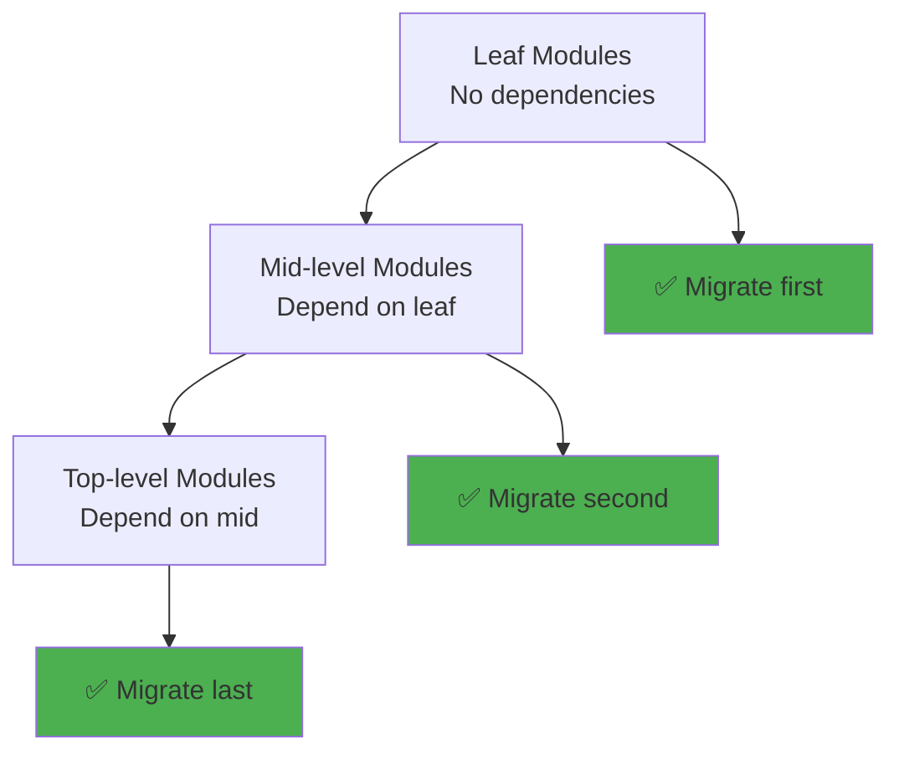
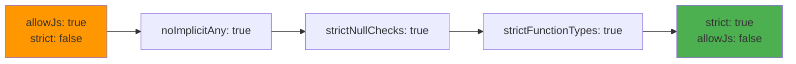
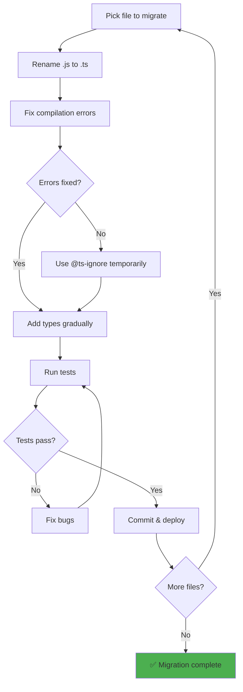

# Migrating JS → TS safely

## 1. Why this exists (Real-world problem first)

You have a 100,000-line JavaScript codebase. Management wants TypeScript. You rename all `.js` files to `.ts`. TypeScript shows 10,000 errors. You spend 6 months fixing errors. Team productivity drops 50%. Project delayed 1 year.

**What breaks without safe migration:**

- **Big bang migration fails**: Rename all files to `.ts`, get 10,000 errors. Can't ship features for months. Business suffers.
- **Type errors block deployment**: Enable strict mode immediately. Compilation fails. Can't deploy. Production blocked.
- **Team resistance**: Developers overwhelmed by errors. Complain. Morale drops. Some quit.
- **Lost productivity**: Spend all time fixing type errors, no time for features. Revenue impact.

**Real pain**: An e-commerce platform tried big bang migration. Renamed 500 files to TypeScript. Got 5,000 errors. Spent 4 months fixing errors. No new features shipped. Lost $500,000 in revenue. Rolled back to JavaScript. Later tried incremental migration. Migrated 10 files/week. Took 1 year, but shipped features throughout. Zero revenue impact.

**Another scenario**: A SaaS platform enabled `strict` mode immediately. 2,000 type errors. Team spent 3 months fixing errors. Morale dropped. 2 senior engineers quit. Learned to migrate incrementally with loose types first, then gradually tighten.

## 2. Mental model (build imagination)

Think of JS to TS migration as **renovating a house while living in it**.

**Big bang (move out, renovate, move back)**:
- Move out of house
- Tear down everything
- Rebuild from scratch
- Move back in
- Can't live in house for 6 months

**Incremental (renovate room by room)**:
- Live in house
- Renovate one room at a time
- Still functional throughout
- Takes longer, but always livable

**In technical terms**:
- **Big bang**: Rename all files to `.ts`, fix all errors at once
- **Incremental**: Migrate files one by one, ship features throughout
- **Loose types first**: Use `any`, gradually tighten to `strict`
- **Bottom-up**: Migrate leaf modules first, then modules that depend on them

**Key insight**: Migration is **marathon, not sprint**. Incremental migration allows shipping features while improving type safety.

## 3. How TypeScript implements this internally

### TypeScript compiler options for migration

```json
// tsconfig.json (initial migration)
{
  "compilerOptions": {
    "allowJs": true,  // Allow .js files
    "checkJs": false,  // Don't type-check .js files
    "noEmit": false,  // Generate JavaScript
    "strict": false,  // Disable strict mode
    "noImplicitAny": false,  // Allow implicit any
    "strictNullChecks": false,  // Allow null/undefined
  },
  "include": ["src/**/*"],
  "exclude": ["node_modules"]
}
```

**What happens**:
1. TypeScript compiles both `.js` and `.ts` files
2. `.js` files are not type-checked
3. `.ts` files have loose type checking
4. Can gradually migrate files

### Gradual strictness

```json
// tsconfig.json (after 50% migration)
{
  "compilerOptions": {
    "allowJs": true,
    "checkJs": false,
    "strict": false,
    "noImplicitAny": true,  // Enable gradually
    "strictNullChecks": false,
  }
}
```

```json
// tsconfig.json (after 100% migration)
{
  "compilerOptions": {
    "allowJs": false,  // Only .ts files
    "strict": true,  // Full strict mode
  }
}
```

### Common misunderstanding

**Myth**: "Must enable strict mode immediately."

**Reality**: Start with **loose types**, gradually tighten. Strict mode is the goal, not the starting point.

**Myth**: "Must fix all type errors before deploying."

**Reality**: Can deploy with type errors (use `skipLibCheck`, `noEmit`). Fix errors incrementally.

## 4. Multiple diagrams (MANDATORY)

### Migration strategies

```mermaid
graph TB
    subgraph "Big Bang (❌ Fails)"
        B1[100% JavaScript]
        B1 --> B2[Rename all to .ts]
        B2 --> B3[10,000 errors]
        B3 --> B4[6 months fixing]
        B4 --> B5[❌ No features shipped]
    end
    
    subgraph "Incremental (✅ Works)"
        I1[100% JavaScript]
        I1 --> I2[Migrate 10 files/week]
        I2 --> I3[Ship features weekly]
        I3 --> I4[1 year migration]
        I4 --> I5[✅ 100% TypeScript]
    end
    
    style B5 fill:#ff4444
    style I5 fill:#4CAF50
```



### Bottom-up migration



### Gradual strictness



### Migration workflow



## 5. Where this is used in real projects

### Initial tsconfig.json

```json
{
  "compilerOptions": {
    // Allow JavaScript files
    "allowJs": true,
    "checkJs": false,
    
    // Generate JavaScript output
    "noEmit": false,
    "outDir": "dist",
    "rootDir": "src",
    
    // Loose type checking
    "strict": false,
    "noImplicitAny": false,
    "strictNullChecks": false,
    "strictFunctionTypes": false,
    "strictPropertyInitialization": false,
    
    // Modern JavaScript
    "target": "ES2020",
    "module": "commonjs",
    "esModuleInterop": true,
    
    // Skip type checking node_modules
    "skipLibCheck": true
  },
  "include": ["src/**/*"],
  "exclude": ["node_modules", "dist"]
}
```

### Migrating a file

```javascript
// Before (user.js)
function createUser(name, email, age) {
  return {
    id: generateId(),
    name: name,
    email: email,
    age: age,
    createdAt: new Date(),
  };
}

module.exports = { createUser };
```

```typescript
// After (user.ts) - Step 1: Rename, add basic types
function createUser(name: string, email: string, age: number) {
  return {
    id: generateId(),
    name: name,
    email: email,
    age: age,
    createdAt: new Date(),
  };
}

export { createUser };
```

```typescript
// After (user.ts) - Step 2: Add return type
interface User {
  id: string;
  name: string;
  email: string;
  age: number;
  createdAt: Date;
}

function createUser(name: string, email: string, age: number): User {
  return {
    id: generateId(),
    name,
    email,
    age,
    createdAt: new Date(),
  };
}

export { createUser, User };
```

### Using @ts-ignore temporarily

```typescript
// Temporary workaround for complex type errors
function complexFunction(data: any) {
  // @ts-ignore - TODO: Fix type error
  const result = legacyLibrary.process(data);
  return result;
}
```

**Note**: Use `@ts-ignore` sparingly. Add TODO comment. Fix later.

### Gradual strictness migration

```json
// Week 1: Enable noImplicitAny
{
  "compilerOptions": {
    "strict": false,
    "noImplicitAny": true,  // ✅ Enabled
  }
}
```

```json
// Week 4: Enable strictNullChecks
{
  "compilerOptions": {
    "strict": false,
    "noImplicitAny": true,
    "strictNullChecks": true,  // ✅ Enabled
  }
}
```

```json
// Week 8: Enable full strict mode
{
  "compilerOptions": {
    "strict": true,  // ✅ All strict checks enabled
  }
}
```

### Migration tracking

```typescript
// scripts/migration-progress.ts
import * as fs from 'fs';
import * as path from 'path';

function countFiles(dir: string, ext: string): number {
  let count = 0;
  const files = fs.readdirSync(dir);
  
  for (const file of files) {
    const filePath = path.join(dir, file);
    const stat = fs.statSync(filePath);
    
    if (stat.isDirectory()) {
      count += countFiles(filePath, ext);
    } else if (file.endsWith(ext)) {
      count++;
    }
  }
  
  return count;
}

const jsFiles = countFiles('src', '.js');
const tsFiles = countFiles('src', '.ts');
const total = jsFiles + tsFiles;
const progress = ((tsFiles / total) * 100).toFixed(1);

console.log(`Migration Progress: ${progress}%`);
console.log(`TypeScript files: ${tsFiles}`);
console.log(`JavaScript files: ${jsFiles}`);
console.log(`Total files: ${total}`);
```

## 6. Where this should NOT be used

### Migrating everything at once

**Bad**: Rename all 500 files to `.ts` in one PR.

**Why**: 10,000 errors, can't deploy, team overwhelmed.

**Good**: Migrate 5-10 files per week.

### Enabling strict mode immediately

**Bad**: Set `strict: true` on day 1.

**Why**: 5,000 errors, can't compile, team blocked.

**Good**: Enable strict checks one by one over weeks/months.

### Rewriting code during migration

**Bad**: Migrate file and refactor at same time.

**Why**: Hard to debug. Don't know if error is from migration or refactor.

**Good**: Migrate first (minimal changes), refactor later.

## 7. Failure modes & edge cases

### Type errors block deployment

**Scenario**: Enable `noImplicitAny`. 500 errors. Can't compile. Can't deploy.

**Impact**: Production blocked.

**Solution**: Use `skipLibCheck`, fix errors incrementally, or use `@ts-ignore` temporarily.

### Team resistance

**Scenario**: Developers overwhelmed by type errors. Complain. Refuse to fix.

**Impact**: Migration stalls.

**Solution**: Migrate slowly (5-10 files/week), celebrate progress, provide training.

### Third-party library types missing

**Scenario**: Migrate file that uses old library. No `@types` package. 100 errors.

**Impact**: Can't migrate file.

**Solution**: Use `declare module` to stub types, or use `any` for library.

```typescript
// types/legacy-library.d.ts
declare module 'legacy-library' {
  export function process(data: any): any;
}
```

## 8. Trade-offs & alternatives

### What you gain

- **Type safety**: Catch bugs at compile time
- **Better IDE support**: Autocomplete, refactoring
- **Refactoring confidence**: Rename safely
- **Documentation**: Types serve as documentation

### What you sacrifice

- **Migration time**: Takes 6-12 months for large codebases
- **Initial productivity drop**: Team learns TypeScript
- **Maintenance**: Must maintain types
- **Build complexity**: Must compile TypeScript

### Alternatives

**Stay with JavaScript + JSDoc**
- **Use case**: Small team, simple codebase
- **Benefit**: No migration needed
- **Trade-off**: Less type safety

**Rewrite in TypeScript**
- **Use case**: Small codebase (<10,000 lines)
- **Benefit**: Clean slate
- **Trade-off**: High risk, long timeline

**Gradual migration (recommended)**
- **Use case**: Large codebase, active development
- **Benefit**: Ship features while migrating
- **Trade-off**: Takes time

## 9. Interview-level articulation

**Question**: "How do you migrate a large JavaScript codebase to TypeScript?"

**Weak answer**: "Rename files to .ts and fix errors."

**Strong answer**: "I use incremental migration, not big bang. I start with `allowJs: true` and `strict: false` in `tsconfig.json`, allowing JavaScript and TypeScript to coexist. I migrate 5-10 files per week, starting with leaf modules (no dependencies) and working up to top-level modules. For each file, I rename `.js` to `.ts`, fix compilation errors, add basic types, and gradually improve type coverage. I use `@ts-ignore` temporarily for complex errors and add TODO comments to fix later. After migrating all files, I gradually enable strict checks—first `noImplicitAny`, then `strictNullChecks`, then full `strict` mode. This approach took 1 year for a 100,000-line codebase, but we shipped features throughout. I track progress with a script that counts `.js` vs `.ts` files and celebrate milestones (25%, 50%, 75%, 100%)."

**Follow-up**: "How do you handle third-party libraries without types?"

**Answer**: "I first check if `@types` packages exist on DefinitelyTyped. If not, I create a `.d.ts` file to stub the types. For example, `types/legacy-library.d.ts` with `declare module 'legacy-library' { export function process(data: any): any; }`. This allows the code to compile while using `any` for the library. Later, I can improve the types by reading the library's documentation and adding proper type definitions. For critical libraries, I sometimes contribute types to DefinitelyTyped. For internal legacy code, I use `@ts-ignore` temporarily and add TODO comments to fix later."

**Follow-up**: "What's the biggest mistake teams make during migration?"

**Answer**: "The biggest mistake is trying to migrate everything at once—renaming all files to `.ts` and enabling `strict` mode immediately. This creates thousands of errors, blocks deployment, and overwhelms the team. I've seen teams spend 6 months fixing errors with no features shipped, leading to morale issues and even engineers quitting. The right approach is incremental migration: migrate 5-10 files per week, ship features throughout, and gradually enable strict checks. This takes longer (6-12 months) but maintains team productivity and morale. Another mistake is rewriting code during migration—this makes debugging hard because you don't know if errors are from migration or refactoring. I migrate first with minimal changes, then refactor later."

## 10. Key takeaways (engineer mindset)

**What to remember**:
- **Incremental migration, not big bang**—migrate 5-10 files per week
- **Start with loose types, gradually tighten**—`strict: false` → `strict: true`
- **Bottom-up migration**—leaf modules first, then modules that depend on them
- **Use `@ts-ignore` temporarily**—fix complex errors later
- **Track progress and celebrate milestones**—keep team motivated

**What decisions this enables**:
- Choosing migration strategy (incremental vs big bang)
- Deciding migration order (bottom-up vs top-down)
- Balancing migration speed vs feature development
- Determining when to enable strict checks

**How it connects to other Node.js concepts**:
- **Type safety**: Gradual improvement in type coverage
- **Build tools**: TypeScript compilation in build pipeline
- **Testing**: Tests help validate migration correctness
- **Team dynamics**: Migration affects team productivity and morale
- **Technical debt**: Migration reduces long-term technical debt
