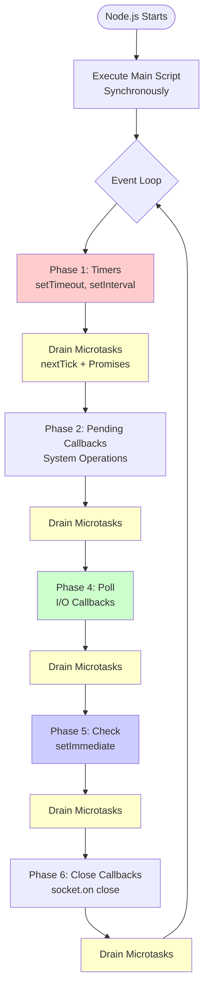
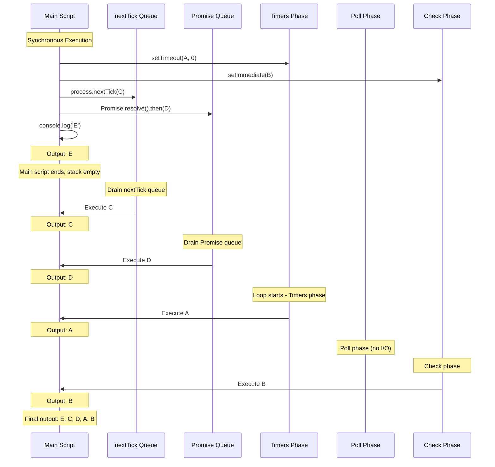
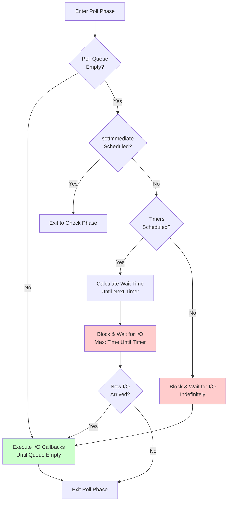

# Event Loop – all phases

## 1. Why this exists (Real-world problem first)

Your payment processing API suddenly starts dropping 5% of requests during peak hours. No errors in logs. CPU is at 30%. Memory is fine. Database is healthy. What's happening?

The culprit: A developer added `crypto.pbkdf2Sync()` for password hashing in a middleware, blocking the event loop for 100ms per request. At 50 concurrent requests, the event loop is blocked for 5 seconds straight. Health checks timeout. Load balancer marks the instance unhealthy. Traffic shifts to other instances, overloading them. Cascade failure.

**Real production failures from Event Loop ignorance:**

1. **The Mysterious Timeout**: WebSocket connections randomly disconnect every 30 seconds. Root cause: A `setTimeout` in the timers phase was supposed to send heartbeats, but a long-running I/O callback in the poll phase delayed timer execution.

2. **The Out-of-Order Logger**: Audit logs show events in the wrong sequence. Developer assumed `process.nextTick` would run "next," but it actually runs *before* I/O callbacks, causing timestamps to be misleading.

3. **The Starved Health Check**: Kubernetes kills pods because `/health` endpoint times out. The app is running fine, but a recursive `setImmediate` loop is monopolizing the check phase, preventing new HTTP requests from being processed.

**What breaks without this knowledge:**
- You can't predict execution order (critical for race conditions)
- You can't debug latency spikes or "jitter"
- You write code that accidentally starves I/O
- You fail interviews when asked about `setTimeout` vs `setImmediate`

## 2. Mental model (build imagination)

Think of the Event Loop as a **Six-Station Assembly Line** that never stops running.

### The Assembly Line Analogy

Imagine a factory worker who walks in a circle checking six different stations. At each station, there's a queue of tasks. The worker processes tasks from one station, then moves to the next, continuously looping.

**The 6 Stations:**

1. **Timers Station**: "Check if any alarms have gone off" (`setTimeout`, `setInterval`)
2. **Pending Callbacks Station**: "Handle any system errors from last round" (mostly internal)
3. **Idle/Prepare Station**: (Internal libuv housekeeping - skip in mental model)
4. **Poll Station (The Main Hub)**: "Check mailbox for new I/O" (file reads, network data)
5. **Check Station**: "Process 'urgent' requests" (`setImmediate`)
6. **Close Station**: "Clean up closed connections" (`socket.on('close')`)

**The Special Rule - VIP Queue:**
Between EVERY station (and sometimes within), there's a VIP queue that gets processed immediately:
- **Ultra-VIP**: `process.nextTick` (highest priority)
- **VIP**: Promise microtasks (second priority)

The worker MUST empty the VIP queue before moving to the next station.

**The Flow:**
1. Worker checks Timers. "Alarm #1 is due!" Executes callback.
2. VIP rushes in with a `nextTick` task. Worker stops, handles it.
3. Worker moves to Poll. "New file data arrived!" Executes callback.
4. Another VIP (Promise) arrives. Worker handles it.
5. Worker moves to Check. Executes `setImmediate` callback.
6. Worker moves to Close. Handles socket cleanup.
7. Loop repeats from Timers.

**Why this matters:**
- If a callback at any station takes too long, ALL other stations wait
- VIP queue can starve the entire loop if it never empties
- Understanding station order explains why `setImmediate` runs before `setTimeout(fn, 0)` in I/O callbacks

## 3. How Node.js implements this internally

The Event Loop is implemented by **libuv** (C library). Node.js initializes it, runs your main script synchronously, then enters the loop.

### The 6 Phases in Detail

```c
// Simplified libuv event loop structure
while (loop_alive) {
  uv_update_time(loop);           // Update current time
  uv_run_timers(loop);            // Phase 1: Timers
  uv_run_pending(loop);           // Phase 2: Pending callbacks
  uv_run_idle(loop);              // Phase 3: Idle
  uv_run_prepare(loop);           // Phase 3: Prepare
  
  timeout = uv_backend_timeout(loop);
  uv_io_poll(loop, timeout);      // Phase 4: Poll (I/O)
  
  uv_run_check(loop);             // Phase 5: Check
  uv_run_closing_handles(loop);   // Phase 6: Close callbacks
}
```

#### Phase 1: Timers
- Maintains a **min-heap** of timers sorted by expiration time
- Checks if `current_time >= timer.threshold`
- Executes callbacks for expired timers
- **NOT precise**: Timers only execute when the loop reaches this phase

#### Phase 2: Pending Callbacks
- Executes I/O callbacks deferred from the previous loop iteration
- Mostly TCP errors, some system operations
- Usually empty in typical applications

#### Phase 3: Idle, Prepare
- Internal libuv phases
- Used by libuv itself for housekeeping
- Not directly exposed to JavaScript

#### Phase 4: Poll (The Heart)
- **Most important phase** - where your app spends 90% of time
- Retrieves new I/O events from the OS
- Executes I/O callbacks (except timers, `setImmediate`, close callbacks)

**Poll Phase Logic:**
```
if (poll_queue not empty) {
  Execute all callbacks synchronously until:
    - Queue is empty, OR
    - System-dependent hard limit reached
} else {
  if (setImmediate callbacks scheduled) {
    Exit poll phase, go to Check phase
  } else if (timers scheduled) {
    Calculate time until next timer
    Wait (block) for I/O events up to that time
  } else {
    Wait (block) indefinitely for I/O events
  }
}
```

#### Phase 5: Check
- Executes `setImmediate()` callbacks
- Runs immediately after Poll phase
- Guarantees execution after I/O events

#### Phase 6: Close Callbacks
- Executes close event callbacks (e.g., `socket.on('close')`)
- Cleanup for abruptly closed handles

### Microtasks (Not part of libuv - V8 mechanism)

Between each phase transition (and after each callback in some cases), V8 checks for microtasks:

1. **`process.nextTick` queue**: Drained first (highest priority)
2. **Promise microtask queue**: Drained second

**Critical detail**: These are drained COMPLETELY before moving to the next phase. A recursive `nextTick` will starve the entire loop.

### Common Misunderstandings

**Mistake 1**: "The event loop runs my code"
- **Reality**: V8 runs your code. The event loop schedules WHEN callbacks run.

**Mistake 2**: "`setTimeout(fn, 0)` runs immediately"
- **Reality**: It schedules `fn` for the next Timers phase, which might be delayed if Poll phase is busy.

**Mistake 3**: "Async code doesn't block"
- **Reality**: The *waiting* doesn't block, but the *callback execution* is synchronous and blocks the loop.

## 4. Multiple diagrams (MANDATORY)

### Diagram 1: Event Loop Phases



### Diagram 2: Execution Order Example



### Diagram 3: Poll Phase Decision Tree



## 5. Where this is used in real projects

### High-Performance API Servers

**Scenario**: Express API handling 10,000 req/sec

**Decision**: Minimize time spent in each callback to keep loop responsive

```javascript
// BAD: Blocks event loop
app.get('/users', (req, res) => {
  const users = db.query('SELECT * FROM users'); // Sync query - BLOCKS!
  const processed = users.map(heavyTransform); // CPU work - BLOCKS!
  res.json(processed);
});

// GOOD: Non-blocking I/O, defer CPU work
app.get('/users', async (req, res) => {
  const users = await db.query('SELECT * FROM users'); // Async - doesn't block
  
  // If transform is heavy, use worker thread
  if (users.length > 1000) {
    const processed = await workerPool.exec('transform', [users]);
    res.json(processed);
  } else {
    res.json(users.map(lightTransform));
  }
});
```

### Real-Time Systems (WebSockets)

**Scenario**: Chat server with 50,000 concurrent connections

**Decision**: Use `setImmediate` for batching broadcasts to avoid blocking

```javascript
const pendingBroadcasts = [];

function broadcast(message) {
  pendingBroadcasts.push(message);
  
  // Batch broadcasts in Check phase
  setImmediate(() => {
    const batch = pendingBroadcasts.splice(0);
    batch.forEach(msg => {
      io.emit('message', msg);
    });
  });
}
```

**Why**: Allows I/O (incoming messages) to be processed in Poll phase before broadcasting in Check phase.

### Background Job Processing

**Scenario**: Processing 1000 jobs from a queue

**Decision**: Use `setImmediate` to yield between jobs

```javascript
async function processJobs(jobs) {
  for (const job of jobs) {
    await processJob(job);
    
    // Yield to event loop every 10 jobs
    if (jobs.indexOf(job) % 10 === 0) {
      await new Promise(resolve => setImmediate(resolve));
    }
  }
}
```

**Why**: Prevents long-running job processing from starving health checks and metrics endpoints.

### Database Connection Pools

**Scenario**: Managing connection lifecycle

**Decision**: Use `process.nextTick` for synchronous event emission

```javascript
class ConnectionPool {
  acquire() {
    if (this.available.length > 0) {
      const conn = this.available.pop();
      
      // Emit event asynchronously to allow caller to attach listeners
      process.nextTick(() => {
        this.emit('acquire', conn);
      });
      
      return conn;
    }
  }
}
```

**Why**: Ensures event listeners can be attached before event is emitted, even though acquisition is synchronous.

## 6. Where this should NOT be used

### CPU-Intensive Work in Any Phase

**Misuse**: "I'll use `setImmediate` so it doesn't block"

```javascript
// WRONG: Still blocks the event loop!
setImmediate(() => {
  const hash = crypto.pbkdf2Sync(password, salt, 100000, 64, 'sha512');
  // This runs synchronously in the Check phase, blocking everything
});
```

**Why it's wrong**: `setImmediate` only changes WHEN the code runs, not HOW. It still executes synchronously on the main thread.

**Right approach**: Use worker threads or async version:
```javascript
crypto.pbkdf2(password, salt, 100000, 64, 'sha512', (err, hash) => {
  // Runs in thread pool, doesn't block event loop
});
```

### Recursive `process.nextTick`

**Misuse**: Infinite loop with `nextTick`

```javascript
function recursiveNextTick() {
  process.nextTick(recursiveNextTick); // DANGER!
}
recursiveNextTick();
```

**Result**: Event loop NEVER progresses past microtask draining. No timers fire. No I/O processed. Application freezes.

**Warning from Node.js**:
```
(node:12345) Warning: Possible EventEmitter memory leak detected.
11 nextTick listeners added. Use emitter.setMaxListeners() to increase limit
```

### Relying on Timer Precision

**Misuse**: "This MUST run exactly every 100ms"

```javascript
setInterval(() => {
  sendHeartbeat(); // Expects 100ms precision
}, 100);
```

**Reality**: Under load, this might run every 150ms or 200ms because:
- Poll phase might be processing I/O
- Other callbacks might be running
- Timers only execute when loop reaches Timers phase

**Better approach**: Use external scheduler (cron, systemd timer) for precision-critical tasks.

## 7. Failure modes & edge cases

### Failure Mode 1: Event Loop Lag

**Scenario**: API latency spikes from 10ms to 500ms under load

**Cause**: Long-running callbacks blocking the loop

**Detection**:
```javascript
const { performance } = require('perf_hooks');

let lastCheck = performance.now();
setInterval(() => {
  const now = performance.now();
  const lag = now - lastCheck - 1000; // Expected 1000ms
  
  if (lag > 100) {
    console.error(`Event loop lag: ${lag}ms`);
    // Alert ops team
  }
  
  lastCheck = now;
}, 1000);
```

**Symptoms**:
- All endpoints slow down simultaneously
- CPU usage might be high or low
- Metrics show "event loop lag" spiking

### Failure Mode 2: `setTimeout` vs `setImmediate` Race

**Scenario**: Non-deterministic execution order

```javascript
// In main script (NOT in I/O callback)
setTimeout(() => console.log('timeout'), 0);
setImmediate(() => console.log('immediate'));

// Output is RANDOM: sometimes "timeout" first, sometimes "immediate" first
```

**Why**: Depends on how long Node.js takes to start. If startup takes >1ms, timer threshold is already passed when loop starts.

**Inside I/O callback** (deterministic):
```javascript
fs.readFile(__filename, () => {
  setTimeout(() => console.log('timeout'), 0);
  setImmediate(() => console.log('immediate'));
  
  // ALWAYS outputs: "immediate" then "timeout"
  // Because Check phase comes before next Timers phase
});
```

### Failure Mode 3: Microtask Starvation

**Scenario**: Promise chain processing 10,000 items

```javascript
async function processAll(items) {
  for (const item of items) {
    await processItem(item); // Returns Promise
  }
}

processAll(tenThousandItems);
```

**Problem**: Each `await` adds to Promise microtask queue. If processing is fast, microtasks keep getting added faster than they're drained, preventing loop from reaching I/O phase.

**Solution**: Yield periodically:
```javascript
async function processAll(items) {
  for (let i = 0; i < items.length; i++) {
    await processItem(items[i]);
    
    if (i % 100 === 0) {
      await new Promise(resolve => setImmediate(resolve)); // Yield to event loop
    }
  }
}
```

### Edge Case: Close Callbacks and Timing

**Scenario**: Socket closed, but code tries to write to it

```javascript
socket.on('data', (data) => {
  // Process data
  processData(data);
  
  // Try to respond
  socket.write('ACK'); // Might fail if socket closed
});

socket.on('close', () => {
  console.log('Socket closed');
});
```

**Issue**: If socket closes during `processData`, the `close` callback won't run until Close phase (end of loop). The `write` call happens in Poll phase, before Close phase, so it might succeed or fail depending on timing.

**Solution**: Check socket state before writing:
```javascript
if (!socket.destroyed) {
  socket.write('ACK');
}
```

## 8. Trade-offs & alternatives

### `process.nextTick`

**Gain**:
- Lowest latency - runs before any phase
- Useful for emitting events after constructor returns
- Guarantees execution before I/O

**Sacrifice**:
- Can starve event loop if used recursively
- Harder to reason about than `setImmediate`

**When to use**: Error handling, event emission in constructors

### `setImmediate`

**Gain**:
- Runs after I/O, allowing loop to breathe
- Safe for recursive scheduling
- Predictable execution order in I/O callbacks

**Sacrifice**:
- Higher latency than `nextTick`
- Runs later than Promises

**When to use**: Deferring work after I/O, breaking up CPU work

### `setTimeout(fn, 0)`

**Gain**:
- Familiar API
- Works in browsers (unlike `setImmediate`)

**Sacrifice**:
- Overhead of timer management (min-heap operations)
- Less predictable than `setImmediate`
- Slower than `setImmediate`

**When to use**: Cross-platform code, actual delays

### `queueMicrotask()`

**Gain**:
- Standard web API
- Equivalent to Promise microtask
- Safer than `nextTick` (can't starve as easily)

**Sacrifice**:
- Lower priority than `nextTick`
- Less familiar to Node.js developers

**When to use**: Modern code, when you want microtask behavior without Promises

## 9. Interview-level articulation

### How to Explain the Event Loop

**Opening statement** (30 seconds):
"The Node.js event loop is a mechanism in libuv that orchestrates when callbacks execute. It's not a queue—it's a loop with six phases. The most important are Timers for `setTimeout`, Poll for I/O callbacks, and Check for `setImmediate`. Between each phase, microtasks like `process.nextTick` and Promises are drained completely. This architecture allows Node.js to handle thousands of concurrent I/O operations on a single thread by never blocking on I/O—callbacks only execute when data is ready."

### Typical Follow-up Questions

**Q: "What's the difference between `setImmediate` and `process.nextTick`?"**

**A**: "`process.nextTick` is a microtask that runs immediately after the current operation, before the event loop continues to the next phase. It has the highest priority. `setImmediate` is a macrotask that runs in the Check phase, after I/O callbacks in the Poll phase. In an I/O callback, `setImmediate` is guaranteed to run before `setTimeout(fn, 0)` because Check phase comes before the next Timers phase."

**Q: "Why can `process.nextTick` starve the event loop?"**

**A**: "Because microtasks must be completely drained before the loop can move to the next phase. If you recursively call `process.nextTick`, you keep adding to the microtask queue faster than it can empty. The loop never progresses to Timers, Poll, or any other phase. No I/O gets processed, no timers fire. The application freezes."

**Q: "How do you debug event loop lag in production?"**

**A**: "I'd instrument the application to measure the time between expected and actual `setInterval` executions. If the lag is consistently high, it means callbacks are taking too long. I'd use profiling tools like `clinic.js` or `--prof` to identify which callbacks are slow. I'd also check for synchronous operations like `fs.readFileSync` or CPU-intensive work that should be moved to worker threads."

**Q: "In what order do these execute?"**

```javascript
setTimeout(() => console.log('1'), 0);
setImmediate(() => console.log('2'));
process.nextTick(() => console.log('3'));
Promise.resolve().then(() => console.log('4'));
console.log('5');
```

**A**: "Output is: 5, 3, 4, 1, 2. Here's why: First, '5' prints because it's synchronous. Then the stack empties, so microtasks drain: `nextTick` (3) runs first, then Promise (4). Then the event loop starts: Timers phase runs setTimeout (1), then eventually Check phase runs setImmediate (2). However, if this code is in the main script, the order of 1 and 2 might vary due to timing, but 3 and 4 always come before 1 and 2."

## 10. Key takeaways (engineer mindset)

### What to Remember

1. **Six phases**: Timers → Pending → Poll → Check → Close (repeat)
2. **Microtasks drain between phases**: `nextTick` first, then Promises
3. **Poll phase is the heart**: Where I/O callbacks execute and where the loop spends most time
4. **`setImmediate` runs after I/O**: Guaranteed to execute after Poll phase
5. **Timers are not precise**: They execute when the loop reaches Timers phase, not exactly at threshold

### What Decisions This Enables

**Performance decisions**:
- Use `setImmediate` to break up CPU work and keep loop responsive
- Avoid `process.nextTick` for recursive operations
- Monitor event loop lag to detect blocking code

**Correctness decisions**:
- Use `setImmediate` in I/O callbacks when order matters
- Use `process.nextTick` for event emission in constructors
- Never rely on timer precision for critical operations

**Debugging decisions**:
- High event loop lag → blocking callbacks
- Out-of-order execution → misunderstanding phase order
- Frozen application → microtask starvation

### How It Connects to Other Node.js Concepts

**Microtasks vs Macrotasks** (Topic 3):
- Builds on event loop phases
- Explains priority and starvation

**Worker Threads** (Topic 14):
- Solution to event loop blocking
- Each worker has its own event loop

**Streams & Backpressure** (Topic 7):
- Streams leverage event loop for flow control
- Backpressure prevents event loop saturation

**Memory Management** (Topic 8):
- GC runs between event loop iterations
- Can cause event loop lag

### The Golden Rule

**Keep callbacks short**. Every callback blocks the event loop. If it takes >10ms, you're hurting throughput. If it takes >100ms, you're killing your application.
