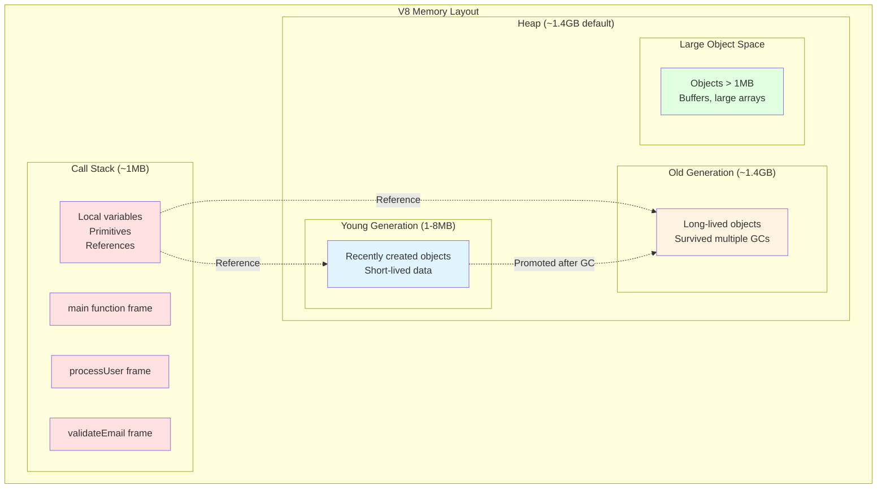
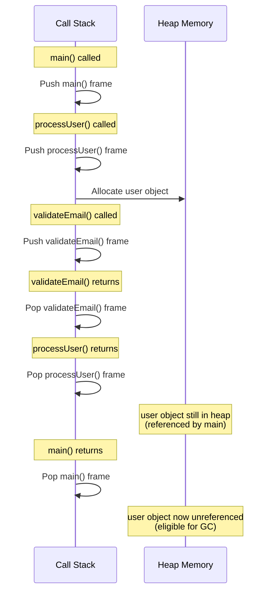
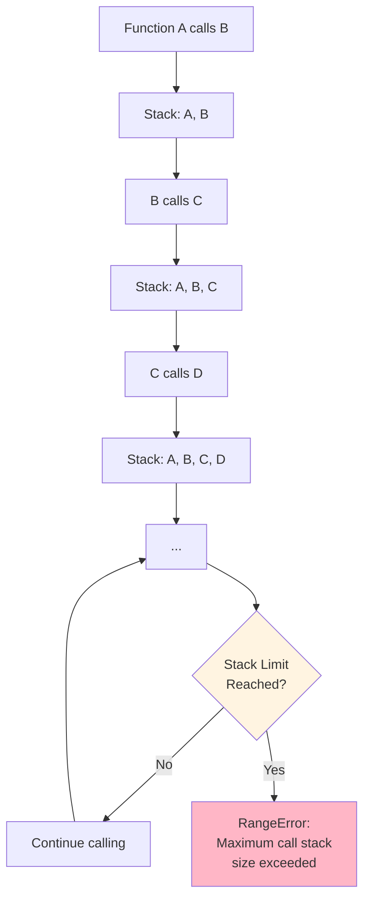
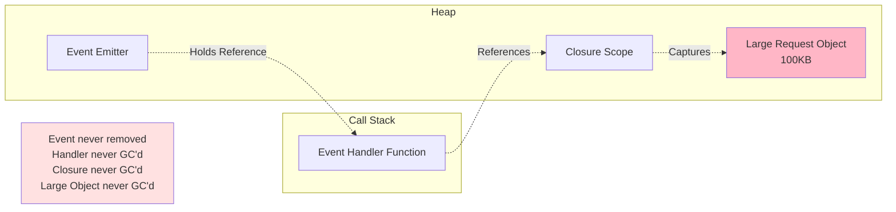

# Call Stack & Heap

## 1. Why this exists (Real-world problem first)

Your Node.js API crashes every few hours with "Maximum call stack size exceeded." No memory leaks detected. Heap usage is normal. The crash happens during JSON parsing of deeply nested user-generated data. You didn't know there was a limit to how deep function calls could go.

In another service, memory usage grows from 200MB to 1.5GB over 6 hours, then crashes with "JavaScript heap out of memory." You're not storing data in global variables. The leak is subtle: closures in event listeners retaining references to large objects.

**Real production failures from stack/heap misunderstanding:**

1. **The Recursive Disaster**: A file tree walker uses recursion to traverse directories. Works fine in development (shallow trees). In production, a user uploads a 50-level deep folder structure. Stack overflow. Server crashes.

2. **The Closure Memory Leak**: A WebSocket server attaches event listeners with closures that capture the entire request object. With 10,000 concurrent connections, each retaining a 100KB request object, that's 1GB of heap consumed by "invisible" references.

3. **The JSON Bomb**: An API accepts user JSON. A malicious user sends 10,000 levels of nested objects. JSON.parse() uses recursion. Stack overflows. Service crashes. No rate limiting caught it because payload size was small (just deeply nested).

**What breaks without this knowledge:**
- You can't debug "Maximum call stack size exceeded" errors
- You can't identify memory leaks caused by retained references
- You don't understand V8 heap limits or how to configure them
- You can't optimize memory usage in high-throughput services

## 2. Mental model (build imagination)

Think of the Call Stack and Heap as **two different storage areas in a warehouse**.

### The Warehouse Analogy

**Call Stack = The Loading Dock (LIFO - Last In, First Out)**
- A narrow vertical space where workers stack boxes
- Only the top box can be accessed
- Very fast: just grab the top box
- Limited height: if you stack too high, the tower collapses
- Temporary storage: boxes are removed as soon as work is done

**What goes on the stack:**
- Function call frames (who called who)
- Local variables (primitives: numbers, booleans)
- References (pointers to objects in the heap)
- Return addresses (where to go after function completes)

**Heap = The Main Warehouse (Random Access)**
- Huge storage area with labeled shelves
- Can access any shelf at any time
- Slower: need to find the right shelf
- Much larger capacity
- Long-term storage: items stay until garbage collector removes them

**What goes in the heap:**
- Objects (`{}`, `[]`)
- Functions (yes, functions are objects)
- Closures (functions + their captured scope)
- Strings (in V8, strings are heap-allocated)
- Buffers and ArrayBuffers

**The Flow:**
1. Function is called → New box added to stack
2. Function creates object → Object stored in heap, reference stored in stack
3. Function returns → Box removed from stack
4. Object no longer referenced → Garbage collector eventually removes from heap

**Why this matters:**
- Stack overflow = too many nested function calls
- Heap exhaustion = too many objects or memory leaks
- Understanding where data lives explains performance and limits

## 3. How Node.js implements this internally

V8 (JavaScript engine) manages both stack and heap. These are separate memory regions with different characteristics.

### Call Stack Implementation

**Structure:**
```
┌─────────────────────┐  ← Stack Pointer (SP)
│ Current Function    │
│ - Local vars        │
│ - Return address    │
├─────────────────────┤
│ Caller Function     │
│ - Local vars        │
│ - Return address    │
├─────────────────────┤
│ ...                 │
├─────────────────────┤
│ main()              │
└─────────────────────┘  ← Stack Base
```

**Characteristics:**
- **Size**: ~1MB on 64-bit systems (OS-dependent)
- **Growth**: Grows downward in memory
- **Overflow**: When SP exceeds limit → RangeError: Maximum call stack size exceeded
- **Speed**: Extremely fast (just increment/decrement pointer)

**What's stored per function call:**
```javascript
function foo(a, b) {
  const sum = a + b;
  return sum;
}

// Stack frame for foo():
// - Parameter 'a'
// - Parameter 'b'
// - Local variable 'sum'
// - Return address (where to jump after foo() completes)
```

### Heap Implementation

**Structure:**
```
┌──────────────────────────────────────┐
│         New Space (Young Generation) │
│  ┌────────────┬────────────┐         │
│  │ From-Space │  To-Space  │         │
│  │  ~1-8 MB   │   ~1-8 MB  │         │
│  └────────────┴────────────┘         │
├──────────────────────────────────────┤
│         Old Space (Old Generation)   │
│              ~1.4 GB default         │
│  (Configurable with --max-old-space-size)
├──────────────────────────────────────┤
│         Large Object Space           │
│  (Objects > 1MB stored here)         │
├──────────────────────────────────────┤
│         Code Space                   │
│  (JIT-compiled code)                 │
└──────────────────────────────────────┘
```

**Characteristics:**
- **Size**: Default ~1.4GB on 64-bit (configurable)
- **Growth**: Grows as needed until limit
- **Overflow**: When limit exceeded → FATAL ERROR: CALL_AND_RETRY_LAST Allocation failed - JavaScript heap out of memory
- **Speed**: Slower than stack (requires allocation/deallocation)

### Stack vs Heap: The Key Differences

| Aspect | Stack | Heap |
|--------|-------|------|
| **Size** | ~1MB | ~1.4GB (default) |
| **Speed** | Very fast | Slower |
| **Allocation** | Automatic | Manual (via `new`, `{}`, etc.) |
| **Deallocation** | Automatic (function return) | Garbage collection |
| **Access Pattern** | LIFO | Random |
| **Stores** | Primitives, references | Objects, arrays, functions |
| **Overflow Error** | RangeError | FATAL ERROR |

### Common Misunderstandings

**Mistake 1**: "Objects are passed by value"
- **Reality**: Objects are passed by reference (reference is on stack, object is in heap)
- **Impact**: Modifying object in function affects original

**Mistake 2**: "Stack overflow means out of memory"
- **Reality**: Stack overflow is about call depth, not total memory
- **Impact**: Confusion when debugging recursion issues

**Mistake 3**: "Garbage collection frees all memory"
- **Reality**: GC only frees unreferenced objects
- **Impact**: Memory leaks from retained references

**Mistake 4**: "Primitives are always on the stack"
- **Reality**: Primitives in objects are on the heap
- **Impact**: Misunderstanding memory layout

## 4. Multiple diagrams (MANDATORY)

### Diagram 1: Stack vs Heap Memory Layout



### Diagram 2: Function Call Stack Growth



### Diagram 3: Stack Overflow Scenario



### Diagram 4: Memory Leak via Closures



## 5. Where this is used in real projects

### Recursive Algorithms with Depth Limits

**Scenario**: File system tree walker

**Decision**: Limit recursion depth to prevent stack overflow

```javascript
// BAD: Unbounded recursion
function walkDir(dir) {
  const files = fs.readdirSync(dir);
  files.forEach(file => {
    const fullPath = path.join(dir, file);
    if (fs.statSync(fullPath).isDirectory()) {
      walkDir(fullPath); // No depth limit!
    } else {
      processFile(fullPath);
    }
  });
}

// GOOD: Depth-limited recursion
function walkDir(dir, maxDepth = 50, currentDepth = 0) {
  if (currentDepth >= maxDepth) {
    throw new Error(`Max depth ${maxDepth} exceeded`);
  }
  
  const files = fs.readdirSync(dir);
  files.forEach(file => {
    const fullPath = path.join(dir, file);
    if (fs.statSync(fullPath).isDirectory()) {
      walkDir(fullPath, maxDepth, currentDepth + 1);
    } else {
      processFile(fullPath);
    }
  });
}
```

### Iterative Alternative to Recursion

**Scenario**: Processing nested data structures

**Decision**: Use iteration with explicit stack to avoid call stack limits

```javascript
// Recursive (stack overflow risk)
function sumNestedArray(arr) {
  let sum = 0;
  for (const item of arr) {
    if (Array.isArray(item)) {
      sum += sumNestedArray(item); // Recursive call
    } else {
      sum += item;
    }
  }
  return sum;
}

// Iterative (no stack overflow)
function sumNestedArray(arr) {
  let sum = 0;
  const stack = [arr];
  
  while (stack.length > 0) {
    const current = stack.pop();
    
    for (const item of current) {
      if (Array.isArray(item)) {
        stack.push(item); // Use heap-allocated stack
      } else {
        sum += item;
      }
    }
  }
  
  return sum;
}
```

### Memory-Efficient Event Listeners

**Scenario**: WebSocket server with thousands of connections

**Decision**: Avoid closures that capture large objects

```javascript
// BAD: Closure captures entire request object
app.ws('/chat', (ws, req) => {
  // req is ~100KB with headers, body, etc.
  
  ws.on('message', (msg) => {
    // This closure captures 'req'
    console.log(`User ${req.user.id} sent: ${msg}`);
    // req stays in memory as long as ws is connected
  });
});

// GOOD: Extract only what's needed
app.ws('/chat', (ws, req) => {
  const userId = req.user.id; // Primitive, small
  
  ws.on('message', (msg) => {
    // Closure only captures userId, not entire req
    console.log(`User ${userId} sent: ${msg}`);
    // req can be GC'd after this function returns
  });
});
```

### Heap Size Configuration for Large Datasets

**Scenario**: Batch processing service loading large datasets

**Decision**: Increase heap size for specific workloads

```bash
# Default: ~1.4GB heap
node server.js

# Increase to 4GB for data processing
node --max-old-space-size=4096 batch-processor.js

# Increase to 8GB for very large datasets
node --max-old-space-size=8192 data-import.js
```

**When to use**:
- Batch processing large files
- In-memory data aggregation
- Caching large datasets
- NOT for fixing memory leaks (fix the leak instead)

### Streaming to Avoid Heap Pressure

**Scenario**: Processing large files

**Decision**: Use streams instead of loading entire file into heap

```javascript
// BAD: Loads entire file into heap
async function processLargeFile(filePath) {
  const data = await fs.promises.readFile(filePath); // Entire file in heap!
  const lines = data.toString().split('\n');
  
  for (const line of lines) {
    await processLine(line);
  }
}

// GOOD: Streams data, constant heap usage
async function processLargeFile(filePath) {
  const stream = fs.createReadStream(filePath);
  const rl = readline.createInterface({ input: stream });
  
  for await (const line of rl) {
    await processLine(line);
  }
  // Heap usage stays constant regardless of file size
}
```

## 6. Where this should NOT be used

### Deep Recursion for Large Inputs

**Misuse**: Using recursion for unbounded data

```javascript
// WRONG: Will stack overflow on large arrays
function flatten(arr) {
  return arr.reduce((acc, item) => {
    return Array.isArray(item) 
      ? acc.concat(flatten(item)) // Recursive
      : acc.concat(item);
  }, []);
}

flatten(deeplyNestedArray); // Stack overflow if too deep
```

**Why it's wrong**: Call stack has fixed size (~1MB). Deep nesting exceeds limit.

**Right approach**: Use iteration or increase stack size (not recommended):
```javascript
// Iterative solution
function flatten(arr) {
  const result = [];
  const stack = [arr];
  
  while (stack.length) {
    const current = stack.pop();
    for (const item of current) {
      if (Array.isArray(item)) {
        stack.push(item);
      } else {
        result.push(item);
      }
    }
  }
  
  return result;
}
```

### Storing Large Data in Global Variables

**Misuse**: Using globals as a cache without limits

```javascript
// WRONG: Unbounded heap growth
const cache = {};

app.get('/user/:id', async (req, res) => {
  if (!cache[req.params.id]) {
    cache[req.params.id] = await db.users.findById(req.params.id);
  }
  res.json(cache[req.params.id]);
});

// After 100,000 users cached: heap exhaustion
```

**Why it's wrong**: Heap has limits. Unbounded cache will eventually crash.

**Right approach**: Use LRU cache with size limit:
```javascript
const LRU = require('lru-cache');
const cache = new LRU({ max: 1000 }); // Limit to 1000 entries

app.get('/user/:id', async (req, res) => {
  let user = cache.get(req.params.id);
  if (!user) {
    user = await db.users.findById(req.params.id);
    cache.set(req.params.id, user);
  }
  res.json(user);
});
```

### Relying on Default Heap Size for Large Workloads

**Misuse**: Processing large datasets without heap configuration

```javascript
// WRONG: Will crash with default heap size
async function aggregateAllUsers() {
  const users = await db.users.find({}); // 10 million users
  const aggregated = users.map(complexTransform); // Heap exhaustion
  return aggregated;
}
```

**Why it's wrong**: Default heap (~1.4GB) can't hold 10 million objects.

**Right approach**: Stream or batch process:
```javascript
async function aggregateAllUsers() {
  const results = [];
  const batchSize = 1000;
  let offset = 0;
  
  while (true) {
    const batch = await db.users.find({})
      .skip(offset)
      .limit(batchSize);
    
    if (batch.length === 0) break;
    
    results.push(...batch.map(complexTransform));
    offset += batchSize;
    
    // Allow GC to clean up previous batches
    await new Promise(resolve => setImmediate(resolve));
  }
  
  return results;
}
```

## 7. Failure modes & edge cases

### Failure Mode 1: Stack Overflow from Deep Recursion

**Scenario**: JSON parsing deeply nested user input

```javascript
app.post('/api/data', (req, res) => {
  try {
    const data = JSON.parse(req.body); // Uses recursion internally
    res.json({ success: true });
  } catch (err) {
    res.status(400).json({ error: err.message });
  }
});

// Malicious input:
// {"a":{"a":{"a":{"a":...}}}} (10,000 levels deep)
// Result: RangeError: Maximum call stack size exceeded
```

**Detection**:
```javascript
function parseWithDepthLimit(jsonString, maxDepth = 100) {
  let depth = 0;
  
  const parsed = JSON.parse(jsonString, (key, value) => {
    if (typeof value === 'object' && value !== null) {
      depth++;
      if (depth > maxDepth) {
        throw new Error(`Max depth ${maxDepth} exceeded`);
      }
    }
    return value;
  });
  
  return parsed;
}
```

### Failure Mode 2: Heap Exhaustion from Memory Leak

**Scenario**: Event listeners not removed

```javascript
class DataProcessor extends EventEmitter {
  constructor() {
    super();
    this.data = new Array(1000000).fill(0); // 8MB array
  }
}

const processors = [];

setInterval(() => {
  const processor = new DataProcessor();
  
  processor.on('data', (chunk) => {
    console.log('Processing:', chunk);
  });
  
  processors.push(processor);
  // Listener never removed!
  // processor.data never GC'd!
}, 1000);

// After 200 iterations: ~1.6GB heap usage
// Crash: JavaScript heap out of memory
```

**Detection**:
```javascript
// Monitor heap usage
setInterval(() => {
  const usage = process.memoryUsage();
  const heapUsedMB = usage.heapUsed / 1024 / 1024;
  const heapTotalMB = usage.heapTotal / 1024 / 1024;
  
  console.log(`Heap: ${heapUsedMB.toFixed(2)}MB / ${heapTotalMB.toFixed(2)}MB`);
  
  if (heapUsedMB / heapTotalMB > 0.9) {
    console.error('WARNING: Heap usage > 90%');
  }
}, 10000);
```

### Failure Mode 3: Stack Overflow from Mutual Recursion

**Scenario**: Two functions calling each other

```javascript
function isEven(n) {
  if (n === 0) return true;
  return isOdd(n - 1);
}

function isOdd(n) {
  if (n === 0) return false;
  return isEven(n - 1);
}

isEven(100000); // Stack overflow!
```

**Why**: Each call adds a frame. 100,000 calls exceed stack limit.

**Solution**: Use modulo or iteration:
```javascript
function isEven(n) {
  return n % 2 === 0;
}
```

### Edge Case: Closure Capturing Large Scope

**Scenario**: Timer callback capturing large object

```javascript
function processRequest(req, res) {
  const largeData = generateLargeDataset(); // 100MB
  
  setTimeout(() => {
    res.send('Done');
    // Closure captures entire scope, including largeData
    // largeData stays in heap for 5 seconds
  }, 5000);
  
  // If 100 requests/second, that's 10,000 requests in 5 seconds
  // 10,000 × 100MB = 1TB of heap needed!
}
```

**Solution**: Limit closure scope:
```javascript
function processRequest(req, res) {
  const largeData = generateLargeDataset();
  
  // Process immediately
  const result = processData(largeData);
  // largeData can be GC'd now
  
  setTimeout(() => {
    res.send(result); // Only captures small result
  }, 5000);
}
```

### Edge Case: Array Holes and Memory

**Scenario**: Sparse arrays consuming heap

```javascript
// Creates array with 1 million slots, but only 2 elements
const sparse = [];
sparse[0] = 'first';
sparse[1000000] = 'last';

console.log(sparse.length); // 1000000
// V8 optimizes this, but still uses more memory than needed
```

**Better approach**: Use Map for sparse data:
```javascript
const map = new Map();
map.set(0, 'first');
map.set(1000000, 'last');
// Only stores 2 entries, not 1 million
```

## 8. Trade-offs & alternatives

### Recursion vs Iteration

**Recursion**:
- **Gain**: Elegant, readable code for tree/graph traversal
- **Sacrifice**: Stack overflow risk, slower (function call overhead)
- **When to use**: Shallow recursion (<1000 levels), tree algorithms

**Iteration**:
- **Gain**: No stack overflow, faster, constant stack usage
- **Sacrifice**: More verbose, harder to read for some algorithms
- **When to use**: Deep or unbounded data structures

### Heap Size Configuration

**Increase Heap Size**:
- **Gain**: Can handle larger datasets in memory
- **Sacrifice**: More RAM usage, longer GC pauses, slower startup
- **When to use**: Batch processing, data aggregation, known large datasets

**Default Heap Size**:
- **Gain**: Faster GC, lower memory footprint
- **Sacrifice**: Can't handle very large datasets
- **When to use**: Standard web servers, microservices

### Streaming vs Loading into Memory

**Streaming**:
- **Gain**: Constant memory usage, can handle unlimited data size
- **Sacrifice**: More complex code, can't random access
- **When to use**: Large files, real-time data, unknown data size

**Loading into Memory**:
- **Gain**: Simple code, random access, faster processing
- **Sacrifice**: Heap pressure, size limits
- **When to use**: Small datasets, need random access

## 9. Interview-level articulation

### How to Explain Stack vs Heap

**Opening statement** (30 seconds):
"The call stack and heap are two separate memory regions in V8. The stack stores function call frames and local primitives—it's fast but limited to about 1MB. The heap stores objects and has a default limit of around 1.4GB. The key difference is lifetime: stack memory is automatically freed when functions return, while heap memory requires garbage collection. Stack overflow happens from too many nested function calls, while heap exhaustion happens from too many objects or memory leaks."

### Typical Follow-up Questions

**Q: "What causes a stack overflow?"**

**A**: "Stack overflow occurs when the call stack exceeds its size limit, typically around 1MB. This happens with deep recursion—each function call adds a frame to the stack. For example, a recursive function processing a 10,000-level deep data structure would exceed the limit. The solution is either to limit recursion depth or convert to an iterative approach using a heap-allocated stack."

**Q: "How do you debug a memory leak in Node.js?"**

**A**: "I'd start by monitoring heap usage over time with `process.memoryUsage()`. If heap usage grows linearly, it's likely a leak. I'd take heap snapshots using Chrome DevTools or `--inspect` flag, comparing snapshots over time to see which objects are accumulating. Common causes are event listeners not being removed, closures capturing large objects, or global caches without size limits. Tools like `clinic.js` or `heapdump` can help identify the source."

**Q: "Why can't you store unlimited data in memory?"**

**A**: "V8 has a default heap limit of about 1.4GB on 64-bit systems. This is a design choice balancing memory usage and garbage collection performance. Larger heaps mean longer GC pauses. You can increase it with `--max-old-space-size`, but that's treating symptoms. The right approach is streaming data, using external storage like Redis, or batch processing to keep memory usage bounded."

**Q: "What's the difference between a memory leak and high memory usage?"**

**A**: "High memory usage is expected when you're legitimately storing data—like caching 10,000 user records. A memory leak is when memory grows unexpectedly because objects that should be garbage collected are still referenced. The key indicator is whether memory is eventually freed. If heap usage grows indefinitely over time, it's a leak. If it grows then stabilizes or decreases, it's just high usage."

## 10. Key takeaways (engineer mindset)

### What to Remember

1. **Stack is small (~1MB)**, heap is large (~1.4GB default)
2. **Stack overflow = too many function calls**, heap exhaustion = too many objects
3. **Stack is automatic**, heap requires GC
4. **Primitives on stack**, objects on heap (with references on stack)
5. **Closures capture scope**, keeping objects in heap

### What Decisions This Enables

**Correctness decisions**:
- Limit recursion depth for user-controlled data
- Remove event listeners to prevent leaks
- Extract minimal data in closures

**Performance decisions**:
- Use iteration for deep data structures
- Stream large files instead of loading into heap
- Configure heap size for specific workloads

**Debugging decisions**:
- Stack overflow → check recursion depth
- Heap exhaustion → check for leaks or increase heap
- Monitor heap usage trends in production

### How It Connects to Other Node.js Concepts

**Memory Management & GC** (Topic 8):
- Heap structure determines GC strategy
- Understanding heap explains GC pauses

**Streams** (Topic 7):
- Streams avoid heap pressure
- Constant memory usage regardless of data size

**Worker Threads** (Topic 14):
- Each worker has separate stack and heap
- Sharing data requires serialization

**Event Loop** (Topic 2):
- Callbacks on stack execute synchronously
- Objects in heap persist across loop iterations

### The Golden Rule

**Keep the stack shallow and the heap clean**. Avoid deep recursion. Remove references when done. Monitor memory usage. When in doubt, stream it.
