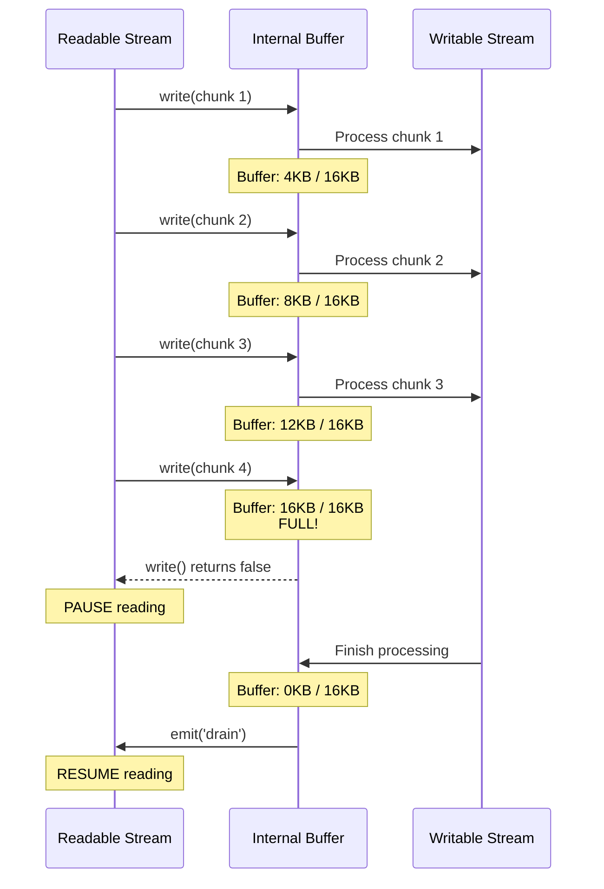
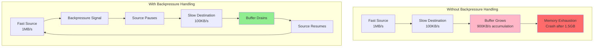
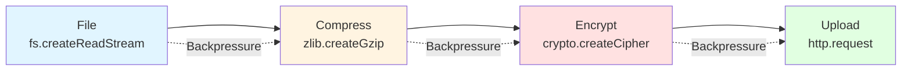

# Backpressure & Stream Internals

## 1. Why this exists (Real-world problem first)

Your file upload service crashes with "JavaScript heap out of memory" when users upload large files. You're using streams, so memory should be constant. The problem? You're not handling backpressure. The readable stream (file upload) is faster than the writable stream (disk write). Data accumulates in memory until the heap explodes.

**Real production failures from backpressure ignorance:**

1. **The Upload Crash**: A video platform accepts 4GB video uploads. Without backpressure handling, the entire file buffers in memory. Server crashes. User loses upload progress.

2. **The Log Flood**: A logging service writes to disk. Under high load, logs arrive faster than disk can write. Memory grows from 200MB to 1.5GB. OOM kill.

3. **The Proxy Disaster**: An API proxy streams responses from slow upstream to fast clients. No backpressure handling. Proxy buffers entire 500MB response in memory. Multiple concurrent requests = crash.

**What breaks without this knowledge:**
- Memory leaks in streaming applications
- Crashes under load
- Can't build reliable data pipelines
- Don't understand stream performance

## 2. Mental model (build imagination)

Think of streams as a **Water Pipe System** with flow control.

### The Pipe Analogy

**Without Backpressure (Broken System)**:
- Fast faucet (source) → Small pipe → Slow drain (destination)
- Water flows faster than drain can handle
- Pipe expands (memory buffer grows)
- Eventually pipe bursts (OOM crash)

**With Backpressure (Proper System)**:
- Fast faucet → Pressure sensor → Slow drain
- When pipe fills up, sensor signals faucet to slow down
- Faucet pauses until drain catches up
- Pipe never overflows (constant memory)

**The Flow:**
1. Readable stream (faucet) produces data
2. Writable stream (drain) consumes data
3. If drain is slow, internal buffer fills
4. Buffer full → `write()` returns `false` (backpressure signal)
5. Readable stream pauses
6. When buffer drains, writable emits `'drain'` event
7. Readable stream resumes

**Why this matters:**
- Prevents memory exhaustion
- Enables processing unlimited data with constant memory
- Critical for production streaming applications

## 3. How Node.js implements this internally

Streams have internal buffers. When buffers fill, backpressure signals the source to slow down.

### Stream Types

**Readable Stream**: Produces data
- Examples: `fs.createReadStream()`, `http.IncomingMessage`
- Has internal buffer (default 16KB)
- Emits `'data'` events

**Writable Stream**: Consumes data
- Examples: `fs.createWriteStream()`, `http.ServerResponse`
- Has internal buffer (default 16KB)
- `write()` method returns boolean

**Duplex Stream**: Both readable and writable
- Examples: `net.Socket`, `crypto.Cipher`

**Transform Stream**: Modifies data in transit
- Examples: `zlib.createGzip()`, custom transforms

### Backpressure Mechanism

```javascript
const readable = fs.createReadStream('large-file.txt');
const writable = fs.createWriteStream('output.txt');

readable.on('data', (chunk) => {
  const canContinue = writable.write(chunk);
  
  if (!canContinue) {
    // Backpressure! Buffer is full
    readable.pause(); // Stop reading
  }
});

writable.on('drain', () => {
  // Buffer drained, safe to continue
  readable.resume(); // Resume reading
});
```

**Internal Buffer Management:**
```
Writable Stream Internal Buffer:
┌─────────────────────────────┐
│ Chunk 1 │ Chunk 2 │ Chunk 3 │  ← Buffer filling
└─────────────────────────────┘
         ↓ write() returns false when buffer > highWaterMark
         ↓ Emit 'drain' when buffer empties
```

### The `pipe()` Method (Handles Backpressure Automatically)

```javascript
// Manual backpressure (error-prone)
readable.on('data', chunk => {
  if (!writable.write(chunk)) {
    readable.pause();
  }
});
writable.on('drain', () => readable.resume());

// pipe() handles this automatically
readable.pipe(writable); // Backpressure handled!
```

### Common Misunderstandings

**Mistake 1**: "Streams automatically handle memory"
- **Reality**: Only if you handle backpressure correctly
- **Impact**: Memory leaks, crashes

**Mistake 2**: "`pipe()` is just syntax sugar"
- **Reality**: `pipe()` implements critical backpressure logic
- **Impact**: Manual streaming often has bugs

**Mistake 3**: "Buffers are unlimited"
- **Reality**: Buffers have `highWaterMark` limit (default 16KB)
- **Impact**: Misunderstanding buffer behavior

## 4. Multiple diagrams (MANDATORY)

### Diagram 1: Backpressure Flow



### Diagram 2: With vs Without Backpressure



### Diagram 3: Stream Pipeline



## 5. Where this is used in real projects

### File Upload Service

**Scenario**: Handling large file uploads

```javascript
const express = require('express');
const fs = require('fs');

app.post('/upload', (req, res) => {
  const writeStream = fs.createWriteStream('./uploads/file.dat');
  
  // pipe() handles backpressure automatically
  req.pipe(writeStream);
  
  writeStream.on('finish', () => {
    res.send('Upload complete');
  });
  
  writeStream.on('error', (err) => {
    res.status(500).send('Upload failed');
  });
});

// Memory usage stays constant regardless of file size
```

### Log Aggregation

**Scenario**: Streaming logs to file

```javascript
const fs = require('fs');
const { pipeline } = require('stream');

const logStream = fs.createWriteStream('./app.log', { flags: 'a' });

app.use((req, res, next) => {
  const logEntry = `${new Date().toISOString()} ${req.method} ${req.url}\n`;
  
  // Handle backpressure
  if (!logStream.write(logEntry)) {
    logStream.once('drain', next);
  } else {
    next();
  }
});
```

### Data Transformation Pipeline

**Scenario**: ETL pipeline processing large datasets

```javascript
const { pipeline } = require('stream');
const fs = require('fs');
const zlib = require('zlib');
const { Transform } = require('stream');

const transformData = new Transform({
  transform(chunk, encoding, callback) {
    // Process data
    const processed = processChunk(chunk);
    callback(null, processed);
  }
});

// pipeline() handles backpressure across entire chain
pipeline(
  fs.createReadStream('input.csv'),
  transformData,
  zlib.createGzip(),
  fs.createWriteStream('output.csv.gz'),
  (err) => {
    if (err) console.error('Pipeline failed:', err);
    else console.log('Pipeline succeeded');
  }
);
```

## 6. Where this should NOT be used

### Buffering Entire Stream

**Misuse**: Collecting all data before processing

```javascript
// WRONG: Defeats purpose of streaming
const chunks = [];
readable.on('data', chunk => {
  chunks.push(chunk); // Buffers everything in memory!
});
readable.on('end', () => {
  const allData = Buffer.concat(chunks);
  process(allData);
});
```

**Right approach**: Process chunks as they arrive:
```javascript
readable.on('data', chunk => {
  processChunk(chunk); // Process immediately
});
```

### Ignoring Backpressure

**Misuse**: Not checking `write()` return value

```javascript
// WRONG: Ignores backpressure
readable.on('data', chunk => {
  writable.write(chunk); // Ignoring return value!
});
```

**Right approach**: Use `pipe()` or handle backpressure:
```javascript
readable.pipe(writable); // Automatic backpressure
```

## 7. Failure modes & edge cases

### Failure Mode 1: Memory Leak from Ignored Backpressure

**Scenario**: Proxy server not handling backpressure

```javascript
app.get('/proxy', (req, res) => {
  http.get('http://slow-api.com/large-data', (upstream) => {
    upstream.on('data', chunk => {
      res.write(chunk); // If client is slow, this buffers!
    });
  });
});

// Slow client + fast upstream = memory leak
```

**Solution**: Use `pipe()`:
```javascript
app.get('/proxy', (req, res) => {
  http.get('http://slow-api.com/large-data', (upstream) => {
    upstream.pipe(res); // Backpressure handled
  });
});
```

### Failure Mode 2: Pipeline Error Handling

**Scenario**: Stream error crashes process

```javascript
// WRONG: Unhandled error
readable.pipe(transform).pipe(writable);
// If any stream errors, process might crash
```

**Solution**: Use `pipeline()` with error handling:
```javascript
pipeline(
  readable,
  transform,
  writable,
  (err) => {
    if (err) {
      console.error('Pipeline error:', err);
      // Cleanup
    }
  }
);
```

## 8. Trade-offs & alternatives

### Using `pipe()`

**Gain**: Automatic backpressure, simpler code
**Sacrifice**: Less control over flow
**When to use**: Most streaming scenarios

### Manual Backpressure

**Gain**: Fine-grained control
**Sacrifice**: Error-prone, complex
**When to use**: Custom streaming logic

### `pipeline()`

**Gain**: Automatic backpressure + error handling
**Sacrifice**: Slightly more verbose
**When to use**: Production pipelines

## 9. Interview-level articulation

**Q: "What is backpressure in Node.js streams?"**

**A**: "Backpressure is the mechanism that prevents fast data sources from overwhelming slow destinations. When a writable stream's internal buffer fills up, `write()` returns `false`, signaling the readable stream to pause. When the buffer drains, the writable emits a `'drain'` event, and the readable can resume. This keeps memory usage constant regardless of data size."

## 10. Key takeaways (engineer mindset)

1. **Always use `pipe()` or `pipeline()`** for automatic backpressure
2. **Never buffer entire streams** in memory
3. **Handle errors** in stream pipelines
4. **Understand `highWaterMark`** controls buffer size
5. **Streams enable constant memory** for unlimited data

### The Golden Rule

**Use `pipe()` or `pipeline()` unless you have a specific reason not to**. They handle backpressure correctly, which manual streaming often doesn't.
