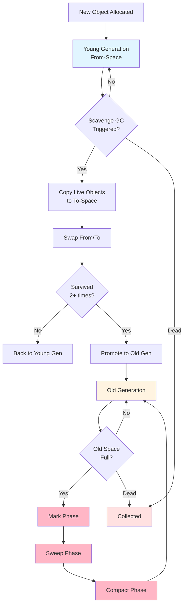
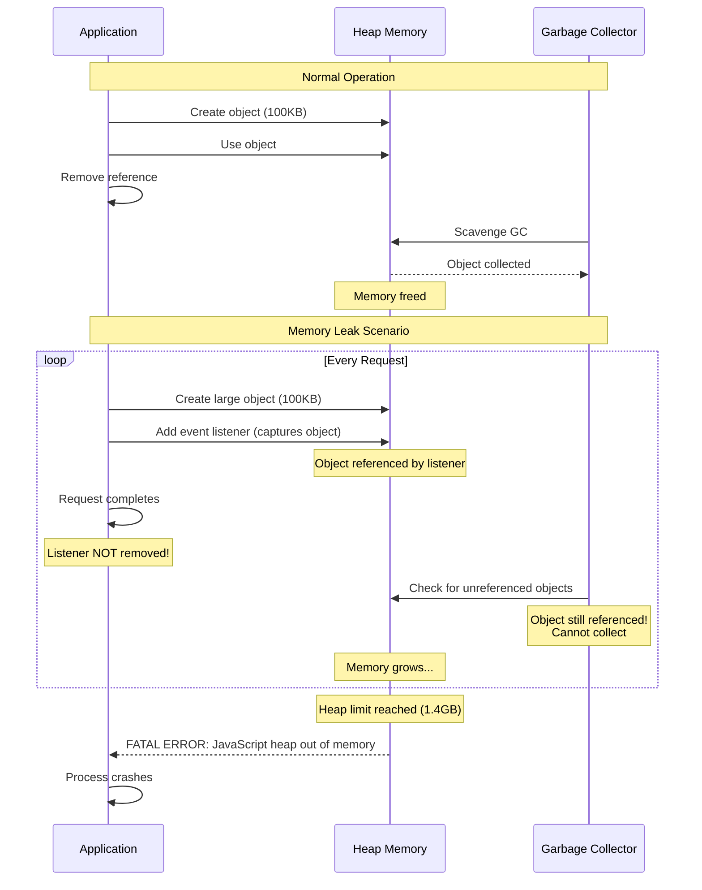
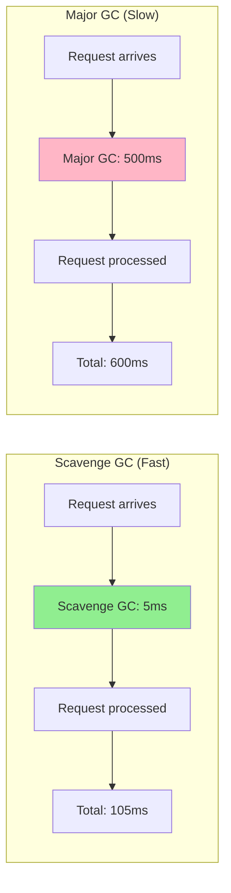

# Memory Management & Garbage Collection

## 1. Why this exists (Real-world problem first)

Your Node.js service runs fine for 6 hours, then crashes with "JavaScript heap out of memory." Memory usage grows linearly from 200MB to 1.5GB. You're not storing data in globals. The leak is subtle: event listeners with closures capturing large objects, never removed.

**Real production failures from memory ignorance:**

1. **The Event Listener Leak**: A WebSocket server handles 10,000 concurrent connections. Each connection's event handler captures the entire 100KB request object in its closure. Connections close but listeners remain. After 24 hours: 10,000 × 100KB = 1GB of "invisible" memory. Server crashes. Users disconnected.

2. **The GC Pause Disaster**: An e-commerce checkout experiences 500ms latency spikes every 30 seconds during Black Friday. Culprit: Major GC pauses triggered by high allocation rate. Customers abandon carts. $200K in lost sales.

3. **The Heap Limit Crash**: A data processing service crashes processing 5 million records. Default 1.4GB heap limit exceeded. Team increases heap to 4GB. Service crashes again at 4GB. The problem wasn't heap size—it was a memory leak in CSV parsing.

4. **The Closure Trap**: An image processing API stores processed images in a closure for "caching." Each image is 2MB. After processing 1000 images, heap is at 2GB. GC can't collect because closures still reference images. OOM crash.

**What breaks without this knowledge:**
- You can't debug memory leaks
- You don't understand GC pauses and latency spikes
- You can't configure heap limits appropriately
- You fail to optimize memory usage
- You can't prevent OOM crashes

## 2. Mental model (build imagination)

Think of memory as a **Library with Automatic Cleanup**.

### The Library Analogy

**The Library Structure:**
- **Shelves (Heap)**: Store books (objects)
- **Checkout Desk (Stack)**: Track who's using which books (references)
- **Librarian (GC)**: Periodically removes books nobody is using
- **Capacity**: Limited shelf space (heap limit)

**Young Generation (New Books Section)**:
- New books arrive here first
- Most are returned quickly (short-lived objects)
- Librarian checks frequently (Scavenge GC - fast, ~1-10ms)
- Books that stay checked out for a while move to Archive

**Old Generation (Archive)**:
- Books that have been checked out multiple times
- Rarely returned (long-lived objects)
- Librarian checks infrequently (Mark-Sweep - slow, ~100-1000ms)
- Takes longer to clean because there are more books

**Memory Leak (The Problem)**:
- Book still "checked out" but nobody remembers why
- Checkout card still exists (reference)
- Librarian can't remove it (still referenced)
- Shelves fill up until library is full
- Library closes (OOM crash)

**The Flow:**
1. New book arrives (object allocated) → New Books Section
2. Librarian checks (Scavenge GC runs)
3. If book is returned (no references), remove it
4. If book is still checked out, keep it
5. After 2-3 checks, move to Archive (promoted to Old Generation)
6. Archive librarian checks less frequently (Mark-Sweep GC)
7. If Archive fills up, major cleanup (Major GC - slow!)

**Why this matters:**
- Understanding generations explains GC pauses
- Knowing reference tracking prevents leaks
- Heap limit is the library capacity
- GC is automatic but not magic

## 3. How Node.js implements this internally

V8 uses **generational garbage collection** with multiple memory spaces.

### Heap Structure

```
┌──────────────────────────────────────────────────┐
│  New Space (Young Generation)                    │
│  ├─ From-Space (~1-8MB, semi-space)             │
│  └─ To-Space   (~1-8MB, semi-space)             │
│  Scavenge GC: Fast (1-10ms), Frequent           │
│  Most objects die here (90%+)                    │
├──────────────────────────────────────────────────┤
│  Old Space (Old Generation)                      │
│  ~1.4GB default (configurable via --max-old-space-size) │
│  Mark-Sweep-Compact GC: Slow (100-1000ms), Rare │
│  Long-lived objects                              │
├──────────────────────────────────────────────────┤
│  Large Object Space                              │
│  Objects > 1MB allocated here directly          │
│  Avoids copying overhead                         │
├──────────────────────────────────────────────────┤
│  Code Space                                      │
│  Compiled JavaScript code                        │
│  Rarely collected                                │
└──────────────────────────────────────────────────┘
```

### GC Algorithms in Detail

**1. Scavenge (Young Generation) - Cheney's Algorithm**:
```
Process:
1. Allocate objects in From-Space
2. When From-Space fills (~2MB):
   a. Pause JavaScript execution
   b. Copy live objects to To-Space
   c. Update references
   d. Swap From-Space and To-Space
   e. Resume JavaScript execution
3. Objects that survive 2 scavenges → promoted to Old Space

Characteristics:
- Fast: Only copies live objects (most are dead)
- Frequent: Every few MB of allocation
- Pause time: 1-10ms
- Throughput cost: ~5-10%
```

**2. Mark-Sweep-Compact (Old Generation)**:
```
Process:
1. Mark Phase:
   - Start from GC roots (stack, globals)
   - Traverse object graph
   - Mark all reachable objects
   
2. Sweep Phase:
   - Scan heap
   - Free unmarked objects
   - Add to free list
   
3. Compact Phase (optional):
   - Move objects together
   - Reduce fragmentation
   - Update references

Characteristics:
- Slow: Must scan entire Old Space
- Rare: Only when Old Space fills
- Pause time: 100-1000ms (can be incremental)
- Triggered by: Old Space pressure, explicit GC
```

**3. Incremental Marking (Optimization)**:
```
Instead of marking all at once:
- Mark in small increments (5-10ms each)
- Interleave with JavaScript execution
- Reduces pause times
- Enabled by default in V8
```

### Memory Allocation Flow

```javascript
// What happens when you create an object
const user = { name: 'Alice', age: 30 };

// Internal V8 flow:
// 1. Check if New Space has room
// 2. Allocate in From-Space
// 3. If From-Space full, trigger Scavenge GC
// 4. After GC, allocate in From-Space
// 5. If object survives 2 scavenges, promote to Old Space
```

### Common Memory Leaks

**1. Event Listeners (Most Common)**:
```javascript
// LEAK: Listener never removed
class UserConnection {
  constructor(socket) {
    this.socket = socket;
    this.largeData = new Buffer(100 * 1024); // 100KB
    
    // Closure captures 'this', including largeData
    socket.on('data', (data) => {
      this.processData(data);
    });
    
    // When socket closes, listener remains!
    // this.largeData can't be collected
  }
}

// After 10,000 connections: 1GB leaked
```

**2. Global Variables (Unbounded Growth)**:
```javascript
// LEAK: Unbounded cache
global.userCache = {};

app.get('/user/:id', async (req, res) => {
  if (!global.userCache[req.params.id]) {
    global.userCache[req.params.id] = await db.users.findById(req.params.id);
  }
  res.json(global.userCache[req.params.id]);
});

// After 100,000 unique users: heap exhaustion
```

**3. Closures (Accidental Capture)**:
```javascript
// LEAK: Timer captures large object
function processRequest(req) {
  const largeData = generateLargeDataset(); // 10MB
  
  setTimeout(() => {
    console.log('Request processed');
    // Closure keeps largeData in memory for 5 seconds
    // If 100 requests/sec, 100 * 5 * 10MB = 5GB!
  }, 5000);
}
```

**4. Detached DOM Nodes (In Electron/Puppeteer)**:
```javascript
// LEAK: Reference to removed DOM element
let detachedNodes = [];

function addElement() {
  const div = document.createElement('div');
  document.body.appendChild(div);
  
  detachedNodes.push(div); // Keep reference
  
  document.body.removeChild(div); // Remove from DOM
  // div is detached but still referenced!
}
```

### Common Misunderstandings

**Mistake 1**: "GC will clean up everything automatically"
- **Reality**: GC only collects unreferenced objects
- **Impact**: Leaks happen when references remain

**Mistake 2**: "Larger heap = better performance"
- **Reality**: Larger heap = longer GC pauses
- **Impact**: Latency spikes during Major GC

**Mistake 3**: "Memory usage should be constant"
- **Reality**: Heap grows and shrinks with GC cycles
- **Impact**: False alarm on normal sawtooth pattern

## 4. Multiple diagrams (MANDATORY)

### Diagram 1: Generational GC Flow



### Diagram 2: Memory Leak Pattern



### Diagram 3: Heap Memory Over Time

```mermaid
gantt
    title Heap Memory Usage Pattern
    dateFormat X
    axisFormat %L MB
    
    section Normal (Sawtooth)
    Allocate to 100MB :0, 100
    GC drops to 20MB :100, 120
    Allocate to 100MB :120, 220
    GC drops to 20MB :220, 240
    Allocate to 100MB :240, 340
    
    section Memory Leak
    Allocate to 200MB :400, 600
    GC drops to 150MB :600, 650
    Allocate to 300MB :650, 950
    GC drops to 250MB :950, 1000
    Allocate to 400MB :1000, 1400
    Crash :1400, 1450
```



### Diagram 4: GC Pause Impact



## 5. Where this is used in real projects

### Monitoring Heap Usage in Production

```javascript
const { performance } = require('perf_hooks');

// Detailed memory monitoring
function monitorMemory() {
  const usage = process.memoryUsage();
  
  return {
    heapUsed: `${(usage.heapUsed / 1024 / 1024).toFixed(2)} MB`,
    heapTotal: `${(usage.heapTotal / 1024 / 1024).toFixed(2)} MB`,
    external: `${(usage.external / 1024 / 1024).toFixed(2)} MB`,
    rss: `${(usage.rss / 1024 / 1024).toFixed(2)} MB`,
    arrayBuffers: `${(usage.arrayBuffers / 1024 / 1024).toFixed(2)} MB`,
    heapUsedPercent: ((usage.heapUsed / usage.heapTotal) * 100).toFixed(2) + '%'
  };
}

// Alert on high memory usage
setInterval(() => {
  const mem = monitorMemory();
  const heapPercent = parseFloat(mem.heapUsedPercent);
  
  if (heapPercent > 90) {
    console.error('CRITICAL: Heap usage at', mem.heapUsedPercent);
    // Alert ops team, consider graceful restart
  } else if (heapPercent > 75) {
    console.warn('WARNING: Heap usage at', mem.heapUsedPercent);
  }
  
  // Send to monitoring system
  metrics.gauge('heap.used', usage.heapUsed);
  metrics.gauge('heap.total', usage.heapTotal);
}, 10000);
```

### Configuring Heap Size

```bash
# Production API server (4GB available)
node --max-old-space-size=3072 server.js  # 3GB heap

# Data processing job (16GB available)
node --max-old-space-size=12288 batch-processor.js  # 12GB heap

# Microservice (512MB container)
node --max-old-space-size=384 microservice.js  # 384MB heap (leave room for OS)

# Development (default 1.4GB usually fine)
node server.js
```

### Preventing Event Listener Leaks

```javascript
class ConnectionManager {
  constructor() {
    this.connections = new Map();
  }
  
  addConnection(socket) {
    // Store handlers for cleanup
    const handlers = {
      data: this.handleData.bind(this, socket),
      error: this.handleError.bind(this, socket),
      close: () => this.removeConnection(socket.id)
    };
    
    this.connections.set(socket.id, { socket, handlers });
    
    // Add listeners
    socket.on('data', handlers.data);
    socket.on('error', handlers.error);
    socket.on('close', handlers.close);
  }
  
  removeConnection(socketId) {
    const conn = this.connections.get(socketId);
    if (!conn) return;
    
    // CRITICAL: Remove all listeners
    conn.socket.removeListener('data', conn.handlers.data);
    conn.socket.removeListener('error', conn.handlers.error);
    conn.socket.removeListener('close', conn.handlers.close);
    
    this.connections.delete(socketId);
    
    console.log(`Connection ${socketId} cleaned up`);
  }
  
  handleData(socket, data) {
    // Process data
  }
  
  handleError(socket, err) {
    console.error(`Socket ${socket.id} error:`, err);
    this.removeConnection(socket.id);
  }
}
```

### Using LRU Cache to Prevent Unbounded Growth

```javascript
const LRU = require('lru-cache');

// WRONG: Unbounded cache
const cache = {};
app.get('/user/:id', async (req, res) => {
  if (!cache[req.params.id]) {
    cache[req.params.id] = await db.users.findById(req.params.id);
  }
  res.json(cache[req.params.id]);
});

// RIGHT: LRU cache with size limit
const cache = new LRU({
  max: 10000, // Max 10,000 entries
  maxSize: 100 * 1024 * 1024, // Max 100MB
  sizeCalculation: (value) => {
    return JSON.stringify(value).length;
  },
  ttl: 1000 * 60 * 5 // 5 minute TTL
});

app.get('/user/:id', async (req, res) => {
  let user = cache.get(req.params.id);
  
  if (!user) {
    user = await db.users.findById(req.params.id);
    cache.set(req.params.id, user);
  }
  
  res.json(user);
});
```

### Detecting Memory Leaks with Heap Snapshots

```javascript
const v8 = require('v8');
const fs = require('fs');

// Take heap snapshot
function takeHeapSnapshot(filename) {
  const snapshotStream = v8.writeHeapSnapshot(filename);
  console.log(`Heap snapshot written to ${snapshotStream}`);
  return snapshotStream;
}

// Take snapshots periodically
let snapshotCount = 0;
setInterval(() => {
  const filename = `./heap-${Date.now()}-${snapshotCount++}.heapsnapshot`;
  takeHeapSnapshot(filename);
}, 60 * 60 * 1000); // Every hour

// Compare snapshots in Chrome DevTools to find leaks
```

### Optimizing for GC Performance

```javascript
// BAD: Creates many temporary objects
app.get('/transform', (req, res) => {
  const data = Array(1000000).fill(0).map((_, i) => ({
    id: i,
    value: Math.random(),
    timestamp: Date.now()
  }));
  
  res.json(data);
});
// Creates 1M objects, triggers GC, causes pause

// GOOD: Stream data, reuse objects
app.get('/transform', (req, res) => {
  res.writeHead(200, { 'Content-Type': 'application/json' });
  res.write('[');
  
  for (let i = 0; i < 1000000; i++) {
    const item = {
      id: i,
      value: Math.random(),
      timestamp: Date.now()
    };
    
    res.write(JSON.stringify(item));
    if (i < 999999) res.write(',');
    
    // Yield to event loop every 1000 items
    if (i % 1000 === 0) {
      await new Promise(resolve => setImmediate(resolve));
    }
  }
  
  res.write(']');
  res.end();
});
```

## 6. Where this should NOT be used

### Manual Memory Management

**Misuse**: Trying to force GC

```javascript
// WRONG: Manually triggering GC
if (global.gc) {
  global.gc(); // Requires --expose-gc flag
}

// After processing large dataset
processLargeData();
global.gc(); // Don't do this!
```

**Why it's wrong**: 
- V8's GC is highly optimized
- Manual triggering disrupts heuristics
- Can actually hurt performance
- GC will run when needed

**Right approach**: Let V8 manage GC, focus on preventing leaks

### Ignoring Memory Limits

**Misuse**: Setting extremely large heap

```bash
# WRONG: Excessive heap size
node --max-old-space-size=32768 server.js  # 32GB!
```

**Why it's wrong**:
- Larger heap = longer GC pauses (can be seconds!)
- Masks memory leaks
- Wastes resources
- Better to fix the leak

**Right approach**: 
```bash
# Set heap based on available memory and workload
# Rule of thumb: 75% of available memory
node --max-old-space-size=3072 server.js  # 3GB for 4GB container
```

### Using `delete` for Performance

**Misuse**: Using `delete` to free memory

```javascript
// WRONG: delete doesn't help GC
const cache = {};
cache.user123 = largeObject;

delete cache.user123; // Doesn't immediately free memory
```

**Why it's wrong**:
- `delete` just removes property
- GC runs on its own schedule
- `delete` can deoptimize objects

**Right approach**:
```javascript
// Set to null or use Map
cache.user123 = null; // Or
cache.delete('user123'); // If using Map
```

## 7. Failure modes & edge cases

### Failure Mode 1: Heap Exhaustion from Unbounded Cache

**Scenario**: User cache without size limit

```javascript
const userCache = {};

app.get('/user/:id', async (req, res) => {
  if (!userCache[req.params.id]) {
    userCache[req.params.id] = await db.users.findById(req.params.id);
  }
  res.json(userCache[req.params.id]);
});

// Timeline:
// Hour 1: 10,000 users cached, 100MB heap
// Hour 6: 50,000 users cached, 500MB heap
// Hour 24: 200,000 users cached, 2GB heap
// Hour 30: FATAL ERROR: JavaScript heap out of memory
```

**Detection**:
```javascript
// Monitor cache size
setInterval(() => {
  const cacheSize = Object.keys(userCache).length;
  const heapUsed = process.memoryUsage().heapUsed / 1024 / 1024;
  
  console.log(`Cache: ${cacheSize} entries, Heap: ${heapUsed.toFixed(2)} MB`);
  
  if (cacheSize > 100000) {
    console.error('ALERT: Cache size exceeds 100,000 entries');
  }
}, 60000);
```

**Solution**: Use LRU cache with size limit (shown in section 5)

### Failure Mode 2: GC Pauses Causing Timeouts

**Scenario**: High allocation rate triggers frequent Major GC

```javascript
app.get('/report', async (req, res) => {
  const data = await db.reports.getData();
  
  // Process 1M records, creates millions of objects
  const processed = data.map(record => ({
    ...record,
    computed: heavyComputation(record),
    formatted: formatData(record)
  }));
  
  res.json(processed);
});

// Under load:
// - Heap fills quickly
// - Major GC triggered (500ms pause)
// - All requests timeout during GC
// - Cascading failures
```

**Detection**:
```javascript
// Monitor GC pauses
const { PerformanceObserver } = require('perf_hooks');

const obs = new PerformanceObserver((list) => {
  const entries = list.getEntries();
  entries.forEach((entry) => {
    if (entry.duration > 100) {
      console.warn(`Long GC pause: ${entry.duration}ms (${entry.kind})`);
    }
  });
});

obs.observe({ entryTypes: ['gc'], buffered: true });
```

**Solution**: Stream data or process in batches
```javascript
app.get('/report', async (req, res) => {
  const stream = db.reports.getDataStream();
  
  res.writeHead(200, { 'Content-Type': 'application/json' });
  res.write('[');
  
  let first = true;
  for await (const record of stream) {
    if (!first) res.write(',');
    first = false;
    
    const processed = {
      ...record,
      computed: heavyComputation(record),
      formatted: formatData(record)
    };
    
    res.write(JSON.stringify(processed));
  }
  
  res.write(']');
  res.end();
});
```

### Failure Mode 3: Closure Leak in Timers

**Scenario**: Timers capturing large objects

```javascript
function handleRequest(req, res) {
  const requestData = {
    body: req.body, // Might be large
    headers: req.headers,
    session: req.session
  };
  
  // Process request
  processRequest(requestData);
  
  // Log after 5 seconds
  setTimeout(() => {
    console.log('Request completed');
    // Closure captures requestData for 5 seconds!
  }, 5000);
  
  res.send('OK');
}

// At 100 req/sec:
// 100 * 5 = 500 requestData objects in memory
// If each is 1MB: 500MB leaked temporarily
```

**Solution**: Don't capture large objects in closures
```javascript
function handleRequest(req, res) {
  const requestId = req.id;
  
  processRequest(req.body);
  
  setTimeout(() => {
    console.log(`Request ${requestId} completed`);
    // Only captures requestId, not entire request
  }, 5000);
  
  res.send('OK');
}
```

### Edge Case: Heap Snapshot Itself Causes OOM

**Scenario**: Taking heap snapshot when heap is near limit

```javascript
// Heap at 1.3GB / 1.4GB limit
v8.writeHeapSnapshot(); // Snapshot is ~1.3GB
// Causes OOM while writing snapshot!
```

**Solution**: Increase heap temporarily or use external tool
```bash
node --max-old-space-size=4096 --expose-gc server.js
```

## 8. Trade-offs & alternatives

### Larger Heap Size

**Gain**:
- Can handle more data
- Fewer OOM crashes
- Less frequent GC

**Sacrifice**:
- Longer GC pauses (can be seconds)
- More memory usage
- Masks memory leaks

**When to use**: Known large datasets, batch processing

### Smaller Heap Size

**Gain**:
- Faster GC pauses
- Lower memory footprint
- Forces efficient code

**Sacrifice**:
- More frequent GC
- Risk of OOM with spikes
- Less headroom

**When to use**: Memory-constrained environments, microservices

### Incremental GC (Default in V8)

**Gain**:
- Shorter pause times
- Better latency
- Smoother performance

**Sacrifice**:
- Slightly lower throughput
- More complex GC

**When to use**: Always enabled, no choice needed

### Manual GC Triggering

**Gain**:
- Control over when GC runs
- Can GC during idle time

**Sacrifice**:
- Disrupts V8 heuristics
- Usually hurts performance
- Requires --expose-gc flag

**When to use**: Rarely, only in specific batch processing scenarios

## 9. Interview-level articulation

### How to Explain V8's Garbage Collector

**Opening statement** (30 seconds):
"V8 uses generational garbage collection with two main spaces: Young Generation for new objects and Old Generation for long-lived objects. Young Generation uses fast Scavenge GC that runs frequently with 1-10ms pauses. Objects that survive multiple scavenges are promoted to Old Generation, which uses slower Mark-Sweep-Compact GC with 100-1000ms pauses. This is efficient because most objects are short-lived—they die in Young Generation before ever reaching Old Generation."

### Typical Follow-up Questions

**Q: "How do you debug a memory leak in Node.js?"**

**A**: "I start by monitoring heap usage over time with `process.memoryUsage()`. If heap grows linearly without dropping after GC, it's likely a leak. I take heap snapshots using `v8.writeHeapSnapshot()` at different times and compare them in Chrome DevTools. I look for objects that are accumulating—usually event listeners, closures, or unbounded caches. Common causes are event listeners not removed, closures capturing large objects, or caches without size limits. I also check for detached DOM nodes in Electron apps."

**Q: "What's the difference between heap and RSS?"**

**A**: "Heap is the V8 JavaScript heap where objects are allocated. RSS (Resident Set Size) is the total memory used by the Node.js process, including heap, stack, code, and native memory. RSS is always larger than heap. For example, if heap is 500MB, RSS might be 700MB. The difference includes V8 internals, native modules, buffers, and OS overhead. When debugging memory issues, I monitor both—heap for JavaScript leaks, RSS for native memory leaks."

**Q: "When would you increase the heap size?"**

**A**: "I'd increase heap size when I have a known large dataset that legitimately needs more memory—like batch processing 10 million records. I'd set it to about 75% of available memory to leave room for OS and other processes. But I'd never increase heap size to 'fix' a memory leak—that just delays the crash. I'd first profile to confirm it's not a leak. If heap usage is stable but near the limit, then increasing is appropriate. For example, `--max-old-space-size=3072` for a 4GB container."

**Q: "How do GC pauses affect application performance?"**

**A**: "GC pauses stop JavaScript execution. Scavenge GC pauses are short (1-10ms) and happen frequently, usually not noticeable. Major GC pauses are long (100-1000ms) and can cause request timeouts. During a 500ms Major GC pause, all requests are blocked—users see latency spikes. To minimize impact, I reduce allocation rate by streaming data instead of loading everything into memory, use object pools for frequently created objects, and monitor GC pauses with PerformanceObserver to detect issues early."

## 10. Key takeaways (engineer mindset)

### What to Remember

1. **GC is automatic but not magic** - leaks still happen
2. **Monitor heap usage** in production with alerts
3. **Remove event listeners** when done to prevent leaks
4. **Use LRU caches** with size limits, never unbounded
5. **Larger heap ≠ better** - fix leaks instead of increasing heap
6. **Young Gen is fast**, Old Gen is slow - keep objects short-lived
7. **Heap < RSS** - monitor both for complete picture
8. **GC pauses block execution** - reduce allocation rate

### What Decisions This Enables

**Memory decisions**:
- Set heap size based on workload and available memory
- Use LRU cache instead of unbounded cache
- Stream large datasets instead of loading into memory

**Performance decisions**:
- Reduce object allocation to minimize GC pressure
- Use object pools for frequently created objects
- Monitor GC pauses to detect performance issues

**Debugging decisions**:
- Linear heap growth → memory leak
- Sawtooth pattern → normal GC behavior
- High RSS vs heap → native memory leak
- Long GC pauses → reduce allocation rate

### How It Connects to Other Node.js Concepts

**Event Loop** (Topic 2):
- GC pauses block the event loop
- Understanding loop explains why GC affects all requests

**Call Stack & Heap** (Topic 4):
- Stack stores primitives and references
- Heap stores objects (what GC manages)

**Event Emitters** (Topic 17):
- Event listeners are common source of leaks
- Must remove listeners to allow GC

**Worker Threads** (Topic 14):
- Each worker has separate heap
- GC in one worker doesn't affect others

### The Golden Rule

**GC only collects unreferenced objects**. If you keep a reference—even accidentally through a closure or event listener—memory won't be freed. Always remove references when done. Monitor heap usage in production. Fix leaks, don't just increase heap size.
