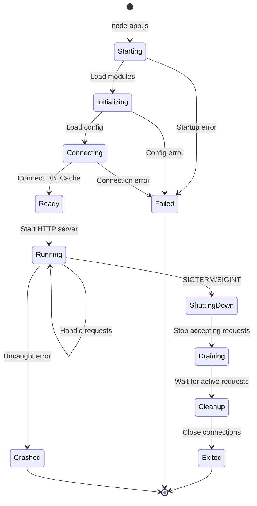
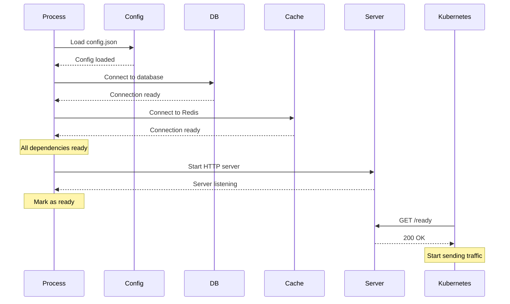
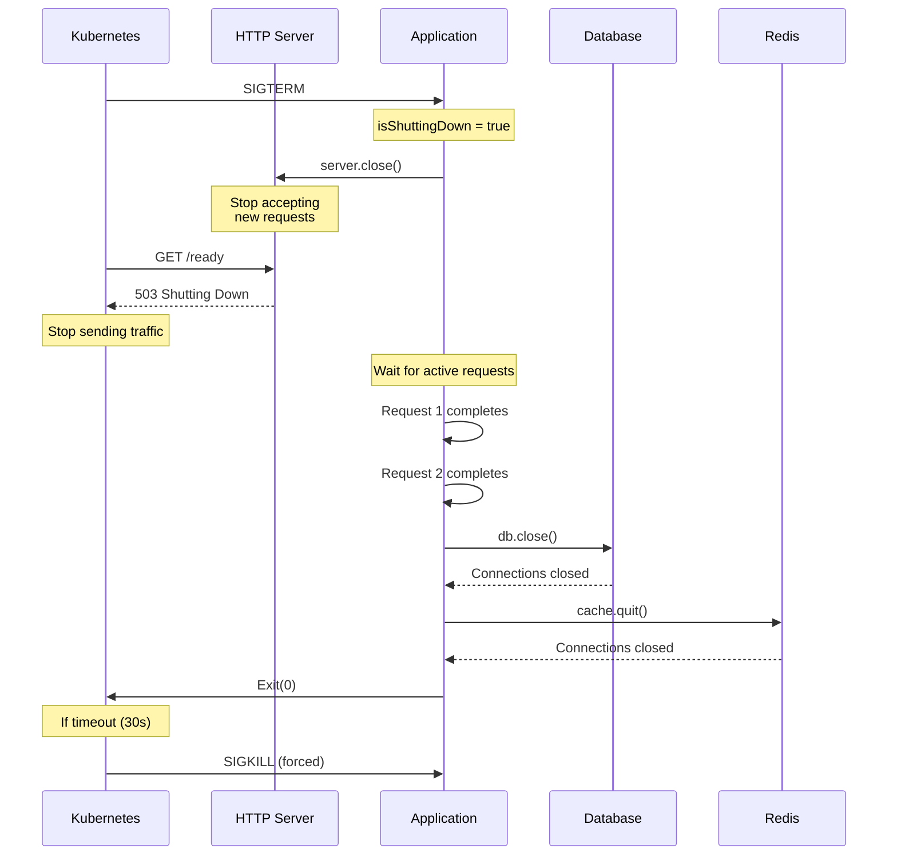
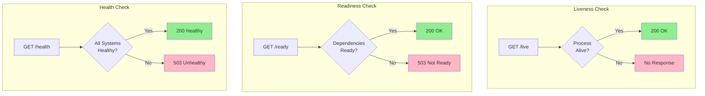

# Process Lifecycle

## 1. Why this exists (Real-world problem first)

Your Node.js service starts up, runs for a while, then crashes during deployment. No error logs. The problem? Database connections weren't properly initialized before the server started accepting requests. First request fails, cascades, service crashes.

**Real production failures from lifecycle ignorance:**

1. **The Initialization Race**: A payment service starts accepting HTTP requests before database connection pool is ready. First 100 requests fail with "Cannot connect to database." Circuit breakers trip. Service marked unhealthy. Kubernetes kills pod. Restart loop begins.

2. **The Unhandled Rejection**: A microservice has an unhandled Promise rejection during startup (config file missing). Process continues running but in broken state. Requests work for 2 hours, then suddenly all fail. Root cause: startup error was silently ignored.

3. **The Zombie Process**: A service receives SIGTERM during deployment. Doesn't clean up database connections. Connections leak. After 10 deployments, connection pool exhausted. New pods can't connect. Total outage.

4. **The Dependency Deadlock**: Service A depends on Service B. Both start simultaneously. Service A can't reach Service B during startup, crashes. Kubernetes restarts it. Infinite crash loop. Manual intervention required.

**What breaks without this knowledge:**
- Can't ensure proper initialization order
- Don't handle startup failures gracefully
- Can't clean up resources on shutdown
- Fail to handle process signals
- Can't implement health checks correctly

## 2. Mental model (build imagination)

Think of the process lifecycle as **Opening and Closing a Restaurant**.

### The Restaurant Analogy

**Startup Phase (Opening the Restaurant)**:
1. **Unlock doors** (process starts)
2. **Turn on equipment** (initialize services)
   - Turn on ovens (start database connections)
   - Fill refrigerators (load cache)
   - Boot POS system (initialize external services)
3. **Prepare ingredients** (load configuration, warm caches)
4. **Staff arrives** (worker threads ready)
5. **Open for business** (start accepting HTTP requests)

**Critical**: Don't open doors until everything is ready!

**Runtime Phase (Operating the Restaurant)**:
- Serve customers (handle requests)
- Monitor equipment (health checks)
- Handle issues (error handling)
- Adjust staffing (auto-scaling)

**Shutdown Phase (Closing the Restaurant)**:
1. **Stop accepting new customers** (stop accepting new requests)
2. **Finish serving current customers** (drain active connections)
3. **Clean kitchen** (flush logs, finish background jobs)
4. **Turn off equipment** (close database connections)
5. **Staff leaves** (terminate worker threads)
6. **Lock doors** (process exits)

**The Flow:**
```
Start → Initialize → Ready → Running → Shutdown → Exit
  ↓         ↓         ↓        ↓          ↓        ↓
Logs    Connect    Health   Serve    Drain    Clean
        to DB      Check    Requests  Conns    Exit
```

**Why this matters:**
- Proper initialization prevents startup failures
- Graceful shutdown prevents data loss
- Understanding lifecycle enables reliable deployments
- Health checks ensure readiness

## 3. How Node.js implements this internally

Node.js process has distinct lifecycle phases with specific events.

### Process Events

```javascript
// Startup events
process.on('beforeExit', (code) => {
  // Event loop is empty, process about to exit
  // Can schedule async work here
});

process.on('exit', (code) => {
  // Process is exiting, only sync code allowed
  // Cannot prevent exit
});

// Error events
process.on('uncaughtException', (err, origin) => {
  // Synchronous error not caught
  console.error('Uncaught exception:', err);
  // Should exit after logging
});

process.on('unhandledRejection', (reason, promise) => {
  // Promise rejected without .catch()
  console.error('Unhandled rejection:', reason);
  // Should exit after logging
});

// Signal events
process.on('SIGTERM', () => {
  // Graceful shutdown requested
});

process.on('SIGINT', () => {
  // Ctrl+C pressed
});
```

### Startup Phase Implementation

```javascript
async function startup() {
  console.log('Starting application...');
  
  try {
    // 1. Load configuration
    console.log('Loading configuration...');
    const config = await loadConfig();
    
    // 2. Initialize logging
    console.log('Initializing logging...');
    await initializeLogging(config.logging);
    
    // 3. Connect to database
    console.log('Connecting to database...');
    const db = await connectDatabase(config.database);
    await db.ping(); // Verify connection
    
    // 4. Connect to cache
    console.log('Connecting to Redis...');
    const cache = await connectRedis(config.redis);
    await cache.ping(); // Verify connection
    
    // 5. Initialize external services
    console.log('Initializing external services...');
    await initializeServices(config.services);
    
    // 6. Warm up caches
    console.log('Warming up caches...');
    await warmupCaches(db, cache);
    
    // 7. Start HTTP server ONLY after everything is ready
    console.log('Starting HTTP server...');
    const server = app.listen(config.port, () => {
      console.log(`✓ Server ready on port ${config.port}`);
      console.log('Application startup complete');
    });
    
    return { config, db, cache, server };
  } catch (err) {
    console.error('Startup failed:', err);
    process.exit(1); // Exit with error code
  }
}

// Start the application
startup().then(({ server, db, cache }) => {
  // Setup shutdown handlers
  setupShutdownHandlers(server, db, cache);
});
```

### Runtime Phase

```javascript
// Health check endpoint
app.get('/health', async (req, res) => {
  try {
    // Check all dependencies
    await db.ping();
    await cache.ping();
    
    res.json({
      status: 'healthy',
      uptime: process.uptime(),
      memory: process.memoryUsage(),
      timestamp: new Date().toISOString()
    });
  } catch (err) {
    res.status(503).json({
      status: 'unhealthy',
      error: err.message
    });
  }
});

// Readiness check (for Kubernetes)
app.get('/ready', async (req, res) => {
  if (isShuttingDown) {
    return res.status(503).json({ status: 'shutting down' });
  }
  
  try {
    await db.ping();
    res.json({ status: 'ready' });
  } catch (err) {
    res.status(503).json({ status: 'not ready', error: err.message });
  }
});

// Liveness check (for Kubernetes)
app.get('/live', (req, res) => {
  // Simple check that process is alive
  res.json({ status: 'alive' });
});
```

### Shutdown Phase

```javascript
let isShuttingDown = false;

async function gracefulShutdown(signal) {
  if (isShuttingDown) {
    console.log('Shutdown already in progress');
    return;
  }
  
  isShuttingDown = true;
  console.log(`${signal} received, starting graceful shutdown...`);
  
  // 1. Stop accepting new requests
  server.close(() => {
    console.log('✓ HTTP server closed');
  });
  
  // 2. Set shutdown timeout (Kubernetes default: 30s)
  const shutdownTimeout = setTimeout(() => {
    console.error('✗ Shutdown timeout, forcing exit');
    process.exit(1);
  }, 25000); // Exit before Kubernetes SIGKILL (30s)
  
  try {
    // 3. Wait for active requests to complete
    console.log('Waiting for active requests to complete...');
    await waitForActiveRequests();
    console.log('✓ All requests completed');
    
    // 4. Flush logs
    console.log('Flushing logs...');
    await flushLogs();
    console.log('✓ Logs flushed');
    
    // 5. Close database connections
    console.log('Closing database connections...');
    await db.close();
    console.log('✓ Database connections closed');
    
    // 6. Close cache connections
    console.log('Closing cache connections...');
    await cache.quit();
    console.log('✓ Cache connections closed');
    
    // 7. Stop background jobs
    console.log('Stopping background jobs...');
    await stopBackgroundJobs();
    console.log('✓ Background jobs stopped');
    
    clearTimeout(shutdownTimeout);
    console.log('✓ Graceful shutdown complete');
    process.exit(0);
  } catch (err) {
    console.error('✗ Shutdown error:', err);
    process.exit(1);
  }
}

// Register shutdown handlers
process.on('SIGTERM', () => gracefulShutdown('SIGTERM'));
process.on('SIGINT', () => gracefulShutdown('SIGINT'));
```

### Common Misunderstandings

**Mistake 1**: "Server can start before dependencies are ready"
- **Reality**: Leads to failed requests and cascading failures
- **Impact**: Poor user experience, service marked unhealthy

**Mistake 2**: "Process will clean up automatically on exit"
- **Reality**: Connections leak, data may be lost
- **Impact**: Resource exhaustion, data corruption

**Mistake 3**: "Health checks are optional"
- **Reality**: Kubernetes needs them to manage pods
- **Impact**: Unhealthy pods receive traffic, outages

## 4. Multiple diagrams (MANDATORY)

### Diagram 1: Process Lifecycle States



### Diagram 2: Initialization Order



### Diagram 3: Graceful Shutdown Flow



### Diagram 4: Health Check Types



## 5. Where this is used in real projects

### Production Startup Pattern

```javascript
const express = require('express');
const { createDatabase } = require('./database');
const { createCache } = require('./cache');

let isReady = false;
let isShuttingDown = false;

async function startup() {
  try {
    console.log('=== Application Startup ===');
    
    // Load configuration
    const config = require('./config');
    console.log('✓ Configuration loaded');
    
    // Initialize database
    const db = await createDatabase(config.database);
    await db.query('SELECT 1'); // Verify connection
    console.log('✓ Database connected');
    
    // Initialize cache
    const cache = await createCache(config.redis);
    await cache.ping();
    console.log('✓ Cache connected');
    
    // Create Express app
    const app = express();
    
    // Health checks
    app.get('/health', async (req, res) => {
      try {
        await db.query('SELECT 1');
        await cache.ping();
        res.json({ status: 'healthy' });
      } catch (err) {
        res.status(503).json({ status: 'unhealthy', error: err.message });
      }
    });
    
    app.get('/ready', (req, res) => {
      if (isShuttingDown) {
        return res.status(503).json({ status: 'shutting down' });
      }
      res.json({ status: isReady ? 'ready' : 'not ready' });
    });
    
    // Application routes
    app.get('/api/users', async (req, res) => {
      const users = await db.query('SELECT * FROM users');
      res.json(users);
    });
    
    // Start server
    const server = app.listen(config.port, () => {
      isReady = true;
      console.log(`✓ Server listening on port ${config.port}`);
      console.log('=== Startup Complete ===');
    });
    
    // Setup shutdown
    setupGracefulShutdown(server, db, cache);
    
  } catch (err) {
    console.error('✗ Startup failed:', err);
    process.exit(1);
  }
}

function setupGracefulShutdown(server, db, cache) {
  async function shutdown(signal) {
    if (isShuttingDown) return;
    isShuttingDown = true;
    isReady = false;
    
    console.log(`\n${signal} received, shutting down gracefully...`);
    
    const timeout = setTimeout(() => {
      console.error('✗ Forced shutdown');
      process.exit(1);
    }, 25000);
    
    try {
      server.close(() => console.log('✓ Server closed'));
      await db.close();
      console.log('✓ Database closed');
      await cache.quit();
      console.log('✓ Cache closed');
      
      clearTimeout(timeout);
      console.log('✓ Shutdown complete');
      process.exit(0);
    } catch (err) {
      console.error('✗ Shutdown error:', err);
      process.exit(1);
    }
  }
  
  process.on('SIGTERM', () => shutdown('SIGTERM'));
  process.on('SIGINT', () => shutdown('SIGINT'));
}

// Handle uncaught errors
process.on('uncaughtException', (err) => {
  console.error('Uncaught exception:', err);
  process.exit(1);
});

process.on('unhandledRejection', (reason) => {
  console.error('Unhandled rejection:', reason);
  process.exit(1);
});

// Start application
startup();
```

### Kubernetes Deployment with Health Checks

```yaml
apiVersion: apps/v1
kind: Deployment
metadata:
  name: nodejs-app
spec:
  replicas: 3
  template:
    spec:
      containers:
      - name: app
        image: nodejs-app:latest
        ports:
        - containerPort: 3000
        
        # Liveness probe: Is process alive?
        livenessProbe:
          httpGet:
            path: /live
            port: 3000
          initialDelaySeconds: 30
          periodSeconds: 10
          timeoutSeconds: 5
          failureThreshold: 3
        
        # Readiness probe: Can it handle traffic?
        readinessProbe:
          httpGet:
            path: /ready
            port: 3000
          initialDelaySeconds: 10
          periodSeconds: 5
          timeoutSeconds: 3
          failureThreshold: 2
        
        # Graceful shutdown
        lifecycle:
          preStop:
            exec:
              command: ["/bin/sh", "-c", "sleep 5"]
        
        # Resource limits
        resources:
          requests:
            memory: "512Mi"
            cpu: "500m"
          limits:
            memory: "1Gi"
            cpu: "1000m"
```

### Tracking Active Requests for Graceful Shutdown

```javascript
let activeRequests = 0;

app.use((req, res, next) => {
  if (isShuttingDown) {
    return res.status(503).send('Service shutting down');
  }
  
  activeRequests++;
  
  res.on('finish', () => {
    activeRequests--;
  });
  
  res.on('close', () => {
    activeRequests--;
  });
  
  next();
});

async function waitForActiveRequests() {
  return new Promise((resolve) => {
    const checkInterval = setInterval(() => {
      console.log(`Active requests: ${activeRequests}`);
      
      if (activeRequests === 0) {
        clearInterval(checkInterval);
        resolve();
      }
    }, 100);
    
    // Timeout after 20 seconds
    setTimeout(() => {
      clearInterval(checkInterval);
      console.warn(`Forcing shutdown with ${activeRequests} active requests`);
      resolve();
    }, 20000);
  });
}
```

## 6. Where this should NOT be used

### Starting Server Before Dependencies

**Misuse**: Server starts before database ready

```javascript
// WRONG: Server starts immediately
const server = app.listen(3000, () => {
  console.log('Server started');
});

// Database connects asynchronously
connectDatabase().then(db => {
  // Too late! Server already accepting requests
  // First requests will fail
});

// RIGHT: Wait for dependencies
async function startup() {
  const db = await connectDatabase();
  const server = app.listen(3000, () => {
    console.log('Server ready');
  });
}
```

### Ignoring Shutdown Signals

**Misuse**: No SIGTERM handler

```javascript
// WRONG: No shutdown handling
app.listen(3000);

// Process killed abruptly on deployment
// Connections not closed
// Data potentially lost

// RIGHT: Handle shutdown
process.on('SIGTERM', gracefulShutdown);
```

### Synchronous Operations in Exit Handler

**Misuse**: Async work in `exit` event

```javascript
// WRONG: Async in exit handler
process.on('exit', async () => {
  await db.close(); // Won't work! exit only allows sync
});

// RIGHT: Use SIGTERM for async cleanup
process.on('SIGTERM', async () => {
  await db.close();
  process.exit(0);
});
```

## 7. Failure modes & edge cases

### Failure Mode 1: Initialization Failure

**Scenario**: Database connection fails at startup

```javascript
// WRONG: Process continues in broken state
connectDatabase().catch(err => {
  console.error('DB connection failed:', err);
  // Process continues! Requests will fail
});

// RIGHT: Exit on critical failure
try {
  await connectDatabase();
} catch (err) {
  console.error('DB connection failed:', err);
  process.exit(1);
}
```

### Failure Mode 2: Unhandled Rejections

**Scenario**: Promise rejection not caught

```javascript
// WRONG: Silent failure
async function processData() {
  throw new Error('Processing failed');
}

processData(); // Unhandled rejection!

// RIGHT: Handle rejections
process.on('unhandledRejection', (err) => {
  console.error('Unhandled rejection:', err);
  process.exit(1);
});
```

### Failure Mode 3: Shutdown Timeout

**Scenario**: Active requests prevent shutdown

```javascript
// WRONG: No timeout
await waitForActiveRequests(); // Might wait forever

// RIGHT: Timeout
const timeout = setTimeout(() => {
  console.error('Forcing shutdown');
  process.exit(1);
}, 25000);

await waitForActiveRequests();
clearTimeout(timeout);
```

## 8. Trade-offs & alternatives

### Fast Startup vs Safe Startup

**Fast**: Start server immediately, connect async
**Safe**: Wait for all dependencies before starting
**Recommendation**: Safe startup for production

### Graceful vs Immediate Shutdown

**Graceful**: Wait for requests to complete
**Immediate**: Kill process immediately
**Recommendation**: Graceful with timeout

## 9. Interview-level articulation

**Q: "How do you ensure proper initialization order?"**

**A**: "I use async/await to ensure dependencies are ready before starting the server. First, load config. Then connect to database and cache, verifying each connection with a ping. Only after all critical dependencies are ready do I start the HTTP server. If any step fails, I log the error and exit with code 1. This prevents the server from accepting requests before it's ready to handle them."

**Q: "How do you handle graceful shutdown?"**

**A**: "I listen for SIGTERM and SIGINT signals. When received, I stop accepting new requests by calling `server.close()`, wait for existing requests to complete with a timeout, close database connections, and exit cleanly with code 0. This prevents data loss and connection leaks during deployments. I also implement readiness checks that return 503 during shutdown so Kubernetes stops sending traffic."

**Q: "What's the difference between liveness and readiness probes?"**

**A**: "Liveness checks if the process is alive—if it fails, Kubernetes restarts the pod. Readiness checks if the pod can handle traffic—if it fails, Kubernetes stops sending requests but doesn't restart. During startup, readiness fails until dependencies are ready. During shutdown, readiness fails to stop traffic. Liveness should be simple and fast, readiness can check dependencies."

## 10. Key takeaways (engineer mindset)

### What to Remember

1. **Initialize dependencies before accepting requests**
2. **Handle uncaught exceptions and unhandled rejections**
3. **Implement graceful shutdown for SIGTERM/SIGINT**
4. **Use health checks to verify readiness**
5. **Exit with appropriate codes** (0 = success, 1 = error)
6. **Set shutdown timeout** before Kubernetes SIGKILL (30s)
7. **Track active requests** for proper draining

### What Decisions This Enables

**Startup decisions**:
- Load config first, fail fast if missing
- Connect to dependencies, verify connections
- Start server only when ready

**Runtime decisions**:
- Implement /health, /ready, /live endpoints
- Monitor dependencies continuously
- Handle errors gracefully

**Shutdown decisions**:
- Stop accepting requests first
- Drain active connections
- Close resources in reverse order
- Exit before timeout

### How It Connects to Other Node.js Concepts

**Signals & Graceful Shutdown** (Topic 10):
- Builds on process lifecycle
- Implements shutdown phase

**Event Emitters** (Topic 17):
- Process is an EventEmitter
- Lifecycle events are emitted

**Cluster Module** (Topic 15):
- Each worker has lifecycle
- Master manages worker lifecycles

### The Golden Rule

**Never start accepting requests until all critical dependencies are ready**. Always handle shutdown signals gracefully to prevent data loss. Implement health checks for Kubernetes. Exit with appropriate codes.
