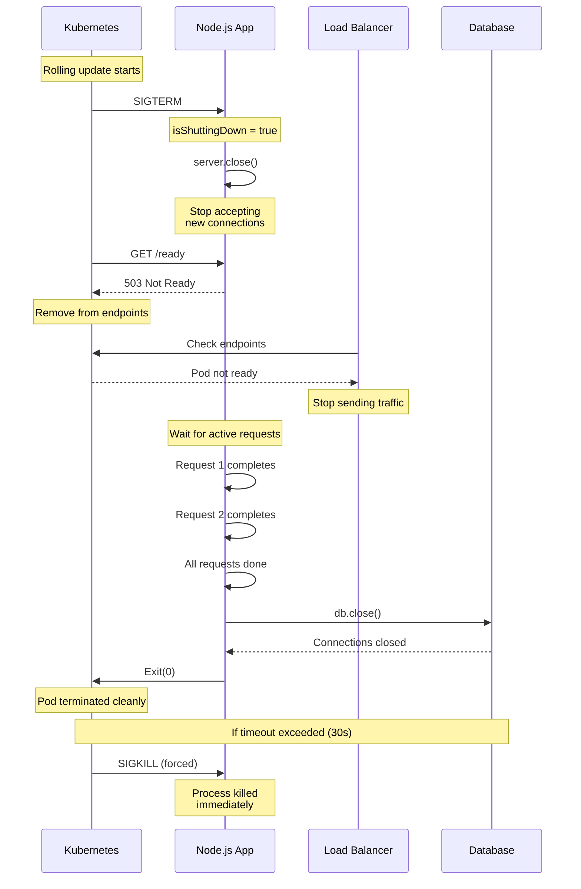
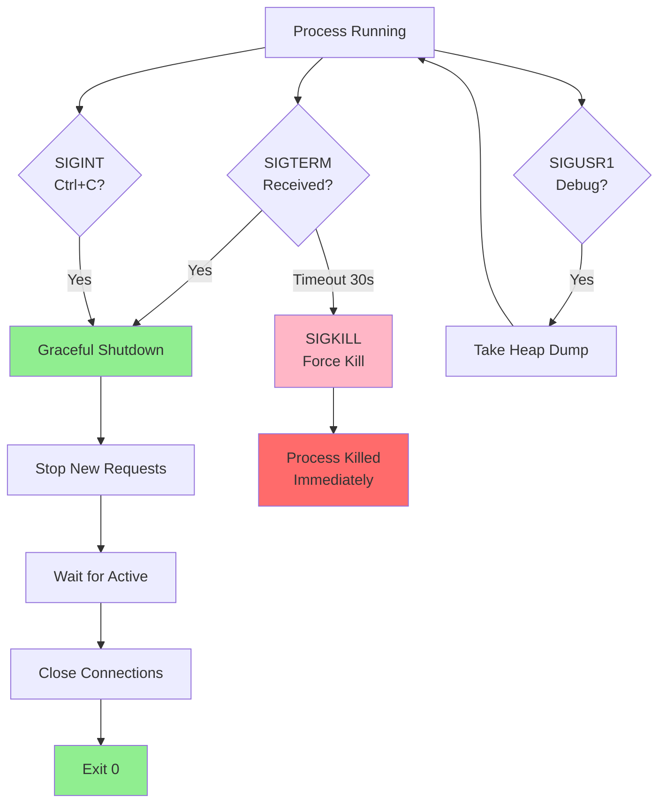
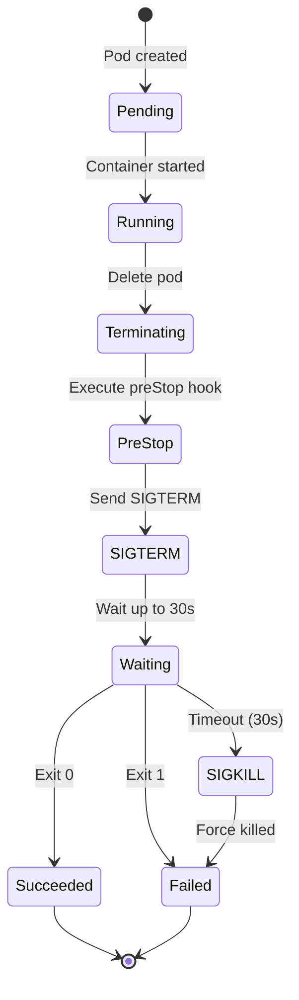

# Signals & Graceful Shutdown

## 1. Why this exists (Real-world problem first)

Your Kubernetes deployment kills pods during rollout. Active requests are terminated mid-flight. Users see 502 errors. Orders are lost. The problem? Your service doesn't handle SIGTERM. Kubernetes sends SIGTERM, waits 30 seconds, then sends SIGKILL. Your service ignores SIGTERM and gets forcefully killed.

**Real production failures from signal ignorance:**

1. **The Lost Orders**: An e-commerce checkout receives SIGTERM during payment processing. Process killed mid-transaction. Payment succeeds at Stripe but order not created in database. Money charged, no product delivered. Customer support nightmare. $50K in manual reconciliation.

2. **The Connection Leak**: A microservice doesn't close database connections on SIGTERM. After 20 deployments (5 per day × 4 days), connection pool exhausted. New pods can't connect. Total outage. Manual database restart required.

3. **The Zombie Requests**: Load balancer still sends traffic during shutdown because readiness probe not implemented. Requests fail with "Connection refused." Users see errors during every deployment. 5% error rate during 10-minute deployment window.

4. **The Data Corruption**: A file processing service receives SIGTERM while writing to file. Doesn't flush buffers. File corrupted. Batch job fails. 24 hours of processing lost.

**What breaks without this knowledge:**
- Requests lost during deployment
- Data corruption from abrupt termination
- Resource leaks (connections, file handles)
- Poor deployment experience
- Can't implement zero-downtime deployments

## 2. Mental model (build imagination)

Think of signals as **Emergency Alerts** with different urgency levels.

### The Emergency Alert Analogy

**SIGTERM (Polite Request - Fire Alarm)**:
- "Please evacuate the building when convenient"
- Time to gather belongings (typically 30 seconds)
- Orderly exit expected
- Can finish current task

**SIGINT (User Interrupt - Ctrl+C)**:
- "User wants to stop"
- Similar to SIGTERM
- Handle gracefully
- Clean exit

**SIGKILL (Forced Termination - Building Collapse)**:
- "Die immediately, no questions asked"
- Cannot be caught or ignored
- No cleanup possible
- Process terminated instantly

**The Flow:**
1. Orchestrator (Kubernetes) sends SIGTERM
2. Service stops accepting new requests
3. Service marks itself as "not ready"
4. Load balancer stops sending traffic
5. Service waits for active requests to complete
6. Service closes connections
7. Service exits cleanly (code 0)
8. If timeout exceeded (30s), orchestrator sends SIGKILL

**Why this matters:**
- Prevents data loss
- Enables zero-downtime deployments
- Ensures resource cleanup
- Provides good user experience

## 3. How Node.js implements this internally

Node.js can listen for and handle process signals using the `process` object.

### Signal Types

```javascript
// Common signals in Node.js

// SIGTERM - Graceful shutdown request
process.on('SIGTERM', () => {
  console.log('SIGTERM received');
  gracefulShutdown();
});

// SIGINT - Ctrl+C or interrupt
process.on('SIGINT', () => {
  console.log('SIGINT received');
  gracefulShutdown();
});

// SIGHUP - Hangup (terminal closed)
process.on('SIGHUP', () => {
  console.log('SIGHUP received');
  // Often used for config reload
});

// SIGUSR1 - User-defined signal 1
process.on('SIGUSR1', () => {
  console.log('SIGUSR1 received');
  // Often used for debugging (e.g., heap dump)
});

// SIGUSR2 - User-defined signal 2
process.on('SIGUSR2', () => {
  console.log('SIGUSR2 received');
  // Often used by nodemon for restart
});

// SIGKILL - Cannot be caught!
// SIGSTOP - Cannot be caught!
```

### Graceful Shutdown Implementation

```javascript
let isShuttingDown = false;
let activeRequests = 0;

async function gracefulShutdown(signal) {
  // Prevent multiple shutdown attempts
  if (isShuttingDown) {
    console.log('Shutdown already in progress');
    return;
  }
  
  isShuttingDown = true;
  console.log(`\n${signal} received, starting graceful shutdown...`);
  
  // 1. Stop accepting new requests
  server.close(() => {
    console.log('✓ HTTP server closed (no new connections)');
  });
  
  // 2. Mark as not ready (for Kubernetes)
  isReady = false;
  
  // 3. Set shutdown timeout (Kubernetes default: 30s)
  const shutdownTimeout = setTimeout(() => {
    console.error('✗ Shutdown timeout exceeded, forcing exit');
    console.error(`  Active requests: ${activeRequests}`);
    process.exit(1);
  }, 25000); // Exit before Kubernetes SIGKILL (30s)
  
  try {
    // 4. Wait for active requests to complete
    console.log('Waiting for active requests to complete...');
    await waitForActiveRequests();
    console.log(`✓ All requests completed`);
    
    // 5. Close database connections
    console.log('Closing database connections...');
    await db.close();
    console.log('✓ Database connections closed');
    
    // 6. Close cache connections
    console.log('Closing cache connections...');
    await cache.quit();
    console.log('✓ Cache connections closed');
    
    // 7. Flush logs
    console.log('Flushing logs...');
    await flushLogs();
    console.log('✓ Logs flushed');
    
    // 8. Stop background jobs
    console.log('Stopping background jobs...');
    await stopBackgroundJobs();
    console.log('✓ Background jobs stopped');
    
    clearTimeout(shutdownTimeout);
    console.log('✓ Graceful shutdown complete');
    process.exit(0);
  } catch (err) {
    console.error('✗ Shutdown error:', err);
    process.exit(1);
  }
}

// Register signal handlers
process.on('SIGTERM', () => gracefulShutdown('SIGTERM'));
process.on('SIGINT', () => gracefulShutdown('SIGINT'));
```

### Tracking Active Requests

```javascript
let activeRequests = 0;

// Middleware to track active requests
app.use((req, res, next) => {
  // Reject new requests during shutdown
  if (isShuttingDown) {
    return res.status(503).json({
      error: 'Service shutting down',
      retryAfter: 30
    });
  }
  
  activeRequests++;
  console.log(`Active requests: ${activeRequests} (${req.method} ${req.path})`);
  
  // Decrement on response finish
  res.on('finish', () => {
    activeRequests--;
    console.log(`Active requests: ${activeRequests}`);
  });
  
  // Decrement on connection close
  res.on('close', () => {
    activeRequests--;
    console.log(`Active requests: ${activeRequests} (connection closed)`);
  });
  
  next();
});

async function waitForActiveRequests() {
  return new Promise((resolve) => {
    // Check every 100ms
    const checkInterval = setInterval(() => {
      console.log(`  Waiting for ${activeRequests} active requests...`);
      
      if (activeRequests === 0) {
        clearInterval(checkInterval);
        resolve();
      }
    }, 100);
    
    // Force resolve after 20 seconds
    setTimeout(() => {
      clearInterval(checkInterval);
      if (activeRequests > 0) {
        console.warn(`  Forcing shutdown with ${activeRequests} active requests`);
      }
      resolve();
    }, 20000);
  });
}
```

### Common Misunderstandings

**Mistake 1**: "SIGTERM will wait for my app to finish"
- **Reality**: Kubernetes sends SIGKILL after 30s
- **Impact**: Process killed mid-operation

**Mistake 2**: "Closing server stops all requests"
- **Reality**: Only stops accepting new connections
- **Impact**: Active requests continue

**Mistake 3**: "SIGKILL can be handled"
- **Reality**: SIGKILL cannot be caught
- **Impact**: No cleanup possible

## 4. Multiple diagrams (MANDATORY)

### Diagram 1: Graceful Shutdown Flow



### Diagram 2: Signal Types & Handling



### Diagram 3: Kubernetes Pod Lifecycle



### Diagram 4: Zero-Downtime Deployment

```mermaid
gantt
    title Zero-Downtime Deployment
    dateFormat X
    axisFormat %L s
    
    section Old Pod
    Serving traffic :0, 10000
    SIGTERM received :10000, 10100
    Draining requests :10100, 15000
    Shutdown complete :15000, 15500
    
    section New Pod
    Starting :5000, 8000
    Initializing :8000, 10000
    Ready :10000, 10100
    Receiving traffic :10100, 30000
    
    section Load Balancer
    Route to old :0, 10100
    Route to new :10100, 30000
```



## 5. Where this is used in real projects

### Production Graceful Shutdown

```javascript
const express = require('express');
const app = express();

let server;
let isShuttingDown = false;
let isReady = false;
let activeRequests = 0;

// Track active requests
app.use((req, res, next) => {
  if (isShuttingDown) {
    return res.status(503).json({
      error: 'Service shutting down',
      retryAfter: 30
    });
  }
  
  activeRequests++;
  
  res.on('finish', () => activeRequests--);
  res.on('close', () => activeRequests--);
  
  next();
});

// Health checks
app.get('/health', async (req, res) => {
  try {
    await db.ping();
    res.json({ status: 'healthy' });
  } catch (err) {
    res.status(503).json({ status: 'unhealthy' });
  }
});

app.get('/ready', (req, res) => {
  if (isShuttingDown || !isReady) {
    return res.status(503).json({ status: 'not ready' });
  }
  res.json({ status: 'ready' });
});

// Startup
async function startup() {
  await db.connect();
  await cache.connect();
  
  server = app.listen(3000, () => {
    isReady = true;
    console.log('Server ready');
  });
  
  setupGracefulShutdown();
}

// Graceful shutdown
function setupGracefulShutdown() {
  async function shutdown(signal) {
    if (isShuttingDown) return;
    isShuttingDown = true;
    isReady = false;
    
    console.log(`${signal} received, shutting down...`);
    
    const timeout = setTimeout(() => {
      console.error('Forced shutdown');
      process.exit(1);
    }, 25000);
    
    try {
      // Stop accepting new connections
      server.close(() => {
        console.log('Server closed');
      });
      
      // Wait for active requests
      while (activeRequests > 0) {
        console.log(`Waiting for ${activeRequests} requests...`);
        await new Promise(resolve => setTimeout(resolve, 100));
      }
      
      // Close connections
      await db.close();
      await cache.quit();
      
      clearTimeout(timeout);
      console.log('Shutdown complete');
      process.exit(0);
    } catch (err) {
      console.error('Shutdown error:', err);
      process.exit(1);
    }
  }
  
  process.on('SIGTERM', () => shutdown('SIGTERM'));
  process.on('SIGINT', () => shutdown('SIGINT'));
}

startup();
```

### Kubernetes Deployment with PreStop Hook

```yaml
apiVersion: apps/v1
kind: Deployment
metadata:
  name: nodejs-app
spec:
  replicas: 3
  strategy:
    type: RollingUpdate
    rollingUpdate:
      maxUnavailable: 1
      maxSurge: 1
  template:
    spec:
      containers:
      - name: app
        image: nodejs-app:latest
        ports:
        - containerPort: 3000
        
        # Readiness probe
        readinessProbe:
          httpGet:
            path: /ready
            port: 3000
          initialDelaySeconds: 10
          periodSeconds: 5
          failureThreshold: 2
        
        # Lifecycle hooks
        lifecycle:
          preStop:
            exec:
              # Sleep to allow load balancer to update
              command: ["/bin/sh", "-c", "sleep 5"]
        
        # Termination grace period
        terminationGracePeriodSeconds: 30
```

### Handling Long-Running Requests

```javascript
// For requests that might take >30s
app.post('/batch-process', async (req, res) => {
  const jobId = generateJobId();
  
  // Return immediately with job ID
  res.json({ jobId, status: 'processing' });
  
  // Process in background
  processJob(jobId, req.body).catch(err => {
    console.error(`Job ${jobId} failed:`, err);
  });
});

// Check job status
app.get('/batch-process/:jobId', async (req, res) => {
  const status = await getJobStatus(req.params.jobId);
  res.json(status);
});

// On shutdown, mark in-progress jobs
async function gracefulShutdown() {
  // Mark all in-progress jobs as interrupted
  await markJobsAsInterrupted();
  
  // They'll be picked up by another instance
}
```

### Debugging with SIGUSR1

```javascript
// Take heap snapshot on SIGUSR1
process.on('SIGUSR1', () => {
  const v8 = require('v8');
  const filename = `heap-${Date.now()}.heapsnapshot`;
  
  console.log(`Taking heap snapshot: ${filename}`);
  v8.writeHeapSnapshot(filename);
  console.log('Heap snapshot complete');
});

// Usage:
// kill -SIGUSR1 <pid>
```

## 6. Where this should NOT be used

### Ignoring Shutdown Signals

**Misuse**: No SIGTERM handler

```javascript
// WRONG: No shutdown handling
app.listen(3000);

// Process killed abruptly on deployment
// Active requests lost
// Connections not closed

// RIGHT: Handle shutdown
process.on('SIGTERM', gracefulShutdown);
```

### Infinite Shutdown Wait

**Misuse**: No timeout on shutdown

```javascript
// WRONG: Waits forever
async function shutdown() {
  while (activeRequests > 0) {
    await sleep(100); // Might wait forever!
  }
}

// RIGHT: Timeout after 25s
const timeout = setTimeout(() => {
  console.error('Forcing shutdown');
  process.exit(1);
}, 25000);
```

### Synchronous Cleanup in Signal Handler

**Misuse**: Blocking operations in handler

```javascript
// WRONG: Synchronous operations
process.on('SIGTERM', () => {
  db.closeSync(); // Blocks event loop!
  process.exit(0);
});

// RIGHT: Async cleanup
process.on('SIGTERM', async () => {
  await db.close();
  process.exit(0);
});
```

## 7. Failure modes & edge cases

### Failure Mode 1: Shutdown Timeout

**Scenario**: Long-running requests prevent shutdown

```javascript
// Request takes 60 seconds
app.get('/slow', async (req, res) => {
  await processForMinute();
  res.send('Done');
});

// Shutdown timeout is 25 seconds
// Request will be killed mid-processing

// Solution: Return immediately, process async
app.get('/slow', async (req, res) => {
  const jobId = startAsyncJob();
  res.json({ jobId });
});
```

### Failure Mode 2: Multiple Signal Handlers

**Scenario**: Signal handler called multiple times

```javascript
// WRONG: No guard
process.on('SIGTERM', gracefulShutdown);
// If SIGTERM sent twice, shutdown runs twice

// RIGHT: Guard with flag
let isShuttingDown = false;

process.on('SIGTERM', () => {
  if (isShuttingDown) return;
  isShuttingDown = true;
  gracefulShutdown();
});
```

### Failure Mode 3: Load Balancer Still Sending Traffic

**Scenario**: Traffic sent during shutdown

```javascript
// WRONG: No readiness check
// Load balancer doesn't know pod is shutting down

// RIGHT: Readiness check returns 503
app.get('/ready', (req, res) => {
  if (isShuttingDown) {
    return res.status(503).json({ status: 'shutting down' });
  }
  res.json({ status: 'ready' });
});
```

### Edge Case: SIGKILL Cannot Be Caught

**Scenario**: Process killed with SIGKILL

```bash
# This cannot be handled
kill -9 <pid>

# Process dies immediately
# No cleanup possible
# Always use SIGTERM first
kill -15 <pid>
```

## 8. Trade-offs & alternatives

### Graceful Shutdown

**Gain**: No lost requests, clean resource cleanup
**Sacrifice**: Slower deployments (30s per pod)
**When**: Production services, stateful applications

### Immediate Shutdown

**Gain**: Fast deployments
**Sacrifice**: Lost requests, resource leaks
**When**: Development only, stateless batch jobs

### PreStop Hook

**Gain**: Time for load balancer to update
**Sacrifice**: Adds 5-10s to shutdown
**When**: Always in Kubernetes

## 9. Interview-level articulation

**Q: "How do you implement graceful shutdown?"**

**A**: "I listen for SIGTERM and SIGINT signals. When received, I stop accepting new requests by calling `server.close()`, mark the pod as not ready so Kubernetes stops sending traffic, wait for active requests to complete with a 25-second timeout, close database and cache connections, and exit with code 0. This prevents data loss and ensures zero-downtime deployments."

**Q: "What's the difference between SIGTERM and SIGKILL?"**

**A**: "SIGTERM is a polite request to shut down that can be caught and handled gracefully. The process can clean up resources and exit cleanly. SIGKILL is a forced termination that cannot be caught—the process is killed immediately with no cleanup. Kubernetes sends SIGTERM first, waits 30 seconds (terminationGracePeriodSeconds), then sends SIGKILL if the process hasn't exited."

**Q: "How do you handle long-running requests during shutdown?"**

**A**: "For requests that might exceed the 30-second shutdown window, I use an async job pattern. The endpoint returns immediately with a job ID, and the actual processing happens in the background. Clients poll a status endpoint to check progress. During shutdown, I mark in-progress jobs as interrupted so they can be picked up by another instance. This prevents lost work while still allowing graceful shutdown."

## 10. Key takeaways (engineer mindset)

### What to Remember

1. **Always handle SIGTERM and SIGINT**
2. **Stop accepting new requests first**
3. **Wait for active requests with timeout** (25s)
4. **Close connections before exit**
5. **Exit before Kubernetes timeout** (30s)
6. **Implement readiness probe** that returns 503 during shutdown
7. **Use preStop hook** for load balancer propagation

### What Decisions This Enables

**Deployment decisions**:
- Zero-downtime rolling updates
- Safe pod termination
- Proper resource cleanup

**Reliability decisions**:
- No lost requests during deployment
- No data corruption
- No connection leaks

**Debugging decisions**:
- Use SIGUSR1 for heap dumps
- Use SIGHUP for config reload
- Monitor shutdown duration

### How It Connects to Other Node.js Concepts

**Process Lifecycle** (Topic 9):
- Shutdown is final phase of lifecycle
- Builds on initialization patterns

**Event Emitters** (Topic 17):
- Process is an EventEmitter
- Signals are events

**Cluster Module** (Topic 15):
- Each worker handles signals independently
- Master coordinates worker shutdown

### The Golden Rule

**Handle SIGTERM gracefully**. Stop accepting requests, mark as not ready, drain connections, close resources, exit cleanly. Never ignore shutdown signals in production. Always exit before the 30-second Kubernetes timeout.
