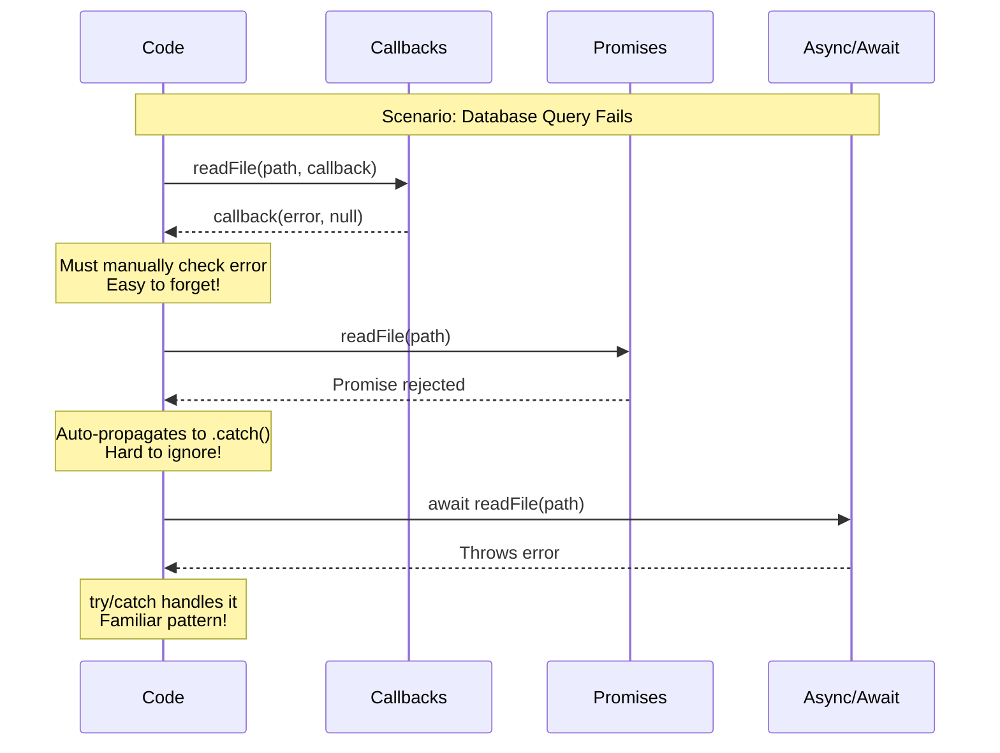

# Callbacks → Promises → Async/Await (internals)

## 1. Why this exists (Real-world problem first)

Your e-commerce checkout flow has a subtle bug that only appears under load. Orders are processed, but confirmation emails sometimes don't send. After weeks of debugging, you discover: a callback error handler was silently swallowing exceptions. The Promise version would have surfaced the error, but the team was still using callbacks from 2015.

**Real production failures from async pattern evolution:**

1. **The Silent Failure**: A payment gateway integration uses callbacks. An error in the success callback goes unhandled. Payments succeed but orders aren't created. Money charged, no product delivered. The Promise version would have caught this with `.catch()`.

2. **The Callback Hell Deadlock**: A file processing pipeline has 7 nested callbacks. A developer adds error handling to level 3 but forgets level 5. Under load, unhandled errors crash the process. Async/await would have made the error path obvious.

3. **The Race Condition**: Multiple database queries use callbacks with shared state. Callback execution order is non-deterministic. Sometimes user A gets user B's data. Promise.all() would have prevented this.

**What breaks without understanding the evolution:**
- You can't refactor legacy callback code safely
- You don't understand error propagation differences
- You write new code with old patterns
- You fail to leverage modern async features

## 2. Mental model (build imagination)

Think of async patterns as **Three Generations of Restaurant Order Systems**.

### The Restaurant Analogy

**Callbacks (1st Generation - Paper Slips)**:
- Customer orders → waiter writes on paper slip
- Waiter gives slip to kitchen → provides callback function "when done, bring to table 5"
- Kitchen finishes → calls the callback
- **Problem**: If waiter forgets to write table number, food sits in kitchen (silent failure)
- **Problem**: Multiple orders create nested slips (callback hell)

**Promises (2nd Generation - Digital Tickets)**:
- Customer orders → system creates digital ticket (Promise)
- Ticket has three states: Pending, Fulfilled (ready), Rejected (failed)
- Kitchen can't "forget" to notify → ticket automatically updates
- **Advantage**: Can track multiple tickets easily (Promise.all)
- **Advantage**: Errors automatically propagate up the chain

**Async/Await (3rd Generation - Smart Ordering)**:
- Same digital tickets (Promises) under the hood
- But waiter can "wait" for ticket to complete before taking next order
- Code looks synchronous, but still non-blocking
- **Advantage**: Error handling with try/catch (familiar pattern)
- **Advantage**: Easier to read and maintain

**Why this matters:**
- Each generation solves problems of the previous
- Understanding all three helps with legacy code
- Modern code uses async/await, but Promises underneath
- Callbacks still exist in many APIs

## 3. How Node.js implements this internally

All three patterns ultimately use the same event loop mechanism, but with different abstractions.

### Callbacks (Original Pattern)

**Implementation:**
```javascript
function readFile(path, callback) {
  // 1. Queue work on thread pool
  threadPool.queueWork(() => {
    const data = fs.readSync(path);
    
    // 2. When done, queue callback on event loop
    eventLoop.queueCallback(() => {
      callback(null, data);
    });
  });
}
```

**Characteristics:**
- Direct function passing
- No built-in error handling
- Execution order: callback hell makes it hard to track
- Error convention: first parameter is error (Node.js convention)

### Promises (ES6 Addition)

**Implementation:**
```javascript
class Promise {
  constructor(executor) {
    this.state = 'pending';
    this.value = undefined;
    this.handlers = [];
    
    const resolve = (value) => {
      if (this.state !== 'pending') return;
      this.state = 'fulfilled';
      this.value = value;
      this.handlers.forEach(h => h.onFulfilled(value));
    };
    
    const reject = (error) => {
      if (this.state !== 'pending') return;
      this.state = 'rejected';
      this.value = error;
      this.handlers.forEach(h => h.onRejected(error));
    };
    
    executor(resolve, reject);
  }
  
  then(onFulfilled, onRejected) {
    return new Promise((resolve, reject) => {
      this.handlers.push({ onFulfilled, onRejected });
    });
  }
}
```

**Characteristics:**
- State machine (pending → fulfilled/rejected)
- Automatic error propagation
- Chainable with `.then()`
- Microtask queue for resolution

### Async/Await (ES2017 Syntactic Sugar)

**Implementation:**
```javascript
// This code:
async function fetchUser(id) {
  const user = await db.users.findById(id);
  return user;
}

// Transpiles to:
function fetchUser(id) {
  return new Promise((resolve, reject) => {
    db.users.findById(id).then(user => {
      resolve(user);
    }).catch(reject);
  });
}
```

**Characteristics:**
- Syntactic sugar over Promises
- `async` function always returns Promise
- `await` pauses function execution (not thread!)
- Error handling with try/catch

### Common Misunderstandings

**Mistake 1**: "Async/await is different from Promises"
- **Reality**: Async/await IS Promises, just different syntax
- **Impact**: Confusion about when to use which

**Mistake 2**: "Await blocks the thread"
- **Reality**: Await yields to event loop, doesn't block
- **Impact**: Fear of using await in loops

**Mistake 3**: "Callbacks are faster than Promises"
- **Reality**: Promises have minimal overhead (~1-2% in V8)
- **Impact**: Premature optimization

## 4. Multiple diagrams (MANDATORY)

### Diagram 1: Evolution of Async Patterns

```mermaid
graph TB
    subgraph "Callbacks (2009)"
        CB1[Start Operation] --> CB2[Pass Callback Function]
        CB2 --> CB3[Operation Completes]
        CB3 --> CB4[Call Callback]
        CB4 --> CB5{Error?}
        CB5 -->|Yes| CB6[First Param = Error]
        CB5 -->|No| CB7[First Param = null]
    end
    
    subgraph "Promises (2015)"
        P1[Start Operation] --> P2[Return Promise Object]
        P2 --> P3[Promise: Pending]
        P3 --> P4{Operation Result}
        P4 -->|Success| P5[Promise: Fulfilled]
        P4 -->|Error| P6[Promise: Rejected]
        P5 --> P7[.then handler]
        P6 --> P8[.catch handler]
    end
    
    subgraph "Async/Await (2017)"
        AA1[async function] --> AA2[await Promise]
        AA2 --> AA3[Pause Execution]
        AA3 --> AA4{Promise Result}
        AA4 -->|Fulfilled| AA5[Resume with Value]
        AA4 -->|Rejected| AA6[Throw Error]
        AA6 --> AA7[try/catch]
    end
    
    style CB6 fill:#FFB6C6
    style P6 fill:#FFB6C6
    style AA6 fill:#FFB6C6
```



### Diagram 2: Error Propagation Comparison



### Diagram 3: Callback Hell vs Promise Chain vs Async/Await

```mermaid
graph LR
    subgraph "Callback Hell"
        A1[Step 1] --> A2[callback]
        A2 --> A3[Step 2]
        A3 --> A4[callback]
        A4 --> A5[Step 3]
        A5 --> A6[callback]
        A6 --> A7[Step 4]
        A7 --> A8[callback]
    end
    
    subgraph "Promise Chain"
        B1[Step 1] --> B2[.then]
        B2 --> B3[Step 2]
        B3 --> B4[.then]
        B4 --> B5[Step 3]
        B5 --> B6[.then]
        B6 --> B7[Step 4]
    end
    
    subgraph "Async/Await"
        C1[await Step 1]
        C2[await Step 2]
        C3[await Step 3]
        C4[await Step 4]
        C1 --> C2
        C2 --> C3
        C3 --> C4
    end
    
    style A1 fill:#FFE1E1
    style A3 fill:#FFE1E1
    style A5 fill:#FFE1E1
    style A7 fill:#FFE1E1
    style B1 fill:#FFF4E1
    style B3 fill:#FFF4E1
    style B5 fill:#FFF4E1
    style B7 fill:#FFF4E1
    style C1 fill:#E1FFE1
    style C2 fill:#E1FFE1
    style C3 fill:#E1FFE1
    style C4 fill:#E1FFE1
```



## 5. Where this is used in real projects

### API Request Handling (Async/Await)

**Scenario**: Express route with multiple async operations

```javascript
// Modern: Async/Await
app.post('/checkout', async (req, res) => {
  try {
    const user = await db.users.findById(req.userId);
    const cart = await db.carts.findById(user.cartId);
    const payment = await stripe.charge(cart.total);
    const order = await db.orders.create({ user, cart, payment });
    await sendEmail(user.email, order);
    
    res.json({ success: true, order });
  } catch (error) {
    res.status(500).json({ error: error.message });
  }
});

// Legacy: Callbacks (avoid in new code)
app.post('/checkout', (req, res) => {
  db.users.findById(req.userId, (err, user) => {
    if (err) return res.status(500).json({ error: err.message });
    
    db.carts.findById(user.cartId, (err, cart) => {
      if (err) return res.status(500).json({ error: err.message });
      
      stripe.charge(cart.total, (err, payment) => {
        if (err) return res.status(500).json({ error: err.message });
        
        // Callback hell continues...
      });
    });
  });
});
```

### Parallel Operations (Promise.all)

**Scenario**: Fetching data from multiple sources

```javascript
// Efficient: Parallel with Promise.all
async function getDashboardData(userId) {
  const [user, orders, notifications, stats] = await Promise.all([
    db.users.findById(userId),
    db.orders.findByUser(userId),
    db.notifications.findByUser(userId),
    analytics.getUserStats(userId)
  ]);
  
  return { user, orders, notifications, stats };
}

// Inefficient: Sequential awaits
async function getDashboardDataSlow(userId) {
  const user = await db.users.findById(userId);           // 50ms
  const orders = await db.orders.findByUser(userId);      // 50ms
  const notifications = await db.notifications.findByUser(userId); // 50ms
  const stats = await analytics.getUserStats(userId);     // 50ms
  // Total: 200ms (sequential)
  
  return { user, orders, notifications, stats };
}
// With Promise.all: 50ms (parallel)
```

### Error Handling Patterns

**Scenario**: Graceful degradation

```javascript
async function getUserProfile(userId) {
  try {
    const user = await db.users.findById(userId);
    
    // Optional data - don't fail if unavailable
    let avatar;
    try {
      avatar = await cdn.getAvatar(user.avatarId);
    } catch (err) {
      console.warn('Avatar fetch failed:', err);
      avatar = DEFAULT_AVATAR;
    }
    
    return { ...user, avatar };
  } catch (error) {
    // Critical error - propagate
    throw new Error(`Failed to fetch user: ${error.message}`);
  }
}
```

### Legacy Callback to Promise Conversion

**Scenario**: Wrapping callback-based APIs

```javascript
const { promisify } = require('util');
const fs = require('fs');

// Built-in promisify
const readFile = promisify(fs.readFile);

// Manual promisification
function readFilePromise(path) {
  return new Promise((resolve, reject) => {
    fs.readFile(path, (err, data) => {
      if (err) reject(err);
      else resolve(data);
    });
  });
}

// Usage
async function processFile(path) {
  const data = await readFile(path);
  return data.toString();
}
```

## 6. Where this should NOT be used

### Mixing Patterns Unnecessarily

**Misuse**: Mixing callbacks and Promises

```javascript
// WRONG: Confusing mix
async function badPattern() {
  return new Promise((resolve, reject) => {
    setTimeout(() => {
      resolve('done');
    }, 1000);
  });
}

// RIGHT: Use async/await directly
async function goodPattern() {
  await new Promise(resolve => setTimeout(resolve, 1000));
  return 'done';
}
```

### Forgetting to Await

**Misuse**: Not awaiting Promises

```javascript
// WRONG: Doesn't wait for completion
async function saveUser(user) {
  db.users.save(user); // Missing await!
  console.log('User saved'); // Logs before save completes
}

// RIGHT: Await the Promise
async function saveUser(user) {
  await db.users.save(user);
  console.log('User saved'); // Logs after save completes
}
```

### Sequential When Parallel is Possible

**Misuse**: Unnecessary sequential execution

```javascript
// WRONG: Sequential (slow)
async function getMultipleUsers(ids) {
  const users = [];
  for (const id of ids) {
    const user = await db.users.findById(id); // Waits for each
    users.push(user);
  }
  return users;
}

// RIGHT: Parallel (fast)
async function getMultipleUsers(ids) {
  return Promise.all(ids.map(id => db.users.findById(id)));
}
```

## 7. Failure modes & edge cases

### Failure Mode 1: Unhandled Promise Rejection

**Scenario**: Promise rejection not caught

```javascript
// WRONG: Unhandled rejection
async function processOrder(orderId) {
  const order = await db.orders.findById(orderId);
  
  // This Promise is not awaited!
  sendEmail(order.userEmail, order); // If this fails, unhandled rejection
  
  return order;
}

// RIGHT: Await or handle
async function processOrder(orderId) {
  const order = await db.orders.findById(orderId);
  
  try {
    await sendEmail(order.userEmail, order);
  } catch (err) {
    console.error('Email failed:', err);
    // Order still processes, email failure is logged
  }
  
  return order;
}
```

**Detection**:
```javascript
process.on('unhandledRejection', (reason, promise) => {
  console.error('Unhandled Rejection:', reason);
  // Log to monitoring system
  // Consider exiting: process.exit(1);
});
```

### Failure Mode 2: Promise.all Fails Fast

**Scenario**: One failure stops all

```javascript
// WRONG: One failure rejects all
async function fetchAllData() {
  const [users, orders, products] = await Promise.all([
    db.users.find(),
    db.orders.find(), // If this fails, nothing returns
    db.products.find()
  ]);
  
  return { users, orders, products };
}

// RIGHT: Use Promise.allSettled for partial success
async function fetchAllData() {
  const results = await Promise.allSettled([
    db.users.find(),
    db.orders.find(),
    db.products.find()
  ]);
  
  return {
    users: results[0].status === 'fulfilled' ? results[0].value : [],
    orders: results[1].status === 'fulfilled' ? results[1].value : [],
    products: results[2].status === 'fulfilled' ? results[2].value : []
  };
}
```

### Edge Case: Async Function Always Returns Promise

**Scenario**: Forgetting async functions return Promises

```javascript
async function getValue() {
  return 42; // Returns Promise<42>, not 42
}

// WRONG: Treating as synchronous
const value = getValue();
console.log(value); // Logs: Promise { 42 }

// RIGHT: Await the result
const value = await getValue();
console.log(value); // Logs: 42
```

## 8. Trade-offs & alternatives

### Callbacks

**Gain**:
- No Promise overhead
- Familiar to old Node.js code
- Direct control flow

**Sacrifice**:
- Callback hell
- Manual error handling
- Hard to compose

**When to use**: Legacy APIs, performance-critical paths (rare)

### Promises

**Gain**:
- Chainable
- Automatic error propagation
- Composable (Promise.all, Promise.race)

**Sacrifice**:
- Slight overhead vs callbacks
- Can still be verbose

**When to use**: When you need Promise utilities, library code

### Async/Await

**Gain**:
- Readable, looks synchronous
- try/catch error handling
- Easy to debug

**Sacrifice**:
- Can hide parallelization opportunities
- Must remember to await

**When to use**: Application code, modern Node.js (default choice)

## 9. Interview-level articulation

### How to Explain the Evolution

**Opening statement** (30 seconds):
"Node.js async patterns evolved from callbacks to Promises to async/await. Callbacks were the original pattern but led to callback hell and error handling issues. Promises introduced a state machine with automatic error propagation and composition via Promise.all. Async/await is syntactic sugar over Promises that makes async code look synchronous, using try/catch for errors. All three use the same event loop underneath—async/await is just Promises with better syntax."

### Typical Follow-up Questions

**Q: "What's the difference between Promises and async/await?"**

**A**: "Async/await IS Promises—it's syntactic sugar. An async function always returns a Promise. Await pauses the function execution until the Promise resolves, but it doesn't block the thread—it yields to the event loop. The main advantage is readability: async/await code looks synchronous and uses try/catch for errors, while Promise chains use .then() and .catch()."

**Q: "When would you use Promise.all vs sequential awaits?"**

**A**: "Use Promise.all when operations are independent and can run in parallel. For example, fetching user data and their orders simultaneously. Use sequential awaits when operations depend on each other—like fetching a user, then fetching their cart based on the user's cartId. Promise.all is faster for independent operations because they run concurrently."

**Q: "How do you handle errors in async/await?"**

**A**: "Use try/catch blocks around await statements. For optional operations that shouldn't fail the whole function, use nested try/catch. For critical errors, let them propagate up. Always handle unhandledRejection events at the process level as a safety net. In Express, use async error handling middleware."

## 10. Key takeaways (engineer mindset)

### What to Remember

1. **Async/await is Promises** with better syntax
2. **Always await Promises** or handle them with .then/.catch
3. **Use Promise.all** for parallel independent operations
4. **Use try/catch** for error handling in async functions
5. **Handle unhandledRejection** at process level

### What Decisions This Enables

**Code quality decisions**:
- Prefer async/await for new code
- Promisify callback APIs when wrapping
- Use Promise.all for parallelization

**Error handling decisions**:
- try/catch for expected errors
- Process-level handler for unexpected rejections
- Graceful degradation for non-critical operations

**Performance decisions**:
- Identify parallelization opportunities
- Avoid sequential awaits when parallel is possible
- Use Promise.allSettled for partial success scenarios

### How It Connects to Other Node.js Concepts

**Event Loop** (Topic 2):
- All async patterns use the event loop
- Promises use microtask queue
- Understanding loop explains async behavior

**Microtasks vs Macrotasks** (Topic 3):
- Promise resolution is a microtask
- Callbacks from I/O are macrotasks
- Explains execution order

**Error Handling**:
- Unhandled rejections can crash process
- try/catch only works with async/await
- Process-level handlers are safety net

### The Golden Rule

**Use async/await for application code, Promise.all for parallelization, and always handle errors**. The evolution from callbacks to Promises to async/await solved real problems—understand why each exists to write better code.
