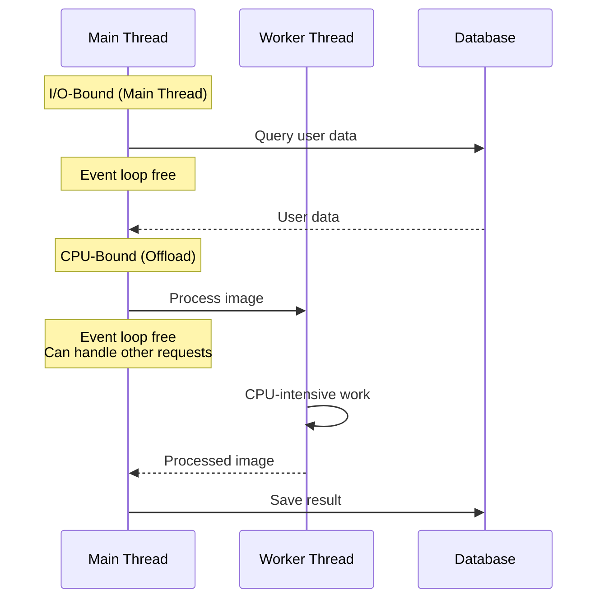

# CPU-bound vs I/O-bound tasks

## 1. Why this exists (Real-world problem first)

Your image processing API handles 10 requests/second smoothly. You add a new feature: generate thumbnails on upload. Suddenly, throughput drops to 2 requests/second. All requests are slow, not just thumbnail generation. The problem? Thumbnail generation (CPU-bound) blocks the event loop, preventing I/O-bound requests from being processed.

**Real production failures from misclassifying tasks:**

1. **The Thumbnail Disaster**: An image hosting service generates thumbnails synchronously on upload. Each thumbnail takes 200ms of CPU time. During peak hours (50 uploads/sec), the event loop is blocked 100% of the time. All API endpoints timeout, including simple GET requests.

2. **The JSON Parser**: A data ingestion service parses large JSON payloads (10MB+). Parsing is CPU-intensive and synchronous. While parsing, no other requests are processed. Health checks fail. Kubernetes kills pods.

3. **The Encryption Bottleneck**: A file storage API encrypts files before saving. Uses synchronous `crypto.pbkdf2Sync()`. Each encryption takes 100ms. At 20 concurrent uploads, the event loop is blocked for 2 seconds straight.

**What breaks without this knowledge:**
- You can't identify why adding a feature kills performance
- You don't know when to use worker threads
- You block the event loop with CPU work
- You fail to optimize mixed workloads

## 2. Mental model (build imagination)

Think of Node.js as a **Single Chef in a Restaurant Kitchen**.

### The Kitchen Analogy

**I/O-Bound Tasks (Waiting for Others)**:
- Chef orders ingredients from supplier (database query)
- Chef puts dish in oven, sets timer (file write)
- Chef sends order to delivery service (HTTP request)
- **Key**: Chef can do other things while waiting

**CPU-Bound Tasks (Chef Must Work)**:
- Chef chops 100 onions (image processing)
- Chef kneads dough for 10 minutes (encryption)
- Chef decorates a cake (JSON parsing)
- **Key**: Chef can't do anything else while working

**The Problem**:
If chef spends all time chopping onions:
- Orders pile up
- Customers wait
- Deliveries aren't sent
- Restaurant appears "frozen"

**The Solution**:
- Hire prep cooks (worker threads) for chopping
- Chef coordinates, doesn't chop
- Kitchen stays responsive

**Why this matters:**
- CPU work blocks everything
- I/O work doesn't block (event loop handles it)
- Understanding the difference prevents performance disasters

## 3. How Node.js implements this internally

Node.js is optimized for I/O-bound tasks. CPU-bound tasks require special handling.

### I/O-Bound Task Flow

```javascript
// I/O-bound: Database query
const user = await db.users.findById(userId);

// What happens:
// 1. Query sent to database (non-blocking)
// 2. Event loop continues processing other requests
// 3. Database responds
// 4. Callback queued on event loop
// 5. Callback executes when event loop reaches it
```

**Characteristics**:
- Waiting time >> CPU time
- Event loop stays free while waiting
- High concurrency possible (thousands of concurrent I/O operations)

### CPU-Bound Task Flow

```javascript
// CPU-bound: Image processing
const thumbnail = generateThumbnail(image); // Synchronous!

// What happens:
// 1. CPU executes image processing code
// 2. Event loop is BLOCKED
// 3. No other code runs
// 4. After completion, event loop continues
```

**Characteristics**:
- CPU time >> waiting time
- Event loop blocked during execution
- Zero concurrency (one task at a time)

### Task Classification

**I/O-Bound**:
- Database queries
- File reads/writes
- HTTP requests
- Network operations
- **Pattern**: Lots of waiting, little CPU

**CPU-Bound**:
- Image/video processing
- Encryption/hashing
- Data compression
- JSON parsing (large payloads)
- Complex calculations
- **Pattern**: Lots of CPU, little waiting

### Common Misunderstandings

**Mistake 1**: "Async makes everything non-blocking"
- **Reality**: Async I/O is non-blocking, async CPU work still blocks
- **Impact**: Using async crypto doesn't prevent blocking

**Mistake 2**: "Worker threads are always better"
- **Reality**: Worker threads have overhead, only worth it for CPU work
- **Impact**: Using workers for I/O adds unnecessary complexity

**Mistake 3**: "All file operations are I/O-bound"
- **Reality**: Reading is I/O-bound, parsing content might be CPU-bound
- **Impact**: Misclassifying file processing tasks

## 4. Multiple diagrams (MANDATORY)

### Diagram 1: I/O-Bound vs CPU-Bound


### Diagram 2: Throughput Comparison

```mermaid
gantt
    title Throughput: I/O-Bound vs CPU-Bound
    dateFormat X
    axisFormat %L ms
    
    section I/O-Bound (Parallel)
    Request 1 :0, 100
    Request 2 :0, 100
    Request 3 :0, 100
    Request 4 :0, 100
    
    section CPU-Bound (Sequential)
    Request 1 :0, 100
    Request 2 :100, 200
    Request 3 :200, 300
    Request 4 :300, 400
```



### Diagram 3: Worker Thread Solution



## 5. Where this is used in real projects

### Image Processing Service

**Scenario**: Upload and thumbnail generation

```javascript
const { Worker } = require('worker_threads');

// WRONG: CPU-bound on main thread
app.post('/upload', async (req, res) => {
  const image = req.file;
  
  // Blocks event loop for 200ms!
  const thumbnail = generateThumbnailSync(image);
  
  await db.images.save({ image, thumbnail });
  res.json({ success: true });
});

// RIGHT: Offload to worker thread
const workerPool = createWorkerPool('./thumbnail-worker.js', 4);

app.post('/upload', async (req, res) => {
  const image = req.file;
  
  // Non-blocking, runs in worker
  const thumbnail = await workerPool.exec('generateThumbnail', [image]);
  
  await db.images.save({ image, thumbnail });
  res.json({ success: true });
});
```

### Data Processing Pipeline

**Scenario**: ETL pipeline

```javascript
// Classify tasks
async function processData(data) {
  // I/O-bound: Fetch from database
  const rawData = await db.fetchRawData(data.id);
  
  // CPU-bound: Transform data
  const transformed = await workerPool.exec('transform', [rawData]);
  
  // I/O-bound: Save to database
  await db.saveProcessedData(transformed);
  
  // I/O-bound: Send notification
  await notificationService.send(data.userId, 'Processing complete');
}
```

### API with Mixed Workload

**Scenario**: Some endpoints are I/O-bound, some CPU-bound

```javascript
// I/O-bound: Simple CRUD
app.get('/users/:id', async (req, res) => {
  const user = await db.users.findById(req.params.id);
  res.json(user);
});

// CPU-bound: Report generation
app.get('/reports/:id', async (req, res) => {
  const data = await db.reports.getData(req.params.id);
  
  // Offload CPU work to worker
  const report = await workerPool.exec('generateReport', [data]);
  
  res.json(report);
});
```

### Password Hashing

**Scenario**: Authentication

```javascript
const crypto = require('crypto');
const { promisify } = require('util');

const pbkdf2 = promisify(crypto.pbkdf2);

// WRONG: Synchronous (blocks event loop)
app.post('/login', (req, res) => {
  const hash = crypto.pbkdf2Sync(
    req.body.password,
    salt,
    100000,
    64,
    'sha512'
  ); // Blocks for 100ms!
  
  // Check hash...
});

// RIGHT: Async (uses thread pool)
app.post('/login', async (req, res) => {
  const hash = await pbkdf2(
    req.body.password,
    salt,
    100000,
    64,
    'sha512'
  ); // Non-blocking, runs in thread pool
  
  // Check hash...
});
```

## 6. Where this should NOT be used

### Using Worker Threads for I/O

**Misuse**: Offloading I/O to workers

```javascript
// WRONG: Worker threads for I/O
const result = await workerPool.exec('fetchUser', [userId]);

// Worker code:
async function fetchUser(userId) {
  return await db.users.findById(userId); // I/O, no benefit from worker
}

// RIGHT: I/O on main thread
const user = await db.users.findById(userId);
```

**Why it's wrong**: I/O is already non-blocking. Worker threads add overhead without benefit.

### Blocking Main Thread with CPU Work

**Misuse**: CPU-intensive work on main thread

```javascript
// WRONG: JSON parsing on main thread
app.post('/data', (req, res) => {
  const data = JSON.parse(req.body); // If body is 10MB, blocks for 50ms
  processData(data);
});

// RIGHT: Stream parsing or worker thread
app.post('/data', async (req, res) => {
  const data = await workerPool.exec('parseJSON', [req.body]);
  processData(data);
});
```

## 7. Failure modes & edge cases

### Failure Mode 1: Misclassified Task

**Scenario**: Treating CPU-bound as I/O-bound

```javascript
// Assumed I/O-bound, actually CPU-bound
app.get('/analyze', async (req, res) => {
  const data = await db.getData();
  
  // CPU-bound: Complex analysis
  const result = analyzeData(data); // Blocks for 500ms!
  
  res.json(result);
});

// Under load: All requests slow, event loop blocked
```

**Solution**: Profile and identify CPU-bound sections:
```javascript
app.get('/analyze', async (req, res) => {
  const data = await db.getData();
  
  // Offload to worker
  const result = await workerPool.exec('analyzeData', [data]);
  
  res.json(result);
});
```

### Failure Mode 2: Mixed Workload Contention

**Scenario**: CPU work starves I/O

```javascript
// CPU-bound requests block I/O-bound requests
app.post('/process-image', async (req, res) => {
  const result = processImageSync(req.file); // 200ms CPU
  res.json(result);
});

app.get('/health', (req, res) => {
  res.json({ status: 'ok' }); // Simple I/O, but waits for CPU
});

// Health checks timeout during image processing
```

**Solution**: Separate CPU work:
```javascript
app.post('/process-image', async (req, res) => {
  const result = await workerPool.exec('processImage', [req.file]);
  res.json(result);
});
```

### Edge Case: Small CPU Tasks

**Scenario**: Tiny CPU work not worth worker overhead

```javascript
// NOT worth worker thread
function hashSmallString(str) {
  return crypto.createHash('sha256').update(str).digest('hex');
  // Takes <1ms, worker overhead is ~2ms
}

// Worth worker thread
function hashLargeFile(buffer) {
  return crypto.createHash('sha256').update(buffer).digest('hex');
  // Takes 50ms, worker overhead is worth it
}
```

## 8. Trade-offs & alternatives

### Main Thread (I/O-Bound)

**Gain**: Simple, no overhead, high concurrency
**Sacrifice**: Blocked by CPU work
**When to use**: Database queries, HTTP requests, file I/O

### Worker Threads (CPU-Bound)

**Gain**: Non-blocking CPU work, parallel execution
**Sacrifice**: Overhead (~2ms per task), complexity
**When to use**: Image processing, encryption, heavy computation

### Child Processes

**Gain**: Complete isolation, can run different Node versions
**Sacrifice**: High overhead, IPC complexity
**When to use**: Running external programs, complete isolation needed

## 9. Interview-level articulation

**Q: "What's the difference between I/O-bound and CPU-bound tasks?"**

**A**: "I/O-bound tasks spend most time waiting for external resources like databases or file systems. They're non-blocking in Node.js because the event loop can process other requests while waiting. CPU-bound tasks spend most time doing computation—image processing, encryption, parsing. They block the event loop because JavaScript is single-threaded. The key is identifying which type of task you have and handling it appropriately: I/O on the main thread, CPU in worker threads."

**Q: "When would you use worker threads?"**

**A**: "I use worker threads for CPU-intensive operations that would block the event loop for more than ~10ms. Examples include image processing, video encoding, large JSON parsing, or complex calculations. I don't use them for I/O operations because those are already non-blocking. The rule of thumb: if it's waiting for something external, use main thread. If it's doing heavy computation, use a worker."

## 10. Key takeaways (engineer mindset)

1. **I/O-bound = non-blocking**, CPU-bound = blocking
2. **Profile to identify** CPU-bound sections
3. **Use worker threads** for CPU work >10ms
4. **Don't use workers** for I/O operations
5. **Monitor event loop lag** to detect CPU blocking

### The Golden Rule

**If it waits, main thread. If it computes, worker thread.** Profile your code to identify CPU-bound sections and offload them to prevent blocking the event loop.
