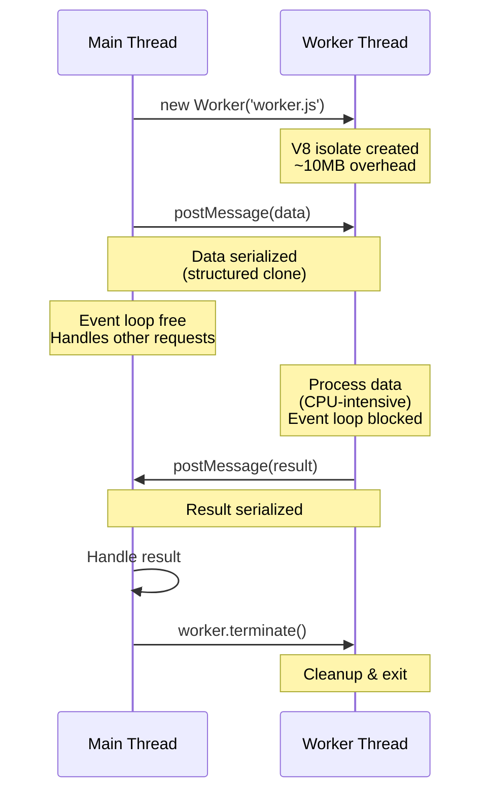
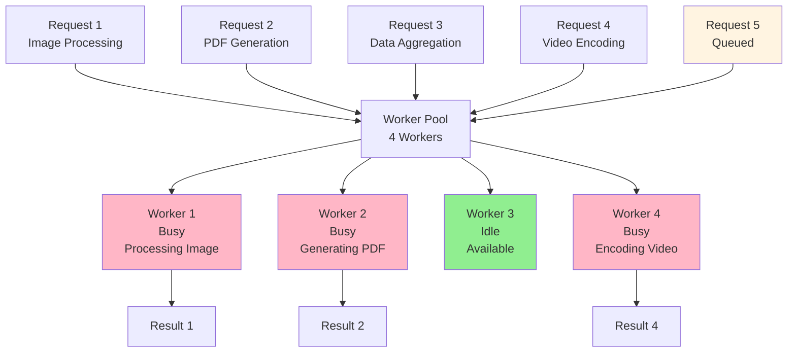
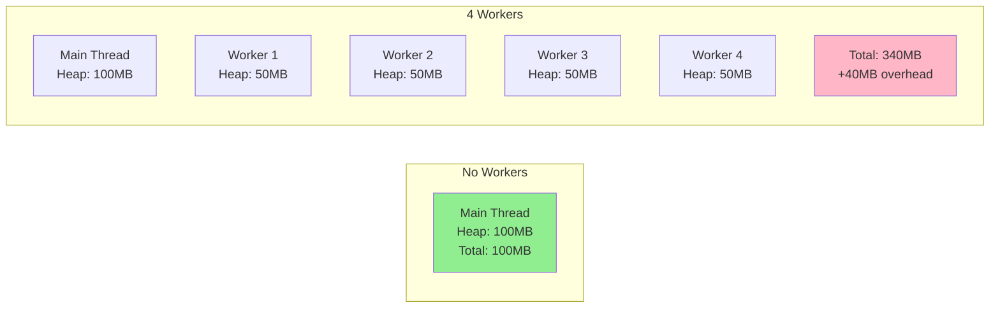

# Worker Threads

## 1. Why this exists (Real-world problem first)

Your video transcoding service crashes under load. Each video takes 30 seconds to process. During processing, the entire API is unresponsive. Health checks fail. The problem? Video processing runs on the main thread, blocking the event loop for 30 seconds per video.

**Real production failures from worker thread ignorance:**

1. **The Video Processor Disaster**: A media service transcodes videos on upload using FFmpeg bindings that block the main thread. One 4K video upload freezes the entire service for 2 minutes. All other requests timeout. Health checks fail. Kubernetes kills the pod. Users see 502 errors. After 5 failed uploads, service is in crash loop.

2. **The Data Aggregator Crash**: An analytics service processes millions of records for daily reports. Aggregation is CPU-intensive—calculating percentiles, grouping, sorting. Runs on main thread. Event loop blocked for 10 seconds. During this time, health checks timeout. Kubernetes kills pod mid-processing. Report generation fails. Manual restart required.

3. **The PDF Generator Timeout**: A reporting service generates complex PDFs from HTML templates. Each PDF takes 5 seconds of CPU time (rendering, layout calculation). During generation, no other requests are processed. Users see random timeouts. Support tickets flood in. Team doesn't understand why "sometimes it works, sometimes it doesn't."

4. **The Image Processing Memory Leak**: A photo service processes uploaded images on the main thread. Creates new worker per request but never terminates them. After 1000 uploads, 1000 workers exist. Memory at 8GB. OOM crash. Service down for 2 hours.

**What breaks without this knowledge:**
- Can't handle CPU-intensive work without blocking event loop
- Don't know when to use workers vs main thread vs child processes
- Fail to manage worker lifecycle (memory leaks)
- Can't debug worker communication issues
- Don't understand serialization overhead
- Can't implement proper worker pools

## 2. Mental model (build imagination)

Think of worker threads as **Hiring Specialized Staff** for your restaurant.

### The Restaurant Analogy

**Main Thread (Head Chef)**:
- Takes orders from customers (HTTP requests)
- Coordinates the kitchen (event loop)
- Delegates heavy prep work to specialists
- Never does time-consuming tasks personally
- Always available to take new orders

**Worker Threads (Prep Cooks)**:
- Handle time-consuming prep work
- Work independently in separate stations
- Can't interact with customers directly
- Report back to head chef when done
- Each has their own tools and workspace

**The Flow:**
1. Customer orders a dish requiring 20 minutes of prep (image processing)
2. Head chef delegates to prep cook (create worker)
3. Head chef continues taking new orders (event loop free)
4. Prep cook works independently (CPU work in worker)
5. Prep cook finishes, notifies head chef (postMessage)
6. Head chef serves the dish (return result to client)

**Worker Pool (Team of Prep Cooks)**:
- Instead of hiring/firing for each task, keep a team of 4 prep cooks
- Assign tasks to available cooks
- Queue tasks if all cooks are busy
- Much more efficient than hiring/firing constantly

**Why this matters:**
- Main thread (head chef) stays responsive
- CPU work happens in parallel (multiple prep cooks)
- Workers are isolated (one cook's mistake doesn't affect others)
- Worker pools prevent overhead (don't hire/fire constantly)

## 3. How Node.js implements this internally

Worker threads are **real OS threads** running **separate V8 instances**.

### Worker Thread Architecture

```javascript
const { Worker } = require('worker_threads');

// Main thread creates worker
const worker = new Worker('./worker.js', {
  workerData: { task: 'process-image', config: {...} }
});

// Communication via message passing
worker.postMessage({ image: buffer });

worker.on('message', (result) => {
  console.log('Worker finished:', result);
});

worker.on('error', (err) => {
  console.error('Worker error:', err);
});

worker.on('exit', (code) => {
  console.log(`Worker exited with code ${code}`);
});
```

**What happens internally:**
1. **New OS thread created** via libuv
2. **New V8 isolate initialized** (~10MB overhead)
3. **Worker script loaded and executed** in new isolate
4. **Separate event loop** runs in worker
5. **Communication via message passing** (data serialized/deserialized)
6. **Worker can be terminated** or exit on its own

### Memory Model

```
Main Process
├─ Main Thread
│  ├─ V8 Heap (1.4GB default)
│  ├─ Event Loop
│  └─ libuv Thread Pool (4 threads)
│
├─ Worker Thread 1
│  ├─ V8 Heap (separate, ~1.4GB)
│  ├─ Event Loop (separate)
│  └─ libuv Thread Pool (separate, 4 threads)
│
├─ Worker Thread 2
│  ├─ V8 Heap (separate)
│  ├─ Event Loop (separate)
│  └─ libuv Thread Pool (separate)
│
└─ Worker Thread 3
   ├─ V8 Heap (separate)
   ├─ Event Loop (separate)
   └─ libuv Thread Pool (separate)

Total Memory: Base + (N workers × ~10MB overhead)
```

**Key characteristics:**
- **Separate memory**: Each worker has its own heap
- **No shared state**: Except SharedArrayBuffer/MessageChannel
- **Message passing**: Data is cloned (structured clone algorithm)
- **Serialization cost**: Large objects are expensive to transfer
- **Each worker is isolated**: Crash in worker doesn't affect main thread

### Communication Mechanisms

**1. postMessage (Most Common)**:
```javascript
// Main thread
worker.postMessage({ type: 'process', data: largeArray });

// Worker thread
const { parentPort } = require('worker_threads');
parentPort.on('message', (msg) => {
  const result = processData(msg.data);
  parentPort.postMessage({ type: 'result', data: result });
});
```

**2. SharedArrayBuffer (Zero-Copy)**:
```javascript
// Main thread
const sharedBuffer = new SharedArrayBuffer(1024 * 1024); // 1MB
const sharedArray = new Int32Array(sharedBuffer);
worker.postMessage({ buffer: sharedBuffer });

// Worker thread
parentPort.on('message', ({ buffer }) => {
  const array = new Int32Array(buffer);
  // Modify in place, no copy!
  for (let i = 0; i < array.length; i++) {
    array[i] = array[i] * 2;
  }
});
```

**3. MessageChannel (Bidirectional)**:
```javascript
const { MessageChannel } = require('worker_threads');
const { port1, port2 } = new MessageChannel();

worker.postMessage({ port: port2 }, [port2]);

port1.on('message', (msg) => {
  console.log('Received from worker:', msg);
});
```

### Common Misunderstandings

**Mistake 1**: "Workers share memory with main thread"
- **Reality**: Each worker has separate heap
- **Impact**: Can't directly access main thread variables

**Mistake 2**: "Workers are lightweight like async functions"
- **Reality**: Each worker is ~10MB overhead + separate V8 instance
- **Impact**: Creating 1000 workers uses 10GB+ memory

**Mistake 3**: "postMessage is free"
- **Reality**: Data is serialized/deserialized (structured clone)
- **Impact**: Sending 100MB object is expensive

## 4. Multiple diagrams (MANDATORY)

### Diagram 1: Worker Thread Communication



### Diagram 2: Worker Pool Pattern



### Diagram 3: Main Thread vs Worker Thread Performance

```mermaid
gantt
    title Request Processing: Main Thread vs Worker Threads
    dateFormat X
    axisFormat %L ms
    
    section Main Thread (Blocked)
    Request 1 (CPU 500ms) :0, 500
    Request 2 waits :500, 1000
    Request 2 (CPU 500ms) :1000, 1500
    Request 3 waits :1500, 2000
    
    section With Workers (Non-Blocking)
    Request 1 → Worker :0, 10
    Request 2 → Worker :10, 20
    Request 3 → Worker :20, 30
    Worker 1 processing :10, 510
    Worker 2 processing :20, 520
    Worker 3 processing :30, 530
```



### Diagram 4: Memory Overhead



## 5. Where this is used in real projects

### Production Worker Pool Implementation

```javascript
const { Worker } = require('worker_threads');
const os = require('os');

class WorkerPool {
  constructor(workerScript, poolSize = os.cpus().length) {
    this.workerScript = workerScript;
    this.poolSize = poolSize;
    this.workers = [];
    this.queue = [];
    this.activeWorkers = 0;
    
    // Create worker pool
    for (let i = 0; i < poolSize; i++) {
      this.createWorker();
    }
  }
  
  createWorker() {
    const worker = new Worker(this.workerScript);
    
    const workerObj = {
      worker,
      busy: false,
      currentTask: null
    };
    
    worker.on('message', (result) => {
      this.handleResult(workerObj, result);
    });
    
    worker.on('error', (err) => {
      console.error('Worker error:', err);
      if (workerObj.currentTask) {
        workerObj.currentTask.reject(err);
      }
      // Replace failed worker
      this.workers = this.workers.filter(w => w !== workerObj);
      this.createWorker();
    });
    
    worker.on('exit', (code) => {
      if (code !== 0) {
        console.error(`Worker exited with code ${code}`);
      }
    });
    
    this.workers.push(workerObj);
  }
  
  exec(data, timeout = 30000) {
    return new Promise((resolve, reject) => {
      const task = { data, resolve, reject, timeout };
      
      // Find available worker
      const availableWorker = this.workers.find(w => !w.busy);
      
      if (availableWorker) {
        this.runTask(availableWorker, task);
      } else {
        // Queue task
        this.queue.push(task);
      }
    });
  }
  
  runTask(workerObj, task) {
    workerObj.busy = true;
    workerObj.currentTask = task;
    this.activeWorkers++;
    
    // Set timeout
    const timeoutId = setTimeout(() => {
      console.error('Worker task timeout');
      task.reject(new Error('Worker task timeout'));
      workerObj.worker.terminate();
      this.workers = this.workers.filter(w => w !== workerObj);
      this.createWorker();
    }, task.timeout);
    
    task.timeoutId = timeoutId;
    
    workerObj.worker.postMessage(task.data);
  }
  
  handleResult(workerObj, result) {
    if (!workerObj.currentTask) return;
    
    clearTimeout(workerObj.currentTask.timeoutId);
    workerObj.currentTask.resolve(result);
    workerObj.busy = false;
    workerObj.currentTask = null;
    this.activeWorkers--;
    
    // Process queued task
    if (this.queue.length > 0) {
      const nextTask = this.queue.shift();
      this.runTask(workerObj, nextTask);
    }
  }
  
  async terminate() {
    await Promise.all(this.workers.map(w => w.worker.terminate()));
    this.workers = [];
  }
  
  getStats() {
    return {
      poolSize: this.poolSize,
      activeWorkers: this.activeWorkers,
      queuedTasks: this.queue.length,
      availableWorkers: this.workers.filter(w => !w.busy).length
    };
  }
}

// Usage
const imagePool = new WorkerPool('./workers/image-worker.js', 4);

app.post('/process-image', async (req, res) => {
  try {
    const result = await imagePool.exec({
      type: 'resize',
      buffer: req.file.buffer,
      width: 800,
      height: 600
    });
    
    res.json({ success: true, result });
  } catch (err) {
    res.status(500).json({ error: err.message });
  }
});

// Monitoring
setInterval(() => {
  console.log('Worker pool stats:', imagePool.getStats());
}, 10000);
```

### Image Processing Worker

```javascript
// workers/image-worker.js
const { parentPort } = require('worker_threads');
const sharp = require('sharp');

parentPort.on('message', async (task) => {
  try {
    const { type, buffer, width, height } = task;
    
    let result;
    
    switch (type) {
      case 'resize':
        result = await sharp(buffer)
          .resize(width, height, { fit: 'cover' })
          .toBuffer();
        break;
        
      case 'thumbnail':
        result = await sharp(buffer)
          .resize(200, 200)
          .jpeg({ quality: 80 })
          .toBuffer();
        break;
        
      case 'optimize':
        result = await sharp(buffer)
          .jpeg({ quality: 85, progressive: true })
          .toBuffer();
        break;
        
      default:
        throw new Error(`Unknown task type: ${type}`);
    }
    
    parentPort.postMessage({
      success: true,
      buffer: result,
      size: result.length
    });
  } catch (err) {
    parentPort.postMessage({
      success: false,
      error: err.message
    });
  }
});
```

### Data Processing with Parallel Workers

```javascript
async function processLargeDataset(data) {
  const numWorkers = os.cpus().length;
  const chunkSize = Math.ceil(data.length / numWorkers);
  
  const workers = [];
  
  for (let i = 0; i < numWorkers; i++) {
    const chunk = data.slice(i * chunkSize, (i + 1) * chunkSize);
    
    const promise = new Promise((resolve, reject) => {
      const worker = new Worker('./data-worker.js', {
        workerData: { chunk, workerId: i }
      });
      
      worker.on('message', (result) => {
        worker.terminate();
        resolve(result);
      });
      
      worker.on('error', (err) => {
        worker.terminate();
        reject(err);
      });
    });
    
    workers.push(promise);
  }
  
  const results = await Promise.all(workers);
  return results.flat();
}

// data-worker.js
const { workerData, parentPort } = require('worker_threads');

const { chunk, workerId } = workerData;

// Process chunk
const result = chunk.map(item => ({
  ...item,
  processed: true,
  workerId,
  timestamp: Date.now()
}));

parentPort.postMessage(result);
```

### SharedArrayBuffer for Zero-Copy

```javascript
// Main thread
const sharedBuffer = new SharedArrayBuffer(1024 * 1024); // 1MB
const sharedArray = new Float64Array(sharedBuffer);

// Fill with data
for (let i = 0; i < sharedArray.length; i++) {
  sharedArray[i] = Math.random();
}

const worker = new Worker('./compute-worker.js');
worker.postMessage({ buffer: sharedBuffer });

worker.on('message', () => {
  // Worker modified sharedArray in place
  console.log('First value:', sharedArray[0]);
});

// compute-worker.js
const { parentPort } = require('worker_threads');

parentPort.on('message', ({ buffer }) => {
  const array = new Float64Array(buffer);
  
  // Modify in place (zero-copy!)
  for (let i = 0; i < array.length; i++) {
    array[i] = array[i] * 2;
  }
  
  parentPort.postMessage({ done: true });
});
```

## 6. Where this should NOT be used

### I/O Operations

```javascript
// WRONG: Worker for database query
const worker = new Worker(`
  const { parentPort, workerData } = require('worker_threads');
  const db = require('./db');
  
  db.users.findById(workerData.userId).then(user => {
    parentPort.postMessage(user);
  });
`);

// RIGHT: I/O on main thread (already non-blocking)
const user = await db.users.findById(userId);
```

**Why it's wrong**: I/O is already non-blocking on main thread. Worker adds overhead without benefit.

### Small CPU Tasks

```javascript
// WRONG: Worker overhead > task time
const result = await workerPool.exec({
  operation: 'add',
  a: 1,
  b: 2
});

// RIGHT: Simple operations on main thread
const result = 1 + 2;
```

**Rule of thumb**: Only use workers for CPU tasks >10ms

### Creating Workers Per Request

```javascript
// WRONG: New worker per request
app.post('/process', async (req, res) => {
  const worker = new Worker('./worker.js');
  worker.postMessage(req.body);
  // Worker never terminated! Memory leak!
});

// RIGHT: Use worker pool
const pool = new WorkerPool('./worker.js', 4);
app.post('/process', async (req, res) => {
  const result = await pool.exec(req.body);
  res.json(result);
});
```

## 7. Failure modes & edge cases

### Failure Mode 1: Memory Leak from Unreleased Workers

**Scenario**: Creating workers without terminating

```javascript
// DISASTER: Memory leak
app.post('/process-image', async (req, res) => {
  const worker = new Worker('./image-worker.js');
  worker.postMessage(req.file.buffer);
  
  worker.on('message', (result) => {
    res.json(result);
    // Worker NOT terminated!
  });
});

// After 1000 requests: 1000 workers, 10GB+ memory
```

**Solution**: Always terminate or use worker pool

### Failure Mode 2: Serialization Overhead

**Scenario**: Sending large objects

```javascript
// SLOW: 100MB object serialized
const hugeObject = { data: new Array(10000000) };
const result = await workerPool.exec(hugeObject);
// Serialization takes 500ms!

// FAST: Use SharedArrayBuffer
const sharedBuffer = new SharedArrayBuffer(100 * 1024 * 1024);
const result = await workerPool.exec({ buffer: sharedBuffer });
// Zero-copy!
```

### Failure Mode 3: Worker Timeout

**Scenario**: Worker hangs indefinitely

```javascript
// WRONG: No timeout
const result = await workerPool.exec(data);
// Might wait forever!

// RIGHT: Timeout
const result = await Promise.race([
  workerPool.exec(data),
  new Promise((_, reject) => 
    setTimeout(() => reject(new Error('Timeout')), 30000)
  )
]);
```

## 8. Trade-offs & alternatives

### Worker Threads

**Gain**: Non-blocking CPU work, true parallelism
**Sacrifice**: Memory overhead (~10MB per worker), serialization cost
**When**: CPU-intensive tasks >10ms

### Child Processes

**Gain**: Complete isolation, can run different Node versions
**Sacrifice**: Higher overhead, slower IPC
**When**: Running external programs, complete isolation needed

### Cluster Module

**Gain**: Utilize all CPU cores for I/O workload
**Sacrifice**: No shared memory, load balancing complexity
**When**: Scaling I/O-bound applications

## 9. Interview-level articulation

**Q: "When would you use worker threads?"**

**A**: "I use worker threads for CPU-intensive operations that would block the event loop for more than ~10ms. Examples include image processing, video encoding, data aggregation, or complex calculations. I create a worker pool to reuse threads and avoid the overhead of creating new workers per request. Each worker has its own V8 isolate and event loop, so CPU work in a worker doesn't block the main thread. I don't use workers for I/O operations because those are already non-blocking on the main thread."

**Q: "What's the difference between worker threads and child processes?"**

**A**: "Worker threads are lighter weight—they share the same process but have separate V8 isolates. They're good for CPU-bound JavaScript tasks. Child processes are completely separate processes with their own memory space. They're heavier but provide complete isolation and can run external programs. For CPU-bound JavaScript, I use worker threads. For running external programs or needing complete isolation, I use child processes."

**Q: "How do you handle worker pool sizing?"**

**A**: "I typically size the worker pool based on CPU cores—`os.cpus().length` for CPU-bound tasks. For mixed workloads, I might use fewer workers to leave cores for the main thread. I monitor worker pool stats (active workers, queue length) and adjust based on metrics. If the queue is consistently long, I increase pool size. If workers are mostly idle, I decrease it. The key is balancing parallelism with memory overhead."

## 10. Key takeaways (engineer mindset)

### What to Remember

1. **Workers for CPU work >10ms** only
2. **Use worker pools** to reuse threads
3. **Each worker is ~10MB overhead**
4. **postMessage serializes data** (expensive for large objects)
5. **SharedArrayBuffer for zero-copy** transfer
6. **Always terminate workers** or use pools
7. **Don't use for I/O** operations

### What Decisions This Enables

**Performance decisions**:
- Offload CPU work to workers
- Size pool based on CPU cores
- Use SharedArrayBuffer for large data

**Architecture decisions**:
- Worker pool for image processing
- Parallel data processing
- Non-blocking report generation

**Debugging decisions**:
- Monitor worker pool stats
- Set timeouts on worker tasks
- Handle worker errors gracefully

### How It Connects to Other Node.js Concepts

**CPU-bound vs I/O-bound** (Topic 13):
- Workers solve CPU-bound blocking
- I/O-bound stays on main thread

**Child Processes** (Topic 15):
- Workers are lighter than child processes
- Use workers for JavaScript, child processes for external programs

**Event Loop** (Topic 2):
- Each worker has separate event loop
- Main thread event loop stays free

### The Golden Rule

**Use worker threads for CPU-bound tasks, worker pools for reusability, and always terminate workers when done**. Don't use workers for I/O operations. Monitor pool stats and size appropriately.
