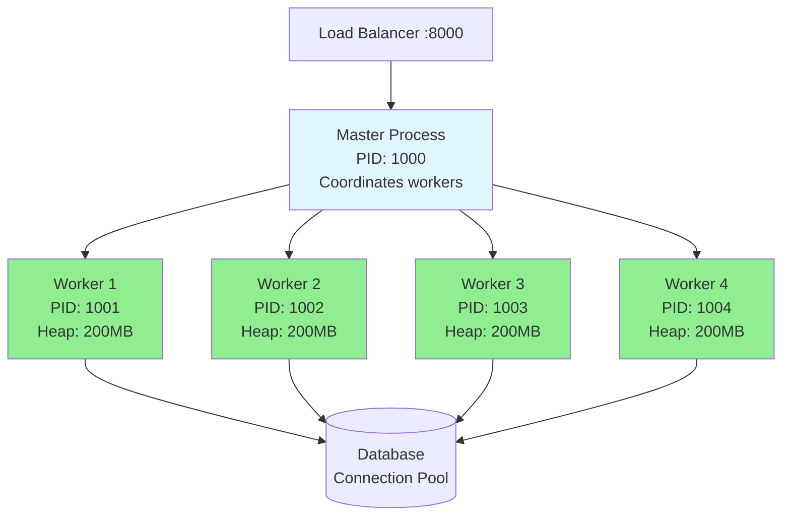
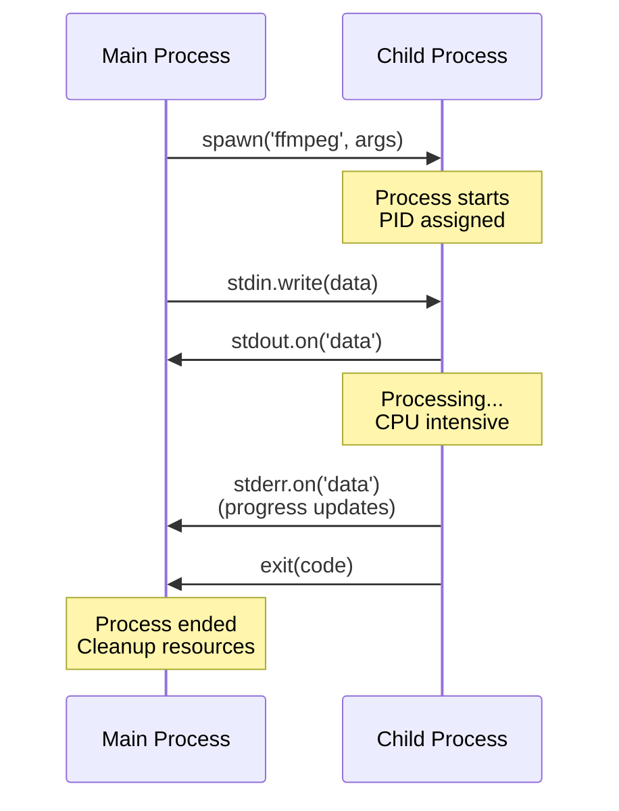
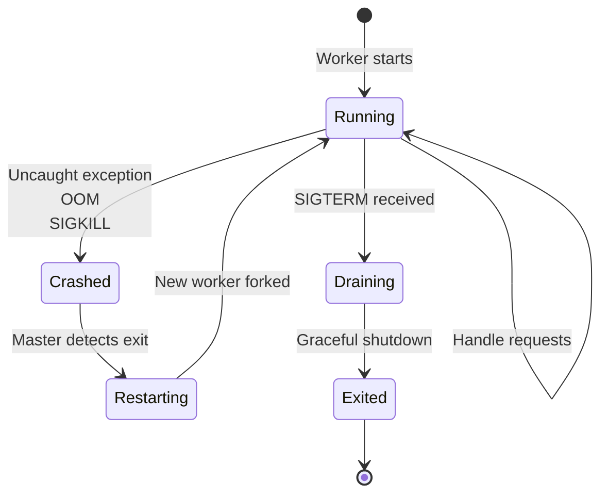

# Child Processes & Cluster Module

## 1. Why this exists (Real-world problem first)

Your Node.js API runs on a 16-core server but only uses 1 core. CPU sits at 6% while requests queue up. The problem? Node.js is single-threaded. Without clustering, you're wasting 15 cores.

**Real production failures from clustering ignorance:**

1. **The Underutilized Server Disaster**: An e-commerce API runs on 32-core AWS instances during Black Friday. Single Node process uses 1 core at 100%, other 31 cores idle at 0%. Servers show 3% total CPU utilization but requests timeout. Load balancer marks instances unhealthy. Auto-scaling adds more servers. Now 100 servers, each using 1 core. $500K in lost sales. Post-mortem reveals: "We didn't know Node.js doesn't use multiple cores automatically."

2. **The Zombie Process Apocalypse**: A service uses `child_process.spawn()` to run Python scripts for data processing. Creates child process per request. Doesn't clean up. After 24 hours: 10,000 zombie processes. `ps aux | grep python | wc -l` returns 10,000. Server can't fork new processes. "Cannot allocate memory" errors. Manual server restart required.

3. **The Cluster Crash Loop**: A clustered API has a memory leak in session handling. One worker hits heap limit, crashes. Master restarts it. New worker loads, processes requests, leaks memory, crashes in 5 minutes. Restart loop begins. Eventually all workers crash simultaneously during traffic spike. Total outage. Team doesn't understand why "restarting makes it worse."

4. **The Shared State Nightmare**: Team clusters their API. Uses in-memory counter for rate limiting. Each worker has separate counter. User makes 100 requests/sec. Gets distributed across 8 workers (12-13 req/worker). Rate limit is 50 req/sec per worker. User never gets rate limited. API overwhelmed.

**What breaks without this knowledge:**
- Can't utilize multiple CPU cores in production
- Don't know when to use child processes vs worker threads vs cluster
- Fail to handle process crashes gracefully
- Can't debug inter-process communication
- Don't understand shared state limitations
- Can't implement proper process monitoring

## 2. Mental model (build imagination)

Think of clustering as **Opening Multiple Restaurant Locations**.

### The Restaurant Analogy

**Single Process (One Location)**:
- One chef, one kitchen
- Can only serve customers at one location
- If chef is busy, customers wait in line
- If location closes, all customers affected
- Limited by one chef's capacity

**Cluster (Multiple Locations - Franchise)**:
- Multiple chefs, multiple kitchens (workers)
- Franchise owner coordinates (master process)
- Load balancer directs customers to locations
- If one location is busy, send to another
- If one location closes, others continue
- Each location has separate inventory (memory)

**Child Processes (Hiring Contractors)**:
- Need specialized work (video encoding, PDF generation)
- Hire external contractor (external program)
- Contractor works independently
- Report back when done
- Don't need to know contractor's internal process

**The Flow:**
1. Customer calls franchise hotline (request arrives)
2. Hotline directs to nearest location (load balancing)
3. Location serves customer (worker handles request)
4. If location is full, redirect to another (worker busy)
5. If location closes, franchise owner opens new one (master restarts worker)

**Why this matters:**
- Cluster utilizes all CPU cores for I/O workload
- Child processes run external programs
- Worker threads handle CPU work within each worker
- Understanding the difference prevents architecture mistakes

## 3. How Node.js implements this internally

### Cluster Module Architecture

```javascript
const cluster = require('cluster');
const http = require('http');
const numCPUs = require('os').cpus().length;

if (cluster.isMaster) {
  console.log(`Master ${process.pid} is running`);
  
  // Fork workers (one per CPU core)
  for (let i = 0; i < numCPUs; i++) {
    cluster.fork();
  }
  
  cluster.on('exit', (worker, code, signal) => {
    console.log(`Worker ${worker.process.pid} died`);
    cluster.fork(); // Replace dead worker
  });
} else {
  // Workers share TCP connection
  http.createServer((req, res) => {
    res.writeHead(200);
    res.end('Hello World\n');
  }).listen(8000);
  
  console.log(`Worker ${process.pid} started`);
}
```

**What happens internally:**
1. **Master process** forks N worker processes using `child_process.fork()`
2. **Workers share the same port** (8000) via SO_REUSEPORT socket option
3. **OS handles load balancing** (round-robin on most platforms)
4. **Each worker has separate memory** (no shared heap)
5. **IPC channel** established between master and workers
6. **If worker crashes**, master detects via 'exit' event and restarts

### Child Process Types

```javascript
const { spawn, exec, execFile, fork } = require('child_process');

// 1. spawn: Stream-based, for long-running processes
const ffmpeg = spawn('ffmpeg', ['-i', 'input.mp4', 'output.mp4']);
ffmpeg.stdout.on('data', (data) => console.log(data.toString()));
ffmpeg.stderr.on('data', (data) => console.error(data.toString()));

// 2. exec: Buffer-based, for short commands
exec('ls -la', (error, stdout, stderr) => {
  console.log(stdout); // Entire output buffered
});

// 3. execFile: Like exec but doesn't spawn shell (more secure)
execFile('node', ['--version'], (error, stdout) => {
  console.log(stdout);
});

// 4. fork: Special case for Node.js scripts (has IPC)
const child = fork('./worker.js');
child.send({ task: 'process-data' });
child.on('message', (result) => {
  console.log(result);
});
```

**Key differences:**
- **spawn**: Streams, long-running, no shell
- **exec**: Buffers output, spawns shell, command injection risk
- **execFile**: Like exec but no shell (safer)
- **fork**: Node.js only, has IPC channel

### Common Misunderstandings

**Mistake 1**: "Cluster automatically makes my app faster"
- **Reality**: Only helps I/O-bound workloads, not CPU-bound
- **Impact**: CPU-bound tasks still block each worker

**Mistake 2**: "Workers share memory"
- **Reality**: Each worker has separate heap
- **Impact**: Can't use in-memory cache across workers

**Mistake 3**: "Child processes are lightweight"
- **Reality**: Each process is ~30MB+ overhead
- **Impact**: Can't create thousands of child processes

## 4. Multiple diagrams (MANDATORY)

### Diagram 1: Cluster Architecture



### Diagram 2: Child Process Communication



### Diagram 3: Worker Crash & Recovery



### Diagram 4: Load Distribution

```mermaid
gantt
    title Request Distribution Across Workers
    dateFormat X
    axisFormat %L ms
    
    section Worker 1
    Request 1 :0, 100
    Request 5 :100, 200
    
    section Worker 2
    Request 2 :0, 150
    Request 6 :150, 250
    
    section Worker 3
    Request 3 :0, 120
    Request 7 :120, 220
    
    section Worker 4
    Request 4 :0, 180
    Request 8 :180, 280
```



## 5. Where this is used in real projects

### Production Cluster Setup with Monitoring

```javascript
const cluster = require('cluster');
const os = require('os');
const http = require('http');

if (cluster.isMaster) {
  const numWorkers = os.cpus().length;
  const workers = new Map();
  
  console.log(`Master ${process.pid} starting ${numWorkers} workers`);
  
  // Fork workers
  for (let i = 0; i < numWorkers; i++) {
    forkWorker();
  }
  
  function forkWorker() {
    const worker = cluster.fork();
    workers.set(worker.id, {
      worker,
      restarts: 0,
      startTime: Date.now()
    });
    
    worker.on('message', (msg) => {
      if (msg.cmd === 'notifyRequest') {
        console.log(`Worker ${worker.id} handled request`);
      }
    });
  }
  
  // Handle worker crashes
  cluster.on('exit', (worker, code, signal) => {
    const workerInfo = workers.get(worker.id);
    const uptime = Date.now() - workerInfo.startTime;
    
    console.error(`Worker ${worker.process.pid} died (${signal || code})`);
    console.error(`Uptime: ${uptime}ms, Restarts: ${workerInfo.restarts}`);
    
    // Prevent restart loop
    if (uptime < 5000 && workerInfo.restarts > 5) {
      console.error('Worker crashing too frequently, not restarting');
      return;
    }
    
    workers.delete(worker.id);
    forkWorker();
  });
  
  // Graceful shutdown
  process.on('SIGTERM', () => {
    console.log('Master received SIGTERM, shutting down workers');
    
    for (const [id, { worker }] of workers) {
      worker.send({ cmd: 'shutdown' });
      
      setTimeout(() => {
        worker.kill('SIGKILL');
      }, 30000);
    }
  });
  
  // Monitor worker health
  setInterval(() => {
    for (const [id, { worker }] of workers) {
      worker.send({ cmd: 'ping' });
    }
  }, 10000);
  
} else {
  // Worker process
  const app = require('./app');
  const server = app.listen(3000);
  
  // Handle shutdown
  process.on('message', (msg) => {
    if (msg.cmd === 'shutdown') {
      server.close(() => {
        process.exit(0);
      });
    }
    
    if (msg.cmd === 'ping') {
      process.send({ cmd: 'pong', memory: process.memoryUsage() });
    }
  });
  
  console.log(`Worker ${process.pid} started`);
}
```

### Video Processing with Child Process

```javascript
const { spawn } = require('child_process');
const fs = require('fs');

class VideoProcessor {
  constructor() {
    this.activeProcesses = new Map();
  }
  
  async transcodeVideo(inputPath, outputPath, options = {}) {
    const processId = `${Date.now()}-${Math.random()}`;
    
    return new Promise((resolve, reject) => {
      const args = [
        '-i', inputPath,
        '-codec:v', options.videoCodec || 'libx264',
        '-codec:a', options.audioCodec || 'aac',
        '-preset', options.preset || 'medium',
        '-crf', options.quality || '23',
        outputPath
      ];
      
      const ffmpeg = spawn('ffmpeg', args);
      
      this.activeProcesses.set(processId, ffmpeg);
      
      let stderr = '';
      
      ffmpeg.stderr.on('data', (data) => {
        stderr += data.toString();
        
        // Parse progress
        const match = stderr.match(/time=(\d+:\d+:\d+\.\d+)/);
        if (match) {
          console.log(`Progress: ${match[1]}`);
        }
      });
      
      ffmpeg.on('close', (code) => {
        this.activeProcesses.delete(processId);
        
        if (code === 0) {
          resolve({
            success: true,
            outputPath,
            size: fs.statSync(outputPath).size
          });
        } else {
          reject(new Error(`FFmpeg exited with code ${code}\n${stderr}`));
        }
      });
      
      ffmpeg.on('error', (err) => {
        this.activeProcesses.delete(processId);
        reject(err);
      });
      
      // Timeout after 10 minutes
      setTimeout(() => {
        if (this.activeProcesses.has(processId)) {
          ffmpeg.kill('SIGKILL');
          reject(new Error('Video processing timeout'));
        }
      }, 10 * 60 * 1000);
    });
  }
  
  killAll() {
    for (const [id, process] of this.activeProcesses) {
      process.kill('SIGKILL');
    }
    this.activeProcesses.clear();
  }
}

// Usage
const processor = new VideoProcessor();

app.post('/transcode', async (req, res) => {
  try {
    const result = await processor.transcodeVideo(
      req.body.inputPath,
      req.body.outputPath,
      { quality: '20', preset: 'fast' }
    );
    res.json(result);
  } catch (err) {
    res.status(500).json({ error: err.message });
  }
});

// Cleanup on shutdown
process.on('SIGTERM', () => {
  processor.killAll();
});
```

### Running External Scripts with fork()

```javascript
const { fork } = require('child_process');

class ScriptRunner {
  constructor(scriptPath, poolSize = 4) {
    this.scriptPath = scriptPath;
    this.pool = [];
    this.queue = [];
    
    for (let i = 0; i < poolSize; i++) {
      this.createWorker();
    }
  }
  
  createWorker() {
    const worker = fork(this.scriptPath);
    
    const workerObj = {
      worker,
      busy: false,
      currentTask: null
    };
    
    worker.on('message', (result) => {
      if (workerObj.currentTask) {
        workerObj.currentTask.resolve(result);
        workerObj.busy = false;
        workerObj.currentTask = null;
        
        this.processQueue();
      }
    });
    
    worker.on('error', (err) => {
      if (workerObj.currentTask) {
        workerObj.currentTask.reject(err);
      }
      
      // Replace failed worker
      this.pool = this.pool.filter(w => w !== workerObj);
      this.createWorker();
    });
    
    this.pool.push(workerObj);
  }
  
  async run(data, timeout = 60000) {
    return new Promise((resolve, reject) => {
      const task = { data, resolve, reject, timeout };
      
      const availableWorker = this.pool.find(w => !w.busy);
      
      if (availableWorker) {
        this.runTask(availableWorker, task);
      } else {
        this.queue.push(task);
      }
    });
  }
  
  runTask(workerObj, task) {
    workerObj.busy = true;
    workerObj.currentTask = task;
    
    const timeoutId = setTimeout(() => {
      task.reject(new Error('Task timeout'));
      workerObj.worker.kill();
      this.pool = this.pool.filter(w => w !== workerObj);
      this.createWorker();
    }, task.timeout);
    
    task.timeoutId = timeoutId;
    workerObj.worker.send(task.data);
  }
  
  processQueue() {
    if (this.queue.length === 0) return;
    
    const availableWorker = this.pool.find(w => !w.busy);
    if (availableWorker) {
      const task = this.queue.shift();
      this.runTask(availableWorker, task);
    }
  }
  
  async terminate() {
    for (const { worker } of this.pool) {
      worker.kill();
    }
    this.pool = [];
  }
}

// Usage
const runner = new ScriptRunner('./data-processor.js', 4);

app.post('/process-data', async (req, res) => {
  try {
    const result = await runner.run(req.body, 30000);
    res.json(result);
  } catch (err) {
    res.status(500).json({ error: err.message });
  }
});
```

## 6. Where this should NOT be used

### Using Cluster for CPU-Bound Tasks

```javascript
// WRONG: Cluster doesn't help CPU-bound tasks
// All workers still blocked by CPU work
if (cluster.isWorker) {
  app.post('/process-image', (req, res) => {
    const result = processImageSync(req.file); // Blocks worker for 2 seconds
    res.json(result);
  });
}
// With 4 workers, can only handle 2 req/sec total!

// RIGHT: Use worker threads within each cluster worker
const { WorkerPool } = require('./worker-pool');
const imagePool = new WorkerPool('./image-worker.js', 4);

app.post('/process-image', async (req, res) => {
  const result = await imagePool.exec(req.file);
  res.json(result);
});
// Now each cluster worker can handle multiple concurrent CPU tasks
```

### Child Process for Simple Tasks

```javascript
// WRONG: Child process overhead for simple task
const child = exec('echo "hello"', (err, stdout) => {
  console.log(stdout);
});
// Process creation overhead: ~30ms
// Task duration: <1ms

// RIGHT: Do it in Node.js
console.log('hello');
// Duration: <0.1ms
```

### Using exec() with User Input

```javascript
// WRONG: Command injection vulnerability
app.get('/files', (req, res) => {
  exec(`ls ${req.query.dir}`, (err, stdout) => {
    res.send(stdout);
  });
});
// User sends: ?dir=.; rm -rf /
// Executes: ls .; rm -rf /

// RIGHT: Use execFile or spawn with args array
const { execFile } = require('child_process');
app.get('/files', (req, res) => {
  execFile('ls', [req.query.dir], (err, stdout) => {
    res.send(stdout);
  });
});
```

## 7. Failure modes & edge cases

### Failure Mode 1: Zombie Processes

**Scenario**: Child processes not cleaned up

```javascript
// DISASTER: Creates zombie processes
app.post('/process', (req, res) => {
  const child = spawn('long-running-process');
  res.send('Started');
  // Child process never cleaned up!
});

// After 1000 requests: 1000 zombie processes
// ps aux | grep defunct
```

**Solution**: Always clean up child processes

```javascript
const activeProcesses = new Set();

app.post('/process', (req, res) => {
  const child = spawn('long-running-process');
  activeProcesses.add(child);
  
  child.on('exit', () => {
    activeProcesses.delete(child);
  });
  
  res.send('Started');
});

process.on('exit', () => {
  for (const child of activeProcesses) {
    child.kill();
  }
});
```

### Failure Mode 2: Shared State Issues

**Scenario**: In-memory state across workers

```javascript
// WRONG: Each worker has separate counter
let requestCount = 0;

app.get('/count', (req, res) => {
  requestCount++;
  res.json({ count: requestCount });
});

// Worker 1: count = 5
// Worker 2: count = 3
// Worker 3: count = 7
// Inconsistent!
```

**Solution**: Use Redis or database for shared state

```javascript
const Redis = require('ioredis');
const redis = new Redis();

app.get('/count', async (req, res) => {
  const count = await redis.incr('request_count');
  res.json({ count });
});
```

### Failure Mode 3: Worker Restart Loop

**Scenario**: Worker crashes immediately after start

```javascript
// Worker has startup error (e.g., can't connect to DB)
if (cluster.isWorker) {
  const db = require('./db');
  db.connect(); // Throws error
  // Worker crashes
  // Master restarts
  // New worker crashes
  // Infinite loop!
}
```

**Solution**: Detect rapid restarts

```javascript
if (cluster.isMaster) {
  const workerRestarts = new Map();
  
  cluster.on('exit', (worker) => {
    const restarts = workerRestarts.get(worker.id) || 0;
    const now = Date.now();
    
    if (restarts > 5) {
      console.error('Worker crashing too frequently, stopping');
      process.exit(1);
    }
    
    workerRestarts.set(worker.id, restarts + 1);
    cluster.fork();
    
    // Reset counter after 1 minute
    setTimeout(() => {
      workerRestarts.delete(worker.id);
    }, 60000);
  });
}
```

## 8. Trade-offs & alternatives

### Cluster Module

**Gain**: Utilize all CPU cores, fault tolerance, simple API
**Sacrifice**: Memory overhead (N × process size), no shared state
**When**: Production servers, I/O-bound workloads

### Child Processes

**Gain**: Run external programs, complete isolation, security
**Sacrifice**: High overhead (~30MB per process), slow IPC
**When**: External tools (FFmpeg, ImageMagick), untrusted code

### Worker Threads (Alternative)

**Gain**: Lower overhead (~10MB), shared memory possible
**Sacrifice**: JavaScript only, more complex
**When**: CPU-bound JavaScript tasks

## 9. Interview-level articulation

**Q: "When would you use the cluster module?"**

**A**: "I use cluster in production to utilize all CPU cores for I/O-bound workloads. Node.js is single-threaded, so without clustering, a 16-core server only uses 1 core. I fork one worker per CPU core using `cluster.fork()`. The OS load balances incoming connections across workers via SO_REUSEPORT. If a worker crashes due to an uncaught exception or memory leak, the master process detects it via the 'exit' event and automatically restarts it. This provides both horizontal scaling and fault tolerance. However, workers don't share memory, so I use Redis for shared state like sessions or rate limiting."

**Q: "What's the difference between child processes and worker threads?"**

**A**: "Child processes are separate OS processes with complete isolation—they can run any program, not just JavaScript. They're heavyweight (~30MB overhead each) and communicate via IPC which requires serialization. I use child processes for running external programs like FFmpeg or for complete isolation. Worker threads are lighter (~10MB overhead), run JavaScript only, and can share memory via SharedArrayBuffer. I use worker threads for CPU-intensive JavaScript tasks within my Node.js application. For example, I'd use a child process to run FFmpeg for video encoding, but worker threads to process large JSON datasets in parallel."

**Q: "How do you handle worker crashes in a cluster?"**

**A**: "I implement several safeguards. First, I track worker restart counts and uptime. If a worker crashes within 5 seconds of starting more than 5 times, I stop restarting it to prevent an infinite crash loop—this usually indicates a startup error like database connection failure. Second, I implement graceful shutdown by listening for SIGTERM in workers, closing the HTTP server, draining active connections, and exiting cleanly. Third, I monitor worker health by sending periodic ping messages and checking memory usage. If a worker's memory grows beyond a threshold, I gracefully restart it before it crashes. Finally, I log all crashes with context (uptime, memory, last requests) to help debug the root cause."

## 10. Key takeaways (engineer mindset)

### What to Remember

1. **Cluster for multi-core I/O** utilization (one worker per CPU core)
2. **Child processes for external programs** (FFmpeg, ImageMagick, Python scripts)
3. **Worker threads for CPU-bound JavaScript** within each process
4. **No shared memory between cluster workers** (use Redis/DB)
5. **Always clean up child processes** to prevent zombies
6. **Monitor worker health** and prevent restart loops
7. **exec() is dangerous** with user input (use execFile or spawn)

### What Decisions This Enables

**Architecture decisions**:
- Cluster in production for horizontal scaling
- Child processes for video/image processing
- Worker threads for data aggregation

**Reliability decisions**:
- Automatic worker restart on crash
- Graceful shutdown for zero-downtime deploys
- Health monitoring and proactive restarts

**Security decisions**:
- Use execFile instead of exec
- Validate all inputs to child processes
- Isolate untrusted code in child processes

### How It Connects to Other Node.js Concepts

**Worker Threads** (Topic 14):
- Cluster workers can use worker threads internally
- Cluster for I/O, worker threads for CPU

**Process Lifecycle** (Topic 9):
- Each cluster worker has full lifecycle
- Master manages worker lifecycles

**Signals & Graceful Shutdown** (Topic 10):
- Workers must handle SIGTERM
- Master coordinates graceful shutdown

### The Golden Rule

**Use cluster to utilize all CPU cores in production**. Use child processes to run external programs. Use worker threads for CPU-bound tasks within each process. Never share state in memory across cluster workers—use Redis or a database instead.
