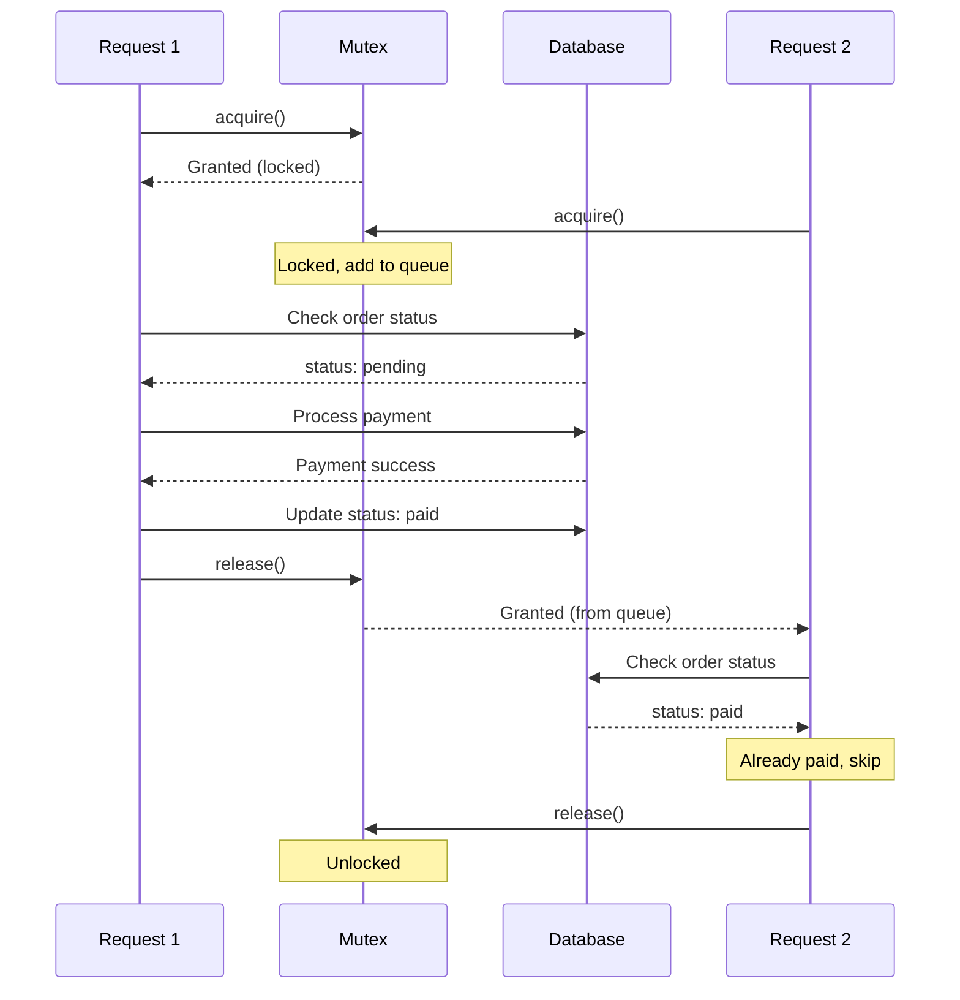
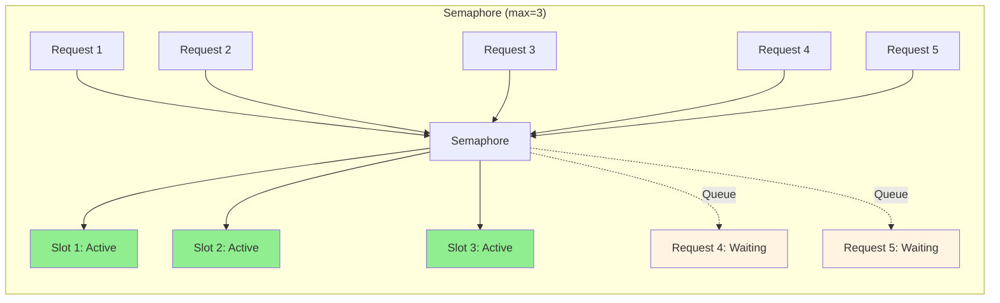
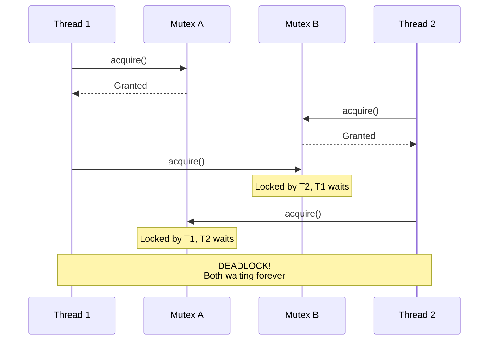

# Mutex / Semaphore patterns

## 1. Why this exists (Real-world problem first)

Your payment processing system occasionally charges customers twice. Two concurrent requests for the same order both check "not paid," both process payment. Race condition. The problem? No concurrency control around critical sections.

**Real production failures from race condition ignorance:**

1. **The Double Charge Nightmare**: E-commerce checkout has race condition in payment processing. Two requests for same order arrive within 50ms. Both check database: `order.status === 'pending'`. Both proceed to charge. Customer charged twice ($299.99 × 2). Happens to 50 customers during Black Friday. $30K in refunds. Support overwhelmed. Team doesn't understand "how can this happen in async JavaScript?"

2. **The Inventory Oversell Disaster**: Product has 1 item left in inventory. Two customers click "Buy Now" simultaneously. Both requests check inventory: `stock === 1`. Both see "in stock." Both create orders. Both decrement inventory. Final stock: -1. One customer gets "out of stock" email after payment. Angry customer, bad review, manual refund process.

3. **The File Corruption Incident**: Multiple cluster workers write to same log file without coordination. Worker 1 writes "Request A started". Worker 2 writes "Request B started" simultaneously. File becomes corrupted with interleaved bytes. Logs unreadable. Can't debug production issue. Team spends 8 hours reconstructing what happened.

4. **The Rate Limit Bypass**: API implements rate limiting with in-memory counter. Check counter, increment if under limit. Race condition: 100 requests arrive simultaneously, all check counter (currently 0), all pass (0 < 100), all increment. Counter now 100, but 100 requests processed instead of limit. API overwhelmed.

**What breaks without this knowledge:**
- Can't prevent race conditions in critical sections
- Don't know how to implement locks in Node.js
- Fail to handle concurrent access to shared resources
- Can't debug race conditions (they're intermittent)
- Don't understand when locks are needed vs overkill

## 2. Mental model (build imagination)

Think of mutex/semaphore as **Bathroom Keys** in a restaurant.

### The Bathroom Key Analogy

**Mutex (One Key - Mutual Exclusion)**:
- Restaurant has one bathroom, one key
- Only one person can use bathroom at a time
- Person takes key from hook, uses bathroom, returns key
- Others wait in line for key
- **Use case**: Single resource (database transaction, file write)

**Semaphore (Multiple Keys - Limited Access)**:
- Bathroom has 3 stalls, 3 keys on hooks
- Up to 3 people can use bathroom simultaneously
- 4th person waits for someone to return a key
- **Use case**: Limited resources (connection pool, API rate limit)

**The Flow:**
1. Person 1 arrives, takes key (acquire lock)
2. Person 2 arrives, no key available (waits in queue)
3. Person 1 finishes, returns key (release lock)
4. Person 2 gets key from queue (lock granted)

**Why this matters:**
- Prevents concurrent access to critical sections
- Ensures data consistency (no double charges)
- Avoids race conditions
- Provides ordered access to shared resources

## 3. How Node.js implements this internally

Node.js doesn't have built-in mutexes. We implement them using Promises and queues.

### Production-Grade Mutex Implementation

```javascript
class Mutex {
  constructor() {
    this.locked = false;
    this.queue = [];
  }
  
  async acquire() {
    return new Promise((resolve) => {
      if (!this.locked) {
        this.locked = true;
        resolve();
      } else {
        this.queue.push(resolve);
      }
    });
  }
  
  release() {
    if (this.queue.length > 0) {
      const resolve = this.queue.shift();
      resolve(); // Grant lock to next in queue
    } else {
      this.locked = false;
    }
  }
  
  async runExclusive(callback) {
    await this.acquire();
    try {
      return await callback();
    } finally {
      this.release(); // Always release, even on error
    }
  }
  
  isLocked() {
    return this.locked;
  }
  
  queueLength() {
    return this.queue.length;
  }
}
```

### Semaphore Implementation

```javascript
class Semaphore {
  constructor(max) {
    this.max = max;
    this.current = 0;
    this.queue = [];
  }
  
  async acquire() {
    return new Promise((resolve) => {
      if (this.current < this.max) {
        this.current++;
        resolve();
      } else {
        this.queue.push(resolve);
      }
    });
  }
  
  release() {
    if (this.queue.length > 0) {
      const resolve = this.queue.shift();
      resolve();
    } else {
      this.current--;
    }
  }
  
  async runExclusive(callback) {
    await this.acquire();
    try {
      return await callback();
    } finally {
      this.release();
    }
  }
  
  available() {
    return this.max - this.current;
  }
}
```

### How It Works Internally

```javascript
// Example: Two concurrent requests
const mutex = new Mutex();

// Request 1 arrives
async function request1() {
  await mutex.acquire(); // locked = true, returns immediately
  // Critical section
  await processPayment();
  mutex.release(); // locked = false
}

// Request 2 arrives 10ms later (while Request 1 in critical section)
async function request2() {
  await mutex.acquire(); // locked = true, added to queue
  // Waits here until Request 1 releases
  await processPayment();
  mutex.release();
}
```

### Common Misunderstandings

**Mistake 1**: "JavaScript is single-threaded, no race conditions"
- **Reality**: Async operations can interleave
- **Impact**: Race conditions in database updates, file writes

**Mistake 2**: "Mutex makes code slower"
- **Reality**: Prevents data corruption, which is worse than slow
- **Impact**: Correctness > speed for critical sections

**Mistake 3**: "Can use mutex across cluster workers"
- **Reality**: Mutex is in-memory, per-process only
- **Impact**: Need distributed locks (Redis) for cluster

## 4. Multiple diagrams (MANDATORY)

### Diagram 1: Mutex Flow



### Diagram 2: Race Condition Without Mutex

```mermaid
graph TB
    subgraph "Without Mutex (Race Condition)"
        A1[Request 1: Check balance] --> A2[Balance: $100]
        A3[Request 2: Check balance] --> A4[Balance: $100]
        A2 --> A5[Withdraw $80]
        A4 --> A6[Withdraw $80]
        A5 --> A7[New balance: $20]
        A6 --> A8[New balance: $20]
        A8 -.->A9[WRONG: Should be -$60!]
    end
    
    subgraph "With Mutex (Safe)"
        B1[Request 1: acquire] --> B2[Check balance: $100]
        B2 --> B3[Withdraw $80]
        B3 --> B4[New balance: $20]
        B4 --> B5[release]
        B5 --> B6[Request 2: acquire]
        B6 --> B7[Check balance: $20]
        B7 --> B8[Insufficient funds]
        B8 --> B9[Reject withdrawal]
    end
    
    style A7 fill:#FFB6C6
    style A8 fill:#FFB6C6
    style A9 fill:#FF6B6B
    style B8 fill:#90EE90
    style B9 fill:#90EE90
```



### Diagram 3: Semaphore Limiting Concurrency



### Diagram 4: Deadlock Scenario



## 5. Where this is used in real projects

### Preventing Double Payment (Production Pattern)

```javascript
const orderMutexes = new Map();

function getOrderMutex(orderId) {
  if (!orderMutexes.has(orderId)) {
    orderMutexes.set(orderId, new Mutex());
  }
  return orderMutexes.get(orderId);
}

// Cleanup old mutexes
setInterval(() => {
  const now = Date.now();
  for (const [orderId, mutex] of orderMutexes) {
    if (!mutex.isLocked() && mutex.lastUsed < now - 60000) {
      orderMutexes.delete(orderId);
    }
  }
}, 60000);

app.post('/checkout/:orderId', async (req, res) => {
  const mutex = getOrderMutex(req.params.orderId);
  
  try {
    await mutex.runExclusive(async () => {
      // Critical section: check and update order
      const order = await db.orders.findById(req.params.orderId);
      
      if (order.status === 'paid') {
        throw new Error('Order already paid');
      }
      
      if (order.status === 'cancelled') {
        throw new Error('Order cancelled');
      }
      
      // Process payment
      const payment = await stripe.charges.create({
        amount: order.total,
        currency: 'usd',
        source: req.body.token
      });
      
      // Update order
      await db.orders.update(req.params.orderId, {
        status: 'paid',
        paymentId: payment.id,
        paidAt: new Date()
      });
      
      // Send confirmation email
      await sendOrderConfirmation(order);
    });
    
    res.json({ success: true });
  } catch (err) {
    res.status(400).json({ error: err.message });
  }
});
```

### Rate Limiting with Semaphore

```javascript
class RateLimiter {
  constructor(maxConcurrent, maxPerSecond) {
    this.semaphore = new Semaphore(maxConcurrent);
    this.tokens = maxPerSecond;
    this.maxTokens = maxPerSecond;
    
    // Refill tokens every second
    setInterval(() => {
      this.tokens = this.maxTokens;
    }, 1000);
  }
  
  async acquire() {
    // Wait for token
    while (this.tokens <= 0) {
      await new Promise(resolve => setTimeout(resolve, 100));
    }
    
    this.tokens--;
    
    // Wait for semaphore slot
    await this.semaphore.acquire();
  }
  
  release() {
    this.semaphore.release();
  }
  
  async execute(fn) {
    await this.acquire();
    try {
      return await fn();
    } finally {
      this.release();
    }
  }
}

// Usage
const apiLimiter = new RateLimiter(10, 100); // Max 10 concurrent, 100/sec

async function callExternalAPI(data) {
  return apiLimiter.execute(async () => {
    const result = await fetch('https://api.example.com', {
      method: 'POST',
      body: JSON.stringify(data)
    });
    return result.json();
  });
}
```

### File Write Coordination

```javascript
class FileWriter {
  constructor(filePath) {
    this.filePath = filePath;
    this.mutex = new Mutex();
  }
  
  async append(message) {
    await this.mutex.runExclusive(async () => {
      const timestamp = new Date().toISOString();
      const line = `[${timestamp}] ${message}\n`;
      await fs.promises.appendFile(this.filePath, line);
    });
  }
  
  async write(content) {
    await this.mutex.runExclusive(async () => {
      await fs.promises.writeFile(this.filePath, content);
    });
  }
}

// Usage
const logger = new FileWriter('./app.log');

app.use((req, res, next) => {
  logger.append(`${req.method} ${req.path}`);
  next();
});
```

### Distributed Lock with Redis

```javascript
const Redis = require('ioredis');
const redis = new Redis();

class RedisLock {
  constructor(key, ttl = 10000) {
    this.key = `lock:${key}`;
    this.ttl = ttl;
    this.token = null;
  }
  
  async acquire() {
    this.token = `${Date.now()}-${Math.random()}`;
    
    const result = await redis.set(
      this.key,
      this.token,
      'PX', this.ttl,
      'NX' // Only set if not exists
    );
    
    return result === 'OK';
  }
  
  async release() {
    // Only release if we own the lock
    const script = `
      if redis.call("get", KEYS[1]) == ARGV[1] then
        return redis.call("del", KEYS[1])
      else
        return 0
      end
    `;
    
    await redis.eval(script, 1, this.key, this.token);
  }
  
  async runExclusive(callback) {
    const acquired = await this.acquire();
    
    if (!acquired) {
      throw new Error('Could not acquire lock');
    }
    
    try {
      return await callback();
    } finally {
      await this.release();
    }
  }
}

// Usage across cluster workers
app.post('/checkout/:orderId', async (req, res) => {
  const lock = new RedisLock(`order:${req.params.orderId}`);
  
  try {
    await lock.runExclusive(async () => {
      // Critical section
      await processPayment(req.params.orderId);
    });
    
    res.json({ success: true });
  } catch (err) {
    res.status(400).json({ error: err.message });
  }
});
```

## 6. Where this should NOT be used

### Over-Synchronization

```javascript
// WRONG: Mutex for independent read operations
const mutex = new Mutex();

app.get('/user/:id', async (req, res) => {
  await mutex.runExclusive(async () => {
    const user = await db.users.findById(req.params.id);
    res.json(user);
  });
});
// No need for mutex, reads don't conflict!
// Serializes all requests unnecessarily

// RIGHT: No mutex for reads
app.get('/user/:id', async (req, res) => {
  const user = await db.users.findById(req.params.id);
  res.json(user);
});
```

### Using Mutex for I/O Throttling

```javascript
// WRONG: Mutex for rate limiting
const mutex = new Mutex();

async function callAPI() {
  await mutex.runExclusive(async () => {
    return await fetch('https://api.example.com');
  });
}
// Only 1 request at a time, very slow!

// RIGHT: Semaphore for concurrency limit
const semaphore = new Semaphore(10);

async function callAPI() {
  await semaphore.acquire();
  try {
    return await fetch('https://api.example.com');
  } finally {
    semaphore.release();
  }
}
// Up to 10 concurrent requests
```

## 7. Failure modes & edge cases

### Failure Mode 1: Deadlock

**Scenario**: Circular lock dependency

```javascript
// DISASTER: Potential deadlock
const mutexA = new Mutex();
const mutexB = new Mutex();

// Request 1
async function transfer1() {
  await mutexA.acquire();
  await mutexB.acquire(); // Waits for B
  // Transfer money
  mutexB.release();
  mutexA.release();
}

// Request 2
async function transfer2() {
  await mutexB.acquire();
  await mutexA.acquire(); // Waits for A - DEADLOCK!
  // Transfer money
  mutexA.release();
  mutexB.release();
}
```

**Solution**: Consistent lock ordering

```javascript
// SAFE: Always acquire locks in same order
async function transfer1() {
  await mutexA.acquire();
  await mutexB.acquire();
  // Transfer money
  mutexB.release();
  mutexA.release();
}

async function transfer2() {
  await mutexA.acquire(); // Same order!
  await mutexB.acquire();
  // Transfer money
  mutexB.release();
  mutexA.release();
}
```

### Failure Mode 2: Forgotten Release

**Scenario**: Lock never released on error

```javascript
// WRONG: Doesn't release on error
await mutex.acquire();
await riskyOperation(); // Might throw
mutex.release(); // Never reached if error!
// Lock held forever, all requests hang

// RIGHT: Always release in finally
await mutex.runExclusive(async () => {
  await riskyOperation();
});
// OR
await mutex.acquire();
try {
  await riskyOperation();
} finally {
  mutex.release(); // Always runs
}
```

### Failure Mode 3: Lock Timeout

**Scenario**: Lock held too long

```javascript
// Add timeout to mutex
class MutexWithTimeout extends Mutex {
  async acquire(timeout = 5000) {
    return Promise.race([
      super.acquire(),
      new Promise((_, reject) =>
        setTimeout(() => reject(new Error('Lock timeout')), timeout)
      )
    ]);
  }
}

// Usage
const mutex = new MutexWithTimeout();

try {
  await mutex.acquire(5000); // 5 second timeout
  await processPayment();
  mutex.release();
} catch (err) {
  if (err.message === 'Lock timeout') {
    // Lock held too long, possible deadlock
    console.error('Lock timeout, investigate deadlock');
  }
}
```

## 8. Trade-offs & alternatives

### Mutex

**Gain**: Prevents race conditions, ensures data consistency
**Sacrifice**: Serializes access (reduces throughput)
**When**: Critical sections with shared mutable state

### Semaphore

**Gain**: Limits concurrency, prevents resource exhaustion
**Sacrifice**: Queuing delay, complexity
**When**: Rate limiting, connection pools, resource limits

### Optimistic Locking (Alternative)

**Gain**: No locks, better performance
**Sacrifice**: Retry logic needed, not always possible
**When**: Low contention, database supports it

```javascript
// Optimistic locking with version
async function updateOrder(orderId) {
  const order = await db.orders.findById(orderId);
  const version = order.version;
  
  // Update with version check
  const result = await db.orders.updateOne(
    { _id: orderId, version },
    { $set: { status: 'paid' }, $inc: { version: 1 } }
  );
  
  if (result.modifiedCount === 0) {
    throw new Error('Concurrent modification, retry');
  }
}
```

## 9. Interview-level articulation

**Q: "How do you prevent race conditions in Node.js?"**

**A**: "I use mutex patterns to serialize access to critical sections. For example, in payment processing, I create a mutex per order ID using a Map. Before processing payment, I call `mutex.runExclusive()` which acquires the lock, executes the critical section (check order status, process payment, update database), and releases the lock in a finally block. This ensures only one request can process payment for a given order at a time, preventing double charges. For distributed systems with multiple servers, I use Redis-based distributed locks with the SET NX PX command to ensure atomicity across processes."

**Q: "What's the difference between mutex and semaphore?"**

**A**: "A mutex is binary—only one holder at a time. It's like a single bathroom key. I use mutexes for exclusive access to a resource, like updating a specific database record. A semaphore allows N concurrent holders. It's like having 3 bathroom keys for 3 stalls. I use semaphores to limit concurrency, like allowing max 10 concurrent API calls to a third-party service. Internally, both use a queue to track waiters, but mutex has a boolean locked flag while semaphore has a counter."

**Q: "How do you handle deadlocks?"**

**A**: "I prevent deadlocks with three strategies. First, consistent lock ordering—if code needs locks A and B, always acquire A then B, never B then A. Second, lock timeouts—if a lock isn't acquired within 5 seconds, throw an error rather than wait forever. Third, avoid nested locks when possible—redesign to need only one lock. For debugging deadlocks, I add monitoring to track lock acquisition times and queue lengths, and log warnings when locks are held longer than expected."

## 10. Key takeaways (engineer mindset)

### What to Remember

1. **Mutex for exclusive access** to critical sections
2. **Semaphore for limiting concurrency** (N simultaneous)
3. **Always release in finally** block
4. **Avoid deadlocks** with consistent lock ordering
5. **Don't over-synchronize** independent operations
6. **Use Redis locks** for distributed systems
7. **Monitor lock contention** in production

### What Decisions This Enables

**Correctness decisions**:
- Prevent double charges with per-order mutex
- Prevent inventory oversell with stock mutex
- Ensure file integrity with write mutex

**Performance decisions**:
- Use semaphore for API rate limiting
- Limit database connection concurrency
- Control resource pool access

**Architecture decisions**:
- In-memory locks for single process
- Redis locks for clustered applications
- Optimistic locking for low contention

### How It Connects to Other Node.js Concepts

**Async/Await** (Topic 11):
- Mutexes built on Promises
- Async functions can await locks

**Event Loop** (Topic 2):
- Locks don't block event loop
- Other requests processed while waiting

**Cluster Module** (Topic 15):
- In-memory locks don't work across workers
- Need distributed locks (Redis)

### The Golden Rule

**Use mutexes sparingly for true critical sections**. Prefer lock-free patterns when possible (optimistic locking, atomic operations). Always release locks in finally blocks. Monitor lock contention in production. For distributed systems, use Redis-based distributed locks.
