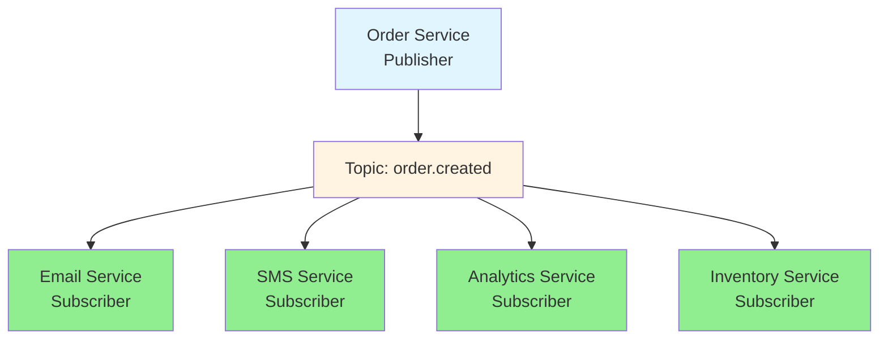
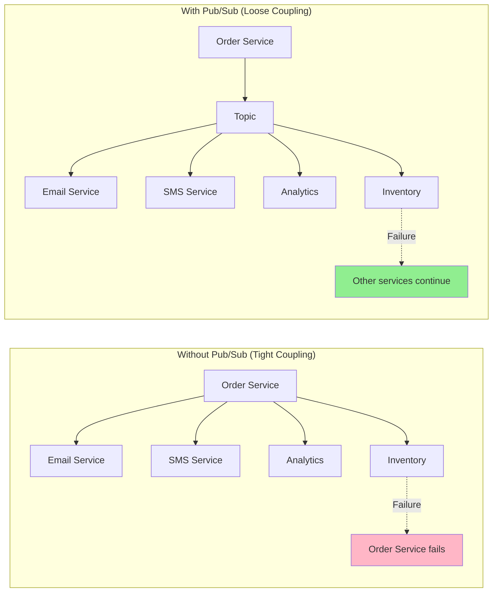
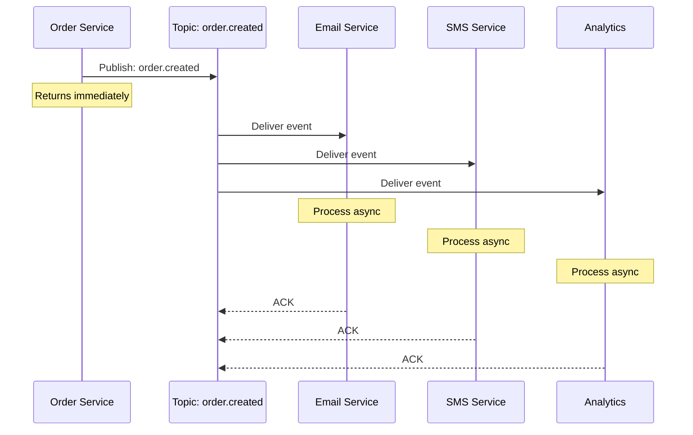
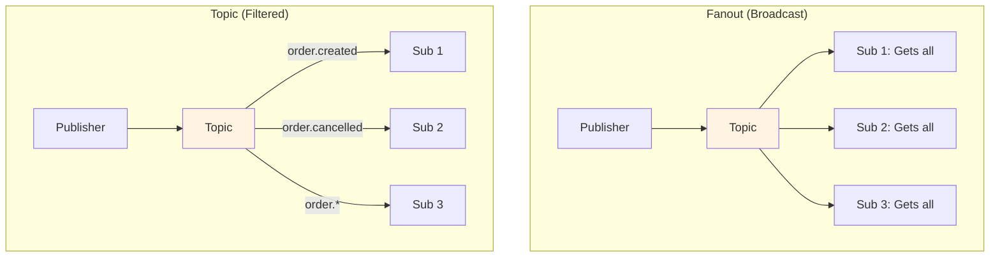

# Pub/Sub patterns

## 1. Why this exists (Real-world problem first)

Your notification system sends emails when users perform actions. Initially, you have one email service. Then you add SMS notifications. Then push notifications. Then Slack webhooks. Then analytics tracking. Each new feature requires modifying the original code, adding more coupled dependencies. The problem? Tight coupling between event producers and consumers makes the system rigid and fragile.

**Real production failures from tight coupling:**

1. **The Notification Cascade**: E-commerce platform sends order confirmation emails directly from order service. Product team wants to add SMS notifications. Modify order service. Then add push notifications. Modify again. Then add Slack for internal team. Modify again. Order service now depends on 4 external services. One service (Slack) goes down. Order service crashes trying to send Slack notification. All orders fail. $100K in lost sales. Team doesn't understand "why does Slack affect orders?"

2. **The Analytics Bottleneck**: SaaS app tracks user events by calling analytics service directly from API handlers. Analytics service slows down (processing 10M events/day). All API calls slow down waiting for analytics. Users complain app is "frozen." Team can't disable analytics (business requirement). Can't scale analytics fast enough. API response time goes from 50ms to 2 seconds.

3. **The Feature Addition Nightmare**: Payment service needs to trigger 8 different actions when payment succeeds: update order, send email, send SMS, update inventory, trigger shipping, log analytics, update data warehouse, notify accounting. Payment service has 8 direct dependencies. Adding new feature (fraud detection) requires modifying payment service code. Deploy breaks existing integrations. Rollback required. Feature delayed 2 weeks.

4. **The Microservice Coupling**: User service publishes "user.created" event. Initially, only email service subscribes. Over time, 15 services subscribe: email, SMS, analytics, CRM, data warehouse, recommendation engine, etc. User service doesn't know who's listening. One subscriber (recommendation engine) has bug, crashes on every event. Fills error logs. Team can't identify which subscriber is broken. Takes 4 hours to debug.

**What breaks without pub/sub:**
- Tight coupling between producers and consumers
- Can't add new features without modifying existing code
- Can't scale consumers independently
- Can't handle consumer failures gracefully
- Don't understand decoupling patterns

## 2. Mental model (build imagination)

Think of pub/sub as a **Newspaper Delivery System**.

### The Newspaper Analogy

**Without Pub/Sub (Direct Delivery)**:
- Newspaper writer knows every subscriber's address
- Writer delivers to each house personally
- Adding new subscriber requires telling writer
- If one house is locked, writer waits
- Writer can't write while delivering

**With Pub/Sub (Newspaper Stand)**:
- Writer publishes to newspaper stand (topic)
- Subscribers pick up from stand (subscribe)
- Writer doesn't know who reads
- Subscribers don't know who writes
- Adding subscriber doesn't affect writer
- If subscriber is away, newspaper waits at stand

**The Flow:**

**Publisher (Newspaper Writer)**:
1. Writes article (creates event)
2. Publishes to stand (emits to topic)
3. Continues writing (doesn't wait)

**Topic (Newspaper Stand)**:
1. Receives newspaper (event)
2. Stores for pickup (queues)
3. Notifies subscribers (routing)

**Subscriber (Reader)**:
1. Subscribes to stand (registers interest)
2. Picks up newspaper (consumes event)
3. Reads at own pace (processes async)

**Why this matters:**
- Publisher and subscribers are decoupled
- Can add/remove subscribers without changing publisher
- Subscribers process at their own pace
- Publisher doesn't wait for subscribers

## 3. How Node.js implements this internally

### In-Memory Pub/Sub (EventEmitter)

```javascript
const EventEmitter = require('events');
const eventBus = new EventEmitter();

// Publisher
class OrderService {
  async createOrder(orderData) {
    const order = await db.orders.create(orderData);
    
    // Publish event (doesn't know who's listening)
    eventBus.emit('order.created', order);
    
    return order;
  }
}

// Subscribers
class EmailService {
  constructor() {
    // Subscribe to events
    eventBus.on('order.created', this.sendConfirmation.bind(this));
  }
  
  async sendConfirmation(order) {
    await sendEmail(order.email, 'Order Confirmation', order);
  }
}

class SMSService {
  constructor() {
    eventBus.on('order.created', this.sendSMS.bind(this));
  }
  
  async sendSMS(order) {
    await sendSMS(order.phone, `Order ${order.id} confirmed`);
  }
}

class AnalyticsService {
  constructor() {
    eventBus.on('order.created', this.track.bind(this));
  }
  
  async track(order) {
    await analytics.track('order_created', order);
  }
}

// Initialize subscribers
new EmailService();
new SMSService();
new AnalyticsService();

// Publisher doesn't know about subscribers!
const orderService = new OrderService();
await orderService.createOrder({ ... });
```

### Redis Pub/Sub (Distributed)

```javascript
const Redis = require('ioredis');

// Publisher
class OrderPublisher {
  constructor() {
    this.redis = new Redis();
  }
  
  async publishOrderCreated(order) {
    await this.redis.publish(
      'order.created',
      JSON.stringify(order)
    );
  }
}

// Subscriber
class EmailSubscriber {
  constructor() {
    this.redis = new Redis();
    this.subscribe();
  }
  
  async subscribe() {
    await this.redis.subscribe('order.created');
    
    this.redis.on('message', async (channel, message) => {
      if (channel === 'order.created') {
        const order = JSON.parse(message);
        await this.sendEmail(order);
      }
    });
  }
  
  async sendEmail(order) {
    // Send email
  }
}
```

### Message Queue Pub/Sub (RabbitMQ)

```javascript
const amqp = require('amqplib');

// Publisher
class OrderPublisher {
  async publish(order) {
    const connection = await amqp.connect('amqp://localhost');
    const channel = await connection.createChannel();
    
    // Declare exchange (topic)
    await channel.assertExchange('orders', 'fanout', { durable: true });
    
    // Publish to exchange
    channel.publish(
      'orders',
      '', // routing key (empty for fanout)
      Buffer.from(JSON.stringify(order)),
      { persistent: true }
    );
    
    await channel.close();
    await connection.close();
  }
}

// Subscriber
class EmailSubscriber {
  async subscribe() {
    const connection = await amqp.connect('amqp://localhost');
    const channel = await connection.createChannel();
    
    await channel.assertExchange('orders', 'fanout', { durable: true });
    
    // Create queue for this subscriber
    const q = await channel.assertQueue('email-queue', { durable: true });
    
    // Bind queue to exchange
    await channel.bindQueue(q.queue, 'orders', '');
    
    // Consume messages
    channel.consume(q.queue, async (msg) => {
      const order = JSON.parse(msg.content.toString());
      await this.sendEmail(order);
      channel.ack(msg);
    });
  }
}
```

### Common Misunderstandings

**Mistake 1**: "Pub/sub is just async function calls"
- **Reality**: Pub/sub decouples producers from consumers
- **Impact**: Missing the point of loose coupling

**Mistake 2**: "Publisher waits for subscribers"
- **Reality**: Publisher fire-and-forget, doesn't wait
- **Impact**: Wrong expectations about delivery guarantees

**Mistake 3**: "All subscribers get events immediately"
- **Reality**: Depends on implementation (in-memory vs queue)
- **Impact**: Wrong assumptions about timing

## 4. Multiple diagrams (MANDATORY)

### Diagram 1: Pub/Sub Architecture



### Diagram 2: Direct Coupling vs Pub/Sub



### Diagram 3: Message Flow



### Diagram 4: Topic Patterns



## 5. Where this is used in real projects

### Order Processing System

```javascript
const EventEmitter = require('events');
const eventBus = new EventEmitter();

// Publisher: Order Service
class OrderService {
  async createOrder(orderData) {
    const order = await db.orders.create(orderData);
    
    // Publish event
    eventBus.emit('order.created', order);
    
    return order;
  }
  
  async cancelOrder(orderId) {
    const order = await db.orders.update(orderId, { status: 'cancelled' });
    
    eventBus.emit('order.cancelled', order);
    
    return order;
  }
}

// Subscriber: Email Service
class EmailService {
  constructor() {
    eventBus.on('order.created', this.sendOrderConfirmation.bind(this));
    eventBus.on('order.cancelled', this.sendCancellationEmail.bind(this));
  }
  
  async sendOrderConfirmation(order) {
    await emailClient.send({
      to: order.email,
      subject: 'Order Confirmation',
      template: 'order-confirmation',
      data: order
    });
  }
  
  async sendCancellationEmail(order) {
    await emailClient.send({
      to: order.email,
      subject: 'Order Cancelled',
      template: 'order-cancelled',
      data: order
    });
  }
}

// Subscriber: Inventory Service
class InventoryService {
  constructor() {
    eventBus.on('order.created', this.reserveItems.bind(this));
    eventBus.on('order.cancelled', this.releaseItems.bind(this));
  }
  
  async reserveItems(order) {
    for (const item of order.items) {
      await db.inventory.decrement(item.productId, item.quantity);
    }
  }
  
  async releaseItems(order) {
    for (const item of order.items) {
      await db.inventory.increment(item.productId, item.quantity);
    }
  }
}

// Subscriber: Analytics Service
class AnalyticsService {
  constructor() {
    eventBus.on('order.created', this.trackOrderCreated.bind(this));
    eventBus.on('order.cancelled', this.trackOrderCancelled.bind(this));
  }
  
  async trackOrderCreated(order) {
    await analytics.track('order_created', {
      orderId: order.id,
      total: order.total,
      items: order.items.length
    });
  }
  
  async trackOrderCancelled(order) {
    await analytics.track('order_cancelled', {
      orderId: order.id,
      reason: order.cancellationReason
    });
  }
}

// Initialize all subscribers
new EmailService();
new InventoryService();
new AnalyticsService();
```

### Redis Pub/Sub for Distributed Systems

```javascript
const Redis = require('ioredis');

// Publisher Service (can be any service)
class EventPublisher {
  constructor() {
    this.redis = new Redis();
  }
  
  async publish(topic, data) {
    await this.redis.publish(topic, JSON.stringify(data));
  }
}

// Subscriber Service (separate process/container)
class EventSubscriber {
  constructor(topics, handler) {
    this.redis = new Redis();
    this.topics = topics;
    this.handler = handler;
    this.subscribe();
  }
  
  async subscribe() {
    await this.redis.subscribe(...this.topics);
    
    this.redis.on('message', async (channel, message) => {
      try {
        const data = JSON.parse(message);
        await this.handler(channel, data);
      } catch (err) {
        console.error(`Error processing ${channel}:`, err);
      }
    });
  }
}

// Usage in Email Service
const emailSubscriber = new EventSubscriber(
  ['order.created', 'order.cancelled'],
  async (channel, data) => {
    if (channel === 'order.created') {
      await sendOrderConfirmation(data);
    } else if (channel === 'order.cancelled') {
      await sendCancellationEmail(data);
    }
  }
);

// Usage in Analytics Service
const analyticsSubscriber = new EventSubscriber(
  ['order.*', 'user.*', 'payment.*'],
  async (channel, data) => {
    await trackEvent(channel, data);
  }
);
```

### RabbitMQ Topic Exchange

```javascript
const amqp = require('amqplib');

// Publisher
class RabbitMQPublisher {
  async publish(topic, routingKey, data) {
    const connection = await amqp.connect('amqp://localhost');
    const channel = await connection.createChannel();
    
    await channel.assertExchange(topic, 'topic', { durable: true });
    
    channel.publish(
      topic,
      routingKey,
      Buffer.from(JSON.stringify(data)),
      { persistent: true }
    );
    
    await channel.close();
    await connection.close();
  }
}

// Subscriber
class RabbitMQSubscriber {
  async subscribe(exchange, routingKeys, handler) {
    const connection = await amqp.connect('amqp://localhost');
    const channel = await connection.createChannel();
    
    await channel.assertExchange(exchange, 'topic', { durable: true });
    
    const q = await channel.assertQueue('', { exclusive: true });
    
    for (const key of routingKeys) {
      await channel.bindQueue(q.queue, exchange, key);
    }
    
    channel.consume(q.queue, async (msg) => {
      const data = JSON.parse(msg.content.toString());
      await handler(msg.fields.routingKey, data);
      channel.ack(msg);
    });
  }
}

// Usage
const publisher = new RabbitMQPublisher();
await publisher.publish('orders', 'order.created', order);

const subscriber = new RabbitMQSubscriber();
await subscriber.subscribe(
  'orders',
  ['order.created', 'order.cancelled'],
  async (routingKey, data) => {
    console.log(`Received ${routingKey}:`, data);
  }
);
```

## 6. Where this should NOT be used

### Simple Direct Communication

```javascript
// WRONG: Pub/sub for single consumer
eventBus.emit('user.login', user);
// Only one service needs this event

// RIGHT: Direct function call
await authService.handleLogin(user);
```

### Immediate Response Needed

```javascript
// WRONG: Pub/sub for validation
app.post('/login', async (req, res) => {
  eventBus.emit('login.attempt', req.body);
  res.json({ status: 'processing' });
  // User can't log in without token!
});

// RIGHT: Direct call for immediate response
app.post('/login', async (req, res) => {
  const token = await authService.login(req.body);
  res.json({ token });
});
```

### Guaranteed Delivery Required

```javascript
// WRONG: In-memory pub/sub for critical events
eventBus.emit('payment.processed', payment);
// If process crashes, event lost

// RIGHT: Durable message queue
await messageQueue.publish('payment.processed', payment);
```

## 7. Failure modes & edge cases

### Failure Mode 1: Subscriber Crashes

**Scenario**: Subscriber crashes while processing event

```javascript
// In-memory EventEmitter: Event lost
eventBus.on('order.created', async (order) => {
  await processOrder(order); // Crashes here
  // Event lost, never reprocessed
});

// Message Queue: Event redelivered
channel.consume('order-queue', async (msg) => {
  try {
    await processOrder(JSON.parse(msg.content));
    channel.ack(msg); // Only ACK after success
  } catch (err) {
    channel.nack(msg, false, true); // Requeue
  }
});
```

### Failure Mode 2: Slow Subscriber

**Scenario**: One subscriber is slow, backs up queue

```
Publisher: 1000 events/sec
Subscriber A: 1000 events/sec (fast)
Subscriber B: 100 events/sec (slow)

Result: Subscriber B queue grows infinitely
```

**Solution**: Separate queues per subscriber, monitoring

### Failure Mode 3: Event Ordering

**Scenario**: Events processed out of order

```
Event 1: "Order Created" (delayed in network)
Event 2: "Order Cancelled" (arrives first)

Subscriber processes Event 2 first: "Order not found"
```

**Solution**: Event versioning, timestamps, ordering guarantees

## 8. Trade-offs & alternatives

### Pub/Sub

**Gain**: Loose coupling, scalability, flexibility, multiple consumers
**Sacrifice**: Complexity, eventual consistency, harder debugging
**When**: Multiple consumers, decoupling needed, async processing

### Direct Calls

**Gain**: Simple, immediate response, strong consistency
**Sacrifice**: Tight coupling, poor scalability
**When**: Single consumer, immediate response needed

### Request/Response (RPC)

**Gain**: Synchronous, return values, strong consistency
**Sacrifice**: Tight coupling, blocking
**When**: Need return value, synchronous flow

## 9. Interview-level articulation

**Q: "What is pub/sub and when would you use it?"**

**A**: "Pub/sub is a messaging pattern where publishers emit events to topics without knowing who's listening, and subscribers consume events from topics without knowing who published them. This decouples producers from consumers. I use pub/sub when one event needs to trigger multiple actions. For example, when an order is created, I publish 'order.created' to a topic. Email service, SMS service, analytics, and inventory all subscribe to this topic independently. The order service doesn't know or care who's listening. This makes it easy to add new features—just add a new subscriber without modifying the order service. I use in-memory EventEmitter for single-process apps and message queues like RabbitMQ or Redis for distributed systems."

**Q: "What are the challenges of pub/sub?"**

**A**: "The main challenges are delivery guarantees, ordering, and debugging. With in-memory pub/sub, if a subscriber crashes, the event is lost. With message queues, you get durability but need to handle duplicate delivery (idempotency). Event ordering is also tricky—if events arrive out of order, you might process 'order cancelled' before 'order created.' Debugging is harder because you don't have a clear call stack—events flow through topics and multiple subscribers. You need distributed tracing to follow event flow. Despite these challenges, pub/sub is essential for building scalable, decoupled systems."

## 10. Key takeaways (engineer mindset)

### What to Remember

1. **Pub/sub decouples** publishers from subscribers
2. **Publisher doesn't wait** for subscribers (fire-and-forget)
3. **Multiple subscribers** can consume same event
4. **In-memory pub/sub** (EventEmitter) for single process
5. **Message queues** (RabbitMQ, Redis) for distributed systems
6. **Topics** route events to interested subscribers
7. **Fanout** broadcasts to all subscribers

### What Decisions This Enables

**Architecture decisions**:
- When to decouple services
- How to add features without modifying existing code
- How to scale consumers independently

**Reliability decisions**:
- Durable vs in-memory messaging
- Delivery guarantees (at-least-once, exactly-once)
- Failure handling strategies

**Performance decisions**:
- Async processing for non-critical tasks
- Load leveling with queues
- Independent consumer scaling

### How It Connects to Other Node.js Concepts

**Event-Driven Architecture** (Topic 19):
- Pub/sub is core pattern for event-driven systems
- Enables loose coupling

**Message Brokers** (Topic 21):
- RabbitMQ, Kafka implement pub/sub
- Provide durability and scalability

**Idempotency** (Topic 23):
- Pub/sub requires idempotent consumers
- Handle duplicate delivery

### The Golden Rule

**Use pub/sub when one event needs to trigger multiple actions**. Use in-memory EventEmitter for single-process apps. Use message queues (RabbitMQ, Redis, Kafka) for distributed systems. Always handle subscriber failures gracefully. Monitor queue depths and consumer lag.
