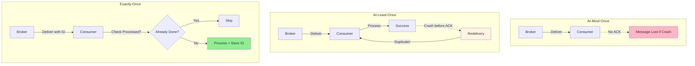
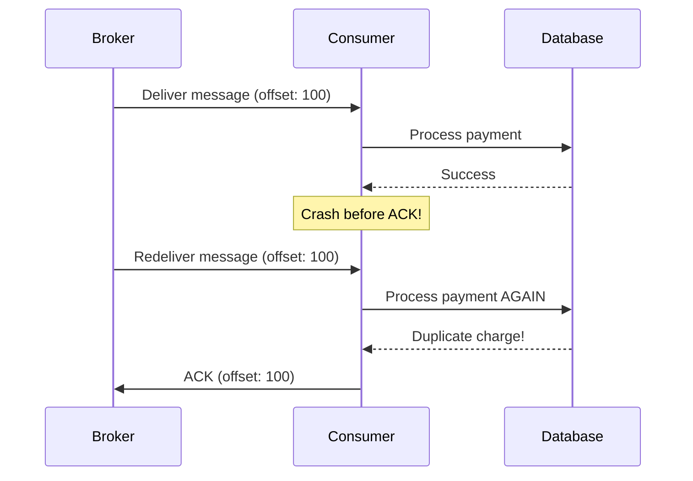
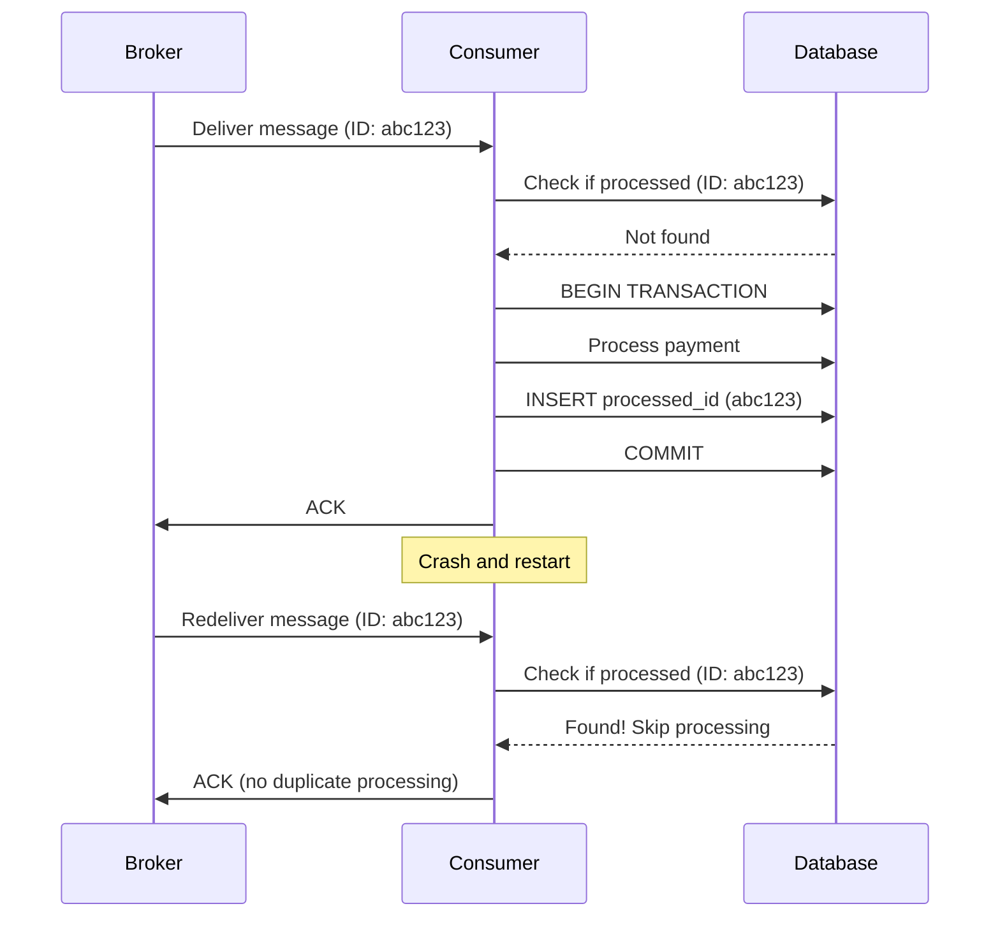
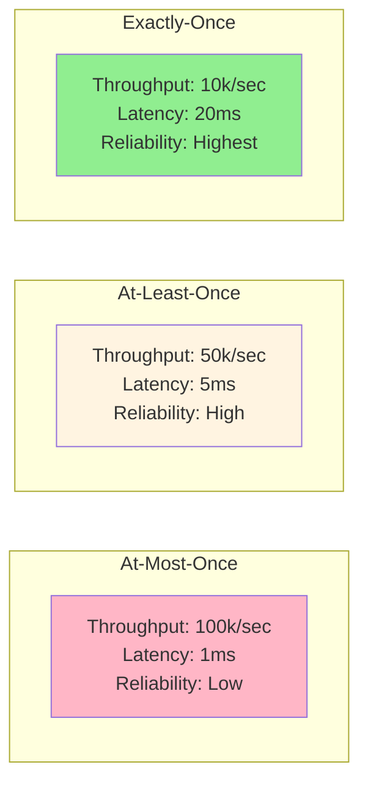

# At-least-once vs Exactly-once delivery

## 1. Why this exists (Real-world problem first)

Your payment processing system charges customers via message queue. Consumer processes payment, charges card, then crashes before acknowledging message. Message broker redelivers. Consumer processes again. Customer charged twice. $50K in duplicate charges. The problem? At-least-once delivery without idempotency causes duplicate processing.

**Real production failures from delivery semantics ignorance:**

1. **The Double Charge Nightmare**: Payment service consumes "payment.process" events from RabbitMQ. Processes payment successfully, charges customer $299.99. Before sending ACK, process crashes (OOM). RabbitMQ redelivers message. New process instance charges customer again. 500 customers charged twice during incident. $150K in duplicate charges. Refund process takes 2 weeks. Customer trust damaged. Team doesn't understand "why did it charge twice?"

2. **The Inventory Oversell**: Order service consumes "order.created" events. Decrements inventory. Network hiccup causes timeout before ACK. Kafka redelivers. Inventory decremented again. Product shows -5 stock. Oversell by 5 units. Customers receive "out of stock" emails after payment. Manual inventory reconciliation required.

3. **The Email Spam**: Notification service sends order confirmation emails. Consumes from queue with at-least-once delivery. Consumer crashes after sending email but before ACK. Message redelivered. Email sent again. Customer receives 5 duplicate confirmation emails. Support overwhelmed with "why am I getting spam?" complaints.

4. **The Exactly-Once Illusion**: Team implements "exactly-once" delivery using distributed transactions across Kafka and PostgreSQL. Performance drops 10x. Throughput goes from 10,000 to 1,000 events/sec. Latency increases from 10ms to 100ms. System can't handle peak load. Team doesn't understand "exactly-once is expensive."

**What breaks without understanding delivery semantics:**
- Duplicate processing causes data corruption
- Don't know when to use at-least-once vs exactly-once
- Can't implement idempotent consumers
- Don't understand performance trade-offs
- Can't handle redelivery scenarios
- Fail to design for message broker failures

## 2. Mental model (build imagination)

Think of delivery semantics as **Package Delivery Guarantees**.

### The Package Delivery Analogy

**At-Most-Once (Fire and Forget)**:
- Sender throws package over fence
- No confirmation of delivery
- Package might get lost
- No redelivery
- **Fast but unreliable**

**At-Least-Once (Confirmed Delivery with Retries)**:
- Sender delivers package
- Waits for signature
- If no signature, delivers again
- Package might be delivered multiple times
- Receiver must handle duplicates
- **Reliable but duplicates possible**

**Exactly-Once (Perfect Delivery)**:
- Sender delivers package
- Receiver checks "already received" list
- If duplicate, discards
- Only processes once
- **Reliable and no duplicates, but expensive**

**The Flow:**

**At-Least-Once:**
1. Broker delivers message
2. Consumer processes
3. Consumer crashes before ACK
4. Broker redelivers (duplicate!)
5. Consumer must be idempotent

**Exactly-Once:**
1. Broker delivers message with ID
2. Consumer checks "processed IDs" table
3. If already processed, skip
4. Process and store ID atomically
5. ACK to broker

**Why this matters:**
- At-least-once is default for most brokers
- Exactly-once requires idempotency
- Trade-off between performance and guarantees
- Understanding prevents duplicate processing bugs

## 3. How Node.js implements this internally

### At-Least-Once with RabbitMQ

```javascript
const amqp = require('amqplib');

// Consumer with at-least-once delivery
class AtLeastOnceConsumer {
  async start() {
    const connection = await amqp.connect('amqp://localhost');
    const channel = await connection.createChannel();
    
    await channel.assertQueue('payments', { durable: true });
    
    // Manual ACK (at-least-once)
    channel.consume('payments', async (msg) => {
      const payment = JSON.parse(msg.content.toString());
      
      try {
        // Process payment
        await this.processPayment(payment);
        
        // ACK only after successful processing
        channel.ack(msg);
      } catch (err) {
        console.error('Processing failed:', err);
        
        // NACK and requeue (will be redelivered)
        channel.nack(msg, false, true);
      }
    }, { noAck: false }); // Manual ACK required
  }
  
  async processPayment(payment) {
    // If this succeeds but ACK fails, message redelivered!
    await stripe.charges.create({
      amount: payment.amount,
      source: payment.token
    });
  }
}
```

### Idempotent Consumer (Exactly-Once Semantics)

```javascript
const amqp = require('amqplib');
const db = require('./database');

// Idempotent consumer prevents duplicate processing
class IdempotentConsumer {
  async start() {
    const connection = await amqp.connect('amqp://localhost');
    const channel = await connection.createChannel();
    
    await channel.assertQueue('payments', { durable: true });
    
    channel.consume('payments', async (msg) => {
      const payment = JSON.parse(msg.content.toString());
      const messageId = msg.properties.messageId;
      
      try {
        // Check if already processed (idempotency check)
        const processed = await db.processedMessages.findOne({ messageId });
        
        if (processed) {
          console.log(`Message ${messageId} already processed, skipping`);
          channel.ack(msg);
          return;
        }
        
        // Process and mark as processed atomically
        await db.transaction(async (trx) => {
          // Process payment
          await this.processPayment(payment, trx);
          
          // Mark as processed
          await trx('processed_messages').insert({
            messageId,
            processedAt: new Date()
          });
        });
        
        channel.ack(msg);
      } catch (err) {
        console.error('Processing failed:', err);
        channel.nack(msg, false, true);
      }
    }, { noAck: false });
  }
  
  async processPayment(payment, trx) {
    await trx('payments').insert({
      id: payment.id,
      amount: payment.amount,
      status: 'completed'
    });
  }
}
```

### Kafka Exactly-Once Semantics

```javascript
const { Kafka } = require('kafkajs');

// Kafka with exactly-once semantics
class KafkaExactlyOnce {
  async start() {
    const kafka = new Kafka({
      clientId: 'payment-service',
      brokers: ['localhost:9092']
    });
    
    // Producer with idempotence
    const producer = kafka.producer({
      idempotent: true, // Exactly-once producer
      transactionalId: 'payment-producer'
    });
    
    await producer.connect();
    
    // Consumer with exactly-once
    const consumer = kafka.consumer({
      groupId: 'payment-group',
      isolation: 'read_committed' // Only read committed transactions
    });
    
    await consumer.connect();
    await consumer.subscribe({ topic: 'orders' });
    
    await consumer.run({
      eachMessage: async ({ topic, partition, message }) => {
        const order = JSON.parse(message.value.toString());
        
        // Begin transaction
        const transaction = await producer.transaction();
        
        try {
          // Process order
          await this.processOrder(order);
          
          // Produce result
          await transaction.send({
            topic: 'order-processed',
            messages: [{ value: JSON.stringify(order) }]
          });
          
          // Commit offsets and transaction atomically
          await transaction.sendOffsets({
            consumerGroupId: 'payment-group',
            topics: [{
              topic,
              partitions: [{
                partition,
                offset: (parseInt(message.offset) + 1).toString()
              }]
            }]
          });
          
          await transaction.commit();
        } catch (err) {
          await transaction.abort();
          throw err;
        }
      }
    });
  }
}
```

### Common Misunderstandings

**Mistake 1**: "Exactly-once is always better"
- **Reality**: Exactly-once is expensive (performance, complexity)
- **Impact**: Over-engineering simple use cases

**Mistake 2**: "At-least-once means duplicates always happen"
- **Reality**: Duplicates only on failures/retries
- **Impact**: Over-worrying about rare edge cases

**Mistake 3**: "Idempotency is hard"
- **Reality**: Often simple with unique IDs
- **Impact**: Avoiding at-least-once when it's sufficient

## 4. Multiple diagrams (MANDATORY)

### Diagram 1: Delivery Semantics Comparison



### Diagram 2: At-Least-Once Failure Scenario



### Diagram 3: Idempotent Consumer Pattern



### Diagram 4: Performance Trade-offs



## 5. Where this is used in real projects

### Payment Processing (Idempotent Consumer)

```javascript
const amqp = require('amqplib');
const db = require('./database');

class PaymentConsumer {
  async start() {
    const connection = await amqp.connect('amqp://localhost');
    const channel = await connection.createChannel();
    
    await channel.assertQueue('payments', { durable: true });
    
    channel.consume('payments', async (msg) => {
      const payment = JSON.parse(msg.content.toString());
      const paymentId = payment.id; // Unique payment ID
      
      try {
        // Idempotency: Check if already processed
        const existing = await db.payments.findOne({ id: paymentId });
        
        if (existing) {
          console.log(`Payment ${paymentId} already processed`);
          channel.ack(msg);
          return;
        }
        
        // Process payment atomically
        await db.transaction(async (trx) => {
          // Charge customer
          const charge = await stripe.charges.create({
            amount: payment.amount,
            source: payment.token,
            idempotency_key: paymentId // Stripe idempotency
          });
          
          // Store payment record
          await trx('payments').insert({
            id: paymentId,
            chargeId: charge.id,
            amount: payment.amount,
            status: 'completed',
            processedAt: new Date()
          });
        });
        
        channel.ack(msg);
      } catch (err) {
        console.error(`Payment ${paymentId} failed:`, err);
        channel.nack(msg, false, true);
      }
    }, { noAck: false });
  }
}
```

### Inventory Management (Idempotent Updates)

```javascript
class InventoryConsumer {
  async start() {
    const connection = await amqp.connect('amqp://localhost');
    const channel = await connection.createChannel();
    
    await channel.assertQueue('inventory-updates', { durable: true });
    
    channel.consume('inventory-updates', async (msg) => {
      const update = JSON.parse(msg.content.toString());
      const updateId = msg.properties.messageId;
      
      try {
        await db.transaction(async (trx) => {
          // Check if already processed
          const processed = await trx('processed_updates')
            .where({ updateId })
            .first();
          
          if (processed) {
            console.log(`Update ${updateId} already applied`);
            channel.ack(msg);
            return;
          }
          
          // Apply inventory update
          await trx('inventory')
            .where({ productId: update.productId })
            .increment('quantity', update.delta);
          
          // Mark as processed
          await trx('processed_updates').insert({
            updateId,
            productId: update.productId,
            delta: update.delta,
            processedAt: new Date()
          });
        });
        
        channel.ack(msg);
      } catch (err) {
        console.error('Inventory update failed:', err);
        channel.nack(msg, false, true);
      }
    }, { noAck: false });
  }
}
```

### Email Notifications (Deduplication)

```javascript
const Redis = require('ioredis');
const redis = new Redis();

class EmailConsumer {
  async start() {
    const connection = await amqp.connect('amqp://localhost');
    const channel = await connection.createChannel();
    
    await channel.assertQueue('emails', { durable: true });
    
    channel.consume('emails', async (msg) => {
      const email = JSON.parse(msg.content.toString());
      const emailId = msg.properties.messageId;
      
      try {
        // Check if already sent (using Redis for fast lookup)
        const sent = await redis.get(`email:sent:${emailId}`);
        
        if (sent) {
          console.log(`Email ${emailId} already sent`);
          channel.ack(msg);
          return;
        }
        
        // Send email
        await emailService.send({
          to: email.to,
          subject: email.subject,
          body: email.body
        });
        
        // Mark as sent (expire after 7 days)
        await redis.setex(`email:sent:${emailId}`, 7 * 24 * 60 * 60, '1');
        
        channel.ack(msg);
      } catch (err) {
        console.error('Email send failed:', err);
        channel.nack(msg, false, true);
      }
    }, { noAck: false });
  }
}
```

## 6. Where this should NOT be used

### Exactly-Once for Non-Critical Operations

```javascript
// WRONG: Exactly-once for analytics
// Too expensive for non-critical data
await processAnalyticsWithExactlyOnce(event);

// RIGHT: At-least-once with deduplication
// Duplicates in analytics are acceptable
await processAnalyticsWithAtLeastOnce(event);
```

### At-Most-Once for Critical Data

```javascript
// WRONG: At-most-once for payments
channel.consume('payments', async (msg) => {
  await processPayment(msg);
  // No ACK, message might be lost!
}, { noAck: true });

// RIGHT: At-least-once with idempotency
channel.consume('payments', async (msg) => {
  await processPaymentIdempotently(msg);
  channel.ack(msg);
}, { noAck: false });
```

## 7. Failure modes & edge cases

### Failure Mode 1: Partial Processing

**Scenario**: Process succeeds, ACK fails

```javascript
// DISASTER: Non-atomic processing
await db.payments.insert(payment); // Succeeds
await stripe.charge(payment); // Succeeds
// Crash before ACK
// Message redelivered, duplicate charge!

// SOLUTION: Idempotency key
await db.transaction(async (trx) => {
  const existing = await trx('payments').where({ id: payment.id }).first();
  if (existing) return; // Already processed
  
  await trx('payments').insert(payment);
  await stripe.charge(payment, { idempotency_key: payment.id });
});
channel.ack(msg);
```

### Failure Mode 2: Idempotency Table Growth

**Scenario**: Processed IDs table grows infinitely

```
Day 1: 1M processed IDs
Day 30: 30M processed IDs
Day 365: 365M processed IDs
Query performance degrades
```

**Solution**: TTL or cleanup

```javascript
// Cleanup old processed IDs
setInterval(async () => {
  await db('processed_messages')
    .where('processedAt', '<', new Date(Date.now() - 7 * 24 * 60 * 60 * 1000))
    .delete();
}, 24 * 60 * 60 * 1000);
```

## 8. Trade-offs & alternatives

### At-Most-Once

**Gain**: Highest performance, lowest latency
**Sacrifice**: Message loss possible
**When**: Metrics, logs, non-critical data

### At-Least-Once

**Gain**: No message loss, good performance
**Sacrifice**: Duplicates possible, need idempotency
**When**: Most use cases (payments, orders, emails)

### Exactly-Once

**Gain**: No duplicates, no message loss
**Sacrifice**: Lowest performance, highest complexity
**When**: Critical financial transactions, compliance

## 9. Interview-level articulation

**Q: "What's the difference between at-least-once and exactly-once delivery?"**

**A**: "At-least-once means the broker guarantees message delivery but might deliver duplicates if the consumer crashes before acknowledging. Exactly-once means each message is processed exactly once, no duplicates. In practice, most systems use at-least-once with idempotent consumers. For example, in payment processing, I use at-least-once delivery with RabbitMQ. Before processing a payment, I check if the payment ID already exists in the database. If it does, I skip processing and just ACK the message. This gives me exactly-once semantics at the application level without the performance cost of broker-level exactly-once. True exactly-once at the broker level (like Kafka transactions) is expensive and only needed for specific use cases like financial ledgers."

**Q: "How do you make a consumer idempotent?"**

**A**: "I make consumers idempotent by using unique message IDs and checking if I've already processed that ID before doing any work. For example, in an inventory service, before decrementing stock, I check a 'processed_updates' table for the message ID. If found, I skip processing. If not, I decrement stock and insert the message ID atomically in a database transaction. This ensures that even if the message is delivered multiple times, the stock is only decremented once. For performance, I sometimes use Redis instead of a database table for the deduplication check, with a TTL to automatically clean up old IDs."

## 10. Key takeaways (engineer mindset)

### What to Remember

1. **At-least-once**: Default for most brokers, duplicates possible
2. **Exactly-once**: Expensive, rarely needed
3. **Idempotency**: Makes at-least-once safe
4. **Unique IDs**: Essential for deduplication
5. **Atomic operations**: Process + mark processed together
6. **TTL**: Clean up old processed IDs
7. **Performance**: At-least-once >> exactly-once

### What Decisions This Enables

**Reliability decisions**:
- When to use at-least-once vs exactly-once
- How to implement idempotent consumers
- When duplicates are acceptable

**Performance decisions**:
- Trade-off between guarantees and throughput
- When to use Redis vs database for deduplication
- TTL strategy for processed IDs

**Architecture decisions**:
- Message broker configuration
- Consumer design patterns
- Error handling strategies

### How It Connects to Other Node.js Concepts

**Message Brokers** (Topic 21):
- Brokers provide delivery guarantees
- Configuration affects semantics

**Idempotency** (Topic 23):
- Required for at-least-once delivery
- Prevents duplicate processing

**Distributed Transactions** (Topic 29):
- Exactly-once often requires transactions
- Trade-off between consistency and performance

### The Golden Rule

**Use at-least-once delivery with idempotent consumers**. Check for duplicate message IDs before processing. Use database transactions to atomically process and mark as processed. Clean up old processed IDs with TTL. Only use exactly-once for critical financial transactions where the performance cost is justified.
