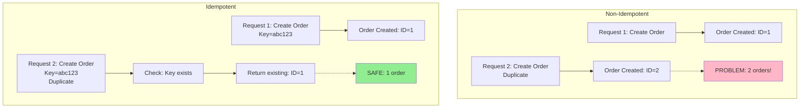
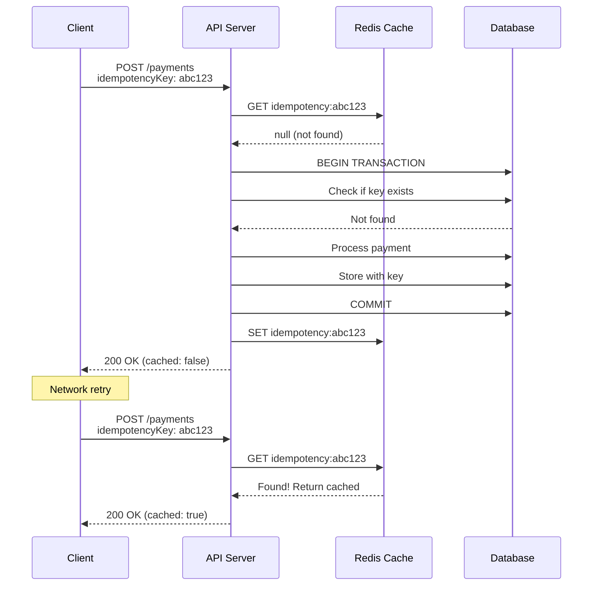
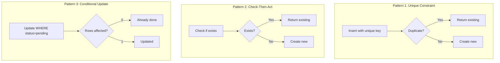
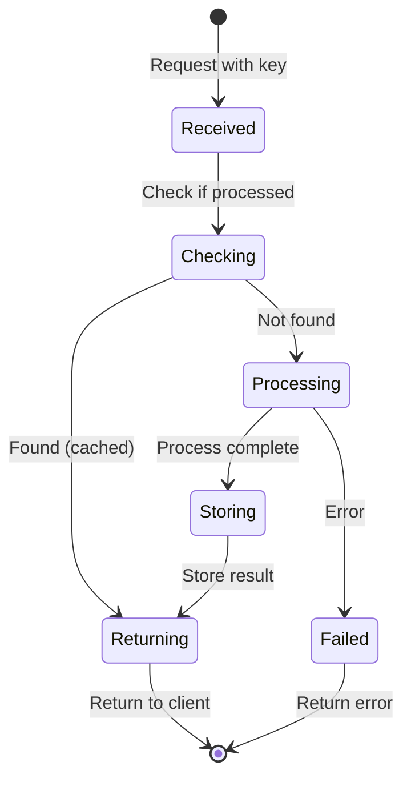

# Idempotency

## 1. Why this exists (Real-world problem first)

Your payment API receives duplicate requests due to network retries. User clicks "Pay" button. Request times out. User clicks again. Both requests process. Customer charged twice for $500. The problem? API endpoints aren't idempotent—processing the same request twice produces different results.

**Real production failures from non-idempotent operations:**

1. **The Double Payment Disaster**: Mobile app payment screen has "Pay Now" button. User clicks, network slow, no response. User clicks 3 more times. All 4 requests reach server. All 4 process successfully. Customer charged $1,200 instead of $300. Happens to 200 customers during peak traffic. $180K in duplicate charges. Refund process takes 3 weeks. App store rating drops from 4.5 to 2.1 stars. Team doesn't understand "why did it charge multiple times?"

2. **The Inventory Chaos**: Order API decrements inventory on every request. Load balancer retries failed requests automatically. One order request retried 3 times. Inventory decremented 3 times. Product shows -2 stock. Oversell by 2 units. Customers receive "out of stock" emails after payment. Manual inventory reconciliation required across 50,000 products.

3. **The Email Spam Storm**: User registration sends welcome email. API gateway has retry logic (3 retries). Network hiccup causes retries. User receives 4 welcome emails. Happens to 10,000 new users. 40,000 emails sent. Email provider flags account for spam. Email delivery blocked for 24 hours. Can't send critical password reset emails.

4. **The Account Creation Duplicate**: User signup API creates account on every request. Mobile app retries on timeout. Creates 3 accounts with same email. Login fails (multiple accounts found). User can't access service. Support manually merges accounts. 500 affected users. 40 hours of support time.

**What breaks without idempotency:**
- Duplicate requests cause duplicate side effects
- Can't safely retry failed operations
- Network issues cause data corruption
- Can't handle at-least-once message delivery
- Don't understand idempotency patterns
- Fail to design safe APIs

## 2. Mental model (build imagination)

Think of idempotency as a **Light Switch**.

### The Light Switch Analogy

**Non-Idempotent (Toggle Switch)**:
- First press: Light ON
- Second press: Light OFF
- Third press: Light ON
- Same action, different results each time
- Can't safely retry

**Idempotent (Set Switch)**:
- Press "ON": Light ON
- Press "ON" again: Light still ON (no change)
- Press "ON" 100 times: Light still ON
- Same action, same result every time
- Safe to retry

**The Flow:**

**Non-Idempotent Operation:**
1. Request 1: Create order → Order created
2. Request 2 (duplicate): Create order → Another order created!
3. Result: 2 orders instead of 1

**Idempotent Operation:**
1. Request 1 (ID: abc123): Create order → Order created
2. Request 2 (ID: abc123): Create order → Already exists, return existing
3. Result: 1 order (safe)

**Why this matters:**
- Idempotent operations can be safely retried
- Same input always produces same result
- Essential for distributed systems
- Enables at-least-once delivery
- Prevents duplicate processing

## 3. How Node.js implements this internally

### Idempotent API Endpoint (Idempotency Key)

```javascript
const express = require('express');
const app = express();
const db = require('./database');

// Idempotent payment endpoint
app.post('/payments', async (req, res) => {
  const { amount, token, idempotencyKey } = req.body;
  
  if (!idempotencyKey) {
    return res.status(400).json({ error: 'idempotencyKey required' });
  }
  
  try {
    // Check if already processed
    const existing = await db.payments.findOne({
      idempotencyKey
    });
    
    if (existing) {
      // Return cached result (idempotent)
      return res.json({
        id: existing.id,
        amount: existing.amount,
        status: existing.status,
        cached: true
      });
    }
    
    // Process payment atomically
    const payment = await db.transaction(async (trx) => {
      // Create payment record first
      const [paymentRecord] = await trx('payments').insert({
        idempotencyKey,
        amount,
        status: 'processing'
      }).returning('*');
      
      // Charge via Stripe (Stripe has built-in idempotency)
      const charge = await stripe.charges.create({
        amount,
        source: token,
        idempotency_key: idempotencyKey
      });
      
      // Update payment status
      await trx('payments')
        .where({ id: paymentRecord.id })
        .update({
          status: 'completed',
          chargeId: charge.id
        });
      
      return { ...paymentRecord, status: 'completed', chargeId: charge.id };
    });
    
    res.json({
      id: payment.id,
      amount: payment.amount,
      status: payment.status,
      cached: false
    });
  } catch (err) {
    console.error('Payment failed:', err);
    res.status(500).json({ error: err.message });
  }
});
```

### Idempotent Message Consumer

```javascript
const amqp = require('amqplib');

class IdempotentConsumer {
  async start() {
    const connection = await amqp.connect('amqp://localhost');
    const channel = await connection.createChannel();
    
    await channel.assertQueue('orders', { durable: true });
    
    channel.consume('orders', async (msg) => {
      const order = JSON.parse(msg.content.toString());
      const messageId = msg.properties.messageId;
      
      try {
        // Idempotent processing
        await this.processOrderIdempotently(order, messageId);
        channel.ack(msg);
      } catch (err) {
        console.error('Processing failed:', err);
        channel.nack(msg, false, true);
      }
    }, { noAck: false });
  }
  
  async processOrderIdempotently(order, messageId) {
    return db.transaction(async (trx) => {
      // Check if already processed
      const processed = await trx('processed_orders')
        .where({ messageId })
        .first();
      
      if (processed) {
        console.log(`Order ${messageId} already processed`);
        return processed;
      }
      
      // Process order
      await trx('inventory')
        .where({ productId: order.productId })
        .decrement('quantity', order.quantity);
      
      await trx('orders').insert({
        id: order.id,
        productId: order.productId,
        quantity: order.quantity,
        status: 'completed'
      });
      
      // Mark as processed
      await trx('processed_orders').insert({
        messageId,
        orderId: order.id,
        processedAt: new Date()
      });
      
      return order;
    });
  }
}
```

### Idempotent Database Updates

```javascript
// NON-IDEMPOTENT: Increment (calling twice increments twice)
await db.users.update(
  { id: userId },
  { $inc: { loginCount: 1 } }
);

// IDEMPOTENT: Set to specific value
await db.users.update(
  { id: userId },
  { lastLoginAt: new Date() }
);

// IDEMPOTENT: Conditional update (only if not already done)
await db.users.updateOne(
  { id: userId, status: 'pending' },
  { $set: { status: 'active' } }
);

// IDEMPOTENT: Upsert with unique constraint
await db.users.upsert({
  email: 'user@example.com',
  name: 'John Doe',
  createdAt: new Date()
}, {
  conflictTarget: 'email',
  updateOnConflict: false // Don't update if exists
});
```

### Idempotency with Redis Cache

```javascript
const Redis = require('ioredis');
const redis = new Redis();

app.post('/orders', async (req, res) => {
  const { items, idempotencyKey } = req.body;
  
  if (!idempotencyKey) {
    return res.status(400).json({ error: 'idempotencyKey required' });
  }
  
  try {
    // Check Redis cache first (fast)
    const cached = await redis.get(`idempotency:${idempotencyKey}`);
    
    if (cached) {
      return res.json({
        ...JSON.parse(cached),
        cached: true
      });
    }
    
    // Process order
    const order = await db.orders.create({
      items,
      status: 'processing'
    });
    
    // Process payment
    await processPayment(order);
    
    // Update order
    await db.orders.update(order.id, { status: 'completed' });
    
    const result = {
      orderId: order.id,
      status: 'completed'
    };
    
    // Cache result (expire after 24 hours)
    await redis.setex(
      `idempotency:${idempotencyKey}`,
      24 * 60 * 60,
      JSON.stringify(result)
    );
    
    res.json({ ...result, cached: false });
  } catch (err) {
    console.error('Order failed:', err);
    res.status(500).json({ error: err.message });
  }
});
```

### Common Misunderstandings

**Mistake 1**: "GET requests don't need idempotency"
- **Reality**: GET should be idempotent (read-only)
- **Impact**: Side effects in GET requests break caching

**Mistake 2**: "Idempotency means no duplicates"
- **Reality**: Idempotency means same result, not preventing duplicates
- **Impact**: Confusion about what idempotency guarantees

**Mistake 3**: "Database transactions provide idempotency"
- **Reality**: Transactions provide atomicity, not idempotency
- **Impact**: Duplicate requests still process twice

## 4. Multiple diagrams (MANDATORY)

### Diagram 1: Non-Idempotent vs Idempotent



### Diagram 2: Idempotent API Flow



### Diagram 3: Idempotency Patterns



### Diagram 4: Idempotency Key Lifecycle



## 5. Where this is used in real projects

### Payment Processing (Stripe-style Idempotency)

```javascript
const express = require('express');
const app = express();

app.post('/api/charges', async (req, res) => {
  const { amount, source } = req.body;
  const idempotencyKey = req.headers['idempotency-key'];
  
  if (!idempotencyKey) {
    return res.status(400).json({
      error: 'Idempotency-Key header required'
    });
  }
  
  try {
    // Check if already processed
    let charge = await db.charges.findOne({ idempotencyKey });
    
    if (charge) {
      // Return cached result
      return res.json({
        id: charge.id,
        amount: charge.amount,
        status: charge.status,
        idempotent_replayed: true
      });
    }
    
    // Process new charge
    charge = await db.transaction(async (trx) => {
      // Create charge record
      const [record] = await trx('charges').insert({
        idempotencyKey,
        amount,
        source,
        status: 'pending'
      }).returning('*');
      
      // Call payment processor
      const result = await paymentProcessor.charge({
        amount,
        source,
        idempotency_key: idempotencyKey
      });
      
      // Update status
      await trx('charges')
        .where({ id: record.id })
        .update({
          status: result.status,
          processorId: result.id
        });
      
      return { ...record, status: result.status };
    });
    
    res.json({
      id: charge.id,
      amount: charge.amount,
      status: charge.status,
      idempotent_replayed: false
    });
  } catch (err) {
    console.error('Charge failed:', err);
    res.status(500).json({ error: err.message });
  }
});
```

### Order Creation (Idempotent with Unique Constraint)

```javascript
app.post('/api/orders', async (req, res) => {
  const { items, userId } = req.body;
  const idempotencyKey = req.headers['idempotency-key'] || 
                         `${userId}-${Date.now()}-${Math.random()}`;
  
  try {
    // Use database unique constraint for idempotency
    const order = await db.orders.create({
      idempotencyKey, // Unique constraint on this column
      userId,
      items,
      total: calculateTotal(items),
      status: 'pending'
    });
    
    // Trigger async processing
    await eventBus.publish('order.created', order);
    
    res.status(201).json(order);
  } catch (err) {
    if (err.code === '23505') { // Unique constraint violation
      // Order already exists, return it
      const existing = await db.orders.findOne({ idempotencyKey });
      return res.json(existing);
    }
    
    throw err;
  }
});
```

### Inventory Updates (Conditional Idempotency)

```javascript
class InventoryService {
  async reserveItems(orderId, items) {
    return db.transaction(async (trx) => {
      // Check if already reserved
      const existing = await trx('inventory_reservations')
        .where({ orderId })
        .first();
      
      if (existing) {
        console.log(`Items for order ${orderId} already reserved`);
        return existing;
      }
      
      // Reserve items
      for (const item of items) {
        const result = await trx('inventory')
          .where({ productId: item.productId })
          .where('quantity', '>=', item.quantity)
          .decrement('quantity', item.quantity);
        
        if (result === 0) {
          throw new Error(`Insufficient inventory for ${item.productId}`);
        }
      }
      
      // Record reservation
      const [reservation] = await trx('inventory_reservations')
        .insert({
          orderId,
          items,
          reservedAt: new Date()
        })
        .returning('*');
      
      return reservation;
    });
  }
  
  async releaseItems(orderId) {
    return db.transaction(async (trx) => {
      // Check if reservation exists
      const reservation = await trx('inventory_reservations')
        .where({ orderId, status: 'active' })
        .first();
      
      if (!reservation) {
        console.log(`No active reservation for order ${orderId}`);
        return null;
      }
      
      // Release items
      for (const item of reservation.items) {
        await trx('inventory')
          .where({ productId: item.productId })
          .increment('quantity', item.quantity);
      }
      
      // Mark as released (idempotent)
      await trx('inventory_reservations')
        .where({ orderId })
        .update({ status: 'released', releasedAt: new Date() });
      
      return reservation;
    });
  }
}
```

### Webhook Handling (Idempotent Event Processing)

```javascript
app.post('/webhooks/stripe', async (req, res) => {
  const event = req.body;
  const eventId = event.id;
  
  try {
    // Check if already processed
    const processed = await db.webhookEvents.findOne({ eventId });
    
    if (processed) {
      console.log(`Event ${eventId} already processed`);
      return res.json({ received: true, processed: true });
    }
    
    // Process event atomically
    await db.transaction(async (trx) => {
      // Handle event
      switch (event.type) {
        case 'payment_intent.succeeded':
          await handlePaymentSuccess(event.data.object, trx);
          break;
        case 'payment_intent.failed':
          await handlePaymentFailure(event.data.object, trx);
          break;
      }
      
      // Mark as processed
      await trx('webhook_events').insert({
        eventId,
        type: event.type,
        processedAt: new Date()
      });
    });
    
    res.json({ received: true, processed: false });
  } catch (err) {
    console.error('Webhook processing failed:', err);
    res.status(500).json({ error: err.message });
  }
});
```

## 6. Where this should NOT be used

### Read Operations (Already Idempotent)

```javascript
// WRONG: Idempotency key for GET
app.get('/users/:id', async (req, res) => {
  const idempotencyKey = req.headers['idempotency-key'];
  // Unnecessary! GET is already idempotent
  const user = await db.users.findById(req.params.id);
  res.json(user);
});

// RIGHT: No idempotency key needed
app.get('/users/:id', async (req, res) => {
  const user = await db.users.findById(req.params.id);
  res.json(user);
});
```

### Internal Operations (No External Retries)

```javascript
// WRONG: Idempotency for internal function
async function calculateTotal(items) {
  const idempotencyKey = generateKey();
  // Unnecessary complexity
}

// RIGHT: Just make it pure/deterministic
function calculateTotal(items) {
  return items.reduce((sum, item) => sum + item.price * item.quantity, 0);
}
```

## 7. Failure modes & edge cases

### Failure Mode 1: Idempotency Key Collision

**Scenario**: Two different requests use same key

```javascript
// User A: Create order with key "abc123"
// User B: Create order with key "abc123"
// User B gets User A's order!

// SOLUTION: Include user ID in key
const idempotencyKey = `${userId}-${clientGeneratedId}`;
```

### Failure Mode 2: Partial Processing

**Scenario**: Process succeeds, storing key fails

```javascript
// WRONG: Non-atomic
await processPayment(payment);
await db.idempotencyKeys.insert({ key }); // Fails
// Payment processed but key not stored, will process again!

// RIGHT: Atomic transaction
await db.transaction(async (trx) => {
  await processPayment(payment, trx);
  await trx('idempotency_keys').insert({ key });
});
```

### Failure Mode 3: Cache Expiration

**Scenario**: Cached result expires, request retried

```javascript
// WRONG: Short TTL
await redis.setex(`idempotency:${key}`, 60, result); // 1 minute
// If client retries after 1 minute, processes again!

// RIGHT: Long TTL or permanent storage
await redis.setex(`idempotency:${key}`, 24 * 60 * 60, result); // 24 hours
// Or store in database permanently
```

## 8. Trade-offs & alternatives

### Idempotency Keys

**Gain**: Safe retries, prevents duplicates, simple to implement
**Sacrifice**: Storage overhead, complexity, key management
**When**: Payment APIs, order creation, critical operations

### Unique Constraints

**Gain**: Database-enforced, no extra code, fast
**Sacrifice**: Limited to unique fields, error handling needed
**When**: Natural unique identifiers exist (email, order ID)

### Conditional Updates

**Gain**: Simple, no extra storage, database-level
**Sacrifice**: Only works for updates, not creates
**When**: State transitions (pending → active)

## 9. Interview-level articulation

**Q: "What is idempotency and why is it important?"**

**A**: "Idempotency means an operation can be safely repeated multiple times with the same result. For example, setting a user's status to 'active' is idempotent—doing it twice has the same effect as doing it once. Incrementing a counter is not idempotent—doing it twice increments by 2. Idempotency is critical in distributed systems because networks are unreliable. If a payment request times out, the client doesn't know if it succeeded or failed. With idempotency, the client can safely retry using the same idempotency key. The server checks if it already processed that key and returns the cached result instead of processing again. This prevents duplicate charges, duplicate orders, and data corruption from retries."

**Q: "How do you implement idempotency in an API?"**

**A**: "I implement idempotency using idempotency keys. The client generates a unique key (usually a UUID) and sends it in a header like 'Idempotency-Key'. Before processing the request, I check if I've seen that key before. If yes, I return the cached result. If no, I process the request and store the result with the key atomically in a database transaction. For performance, I cache results in Redis with a 24-hour TTL. For example, in a payment API, I'd check Redis first for the key, then the database. If found, return cached. If not, process payment, store result in database with key, cache in Redis, then return. This ensures duplicate requests with the same key always get the same response."

## 10. Key takeaways (engineer mindset)

### What to Remember

1. **Idempotency**: Same input → same result (safe to retry)
2. **Idempotency keys**: Client-generated unique IDs
3. **Check before process**: Look up key before doing work
4. **Atomic storage**: Store result + key together
5. **Cache results**: Redis for fast duplicate detection
6. **TTL strategy**: Long enough for retry window
7. **Natural idempotency**: Use unique constraints when possible

### What Decisions This Enables

**API design decisions**:
- Which endpoints need idempotency
- How to generate and validate keys
- Cache vs database for key storage

**Reliability decisions**:
- Safe retry strategies
- Handling network failures
- Preventing duplicate processing

**Performance decisions**:
- Redis caching for fast lookups
- TTL for cache expiration
- Database indexing on keys

### How It Connects to Other Node.js Concepts

**At-Least-Once Delivery** (Topic 22):
- Idempotency enables safe at-least-once delivery
- Prevents duplicate processing from redelivery

**Message Brokers** (Topic 21):
- Message consumers must be idempotent
- Handle duplicate message delivery

**Distributed Transactions** (Topic 29):
- Idempotency simplifies transaction handling
- Reduces need for complex coordination

### The Golden Rule

**Make all write operations idempotent**. Use idempotency keys for API endpoints. Check if already processed before doing work. Store result and key atomically. Cache in Redis for performance. Use long TTL (24 hours minimum). Leverage database unique constraints when natural unique identifiers exist.
